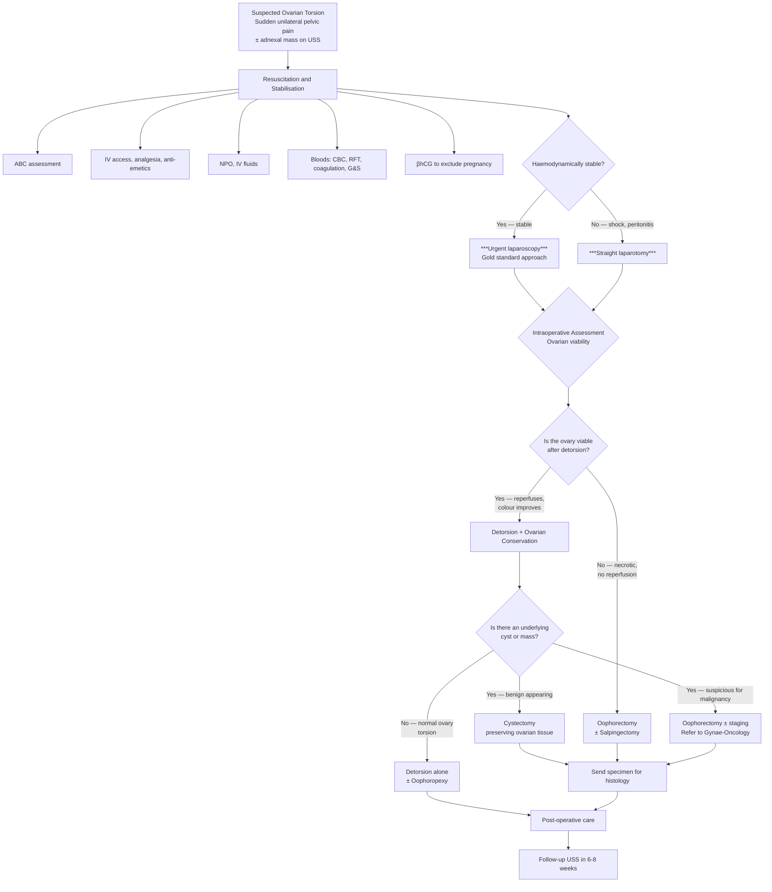

## Management of Ovarian Torsion

### Overarching Principles

Before diving into specifics, let's establish the management philosophy from first principles:

1. **Time is gonad** — ovarian torsion is a surgical emergency. The longer the delay to detorsion, the greater the ischaemic damage and the lower the chance of ovarian salvage. Current evidence suggests the ovary can tolerate ischaemia for longer than the testis (hours to even days in some cases), but earlier intervention = better outcomes.
2. **Conservative surgery (ovarian-sparing) is preferred** — the modern approach favours detorsion ± cystectomy with ovarian conservation over oophorectomy, especially in reproductive-age women and children. Even a dusky/blue-black ovary at surgery may recover function after detorsion.
3. **The previously held fear that untwisting a necrotic ovary causes thromboembolism is now considered unfounded** — multiple large studies have shown no increased risk of PE/DVT after detorsion of even necrotic-appearing ovaries. This historical concern led to unnecessary oophorectomies for decades.
4. ***Shock, severe pain (peritoneal signs) — may require straight laparotomy*** [7] — haemodynamic instability mandates immediate resuscitation and surgical intervention, potentially via laparotomy rather than laparoscopy.

---

### Management Algorithm

---

### Phase 1: Initial Resuscitation and Stabilisation

This follows the standard surgical acute abdomen protocol: ***Diet – NPO, IV fluid; Activity – bed rest; Vitals – resuscitate early; Ix – as indicated; Drugs – as indicated*** [21].

#### 1a. Airway, Breathing, Circulation (ABC)

- Assess haemodynamic stability: BP, pulse, capillary refill, peripheral perfusion.
- If ***signs of hypovolaemic shock*** [4] (from rare haemorrhagic rupture of torted ovary) → **resuscitate immediately:**
  - ***High flow O₂ with BVM with reservoir*** [22].
  - ***Obtain large bore IV access (14/16G at antecubital vein)*** [22].
  - ***Take blood for CBC, RFT, clotting, T/S*** [22].
  - ***Give rapid fluid challenge: 500 mL or 1000 mL crystalloid solution (balanced or NS) over 5–10 min*** [22].
  - ***Reassess BP/P every 5 min → repeat fluid challenge if not responding*** [22].
  - ***Consider Foley's catheter for UO monitoring*** (target > 0.5 mL/kg/h) [21].

#### 1b. NPO (Nil Per Os)

- **Why?** The patient will likely need general anaesthesia for surgery. Eating/drinking increases aspiration risk during intubation. Standard pre-operative fasting: 6 hours for solids, 2 hours for clear fluids.
- ***NPO; IV fluid: routinely 2D1S Q8h*** [21] — maintenance fluids while fasting.

#### 1c. Analgesia

- **Why is adequate analgesia critical?** Severe visceral pain triggers vagal responses (nausea, vomiting, bradycardia) and sympathetic activation (tachycardia, hypertension). Uncontrolled pain also impairs clinical assessment.
- **Options:**
  - **Paracetamol** (1 g IV) — first-line, safe, minimal side effects.
  - **NSAIDs** (e.g., ketorolac 30 mg IV or diclofenac 75 mg IM) — effective for visceral/inflammatory pain via prostaglandin synthesis inhibition. Avoid if concern for haemorrhage (antiplatelet effect) or renal impairment.
  - **Opioids** (e.g., morphine 2–5 mg IV titrated, or fentanyl) — for severe pain unresponsive to non-opioids. Use with caution (respiratory depression, ileus).
  - **Anti-emetics** (e.g., ondansetron 4 mg IV) — for nausea/vomiting, which is common due to autonomic stimulation from visceral pain.

> **Historical myth debunked:** The old teaching that you should not give analgesia before surgical assessment (to avoid "masking signs") is now considered outdated and unethical. Adequate analgesia actually *improves* clinical assessment by allowing proper examination of a patient who is not writhing in agony.

#### 1d. Antibiotics

- **Prophylactic IV antibiotics** — standard pre-operative surgical prophylaxis (e.g., IV cefazolin 2 g within 60 minutes of skin incision).
- If there is suspicion of **established necrosis/infection** (high fever, markedly elevated WBC, peritonitis), broader spectrum coverage is warranted (e.g., IV ceftriaxone + IV metronidazole for anaerobic coverage).

#### 1e. Pre-operative Workup

| Investigation | Purpose |
|---|---|
| CBC | Baseline Hb (for potential haemorrhage), WBC (necrosis/infection) |
| Coagulation profile | Pre-operative safety |
| Group and Save / Crossmatch | In case of intraoperative haemorrhage |
| RFT | Baseline renal function; hydration status |
| βhCG | Exclude pregnancy — affects surgical planning and anaesthetic management |
| Pelvic USS (if not already done) | Confirm adnexal mass; assess Doppler flow; look for free fluid |
| ECG | Pre-anaesthetic assessment (especially if > 40 years) |
| Chest X-ray | Pre-anaesthetic (if indicated by age/comorbidities) |

---

### Phase 2: Definitive Surgical Management

***Ovarian cyst complications, pregnancy complications*** require ***emergency management*** [23]. The definitive treatment of ovarian torsion is **surgical**.

#### 2a. Surgical Approach: Laparoscopy vs Laparotomy

| Approach | Indications | Advantages | Disadvantages |
|---|---|---|---|
| ***Laparoscopy*** [1] | **First-line approach** for all haemodynamically stable patients | Minimally invasive; shorter hospital stay; less post-operative pain; faster recovery; better cosmesis; excellent pelvic visualisation | Requires trained surgeon; may be challenging if massive ovarian enlargement or dense adhesions; pneumoperitoneum contraindicated in some situations |
| ***Straight laparotomy*** [7] | ***Shock, severe pain (peritoneal signs)*** [7]; massive ovarian mass; suspected malignancy requiring staging; laparoscopy not technically feasible | Better access for large masses; full staging if malignancy suspected; can handle massive haemorrhage | Larger incision; more post-operative pain; longer recovery; higher wound complication rate |

> ***Laparoscopy*** [1] is the modern gold standard. The lecture glossary explicitly lists ***Laparoscopy 腹腔鏡*** [1] as a key procedure in gynaecological emergencies. In current practice (2025–2026), the vast majority of ovarian torsion cases are managed laparoscopically.

#### 2b. Intraoperative Steps

**Step 1: Entry and Inspection**
- Standard laparoscopic entry (Veress needle or Hassan open technique at the umbilicus).
- Inspect the pelvis: identify the torted ovary, assess the degree of torsion (number of turns), assess the contralateral ovary, uterus, tubes, and appendix.
- ***Intraoperative finding: A 7 cm left ovarian cyst with torsion for 1.5 turn. Uterus and right ovary normal*** [1].
- ***Ovarian cyst → appreciate there is torsion of the stalk / infundibulopelvic ligament*** [15].

**Step 2: Detorsion**
- **Untwist the ovary** by grasping it gently with atraumatic forceps and rotating it back to its anatomical position.
- This is the critical manoeuvre — restoring the vascular pedicle to its normal orientation allows blood flow to resume.
- The principle is identical to testicular torsion: ***detorsion → assess viability*** [10].

**Step 3: Assess Ovarian Viability**
- After detorsion, wait **10–15 minutes** and observe for signs of reperfusion:

| Sign | Interpretation |
|---|---|
| **Colour change from dusky blue/black to pink/red** | Viable — blood flow is restored; the ovary is reperfusing |
| **Bleeding from ovarian surface when incised** | Viable — active circulation confirmed |
| ***Satisfactory perfusion of left ovary noted after detorsion*** [1] | Viable — proceed to ovarian conservation |
| **Remains black/necrotic, no colour change, no bleeding** | Non-viable — oophorectomy required |
| **Intraoperative Doppler** (if available) | Can assess for return of flow, though visual assessment is usually sufficient |

> This is analogous to testicular torsion assessment: ***wrap in warm gauze – observe if it gets redder, incise on tunica albuginea for fresh bleeding*** [10]. The same principle applies to the ovary.

<Callout title="Modern Practice – Detorsion Even of Black Ovaries" type="idea">
Current evidence strongly supports detorsion even when the ovary appears black/necrotic. Studies show that >90% of ovaries that appear non-viable at surgery actually recover function within weeks to months. The dark colour is due to venous congestion and haemorrhagic infarction of the cortex, but the deeper ovarian tissue (medulla, follicles) may still be viable. Therefore, **do NOT perform oophorectomy based solely on ovarian colour** — always attempt detorsion first and reassess. The only exceptions are clear signs of irreversible necrosis (frank pus, tissue fragmentation) or suspected malignancy.
</Callout>

**Step 4: Address the Underlying Pathology**

| Scenario | Surgical Procedure | Rationale |
|---|---|---|
| **Viable ovary + benign-appearing cyst** | ***Cystectomy*** [1] — excise the cyst while preserving the remaining ovarian tissue | Removes the cause of torsion (the mass that made the ovary heavy/unstable) while conserving ovarian function (fertility, hormones). ***Cystectomy performed*** [1] in the lecture case. |
| **Viable ovary + no cyst (normal ovary torsion)** | Detorsion alone ± **oophoropexy** (fixing the ovary to the pelvic sidewall or uterosacral ligament with sutures) | Prevents recurrence by anchoring the ovary so it cannot twist again. Most relevant in children/adolescents with normal ovary torsion. |
| **Viable ovary + cyst suspicious for malignancy** | Oophorectomy ± full staging (omentectomy, peritoneal biopsies, peritoneal washings) | If there are features concerning for malignancy (solid components, papillary projections, irregular wall, ascites), the ovary should NOT be opened (risk of tumour spillage). Refer to gynaecological oncology. |
| **Non-viable ovary** | **Oophorectomy** ± **salpingectomy** (if the tube is also necrotic) | Non-viable tissue must be removed to prevent infection, abscess, and sepsis. |
| **Post-menopausal woman** | **Oophorectomy** (± bilateral salpingo-oophorectomy) | No fertility preservation needed; removes risk of recurrence and potential underlying malignancy. |

**Step 5: Specimen Handling**
- ***Sebum and hair found inside the cyst*** [1] — all excised tissue (cyst contents, ovarian tissue) is sent for histopathological examination.
- ***Pathology: Mature cystic teratoma of left ovary*** [1] — histology confirms the final diagnosis and excludes malignancy (e.g., immature teratoma).

**Step 6: Inspect the Contralateral Ovary**
- Assess the contralateral ovary for any cysts or masses that might predispose to future torsion.
- Unlike testicular torsion (where bilateral orchidopexy is standard), routine contralateral oophoropexy is not standard practice unless there is a bilateral predisposing condition (e.g., bilateral dermoid cysts).

---

#### 2c. Special Situations

##### Torsion in Pregnancy

| Consideration | Detail |
|---|---|
| **Timing** | Most common in first trimester (corpus luteum cyst) and after ovarian hyperstimulation |
| **Surgical approach** | Laparoscopy is safe in pregnancy (especially 1st and early 2nd trimester). After ~16 weeks, open surgery or modified port placement may be needed as the uterus enlarges. |
| **Anaesthetic concerns** | Left lateral tilt to avoid aortocaval compression (after 20 weeks); aspiration prophylaxis (progesterone relaxes the lower oesophageal sphincter). |
| **CO₂ pneumoperitoneum** | Use low insufflation pressures (10–12 mmHg) to minimise effects on fetal perfusion and maternal venous return. |
| **Corpus luteum preservation** | Before 10–12 weeks, the corpus luteum is essential for progesterone production to maintain the pregnancy. If oophorectomy is required before 10–12 weeks, **exogenous progesterone supplementation** is mandatory to prevent miscarriage. After 12 weeks, the placenta takes over progesterone production (luteo-placental shift). |
| **Fetal monitoring** | Intraoperative fetal heart rate monitoring if viable gestational age (generally > 24 weeks). |

##### Torsion in Children / Adolescents

| Consideration | Detail |
|---|---|
| **Normal ovary torsion** | More common in this age group (elongated ligaments, no adhesions). |
| **Conservative approach** | Detorsion ± oophoropexy. Ovarian conservation is paramount to preserve future fertility and endocrine function. |
| **Examination** | ***Do not PV on your own (consult Gynae!!)*** [10] — vaginal examination is inappropriate in prepubertal children; use TAS (not TVS). |
| **Avoid unnecessary oophorectomy** | Even necrotic-appearing ovaries in children should undergo detorsion first; recovery rates are high. |

##### Suspected Malignancy

- ***Management complicated, depends on many factors. If operable, want to operate first → time-sensitive operation, therapeutic and diagnostic*** [24].
- If malignancy is suspected (USS features: solid components, papillary projections, ascites, elevated CA125), **do NOT perform cystectomy** (risk of rupturing a malignant cyst → tumour spillage → upstaging).
- Instead: **intact oophorectomy** via an endobag (to prevent spillage) → frozen section intraoperatively → if malignant, proceed to full staging (***laparotomy, full staging procedure by a trained gynaecological oncologist*** [16]).
- ***TAH + BSO + omentectomy + peritoneal cytology*** [16] — the standard staging procedure for confirmed ovarian malignancy (not performed for benign torsion).

---

### Phase 3: Post-operative Care

| Aspect | Details |
|---|---|
| **Analgesia** | Regular paracetamol ± NSAIDs; opioids as rescue. Multimodal analgesia reduces opioid requirements. |
| **Diet** | Clear fluids once awake; advance to normal diet as tolerated (usually within 24 hours for laparoscopy). |
| **Mobilisation** | Early mobilisation (day of surgery for laparoscopy) — reduces VTE risk, ileus, and respiratory complications. |
| **VTE prophylaxis** | Mechanical (TED stockings, pneumatic compression devices) ± pharmacological (LMWH e.g., enoxaparin 40 mg SC daily) based on risk assessment. |
| **Antibiotics** | Continue only if there was established necrosis/infection. Otherwise, a single pre-operative prophylactic dose is sufficient. |
| **Histology results** | Review pathology results within 1–2 weeks. If malignancy found unexpectedly (e.g., immature teratoma, borderline tumour), refer to gynaecological oncology for further management. |
| **Follow-up** | USS at 6–8 weeks to assess ovarian morphology and blood flow, confirm recovery of the conserved ovary, and ensure no recurrence. |

---

### Phase 4: Prevention of Recurrence

| Strategy | Details |
|---|---|
| **Cystectomy of the predisposing lesion** | Removing the cyst eliminates the mass effect that caused torsion. Most important preventive measure. |
| **Oophoropexy** | Suturing the ovary to the pelvic sidewall or uterosacral ligament. Considered in: (1) normal ovary torsion, (2) recurrent torsion, (3) remaining ovary in a patient who has lost the contralateral ovary. Evidence is limited but increasingly practiced. |
| **Shortening the utero-ovarian ligament** | Plication of the ligament reduces the "pendulum length" and limits ovarian mobility. Less commonly performed. |
| **Surveillance of known ovarian cysts** | Patients with known ovarian cysts that are managed conservatively (e.g., functional cysts expected to resolve) should be counselled about torsion symptoms and instructed to seek emergency care if sudden pain occurs. |

---

### Treatment Modalities — Contraindications Summary

| Treatment | Indications | Contraindications / Cautions |
|---|---|---|
| **Laparoscopic detorsion + cystectomy** | First-line for all stable patients with benign-appearing cysts | Haemodynamic instability; suspected malignancy requiring full staging; very large masses not amenable to laparoscopic extraction; lack of laparoscopic expertise |
| **Laparotomy** | Haemodynamic instability; suspected malignancy; technically not feasible laparoscopically | None absolute — but higher morbidity than laparoscopy, so avoided if laparoscopy is feasible |
| **Oophorectomy** | Non-viable ovary after attempted detorsion; post-menopausal women; suspected malignancy | Should NOT be performed based solely on ovarian appearance (blue/black colour) without attempting detorsion first in reproductive-age women |
| **Oophoropexy** | Normal ovary torsion (especially children); recurrent torsion; solitary remaining ovary | Risk of chronic pain from fixation sutures; may distort tubo-ovarian anatomy and impair fertility (theoretical concern — not proven) |
| **Conservative (non-operative) management** | NOT an option for confirmed torsion | Torsion is a surgical condition; non-operative management risks permanent ovarian loss, necrosis, peritonitis, and sepsis |

<Callout title="What NOT to Do" type="error">
1. **Do NOT delay surgery waiting for "better" imaging** — if clinical suspicion is high, operate.
2. **Do NOT perform oophorectomy without attempting detorsion** — even black-looking ovaries can recover.
3. **Do NOT open a cyst if malignancy is suspected** — risk of tumour spillage and upstaging.
4. **Do NOT forget βhCG** — torsion in early pregnancy requires special considerations (corpus luteum preservation, progesterone supplementation if oophorectomy performed before 12 weeks).
5. **Do NOT PV a child** — use TAS; consult gynaecology.
</Callout>

---

### Key Comparison: Management of Ovarian Torsion vs Testicular Torsion

Understanding the parallel helps consolidate learning:

| Aspect | Ovarian Torsion | Testicular Torsion |
|---|---|---|
| **Surgical approach** | ***Laparoscopy*** [1] (first-line) | Open scrotal exploration |
| **Detorsion** | Laparoscopic detorsion | ***Urgent scrotal exploration, detorsion*** [10] |
| **Viability assessment** | Observe colour change after detorsion; wait 10–15 min | ***Wrap in warm gauze, observe if it gets redder, incise on tunica albuginea for fresh bleeding*** [10] |
| **Viable** | Detorsion ± cystectomy ± oophoropexy | ***Bilateral orchidopexy*** [10] |
| **Non-viable** | Oophorectomy | ***Orchidectomy*** [10] |
| **Contralateral fixation** | Not routine (unless specific indication) | ***Bilateral orchidopexy*** is standard [10] |
| **Manual detorsion** | Not typically attempted (ovary not accessible externally) | ***Attempt manual detorsion if emergency OT not available*** [10] |
| **Time window** | Longer tolerance (hours to days — though earlier = better) | ***Viability decreases after 6h; irreversible damage after 12h*** [10][14] |

---

<Callout title="High Yield Summary – Management of Ovarian Torsion">

1. **Ovarian torsion is a surgical emergency** — the goal is urgent detorsion to salvage the ovary.
2. **Resuscitate first (ABC):** NPO, IV access, analgesia, anti-emetics, IV fluids, bloods including βhCG and Group & Save.
3. ***Laparoscopy*** is the gold standard surgical approach for stable patients.
4. ***Straight laparotomy*** for haemodynamically unstable patients or suspected malignancy requiring staging.
5. **Detorsion → assess viability → address underlying pathology** is the intraoperative sequence.
6. **Ovarian conservation is preferred** — even black/necrotic-appearing ovaries should be detorted; > 90% recover function.
7. ***Cystectomy*** preserving ovarian tissue for benign cysts; ***oophorectomy*** only if truly non-viable or suspicious for malignancy.
8. **In pregnancy:** preserve corpus luteum before 12 weeks; if oophorectomy is necessary before 12 weeks, give exogenous progesterone.
9. **In children:** ovarian conservation is paramount; do not perform PV examination.
10. **Suspected malignancy:** do NOT open the cyst; intact oophorectomy → frozen section → full staging if malignant.
11. **Follow-up:** histology review + USS at 6–8 weeks.

</Callout>

---

<ActiveRecallQuiz
  title="Active Recall - Management of Ovarian Torsion"
  items={[
    {
      question: "What are the initial resuscitation steps for a woman presenting with suspected ovarian torsion and peritoneal signs?",
      markscheme: "ABC assessment. High flow oxygen. Large bore IV access (14-16G antecubital). Bloods: CBC, RFT, coagulation, group and save, beta-hCG. Rapid fluid challenge: 500-1000 mL crystalloid over 5-10 min, reassess and repeat if needed. NPO. Analgesia and anti-emetics. Foley catheter for urine output monitoring. Prepare for urgent surgery (laparotomy if unstable, laparoscopy if stable)."
    },
    {
      question: "Why is detorsion attempted even when the ovary appears black and necrotic at laparoscopy?",
      markscheme: "More than 90% of ovaries that appear non-viable (black/dusky) at surgery actually recover function within weeks to months. The dark colour is due to venous congestion and superficial haemorrhagic infarction of the cortex, but the deeper ovarian tissue (medulla and follicles) may still be viable. Additionally, the historical concern that detorsion of a necrotic ovary causes thromboembolism has been disproven by multiple large studies. Therefore, always attempt detorsion first and reassess viability before deciding on oophorectomy."
    },
    {
      question: "A woman at 8 weeks gestation undergoes emergency oophorectomy for ovarian torsion with a non-viable ovary. What additional pharmacological intervention is critical and why?",
      markscheme: "Exogenous progesterone supplementation is critical. Before 10-12 weeks gestation, the corpus luteum is the primary source of progesterone needed to maintain the pregnancy (decidualisation of endometrium, suppression of uterine contractions). Oophorectomy removes the corpus luteum. Without progesterone supplementation, the pregnancy will likely miscarry. After 12 weeks, the placenta takes over progesterone production (luteo-placental shift), so this is less of a concern."
    },
    {
      question: "Compare the first-line surgical approach for ovarian torsion versus testicular torsion. Why can manual detorsion be attempted for testicular but not ovarian torsion?",
      markscheme: "Ovarian torsion: laparoscopy (first-line) - ovary is an intra-abdominal organ. Testicular torsion: open scrotal exploration. Manual detorsion can be attempted for testicular torsion because the testis is externally accessible (can be palpated and manually rotated through the scrotum). The ovary is an intra-abdominal organ that cannot be accessed externally, so manual detorsion is not possible - surgical intervention (laparoscopy or laparotomy) is always required."
    },
    {
      question: "When should you NOT perform cystectomy during surgery for ovarian torsion and what should you do instead?",
      markscheme: "Do NOT perform cystectomy if malignancy is suspected (USS features: solid components, papillary projections, irregular wall, ascites, increased vascularity, elevated CA125). Opening or rupturing a malignant cyst risks tumour spillage into the peritoneal cavity, which upstages the cancer. Instead, perform intact oophorectomy using an endobag to prevent spillage. Send for frozen section intraoperatively. If malignant, proceed to full staging (laparotomy, TAH + BSO + omentectomy + peritoneal cytology) by a trained gynaecological oncologist."
    },
    {
      question: "List 3 strategies for preventing recurrence of ovarian torsion after initial surgical management.",
      markscheme: "1) Cystectomy of the predisposing lesion - removes the mass that made the ovary heavy and prone to rotation. 2) Oophoropexy - suturing the ovary to the pelvic sidewall or uterosacral ligament to limit mobility; especially in normal ovary torsion, recurrent torsion, or solitary remaining ovary. 3) Surveillance of known ovarian cysts with patient education about torsion symptoms - instruct to seek emergency care if sudden pelvic pain occurs."
    }
  ]}
/>

## References

[1] Lecture slides: Block C - Gyanecological Emergency Notes to Students.pdf (Cards 13–19, Glossary)
[4] Senior notes: Ryan Ho Fundamentals.pdf (p273)
[7] Lecture slides: GC 118. Pelvic mass ovarian cancer and cysts; uterine fibroid; pelvic imaging.pdf (p24)
[10] Senior notes: Maksim Surgery Notes.pdf (p328)
[14] Senior notes: Ryan Ho Urogenital.pdf (p233)
[15] Lecture slides: Block C - Pelvic mass_ ovarian cancer and cysts; uterine fibroid; pelvic imaging.pdf (p41)
[16] Lecture slides: GC 118. Pelvic mass ovarian cancer and cysts; uterine fibroid; pelvic imaging.pdf (p68)
[21] Senior notes: Ryan Ho Fundamentals.pdf (p280)
[22] Senior notes: Ryan Ho Critical Care.pdf (p21)
[23] Lecture slides: Block C - Pelvic mass_ ovarian cancer and cysts; uterine fibroid; pelvic imaging.pdf (p18)
[24] Lecture slides: Block C - Pelvic mass_ ovarian cancer and cysts; uterine fibroid; pelvic imaging.pdf (p57)
