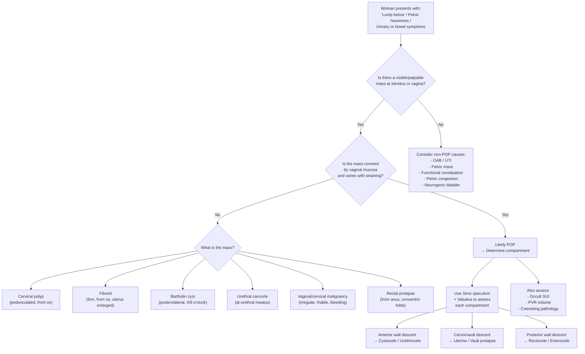

## Differential Diagnosis of Pelvic Organ Prolapse (POP)

When a woman presents with the constellation of **"a lump below," pelvic heaviness, urinary symptoms, and/or bowel symptoms**, POP is high on the differential — but it is not the only diagnosis. The differential diagnosis must be approached systematically from two angles:

1. **What else could mimic the presenting symptoms of POP?** (i.e., DDx of the symptom complex)
2. **What else could cause a mass at the introitus/vaginal canal?** (i.e., DDx of the physical finding)

Additionally, within a confirmed POP, you must classify **which compartment(s)** are involved — ***classify based on compartment of vagina that is weakened → Anterior → cystourethrocele; Middle → uterine / vault prolapse; Posterior → rectocele*** [5] — because the management differs by compartment.

---

### 1. Differential Diagnosis of a "Lump at the Introitus / Vaginal Mass"

This is the clinical scenario you will most commonly face: a woman says "I felt a lump below" or a mass is seen protruding from the vagina on examination.

#### 1.1 Gynaecological Causes

| Condition | Key Distinguishing Features | Why it can mimic POP |
|-----------|---------------------------|---------------------|
| **Pelvic organ prolapse (the diagnosis itself)** | Mass varies with straining/position; reducible; smooth vaginal wall covering; compartment-specific (cystocele, uterine, rectocele) | The most common cause of a vaginal mass in a parous, postmenopausal woman |
| **Cervical polyp** | Small, smooth, red/pink pedunculated mass arising from the cervical os; often causes intermenstrual/postcoital bleeding | Can protrude through the introitus and be mistaken for early cervical prolapse, but it arises from the cervical canal (not a descent of the entire cervix) |
| **Uterine fibroid (pedunculated submucous)** | Firm, round mass protruding through the cervical os; may be necrotic/infected; uterus enlarged on bimanual exam | A pedunculated submucous fibroid can prolapse through the os and appear as a vaginal mass. ***Uterine fibroid is an important differential diagnosis of pelvic mass*** [9][10] |
| **Cervical/vaginal malignancy** | Irregular, friable, bleeding mass; hard and fixed; foul-smelling discharge; weight loss; postmenopausal bleeding | Advanced cervical or vaginal carcinoma can present as a mass at the introitus; biopsy is essential if suspicious |
| **Bartholin's cyst/abscess** | Unilateral, tense, cystic swelling at the posterolateral introitus (4 or 8 o'clock position); tender if infected | Located at the introitus but distinctly lateral and does not vary with straining |
| **Vaginal cyst (Gartner's duct cyst, inclusion cyst)** | Smooth, non-tender, cystic swelling on the anterolateral vaginal wall; does not change with Valsalva | Can feel like a cystocele but is a discrete cyst within the vaginal wall, not a fascial defect |
| **Urethral diverticulum** | Tender anterior vaginal wall mass; discharge of pus from urethra on compression ("milking" the urethra); dysuria, dyspareunia | Located anteriorly and may mimic a small cystocele, but it is a focal outpouching from the urethra |
| **Vaginal vault granulation tissue (post-hysterectomy)** | Small, red, friable tissue at the vaginal vault; bleeds easily; history of recent hysterectomy | May be mistaken for early vault prolapse |

#### 1.2 Non-Gynaecological Causes

| Condition | Key Distinguishing Features | Why it can mimic POP |
|-----------|---------------------------|---------------------|
| **Rectal prolapse** | Full-thickness rectal mucosa protruding through the anus (NOT the vagina); concentric mucosal folds; may coexist with POP | Can be confused with a large rectocele or procidentia if the patient cannot distinguish between vaginal and anal protrusion. Key distinction: rectal prolapse has **concentric folds**, while a rectocele bulges through the **posterior vaginal wall** |
| **Pelvic/abdominal mass pushing organs down** | History of abdominal distension; pelvic mass palpable bimanually or on abdominal exam; USS/imaging confirms | A large ***ovarian mass, uterine fibroid, or other pelvic mass*** [9][10] can push the pelvic organs downward, mimicking or causing secondary prolapse |
| **Urethral caruncle** | Small, red, fleshy, tender mass at the urethral meatus; common in postmenopausal women; bleeding on contact | Located specifically at the urethral meatus; can be mistaken for a small urethrocele |
| **Imperforate hymen with haematocolpos (in adolescents)** | Bulging, bluish membrane at introitus; primary amenorrhoea; cyclical pelvic pain | Relevant in young patients — the distended vagina can mimic a vaginal mass |

<Callout title="Don't Forget Pregnancy!" type="error">
***Don't forget about pregnancy → especially for teenage girls*** [9]. In any woman of reproductive age presenting with a "pelvic mass" or symptoms that could suggest POP, always exclude pregnancy first (urine β-hCG). A gravid uterus can present as a pelvic mass and can exacerbate pre-existing prolapse.
</Callout>

---

### 2. Differential Diagnosis of the Symptom Complex

POP rarely presents with just a mass — it presents with a constellation of urinary, bowel, vaginal, and sexual symptoms. Each symptom has its own differential:

#### 2.1 DDx of Urinary Symptoms in a Woman with Suspected POP

***Mrs Wong presented with urinary retention, urinary frequency, sensation of incomplete emptying, and straining to void*** [5]. These urinary symptoms are not unique to POP.

| Symptom | DDx Beyond POP | How to Distinguish |
|---------|---------------|-------------------|
| **Urinary frequency + urgency** | Overactive bladder (OAB/detrusor overactivity), UTI, interstitial cystitis, bladder stone, bladder cancer, DM (polyuria) | OAB: urgency is the dominant symptom, no mass. UTI: dysuria, pyuria, positive culture. Interstitial cystitis: chronic pain, dx of exclusion [8][11]. Bladder cancer: painless haematuria, older patient. |
| **Stress urinary incontinence** | Urethral hypermobility without POP, intrinsic sphincter deficiency (ISD), mixed incontinence | SUI can occur independently of POP due to isolated urethral sphincter dysfunction. Urodynamics helps distinguish [8]. |
| **Urinary retention (AROU)** | ***Mechanical causes: BPH (not in females), CA bladder neck, urethral stricture, stones, clots; POP; pelvic/GI masses; pregnancy*** [12]. ***Functional causes: neurological (spinal cord compression, peripheral neuropathy, stroke), drug-induced (sympathomimetics, anticholinergics), post-operative*** [12]. | In females, POP is the most common mechanical cause of AROU. ***DM → innervation to pelvic floor impaired*** [5] can cause detrusor underactivity contributing to retention. Always check for neurological causes (especially cauda equina syndrome — a surgical emergency). |
| **Overflow incontinence** | Detrusor underactivity (neurogenic bladder, DM neuropathy), bladder outlet obstruction [8] | PVR measurement is key; urodynamics to confirm |

<Callout title="AROU in Females — Key DDx" type="idea">
In females, the causes of AROU differ from males [12][13]:
- ***Detrusor underactivity is more common*** [13] (vs. BOO in males)
- ***Obstructive causes include: organ prolapse (e.g., cystocele), gynaecological tumours (e.g., fibroid)*** [13]
- ***Drug-induced causes***: always check medication history — ***sympathomimetics (ephedrine, phenylephrine in cough mixture), anticholinergics (atropine)*** [12]
- ***Neurological causes***: must rule out spinal cord compression (cauda equina) — check perianal sensation, anal tone, lower limb neurology
</Callout>

#### 2.2 DDx of Bowel Symptoms

| Symptom | DDx Beyond POP | How to Distinguish |
|---------|---------------|-------------------|
| Obstructed defecation / Need to splint | Functional constipation, rectal intussusception, rectal prolapse, pelvic floor dyssynergia, colorectal mass | If no vaginal mass: consider non-POP causes. Defecating proctography or dynamic MRI can delineate anatomy. |
| Faecal incontinence | Anal sphincter injury (obstetric), pudendal neuropathy, rectal prolapse, neurological disease | Endoanal USS to assess sphincter integrity; anorectal manometry |

#### 2.3 DDx of Pelvic Heaviness / Dragging Sensation

| DDx | How to Distinguish |
|-----|-------------------|
| POP | Mass visible/palpable on straining; characteristic positional symptoms |
| Chronic pelvic pain / Pelvic congestion syndrome | Dull aching pelvic pain, worse premenstrually, varicosities on vulva; no mass on examination |
| Pelvic mass (fibroid, ovarian tumour) | Bimanual exam reveals discrete mass; USS confirms; ***history and physical examination usually help to suggest a diagnosis*** [10] |
| Endometriosis | Cyclical pain, dysmenorrhoea, dyspareunia; tenderness on examination; may have uterosacral nodularity |

---

### 3. Differentiating Between Compartments of POP

Once POP is confirmed, the critical next step is to determine **which compartment(s)** are involved, as this guides management. This is essentially a "differential within the diagnosis."

| Feature | Anterior (Cystocele/Urethrocele) | Apical (Uterine/Vault Prolapse) | Posterior (Rectocele/Enterocele) |
|---------|--------------------------------|-------------------------------|-------------------------------|
| **Vaginal wall** | Anterior wall bulges | Cervix/vault descends | Posterior wall bulges |
| **Mass characteristics** | Soft, smooth; may express urine on compression | Cervix visible at/beyond introitus; elongated or normal cervix | Soft; may feel stool in the pouch on rectal exam |
| **Dominant urinary sx** | Frequency, retention, SUI, incomplete emptying | Can cause retention if severe (drags bladder) | Less common unless coexistent cystocele |
| **Dominant bowel sx** | Less common | Less common | Obstructed defecation, need to splint, incomplete evacuation |
| **Examination** | Bulge of anterior wall with posterior speculum retracting posterior wall | Cervix descends toward/beyond introitus on straining | Bulge of posterior wall with anterior speculum retracting anterior wall |
| **Sims speculum use** | Retract posterior wall → assess anterior | Assess descent of cervix/vault | Retract anterior wall → assess posterior |

***Internal organ prolapse, resulting in AROU → classify based on compartment of vagina that is weakened: Anterior → cystourethrocele; Middle → uterine / vault prolapse; Posterior → rectocele*** [5].

---

### 4. Differential Diagnosis Algorithm

---

### 5. Key Diagnostic Pitfalls and Associations

#### 5.1 Occult Stress Incontinence

As emphasized in the previous section, ***remember the possibility of occult stress incontinence in case of severe prolapse*** [3][7]. A large prolapse kinks the urethra → the patient appears dry. This is not a different diagnosis — it is a **masked** coexisting condition. If you repair the prolapse without addressing the SUI, the patient will be incontinent postoperatively.

#### 5.2 Coexisting Pelvic Pathology

***The uterus was small and the adnexae were clear*** [5] — this is documented to **rule out** coexistent pelvic pathology. Always consider:
- ***Uterine fibroid, ovarian mass and cancer are important differential diagnoses of pelvic mass*** [10]
- Cervical malignancy (especially in a woman with a chronically prolapsed, ulcerated cervix — the ulcer should be biopsied to exclude malignancy)
- ***Don't forget about pregnancy*** [9]

#### 5.3 Differentiating Rectocele from Enterocele

This is a common exam question. Both cause posterior vaginal wall descent, but:

| Feature | Rectocele | Enterocele |
|---------|-----------|------------|
| **Contents** | Rectum | Small bowel / omentum |
| **Location** | Lower posterior wall | Upper posterior wall / apex |
| **Rectal exam** | Finger enters the bulge through the rectal wall | Finger does NOT enter the bulge (it is above the rectovaginal septum) |
| **Transillumination** | Negative (solid stool) | May be positive (bowel/fluid) |
| **Impulse on cough** | Less marked | More marked (bowel is more mobile) |
| **Post-hysterectomy** | Less common as isolated finding | More common (pouch of Douglas herniates) |

#### 5.4 Differentiating Rectal Prolapse from Rectocele/Procidentia

| Feature | Rectal Prolapse | POP (Rectocele/Procidentia) |
|---------|----------------|---------------------------|
| **Protrusion from** | Anus | Vagina |
| **Mucosal folds** | Concentric (full thickness rectal wall) | Rugose vaginal mucosa |
| **Lumen** | Visible rectal lumen centrally | No lumen visible |
| **Associated symptoms** | Faecal incontinence, mucus discharge per rectum | Vaginal mass, urinary symptoms |

<Callout title="High Yield DDx Approach for Exams">
When asked for the differential diagnosis of POP in an exam, structure your answer as:

1. **Confirm POP and classify by compartment** (anterior, apical, posterior — this IS part of the DDx)
2. **Other causes of vaginal/introital mass**: cervical polyp, prolapsed fibroid, Bartholin cyst, urethral caruncle, vaginal/cervical malignancy, vaginal cyst
3. **Other causes of the presenting symptoms**: OAB, UTI, neurogenic bladder, functional constipation, pelvic mass, pelvic congestion
4. **Exclude sinister pathology**: cervical/vaginal/bladder malignancy (especially if ulcerated/bleeding)
5. **Exclude pregnancy** in reproductive-age women
6. **Identify occult SUI** in severe prolapse
</Callout>

---

<ActiveRecallQuiz
  title="Active Recall - DDx of Pelvic Organ Prolapse"
  items={[
    {
      question: "A 66-year-old woman presents with a mass at the introitus, urinary retention, and incomplete emptying. What is the differential diagnosis for her gynaecological problem and how do you classify the prolapse?",
      markscheme: "DDx: Pelvic organ prolapse (most likely), prolapsed submucous fibroid, cervical polyp, vaginal/cervical malignancy. Classify POP by compartment: Anterior (cystourethrocele), Middle/Apical (uterine/vault prolapse), Posterior (rectocele/enterocele). Also consider non-gynaecological causes of retention: neurogenic bladder (DM neuropathy), drug-induced, spinal cord pathology.",
    },
    {
      question: "How do you differentiate a rectocele from an enterocele on clinical examination?",
      markscheme: "Rectocele: lower posterior vaginal wall bulge, rectal exam finger enters the bulge, contains rectum (stool may be palpated), negative transillumination. Enterocele: upper posterior wall/apex bulge, finger does NOT enter on rectal exam (above rectovaginal septum), may contain small bowel (positive transillumination, cough impulse), more common post-hysterectomy.",
    },
    {
      question: "Name three non-POP causes of a mass at the vaginal introitus and give one distinguishing feature for each.",
      markscheme: "1) Cervical polyp: small, pedunculated, red, arises from cervical os, causes intermenstrual bleeding. 2) Prolapsed submucous fibroid: firm, round, from cervical os, uterus enlarged. 3) Bartholin cyst/abscess: unilateral, posterolateral at 4 or 8 o'clock, does not vary with straining. Others acceptable: urethral caruncle (at urethral meatus), vaginal cyst (anterolateral, does not change with Valsalva), cervical/vaginal malignancy (irregular, friable, bleeding).",
    },
    {
      question: "What causes of AROU in females differ from those in males?",
      markscheme: "In females: detrusor underactivity is more common than BOO (opposite in males). Obstructive causes include organ prolapse (cystocele) and gynaecological tumours (fibroid), rather than BPH/prostate cancer. Voiding in females depends more on pelvic floor relaxation (lower physiological bladder outlet resistance) and detrusor contraction is usually weaker (~20 cmH2O vs ~60 cmH2O in males). Drug-induced and neurological causes are shared.",
    },
    {
      question: "Why must you always assess for occult stress incontinence before prolapse surgery, and how do you test for it?",
      markscheme: "A large prolapse can kink the urethra and mask underlying SUI. If prolapse is repaired without addressing this, the patient becomes incontinent postoperatively. Test by reducing the prolapse (manually or with a pessary) and performing a cough stress test with a comfortably full bladder. If urine leaks on coughing after reduction, occult SUI is confirmed and concurrent anti-incontinence surgery should be considered.",
    },
  ]}
/>

---

## References

[3] Lecture slides: GC 116. I felt a lump below urinary incontinence in females; genital prolapse.pdf (p37, p74)
[5] Lecture slides: Block C - O&G Theme Case 4.pdf (p2, p4)
[7] Lecture slides: Block C - I felt a lump below_ urinary incontinence in females; genital prolapse.pdf (p65)
[8] Senior notes: Ryan Ho Urogenital.pdf (p159–160 – Approach to Urinary Incontinence)
[9] Lecture slides: Block C - Pelvic mass_ ovarian cancer and cysts; uterine fibroid; pelvic imaging.pdf (p17)
[10] Lecture slides: GC 118. Pelvic mass ovarian cancer and cysts; uterine fibroid; pelvic imaging.pdf (p71)
[11] Senior notes: Ryan Ho Urogenital.pdf (p121 – Approach to Dysuria)
[12] Senior notes: Maksim Surgery Notes.pdf (p310 – AROU causes)
[13] Senior notes: Ryan Ho Urogenital.pdf (p164 – AROU in females); Ryan Ho Fundamentals.pdf (p349 – AROU in females)
