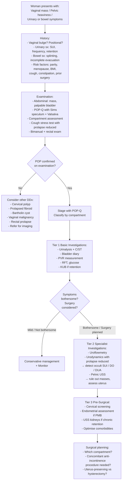

## Diagnosis of Pelvic Organ Prolapse (POP) — Diagnostic Criteria, Algorithm and Investigations

### 1. Overview of the Diagnostic Approach

POP is fundamentally a **clinical diagnosis** — it is made by history and physical examination. There is no single blood test or imaging study that "diagnoses" POP. The role of investigations is to:

1. **Quantify and stage** the prolapse (POP-Q examination)
2. **Assess the functional impact** on the urinary and bowel systems (bladder diary, PVR, urodynamics)
3. **Rule out coexistent/confounding pathology** (UTI, pelvic masses, malignancy, neurological causes)
4. **Plan for surgery** — particularly to detect occult stress incontinence and assess detrusor function

***Describe the basic investigations for urinary incontinence and pelvic organ prolapse*** — this is a core learning objective [5].

---

### 2. Diagnostic Criteria

There is no single "diagnostic criteria" checklist for POP in the way that, say, rheumatoid arthritis has ACR/EULAR criteria. Instead, the diagnosis rests on a combination of:

| Component | What Constitutes the Diagnosis |
|-----------|-------------------------------|
| **Symptoms** | Vaginal bulge/mass, pelvic heaviness, dragging sensation — symptoms that correlate with anatomical descent (see Clinical Features section) |
| **Signs** | Demonstrable descent of one or more vaginal compartments on Valsalva, quantified by POP-Q staging |
| **POP-Q staging** | Stage ≥ II (leading edge within 1 cm of the hymen) is generally considered the threshold for **clinically significant** prolapse, as this is when symptoms typically begin. Stage 0 and I are common incidental findings in parous women and are usually asymptomatic. |
| **Symptom-bother correlation** | The degree of prolapse must correlate with the patient's symptoms and impact on quality of life. POP is only a clinical problem when it bothers the patient. |

<Callout title="Clinically Significant POP" type="idea">
The key threshold is whether the leading edge reaches the hymen. Most expert guidelines (IUGA, ICS, NICE 2019, ACOG) agree that **POP-Q Stage ≥ II** (leading edge at or beyond the hymen) correlates best with symptoms. Stage I prolapse on examination alone, without symptoms, does NOT require treatment or even a formal diagnosis in most cases.
</Callout>

---

### 3. The Clinical Examination — The Cornerstone of Diagnosis

#### 3.1 Setting Up the Examination

- **Position**: Dorsal lithotomy (standard) or left lateral (Sims' position — useful if lithotomy is difficult for elderly patients). If prolapse is not demonstrable in lithotomy but the patient describes a mass, examine in the **standing position**.
- **Bladder**: Should be **comfortably full** (not empty — SUI will be missed; not overdistended — uncomfortable and may exaggerate findings).
- **Manoeuvre**: Ask the patient to **strain/bear down (Valsalva)** or **cough** to reproduce maximal descent.

#### 3.2 Systematic Compartment Assessment Using Sims Speculum

A **Sims speculum** (a single-bladed retractor) is the instrument of choice — NOT a Cusco bivalve speculum, because you need to retract one vaginal wall at a time to assess each compartment independently.

| Step | Technique | What You Are Assessing |
|------|-----------|----------------------|
| 1 | Retract **posterior** wall with Sims speculum → observe anterior wall on straining | **Anterior compartment**: cystocele, urethrocele |
| 2 | Retract **anterior** wall with Sims speculum → observe posterior wall on straining | **Posterior compartment**: rectocele, enterocele |
| 3 | Remove speculum → observe descent of cervix/vault on straining | **Apical compartment**: uterine prolapse, vault prolapse |
| 4 | Perform **cough stress test** with prolapse reduced (Sims speculum supporting vaginal walls) | **Occult stress incontinence** — ***remember the possibility of occult stress incontinence in case of severe prolapse*** [3][7] |

#### 3.3 POP-Q Measurement

The POP-Q system (described in the Classification section) is used to formally stage the prolapse. The six vaginal points (Aa, Ba, C, D, Ap, Bp) and three measurements (gh, pb, tvl) are recorded. This provides:
- **Reproducible staging** (Stage 0–IV)
- **Compartment-specific data** (you know exactly where the defect is)
- **Baseline for monitoring** (can track progression or response to treatment)

#### 3.4 Complementary Clinical Tests During Examination

| Test | Purpose | Technique | Interpretation |
|------|---------|-----------|---------------|
| **Cough stress test** | Detect SUI or occult SUI | Patient coughs with comfortably full bladder; repeat with prolapse reduced | Urine leakage = positive → SUI present. ***There was evidence of urine leakage upon straining (stress urinary incontinence)*** [5] |
| **Bimanual examination** | Rule out pelvic masses | Bimanual palpation of uterus and adnexae | ***The uterus was small and the adnexae were clear*** [5] |
| **Rectal examination** | Assess rectocele extent, anal sphincter tone, rectal masses | Finger in rectum while examining posterior vaginal wall | Finger enters bulge = rectocele; does not enter = enterocele (above septum). Also assess resting and squeeze anal tone. ***Test reflexes: anal reflex, bulbocavernosus reflex (BCR, S2-4)*** [8] |
| **Post-void residual** | Assess completeness of bladder emptying | Catheterisation or USS after voiding | PVR > 100 mL = significant; suggests outlet obstruction (cystocele kinking urethra) or detrusor underactivity |

---

### 4. Investigation Modalities

Investigations are ordered in a **stepwise fashion** — from basic bedside tests to specialised studies reserved for complex or surgical cases.

#### 4.1 Tier 1: Basic/Bedside Investigations (All Patients)

| Investigation | Why | Key Findings | Interpretation |
|--------------|-----|-------------|----------------|
| ***Urinalysis + Urine C/ST*** [5][8][14] | Rule out UTI (which can cause frequency/urgency mimicking POP symptoms); rule out haematuria (which may indicate bladder pathology) | Leucocytes, nitrites, bacteria, RBCs | Positive culture → treat UTI before attributing symptoms to POP. ***Urine for C/ST*** [5] — ***AROU → Foley insertion + documentation of first catheterisation urine volume, send urine for c/st*** [5] |
| ***Bladder diary (voiding diary / frequency-volume chart)*** [8][14][15] | Quantify voiding pattern, fluid intake, episodes of incontinence; essential for differentiating types of incontinence | Record for ≥ 3 days: time and volume of each void, fluid intake, incontinence episodes, pad usage, triggers | Frequency > 8 voids/day = abnormal. Nocturia ≥ 2 = significant. Nocturnal polyuria (> 33% of 24h output at night) = nocturnal polyuria rather than OAB. ***Bladder diary: record the frequency and volume of fluid drank/voided*** [8] |
| **Post-void residual (PVR)** | Assess incomplete emptying; detect overflow incontinence/retention | Measured by in-out catheterisation or bladder USS | PVR < 50 mL = normal. PVR 50–100 mL = borderline. PVR > 100 mL = significant residual → suspect outlet obstruction (cystocele) or detrusor underactivity. ***The bladder was full and palpable in the suprapubic region*** [5] → suggests retention |
| **Blood tests: RFT, fasting glucose** | ***RFT (obstructive uropathy)*** [14][15] — chronic retention from severe POP can cause back-pressure on kidneys. ***Glucose (DM is a RF)*** [14][15] — DM neuropathy contributes to detrusor underactivity. ***DM → innervation to pelvic floor impaired*** [5] | Elevated creatinine → obstructive uropathy. Elevated glucose → undiagnosed/poorly controlled DM | Elevated RFT warrants upper tract imaging (USS kidneys) to rule out hydronephrosis |
| ***KUB (plain abdominal X-ray)*** [5] | Quick screen for faecal loading (constipation), bladder distension, urinary tract calculi | Radio-opaque stones, faecal loading, soft tissue mass | ***AROU → Foley insertion... KUB*** [5] — part of immediate workup for urinary retention |

#### 4.2 Tier 2: Specialised Investigations (Selected Patients)

These are used when diagnosis is unclear, symptoms are complex, surgery is being planned, or there is concern about coexisting pathology.

##### 4.2.1 Uroflowmetry

| Feature | Detail |
|---------|--------|
| **What** | Non-invasive measurement of urine flow rate — the patient voids into a flowmeter |
| **Why** | Screens for bladder outlet obstruction (BOO); helps differentiate obstructive from non-obstructive voiding dysfunction [14][15] |
| **Requirements** | ***Volume voided > 150 mL to be representative of usual voiding habit*** [15] |
| **Key parameters** | ***Peak urine flow rate (Qmax)***: normal ≥ 15 mL/s in women. ***Post-void residual volume*** [15] |
| **Interpretation** | Qmax < 15 mL/s = suggestive of BOO. Abnormal flow pattern (plateau or intermittent) = obstruction or straining. High PVR = incomplete emptying. ***Uroflowmetry: screening for BOO (does not rule out DUA!)*** [14][15] |
| **Limitation** | Cannot distinguish BOO from detrusor underactivity (DUA) — both give low flow. Need urodynamics to differentiate [14][15] |

##### 4.2.2 Urodynamic Studies (UDS)

| Feature | Detail |
|---------|--------|
| **What** | The **gold standard** for assessing lower urinary tract function — measures bladder pressure, abdominal pressure, and flow simultaneously [14][15] |
| **Why for POP** | To confirm the type of incontinence (SUI vs UUI vs mixed), assess detrusor function, detect occult SUI, and plan surgery |
| **Procedure** | ***Contrast injection into bladder via catheter. While voiding, measure: intravesical pressure (cystometrogram), rectal pressure (surrogate for intra-abdominal pressure), detrusor pressure = intravesical – intra-abdominal pressure, uroflow rate, bladder volume, ± contrast cystogram*** [14][15] |
| **Key findings in POP context** | |
| Urodynamic stress incontinence (USI) | Leakage demonstrated on coughing/straining in the absence of detrusor contraction → confirms ***urodynamic stress incontinence*** [5] |
| Detrusor overactivity (DO) | Involuntary detrusor contractions during filling phase → confirms urge incontinence component |
| Voiding phase obstruction | ↓uroflow + ↑detrusor pressure → ***BOO*** [14][15]; ↓uroflow + ↓detrusor pressure → ***hypocontractile detrusor (DUA)*** [14][15] |
| Occult SUI | With prolapse reduced (by pessary or speculum during UDS), provoked leakage on cough → confirms occult SUI |
| **Indication in POP** | ***Urodynamics: gold-standard for dx of BOO*** [14][15]. Indicated when: surgery is planned (especially if mixed symptoms), previous surgery failed, neurological disease suspected, uncertain diagnosis after basic evaluation |

<Callout title="Urodynamic Stress Incontinence vs Clinical Stress Incontinence">
**Clinical SUI** = the patient reports leakage with cough/exertion (a symptom).
***Urodynamic stress incontinence (USI)*** = leakage is objectively demonstrated during urodynamic testing on provocation (cough/strain), with no concurrent detrusor contraction (a urodynamic diagnosis) [5].
USI is the more precise diagnosis and is what you confirm before offering surgical treatment for SUI. The theme case learning objective specifically states: ***Describe the typical symptom and sign of urodynamic stress incontinence and pelvic organ prolapse and their common association in a woman*** [5].
</Callout>

##### 4.2.3 Pelvic Ultrasound

| Feature | Detail |
|---------|--------|
| **Modalities** | ***Trans-abdominal USS (TAUS)*** vs ***Transvaginal USS (TVUS)*** [16] |
| **TAUS** | ***4-5 MHz (lower frequency for better penetration). Require full bladder (as acoustic window). Advantages: panoramic view — good for large masses, larger coverage. Usually preferred as 1st line (less invasive)*** [16] |
| **TVUS** | ***Up to 10 MHz. Full bladder not required. Smaller field of view — improved resolution and contrast, better anatomical details, reduced attenuation*** [16] |
| **Why for POP** | (1) Rule out pelvic masses (fibroid, ovarian mass) contributing to or mimicking POP. ***PV detect left adnexal mass... which investigation is most appropriate? → Transvaginal US*** [16]. (2) Assess uterine size and morphology (relevant if hysterectomy planned). (3) Assess PVR (non-invasive alternative to catheterisation). (4) Translabial/transperineal USS can directly visualise levator ani, measure levator hiatal area, and assess bladder neck mobility — increasingly used in research and specialised centres. |
| **Key findings** | Uterine fibroids, ovarian cysts/masses, PVR volume, endometrial thickness (in postmenopausal women with bleeding) |

##### 4.2.4 Imaging — CT / MRI

| Modality | When to Use in POP | Key Findings |
|----------|-------------------|-------------|
| **MRI Pelvis** | Complex or recurrent POP; preoperative planning for multi-compartment prolapse; suspected levator avulsion; research settings. Dynamic MRI (MRI defecography) can visualise all three compartments simultaneously during Valsalva. | Levator ani defects/avulsion, fascial defects, multi-compartment descent, pelvic masses |
| **CT Abdomen/Pelvis** | Not routinely used for POP itself. Used if: suspecting upper tract obstruction (hydronephrosis from chronic retention), pelvic mass, malignancy workup | Hydronephrosis, pelvic masses, incidental findings |

##### 4.2.5 Cystoscopy

| Feature | Detail |
|---------|--------|
| **When** | If haematuria is present (to rule out bladder malignancy); suspected bladder pathology (stones, fistula, diverticulum); recurrent UTIs |
| **Not routine** for straightforward POP |
| **Findings** | Bladder trabeculation (from chronic obstruction), bladder stones, tumour, fistula |

##### 4.2.6 Defecating Proctography / Dynamic MRI

| Feature | Detail |
|---------|--------|
| **When** | Significant posterior compartment symptoms (obstructed defecation, need to splint) not adequately explained by clinical exam |
| **What** | Fluoroscopic imaging during defecation (or dynamic MRI equivalent) — visualises rectocele, enterocele, intussusception, pelvic floor descent in real-time |
| **Limitation** | Invasive, not widely available; reserved for complex cases |

#### 4.3 Tier 3: Pre-Surgical Assessment

Before any surgical intervention for POP, the following must be completed:

| Assessment | Purpose |
|-----------|---------|
| POP-Q staging | Formal documentation of prolapse degree/compartment |
| Urodynamics with prolapse reduced | Detect occult SUI → ***If surgery is indicated, surgery for both conditions may be needed*** [3][7] |
| Pelvic USS | Rule out concurrent pelvic pathology; assess uterine size |
| Cervical screening status | Ensure up-to-date (especially if hysterectomy planned) |
| Endometrial assessment | If postmenopausal bleeding present → TVUS endometrial thickness ± endometrial biopsy (to rule out endometrial cancer before hysterectomy) |
| Renal function + upper tract imaging | If chronic retention or elevated PVR → USS kidneys to rule out hydronephrosis |
| Optimisation of comorbidities | Treat chronic cough, constipation, control DM, weight loss — these affect surgical outcomes and recurrence |

---

### 5. Diagnostic Algorithm

---

### 6. Summary Table: Investigations in POP

| Investigation | When | What It Tells You | Key Points |
|--------------|------|-------------------|------------|
| **POP-Q examination** | All patients | Stage and compartment of prolapse | Clinical gold standard; hymen is reference point |
| **Urinalysis + C/ST** | All patients | Rule out UTI | Must treat UTI before attributing symptoms to POP |
| **Bladder diary** | All patients with urinary symptoms | Voiding pattern, fluid intake, incontinence episodes | ≥ 3 days; helps differentiate OAB vs SUI vs nocturnal polyuria |
| **PVR** | All patients with voiding difficulty | Completeness of emptying | > 100 mL = significant; suggests obstruction or DUA |
| **RFT, glucose** | All patients | Renal function, DM status | Elevated creatinine → upper tract imaging |
| **KUB** | If retention/acute presentation | Stones, faecal loading, bladder distension | Part of AROU workup |
| **Uroflowmetry** | If voiding symptoms prominent | Screens for BOO | Does not differentiate BOO from DUA |
| **Urodynamics** | Pre-surgical; complex/mixed symptoms; previous failed surgery | Type of incontinence, detrusor function, occult SUI | Gold standard. Must reduce prolapse during testing. |
| **Pelvic USS** | Pre-surgical; suspected pelvic mass | Uterine/adnexal pathology, PVR | TVUS for detail; TAUS for panoramic view |
| **MRI pelvis** | Complex/recurrent POP; research | Levator morphology, multi-compartment anatomy | Dynamic MRI = "defecography" |
| **Cystoscopy** | If haematuria; suspected bladder pathology | Rule out bladder cancer, stones, fistula | Not routine for POP |

<Callout title="Investigation Pearls for Exams" type="error">
Common mistakes:
1. **Ordering CT or MRI for straightforward POP** — this is unnecessary. POP is a clinical diagnosis. Imaging is reserved for complex cases, suspected masses, or pre-surgical planning.
2. **Forgetting to test for occult SUI** before prolapse surgery — this is a must-do. If you miss it, the patient will be incontinent post-operatively.
3. **Not sending urine for C/ST** — UTI symptoms overlap with POP symptoms. Always exclude UTI.
4. **Confusing uroflowmetry with urodynamics** — uroflowmetry is a screening tool (flow rate only); urodynamics is the gold standard (pressure + flow simultaneously). ***Uroflowmetry: screening for BOO (does not rule out DUA!)*** [14][15].
</Callout>

---

<Callout title="High Yield Summary">

**POP is a clinical diagnosis** — made by history + POP-Q examination with Sims speculum + Valsalva.

**No specific "diagnostic criteria"** — diagnosis requires demonstrable descent (POP-Q Stage ≥ II = clinically significant) + symptom correlation + exclusion of other causes.

**Basic investigations (all patients)**: Urinalysis + C/ST, bladder diary, PVR, RFT, glucose, ± KUB.

**Specialised investigations (pre-surgical/complex)**: Uroflowmetry (screens BOO, does not exclude DUA), **Urodynamics** (gold standard — confirms USI vs DO, detects occult SUI with prolapse reduced), Pelvic USS (rule out masses), ± MRI, ± cystoscopy.

**Critical pre-surgical requirement**: Urodynamics with prolapse reduced → test for occult SUI → may need concomitant anti-incontinence surgery.

**Urodynamic stress incontinence (USI)** = objectively demonstrated leakage on cough/strain during urodynamics without detrusor contraction — the precise diagnosis before surgical SUI treatment.

</Callout>

---

<ActiveRecallQuiz
  title="Active Recall - Diagnosis of Pelvic Organ Prolapse"
  items={[
    {
      question: "What is the gold standard investigation for assessing lower urinary tract function before POP surgery, and what specific findings are you looking for?",
      markscheme: "Gold standard = urodynamic studies (UDS). Looking for: (1) Urodynamic stress incontinence (USI) — leakage on cough/strain without detrusor contraction. (2) Detrusor overactivity (DO) — involuntary contractions during filling. (3) BOO — low flow + high detrusor pressure. (4) DUA — low flow + low detrusor pressure. (5) Occult SUI — leakage demonstrated only when prolapse is reduced during UDS.",
    },
    {
      question: "List the Tier 1 basic investigations for a woman presenting with POP and explain the purpose of each.",
      markscheme: "1) Urinalysis + urine C/ST: rule out UTI. 2) Bladder diary (3+ days): quantify voiding pattern, fluid intake, incontinence episodes. 3) Post-void residual: assess completeness of emptying (greater than 100 mL = significant). 4) RFT: detect obstructive uropathy from chronic retention. 5) Fasting glucose: screen for DM (risk factor and contributor to neuropathy). 6) KUB: if retention present — screen for stones, faecal loading.",
    },
    {
      question: "Describe how you would use a Sims speculum to systematically assess each compartment of pelvic organ prolapse.",
      markscheme: "Step 1: Retract posterior wall with Sims speculum, ask patient to strain — observe anterior wall descent (cystocele/urethrocele). Step 2: Retract anterior wall, strain — observe posterior wall descent (rectocele/enterocele). Step 3: Remove speculum, strain — observe cervix/vault descent (uterine/vault prolapse). Step 4: With prolapse reduced using speculum, perform cough stress test to detect occult SUI.",
    },
    {
      question: "What is the difference between uroflowmetry and urodynamic studies, and why does this distinction matter clinically?",
      markscheme: "Uroflowmetry = non-invasive, measures flow rate only. Screens for BOO but cannot differentiate BOO from detrusor underactivity (DUA), as both give low flow rate. Urodynamics = invasive, measures flow + intravesical pressure + abdominal pressure simultaneously. Can calculate detrusor pressure. BOO = low flow + high detrusor pressure. DUA = low flow + low detrusor pressure. Distinction matters because BOO may benefit from surgery to relieve obstruction, while DUA may worsen after surgery.",
    },
    {
      question: "Why is it essential to reduce the prolapse during urodynamic assessment before POP surgery?",
      markscheme: "A large prolapse can kink the urethra, mechanically preventing urine leakage and masking underlying stress urinary incontinence (occult SUI). If the prolapse is not reduced during urodynamics, occult SUI will be missed. Post-operatively, the prolapse repair unkinks the urethra and the patient develops new-onset SUI. Reducing the prolapse during UDS unmasks the SUI, allowing the surgeon to plan a concomitant anti-incontinence procedure.",
    },
  ]}
/>

---

## References

[3] Lecture slides: GC 116. I felt a lump below urinary incontinence in females; genital prolapse.pdf (p74)
[5] Lecture slides: Block C - O&G Theme Case 4.pdf (p1, p2, p4)
[7] Lecture slides: Block C - I felt a lump below_ urinary incontinence in females; genital prolapse.pdf (p65)
[8] Senior notes: Ryan Ho Urogenital.pdf (p160–161 – Approach to Urinary Incontinence: history, examination, investigations)
[14] Senior notes: Ryan Ho Fundamentals.pdf (p355, p357 – LUTS evaluation, uroflowmetry, urodynamics)
[15] Senior notes: Ryan Ho Urogenital.pdf (p170 – LUTS evaluation); Maksim Surgery Notes.pdf (p316 – IPSS, uroflowmetry, PVR)
[16] Senior notes: Ryan Ho Radiology.pdf (p32, p40 – Female pelvic imaging, TAUS vs TVUS)
