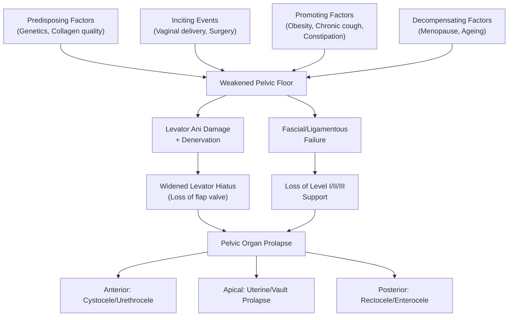

# Pelvic Organ Prolapse (POP)

## 1. Definition

Pelvic Organ Prolapse (POP) refers to the descent or herniation of one or more pelvic organs (bladder, uterus, vaginal vault, rectum, or small bowel) from their normal anatomical position into or through the vaginal canal, and sometimes beyond the introitus. This occurs due to failure of the pelvic floor support system — the complex of muscles, ligaments, fascia, and connective tissue that normally keeps these organs in place.

Breaking down the terminology:
- **"Pelvic"** = relating to the pelvis (Latin *pelvis* = basin)
- **"Organ"** = a visceral structure (bladder, uterus, rectum)
- **"Prolapse"** = to fall out of place (Latin *pro-* = forward, *labi* = to slip/fall)

So the name literally tells you: pelvic organs slipping forward/downward from where they should be.

<Callout title="Key Conceptual Point">
POP is fundamentally a **hernia** — it is the protrusion of an organ through the wall of its containing cavity [1]. The vaginal wall acts as a hernia sac through which pelvic organs descend. Think of POP as an "internal hernia" of the pelvic floor, analogous to how an inguinal hernia is a protrusion through the abdominal wall.
</Callout>

The International Continence Society (ICS) / International Urogynecological Association (IUGA) 2010 joint terminology defines POP as: *"The descent of one or more of the anterior vaginal wall, posterior vaginal wall, the uterus (cervix), or the apex of the vagina (vault or cuff scar after hysterectomy)."*

---

## 2. Epidemiology

### 2.1 Prevalence and Burden

- POP is **extremely common** — it is one of the most prevalent gynaecological conditions in women worldwide.
- On clinical examination, some degree of prolapse is found in **up to 50% of parous women**, though only 10–20% are symptomatic [2][3].
- ***It is estimated that one American woman in nine will undergo surgical repair for POP or urinary incontinence (UI) or both in her lifetime*** [3][4].
- The lifetime risk of undergoing a single operation for POP or UI is approximately **11–19%**, with a **29% reoperation rate** — highlighting that this is a condition with significant recurrence.

### 2.2 Hong Kong Context

- In Hong Kong's ageing population, POP is a significant public health problem.
- The prevalence is increasing due to: longer life expectancy, increasing obesity rates, and greater awareness leading to more women seeking treatment.
- ***Genital prolapse and incontinence are important primary health problems of women*** [5].
- ***Although genital prolapse and urinary incontinence are not life-threatening conditions, they can affect the quality of life of a woman*** [5].

### 2.3 Natural History

***Prolapse progresses and regresses in individual women over time*** [3][4]. A landmark study from the Women's Health Initiative (WHI) showed:
- ***Mean age was 68.1 ± 5.5 years, and median vaginal parity was 4*** [3].
- ***Overall 1-year and 3-year prolapse incidences were 26% (95% CI 20–33%) and 40% (95% CI 26–56%)*** [3].
- ***1-year and 3-year prolapse resolution risks were 21% (95% CI 11–33%) and 19% (95% CI 7–39%)*** [3].
- ***Over 3 years, the maximal vaginal descent increased by at least 2 cm in 11.0% and decreased by at least 2 cm in 2.7%*** [3].
- ***Increasing body mass index and grand multiparity increased the risk for vaginal descent progression*** [3][4].
- ***Obesity is a risk factor for progression in vaginal descent*** [3][4].

<Callout title="Exam Pearl" type="idea">
POP is **dynamic** — it waxes and wanes. It is NOT a one-way street of progressive descent. This is important because it means not every woman with mild prolapse will inevitably need surgery, and conservative management has a real physiological basis.
</Callout>

---

## 3. Anatomy and Function of the Female Pelvic Floor

Understanding POP requires a thorough understanding of what holds everything up in the first place. The pelvic floor is NOT just the levator ani — ***it is a misconception that the pelvic floor is only the levator ani muscles. More accurate would be to define it broader → includes all structures supporting pelvic cavity. So apart from levator ani, would include peritoneum, pelvic viscera, endopelvic fascia, levator ani, perineal membrane, superficial genital muscles*** [6].

### 3.1 Layers of Pelvic Support (From Superior to Inferior)

Think of the pelvic floor as a **multi-layered hammock** suspended within the bony pelvis:

| Layer | Structure | Function |
|-------|-----------|----------|
| **1. Peritoneum** | Visceral peritoneum covering pelvic organs | Outermost serosal covering; allows limited organ mobility |
| **2. Pelvic viscera** | Bladder, uterus, vagina, rectum | The organs themselves contribute to mutual support via packing effect |
| **3. Endopelvic fascia** (visceral ligaments & fascial condensations) | Cardinal-uterosacral ligament complex, pubocervical fascia, rectovaginal fascia | Suspends organs from pelvic sidewalls; connects organs to bony pelvis |
| **4. Levator ani muscle** (pelvic diaphragm) | Pubococcygeus (pubovaginalis, puboperinealis, puboanalis), iliococcygeus, coccygeus | Active muscular support; closes the urogenital hiatus; maintains constant tone |
| **5. Perineal membrane** | Triangular fibromuscular sheet spanning the anterior pelvic outlet | Supports distal urethra and vagina; provides attachment for perineal muscles |
| **6. Superficial genital muscles** | Bulbospongiosus, ischiocavernosus, superficial transverse perineal | Sphincteric and structural support of introitus |

### 3.2 The Three Levels of Vaginal Support (DeLancey's Levels)

DeLancey described three levels of support, which directly map onto the types of prolapse. This is **the** framework for understanding POP anatomy:

| Level | Structure | Support Mechanism | Prolapse if Defective |
|-------|-----------|-------------------|----------------------|
| **Level I (Apical/Superior)** | Cardinal ligaments + Uterosacral ligaments | Suspend the upper vagina/cervix from the sacrum and lateral pelvic sidewalls | Uterine prolapse / Vault prolapse (post-hysterectomy) |
| **Level II (Lateral/Mid-vaginal)** | Pubocervical fascia (anteriorly) + Rectovaginal fascia (posteriorly) | Attach the mid-vagina laterally to the arcus tendineus fasciae pelvis (ATFP, "white line") and arcus tendineus levatoris ani | Cystocele (anterior), Rectocele (posterior) |
| **Level III (Distal/Inferior)** | Perineal body + Perineal membrane + Urogenital diaphragm | Fuse the distal vagina to surrounding structures (urethra anteriorly, perineal body posteriorly) | Urethrocele, Perineal descent |

### 3.3 The Levator Ani — The Key Muscle

The levator ani is the most important muscular component. It forms a **U-shaped sling** (the "levator hiatus") through which the urethra, vagina, and rectum pass. In normal function:

- The levator ani maintains **constant resting tone** (even during sleep), keeping the urogenital hiatus closed.
- The hiatus is the largest potential defect in the pelvic floor — the "Achilles' heel" of the pelvic floor.
- During increases in abdominal pressure (coughing, straining), the levator ani reflexively contracts to compress the vagina and urethra against the pubic symphysis — this is the **"flap valve" mechanism**.
- If the levator ani is damaged or denervated, the hiatus opens up ("levator hiatal ballooning"), and the fascial/ligamentous supports bear the full load → eventually these fail too → prolapse ensues.

### 3.4 The Endopelvic Fascia and Ligaments

- **Cardinal ligaments**: fan-shaped condensations of endopelvic fascia extending from the lateral cervix/upper vagina to the pelvic sidewall. They contain the uterine artery and are the primary lateral support for the cervix and upper vagina.
- **Uterosacral ligaments**: run from the posterior cervix to the sacrum (S2–S4). They are the primary support against downward descent and provide apical support.
- **Pubocervical fascia**: the connective tissue layer between the bladder and the anterior vaginal wall. Defects here lead to **cystocele**.
- **Rectovaginal fascia (Denonvilliers' fascia)**: the connective tissue layer between the rectum and the posterior vaginal wall. Defects here lead to **rectocele**.

### 3.5 The Role of Oestrogen

Oestrogen receptors are abundant in the pelvic floor tissues — the vaginal epithelium, levator ani, endopelvic fascia, and urethral mucosa. Oestrogen:
- Maintains collagen synthesis and cross-linking in pelvic floor connective tissues
- Maintains vascularity and thickness of vaginal and urethral mucosa (mucosal coaptation contributes to continence)
- Maintains muscle mass and tone in pelvic floor muscles

This is why **postmenopausal oestrogen deficiency** is a major risk factor — it causes atrophy and weakening of all these support structures.

### 3.6 Neurological Supply

The pudendal nerve (S2–S4) provides motor innervation to the external urethral sphincter, external anal sphincter, and pelvic floor muscles. Autonomic innervation (inferior hypogastric plexus) controls the detrusor and internal sphincters.

**Why does this matter?** ***Vaginal birth damages the pelvic floor muscles, ligaments and fascia and causes pudendal nerve damage*** [3]. Pudendal nerve stretch injury during vaginal delivery leads to denervation of the pelvic floor → muscle weakness and atrophy → predisposition to POP years later.

<Callout title="Anatomy Summary for POP">
The pelvic floor works like a **boat in a dry dock**: the levator ani muscle is the water level (active support), and the ligaments/fascia are the ropes/chains (passive support). Normally, the boat (organs) floats on the water. If the water level drops (levator damage), the ropes take the full weight. Eventually, the ropes break too (fascial/ligamentous failure) → the boat drops (prolapse).
</Callout>

---

## 4. Risk Factors

Risk factors for POP can be broadly divided into those that **weaken the pelvic floor** (intrinsic) and those that **increase the load on the pelvic floor** (extrinsic/acquired).

***Factors that adversely affect pelvic floor function*** [3][6]:

### 4.1 Obstetric Factors (Most Important)

- ***Most common factor is vaginal delivery*** [3].
- ***Over 90% of patients with prolapse being parous (OR 4.7) and particularly instrumental delivery with a macrosomic baby and a long second stage of labour*** [3].
- ***Vaginal birth damages the pelvic floor muscles, ligaments and fascia and causes pudendal nerve damage*** [3].

**Why does vaginal delivery cause POP?**
1. **Direct mechanical trauma**: stretching and tearing of the levator ani, endopelvic fascia, and perineal body during passage of the fetal head.
2. **Pudendal nerve stretch injury**: the pudendal nerve (S2–S4) courses around the ischial spine — during the second stage of labour, the fetal head compresses and stretches this nerve → neuropraxia or axonotmesis → denervation of pelvic floor muscles → atrophy.
3. **Avulsion of levator ani from pubic bone**: MRI studies show that up to 15–30% of primiparous women have levator avulsion after vaginal delivery — this is a major risk factor for later prolapse.

Specific obstetric risk factors:
- ***Multiparity / Grand multiparity*** [3][4][5]
- ***Instrumental delivery (especially forceps)*** [5] — forceps cause more levator damage than vacuum
- ***Macrosomic baby*** [3] — larger head stretches the pelvic floor more
- ***Long second stage of labour*** [3] — prolonged pressure and stretching
- ***Perineal tear (3rd/4th degree)*** [5]

### 4.2 Intrinsic / Constitutional Factors

- ***Age*** [5] — age-related loss of collagen, muscle mass, and nerve function
- ***Menopause / Oestrogen deficiency*** [5] — ***Age of menopause → lack of oestrogen weakens supporting tissues*** [5]
- ***Congenital collagenopathies*** [5] — e.g. Ehlers-Danlos syndrome, Marfan syndrome → ***Think if for a young 40/50 lady, since too early — implications on treatment, cannot use patient's own tissues to reconstruct, so use mesh*** [5]
- Genetic predisposition — family history of POP
- Ethnicity — White and Hispanic women have higher rates than Black and Asian women, though data in Asian populations are increasing

### 4.3 Acquired / Extrinsic Factors (Increased Load)

Anything that chronically increases intra-abdominal pressure:

- ***Obesity / Increased BMI*** [3][4][5] — ***Obesity is a risk factor for progression in vaginal descent*** [3][4]
- ***Chronic constipation*** [5] — repeated straining at stool
- ***Chronic cough*** [5] — e.g. ***COPD → chronic cough, increased abdominal pressure*** [5]
- ***Peritoneal dialysis*** [5]
- Heavy lifting / ***Previous occupation, gym*** [5]
- ***DM → innervation to pelvic floor impaired*** [5] — diabetic neuropathy can affect pudendal nerve and autonomic innervation

### 4.4 Iatrogenic Factors

- ***Prior surgeries on uterus (all ligaments removed)*** [5] — hysterectomy, especially if ligaments not adequately suspended → vault prolapse
- Previous pelvic floor repair — recurrence rate is significant
- Radical pelvic surgery disrupting nerve supply

<Callout title="Risk Factors Summary" type="idea">
Think of POP risk factors as: **Who gets it?** Parous, postmenopausal, obese women with chronic cough or constipation. The common thread is: **weakened supports + increased load**.

A useful mnemonic: **"PELVIC"**
- **P**arity (vaginal delivery, instrumental, macrosomia)
- **E**strogen deficiency (menopause)
- **L**ifting (heavy occupation, gym)
- **V**isceral pressure (obesity, chronic cough, constipation, ascites)
- **I**nherent weakness (connective tissue disorders, genetics, ageing)
- **C**utting (prior pelvic surgery)
</Callout>

---

## 5. Aetiology and Pathophysiology

### 5.1 Aetiological Framework

POP is a **multifactorial** condition. The aetiology can be understood through a **"predisposition + inciting event + decompensation"** model (the "lifespan model" by DeLancey):

1. **Predisposing factors** (genetic, constitutional): baseline pelvic floor strength, collagen quality, levator hiatus size
2. **Inciting events** (obstetric injury): levator avulsion, pudendal neuropathy, fascial tears during vaginal delivery
3. **Promoting factors** (chronic straining): obesity, constipation, chronic cough → ongoing stress on already-damaged supports
4. **Decompensating factors** (ageing, menopause): loss of oestrogen → tissue atrophy; sarcopenia → muscle wasting → tipping point where supports fail

**The typical timeline**: a woman sustains subclinical pelvic floor injury during childbirth in her 20s–30s → compensatory mechanisms (levator tone, collagen remodelling) maintain support for decades → with menopause (oestrogen loss) + ageing → decompensation → symptomatic prolapse in her 50s–70s.

### 5.2 Pathophysiology by Compartment

The vagina is conceptually divided into **three compartments**, and prolapse can occur in any or all:

| Compartment | Defect Site | Organ(s) Prolapsing | Name |
|-------------|------------|---------------------|------|
| **Anterior** (most common, ~34–50%) | Pubocervical fascia (Level II anterior) | Bladder → **Cystocele**; Urethra → **Urethrocele** (combined: **Cystourethrocele**) | Anterior vaginal wall prolapse |
| **Apical/Middle** | Cardinal + Uterosacral ligaments (Level I) | Uterus → **Uterine prolapse**; Vault (post-hysterectomy) → **Vault prolapse** | Apical prolapse |
| **Posterior** | Rectovaginal fascia (Level II posterior) + perineal body (Level III) | Rectum → **Rectocele**; Small bowel → **Enterocele**; Sigmoid → **Sigmoidocele** | Posterior vaginal wall prolapse |

**Important**: multiple compartments are often involved simultaneously. An isolated single-compartment prolapse is actually uncommon — most women have multi-compartment involvement because the supporting structures are interconnected.

#### 5.2.1 Cystocele (Anterior Compartment Prolapse)

**Pathophysiology**: The pubocervical fascia (the connective tissue "hammock" between the bladder and anterior vaginal wall) develops a defect — either a **central defect** (midline attenuation/thinning) or a **lateral/paravaginal defect** (detachment from the arcus tendineus fasciae pelvis, i.e., the "white line"). The bladder then herniates through this defect, pushing the anterior vaginal wall downward.

- ***Cystocele = prolapse of the bladder*** [5]
- ***Leads to difficulty in completely emptying bladder, kinked urethra*** [5]

**Why does cystocele cause urinary symptoms?** Because the bladder base descends below the level of the internal urethral meatus → the urethra can become kinked or compressed → obstruction to outflow → incomplete emptying → urinary retention, frequency, and recurrent UTIs.

**Paradoxical effect on stress incontinence**: A large cystocele can actually **mask** stress urinary incontinence (SUI) by kinking the urethra — this is called ***occult stress incontinence*** [3][4][7]. When the prolapse is reduced (either manually or surgically), the SUI becomes unmasked. This is why it is critical to test for occult SUI before prolapse surgery.

#### 5.2.2 Uterine Prolapse (Apical Compartment Prolapse)

**Pathophysiology**: Failure of the cardinal-uterosacral ligament complex (Level I support) → the uterus descends through the vaginal canal. In severe cases, the entire uterus can protrude beyond the introitus (**procidentia** or complete uterine prolapse).

- The cervix is the leading point of descent.
- As the uterus descends, it drags the bladder (anteriorly) and rectum (posteriorly) with it → why isolated uterine prolapse is rare; it usually comes with cystocele and/or rectocele.

#### 5.2.3 Vault Prolapse (Post-Hysterectomy)

**Pathophysiology**: After hysterectomy, the vaginal vault (apex of the vagina) loses its attachment to the cardinal-uterosacral ligament complex if these were not adequately re-suspended → the vault inverts and descends. This is essentially the same process as uterine prolapse but without the uterus.

- Occurs in approximately 0.5–1.8% after hysterectomy for benign disease, up to 11.6% after hysterectomy *for prolapse* (highlighting the importance of adequate apical support at the time of hysterectomy).

#### 5.2.4 Rectocele (Posterior Compartment Prolapse)

**Pathophysiology**: Defects in the rectovaginal fascia (Denonvilliers' fascia) allow the rectum to herniate anteriorly into the vaginal lumen, pushing the posterior vaginal wall forward.

- Patients often need to **digitally splint** (press on the posterior vaginal wall or perineum) to assist defecation — ***if splinting is necessary before defecation*** [5].
- Can cause a sensation of incomplete evacuation and difficulty passing stool.

#### 5.2.5 Enterocele

**Pathophysiology**: Herniation of the peritoneal sac (containing small bowel, omentum, or sigmoid colon) through the rectovaginal or vesicovaginal space. It most commonly occurs at the vaginal apex, often after hysterectomy when the cul-de-sac (pouch of Douglas) herniates downward.

- Distinguished from rectocele by the fact that the hernia sac contains small bowel (can sometimes see peristalsis through the vaginal wall or feel bowel loops on examination).

### 5.3 Pathophysiological Mechanism Summary

---

## 6. Classification

### 6.1 By Compartment (Anatomical Classification)

As described above:

| Compartment | Type | Definition |
|-------------|------|------------|
| **Anterior** | Urethrocele | Prolapse of urethra |
| | Cystocele | Prolapse of bladder |
| | Cystourethrocele | Combined prolapse of bladder and urethra |
| **Apical (Middle)** | Uterine prolapse | Descent of uterus |
| | Vault prolapse | Descent of vaginal vault (post-hysterectomy) |
| | Enterocele | Herniation of small bowel through pouch of Douglas |
| **Posterior** | Rectocele | Prolapse of rectum into posterior vaginal wall |
| | Sigmoidocele | Prolapse of sigmoid colon |
| | Perineal descent | Descent of perineal body |

***Classify based on compartment of vagina that is weakened → Anterior → cystourethrocele; Middle → uterine / vault prolapse; Posterior → rectocele*** [5].

### 6.2 By Severity — The POP-Q System (Pelvic Organ Prolapse Quantification)

The **POP-Q** is the internationally standardised, validated, and reproducible system for grading POP (ICS/IUGA standard). It replaced older subjective grading systems.

The POP-Q uses the **hymen** as the fixed reference point (defined as 0). Measurements are made in centimetres:
- **Negative values** (–) = above/proximal to the hymen (i.e., inside)
- **Positive values** (+) = below/distal to the hymen (i.e., outside the body)

#### POP-Q Reference Points

| Point | Location | Measures |
|-------|----------|----------|
| **Aa** | Anterior vaginal wall, 3 cm proximal to urethral meatus | Anterior wall descent (range: –3 to +3) |
| **Ba** | Most distal (dependent) position of anterior vaginal wall | Anterior wall descent (range: –3 to +tvl) |
| **C** | Most distal edge of cervix or vaginal cuff | Apical descent |
| **D** | Posterior fornix (only if uterus present) | Posterior fornix descent |
| **Ap** | Posterior vaginal wall, 3 cm proximal to hymen | Posterior wall descent (range: –3 to +3) |
| **Bp** | Most distal (dependent) position of posterior vaginal wall | Posterior wall descent (range: –3 to +tvl) |
| **gh** | Genital hiatus | Measured from mid-urethral meatus to posterior hymen |
| **pb** | Perineal body | Measured from posterior hymen to mid-anal opening |
| **tvl** | Total vaginal length | Greatest depth of vagina when reduced |

#### POP-Q Staging

| Stage | Definition |
|-------|-----------|
| **Stage 0** | No prolapse; all points are ≥ 3 cm above hymen (Aa, Ba, Ap, Bp all at –3) |
| **Stage I** | Most distal prolapse is > 1 cm above the hymen (leading edge < –1) |
| **Stage II** | Most distal prolapse is within 1 cm of the hymen (between –1 and +1) |
| **Stage III** | Most distal prolapse is > 1 cm below the hymen but not complete eversion (leading edge > +1 but < +(tvl – 2)) |
| **Stage IV** | Complete eversion; essentially the entire vaginal length has prolapsed (leading edge ≥ +(tvl – 2)) |

<Callout title="POP-Q Exam Tip" type="error">
A common student mistake is confusing the old "grading" system (Grades 1–4 based on introitus) with the POP-Q staging. The POP-Q uses the **hymen** as the reference point, NOT the introitus. The POP-Q is the standard and is what you should use in clinical practice and exams.
</Callout>

### 6.3 Simplified/Older Grading (Shaw's Classification — for historical reference)

This older system is sometimes still used clinically:

| Grade | Description |
|-------|------------|
| **1st degree** | Descent within the vagina, not reaching the introitus |
| **2nd degree** | Descent to the level of the introitus |
| **3rd degree** | Descent beyond the introitus (partial eversion) |
| **4th degree (Procidentia)** | Complete eversion of the vaginal canal |

---

## 7. Clinical Features

### 7.1 Symptoms

POP symptoms are best understood by relating them back to the **compartment involved** and the **degree of descent**.

<Callout title="General Principle">
Symptoms of POP correlate poorly with the degree of prolapse on examination. A woman with Stage II prolapse may be very symptomatic, while another with Stage III may be asymptomatic. What matters is whether the prolapse reaches or goes beyond the hymen — this is the threshold at which most women become symptomatic.
</Callout>

#### 7.1.1 Prolapse-Specific Symptoms (Vaginal Symptoms)

| Symptom | Pathophysiological Basis |
|---------|------------------------|
| ***Sensation of a mass/lump coming out through the introitus*** [5] — "I felt a lump below" | Direct perception of prolapsing organ/vaginal wall protruding through the introitus; the most specific symptom for POP |
| Sensation of **pelvic heaviness/pressure/dragging** | Weight of the prolapsed organ pulling on the remaining support structures; traction on the uterosacral ligaments (which are pain-sensitive) |
| Symptoms **worse with prolonged standing or straining** and **better when lying down** | Gravity-dependent: standing increases the load on the pelvic floor; lying down removes the gravitational vector |
| Need to **manually reduce the mass** to void or defecate — ***sometimes required manual reduction of the mass in order to void*** [5] | The prolapsed organ mechanically obstructs the urethra or rectum; manual reduction restores the anatomical relationship allowing passage |
| Low back pain or sacral aching | Traction on the uterosacral ligaments (which attach to the sacrum at S2–S4) by the descending uterus |

#### 7.1.2 Urinary Symptoms (Anterior Compartment / Associated Pelvic Floor Dysfunction)

| Symptom | Pathophysiological Basis |
|---------|------------------------|
| **Urinary frequency and urgency** | Incomplete bladder emptying → residual urine → reduced functional capacity → need to void more often; also detrusor overactivity from chronic stretching |
| ***Sensation of incomplete emptying*** [5] | Cystocele creates a "pouch" below the bladder outlet → urine pools in the dependent part of the cystocele below the level of the internal meatus → residual urine remains |
| ***Straining to pass urine*** [5] — hesitancy, poor stream | The prolapsed bladder/urethra becomes kinked → outflow obstruction → need to generate higher pressure to void → straining |
| ***Urinary retention (AROU)*** [5] | Severe cystocele kinks the urethra completely → cannot void → retention. ***Need reduction of uterus before urination → or else it will kink the urethra, cannot urinate*** [5] |
| **Stress urinary incontinence (SUI)** — leakage with cough, sneeze, exertion | Pelvic floor weakness → loss of urethral support → urethral hypermobility → during ↑abdominal pressure, the urethra does not receive adequate backboard support → urine leaks [8] |
| ***Occult stress incontinence*** [3][4][7] | A large prolapse kinks the urethra → mechanically prevents leakage → SUI is masked. When prolapse is reduced (either manually or surgically), the kink is relieved and SUI becomes apparent. ***Remember the possibility of occult stress incontinence in case of severe prolapse*** [3][7] |
| Recurrent UTIs | Chronic residual urine → urinary stasis → bacterial colonization |

<Callout title="Occult Stress Incontinence — Critical Exam Point" type="error">
***Remember the possibility of occult stress incontinence in case of severe prolapse*** [3][7]. Before prolapse surgery, you MUST test for occult SUI by reducing the prolapse (e.g., with a pessary or manually) and then performing a cough stress test. If SUI is unmasked, **concurrent anti-incontinence surgery** may be needed. ***If surgery is indicated, surgery for both conditions may be needed*** [3][7].
</Callout>

#### 7.1.3 Bowel Symptoms (Posterior Compartment)

| Symptom | Pathophysiological Basis |
|---------|------------------------|
| Difficulty defecating / Obstructed defecation | Rectocele creates a pocket where stool collects → faeces enters the rectocele instead of the anal canal → "trapping" effect → sensation of blockage |
| ***Need to splint (digitally support perineum or posterior vaginal wall) to defecate*** [5] | Pressing on the posterior vaginal wall or perineum pushes the rectal contents out of the rectocele back into the rectal lumen → directed toward the anal canal |
| Sensation of incomplete evacuation | Stool remains in the rectocele after defecation |
| Faecal incontinence (less common) | Associated pelvic floor injury (especially external anal sphincter disruption from obstetric injury) |

#### 7.1.4 Sexual Symptoms

| Symptom | Pathophysiological Basis |
|---------|------------------------|
| Dyspareunia (painful intercourse) | Exposed vaginal mucosa → dryness and ulceration → pain during intercourse |
| Reduced sexual satisfaction | Widened vaginal introitus, sensation of "looseness"; also psychological impact |
| Avoidance of sexual intercourse | Embarrassment from visible/palpable mass; fear of worsening prolapse |

#### 7.1.5 Associated Symptoms

- **Vaginal discharge or bleeding**: the exposed vaginal/cervical mucosa (especially in procidentia) undergoes keratinization, ulceration, or decubitus ulcer formation → secondary infection and bleeding.
- **Impact on quality of life**: restriction of physical activities, social isolation, depression, embarrassment — ***they can affect the quality of life of a woman*** [5].

### 7.2 Signs (On Examination)

#### 7.2.1 General Examination

- ***BMI assessment*** [5] — ***Her BMI was 35*** [5]; obesity is both a risk factor and a contributing factor
- Abdominal examination: ***the abdomen was obese and no mass was felt*** [5]; rule out pelvic masses, ascites
- Suprapubic palpation: ***the bladder was full and palpable in the suprapubic region*** [5] → suggests urinary retention

#### 7.2.2 Pelvic/Vaginal Examination

The patient should be examined in the **dorsal lithotomy position** and asked to **bear down / Valsalva** to demonstrate the maximal extent of prolapse. A **Sims speculum** (posterior vaginal wall retractor) is used to sequentially assess each compartment:

| Sign | Finding | Pathophysiological Basis |
|------|---------|------------------------|
| **Anterior wall descent** (Cystocele) | Bulging of anterior vaginal wall, especially on straining; smooth, soft, reducible mass | Bladder herniating through deficient pubocervical fascia |
| ***Cystocele 2 cm beyond the introitus*** [5] | POP-Q Ba = +2; clinical stage III anterior prolapse | Significant pubocervical fascial defect allowing bladder to protrude beyond hymen |
| **Cervical/uterine descent** | ***The cervix descended to 1 cm beyond the introitus*** [5] | Cardinal/uterosacral ligament failure; Level I defect |
| **Posterior wall descent** (Rectocele) | Bulging of posterior vaginal wall; may feel stool in the rectocele on rectal exam | Rectovaginal fascial defect |
| **Enterocele** | Bulge at the vaginal apex; may see/feel peristalsis; impulse on cough; differentiated from rectocele by transillumination or rectal exam (enterocele is above the rectovaginal septum) | Peritoneal sac with bowel herniating through pouch of Douglas |
| **Ulceration/Keratinization** | Dry, thickened, whitened, or ulcerated mucosa on the prolapsed organ | Chronic exposure of normally moist vaginal mucosa to air → desiccation → keratinization; if traumatized → decubitus ulcer |
| **Atrophic vaginitis** | Thin, pale, dry vaginal mucosa; may have petechiae | Oestrogen deficiency → mucosal atrophy |

#### 7.2.3 Specific Tests During Examination

- **Cough stress test**: with the prolapse reduced (e.g., with a Sims speculum or manually), ask the patient to cough → observe for urine leakage → if positive, confirms SUI (or occult SUI if only positive after reduction). ***There was evidence of urine leakage upon straining (stress urinary incontinence)*** [5].
- **Post-void residual (PVR)**: measured by catheterisation or ultrasound after the patient voids → elevated PVR ( > 100 mL) suggests incomplete emptying, often due to cystocele-related urethral kinking or detrusor underactivity.
- **Bimanual examination**: ***the uterus was small and the adnexae were clear*** [5] → to rule out pelvic masses as a cause of the prolapse or an incidental finding.
- **Rectal examination**: to assess the extent of rectocele, rectal tone (ruling out rectal prolapse), and integrity of the external anal sphincter.

<Callout title="Examination Technique Pearl" type="idea">
When examining for POP:
1. Use a **Sims speculum** (not a Cusco speculum) — it retracts one wall at a time, allowing you to assess each compartment independently.
2. Examine with the patient **straining/bearing down (Valsalva)** — prolapse may not be visible at rest.
3. Examine in the **standing position** if prolapse is not demonstrated in lithotomy but the patient describes a mass — gravity assists in demonstrating the full extent.
4. Always **check for occult SUI** by reducing the prolapse and performing a cough stress test.
</Callout>

---

## 8. Relationship Between POP and Urinary Incontinence

***Weakened pelvic floor support is the basic pathophysiology*** for both genital prolapse and stress urinary incontinence [3][7]. They share the same risk factors and pathogenetic mechanisms, and they **very commonly coexist** in the same patient.

***Common association of prolapse and urinary incontinence in an elderly woman*** [3][7].

***Vaginal childbirth is an important risk factor*** for both conditions [3][7].

Understanding the interplay:
- **Mild-to-moderate prolapse + SUI**: the pelvic floor is weak enough to cause both urethral hypermobility (→ SUI) and organ descent (→ prolapse). They coexist openly.
- **Severe prolapse + apparent continence**: a large cystocele kinks the urethra → the patient appears continent but has ***occult stress incontinence***. Reducing the prolapse unmasks the SUI.
- ***Conservative management is available but rarely curative*** [3][7].
- ***If surgery is indicated, surgery for both conditions may be needed*** [3][7].

Continence in women physiologically arises from [8]:
- ***Anatomical support by intact pelvic floor holding bladder neck + urethra in place (especially in females)***
- ***Intrinsic urethral mechanism by coaptation of mucosa, compression by submucosa and internal/external sphincters***
- ***Neurological control by CNS and spinal cord***

Types of incontinence to be aware of in the context of POP [8]:
- ***Stress incontinence (SUI): leakage associated with ↑abdominal pressure → due to poor urethral sphincter function → triggers: cough, sneeze, laughing, heavy lifting***
- ***Urge incontinence (UUI): strong desire to void that is difficult to defer and associated with leakage → detrusor overactivity leading to inappropriate bladder contraction***
- ***Overflow incontinence: constant dribbling (especially at night) with associated retention of urine → BOO/DUA → bladder over-distension***

---

## 9. Special Considerations in Hong Kong

- **Ageing population**: Hong Kong has one of the longest life expectancies globally → increasing prevalence of POP in elderly women.
- **Lower BMI threshold for Asian women**: WHO recommends lower BMI cut-offs for overweight/obesity in Asian populations (overweight ≥ 23, obese ≥ 25 vs. ≥ 25/≥ 30 in Western populations). However, obesity rates in Hong Kong are rising.
- **Cultural factors**: many Chinese women are reluctant to report symptoms of POP or incontinence due to embarrassment → likely underreported.
- **Dietary factors**: chronic constipation is common in the elderly Hong Kong population → contributes to POP.
- **Occupational factors**: previously, many women in Hong Kong were engaged in manual labour → heavy lifting as a contributing factor.
- **Public hospital services**: POP is managed primarily in the public sector at HA hospitals, with waiting times for elective surgery often being long → conservative management with pessaries is widely used as a bridge or definitive treatment.

---

<Callout title="High Yield Summary">

**Definition**: POP = descent of pelvic organs (bladder, uterus, vault, rectum, bowel) through the vaginal canal due to failure of pelvic floor support.

**Epidemiology**: Affects up to 50% of parous women on exam; ~10–20% symptomatic. 1 in 9 women undergoes surgery for POP/UI. POP waxes and wanes — it is dynamic.

**Anatomy**: Pelvic floor = peritoneum + viscera + endopelvic fascia + levator ani + perineal membrane + superficial genital muscles. DeLancey's 3 levels of support: Level I (apical: cardinal/uterosacral ligaments), Level II (lateral: pubocervical + rectovaginal fascia), Level III (distal: perineal body/membrane).

**Risk Factors** ("PELVIC"): Parity (vaginal delivery, forceps, macrosomia, long 2nd stage), Estrogen deficiency, Lifting/occupation, Visceral pressure (obesity, cough, constipation), Inherent weakness (genetics, collagenopathy, age), Cutting (prior surgery).

**Most important risk factor**: ***Vaginal delivery*** (OR 4.7 for parity; > 90% of POP patients are parous).

**Classification**: By compartment (anterior = cystocele/urethrocele; apical = uterine/vault; posterior = rectocele/enterocele). POP-Q staging (0–IV) uses hymen as reference point.

**Key Clinical Features**: Sensation of mass/"lump below," pelvic heaviness, urinary symptoms (frequency, retention, SUI), bowel symptoms (obstructed defecation, splinting), sexual dysfunction. ***Remember occult SUI in severe prolapse***.

**POP + Incontinence**: Share the same pathophysiology (weak pelvic floor). Commonly coexist. ***Surgery for both conditions may be needed if surgery indicated***.

</Callout>

---

<ActiveRecallQuiz
  title="Active Recall - Pelvic Organ Prolapse (POP)"
  items={[
    {
      question: "Name the three DeLancey levels of vaginal support and what prolapse results from failure at each level.",
      markscheme: "Level I (apical): Cardinal + uterosacral ligaments → uterine/vault prolapse. Level II (lateral): Pubocervical fascia anteriorly → cystocele; Rectovaginal fascia posteriorly → rectocele. Level III (distal): Perineal body/membrane → urethrocele/perineal descent.",
    },
    {
      question: "What is occult stress incontinence and why is it clinically important in the context of severe prolapse?",
      markscheme: "Occult SUI = stress incontinence masked by a large prolapse that kinks the urethra. Important because: reducing the prolapse (surgically or with pessary) unmasks the SUI → must test for it pre-operatively → may need concurrent anti-incontinence surgery.",
    },
    {
      question: "List 5 risk factors for pelvic organ prolapse and explain the mechanism for each.",
      markscheme: "1) Vaginal delivery - direct trauma to levator ani, fascia, pudendal nerve. 2) Menopause/oestrogen deficiency - loss of collagen, mucosal atrophy, muscle wasting. 3) Obesity - chronically raised intra-abdominal pressure. 4) Chronic cough (e.g., COPD) - repeated increases in intra-abdominal pressure. 5) Chronic constipation - repeated straining increases pelvic floor load. Also accept: connective tissue disorders, prior pelvic surgery, ageing, multiparity, instrumental delivery, macrosomia.",
    },
    {
      question: "A 66-year-old postmenopausal woman with COPD, DM, and BMI 35 presents with a mass protruding from the vagina and urinary retention. Classify her risk factors for POP.",
      markscheme: "Intrinsic: Postmenopausal (oestrogen deficiency), age 66. Acquired/extrinsic: COPD (chronic cough → raised IAP), DM (pudendal neuropathy), obesity BMI 35 (raised IAP, weight on pelvic floor). Obstetric: need to ask about parity and mode of delivery. Iatrogenic: need to ask about prior surgery.",
    },
    {
      question: "What is the POP-Q reference point, and what defines Stage III prolapse?",
      markscheme: "Reference point = the hymen (0 cm). Stage III = most distal prolapse is more than 1 cm below the hymen (leading edge > +1 cm) but not complete eversion (leading edge less than total vaginal length minus 2 cm).",
    },
    {
      question: "Why does a large cystocele cause urinary retention, and how does the patient overcome it?",
      markscheme: "The cystocele allows the bladder to herniate below the internal urethral meatus, kinking the urethra → mechanical obstruction to outflow → retention. Patient overcomes it by manually reducing the prolapse (pushing the mass back), which unkinks the urethra and restores the anatomical pathway for voiding.",
    },
  ]}
/>

---

## References

[1] Senior notes: Maksim Surgery Notes.pdf (Section 6.2 – Overview of Hernias)
[2] Senior notes: Ryan Ho Endocrine.pdf (p47–48 – Osteoporosis/epidemiology context for HK women)
[3] Lecture slides: GC 116. I felt a lump below urinary incontinence in females; genital prolapse.pdf (p28, p37, p74)
[4] Lecture slides: Block C - I felt a lump below_ urinary incontinence in females; genital prolapse.pdf (p32, p65)
[5] Lecture slides: Block C - O&G Theme Case 4.pdf (p1, p2, p4)
[6] Lecture slides: Block C - I felt a lump below_ urinary incontinence in females; genital prolapse.pdf (p1)
[7] Lecture slides: Block C - I felt a lump below_ urinary incontinence in females; genital prolapse.pdf (p65)
[8] Senior notes: Ryan Ho Urogenital.pdf (p159 – Approach to Urinary Incontinence)
