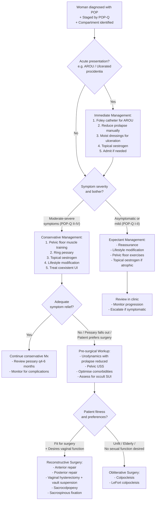

## Management of Pelvic Organ Prolapse (POP)

### 1. Principles of Management

Before diving into specific treatments, understand the overarching principles that guide every management decision in POP:

1. **POP is not life-threatening** — ***although genital prolapse and urinary incontinence are not life-threatening conditions, they can affect the quality of life of a woman*** [5]. Therefore, the primary goal of treatment is **symptom relief and quality-of-life improvement**, not anatomical "cure."
2. **Treatment is individualised** — based on the patient's symptom severity, compartment(s) affected, desire for future sexual function/fertility, fitness for surgery, and personal preference.
3. **Conservative management first** — ***Conservative management is available but rarely curative*** [3][7]. Most women with mild-to-moderate symptoms should trial conservative measures before surgery is considered.
4. **Address coexistent conditions** — ***If surgery is indicated, surgery for both conditions may be needed*** [3][7] (referring to POP + SUI). Also treat modifiable risk factors: chronic cough, constipation, obesity.
5. **Informed consent and shared decision-making** — ***Counsel patients and discuss the importance of their family's support in the clinical management*** [5]. ***Liaise with other allied health professionals in the provision of care*** [5].

***Discuss the usual indication for surgical and non-surgical management for pelvic organ prolapse and stress urinary incontinence*** — this is a core learning objective [5].

---

### 2. Management Algorithm Overview

The management of POP follows a **stepwise approach**: immediate management of acute presentations → optimisation of modifiable risk factors → conservative treatment → surgical treatment for those who fail or decline conservative measures.

---

### 3. Immediate Management of Acute Presentations

When a woman presents acutely with POP — for example, ***Mrs. Wong presented with urinary retention*** [5] — the immediate priorities are:

| Immediate Action | Rationale |
|-----------------|-----------|
| ***AROU → Foley insertion + documentation of first catheterisation urine volume, send urine for C/ST*** [5] | Relieve urinary retention, quantify the degree of retention (volume on first catheterisation), and rule out UTI |
| ***KUB*** [5] | Screen for faecal loading, bladder stones, or other contributing factors |
| **Manual reduction of the prolapse** | ***Need reduction of uterus before urination → or else it will kink the urethra, cannot urinate*** [5]. Reduce the prolapse gently with a moist swab; this may restore voiding ability |
| **Topical oestrogen cream** to exposed/ulcerated mucosa | Exposed vaginal/cervical mucosa in procidentia becomes oedematous, keratinised, or ulcerated. Topical oestrogen promotes mucosal healing, reduces inflammation, and reduces oedema before any surgical intervention |
| **Moist saline dressings** over irreducible/ulcerated prolapse | Prevents further desiccation and promotes healing |
| **Treat underlying precipitants** | Treat constipation (fleet enema), control chronic cough, review medications (stop anticholinergics/sympathomimetics if contributing to retention) |

<Callout title="First Catheterisation Volume" type="idea">
Always document the volume of urine drained at first catheterisation. This tells you the degree of retention (e.g., > 500 mL is significant; > 1 L is chronic). Be aware of **post-decompression haematuria** — sudden drainage of a chronically overdistended bladder can cause haematuria due to release of tamponade on bladder mucosal vessels. Some centres advocate slow decompression (clamp catheter after draining 500 mL, re-open after 15 min), though evidence is debated.
</Callout>

---

### 4. Conservative (Non-Surgical) Management

***Conservative management is available but rarely curative*** [3][7]. However, it is the **first-line** approach for most women and may be the **definitive** treatment for women who are unfit for surgery, decline surgery, or have mild symptoms.

#### 4.1 Lifestyle Modification and Risk Factor Optimisation

| Intervention | Mechanism | Evidence |
|-------------|-----------|---------|
| ***Weight loss*** | Reduces chronic intra-abdominal pressure load on the pelvic floor; ***Obesity is a risk factor for progression in vaginal descent*** [3][4] | Observational data support that weight loss reduces POP symptoms |
| **Treat chronic cough** | Reduces repetitive increases in intra-abdominal pressure; ***COPD → chronic cough, increased abdominal pressure*** [5] | Smoking cessation, optimise COPD management |
| **Treat chronic constipation** | Reduces straining at stool, which directly loads the pelvic floor | Dietary fibre, adequate hydration, laxatives as needed |
| ***Reduce caffeine/alcohol intake*** [8] | Caffeine is a bladder irritant → worsens frequency/urgency; alcohol is a diuretic | Part of lifestyle advice for coexistent urinary symptoms |
| ***Provide information and educate women to promote pelvic floor function*** [5] | Empowerment; understanding of condition improves compliance with conservative measures | Patient education leaflets, specialist nurse counselling |

#### 4.2 Pelvic Floor Muscle Training (PFMT) — "Kegel Exercises"

Pelvic floor muscle training is the cornerstone of conservative management for both POP and SUI.

**Why does PFMT work?** Strengthening the levator ani muscle:
- Increases resting muscle tone → narrows the levator hiatus → better "hammock" support for the organs
- Improves the reflex contraction that occurs during coughing/straining → better counter-pressure against increases in abdominal pressure
- Improves urethral closure pressure → treats coexistent SUI

**How to perform PFMT:**
- ***Pelvic floor (Kegel) exercises: 3 sets of 8–12 contractions for 8–10 seconds, performed TDS for ≥ 15–20 weeks*** [8]
- ***Biofeedback: placement of vaginal pressure sensor → live feedback of strength of pelvic floor contractions → associated with better outcome than pelvic floor exercise alone*** [8]
- Must be taught properly by a specialist physiotherapist — many women contract the wrong muscles (abdominals, gluteals) without proper instruction

**Evidence for PFMT in POP:**

***The POPPY Trial (Lancet 2014)*** [17] — a landmark multicentre RCT:
- ***Female outpatients with newly-diagnosed, symptomatic stage I, II, or III prolapse were randomly assigned to receive an individualised programme of pelvic floor muscle training or a prolapse lifestyle advice leaflet (control)*** [17]
- ***Women in the intervention group reported fewer prolapse symptoms*** at 12 months [17]
- This provides Level 1 evidence that **individualised PFMT reduces POP symptoms in women with stage I–III prolapse**

***Teach pelvic floor exercise / bladder training*** [5] — this is part of the standard discharge plan.

<Callout title="PFMT Is First Line for Stage I–III POP">
PFMT should be offered to ALL women with symptomatic POP as first-line treatment. It is especially effective for anterior compartment prolapse and coexistent SUI. It requires commitment (at least 15–20 weeks of regular training to see benefit) and ideally supervised by a specialist physiotherapist.
</Callout>

#### 4.3 Vaginal Pessaries

***Nonsurgical treatment using ring pessary for patients who decline surgery, unfit for surgery or temporary measure while awaiting surgery*** [3].

**What is a pessary?** A pessary is a silicone or PVC device inserted into the vagina to mechanically support the prolapsed organs. It works like a "shelf" or "dam" that holds the organs up. Think of it as a prosthetic pelvic floor.

**Types of pessaries:**

| Type | Description | Best For |
|------|------------|---------|
| **Ring pessary** (most commonly used) | A flexible silicone ring that sits in the vaginal fornices; can be folded for insertion | Stage I–III prolapse; most first-line choice; ***Ring pessary*** [5] is specifically mentioned |
| **Shelf/Gellhorn pessary** | Has a flat disc with a stem; provides greater support but harder to insert/remove | Stage III–IV prolapse; procidentia |
| **Cube pessary** | Suction cup mechanism; adheres to vaginal walls | Stage III–IV; when ring pessary fails |
| **Donut pessary** | Circular donut shape; provides space-filling support | Moderate-severe prolapse |

**Sizing:** ***Size of pessary chosen so that it gives support to the prolapse organ but does not cause discomfort to the patient*** [3]. The largest pessary that is comfortable and stays in place should be used.

**Fitting algorithm:** ***Try one size, if fall out → try bigger size, if fall out → try two, if fall out → surgery*** [5]. This is the practical stepwise approach.

**Complications of pessary use:** ***Complications include pressure ulcer, bleeding and infection with discharge*** [3].

| Complication | Mechanism | Prevention/Management |
|-------------|-----------|----------------------|
| **Vaginal erosion / Pressure ulcer** | Chronic pressure from the pessary on atrophic vaginal mucosa → ischaemia → ulceration | Use topical oestrogen cream concurrently (thickens and strengthens vaginal mucosa); regular review and removal |
| **Vaginal discharge / Infection** | Foreign body in vagina → altered flora → bacterial vaginosis or secondary infection | Regular cleaning; pessary removal and cleaning at review visits |
| **Bleeding** | Erosion of vaginal mucosa | Topical oestrogen; consider changing pessary type/size |
| **Incarceration / Neglect** | Forgotten pessary left in for years → embedded in vaginal wall | ***Foreign body, change every 4 to 6 months*** [5] — regular review schedule essential |
| **Fistula formation** (rare) | Severe pressure necrosis → vesicovaginal or rectovaginal fistula | Very rare with proper follow-up |

**Monitoring:** ***Change every 4 to 6 months*** [5]. At each review:
- Remove the pessary, clean it
- Inspect the vaginal mucosa for erosion/ulceration
- Reassess the prolapse
- Reinsert (same or adjusted size)

**Evidence for pessary use:**

***Effect of Pessary Use on Genital Hiatus Measurements in Women With Pelvic Organ Prolapse*** [18] — this observational study showed:
- ***After 3 months of pessary use, genital hiatus size decreased significantly*** [18]
- ***Pessary use results in significant anatomic changes to the genital hiatus in patients with pelvic organ prolapse*** [18]
- This means pessaries don't just passively hold things up — they may actually **remodel** the pelvic floor over time by reducing the hiatal area

***Mrs. Wong opted for ring pessary as she noted significant improvement in her urinary symptoms and dragging discomfort with the conservative treatment*** [5].

<Callout title="When to Escalate from Pessary to Surgery">
***Mrs. Wong came back 2 days following discharge because the ring pessary fell out when she opened her bowel. A new ring pessary of a larger size was inserted, but it fell out shortly afterwards. She now decided to undergo surgery*** [5].

Indications to move from pessary to surgery:
- Pessary repeatedly falls out despite upsizing
- Pessary causes persistent discomfort
- Vaginal erosion/ulceration not responsive to topical oestrogen
- Patient preference for definitive treatment
- Worsening symptoms despite pessary
</Callout>

#### 4.4 Topical Vaginal Oestrogen

**Why?** In postmenopausal women, oestrogen deficiency causes vaginal mucosal atrophy → thin, friable, dry mucosa → more prone to erosion from pessary use, more susceptible to infection, and contributes to worsening of prolapse.

Topical oestrogen (e.g., estriol cream, oestradiol vaginal tablet):
- Thickens and revascularises the vaginal mucosa
- Improves collagen quality in the pelvic floor connective tissues
- Reduces risk of pessary-related erosion
- Improves coexistent atrophic vaginitis symptoms (dryness, dyspareunia)
- Improves urethral mucosal coaptation → helps with SUI symptoms

**Route:** Topical vaginal application (cream or pessary) — minimal systemic absorption → safe even in women with contraindications to systemic HRT (e.g., breast cancer history).

#### 4.5 Medical Treatment for Coexistent Urinary Incontinence

***Medication for urge incontinence*** [5] — if the woman has a significant urge incontinence component:

| Drug Class | Mechanism | Examples | Key Points |
|-----------|-----------|---------|------------|
| ***Anticholinergics (Muscarinic antagonists)*** [8][15] | Block M2/M3 muscarinic receptors on detrusor muscle → reduce involuntary contractions → ↓urgency and frequency | ***Oxybutynin, solifenacin*** [15] | ***S/E: dry mouth, dry eye, constipation, cognitive impairment*** [15]. ***C/I if residual urine > 150 mL due to risk of AROU*** [15] — particularly relevant in POP patients who already have ↑PVR! |
| ***Beta-3 agonist*** [15] | Activate β3-adrenergic receptors on detrusor → promote relaxation during filling phase | ***Mirabegron*** [15] | ***S/E: elevated BP ( > 10%)*** [15]. Alternative for those intolerant of anticholinergics |
| **Bladder training** | Timed voiding with gradual increase in intervals; suppressing urgency with distraction techniques | — | First-line non-pharmacological for urge incontinence |

<Callout title="Anticholinergics in POP — Caution!" type="error">
***Anticholinergics are contraindicated if residual urine > 150 mL due to risk of AROU*** [15]. Women with significant POP often already have elevated PVR due to cystocele kinking the urethra. Giving anticholinergics to these women can push them into acute retention. Always check PVR before prescribing anticholinergics for urge incontinence in a woman with POP.
</Callout>

---

### 5. Surgical Management

Surgery is indicated when conservative measures fail or are not suitable. The choice of procedure depends on: **compartment(s) involved**, **uterus present or absent**, **desire for future sexual function**, **patient's fitness**, and **whether concomitant anti-incontinence surgery is needed**.

#### 5.1 Indications for Surgery

| Indication | Explanation |
|-----------|-------------|
| Failed conservative management | ***Ring pessary fell out... She now decided to undergo surgery*** [5] |
| Severe/bothersome symptoms despite conservative trial | Significant impact on QoL that conservative measures cannot adequately address |
| Complications of POP | Recurrent UTIs from chronic retention, obstructive uropathy, chronic ulceration of prolapsed mucosa, irreducible prolapse |
| Patient preference | After adequate counselling about risks/benefits, some women prefer definitive surgical treatment |

#### 5.2 Reconstructive Surgery (Preserves Vaginal Function)

Reconstructive procedures aim to restore normal anatomy while preserving vaginal capacity and sexual function.

##### 5.2.1 Anterior Compartment Repair (Anterior Colporrhaphy)

| Feature | Detail |
|---------|--------|
| **What** | Vaginal approach: plication (suturing together) of the attenuated pubocervical fascia under the anterior vaginal wall to reduce the cystocele |
| **Why it works** | Reinforces the deficient fascial "hammock" that normally supports the bladder → pushes the bladder back to its normal position |
| **Indication** | Symptomatic cystocele / anterior wall prolapse |
| **Recurrence rate** | Relatively high — up to 30–40% anatomical recurrence (though not all are symptomatic) |
| **Consideration** | Mesh augmentation was previously used to reduce recurrence, but ***the use of transvaginal mesh for anterior prolapse has been restricted/banned in many jurisdictions (FDA 2019, NICE 2024) due to complications including mesh erosion, chronic pain, and dyspareunia*** |

##### 5.2.2 Posterior Compartment Repair (Posterior Colporrhaphy)

| Feature | Detail |
|---------|--------|
| **What** | Vaginal approach: plication of the rectovaginal fascia + perineorrhaphy (repair of the perineal body) |
| **Why it works** | Reinforces the posterior vaginal wall support → pushes the rectum back posteriorly |
| **Indication** | Symptomatic rectocele |
| **Consideration** | Over-aggressive narrowing can cause dyspareunia; site-specific defect repair (identifying and closing specific fascial tears) may be preferred over traditional midline plication |

##### 5.2.3 Vaginal Hysterectomy + Vault Suspension

***Vaginal hysterectomy → remnant vault → but the problem is that vault can prolapse as well*** [5].

| Feature | Detail |
|---------|--------|
| **What** | Removal of the uterus via the vaginal route + concomitant apical suspension procedure to prevent subsequent vault prolapse |
| **Why** | If the uterus is prolapsed and the woman has no desire for fertility, removing the uterus eliminates the most visible component of the prolapse. BUT the vault must be suspended, otherwise it will prolapse (the ligaments were already deficient) |
| **Vault suspension options** | McCall culdoplasty (closes the cul-de-sac and reattaches the vault to the uterosacral ligaments); Sacrospinous fixation (attaches the vault to the sacrospinous ligament) |
| **Key point** | ***The problem is that vault can prolapse as well → then have to think of: Colpocleisis*** [5] or re-suspension procedures |

##### 5.2.4 Sacrospinous Fixation (SSF)

| Feature | Detail |
|---------|--------|
| **What** | Vaginal approach: the vaginal vault (or cervix in uterus-preserving surgery) is sutured to the sacrospinous ligament (a strong ligament running from the ischial spine to the sacrum) |
| **Why it works** | The sacrospinous ligament is one of the strongest structures in the pelvis → provides robust Level I support to the vaginal apex |
| **Indication** | Apical prolapse (uterine or vault prolapse); can be combined with anterior/posterior repair |
| **Pros** | Vaginal approach (no abdominal incision); shorter operating time than sacrocolpopexy |
| **Cons** | Unilateral fixation (usually right-sided) → can create an asymmetric vagina; risk of pudendal nerve/vessel injury (close to ischial spine); higher recurrence rate for anterior wall than sacrocolpopexy |

##### 5.2.5 Laparoscopic/Robotic Sacrocolpopexy

***If young and fit, laparoscopic sacrocolpopexy → not first line, have to have done vaginal hysterectomy before → 3 hours*** [5].

| Feature | Detail |
|---------|--------|
| **What** | Abdominal (laparoscopic or robotic) approach: a synthetic mesh is used to bridge the vaginal vault (or cervix) to the anterior longitudinal ligament on the sacral promontory |
| **Why it works** | Provides a permanent, strong suspension of the vaginal apex to the sacrum using mesh as a "neo-ligament" → restores Level I support. The mesh replaces the function of the failed cardinal-uterosacral ligament complex |
| **Indication** | Apical prolapse, especially: young/fit patients; recurrent prolapse after vaginal surgery; ***congenital collagenopathies → cannot use patient's own tissues to reconstruct, so use mesh*** [5] |
| **Pros** | Highest long-term success rates for apical prolapse (~90% at 5 years); preserves vaginal length and axis → better sexual function outcomes |
| **Cons** | ***3 hours*** [5] (long operating time); abdominal approach (higher risk in obese patients); mesh-related complications (erosion ~3–5%, though lower than transvaginal mesh); cost |
| **Important note** | This is the gold standard for apical prolapse repair in fit patients. It is distinct from transvaginal mesh (which has been restricted) — sacrocolpopexy mesh is placed abdominally and has a much lower erosion rate |

##### 5.2.6 Uterus-Preserving Procedures

Some women wish to preserve the uterus (for fertility or personal preference). Options include:
- **Sacrohysteropexy** (laparoscopic/robotic): mesh from cervix to sacral promontory, preserving the uterus
- **Manchester repair** (vaginal): amputation of the elongated cervix + plication of cardinal ligaments in front of the cervical stump
- **Sacrospinous hysteropexy**: vaginal attachment of the cervix to the sacrospinous ligament

#### 5.3 Obliterative Surgery (Sacrifices Vaginal Function)

For elderly or medically unfit women who **do not desire future vaginal intercourse**, obliterative procedures offer a simpler, safer surgical option with very high success rates.

##### 5.3.1 Colpocleisis

***Colpocleisis → close the vagina*** [5].

| Feature | Detail |
|---------|--------|
| **What** | Surgical closure (partial or complete) of the vaginal canal by denuding and suturing together the anterior and posterior vaginal walls |
| **Types** | Total colpocleisis (complete closure) or LeFort colpocleisis (partial closure — leaves lateral channels for cervical mucus/blood drainage) |
| **Why it works** | Eliminates the vaginal space through which organs can prolapse → essentially "fills the gap." Very high success rate ( > 95%) |
| **Indication** | Elderly/unfit women with severe prolapse; no desire for future vaginal intercourse |
| **Pros** | Short operative time; can be done under local/regional anaesthesia; very low recurrence; minimal blood loss |
| **Cons** | ***Close the vagina → in the future will not be able to do cervical smears or endometrial workup*** [5] — must ensure cervical screening is up-to-date and endometrial pathology is excluded BEFORE surgery. Irreversible loss of vaginal function. |

<Callout title="Colpocleisis — Don't Forget Pre-op Screening!" type="error">
***In the future will not be able to do cervical smears or endometrial workup*** [5]. Before colpocleisis:
- Ensure **cervical screening (Pap smear/HPV)** is up-to-date
- If postmenopausal bleeding: **TVUS endometrial thickness + endometrial biopsy** to rule out endometrial cancer
- Once the vagina is closed, you cannot access the cervix or endometrial cavity for surveillance or sampling
</Callout>

#### 5.4 Concomitant Anti-Incontinence Surgery

***If surgery is indicated, surgery for both conditions may be needed*** [3][7].

If urodynamics with prolapse reduced reveals **occult SUI** (or the patient has overt SUI), a concomitant anti-incontinence procedure should be performed at the same time as prolapse repair.

| Procedure | Mechanism | Key Points |
|-----------|-----------|------------|
| ***Tension-free vaginal tape (TVT)*** [15] | A polypropylene mesh tape placed mid-urethrally via a retropubic or transobturator route; acts as a "backboard" for the urethra during increases in abdominal pressure | Gold standard for SUI. Retropubic route (TVT) or transobturator route (TVT-O/TOT). Cure rate ~80–90% at 5 years |
| **Burch colposuspension** | Laparoscopic/open: sutures from paravaginal tissue to Cooper's ligament → elevates the bladder neck | Can be done at the same time as laparoscopic sacrocolpopexy |
| **Fascial sling** | Autologous rectus fascia placed under mid-urethra | Alternative when synthetic mesh is contraindicated |

---

### 6. Summary Table: Management Options by Compartment

| Compartment | Conservative | Vaginal Surgery | Abdominal Surgery |
|-------------|-------------|----------------|-------------------|
| **Anterior** | PFMT, pessary, topical oestrogen | Anterior colporrhaphy | ± Paravaginal repair (if lateral defect; can be done laparoscopically) |
| **Apical** | Pessary, PFMT | Vaginal hysterectomy + vault suspension; SSF; Manchester repair | Laparoscopic sacrocolpopexy / sacrohysteropexy |
| **Posterior** | PFMT, pessary, dietary fibre | Posterior colporrhaphy + perineorrhaphy | Rarely needed; addressed at time of sacrocolpopexy if indicated |
| **Multi-compartment** | Pessary, PFMT | Combined vaginal procedures | Sacrocolpopexy ± anterior/posterior repair |
| **Elderly/unfit** | Pessary (often definitive) | Colpocleisis | — (too frail for abdominal approach) |

---

### 7. Management of Coexistent Conditions — A Stepwise Approach

***Mrs Wong's discharge plan*** [5]:

| Step | Action | Rationale |
|------|--------|-----------|
| 1 | ***Ring pessary*** [5] | Non-surgical support of prolapse; immediate symptom relief |
| 2 | ***Teach pelvic floor exercise / bladder training*** [5] | Strengthen levator ani; retrain bladder → improve both POP and UI symptoms |
| 3 | ***Medication for urge incontinence?*** [5] | If urge component is prominent and PVR is acceptable ( < 150 mL), consider anticholinergics or mirabegron |
| 4 | **Topical oestrogen** | Standard adjunct in postmenopausal women; reduces pessary complications and improves mucosal health |
| 5 | **Lifestyle modification** | Weight loss, treat cough and constipation, reduce caffeine |
| 6 | **Review with frequency-volume chart** | ***She was discharged home the next day and was scheduled to be seen in 1 month time to review her symptoms and the frequency-volume chart*** [5] |

---

### 8. Indications for Non-Surgical vs Surgical Management

***What are the common indications for non-surgical management of genital prolapse and stress incontinence?*** [5]

| Non-Surgical Management | Surgical Management |
|------------------------|-------------------|
| Mild-moderate symptoms (POP-Q Stage I–II) | Severe symptoms or POP-Q Stage III–IV refractory to conservative Mx |
| Patient preference for conservative approach | Failed conservative management (pessary falls out, persistent symptoms) |
| Patient unfit for surgery (multiple comorbidities) | Complications: recurrent UTI, obstructive uropathy, chronic ulceration |
| Pregnancy planned (defer surgery until childbearing complete) | Patient preference after adequate counselling |
| Temporary measure while awaiting surgery | Occult SUI requiring concomitant anti-incontinence procedure |
| Newly diagnosed — trial conservative Mx first | Irreducible/incarcerated prolapse |

---

### 9. Special Considerations

#### 9.1 Mesh Controversies

Transvaginal mesh for POP repair has been the subject of major regulatory action:
- **FDA (2019)**: ordered manufacturers to stop selling transvaginal mesh for POP repair
- **NICE (2024)**: recommends against routine transvaginal mesh for anterior/posterior prolapse repair
- **Complications**: mesh erosion/exposure (up to 10–15%), chronic pelvic pain, dyspareunia, mesh contraction
- **Abdominal mesh (sacrocolpopexy)** is a **different** situation — the erosion rate is much lower (~3–5%) and it remains the gold standard for apical prolapse in fit patients
- ***Congenital collagenopathies → implications on treatment, cannot use patient's own tissues to reconstruct, so use mesh*** [5] — in women with inherently weak connective tissue, native tissue repair has very high recurrence rates, and mesh-augmented repair (via sacrocolpopexy) may be justified

#### 9.2 Young Women

- Defer surgery until childbearing is complete (vaginal delivery after POP repair has high recurrence)
- PFMT is essential
- If surgery is needed, consider uterus-preserving procedures (sacrohysteropexy)

#### 9.3 Elderly/Frail Women

- ***Observe → Ring pessary → Surgery*** [5] — the stepwise approach
- Colpocleisis is an excellent option if the patient does not desire vaginal function
- Can be done under local/spinal anaesthesia with minimal morbidity

---

<Callout title="High Yield Summary">

**Management Principles**: Symptom-based; conservative first; address coexistent SUI; informed shared decision-making.

**Immediate (AROU)**: Foley catheter + reduce prolapse + urine C/ST + KUB + topical oestrogen.

**Conservative (First Line)**: (1) PFMT — 3 sets of 8–12 contractions, 8–10s, TDS, ≥ 15–20 weeks; evidence from POPPY trial. (2) Ring pessary — mechanical support; change q4–6 months; complications: erosion, infection, bleeding. (3) Topical oestrogen — thickens vaginal mucosa, reduces erosion. (4) Lifestyle — weight loss, treat cough/constipation, reduce caffeine.

**Conservative is available but rarely curative. If pessary falls out → try bigger → try two → surgery.**

**Surgical — Reconstructive**: Anterior colporrhaphy (cystocele), Posterior colporrhaphy (rectocele), Vaginal hysterectomy + vault suspension (apical), Sacrospinous fixation (vaginal approach), **Sacrocolpopexy** (gold standard for apical prolapse in fit patients; mesh to sacral promontory).

**Surgical — Obliterative**: Colpocleisis — for elderly/unfit women not desiring vaginal function. Must screen cervix/endometrium pre-op (cannot access after closure).

**Concomitant Anti-Incontinence**: If occult SUI demonstrated → TVT or Burch colposuspension at the same time. Surgery for both conditions may be needed.

**Anticholinergics for urge UI**: C/I if PVR > 150 mL — risk of AROU.

**Mesh**: Transvaginal mesh for POP is restricted/banned. Abdominal mesh (sacrocolpopexy) is different and still gold standard for apical prolapse.

</Callout>

---

<ActiveRecallQuiz
  title="Active Recall - Management of Pelvic Organ Prolapse"
  items={[
    {
      question: "Describe the stepwise management algorithm for a postmenopausal woman with symptomatic Stage III POP.",
      markscheme: "Step 1: Immediate management if acute (Foley for AROU, reduce prolapse, topical oestrogen). Step 2: Conservative — lifestyle modification (weight loss, treat cough/constipation), PFMT (3 sets 8-12 contractions TDS for 15-20 weeks), ring pessary, topical oestrogen. Step 3: If pessary fails (falls out, complications, ongoing symptoms) → pre-surgical workup (urodynamics with prolapse reduced to detect occult SUI, pelvic USS, optimise comorbidities). Step 4: Surgery — reconstructive (anterior/posterior repair, vaginal hysterectomy + vault suspension, sacrocolpopexy) or obliterative (colpocleisis if elderly/unfit).",
    },
    {
      question: "What is a colpocleisis and what must you do before performing it?",
      markscheme: "Colpocleisis = obliterative procedure that closes the vaginal canal by suturing anterior and posterior vaginal walls together. Eliminates the space for prolapse. Greater than 95% success rate. Pre-operative requirements: (1) Ensure cervical screening is up-to-date (Pap/HPV). (2) Exclude endometrial pathology (TVUS endometrial thickness plus or minus biopsy) — because after colpocleisis, the cervix and endometrium are inaccessible. (3) Patient must not desire future vaginal intercourse. (4) Informed consent about irreversibility.",
    },
    {
      question: "List three complications of pessary use and how to prevent each.",
      markscheme: "1) Vaginal erosion/pressure ulcer — prevented by concurrent topical oestrogen, regular review, and appropriate sizing. 2) Infection/discharge — prevented by regular cleaning and changing the pessary every 4-6 months. 3) Incarceration (forgotten pessary) — prevented by regular follow-up every 4-6 months with removal, inspection, and reinsertion.",
    },
    {
      question: "Why are anticholinergics contraindicated in a POP patient with a post-void residual of 200 mL, and what is the alternative?",
      markscheme: "Anticholinergics inhibit detrusor contraction. If PVR is already elevated (greater than 150 mL), suggesting incomplete emptying due to outlet obstruction from cystocele, adding anticholinergics will further reduce the bladder's ability to empty → precipitating acute urinary retention. Alternative: beta-3 agonist (mirabegron), which promotes detrusor relaxation during filling without inhibiting voiding contraction as severely. Also consider addressing the prolapse first (pessary or surgery) to reduce PVR before treating urge symptoms pharmacologically.",
    },
    {
      question: "Compare sacrospinous fixation and laparoscopic sacrocolpopexy for apical prolapse repair.",
      markscheme: "SSF: vaginal approach, sutures vault to sacrospinous ligament. Pros — no abdominal incision, shorter operating time. Cons — unilateral fixation (asymmetric vagina), higher anterior wall recurrence, risk of pudendal nerve injury. Sacrocolpopexy: abdominal (laparoscopic/robotic) approach, mesh from vault to sacral promontory. Pros — highest success rate (~90% at 5 years), preserves vaginal length and axis, better sexual function. Cons — longer operating time (~3 hours), mesh-related complications (~3-5% erosion), higher cost. Sacrocolpopexy is gold standard for fit patients; SSF is a good alternative for those unsuitable for abdominal approach.",
    },
    {
      question: "In the Theme Case, Mrs Wong's ring pessary fell out twice. What is the next step and what investigation is needed before surgery?",
      markscheme: "Next step: proceed to surgical management (pessary has failed). Before surgery, perform cystometry/urodynamic studies with the prolapse reduced to: (1) confirm type of incontinence (USI vs DO vs mixed), (2) detect occult stress incontinence (leakage on coughing with prolapse reduced), (3) assess detrusor function (BOO vs DUA). This is critical because if occult SUI is present, a concomitant anti-incontinence procedure (e.g., TVT) should be performed at the same time as the prolapse repair.",
    },
  ]}
/>

---

## References

[3] Lecture slides: GC 116. I felt a lump below urinary incontinence in females; genital prolapse.pdf (p44, p74)
[4] Lecture slides: Block C - I felt a lump below_ urinary incontinence in females; genital prolapse.pdf (p32)
[5] Lecture slides: Block C - O&G Theme Case 4.pdf (p1, p2, p5)
[7] Lecture slides: Block C - I felt a lump below_ urinary incontinence in females; genital prolapse.pdf (p65)
[8] Senior notes: Ryan Ho Urogenital.pdf (p161 – Management of urinary incontinence: general measures, PFMT, biofeedback, bladder training)
[15] Senior notes: Maksim Surgery Notes.pdf (p317–318 – BPH/OAB medical management: anticholinergics, beta-3 agonist, TVT); Ryan Ho Urogenital.pdf (p173 – LUTS management)
[17] Lecture slides: GC 116. I felt a lump below urinary incontinence in females; genital prolapse.pdf (p49 – POPPY Trial)
[18] Lecture slides: GC 116. I felt a lump below urinary incontinence in females; genital prolapse.pdf (p48 – Pessary and genital hiatus study)
