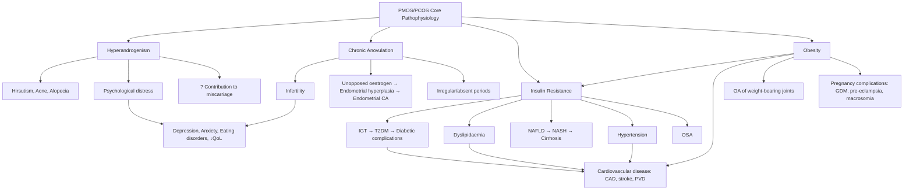

## Complications of PMOS (formerly PCOS)

---

PMOS/PCOS is far more than a reproductive disorder. It is a **systemic endocrine-metabolic condition** with complications spanning reproductive, metabolic, oncological, and psychological domains. The complications are best understood by tracing them back to the core pathophysiological drivers: **hyperandrogenism**, **chronic anovulation**, **insulin resistance/hyperinsulinaemia**, and **obesity**.

Think of PMOS/PCOS complications in five domains:

1. **Reproductive complications** (from anovulation and hyperandrogenism)
2. **Metabolic complications** (from insulin resistance)
3. **Cardiovascular complications** (from metabolic syndrome clustering)
4. **Oncological complications** (from unopposed oestrogen)
5. **Psychological complications** (from disease burden and hormonal imbalance)

---

### 1. Reproductive Complications

#### 1A. Infertility

***↓Fertility (due to PCOS)*** [3]

- **Mechanism:** Chronic anovulation → no oocyte release → inability to conceive. PCOS accounts for ~80% of all anovulatory infertility cases.
- Even when ovulation is achieved (spontaneously or with treatment), oocyte quality may be suboptimal due to prolonged follicular arrest in a hyperandrogenic, hyperinsulinaemic milieu. Endometrial receptivity may also be impaired (chronic unopposed oestrogen → desynchronised endometrial development).
- **Key point:** Infertility in PCOS is usually **treatable** — most women can achieve pregnancy with lifestyle modification ± ovulation induction. The prognosis for fertility is generally good compared to other causes of infertility (e.g., POI, severe tubal factor).

#### 1B. Pregnancy Complications

When PCOS women do become pregnant, they face significantly elevated risks:

| Complication | Risk Increase | Pathophysiological Basis |
|---|---|---|
| ***Gestational diabetes mellitus (GDM)*** | 3× higher [21][22] | Pre-existing insulin resistance is amplified by the normal diabetogenic hormonal milieu of pregnancy (human placental lactogen, cortisol, progesterone all worsen insulin resistance). The β-cells, already stressed by chronic hyperinsulinaemia, cannot compensate → hyperglycaemia. ***Effects on pregnancy — Maternal: increased risk of pre-eclampsia, urinary tract infection, preterm labour; increased incidence of caesarean section and instrumental delivery*** [21]. |
| ***Pre-eclampsia*** | 3–4× higher [21] | Insulin resistance → endothelial dysfunction → impaired trophoblast invasion and spiral artery remodelling → placental ischaemia → release of anti-angiogenic factors (sFlt-1, soluble endoglin) → systemic endothelial dysfunction → hypertension + proteinuria. Chronic inflammation and obesity further amplify the risk. |
| **Preterm birth** | 2× higher | Multifactorial: associated with pre-eclampsia, GDM, polyhydramnios, and cervical insufficiency. Also possibly related to chronic low-grade inflammation. |
| ***Large-for-gestational-age (LGA) / Macrosomia*** | Increased [22] | If GDM develops → maternal hyperglycaemia → glucose crosses placenta → fetal hyperinsulinaemia → fetal anabolism → excessive fetal growth (Pedersen hypothesis). ***Fetal/Neonatal: large-for-gestational age, asphyxia and birth trauma*** [22]. |
| ***Caesarean section*** | Increased [21] | Due to macrosomia, failed induction, and maternal comorbidities. |
| **Miscarriage** | Possibly 2× higher (debated) | Mechanisms unclear — possibly related to hyperandrogenism (direct embryotoxicity), hyperinsulinaemia (impaired endometrial decidualisation), elevated PAI-1 (impaired fibrinolysis → placental thrombosis), or obesity. The evidence is mixed and the independent contribution of PCOS vs. obesity is difficult to disentangle. |
| ***Congenital malformations*** (if GDM/pre-existing DM) | Increased if hyperglycaemia in organogenesis [22] | ***Increased risk of congenital malformations: neural tube, skeletal, cardiac, renal, gastrointestinal*** [22]. Hyperglycaemia during the first trimester → oxidative stress → disruption of embryonic organogenesis. This risk is mainly relevant for women with pre-existing DM or poorly controlled early GDM. |
| ***Fetal programming*** | Long-term [22] | ***Long-term consequences on the offspring: fetal programming effect on metabolic and cardiovascular diseases*** [22]. Intrauterine exposure to hyperglycaemia and hyperinsulinaemia → epigenetic changes in fetal metabolic programming → ↑risk of obesity, T2DM, CVD, and even PCOS in offspring. This creates an intergenerational cycle. |
| **Ovarian hyperstimulation syndrome (OHSS)** | Increased during fertility treatment | PCOS ovaries contain multiple FSH-sensitive antral follicles → excessive response to gonadotrophins → multi-follicular development → massive ovarian enlargement, capillary leak syndrome → ascites, pleural effusion, haemoconcentration, VTE, renal failure (severe OHSS). This is an **iatrogenic** complication of fertility treatment, not PCOS itself, but PCOS is the single biggest risk factor for OHSS. |

<Callout title="PCOS Pregnancy = High-Risk Pregnancy" type="error">
Every PCOS pregnancy should be managed as a **high-risk pregnancy**. This means: early OGTT screening for GDM (at booking AND at 24–28 weeks), vigilant monitoring for pre-eclampsia, serial growth scans for macrosomia, and ***strict glycaemic control — insulin usually needed*** [23]. Pre-conception optimisation (weight loss, folic acid, stopping teratogenic drugs) is essential.
</Callout>

#### 1C. Recurrent Pregnancy Loss

- Some studies suggest PCOS women have higher rates of early miscarriage (first trimester), though this is debated.
- Proposed mechanisms: hyperandrogenism → impaired endometrial receptivity; hyperinsulinaemia → ↑PAI-1 (plasminogen activator inhibitor-1) → hypofibrinolysis → placental micro-thrombosis; obesity → chronic inflammation.
- Metformin was previously proposed to reduce miscarriage risk in PCOS, but evidence is inconsistent and it is not recommended solely for miscarriage prevention.

---

### 2. Metabolic Complications

These are the complications that drive long-term morbidity and mortality in PCOS. They are all consequences of the central pathophysiological driver: **insulin resistance**.

#### 2A. Type 2 Diabetes Mellitus

***Metabolic syndrome: cluster of metabolic disorders due to insulin resistance → Manifestations: Type 2 DM, Polycystic ovarian syndrome (PCOS)*** [3]

- **Prevalence:** 30–40% of PCOS women develop impaired glucose tolerance (IGT) by age 30; 5–10% have frank T2DM. The risk of conversion from IGT to T2DM is ~5–10% per year in PCOS (higher than the general population's 1–2%/year).
- **Why so high?** PCOS involves intrinsic insulin resistance (not just obesity-mediated) + compensatory hyperinsulinaemia → progressive β-cell exhaustion over years. ***Progression: hyperinsulinaemic euglycaemia → impaired glucose tolerance → early T2DM → late T2DM with absolute insulin deficiency*** [3].
- **Key screening:** OGTT (preferred over fasting glucose alone — captures post-challenge hyperglycaemia which is often the first abnormality in PCOS).
- Once T2DM develops, all standard **diabetic complications** apply — ***macrovascular (IHD, stroke, PVD) and microvascular (retinopathy, nephropathy, neuropathy)*** [24].

#### 2B. Dyslipidaemia

***Dyslipidaemia, i.e. ↑LDL-C, TG, ↓HDL-C*** [3]

- **Typical pattern:** ↑Triglycerides, ↓HDL-C, ↑small dense LDL (the most atherogenic LDL subtype). Total LDL-C may be only mildly elevated, but the qualitative shift to small dense LDL is highly pro-atherogenic.
- **Mechanism:** Insulin resistance → ↑hepatic VLDL production (driven by ↑FFA flux from adipose tissue to liver) → ↑TG; CETP-mediated exchange of TG for cholesterol esters between VLDL and HDL → TG-enriched HDL → faster hepatic clearance → ↓HDL-C; LDL particles become TG-enriched → hepatic lipase cleaves TG → smaller, denser LDL.
- **Management:** Lifestyle first; statins if indicated by cardiovascular risk assessment.

#### 2C. Metabolic Syndrome

***Diagnostic criteria of metabolic syndrome: Presence of ≥ 3 of: (1) Glucose intolerance or type 2 DM; (2) Hypertension; (3) Hypertriglyceridaemia; (4) ↓HDL-C; (5) Central obesity*** [3]

- PCOS dramatically increases the risk of meeting metabolic syndrome criteria. Studies show 30–40% of PCOS women have metabolic syndrome (vs ~10% of age-matched controls).
- The clustering of these risk factors creates a **multiplicative** (not just additive) cardiovascular risk.

#### 2D. Non-Alcoholic Fatty Liver Disease (NAFLD)

***Non-alcoholic fatty liver disease (NAFLD) — considered the hepatic manifestation of metabolic syndrome*** [7]

- **Prevalence in PCOS:** 30–40% (2–3× higher than age-matched controls).
- **Mechanism:** Insulin resistance → ↑hepatic FFA flux → overwhelmed hepatic export/catabolism → fat accumulation (steatosis) → oxidative stress, lipotoxicity → steatohepatitis (NASH) → fibrosis → cirrhosis.
- Hyperandrogenism may independently contribute to hepatic steatosis (androgens promote hepatic lipogenesis).
- **Screening:** LFTs at diagnosis; liver USS if ALT elevated. Non-invasive fibrosis scores (FIB-4, NFS) for risk stratification.

#### 2E. Obstructive Sleep Apnoea (OSA)

***Respiratory: obesity-hypoventilation syndrome, dyspnoea, OSA*** [3]

- **Prevalence in PCOS:** 5–30× higher than age-matched women.
- **Mechanism:** (1) Obesity → ↑pharyngeal fat deposition → upper airway narrowing → collapsibility during sleep; (2) Androgens may directly affect upper airway muscle tone and central respiratory drive; (3) Insulin resistance is independently associated with OSA severity.
- **Consequences:** Untreated OSA worsens insulin resistance (via sympathetic activation and intermittent hypoxia), exacerbates hypertension, and increases cardiovascular risk — creating another vicious cycle.
- **Screening:** Epworth Sleepiness Scale; polysomnography if symptomatic.

---

### 3. Cardiovascular Complications

***CVS: HTN, CAD, stroke*** [3]

- PCOS women have a clustering of cardiovascular risk factors from young age: insulin resistance, dyslipidaemia, hypertension, chronic inflammation, endothelial dysfunction, and obesity.
- **Subclinical atherosclerosis** markers (carotid intima-media thickness, coronary artery calcification) are increased in PCOS women compared to age-matched controls, even in lean PCOS patients.
- **Hypertension:** Present in 10–30% of PCOS women. Mechanism: insulin resistance → ↑renal sodium reabsorption, sympathetic activation, endothelial dysfunction, ↑angiotensinogen production from adipose tissue.
- **Whether PCOS is an independent CVD risk factor** (beyond the conventional risk factors it causes) is still debated. Large prospective studies have shown inconsistent results regarding hard CVD outcomes (MI, stroke), partly because PCOS women are young and events take decades to manifest. The current consensus is that PCOS **amplifies conventional risk factors** and that aggressive risk factor management is warranted.

<Callout title="Young Women, Old Problems">
The tragedy of PCOS is that it exposes young women (20s–30s) to metabolic risk factors that are typically seen in middle-aged men. A 25-year-old with PCOS may already have insulin resistance, dyslipidaemia, fatty liver, and subclinical atherosclerosis. Without intervention, she faces a lifetime of accelerated cardiovascular ageing. This is why ***metabolic disorder in long term*** [1][12] management is a core pillar — it's not just about periods and hirsutism.
</Callout>

---

### 4. Oncological Complications

#### 4A. Endometrial Hyperplasia and Endometrial Carcinoma

***Menstrual regulation: prevent endometrial hyperplasia/CA*** [1][12]

This is the most important oncological complication. The lecture slides explicitly highlight it as a management priority [1][12].

- **Risk:** 2–6× increased risk of endometrial carcinoma compared to age-matched women.
- **Mechanism (from first principles):**
  1. Chronic anovulation → no corpus luteum → no progesterone production.
  2. Excess androgens are peripherally aromatised to **oestrone** (a weak oestrogen) in adipose tissue (more so in obese women, who have more aromatase-expressing adipose tissue).
  3. Oestrone stimulates endometrial proliferation **without progesterone opposition** (unopposed oestrogen).
  4. The endometrium continuously proliferates → disorganised growth → simple hyperplasia → complex hyperplasia → atypical hyperplasia → **Type I (oestrogen-dependent) endometrial carcinoma**.
  5. This process takes years but can occur in women as young as their 20s–30s in PCOS.
- **Prevention:** This is why ***periodic progestogen for withdrawal bleeding*** and ***COC pills*** [1][12] are so important — they oppose oestrogen-driven endometrial proliferation. Minimum 4 withdrawal bleeds per year. LNG-IUS (Mirena) provides excellent endometrial protection.
- **Screening:** If amenorrhoea > 3 months without endometrial protection, check endometrial thickness on USS. If ≥ 12 mm or irregular bleeding pattern → endometrial biopsy (Pipelle sampling) to exclude hyperplasia/carcinoma.

#### 4B. Other Malignancies

| Cancer | Risk | Evidence / Mechanism |
|---|---|---|
| ***Breast cancer*** [3] | Mildly elevated (debated) | Chronic oestrogen exposure may promote oestrogen receptor-positive breast cancer. However, most studies show the risk increase is modest and may be largely confounded by obesity (an independent breast cancer risk factor). Current guidance does not recommend enhanced breast cancer screening beyond standard age-appropriate guidelines. |
| **Ovarian cancer** | Uncertain / not significantly increased | Despite the old name "polycystic ovary syndrome," PMOS/PCOS does not significantly increase abnormal ovarian cysts and does not clearly increase ovarian cancer risk. Some early studies suggested a mild association, but larger meta-analyses have not confirmed an independent risk after adjusting for parity, OCP use, and BMI. |
| ***Colorectal cancer*** (indirect) | Possibly increased via metabolic risk | Insulin resistance, hyperinsulinaemia, and obesity are established risk factors for colorectal cancer. This is a metabolic-mediated risk rather than a direct PCOS effect. |

---

### 5. Psychological Complications

***Psychological: poor self-esteem, depression*** [3]

This is frequently underestimated but has profound impact on quality of life.

| Complication | Prevalence in PCOS | Mechanism |
|---|---|---|
| **Depression** | 28–64% (vs ~7–10% in general female population) | Multifactorial: (1) **Cosmetic burden** — hirsutism, acne, obesity, alopecia → body image distress → low self-esteem. (2) **Infertility distress** — especially in cultures where motherhood is central to identity (highly relevant in Hong Kong). (3) **Hormonal** — androgens and insulin may directly affect neurotransmitter systems (serotonin, dopamine). (4) **Chronic disease burden** — the knowledge of lifelong metabolic risk is psychologically taxing. (5) **Obesity** — independently associated with depression. |
| **Anxiety** | 34–57% | Similar multifactorial mechanisms. Health anxiety about long-term metabolic complications. Social anxiety related to appearance. |
| **Eating disorders** | Increased prevalence (especially binge eating disorder) | Body dissatisfaction + repeated dieting → disordered eating patterns. Insulin resistance → sugar cravings → binge eating cycle. |
| **Reduced quality of life** | Significant across all domains | Physical, emotional, and social functioning all impaired. Sexual dysfunction is also reported (related to body image, hirsutism, and partner relationship strain). |
| **Impaired body image and self-esteem** | Nearly universal | Hirsutism is consistently rated as the most distressing PCOS symptom across cultures. Weight stigma compounds the problem. |

<Callout title="Screen for Psychological Comorbidity" type="idea">
International guidelines explicitly recommend screening for depression, anxiety, and disordered eating at diagnosis and periodically thereafter. Use validated tools (PHQ-9, GAD-7). Addressing psychological wellbeing improves adherence to lifestyle modification, which in turn improves metabolic and reproductive outcomes. Don't neglect the mind when treating the body.
</Callout>

---

### 6. Dermatological Complications

While hirsutism and acne are **clinical features** of PCOS (already covered), their complications deserve mention:

| Complication | Mechanism |
|---|---|
| **Acne scarring** (including keloids) | Chronic inflammatory acne → dermal damage → fibrosis → permanent scarring. Keloid formation is more common in certain ethnic groups. |
| **Post-inflammatory hyperpigmentation (PIH)** | Acne lesions → inflammation → melanocyte stimulation → hyperpigmented macules. More prominent in darker skin types (Fitzpatrick IV–VI). |
| **Hidradenitis suppurativa (HS)** | Emerging association with PCOS. Both conditions share hyperandrogenism and insulin resistance as pathogenic drivers. HS involves chronic suppurative inflammation of apocrine gland-bearing skin (axillae, groin, inframammary). |

---

### 7. Complications Related to Treatment

These are iatrogenic complications — important to know for safe prescribing.

| Treatment | Complication | Mechanism / Detail |
|---|---|---|
| **COC pills** | VTE (DVT/PE), stroke, MI | Oestrogen component → ↑hepatic synthesis of clotting factors (II, VII, IX, X) → hypercoagulable state. Risk is amplified by obesity, smoking, immobilisation, and older age. Risk is ~3–4× higher than non-users. |
| **COC pills** | Headache, mood changes, breast tenderness, breakthrough bleeding | Hormonal side effects. |
| **Spironolactone** | Hyperkalaemia, menstrual irregularity, breast tenderness | Aldosterone antagonism → ↑K+ retention. Must monitor K+ especially if co-prescribed with ACEi/ARB. |
| **Spironolactone / CPA / Finasteride** | Teratogenicity | Anti-androgen effects → feminisation of male fetus. Absolute requirement for effective contraception during use. |
| **Metformin** | GI upset (nausea, diarrhoea, bloating) | Direct GI irritant effect + altered gut microbiome. Mitigated by slow titration and extended-release formulation. |
| **Metformin** | Lactic acidosis (rare) | Accumulation if renal impairment → inhibits hepatic lactate metabolism. C/I if eGFR < 30. |
| **Isotretinoin (for acne)** | Teratogenicity, hepatotoxicity, hypertriglyceridaemia, mucocutaneous dryness, mood disturbance | Must use two forms of contraception. Monitor LFTs and lipids. |
| **Gonadotrophins** | OHSS, multiple pregnancy | PCOS ovaries are exquisitely FSH-sensitive → multi-follicular development. Use low-dose step-up protocol with intensive monitoring. |
| **Letrozole / Clomifene** | Multiple pregnancy (lower risk with letrozole), ovarian cyst formation | Over-recruitment of follicles. Letrozole has ~3–5% twin rate (vs ~10% with clomifene). |
| **Laparoscopic ovarian drilling** | Periovarian adhesions, reduced ovarian reserve | Thermal/mechanical injury → adhesion formation (may paradoxically worsen fertility). Excessive drilling → premature reduction of ovarian reserve. |

---

### Summary: Complications by Pathophysiological Driver

---

<Callout title="High Yield Summary">

**Complications of PMOS/PCOS span five domains:**

**1. Reproductive:**
- ***Infertility*** (anovulatory — leading cause) [3]
- ***Pregnancy complications:*** GDM (3×), pre-eclampsia (3–4×), macrosomia, preterm birth, ↑Caesarean section [21][22]
- OHSS during fertility treatment
- ***Fetal programming → long-term metabolic/CVD risk in offspring*** [22]

**2. Metabolic:**
- ***T2DM*** (30–40% IGT by age 30; ~10% T2DM) — ***progression: insulin resistance → IGT → T2DM*** [3]
- ***Dyslipidaemia*** (↑TG, ↓HDL-C, ↑small dense LDL) [3]
- ***Metabolic syndrome*** (≥ 3 of 5 criteria) [3]
- ***NAFLD*** (hepatic manifestation of metabolic syndrome) [7]
- ***OSA*** (5–30× higher prevalence) [3]

**3. Cardiovascular:**
- ***HTN, CAD, stroke*** — driven by metabolic risk factor clustering [3]
- Subclinical atherosclerosis from young age

**4. Oncological:**
- ***Endometrial hyperplasia → endometrial carcinoma*** (2–6× risk) — from chronic unopposed oestrogen [1][12]
- ***Menstrual regulation: prevent endometrial hyperplasia/CA*** [1][12]

**5. Psychological:**
- ***Depression*** (28–64%), ***anxiety*** (34–57%), eating disorders, ***poor self-esteem*** [3]
- Screen at diagnosis and periodically

</Callout>

---

<ActiveRecallQuiz
  title="Active Recall - Complications of PMOS/PCOS"
  items={[
    {
      question: "Explain the step-by-step mechanism by which PCOS leads to endometrial carcinoma.",
      markscheme: "(1) Chronic anovulation means no corpus luteum and no progesterone. (2) Excess androgens are peripherally aromatised to oestrone in adipose tissue. (3) Oestrone causes continuous unopposed oestrogen stimulation of the endometrium. (4) Endometrium proliferates without progesterone-induced shedding. (5) Progression: simple hyperplasia → complex hyperplasia → atypical hyperplasia → Type I (oestrogen-dependent) endometrial carcinoma. Risk is 2-6x higher. Prevention: periodic progestogen withdrawal bleeds or COC pills (minimum 4 bleeds/year).",
    },
    {
      question: "List four pregnancy complications that are increased in PCOS women and explain the unifying pathophysiological mechanism.",
      markscheme: "GDM (3x), pre-eclampsia (3-4x), macrosomia/LGA, and increased Caesarean section rate. Unifying mechanism: pre-existing insulin resistance is amplified by diabetogenic pregnancy hormones (hPL, cortisol, progesterone) → hyperglycaemia (GDM) → maternal glucose crosses placenta → fetal hyperinsulinaemia → fetal anabolism → macrosomia. Insulin resistance also causes endothelial dysfunction → impaired placentation → pre-eclampsia.",
    },
    {
      question: "Why are PCOS women at particularly high risk of OHSS during fertility treatment? How is this risk mitigated?",
      markscheme: "PCOS ovaries contain multiple FSH-sensitive antral follicles. Gonadotrophin stimulation recruits many follicles simultaneously → massive ovarian enlargement, capillary leak syndrome (ascites, pleural effusion, haemoconcentration, VTE, renal failure). Mitigation: (1) Low-dose step-up gonadotrophin protocol. (2) GnRH antagonist protocol with agonist trigger instead of hCG trigger during IVF. (3) Intensive USS and oestradiol monitoring — cancel cycle if >3 follicles >=14 mm. (4) Metformin may reduce OHSS risk as adjunct.",
    },
    {
      question: "Describe the metabolic progression from insulin resistance to T2DM in PCOS patients. At what stage would you expect to first detect an abnormality on OGTT?",
      markscheme: "Progression: (1) Insulin resistance → compensatory hyperinsulinaemia (euglycaemia maintained). (2) Beta-cell compensation fails in genetically susceptible individuals → impaired glucose tolerance (IGT). (3) Progressive beta-cell failure → relative insulin deficiency → T2DM. (4) Late: absolute insulin deficiency. The first OGTT abnormality is elevated 2-hour glucose (7.8-11.0 mmol/L = IGT) while fasting glucose may still be normal — this is why OGTT is preferred over fasting glucose alone for screening in PCOS.",
    },
    {
      question: "A PCOS patient on COC pills and spironolactone presents with leg swelling and shortness of breath. What complication should you consider and why?",
      markscheme: "Venous thromboembolism (DVT/PE). COC pills increase VTE risk 3-4x via oestrogen-mediated increase in hepatic synthesis of clotting factors (II, VII, IX, X), creating a hypercoagulable state. Risk is amplified by obesity (common in PCOS) and immobilisation. Spironolactone itself does not increase VTE risk but the combination with COC + obesity + PCOS creates a high-risk profile. Investigate with D-dimer and CTPA/USS legs.",
    },
  ]}
/>

---

## References

[1] Lecture slides: GC 114. Climacteric symptoms menopause and related illness; amenorrhoea.pdf (p28)
[3] Senior notes: Ryan Ho Endocrine.pdf (p77, p117)
[7] Senior notes: Ryan Ho GI.pdf (p309 — NAFLD)
[12] Lecture slides: Block C - Climacteric symptoms_ menopause and related illness; amenorrhoea.pdf (p14)
[21] Lecture slides: GC 115. I am pregnant medical problems complicating pregnancy.pdf (p12)
[22] Lecture slides: GC 115. I am pregnant medical problems complicating pregnancy.pdf (p13)
[23] Lecture slides: GC 115. I am pregnant medical problems complicating pregnancy.pdf (p15)
[24] Senior notes: Ryan Ho Endocrine.pdf (p94 — Chronic diabetic complications)
