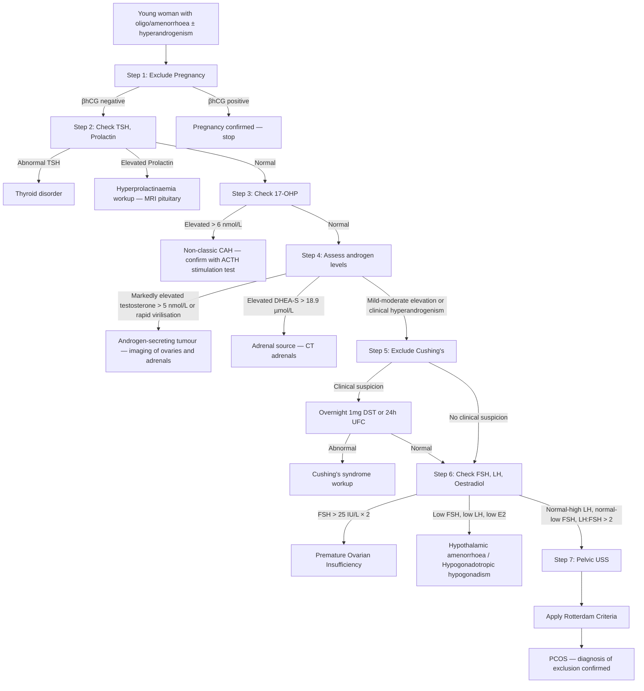

## Differential Diagnosis of PCOS

PCOS is a **diagnosis of exclusion**. Before you can confidently label someone with PCOS, you must systematically rule out other conditions that can mimic one or more of the three Rotterdam criteria (oligo-anovulation, hyperandrogenism, polycystic ovarian morphology). Think of it this way: PCOS sits at the intersection of **menstrual irregularity**, **hyperandrogenism**, and **metabolic dysfunction** — and plenty of other conditions can produce these features.

The differential diagnosis is best approached by considering which presenting feature you are evaluating.

---

### Conceptual Framework: Why Do We Need a DDx?

The Rotterdam criteria are **phenotypic** — they describe what you see, not the underlying cause. Many conditions can produce:
- **Oligo/amenorrhoea** (any disruption of the HPO axis)
- **Hyperandrogenism** (any excess androgen source — ovarian, adrenal, exogenous, or peripheral)
- **Polycystic ovarian morphology** (can be an incidental finding in up to 20–30% of normal women)

Therefore, the diagnostic approach requires you to **exclude mimics before applying the Rotterdam label**. This is not just academic — missing congenital adrenal hyperplasia or an androgen-secreting tumour has serious consequences.

---

### Systematic Differential Diagnosis

#### A. Conditions Mimicking Hyperandrogenism

| Condition | Key Distinguishing Features | Why It Mimics PCOS |
|---|---|---|
| ***Congenital adrenal hyperplasia (CAH) — non-classic/late-onset*** [5][8][9] | Elevated ***17-hydroxyprogesterone (17-OHP)*** [9]; autosomal recessive; may present with primary or secondary amenorrhoea, hirsutism, acne; 21-hydroxylase deficiency is commonest | Adrenal androgen excess from impaired cortisol synthesis → ↑ACTH → adrenal hyperplasia → shunting of steroid precursors into androgen pathway. Can cause oligo-anovulation + hyperandrogenism + even polycystic ovarian morphology. **The single most important differential to exclude** — prevalence ~1–5% of hyperandrogenic women. |
| **Androgen-secreting tumours** (ovarian: Sertoli-Leydig cell, hilus cell; adrenal: carcinoma, adenoma) [5][8] | **Rapid onset** (weeks to months) of **virilisation** (clitoromegaly, voice deepening, male-pattern baldness, ↑muscle mass); markedly elevated testosterone (typically > 5 nmol/L or > 150 ng/dL); adrenal tumours also have ↑DHEA-S | Tumour autonomously secretes large quantities of androgens. Unlike PCOS, which causes mild-moderate hyperandrogenism over years, tumours produce **severe, rapidly progressive virilisation**. |
| ***Cushing's syndrome*** [2][5][8][10] | ***Truncal obesity, moon face, buffalo hump, purplish striae, thin skin, easy bruising, proximal myopathy*** [10]; HTN, hyperglycaemia; oligo/amenorrhoea due to cortisol-mediated GnRH suppression; ***hirsutism, acne (↑ACTH → ↑androgen)*** [10] | Excess cortisol from any cause → ↑adrenal androgens (ACTH-dependent forms) + metabolic syndrome features. The overlap with PCOS can be significant (central obesity, menstrual irregularity, hirsutism, insulin resistance). **Screen with overnight 1mg dexamethasone suppression test** [10][11]. |
| ***Hyperprolactinaemia*** [2][5][8][12] | Galactorrhoea, headache, visual field defects (if macroadenoma); amenorrhoea/oligomenorrhoea; may have mild hyperandrogenism | Elevated prolactin → suppresses GnRH pulsatility → ↓LH/FSH → oligo-anovulation → secondary amenorrhoea. Mild androgen excess can occur because ↓FSH → ↓aromatase → ↓conversion of androgens to oestrogens. Also, prolactin may directly stimulate adrenal DHEA-S production. **Check serum prolactin.** |
| **Acromegaly** [13] | Coarsening of facial features, prognathism, large hands/feet, ↑shoe/glove size, headache, visual field defects, skin thickening, ***hirsutism (56%)*** [13], sweating, OSA | GH excess → IGF-1 mediated effects on hair follicles and sebaceous glands → hirsutism and skin changes. Also causes insulin resistance → metabolic syndrome features resembling PCOS. Amenorrhoea can occur due to pituitary mass effect or co-secretion of prolactin. |
| **Drug-induced hyperandrogenism** [8] | History of anabolic steroids, testosterone, DHEA supplements, danazol, valproic acid (increases androgen levels and can cause PCOM) | Exogenous androgens or drugs that alter steroidogenesis directly cause hyperandrogenic features. Valproic acid is particularly important — it causes weight gain, insulin resistance, and PCOS-like features in women with epilepsy. |
| **Idiopathic hirsutism** | Hirsutism with **normal androgens, regular ovulatory cycles, normal ovarian morphology** | Increased **peripheral 5α-reductase activity** in skin → enhanced conversion of testosterone to the more potent DHT → hirsutism without systemic androgen excess. By definition, this is NOT PCOS (no oligo-anovulation, no biochemical hyperandrogenism). |

#### B. Conditions Mimicking Oligo/Amenorrhoea

***The differential diagnosis of secondary amenorrhoea*** [5]:

| Category | Conditions | Key Features / Why It's in the DDx |
|---|---|---|
| ***Physiological*** [5] | ***Pregnancy, menopause, lactation*** | **Always exclude pregnancy first** — the most common cause of secondary amenorrhoea in reproductive-age women. ***Don't forget the PHYSIOLOGICAL causes e.g. pregnancy!*** [12]. Lactational amenorrhoea is due to prolactin-mediated GnRH suppression. |
| ***Hypothalamic*** [5][2] | ***Functional hypothalamic amenorrhoea (FHA)*** (***weight change: obesity, anorexia nervosa; psychological disturbance; excessive exercise***) [2]; ***Kallmann syndrome (GnRH deficiency)***; brain lesions [5] | FHA: Chronic energy deficit or stress → ↓GnRH pulsatility → ↓LH/FSH → anovulation. Distinguishing from PCOS: FHA patients typically have **low** LH, FSH, and oestradiol (hypogonadotropic hypogonadism), while PCOS patients have **normal-to-high LH** with normal-to-low FSH. FHA patients are often underweight or have history of restrictive eating/intense exercise. |
| ***Pituitary*** [5][2] | ***Hyperprolactinaemia***; ***Sheehan's syndrome*** (postpartum pituitary necrosis); pituitary adenomas; empty sella [5][2] | See hyperprolactinaemia above. ***Sheehan's syndrome*** [2]: postpartum haemorrhage → pituitary infarction → hypopituitarism → amenorrhoea + failure of lactation. Clue: history of severe PPH. |
| ***Ovarian*** [5][2] | ***Premature ovarian insufficiency (POI)*** (***chromosomal disorders e.g. Turner syndrome, surgery, radiotherapy, chemotherapy, mumps, autoimmune***) [2][5][12] | POI: Depletion or dysfunction of ovarian follicles before age 40. Key distinguishing feature: ***FSH > 25 IU/L × twice (≥ 4 weeks apart)*** [12] — this is **hypergonadotropic hypogonadism** (elevated FSH because the ovary is failing, so no negative feedback). PCOS has **normal-to-low FSH**. |
| ***Thyroid disorders*** [2][8][12] | Hypothyroidism, hyperthyroidism | Hypothyroidism → ↑TRH → ↑prolactin → GnRH suppression → amenorrhoea. Also, hypothyroidism → ↓SHBG → ↑free androgens → may mimic mild hyperandrogenism. Hyperthyroidism → ↑SHBG → altered gonadotropin dynamics. **Always check TFT.** |
| ***Anatomic*** [5] | ***Asherman's syndrome*** (extensive intrauterine adhesions due to instrumentation); ***MRKH syndrome*** (Müllerian duct agenesis) [5]; outflow tract obstruction [12] | Asherman's: Post-curettage intrauterine adhesions → mechanical obstruction to menstrual flow → amenorrhoea despite normal HPO axis function. The ovaries are cycling normally. Clue: history of uterine instrumentation (D&C, especially post-pregnancy). |

#### C. Conditions Mimicking Polycystic Ovarian Morphology

| Condition | Explanation |
|---|---|
| **Normal variant PCOM** | Up to 20–30% of young women in the general population have polycystic ovarian morphology on ultrasound without meeting PCOS criteria. This is especially common in adolescents. PCOM alone is NOT sufficient for diagnosis. |
| **Hypothalamic amenorrhoea** | Prolonged anovulation from any cause can lead to accumulation of small antral follicles → PCOM-like appearance. The underlying hormonal milieu is different (low gonadotropins in FHA vs. elevated LH in PCOS). |
| **Hypothyroidism** | Can cause ovarian enlargement with multicystic appearance due to elevated TSH cross-reacting with FSH receptors (rare, but documented). |
| **CAH** | As above — can cause PCOM secondary to hyperandrogenism disrupting follicular development. |

---

### Diagnostic Approach: Systematic Exclusion Algorithm

The following mermaid diagram illustrates the systematic approach to differentiating PCOS from its mimics:

---

### Key Distinguishing Features: PCOS vs. Main Differentials

| Feature | PCOS | Non-classic CAH | FHA | POI | Cushing's | Androgen-secreting tumour |
|---|---|---|---|---|---|---|
| **Onset** | Peri-menarchal, gradual | Peri-menarchal or later | Associated with stress/weight loss/exercise | Variable (< 40y) | Gradual (months-years) | Rapid (weeks-months) |
| **BMI** | Often ↑ (but can be lean) | Variable | Often ↓ or normal | Variable | Central obesity | Variable |
| **Virilisation** | No (mild-moderate HA only) | Rarely | No | No | Rarely | **Yes — key red flag** |
| **LH:FSH** | ↑LH:FSH (often > 2:1) | Variable | Both low | ↑↑FSH | Variable | Variable |
| **Testosterone** | Mildly ↑ | Mildly ↑ | Normal/low | Normal/low | Mildly ↑ | **Markedly ↑ (> 5 nmol/L)** |
| **17-OHP** | Normal | **Elevated** | Normal | Normal | Normal | Normal |
| **DHEA-S** | Normal/mildly ↑ | Mildly ↑ | Normal | Normal | ↑ | ↑↑ (if adrenal source) |
| **Cortisol** | Normal | Normal | Normal/low | Normal | **Elevated (fails to suppress)** | Normal |
| **FSH** | Normal-low | Normal | Low | **> 25 IU/L** | Normal | Normal |
| **Prolactin** | Normal | Normal | Normal/mildly ↑ | Normal | Normal | Normal |
| **PCOM on USS** | Present (≥ 2/3 criteria) | May be present | May be present | Small/atrophic ovaries | Not typical | Unilateral mass |

---

### Summary of Mandatory Investigations to Exclude Mimics

Before diagnosing PCOS, you **must** perform the following baseline investigations (this is essentially your "exclusion checklist"):

1. **βhCG** — exclude pregnancy
2. **TSH** — exclude ***thyroid disorders*** [2][8][12]
3. **Serum prolactin** — exclude ***hyperprolactinaemia*** [2][5][8][12]
4. **17-hydroxyprogesterone (17-OHP)** — exclude ***congenital adrenal hyperplasia*** [8][9][12]
5. **Total testosterone ± DHEA-S** — if markedly elevated, investigate for ***androgen-secreting tumour*** [5][8]
6. **FSH (± LH, oestradiol)** — distinguish PCOS (normal-low FSH) from ***premature ovarian insufficiency*** (***FSH > 25 IU/L***) [12] and hypothalamic amenorrhoea (low FSH, low LH)
7. **Consider overnight 1mg DST or 24h UFC** — if clinical features suggest ***Cushing's syndrome*** [10][11]

<Callout title="Exam Trap" type="error">
A common exam mistake is to diagnose PCOS without excluding other causes. Remember: **PCOS is a diagnosis of EXCLUSION.** You cannot apply the Rotterdam criteria until you have checked at minimum: βhCG, TSH, prolactin, and 17-OHP. If there is any suspicion of Cushing's or tumour, additional workup is mandatory. The question stem may deliberately include a subtle clue pointing to CAH or Cushing's — don't miss it.
</Callout>

<Callout title="Rapid Virilisation = NOT PCOS" type="error">
If a woman presents with **rapidly progressive** deepening of voice, clitoromegaly, temporal balding, or markedly elevated testosterone (> 5 nmol/L / > 150 ng/dL), this is **virilisation** and suggests an **androgen-secreting tumour**, not PCOS. PCOS produces mild-moderate hyperandrogenism over years. Speed of onset and severity of virilisation are the key discriminators.
</Callout>

---

<Callout title="High Yield Summary">

**PCOS is a diagnosis of exclusion.** Before applying the Rotterdam criteria, you must rule out:

1. **Pregnancy** (βhCG)
2. ***Thyroid disorders*** (TSH) [2][12]
3. ***Hyperprolactinaemia*** (prolactin) [2][5][12]
4. ***Non-classic CAH*** (17-OHP — the most important mimic) [8][9][12]
5. ***Cushing's syndrome*** (overnight DST if clinically suspected) [10][11]
6. **Androgen-secreting tumour** (if testosterone markedly ↑ or rapid virilisation) [5][8]
7. ***Premature ovarian insufficiency*** (FSH > 25 IU/L × 2) [12]
8. **Functional hypothalamic amenorrhoea** (low LH, FSH, E2 — associated with underweight/stress/excessive exercise) [2][5]

**Key discriminators:**
- **LH:FSH ratio > 2:1** favours PCOS
- **FSH > 25** favours POI
- **Low LH + low FSH + low E2** favours hypothalamic cause
- **Elevated 17-OHP** favours non-classic CAH
- **Rapid virilisation + testosterone > 5 nmol/L** favours tumour
- **Failed cortisol suppression** favours Cushing's

</Callout>

---

<ActiveRecallQuiz
  title="Active Recall - Differential Diagnosis of PCOS"
  items={[
    {
      question: "Name the mandatory baseline investigations required before diagnosing PCOS, and state what each excludes.",
      markscheme: "Beta-hCG (pregnancy); TSH (thyroid disorder); Prolactin (hyperprolactinaemia); 17-hydroxyprogesterone (non-classic CAH); Total testosterone +/- DHEA-S (androgen-secreting tumour if markedly elevated); FSH (POI if >25 IU/L, hypothalamic amenorrhoea if low). Consider overnight DST if Cushing's suspected.",
    },
    {
      question: "A 22-year-old woman presents with 3 months of rapidly progressive voice deepening, facial hair, and clitoromegaly. Testosterone is 8.2 nmol/L. Is this PCOS? What is the most likely diagnosis and next step?",
      markscheme: "No — rapid virilisation with markedly elevated testosterone (>5 nmol/L) is NOT PCOS. Most likely diagnosis is androgen-secreting tumour (ovarian e.g. Sertoli-Leydig cell tumour, or adrenal). Next step: imaging — pelvic USS for ovarian tumour and CT adrenals for adrenal tumour. Also check DHEA-S (if markedly elevated, suggests adrenal source).",
    },
    {
      question: "How do you distinguish PCOS from premature ovarian insufficiency (POI) biochemically?",
      markscheme: "PCOS: normal-to-low FSH, elevated or normal LH (LH:FSH ratio often >2:1), normal-to-mildly elevated androgens. POI: FSH >25 IU/L on at least 2 occasions at least 4 weeks apart (hypergonadotropic hypogonadism), with low oestradiol. Ovaries may appear small/atrophic on USS in POI vs polycystic morphology in PCOS.",
    },
    {
      question: "Why is non-classic congenital adrenal hyperplasia (CAH) the single most important differential to exclude before diagnosing PCOS? How do you screen for it?",
      markscheme: "Non-classic CAH (21-hydroxylase deficiency) has prevalence of 1-5% among hyperandrogenic women and can present identically to PCOS (hirsutism, acne, oligo-anovulation, even PCOM). It is autosomal recessive with treatment implications (glucocorticoid replacement). Screen with early-morning 17-hydroxyprogesterone (17-OHP). If elevated (>6 nmol/L or >200 ng/dL), confirm with ACTH stimulation test showing exaggerated 17-OHP response.",
    },
    {
      question: "A young underweight woman presents with secondary amenorrhoea. LH and FSH are both low. Does she have PCOS? What is the likely diagnosis?",
      markscheme: "No. Low LH and low FSH indicate hypogonadotropic hypogonadism, most likely functional hypothalamic amenorrhoea (FHA) due to energy deficit, stress, or excessive exercise. PCOS typically shows normal-to-high LH with normal-to-low FSH and an elevated LH:FSH ratio. FHA is due to suppressed GnRH pulsatility from chronic caloric restriction/stress.",
    },
  ]}
/>

---

## References

[2] Lecture slides: GC 117. I want to have a baby male and female infertility.pdf (p32)
[5] Senior notes: Maksim Medicine Notes.pdf (p79, p103)
[8] Senior notes: Maksim Medicine Notes.pdf (p103 — Hyperandrogenism aetiology)
[9] Senior notes: Ryan Ho Endocrine.pdf (p74 — Congenital Adrenal Hyperplasia)
[10] Senior notes: Maksim Medicine Notes.pdf (p99 — Cushing's syndrome)
[11] Senior notes: Ryan Ho Chemical Path.pdf (p29 — Diagnosis of Cushing Syndrome)
[12] Lecture slides: Block C - Climacteric symptoms_ menopause and related illness; amenorrhoea.pdf (p9, p14, p15)
[13] Senior notes: Ryan Ho Endocrine.pdf (p111 — Acromegaly)
