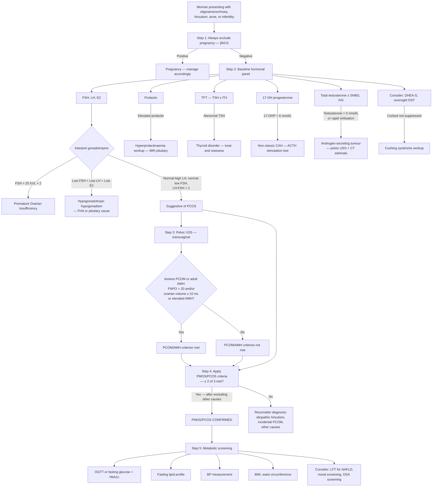

## Diagnostic Criteria, Algorithm, and Investigations for PMOS (formerly PCOS)

---

### 1. Diagnostic Criteria

#### 1.1 Current Adult Diagnostic Criteria (2023 International Guideline)

PMOS, formerly PCOS, remains a **phenotypic diagnosis of exclusion**. In adults, the 2023 International Guideline keeps the familiar **2 out of 3** framework, **after exclusion of other aetiologies** [1][12][17]:

> ***Two out of the three criteria (Rotterdam consensus):***
> 1. ***Oligo-anovulation***
> 2. ***Clinical / biochemical hyperandrogenism***
> 3. ***Polycystic ovarian morphology on ultrasound (FNPO > 20 and/or ovarian volume ≥ 10 mL) OR elevated AMH in adults*** [1][12][17]

Let's dissect each criterion from first principles so you understand exactly what you're looking for and *why*.

---

#### Criterion 1: Oligo-anovulation

**What counts?**
- **Oligomenorrhoea:** Cycle length > 35 days (i.e., < 9 cycles per year). Some definitions use > 6 weeks [5].
- **Amenorrhoea:** Absence of menses for ≥ 3 months in a woman with previously regular cycles, or ≥ 6 months if previously irregular.
- **Anovulation with regular cycles:** Less common, but some women with PCOS have cycles that appear regular (25–35 days) yet are anovulatory. Confirmed by **low mid-luteal progesterone** (see below).

**Why does this happen in PCOS?**
Recall the pathophysiology: ↑GnRH pulse frequency → ↑LH, ↓FSH → insufficient FSH to drive a dominant follicle to maturity → follicular arrest → no ovulation → no corpus luteum → no progesterone → no organised secretory-phase endometrium → no regular withdrawal bleed.

**How to assess:**
- **Clinical history:** Menstrual calendar/diary — the simplest and most important tool.
- ***Serum mid-luteal progesterone levels (a week before next expected period)*** [14]: Progesterone > 16 nmol/L (> 5 ng/mL) confirms ovulation occurred. If low → anovulatory cycle.
  - Why mid-luteal? Because progesterone peaks 7 days after ovulation (i.e., day 21 in a 28-day cycle). If cycles are irregular, you estimate: expected period date minus 7 days.
- ***For irregular cycles: FSH, prolactin, thyroxine*** [14] — to investigate the cause of anovulation.
- ***For regular cycles: prolactin or thyroxine not indicated*** [14] — the focus is on confirming ovulation with mid-luteal progesterone.

<Callout title="Adolescent Caveat" type="error">
In adolescents, physiological oligo-anovulation is common as the HPO axis matures. The 2023 International Guideline recommends **caution** in diagnosing PMOS/PCOS in adolescents — both hyperandrogenism AND persistent ovulatory dysfunction should be present. Ultrasound criteria for PCOM and AMH should NOT be used in adolescents due to high prevalence of multifollicular ovaries and immature AMH thresholds as normal developmental variants.
</Callout>

---

#### Criterion 2: Clinical and/or Biochemical Hyperandrogenism

**Clinical hyperandrogenism** — any one of:
- **Hirsutism:** Excess terminal hair in androgen-dependent areas. Assessed by the **modified Ferriman-Gallwey (mFG) score** across 9 body areas (upper lip, chin, chest, upper back, lower back, upper abdomen, lower abdomen, upper arms, thighs). Score ≥ 4–6 is significant (ethnicity-dependent — use lower threshold ≥ 4 for East Asian women).
- **Acne:** Moderate-severe acne, especially if persistent beyond adolescence or resistant to standard treatment.
- **Androgenic alopecia:** Female-pattern hair loss (Ludwig pattern — diffuse thinning at crown with preserved frontal hairline).

**Biochemical hyperandrogenism** — elevated androgens on blood tests:
- **Total testosterone:** The most commonly measured. Mildly elevated in PCOS (typically 1.5–5 nmol/L). 
- **Free testosterone** (calculated or measured): More sensitive than total testosterone because SHBG is often suppressed in PCOS (due to hyperinsulinaemia), meaning total testosterone may be "normal" while free testosterone is elevated.
- **SHBG:** Low in PCOS due to insulin-mediated hepatic suppression. A low SHBG increases bioavailable testosterone.
- **Free Androgen Index (FAI):** = (Total testosterone / SHBG) × 100. A calculated surrogate for free testosterone. Elevated FAI is a sensitive marker.
- **DHEA-S:** Mildly elevated in ~50% of PCOS (adrenal contribution). Markedly elevated DHEA-S (> 18.9 µmol/L) suggests adrenal tumour.
- **Androstenedione:** May be elevated; less commonly measured.

**Why both clinical AND biochemical?**
Because some women have clear hirsutism or acne but normal blood androgens (due to ↑peripheral 5α-reductase activity or ethnic variation), while others have elevated androgens but minimal clinical signs (ethnic variation in hair follicle sensitivity). Either alone satisfies this criterion.

---

#### Criterion 3: Sonographic Features of Polycystic Ovaries (PCOM)

***Polycystic ovarian morphology on ultrasound*** [1][12]:
- ***Follicle number per ovary (FNPO) of > 20*** — using modern transvaginal ultrasound probes (≥ 8 MHz). The original 2003 threshold was > 12, but with improved ultrasound resolution, more follicles are detected in normal women, so international guidance raised the threshold to > 20.
- ***and/or an ovarian volume ≥ 10 mL*** — calculated by the prolate ellipsoid formula: 0.5 × length × width × depth.

**What are you seeing?**
Multiple small antral follicles (2–9 mm), often arranged peripherally in a "string of pearls" pattern, with echogenic (bright) central stroma due to stromal hyperthecosis. These are NOT true cysts — they are arrested follicles that failed to achieve dominance.

**Important caveats:**
- **Only one ovary** needs to meet the criteria.
- **Transvaginal USS** is the gold standard. If transvaginal is not possible (e.g., in adolescents or virgo intacta), transabdominal USS can be used, but ovarian volume ≥ 10 mL should be used (follicle count is unreliable transabdominally).
- **Do NOT use PCOM as a criterion in adolescents < 8 years post-menarche** — multifollicular ovaries are a normal developmental finding.
- **Timing:** Ideally in the early follicular phase (days 3–5) to avoid confusion with a dominant follicle or corpus luteum.
- **If on COC pills:** Ultrasound morphology is altered (COCs suppress follicle development); PCOM assessment should ideally be done ≥ 3 months after stopping COCs.

**Anti-Müllerian Hormone (AMH) as an alternative:**
The 2023 International Guideline allows **serum AMH** as an alternative to ultrasound for PCOM in adults (not adolescents). AMH is produced by granulosa cells of small antral follicles — elevated AMH reflects the increased follicle count, but thresholds remain assay- and population-specific. AMH has the advantages of being:
- Not affected by the day of the cycle.
- Not operator-dependent.
- Useful when USS is not possible.

However, AMH should **not** be used as a stand-alone diagnostic test, should **not** be used in adolescents, and should not be combined with ultrasound simply to "double count" the same PCOM criterion. Assay standardisation is still evolving, so interpret local thresholds carefully.

---

#### 1.2 Comparison of Diagnostic Criteria Across Guidelines

| Feature | NIH 1990 | Rotterdam 2003 | AE-PCOS Society 2006 | 2023 International Guideline |
|---|---|---|---|---|
| Hyperandrogenism | Required | 2 of 3 | Required | 2 of 3 in adults |
| Oligo-anovulation | Required | 2 of 3 | Either OA or PCOM | 2 of 3 |
| PCOM on USS | Not included | 2 of 3 | Either OA or PCOM | 2 of 3; FNPO > 20 and/or ovarian volume ≥ 10 mL |
| Exclusion of other causes | Yes | Yes | Yes | Yes |
| AMH as alternative to USS | No | No | No | Yes, adults only |
| Adolescent modifications | No | No | No | Yes — require HA + persistent ovulatory dysfunction; avoid USS/AMH |

<Callout title="For Exams: Use Rotterdam" type="idea">
The Rotterdam-style 2-of-3 framework is what is taught in the HKUMed lecture slides [1][12] and remains the international adult framework. For exam purposes during the name transition, state: "PMOS/PCOS is diagnosed by 2 out of 3 criteria after exclusion of other aetiologies; AMH can substitute for ultrasound in adults only."
</Callout>

---

### 2. Diagnostic Algorithm

The diagnostic workup for PCOS has two goals:
1. **Exclude mimics** (the conditions from the DDx section)
2. **Confirm ≥ 2 of 3 adult diagnostic criteria**

And then a third step:
3. **Screen for metabolic complications** (because PCOS is not just a reproductive disorder — it's a metabolic one)

#### Step-by-Step Algorithm

---

### 3. Investigation Modalities: Detailed Interpretation

I'll now walk through every investigation systematically, explaining what you're measuring, why, expected findings in PCOS, and how to interpret abnormalities.

#### 3.1 First-Line Investigations (Mandatory for All Suspected PCOS)

***Amenorrhoea — Evaluation: Investigations: FSH, LH, E2, PRL, TFT, testosterone*** [15][16]

| Investigation | What You're Measuring | Expected in PCOS | Why / Interpretation |
|---|---|---|---|
| **βhCG** | Human chorionic gonadotropin | Negative | ***Don't forget the PHYSIOLOGICAL causes e.g. pregnancy!*** [12]. Always the first test. |
| **FSH** | Follicle-stimulating hormone | Normal to low (typically 3–8 IU/L) | FSH is relatively suppressed because: (1) ↑GnRH pulse frequency favours LH over FSH, (2) chronic oestrogen exposure (from peripheral aromatisation of androgens) suppresses FSH, (3) elevated inhibin B from multiple small antral follicles suppresses FSH. ***High FSH ( > 25 IU/L) indicates ovarian insufficiency*** [2][4][14] — NOT PCOS. |
| **LH** | Luteinising hormone | Elevated (often > 10 IU/L) | ↑GnRH pulse frequency preferentially drives LH synthesis. LH excess stimulates theca cell androgen production. |
| ***LH:FSH ratio*** | Ratio of LH to FSH | ***> 2–2.5*** [8] | A classic (though not universal) finding in PCOS. Present in ~60% of cases. The elevated ratio reflects the neuroendocrine dysregulation. However, a normal ratio does NOT exclude PCOS — it is supportive, not diagnostic. |
| **Oestradiol (E2)** | Serum oestradiol | Normal to mildly elevated | In PCOS, E2 is not low (unlike in POI or FHA) because: (1) there are many antral follicles producing some oestradiol, (2) peripheral aromatisation of excess androgens to oestrone (E1) in adipose tissue contributes to total oestrogen levels. Chronically "tonic" (non-cyclical) oestrogen without the mid-cycle surge. |
| **Prolactin** | Serum prolactin | Normal | To exclude ***hyperprolactinaemia*** [2][4][12][14][15][16]. Elevated prolactin → suggests prolactinoma or drug-related cause. Note: mild prolactin elevation (up to 1.5× ULN) can occur in PCOS itself (due to chronic oestrogen stimulation of lactotrophs), so marked elevation is more concerning. |
| **TSH (± fT4)** | Thyroid function | Normal | To exclude ***thyroid disorders*** [2][4][14][15][16]. Both hypothyroidism and hyperthyroidism can cause menstrual irregularity. Hypothyroidism also lowers SHBG → ↑free androgens, potentially mimicking PCOS. |
| **Total testosterone** | Main circulating androgen | Mildly elevated (typically 1.5–5 nmol/L) | Confirms biochemical hyperandrogenism. In PCOS, testosterone is mildly to moderately elevated. **If > 5 nmol/L (> 150 ng/dL) → suspect androgen-secreting tumour** [8]. Drawn fasting, in the morning (testosterone has diurnal variation — highest in the AM). |
| **17-OH progesterone (17-OHP)** | Steroid precursor in cortisol synthesis pathway | Normal (< 6 nmol/L / < 200 ng/dL in early follicular phase) | To exclude ***congenital adrenal hyperplasia (non-classic 21-hydroxylase deficiency)*** [8][9][15][16]. In CAH, 21-hydroxylase deficiency blocks cortisol synthesis → 17-OHP accumulates → shunted into androgen pathway. If 17-OHP is elevated, confirm with **ACTH (Synacthen) stimulation test**: exaggerated 17-OHP response (> 30 nmol/L) confirms CAH. Best measured in the early follicular phase (days 3–5) in the morning. |

#### 3.2 Second-Line Investigations (Based on Clinical Suspicion)

***Other Investigations (depending on the cause):*** ***Androgens (SHBG, 17-OH progesterone), E+P withdrawal test, Dynamic tests: GnRH test for pituitary function*** [15][16]

| Investigation | When to Order | Expected in PCOS | Interpretation |
|---|---|---|---|
| **SHBG** | When total testosterone is borderline/normal but clinical hyperandrogenism is present | Low | Hyperinsulinaemia suppresses hepatic SHBG production → ↑free (bioavailable) testosterone. Low SHBG is itself a marker of insulin resistance. |
| **Free Androgen Index (FAI)** | Calculated: (Total testosterone / SHBG) × 100 | Elevated (> 5) | More sensitive than total testosterone for detecting biochemical hyperandrogenism because it accounts for low SHBG. |
| **DHEA-S** | If virilisation or markedly elevated testosterone — to localise androgen source | Normal or mildly elevated | DHEA-S is almost exclusively of adrenal origin. Mild elevation is common in PCOS (~50% of cases). **Markedly elevated DHEA-S (> 18.9 µmol/L) suggests adrenal tumour or adrenal hyperplasia.** |
| **Androstenedione** | Additional androgen assessment | May be elevated | Produced by both ovary and adrenal. Less commonly measured but can be elevated when testosterone is borderline. |
| ***Overnight 1mg dexamethasone suppression test (DST)*** [10][11] | If clinical features suggest Cushing's syndrome (central obesity, striae, bruising, myopathy, hyperglycaemia) | Normal (cortisol suppresses to < 50 nmol/L) | To exclude ***Cushing's syndrome*** [10][11][14]. In Cushing's, cortisol fails to suppress because the HPA axis is driven autonomously (by ACTH-secreting adenoma, ectopic ACTH, or adrenal tumour). |
| ***Progestogen challenge test*** [15][16] | To assess endogenous oestrogen status in amenorrhoeic women | Withdrawal bleed occurs → indicates adequate oestrogen and patent outflow tract | Give medroxyprogesterone acetate 10 mg/day for 5–10 days. If withdrawal bleeding occurs within 2–7 days of completing the course → confirms (1) the endometrium has been primed by oestrogen (i.e., oestrogen is present, ruling out severe hypo-oestrogenism), and (2) the outflow tract is patent (ruling out Asherman's). In PCOS, withdrawal bleeding typically occurs (because chronic anoestrone keeps the endometrium proliferated). |
| ***E+P withdrawal test*** [15][16] | If progestogen challenge test produces no bleeding — to distinguish outflow tract obstruction from hypo-oestrogenism | Bleeding after combined oestrogen + progesterone → confirms outflow tract is patent but oestrogen levels are very low (hypogonadism) | Give conjugated oestrogen (1.25 mg/day for 21 days) + medroxyprogesterone acetate (10 mg/day for last 5 days). If still no bleed → outflow tract problem (Asherman's, cervical stenosis). |
| ***GnRH stimulation test*** [15][16] | If hypogonadotropic hypogonadism — to distinguish hypothalamic from pituitary cause | Not typically needed in PCOS workup | IV GnRH bolus → measure LH and FSH response at 20 and 60 minutes. Exaggerated LH response in PCOS. No/blunted response → pituitary disease. Delayed response (better at 60 min) → hypothalamic cause. |

#### 3.3 Pelvic Ultrasound

***USG pelvis*** [15][16]

| Parameter | Criteria for PCOM | Interpretation |
|---|---|---|
| ***Follicle number per ovary (FNPO)*** | ***> 20*** [1][12] (per ovary, using TVS with ≥ 8 MHz probe) | Count follicles 2–9 mm in both longitudinal and transverse planes. The original 2003 threshold was > 12, but modern guidance raised this to > 20 to account for improved ultrasound technology detecting more follicles. |
| ***Ovarian volume*** | ***≥ 10 mL*** [1][12] | Calculated as 0.5 × length × width × depth (prolate ellipsoid formula). Enlarged ovaries reflect stromal hypertrophy (from chronic LH stimulation) + multiple arrested follicles. |
| **Distribution pattern** | Peripheral arrangement ("string of pearls") | Classic but not required for diagnosis. Follicles arranged along the ovarian cortex with echogenic (bright) central stroma. |
| **Endometrial thickness** | May be thickened | Chronic unopposed oestrogen → endometrial proliferation. If endometrium is > 12 mm in a non-pregnant, non-secretory phase, consider endometrial sampling to exclude hyperplasia. |

**Practical points:**
- **Only one ovary** needs to meet the PCOM criteria.
- **Timing:** Best in early follicular phase (days 3–5 of cycle, if menstruating) to avoid confusion with a dominant follicle or corpus luteum cyst.
- **Transvaginal USS** is the gold standard. **Transabdominal USS** can be used if TVS is not possible (e.g., virgin patients), but rely on ovarian volume rather than follicle count.
- **On COC pills:** Morphology is altered; ideally reassess ≥ 3 months after stopping.
- **Exclude other ovarian pathology:** Look for adnexal masses, solid components (→ tumour), dermoid cysts, endometriomas.

#### 3.4 Additional Radiological and Specialised Investigations

***Radiological: 3D USG pelvis / MRI / USG renal tract; Pituitary imaging; Visual field by perimetry*** [15][16]

| Investigation | Indication | What You're Looking For |
|---|---|---|
| ***Pituitary imaging (MRI)*** [15][16] | Suspected pituitary cause — hyperprolactinaemia, visual symptoms, hypopituitarism | Pituitary adenoma (prolactinoma, non-functioning adenoma, Cushing's disease). Not needed routinely in PCOS workup unless prolactin is elevated or pituitary pathology is suspected. |
| ***Visual field perimetry*** [15][16] | If pituitary macroadenoma suspected | Bitemporal hemianopia from optic chiasm compression. |
| **CT adrenals** | Markedly elevated testosterone or DHEA-S → adrenal tumour | Adrenal mass. |
| **MRI pelvis** | Equivocal USS, suspected ovarian tumour, Müllerian anomaly | Better tissue characterisation than USS. |
| ***Laparoscopy / hysteroscopy*** [15][16] | Suspected outflow tract problem (Asherman's), endometriosis, tubal assessment in infertility | Direct visualisation of pelvic anatomy. Not part of routine PCOS workup. |

#### 3.5 Metabolic Screening (Essential in All Confirmed PCOS)

This is critical because PCOS is a **metabolic disease** as much as a reproductive one. The long-term morbidity is driven by metabolic complications.

| Investigation | What You're Screening For | Expected Findings in PCOS | Frequency |
|---|---|---|---|
| **Oral Glucose Tolerance Test (OGTT) — 75g** | Impaired glucose tolerance (IGT), T2DM | Fasting glucose ≥ 5.6 mmol/L = IFG; 2h glucose 7.8–11.0 = IGT; ≥ 11.1 = T2DM. OGTT is preferred over fasting glucose alone because many PCOS women have **normal fasting glucose but abnormal 2h glucose** (post-challenge hyperglycaemia due to insulin resistance). | At diagnosis, then every 1–3 years depending on risk |
| **Fasting glucose + HbA1c** | Diabetes screening | HbA1c ≥ 48 mmol/mol (6.5%) = T2DM. Can be used alongside OGTT. HbA1c alone may miss early IGT. | At diagnosis, then annually |
| **Fasting lipid profile** | ***Dyslipidaemia, i.e. ↑LDL-C, TG, ↓HDL-C*** [3] | Typical pattern: ↑triglycerides, ↓HDL-C, ↑LDL-C (or ↑small dense LDL). This atherogenic lipid profile is driven by insulin resistance. | At diagnosis, then every 1–2 years |
| **Blood pressure** | Hypertension | May be elevated — part of ***metabolic syndrome*** [3]. | Every visit |
| **BMI + waist circumference** | Obesity, central adiposity | BMI ≥ 23 overweight, ≥ 25 obese (Asian criteria). Waist circumference ≥ 80 cm in Asian women indicates central obesity. | Every visit |
| **Liver function tests (LFT)** | ***NAFLD*** [3][7] | May show mild ↑ALT/AST (typically < 2× ULN). If elevated, consider liver USS. | At diagnosis |
| **Fasting insulin (± HOMA-IR)** | Insulin resistance | Fasting insulin often > 60 pmol/L. HOMA-IR = (fasting glucose × fasting insulin) / 22.5. Values > 2.5 suggest insulin resistance. Note: fasting insulin is NOT routinely recommended in international guidance due to poor standardisation, but is used in some centres. | Not routine |
| **Mood/depression screening** | Psychological comorbidity | PHQ-9 or similar validated tool. Prevalence of depression 28–64% in PCOS. | At diagnosis, then periodically |
| **OSA screening** | Obstructive sleep apnoea | Epworth Sleepiness Scale. If symptomatic or BMI > 30 → refer for polysomnography. | If symptomatic |

<Callout title="Why OGTT Over Fasting Glucose?" type="idea">
In PMOS/PCOS, insulin resistance preferentially affects post-prandial glucose handling. Many women will have a normal fasting glucose but an abnormal 2-hour post-load glucose on OGTT. Using fasting glucose or HbA1c alone will **miss up to 40% of women with IGT or T2DM**. International guidance recommends OGTT as the preferred metabolic screening test in PMOS/PCOS.
</Callout>

#### 3.6 Investigations for Fertility Assessment (When Infertility Is the Presenting Complaint)

***Investigations of anovulation*** [14]:

| Investigation | Purpose | Interpretation |
|---|---|---|
| ***Mid-luteal progesterone*** [14] | Confirm ovulation | > 16 nmol/L (> 5 ng/mL) = ovulation confirmed. Low → anovulatory cycle. |
| **Serial transvaginal USS (follicle tracking)** | Monitor follicular development | Tracks dominant follicle growth (should reach ~18–24 mm before ovulation). In PCOS: multiple small follicles without dominant follicle development. Used during ovulation induction. |
| **Endometrial assessment** | Assess endometrial receptivity; exclude hyperplasia | If endometrium is thickened (> 12 mm) in an anovulatory patient, consider endometrial biopsy/sampling to exclude hyperplasia or carcinoma. |
| **Tubal patency testing** | Exclude tubal factor (coexisting cause of infertility) | Hysterosalpingography (HSG), HyCoSy (hystero-contrast sonography), or laparoscopy with chromotubation. Not a PCOS-specific investigation but part of complete infertility workup. |
| **Partner semen analysis** | Exclude male factor | Always assess both partners simultaneously. |

---

### 4. Putting It All Together: Summary of Investigations by Category

| Category | Investigations | Purpose |
|---|---|---|
| **Exclude pregnancy** | βhCG | Always first |
| ***Baseline hormonal panel*** [15][16] | ***FSH, LH, E2, PRL, TFT, testosterone*** | Assess HPO axis, exclude mimics |
| ***Androgen panel*** [15][16] | Total testosterone, SHBG, FAI, ***17-OH progesterone***, ± DHEA-S | Confirm biochemical HA, exclude CAH and tumour |
| **Imaging** | ***USG pelvis*** [15][16] (TVS preferred) | Assess PCOM, endometrial thickness, exclude other pelvic pathology |
| **Exclude Cushing's** | Overnight 1mg DST (if clinically suspected) | Cortisol suppression |
| **Metabolic screening** | OGTT, HbA1c, fasting lipids, BP, BMI, waist circumference, LFTs | Assess metabolic syndrome components |
| **Fertility-specific** | Mid-luteal progesterone, follicle tracking, HSG, semen analysis | When infertility is the complaint |
| ***Further investigations*** [15][16] | ***Karyotype (primary amenorrhoea, POI), Fragile X premutation (POI), autoimmune screening, pituitary imaging, visual field perimetry, laparoscopy/hysteroscopy*** | Depending on the suspected underlying cause |

---

### 5. Interpretation Pearls: Common Hormonal Patterns

| Hormonal Pattern | Diagnosis |
|---|---|
| **↑LH, normal/↓FSH, LH:FSH > 2, mildly ↑testosterone, ↓SHBG, PCOM on USS** | **PCOS** (classic) |
| **↑↑FSH (> 25 IU/L), ↓E2, normal/↓androgens** | Premature ovarian insufficiency |
| **↓LH, ↓FSH, ↓E2, normal androgens** | Hypogonadotropic hypogonadism (FHA, pituitary) |
| **↑Prolactin, ↓LH/FSH** | Hyperprolactinaemia |
| **Abnormal TSH** | Thyroid disorder |
| **↑17-OHP (> 6 nmol/L)** | Non-classic CAH |
| **↑↑Testosterone (> 5 nmol/L), ± ↑DHEA-S** | Androgen-secreting tumour |
| **Cortisol not suppressed on DST** | Cushing's syndrome |

<Callout title="The Classic PCOS Biochemical Profile" type="idea">
Remember the "**LIT**" mnemonic for PCOS biochemistry: **L**H elevated (with LH:FSH > 2), **I**nsulin elevated (with ↓SHBG), **T**estosterone mildly elevated. Add to this: AMH elevated, OGTT often abnormal, and lipid profile showing ↑TG, ↓HDL-C.
</Callout>

---

<Callout title="High Yield Summary">

**Diagnostic Criteria:** ***Current adult criteria — 2 out of 3, after excluding other causes:*** [1][12][17]
1. ***Oligo-anovulation***
2. ***Clinical / biochemical hyperandrogenism***
3. ***PCOM on ultrasound (FNPO > 20 and/or ovarian volume ≥ 10 mL) OR elevated AMH in adults***

**Mandatory baseline investigations:** ***FSH, LH, E2, PRL, TFT, testosterone*** [15][16]; plus βhCG, 17-OHP; ***USG pelvis*** [15][16]

**Second-line:** ***SHBG, 17-OH progesterone, DHEA-S*** [15][16]; progestogen challenge test; overnight DST if Cushing's suspected

**Key hormonal pattern in PMOS/PCOS:** ↑LH, normal/↓FSH, LH:FSH > 2, mildly ↑testosterone, ↓SHBG, ↑FAI, ↑AMH

**PCOM criterion:** USS FNPO > 20 and/or ovarian volume ≥ 10 mL; **AMH can substitute for USS in adults only**

**Metabolic screening in ALL PMOS/PCOS patients:** OGTT (preferred over fasting glucose alone), fasting lipids, BP, BMI, waist circumference, LFTs

***High FSH ( > 25 IU/L) indicates ovarian insufficiency — NOT PCOS*** [2][4][14]

**Adolescent caution:** Do not use PCOM on USS or AMH for diagnosis; require both HA + persistent ovulatory dysfunction

</Callout>

---

<ActiveRecallQuiz
  title="Active Recall - PCOS Diagnostic Criteria and Investigations"
  items={[
    {
      question: "State the current adult diagnostic criteria for PMOS/PCOS. What must be done before applying these criteria?",
      markscheme: "2 out of 3: (1) Oligo-anovulation, (2) Clinical or biochemical hyperandrogenism, (3) Polycystic ovarian morphology on USS — FNPO >20 and/or ovarian volume >=10 mL — or elevated AMH in adults. Must exclude other causes first (diagnosis of exclusion): pregnancy, thyroid disorders, hyperprolactinaemia, non-classic CAH, Cushing's syndrome, androgen-secreting tumours.",
    },
    {
      question: "List the mandatory baseline blood investigations for evaluating suspected PCOS and explain what each test excludes.",
      markscheme: "Beta-hCG (pregnancy); FSH and LH (POI if FSH >25, hypogonadotropic hypogonadism if both low); E2 (hypo-oestrogenic states); Prolactin (hyperprolactinaemia); TSH (thyroid disorders); Total testosterone (if markedly elevated >5 nmol/L suggests tumour); 17-OH progesterone (non-classic CAH if elevated).",
    },
    {
      question: "Explain why the LH:FSH ratio is elevated in PCOS. Is a normal ratio sufficient to exclude PCOS?",
      markscheme: "Increased GnRH pulse frequency in PCOS preferentially drives LH synthesis over FSH. Also, chronic anoestrogen exposure and elevated inhibin B from multiple antral follicles suppress FSH. The typical LH:FSH ratio is >2:1. However, a normal ratio does NOT exclude PCOS — it is present in only about 60% of cases and is supportive, not diagnostic.",
    },
    {
      question: "Why is OGTT preferred over fasting glucose alone for metabolic screening in PCOS?",
      markscheme: "In PCOS, insulin resistance preferentially affects post-prandial glucose handling. Many women have normal fasting glucose but abnormal 2-hour post-load glucose. Using fasting glucose or HbA1c alone misses up to 40% of women with IGT or T2DM. The 75g OGTT captures post-challenge hyperglycaemia.",
    },
    {
      question: "A 16-year-old girl presents with irregular periods and mild acne. USS shows FNPO of 22. Can you diagnose PCOS?",
      markscheme: "No. In adolescents, USS criteria for PCOM and AMH should NOT be used because multifollicular ovaries and immature AMH thresholds are normal developmental variants. Current guidance uses stricter adolescent criteria: both hyperandrogenism AND persistent ovulatory dysfunction must be present. Mild acne alone is insufficient for clinical hyperandrogenism in a teenager.",
    },
    {
      question: "Describe the progestogen challenge test: how is it performed, what does a positive result mean, and what does a negative result prompt?",
      markscheme: "Give medroxyprogesterone acetate 10 mg/day for 5-10 days. Positive result: withdrawal bleeding within 2-7 days of completing course — confirms adequate endogenous oestrogen and patent outflow tract. In PCOS, withdrawal bleed typically occurs. Negative result (no bleeding): proceed to E+P withdrawal test. If bleeding occurs with E+P — hypo-oestrogenic state (hypothalamic/pituitary cause). If still no bleeding — outflow tract obstruction (Asherman's syndrome).",
    },
  ]}
/>

---

## References

[1] Lecture slides: GC 114. Climacteric symptoms menopause and related illness; amenorrhoea.pdf (p14)
[2] Lecture slides: GC 117. I want to have a baby male and female infertility.pdf (p32, p33)
[3] Senior notes: Ryan Ho Endocrine.pdf (p77)
[4] Lecture slides: Block C - I want to have a baby_ male and female infertility.pdf (p11)
[5] Senior notes: Maksim Medicine Notes.pdf (p79)
[7] Senior notes: Ryan Ho GI.pdf (p309)
[8] Senior notes: Maksim Medicine Notes.pdf (p103 — Hyperandrogenism)
[9] Senior notes: Ryan Ho Endocrine.pdf (p74 — CAH)
[10] Senior notes: Maksim Medicine Notes.pdf (p99 — Cushing's syndrome)
[11] Senior notes: Ryan Ho Chemical Path.pdf (p29 — Diagnosis of Cushing Syndrome)
[12] Lecture slides: Block C - Climacteric symptoms_ menopause and related illness; amenorrhoea.pdf (p9)
[14] Lecture slides: GC 117. I want to have a baby male and female infertility.pdf (p24, p33)
[15] Lecture slides: GC 114. Climacteric symptoms menopause and related illness; amenorrhoea.pdf (p19, p20)
[16] Lecture slides: Block C - Climacteric symptoms_ menopause and related illness; amenorrhoea.pdf (p11)
[17] Teede HJ, et al. Recommendations from the 2023 International Evidence-based Guideline for the Assessment and Management of Polycystic Ovary Syndrome. Fertility and Sterility. 2023.
[18] Teede HJ, et al. Polyendocrine metabolic ovarian syndrome, the new name for polycystic ovary syndrome: a multistep global consensus process. Lancet. 2026.
