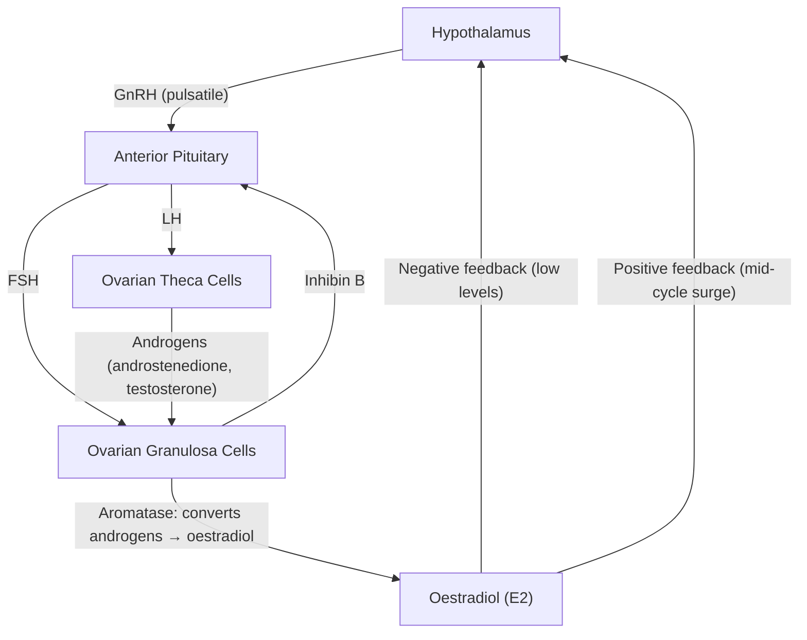
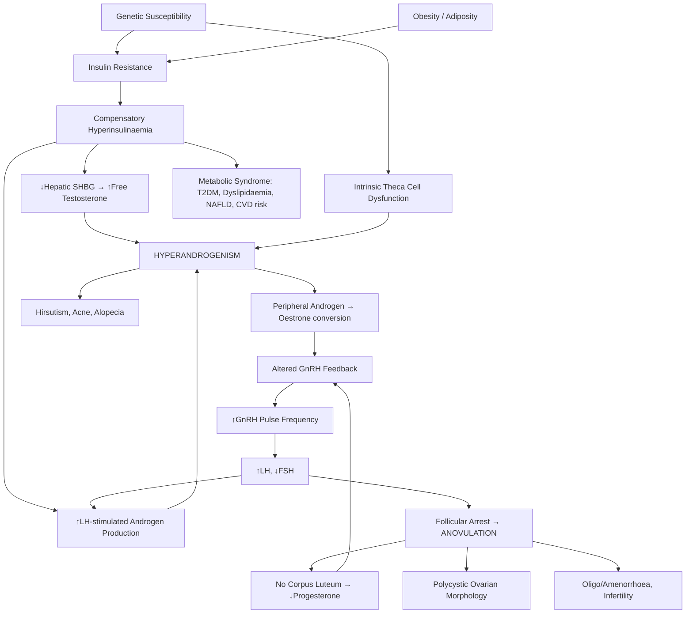

# Polycystic Ovarian Syndrome (PCOS)

---

## 1. Definition

Polycystic Ovarian Syndrome (PCOS) is a **heterogeneous endocrine-metabolic disorder** characterised by a combination of hyperandrogenism, ovulatory dysfunction, and polycystic ovarian morphology. It is the most common endocrine disorder in women of reproductive age and a leading cause of anovulatory infertility.

Let's break down the name:
- **Poly** = many; **cystic** = cyst-like (referring to the multiple small antral follicles arrested in development, giving a "string of pearls" appearance on ultrasound — they are *not* true cysts but rather follicles that failed to reach dominance); **ovarian** = of the ovary; **syndrome** = a constellation of features, not a single disease.

The internationally accepted diagnostic framework is the **Rotterdam Consensus (2003, revised 2018 by the International PCOS Network)**, which requires **two out of three** criteria [1][2]:

> ***Two out of the three criteria (Rotterdam consensus):***
> 1. ***Oligo-anovulation***
> 2. ***Clinical / biochemical hyperandrogenism***
> 3. ***Sonographic features of polycystic ovaries (Follicle number per ovary of > 20 and/or an ovarian volume ≥ 10 mL)*** [1]

<Callout title="Important Nuance" type="error">
PCOS is a diagnosis of **exclusion**. Other causes of hyperandrogenism and anovulation (e.g., congenital adrenal hyperplasia, androgen-secreting tumours, Cushing's syndrome, thyroid disorders, hyperprolactinaemia) must be ruled out before making the diagnosis. Many students forget this step.
</Callout>

---

## 2. Epidemiology

### Prevalence
- **5–15%** of women of reproductive age worldwide (varies by diagnostic criteria used — NIH criteria give ~6–8%, Rotterdam criteria give ~10–15%).
- One of the most common reasons for gynaecology outpatient referral.
- In **Hong Kong / East Asian populations**, prevalence estimated at ~5–10%. The phenotypic expression may differ — Asian women with PCOS tend to have **lower BMI** but similar metabolic derangement (so-called "lean PCOS"), higher insulin resistance for a given BMI, and potentially less overt hirsutism (due to ethnic variation in androgen-dependent hair growth) [3].

### Age
- Typically presents in **late adolescence to early reproductive years** (15–30 years).
- Symptoms often begin around **menarche** or shortly after.
- May persist into the **perimenopausal period**, though hyperandrogenism tends to attenuate with age as ovarian androgen production declines.

### Burden
- Leading cause of **anovulatory infertility** (accounts for ~80% of anovulatory infertility cases) [2][4].
- Major contributor to **metabolic syndrome**, **type 2 diabetes**, and **cardiovascular risk** in young women [3][5].
- Associated with significant **psychological morbidity** (anxiety, depression, poor body image).

---

## 3. Risk Factors

| Category | Risk Factor | Mechanism / Explanation |
|---|---|---|
| **Genetic** | Family history of PCOS | Polygenic inheritance; first-degree relatives have 20–40% risk; candidate genes involve steroidogenesis, insulin signalling, gonadotropin regulation |
| **Genetic** | Family history of T2DM | Shared insulin resistance pathways |
| ***Obesity*** | ***Central / visceral obesity*** | ***Adipocytes release large amounts of FFA → insulin resistance; adipocytes release adipokines → insulin resistance*** [3][5]. Hyperinsulinaemia then drives ovarian androgen excess. ~50–70% of PCOS patients are overweight/obese. |
| **Insulin resistance** | Intrinsic insulin resistance | Present even in lean PCOS patients — this is intrinsic to PCOS, not solely obesity-mediated |
| **Ethnicity** | South Asian, Middle Eastern, Indigenous Australian | Higher prevalence and more severe metabolic phenotype |
| **Environmental** | Sedentary lifestyle, high-glycaemic diet | Worsen insulin resistance → exacerbate hyperandrogenism |
| **In utero exposure** | Excess prenatal androgen exposure | Animal models suggest fetal androgen programming of the hypothalamic-pituitary-ovarian axis |

<Callout title="Hong Kong Context" type="idea">
In Hong Kong, the prevalence of PCOS is rising in parallel with increasing obesity rates and westernised dietary patterns. However, a significant proportion of PCOS patients in HK are **lean** (BMI < 23 by Asian criteria) — don't dismiss the diagnosis just because a patient is thin. Insulin resistance can be present without overt obesity in East Asian populations.
</Callout>

---

## 4. Anatomy and Function

Understanding PCOS requires understanding the **hypothalamic-pituitary-ovarian (HPO) axis** and the role of **insulin** as a co-gonadotropin.

### 4.1 Normal HPO Axis and Folliculogenesis

**Normal folliculogenesis (the "two-cell, two-gonadotropin" model):**
1. **Theca cells** (outer layer of follicle) respond to **LH** → produce **androgens** (androstenedione, testosterone) from cholesterol via the steroidogenic pathway.
2. **Granulosa cells** (inner layer) respond to **FSH** → express **aromatase** (CYP19A1) → convert theca-derived androgens into **oestrogens** (mainly oestradiol, E2).
3. In each cycle, a cohort of antral follicles is recruited. Rising FSH selects a **dominant follicle** (the one with the most FSH receptors and aromatase activity), which produces high E2.
4. Rising E2 triggers the **mid-cycle LH surge** → **ovulation**.
5. The ruptured follicle becomes the **corpus luteum**, which produces **progesterone** to support the secretory endometrium.

**Key point:** Normal ovulation depends on a delicate balance of FSH, LH, androgens, and oestrogens. PCOS disrupts virtually every step.

### 4.2 The Polycystic Ovary (Morphology)

The "polycystic" ovary contains:
- **Multiple small antral follicles** (2–9 mm diameter), arrested at the pre-antral/small antral stage, arranged peripherally ("string of pearls" pattern).
- Thickened, fibrotic **ovarian stroma** (due to chronic LH stimulation → stromal hyperthecosis).
- These are **not** true cysts — they are follicles that were recruited but failed to achieve dominance and ovulate due to the abnormal hormonal milieu. They accumulate over successive anovulatory cycles.

---

## 5. Aetiology and Pathophysiology

PCOS has a **multifactorial aetiology** involving genetic susceptibility, intrinsic ovarian steroidogenic abnormalities, neuroendocrine dysregulation, and metabolic/environmental factors. There is no single causative mechanism — it is a **self-perpetuating vicious cycle**.

### 5.1 Core Pathophysiological Mechanisms

#### A. Hyperandrogenism (The Central Feature)

The ovary is the primary source of excess androgens in PCOS, though the adrenal contributes ~20–30%.

**Why does the ovary overproduce androgens?**

1. **Intrinsic theca cell dysfunction:** Theca cells in PCOS ovaries have upregulated steroidogenic enzymes (especially **CYP17A1** — 17α-hydroxylase/17,20-lyase), leading to exaggerated androgen synthesis in response to LH stimulation. This is a fundamental, possibly genetically determined defect.

2. **LH excess and abnormal GnRH pulsatility (see below):** Chronically elevated LH stimulates theca cells to produce more androgens.

3. **Hyperinsulinaemia (see below):** Insulin acts as a **co-gonadotropin** — it augments LH-stimulated androgen production by theca cells. Insulin also:
   - Suppresses hepatic production of **sex hormone-binding globulin (SHBG)** → ↑ free (bioavailable) testosterone.
   - Potentiates adrenal androgen secretion.

4. **Adrenal contribution:** ~50% of PCOS women have elevated **DHEA-S** (dehydroepiandrosterone sulfate), indicating adrenal androgen excess. The mechanism is not fully understood but likely involves dysregulation of adrenal CYP17A1.

#### B. Neuroendocrine Dysregulation (Abnormal GnRH/LH Pulsatility)

- In PCOS, **GnRH pulse frequency is increased** (faster pulses), which favours **LH** synthesis and secretion over FSH.
  - Why? GnRH pulse frequency determines the ratio of LH:FSH. Fast pulses → ↑LH; slow pulses → ↑FSH. In PCOS, the GnRH pulse generator is "set" to a higher frequency.
  - The reason for this is partly due to **reduced progesterone negative feedback** (because anovulation → no corpus luteum → no progesterone → nothing to slow GnRH pulses) and partly intrinsic hypothalamic dysregulation. Excess androgens may also be converted to oestrogens peripherally, contributing to altered feedback.

- **Result: ↑LH, normal-to-low FSH, elevated LH:FSH ratio (often > 2:1)**
  - ↑LH → ↑theca cell androgen production → hyperandrogenism.
  - Relatively low FSH → insufficient stimulation of granulosa cell aromatase → **follicles cannot convert androgens to oestrogens efficiently** → **intra-follicular androgen excess** → **follicular arrest** (follicles cannot develop past the small antral stage) → **anovulation**.
  - Low FSH also means no dominant follicle is selected → multiple small follicles accumulate → polycystic morphology.

#### C. Insulin Resistance and Compensatory Hyperinsulinaemia

This is present in **~70–80%** of PCOS patients and is a key driver of the syndrome.

***Insulin resistance in PCOS is contributed to by:***
- ***Central obesity → adipocytes release large amounts of FFA → insulin resistance; adipocytes release adipokines → insulin resistance*** [3][5]
- **Intrinsic/post-receptor signalling defect** in insulin signalling (selective insulin resistance in metabolic tissues, but ovarian tissues remain insulin-sensitive → a paradox).
- ***Physical inactivity → ↓AMPK activation → ↓glucose uptake + ↓FFA metabolism*** [3]

**Why does hyperinsulinaemia worsen PCOS?** (The vicious cycle)
1. **Ovarian effects:** Insulin synergises with LH to stimulate theca cell androgen production. The ovary does NOT become insulin-resistant — it remains exquisitely sensitive to insulin's steroidogenic effects. So while muscles and liver resist insulin (leading to hyperglycaemia), the ovary responds to high insulin levels by making even more androgens.
2. **Hepatic effects:** Insulin suppresses SHBG synthesis by the liver → ↑free testosterone → more clinical hyperandrogenism (hirsutism, acne).
3. **Adrenal effects:** Insulin potentiates ACTH-stimulated adrenal androgen production.
4. **Metabolic consequences:** Compensatory hyperinsulinaemia → eventual β-cell exhaustion → impaired glucose tolerance → T2DM. This is why PCOS is a major risk factor for ***T2DM*** and is considered part of the ***metabolic syndrome*** [3][5].

#### D. Role of Anti-Müllerian Hormone (AMH)

- AMH is produced by **granulosa cells of small antral follicles**.
- In PCOS, because there are many arrested small antral follicles, **serum AMH is elevated** (often 2–4× normal).
- AMH itself inhibits FSH-dependent follicle growth and aromatase expression → further contributing to follicular arrest and anovulation.
- AMH is increasingly used as a biochemical marker of PCOS (though not yet part of the formal Rotterdam criteria).

#### E. Chronic Low-Grade Inflammation

- PCOS is associated with elevated inflammatory markers (CRP, IL-6, TNF-α).
- Inflammation contributes to insulin resistance and endothelial dysfunction.
- Visceral adipose tissue is a major source of pro-inflammatory cytokines.

### 5.2 Summary: The Self-Perpetuating Vicious Cycle

The beauty (and frustration) of PCOS pathophysiology is that it is a **self-reinforcing loop**:

1. Insulin resistance → hyperinsulinaemia → ↑ovarian androgen production + ↓SHBG.
2. Hyperandrogenism → follicular arrest → anovulation.
3. Anovulation → no progesterone → altered GnRH pulsatility → ↑LH:FSH ratio.
4. ↑LH → more androgen production → more hyperandrogenism.
5. Excess androgens → peripheral aromatisation to oestrone (a weak oestrogen) → chronic unopposed oestrogen → endometrial hyperplasia risk + altered HPO feedback.
6. Obesity worsens insulin resistance → amplifies the entire cycle.

**This is why weight loss (even 5–10%) can break the cycle** — it reduces insulin resistance, lowers insulin levels, reduces androgen production, and can restore ovulation [1].

---

## 6. Classification

### 6.1 Rotterdam Phenotypes

Based on the three Rotterdam criteria, **four phenotypes** are recognised:

| Phenotype | Hyperandrogenism (HA) | Oligo-anovulation (OA) | Polycystic Ovarian Morphology (PCOM) | Metabolic Risk |
|---|---|---|---|---|
| **A ("Classic/Full-blown")** | ✓ | ✓ | ✓ | Highest |
| **B ("Classic without PCOM")** | ✓ | ✓ | ✗ | High |
| **C ("Ovulatory PCOS")** | ✓ | ✗ | ✓ | Moderate |
| **D ("Non-hyperandrogenic")** | ✗ | ✓ | ✓ | Lowest |

<Callout title="Phenotype D Controversy">
Phenotype D (non-hyperandrogenic) is the mildest form and was not recognised under the original NIH 1990 criteria. Some experts argue it may not truly represent PCOS. For exams, know that the metabolic and cardiovascular risk is greatest in phenotypes A and B (the "classic" forms with hyperandrogenism).
</Callout>

### 6.2 Other Classification Frameworks

- **NIH 1990 criteria:** Required both hyperandrogenism AND oligo-anovulation (essentially phenotypes A + B only).
- **AE-PCOS Society (2006):** Required hyperandrogenism plus either oligo-anovulation or PCOM (phenotypes A, B, C).
- **2018 International PCOS Guideline (endorsed by ESHRE/ASRM):** Reaffirmed Rotterdam criteria but with updated ultrasound thresholds (FNPO > 20 with modern high-resolution probes) and recognition of AMH as an alternative to ultrasound in adults.

---

## 7. Clinical Features

### 7.1 Symptoms

| Symptom | Pathophysiological Basis |
|---|---|
| ***Oligo/amenorrhoea*** (irregular, infrequent periods) [1][2] | Chronic anovulation → no corpus luteum → no progesterone-driven secretory endometrium → no regular withdrawal bleed. Cycles are often > 35 days (oligomenorrhoea) or absent for ≥ 6 months (secondary amenorrhoea). |
| **Dysfunctional uterine bleeding / heavy menstrual bleeding** | Chronic anovulation → continuous oestrogen stimulation (from peripheral aromatisation of androgens to oestrone) without progesterone opposition → endometrium proliferates excessively → unstable, thickened endometrium → irregular, sometimes heavy breakthrough bleeding. |
| ***Hirsutism*** (excess terminal hair in male-pattern distribution) [1] | Hyperandrogenism → androgens (especially testosterone and its more potent metabolite DHT via 5α-reductase) stimulate vellus hair follicles to transform into coarse terminal hairs in androgen-sensitive areas (upper lip, chin, chest, linea alba, inner thighs, back). Scored using the **modified Ferriman-Gallwey score** (≥ 4–6 considered significant, varies by ethnicity — lower threshold in East Asians). |
| **Acne** | ***Androgens → ↑sebum production*** [6] by pilosebaceous units → follicular hyperkeratinisation → microcomedo formation → Cutibacterium acnes proliferation → inflammatory acne. ***Often occurs in association with hyperandrogenic states, e.g., PCOS, virilisation tumours*** [6]. |
| **Androgenic alopecia** (female-pattern hair loss) | Excess androgens (DHT) → miniaturisation of scalp hair follicles, especially at the crown and frontal regions. Unlike male-pattern baldness, the frontal hairline is usually preserved in women. |
| ***Infertility*** [2][4] | Anovulation → no oocyte release → failure to conceive. PCOS accounts for ~80% of anovulatory infertility. Even when ovulation occurs, the quality of oocytes and endometrial receptivity may be suboptimal. |
| **Weight gain / difficulty losing weight** | Insulin resistance → hyperinsulinaemia promotes lipogenesis and inhibits lipolysis → favours weight gain, especially central/visceral adiposity. Obesity then worsens insulin resistance (vicious cycle). |
| **Symptoms of insulin resistance** | Fatigue, sugar cravings, postprandial somnolence — all due to impaired glucose utilisation by peripheral tissues despite high circulating insulin. |
| **Psychological symptoms** (anxiety, depression, low self-esteem) | Multifactorial: cosmetic burden of hirsutism/acne/obesity, infertility distress, hormonal imbalance (androgens may directly affect mood), and chronic disease burden. Prevalence of depression/anxiety is significantly higher in PCOS (up to 40%). |
| **Obstructive sleep apnoea symptoms** (snoring, daytime somnolence) | Obesity + possibly androgen-mediated effects on upper airway musculature → ↑OSA risk. Prevalence of OSA in PCOS is 5–30×higher than age-matched controls. |

### 7.2 Signs

| Sign | Pathophysiological Basis |
|---|---|
| **Hirsutism** (on examination) | As above — terminal hair in androgen-dependent areas. Assess with modified Ferriman-Gallwey score across 9 body areas. |
| **Acne** (face, chest, back) | As above — sebaceous gland hyperactivity due to hyperandrogenism. ***Distribution: typically affects areas with largest, hormone-responsive sebaceous glands, e.g., face, neck, chest, upper back, upper arms*** [6]. |
| **Androgenic alopecia** | Thinning at the crown with preservation of frontal hairline (Ludwig pattern in women). |
| ***Acanthosis nigricans*** | Velvety, hyperpigmented, thickened skin typically found in **intertriginous areas** (neck, axillae, groin, inframammary folds). Pathophysiology: hyperinsulinaemia → insulin binds IGF-1 receptors on keratinocytes and fibroblasts → stimulates epidermal and dermal proliferation → thickened, darkened skin. It is a **cutaneous marker of insulin resistance**, not of hyperandrogenism per se. |
| ***Obesity / central adiposity*** | ~50–70% of PCOS patients; characteristically **truncal/central** distribution. WHR (waist-to-hip ratio) is increased. In Hong Kong, BMI ≥ 23 is overweight; ≥ 25 is obese by Asian criteria. |
| **Skin tags (acrochordons)** | Another marker of insulin resistance / hyperinsulinaemia → IGF-1-mediated fibroblast proliferation. |
| **Enlarged, smooth ovaries** (on bimanual examination) | Bilateral ovarian enlargement due to multiple arrested follicles and stromal hypertrophy. Often not palpable clinically — ultrasound is needed. |
| **Signs of virilisation** (if present → suspect androgen-secreting tumour) | **Deepening of voice, clitoromegaly, frontal balding, ↑muscle mass** — these are NOT typical of PCOS (which causes mild-moderate hyperandrogenism). If virilisation is present, suspect an androgen-secreting tumour (ovarian or adrenal) or severe congenital adrenal hyperplasia. This is a crucial red flag. |

<Callout title="PCOS vs. Virilisation" type="error">
PCOS causes **hirsutism, acne, and mild androgenic alopecia** — these are signs of **mild-to-moderate hyperandrogenism**. **Virilisation** (clitoromegaly, voice deepening, male-pattern baldness, increased muscle mass) suggests **severe hyperandrogenism** and should prompt investigation for androgen-secreting tumours or congenital adrenal hyperplasia, NOT PCOS. Don't confuse the two.
</Callout>

### 7.3 Associated Features and Long-Term Associations

| Association | Mechanism |
|---|---|
| ***Metabolic syndrome*** (HTN, dyslipidaemia, insulin resistance, T2DM) [3][5] | ***Insulin resistance → metabolic syndrome: obesity, HT, HL, PCOS, NAFLD*** [3]. PCOS is both a cause and consequence of metabolic syndrome. ↑LDL-C, ↑TG, ↓HDL-C are typical. 30–40% of PCOS women have IGT by age 30; up to 10% have frank T2DM. |
| ***Non-alcoholic fatty liver disease (NAFLD)*** [3][5][7] | ***Considered the hepatic manifestation of metabolic syndrome*** [7]. Insulin resistance → ↑hepatic FFA flux → hepatic steatosis. PCOS women have 2–3× higher prevalence of NAFLD. |
| **Endometrial hyperplasia / endometrial carcinoma** | Chronic anovulation → unopposed oestrogen (from peripheral aromatisation of excess androgens to oestrone in adipose tissue) → continuous endometrial proliferation without progesterone-induced shedding → ↑risk of hyperplasia → potential progression to endometrial carcinoma (Type I, oestrogen-dependent). Risk is 2–6× higher. |
| **Cardiovascular disease risk** | Clustering of risk factors: insulin resistance, dyslipidaemia, obesity, chronic inflammation, endothelial dysfunction. Whether PCOS is an independent CVD risk factor beyond these conventional risk factors is still debated. |
| **Gestational complications** (when pregnancy is achieved) | ↑risk of gestational diabetes (3×), pre-eclampsia (3–4×), preterm birth, macrosomia, and Caesarean section — related to underlying insulin resistance and metabolic dysfunction. |
| ***Obstructive sleep apnoea*** [5] | Obesity + androgen effects on upper airway → ↑ collapsibility. |
| **Psychological morbidity** | Depression (28–64%), anxiety (34–57%), eating disorders, reduced quality of life. |
| ***Breast cancer risk*** | Mildly elevated (controversial) — chronic oestrogen exposure. Most studies show the risk increase is modest and may be confounded by obesity. |

---

## 8. Clinical Approach to PCOS (Pre-Diagnosis Framework)

When you see a young woman presenting with **irregular periods**, **hirsutism**, **acne**, **weight gain**, or **infertility**, think systematically:

### Step 1: Characterise the Presenting Complaint
- **Menstrual history:** Age of menarche, cycle length, regularity, duration and amount of bleeding, last menstrual period.
- **Hyperandrogenic symptoms:** Onset, duration, and progression of hirsutism, acne, hair loss. Rapid onset or virilisation → red flag for tumour.
- **Fertility history:** Duration of trying to conceive, previous pregnancies, partner assessment.
- **Metabolic symptoms:** Weight trajectory, distribution of weight gain, symptoms of diabetes, sleep quality.
- **Psychological impact:** Mood, self-esteem, body image, relationship impact.

### Step 2: Assess Risk Factors
- Family history (PCOS, T2DM, CVD, obesity).
- Weight history, diet, exercise.
- Drug history (e.g., valproate can cause PCOS-like features; exogenous androgens).

### Step 3: Examine
- BMI, waist circumference, blood pressure.
- Skin: hirsutism (Ferriman-Gallwey score), acne, acanthosis nigricans, skin tags, alopecia.
- Abdominal/pelvic examination: assess for ovarian enlargement (bimanual), virilisation signs.
- Thyroid examination (to exclude thyroid disease as cause of menstrual irregularity).

### Step 4: Exclude Other Causes (Differential Diagnosis)
This will be covered in detail in the next section, but the key conditions to exclude are:
- ***Thyroid disorders*** [2][4]
- ***Hyperprolactinaemia*** [2][4]
- ***Congenital adrenal hyperplasia*** (non-classic, 21-hydroxylase deficiency) [2]
- ***Cushing's syndrome*** [2][4]
- ***Androgen-secreting tumours*** (ovarian or adrenal)
- ***Premature ovarian insufficiency*** [2]
- Pregnancy (always the first test!)

### Step 5: Investigate (Diagnosis)
- Hormonal profile, imaging, metabolic workup — to be detailed in the diagnostic section.

---

## 9. Specific Aetiological Considerations in Hong Kong

- **Lean PCOS** is proportionally more common in East Asian populations. Even with BMI < 23, significant insulin resistance and hyperandrogenism can be present. Don't be falsely reassured by a normal BMI.
- **Dietary factors:** Increasing consumption of high-glycaemic-index foods and westernised diets in Hong Kong contribute to worsening metabolic profiles.
- **Ethnic variation in hirsutism:** East Asian women generally have less body hair than Caucasian or South Asian women. Therefore, even mild hirsutism (modified Ferriman-Gallwey score ≥ 4) should raise suspicion for hyperandrogenism in Chinese women.
- **Cultural factors:** Infertility carries significant psychosocial burden in Chinese families, which may drive earlier presentation to fertility clinics. Conversely, menstrual irregularity may be normalised or attributed to Traditional Chinese Medicine concepts (e.g., "blood deficiency"), leading to delayed diagnosis.

---

<Callout title="High Yield Summary">

**Definition:** PCOS is a heterogeneous endocrine-metabolic disorder diagnosed by the **Rotterdam criteria** — ***2 out of 3: (1) oligo-anovulation, (2) clinical/biochemical hyperandrogenism, (3) polycystic ovarian morphology (FNPO > 20 and/or ovarian volume ≥ 10 mL)*** — after excluding other causes.

**Epidemiology:** Most common endocrine disorder in reproductive-age women (5–15%); leading cause of anovulatory infertility (~80%).

**Core Pathophysiology (the vicious cycle):**
1. **Hyperandrogenism** — intrinsic theca cell dysfunction + LH excess + insulin-driven augmentation.
2. **Insulin resistance + hyperinsulinaemia** — ↑ovarian androgens, ↓SHBG, metabolic syndrome.
3. **Abnormal GnRH pulsatility** — ↑LH:FSH ratio → ↑androgens + follicular arrest.
4. **Anovulation** — no dominant follicle → no progesterone → no cycle regulation → unopposed oestrogen.

**Key Clinical Features:**
- Symptoms: Oligo/amenorrhoea, hirsutism, acne, androgenic alopecia, infertility, weight gain, psychological distress.
- Signs: Hirsutism (Ferriman-Gallwey), acne, acanthosis nigricans, central obesity, skin tags.
- Red flags for tumour: Rapid-onset virilisation (clitoromegaly, voice deepening).

**Long-term Associations:** T2DM, metabolic syndrome, NAFLD, endometrial hyperplasia/carcinoma, CVD risk, OSA, psychological morbidity, gestational complications.

***Management pillars (from lecture slides):*** ***Weight reduction; menstrual regulation (prevent endometrial hyperplasia/CA) with periodic progestogen or COC pills; hirsutism management with COC pills, cosmetic measures, anti-oestrogens; fertility via ovulation induction by letrozole / gonadotrophin; long-term metabolic disorder surveillance.*** [1]

</Callout>

---

<ActiveRecallQuiz
  title="Active Recall - PCOS: Definition, Epidemiology, Pathophysiology, and Clinical Features"
  items={[
    {
      question: "State the three Rotterdam criteria for diagnosing PCOS. How many criteria are needed?",
      markscheme: "2 out of 3 required: (1) Oligo-anovulation, (2) Clinical or biochemical hyperandrogenism, (3) Polycystic ovarian morphology on USS (FNPO >20 and/or ovarian volume >=10 mL). Must exclude other causes (diagnosis of exclusion).",
    },
    {
      question: "Explain why hyperinsulinaemia worsens hyperandrogenism in PCOS, despite systemic insulin resistance.",
      markscheme: "Selective insulin resistance: metabolic tissues (muscle, liver) are insulin-resistant, but the ovary remains insulin-sensitive. High insulin acts as a co-gonadotropin, synergising with LH to stimulate theca cell androgen production. Insulin also suppresses hepatic SHBG synthesis, increasing free testosterone levels.",
    },
    {
      question: "Why does PCOS cause anovulation? Explain the hormonal mechanism.",
      markscheme: "Increased GnRH pulse frequency favours LH over FSH secretion. Relatively low FSH means inadequate granulosa cell aromatase activity, so follicles cannot convert androgens to oestrogens efficiently. Intra-follicular androgen excess causes follicular arrest at the small antral stage. No dominant follicle is selected, so no ovulation occurs. Elevated AMH from multiple small follicles further inhibits FSH action.",
    },
    {
      question: "What is acanthosis nigricans, where is it found, and what does it signify in a PCOS patient?",
      markscheme: "Velvety, hyperpigmented, thickened skin in intertriginous areas (neck, axillae, groin). It is a cutaneous marker of insulin resistance and hyperinsulinaemia (not hyperandrogenism). Insulin binds IGF-1 receptors on keratinocytes and fibroblasts, stimulating proliferation.",
    },
    {
      question: "Why are PCOS patients at increased risk of endometrial carcinoma?",
      markscheme: "Chronic anovulation means no corpus luteum and therefore no progesterone production. Excess androgens are peripherally aromatised to oestrone (weak oestrogen) in adipose tissue. This leads to chronic unopposed oestrogen stimulation of the endometrium, causing proliferation, hyperplasia, and potential progression to Type I (oestrogen-dependent) endometrial carcinoma.",
    },
    {
      question: "Distinguish the clinical features of PCOS-related hyperandrogenism from virilisation. Why is this distinction important?",
      markscheme: "PCOS causes mild-moderate hyperandrogenism: hirsutism, acne, androgenic alopecia. Virilisation (clitoromegaly, voice deepening, frontal balding, increased muscle mass) indicates severe hyperandrogenism and suggests androgen-secreting tumour (ovarian/adrenal) or severe congenital adrenal hyperplasia, not PCOS. This distinction is critical because virilisation requires urgent investigation for neoplasia.",
    },
  ]}
/>

---

## References

[1] Lecture slides: GC 114. Climacteric symptoms menopause and related illness; amenorrhoea.pdf (p14, p28)
[2] Lecture slides: GC 117. I want to have a baby male and female infertility.pdf (p32)
[3] Senior notes: Ryan Ho Endocrine.pdf (p77, p117)
[4] Lecture slides: Block C - I want to have a baby_ male and female infertility.pdf (p11)
[5] Senior notes: Maksim Medicine Notes.pdf (p79–80)
[6] Senior notes: Ryan Ho Rheumatology.pdf (p126 — Acne Vulgaris)
[7] Senior notes: Ryan Ho GI.pdf (p309 — NAFLD)
