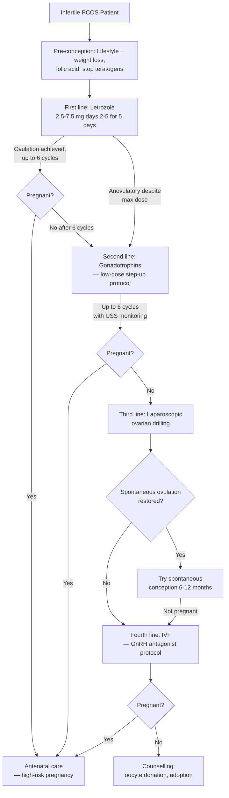

## Management of PCOS

---

### Guiding Principles

Before diving into specifics, understand that PCOS management is **symptom-driven and individualised**. There is no single "cure" — PCOS is a chronic condition. Management is tailored to what the patient's **primary concern** is at that point in her life:

- Is she bothered by **irregular periods** and worried about endometrial cancer?
- Is she distressed by **hirsutism and acne**?
- Is she trying to **conceive**?
- Does she need **metabolic risk reduction**?

These goals often overlap but may also conflict (e.g., COC pills treat hirsutism and regulate periods, but they are contraceptive — useless if the patient wants a baby). So the first question on the ward round is always: ***"What is your main concern right now?"***

***Amenorrhoea is a symptom, NOT a diagnosis. Need to look for the underlying cause and treat accordingly.*** [12]

The lecture slides give us a clear framework for PCOS management [1][12]:

> ***Polycystic Ovary Syndrome management:***
> - ***Weight reduction***
> - ***Menstrual regulation: prevent endometrial hyperplasia/CA***
>   - ***Periodic progestogen for withdrawal bleeding***
>   - ***COC pills***
> - ***Hirsutism: COC pills, cosmetic measures, anti-oestrogens***
> - ***Fertility: ovulation induction by letrozole / gonadotrophin***
> - ***Metabolic disorder in long term*** [1][12]

---

### Management Algorithm

```mermaid
graph TD
    A["PCOS Confirmed"] --> B["Step 1: Lifestyle Modification — ALL patients"]
    B --> B1["Weight reduction — target 5-10% loss"]
    B --> B2["Diet: low GI, caloric restriction if overweight"]
    B --> B3["Exercise: 150 min/week moderate intensity"]
    B --> B4["Behavioural/psychological support"]

    A --> C{"What is the primary concern?"}

    C -->|"Irregular periods /<br/>Endometrial protection"| D["Step 2a: Menstrual Regulation"]
    D --> D1["Cyclical progestogen<br/>for withdrawal bleeding"]
    D --> D2["Combined oral contraceptive pills"]
    D --> D3["Levonorgestrel IUS — Mirena"]

    C -->|"Hirsutism / Acne"| E["Step 2b: Anti-androgen Therapy"]
    E --> E1["COC pills — first line"]
    E --> E2["Add spironolactone or<br/>cyproterone acetate if inadequate"]
    E --> E3["Cosmetic measures:<br/>laser, electrolysis, eflornithine"]
    E --> E4["Topical acne Tx:<br/>retinoids, benzoyl peroxide"]

    C -->|"Infertility /<br/>Wants to conceive"| F["Step 2c: Ovulation Induction"]
    F --> F1["First line: Letrozole"]
    F --> F2["Second line: Gonadotrophins<br/>— low-dose step-up protocol"]
    F --> F3["Third line: Laparoscopic<br/>ovarian drilling"]
    F --> F4["Fourth line: IVF"]

    C -->|"Metabolic risk"| G["Step 2d: Metabolic Management"]
    G --> G1["Screen and treat: IGT/T2DM, dyslipidaemia, HTN"]
    G --> G2["Consider metformin<br/>for insulin resistance"]
    G --> G3["Bariatric surgery if<br/>BMI ≥ 35 with comorbidity"]

    B --> H["Step 3: Long-term Monitoring"]
    H --> H1["OGTT / HbA1c every 1-3 years"]
    H --> H2["Lipid profile every 1-2 years"]
    H --> H3["BP, BMI, waist circumference — every visit"]
    H --> H4["Endometrial surveillance<br/>if prolonged amenorrhoea"]
    H --> H5["Psychological wellbeing screening"]
```

---

### Treatment Modalities: Detailed Discussion

---

#### 1. Lifestyle Modification (Foundation for ALL Patients)

***Weight reduction*** [1][12] is the cornerstone of PCOS management, applicable to every patient regardless of her primary concern. Even **5–10% weight loss** can:
- Restore ovulatory cycles in up to 50–60% of overweight/obese PCOS women.
- Reduce circulating androgens by 20–30%.
- Improve insulin sensitivity → ↓insulin levels → ↓ovarian androgen production + ↑SHBG → ↓free testosterone.
- Improve lipid profile, reduce BP, and decrease long-term CVD and T2DM risk.
- Improve IVF outcomes if fertility treatment is needed.

**Why does weight loss work so powerfully?** Because obesity amplifies the central pathophysiological driver — insulin resistance. Reducing adiposity breaks the vicious cycle:
↓Adipose tissue → ↓FFA + ↓adipokines → ↓insulin resistance → ↓compensatory hyperinsulinaemia → ↓ovarian androgen production + ↑hepatic SHBG → ↓free testosterone → restored follicular development → ovulation.

| Component | Detail | Mechanism |
|---|---|---|
| **Dietary modification** | Caloric restriction (500–750 kcal deficit/day); low glycaemic index (GI) diet preferred; Mediterranean-style diet or DASH diet [17] | Low-GI foods → slower glucose absorption → lower insulin spikes → ↓hyperinsulinaemia. ***Minimize high energy food, esp those with high glycemic index (GI) and glycemic load (GL)*** [17]. |
| **Exercise** | ≥ 150 min/week moderate-intensity aerobic activity (brisk walking, cycling, swimming) + resistance training ≥ 2 times/week [17] | Exercise → ↑AMPK activation → ↑glucose uptake by skeletal muscle + ↑FFA oxidation → ↓insulin resistance, independent of weight loss. Resistance training increases lean muscle mass → ↑basal metabolic rate. |
| **Behavioural support** | Goal-setting, self-monitoring, cognitive-behavioural therapy | Sustaining lifestyle change is the hardest part. PCOS patients often have comorbid depression/anxiety that undermines motivation. Dietitian and psychologist input are valuable. |
| **Psychological support** | Screen for depression, anxiety, disordered eating; refer as needed | Prevalence of depression 28–64% in PCOS. Body image distress from hirsutism/acne/obesity. Untreated psychological morbidity worsens adherence to lifestyle change. |

<Callout title="Lifestyle First, Always">
Every international guideline (2018 International PCOS Guideline, ESHRE, Endocrine Society) recommends lifestyle modification as **first-line therapy for ALL aspects of PCOS** — menstrual irregularity, hyperandrogenism, infertility, and metabolic risk. Pharmacotherapy is always **adjunctive** to lifestyle, not a substitute. This is a common exam point.
</Callout>

---

#### 2. Menstrual Regulation and Endometrial Protection

***Menstrual regulation: prevent endometrial hyperplasia/CA*** [1][12]

**Why is this critical?** Chronic anovulation → continuous unopposed oestrogen (from peripheral aromatisation of excess androgens to oestrone in adipose tissue) → endometrial proliferation without progesterone-induced secretory transformation and shedding → endometrial hyperplasia → potential progression to **endometrial carcinoma** (Type I, oestrogen-dependent). The risk is 2–6× higher in PCOS.

Therefore, **all anovulatory PCOS patients** who are not trying to conceive must have regular endometrial shedding — either by inducing withdrawal bleeds or by directly protecting the endometrium with progestogen.

| Modality | Regimen | Mechanism | Indications | Contraindications / Cautions |
|---|---|---|---|---|
| ***Periodic progestogen for withdrawal bleeding*** [1][12] | Medroxyprogesterone acetate (MPA) 10 mg/day for 10–14 days every 1–3 months, or micronised progesterone 200–400 mg/day for 10–14 days | Exogenous progestogen converts proliferative endometrium to secretory phase → organised shedding (withdrawal bleed) upon cessation → "resets" the endometrium. | Women who do NOT need contraception and have no significant hyperandrogenic symptoms. Simple, minimal systemic effects. | Pregnancy (always do βhCG first). Irregular compliance may result in prolonged gaps without endometrial protection. |
| ***COC pills*** [1][12] | Ethinyloestradiol (EE) 20–35 µg + progestogen (e.g., levonorgestrel, norgestimate, desogestrel, ***or cyproterone acetate — see anti-androgens***) | **Multiple mechanisms:** (1) Progestogen component opposes endometrial proliferation → prevents hyperplasia. (2) Oestrogen component ↑hepatic SHBG → ↓free testosterone. (3) Oestrogen + progestogen suppress GnRH/LH → ↓ovarian androgen production. (4) Provide regular withdrawal bleeds. | ***First-line for women wanting both menstrual regulation AND treatment of hirsutism/acne*** [1][12]. Also provides reliable contraception. | **Absolute C/I:** migraine with aura, active/history of VTE/PE, ischaemic heart disease, stroke, breast cancer, liver disease, uncontrolled HTN, smoking ≥ 15 cig/day if age ≥ 35, < 6 weeks postpartum if breastfeeding. **Cautions:** obesity (↑VTE risk), family history of VTE, immobilisation. |
| **Levonorgestrel intrauterine system (LNG-IUS / Mirena)** | Releases 20 µg levonorgestrel/day locally into the uterine cavity | Local progestogen directly suppresses endometrial proliferation → endometrial atrophy → protects against hyperplasia. Minimal systemic progestogen effects. | Women who cannot take COCs (e.g., VTE risk, smokers > 35); women wanting long-acting reversible contraception (LARC); excellent endometrial protection. | Uterine anomalies (relative), active PID, unexplained vaginal bleeding (investigate first), pregnancy. |

<Callout title="How Often to Induce Withdrawal Bleeds?" type="idea">
The 2018 International PCOS Guideline recommends ensuring endometrial shedding at least **every 3 months** (i.e., minimum 4 withdrawal bleeds per year). If the endometrium becomes ≥ 12 mm on USS in an anovulatory patient, consider endometrial biopsy to exclude hyperplasia before starting treatment.
</Callout>

---

#### 3. Management of Hyperandrogenic Symptoms

##### 3A. Hirsutism

***Hirsutism: COC pills, cosmetic measures, anti-oestrogens*** [1][12]

Hirsutism treatment requires patience — existing terminal hairs will not revert to vellus hairs with medical therapy alone (because the hair follicle has already been "programmed" by androgens). Medical therapy prevents **new** terminal hair growth and slows the growth rate of existing ones. **Cosmetic measures** address existing hair. Allow **6–12 months** for any medical treatment to show full effect (hair growth cycles are long).

| Treatment | Mechanism | Detail | Onset of Effect |
|---|---|---|---|
| ***COC pills — first line*** [1][12] | (1) ↑SHBG → ↓free testosterone. (2) Suppress LH → ↓ovarian androgen production. (3) Mild direct anti-androgen effect of some progestogens (e.g., cyproterone acetate, drospirenone). | Prefer COC containing **anti-androgenic progestogen** (e.g., **cyproterone acetate** (Diane-35), **drospirenone** (Yasmin)). All COCs have some benefit via ↑SHBG, but anti-androgenic progestogens provide additional benefit. | 6–12 months |
| **Spironolactone** | "Spiro" = spiral (steroid structure). An **aldosterone antagonist** that also has potent **anti-androgen** activity: (1) Blocks the androgen receptor (AR). (2) Inhibits 5α-reductase → ↓conversion of testosterone to the more potent DHT. (3) Mildly ↓testosterone synthesis. | Dose: 50–200 mg/day. Often combined with COC for synergy and to prevent menstrual irregularity (spironolactone alone can cause breakthrough bleeding) and to **provide contraception** (spironolactone is teratogenic — feminises male fetuses). | 6–12 months |
| **Cyproterone acetate (CPA)** | Potent progestogen with strong anti-androgen activity. (1) AR antagonist. (2) Inhibits gonadotropin secretion → ↓ovarian androgens. (3) Inhibits 5α-reductase. | Can be used as the progestogen component of COC (Diane-35: EE 35 µg + CPA 2 mg), or as higher-dose add-on (10–50 mg/day on days 1–10 of COC cycle = "reverse sequential regimen"). S/E: hepatotoxicity (rare but serious at high doses), weight gain, depression, ↓libido, VTE risk. | 6–12 months |
| **Finasteride** | "Fin" = five (targets **5α-reductase type 2**). Blocks conversion of testosterone to DHT in skin. DHT is the main androgen driving hair follicle transformation. | 5 mg/day. Less commonly used than spironolactone. Also teratogenic — must use with effective contraception. | 6–12 months |
| **Flutamide** | Non-steroidal pure AR antagonist. Blocks androgen binding at the receptor. | Effective but rarely used due to risk of **fatal hepatotoxicity**. Not recommended as first-line. | 6–12 months |
| ***Cosmetic measures*** [1][12] | Physical removal or camouflage of existing terminal hairs. | **Laser hair removal** (targets melanin in hair follicle → photothermal destruction — works best on dark hair, light skin), **electrolysis** (destroys individual follicles with electric current — effective for all hair types), **intense pulsed light (IPL)**, shaving, waxing, threading, depilatory creams. **Topical eflornithine cream** (Vaniqa): inhibits ornithine decarboxylase in hair follicle → slows hair growth rate. Applied to face twice daily — works while used, hair regrows on cessation. | Immediate (physical methods); 4–8 weeks (eflornithine) |

<Callout title="Anti-androgen + Contraception = Mandatory Pairing" type="error">
**Spironolactone, cyproterone acetate, and finasteride are all teratogenic.** If used in a woman of reproductive age, they **must** be combined with effective contraception (typically a COC). This is a non-negotiable clinical rule and a common exam point. The reason: these drugs cross the placenta and can feminise a male fetus (ambiguous genitalia, hypospadias).
</Callout>

##### 3B. Acne Management in PCOS

Acne in PCOS is driven by hyperandrogenism → ***↑sebum production*** [6]. The approach follows standard acne management guidelines but with emphasis on hormonal therapy [6][18]:

| Severity | Treatment | Notes |
|---|---|---|
| **Mild** | Topical retinoid (comedonal) or benzoyl peroxide (inflammatory), or combination [18] | Standard first-line for any acne. |
| **Moderate** | ***Topical combination Tx + Oral Abx + topical retinoid + BP*** [18]. ***Add COCP or oral spironolactone (F)*** [18] | ***Combined OC pills: downregulate HPG axis → ↓ovarian androgen secretion*** [18]. Adding COC addresses the hormonal root cause. |
| **Severe** | ***Oral Abx + topical combination Tx; Oral isotretinoin*** [18]. ***Add COCP or oral spironolactone (F)*** [18] | ***Oral isotretinoin (Roaccutane): shrinkage of sebaceous glands with ↓↓secretion + ↑keratinocyte differentiation → ↓↓↓comedogenesis*** [18]. **Must use contraception — isotretinoin is highly teratogenic.** |

##### 3C. Androgenic Alopecia

- First-line: **COC pills** (↑SHBG, ↓free testosterone) + topical **minoxidil** 2–5% (stimulates hair follicle growth via vasodilation and direct follicular stimulation — not anti-androgenic, works independently).
- Second-line: Add **spironolactone** or **finasteride** (with contraception).
- Refer to dermatology for refractory cases.

---

#### 4. Fertility Management (Ovulation Induction)

***Fertility: ovulation induction by letrozole / gonadotrophin*** [1][12]

This is relevant when the patient's primary concern is conception. The fundamental problem is **anovulation** — so the goal is to **induce ovulation** while minimising the risk of **ovarian hyperstimulation syndrome (OHSS)** and **multiple pregnancy**, to which PCOS patients are especially susceptible due to their multiple follicles.

**Pre-conception optimisation:**
- ***Weight reduction*** [1][12] — even 5–10% weight loss can restore spontaneous ovulation.
- Folic acid supplementation (0.4–5 mg/day).
- Optimise glycaemic control if IGT/T2DM.
- Screen and treat partner (semen analysis) and tubal factors.
- **Stop all teratogenic drugs** (spironolactone, finasteride, isotretinoin, statins, ACEi/ARB).

| Line | Treatment | Mechanism | Key Points |
|---|---|---|---|
| ***First line: Letrozole*** [1][12] | "**Letro**" = let; "**zole**" = aromatase inhibitor (azole class). Letrozole is a **third-generation aromatase inhibitor**. It blocks aromatase (CYP19A1) → ↓peripheral conversion of androgens to oestrogens → ↓negative feedback on hypothalamus/pituitary → ↑FSH release → follicular development → ovulation. | **Dose:** 2.5–7.5 mg/day for 5 days, starting day 2–5 of cycle (after spontaneous or progestogen-induced bleed). **Superior to clomifene citrate** (the traditional first-line) — the NEJM 2014 trial showed higher ovulation and live birth rates with letrozole vs clomifene in PCOS. Now endorsed as **first-line** by the 2018 International PCOS Guideline. **Advantages:** Shorter half-life than clomifene → less anti-oestrogenic effect on endometrium (clomifene thins the endometrium, which is counterproductive for implantation). Lower multiple pregnancy rate. **Monitoring:** Serial USS for follicle tracking. | 
| **Clomifene citrate (CC)** | Selective oestrogen receptor modulator (SERM). Blocks oestrogen receptors at the hypothalamus → hypothalamus "thinks" oestrogen is low → ↑GnRH → ↑FSH → follicular development. | **Dose:** 50–150 mg/day for 5 days, starting day 2–5 of cycle. Was the traditional first-line for decades. **Disadvantages vs letrozole:** Anti-oestrogenic effect on endometrium (thins it → ↓implantation), anti-oestrogenic effect on cervical mucus (thickens it → ↓sperm penetration), higher rate of multiple pregnancy (~10% twins). **Maximum 6 ovulatory cycles** — if no pregnancy, move to next line. **Now considered second-line** after letrozole per 2018 guidelines. |
| ***Second line: Gonadotrophins*** [1][12] | ***Exogenous FSH (e.g., recombinant FSH — follitropin alfa/beta; or human menopausal gonadotrophin, HMG — contains both FSH and LH activity)*** [19] directly stimulates follicular development, bypassing the hypothalamic-pituitary level. | **Low-dose step-up protocol** (critical in PCOS): Start with a low dose of FSH (37.5–50 IU/day SC) → increase by 37.5 IU increments every 7–14 days until a single dominant follicle develops (18–22 mm on USS). **Why low-dose step-up?** PCOS ovaries have many FSH-sensitive antral follicles → standard-dose gonadotrophins carry very high risk of **multi-follicular development → OHSS and multiple pregnancy**. The step-up protocol aims to find the patient's individual "FSH threshold" — the minimum FSH dose that recruits just one dominant follicle. **Trigger ovulation** with **hCG injection** (e.g., Ovitrelle 250 µg SC) when lead follicle reaches 18 mm. **Requires intensive monitoring:** Serial TVS + serum oestradiol. Cancel cycle if > 3 follicles ≥ 14 mm or E2 > 10,000 pmol/L → ↑OHSS risk. |
| **Third line: Laparoscopic ovarian drilling (LOD)** | Laparoscopic electrocautery or laser to the ovarian surface (typically 4–10 punctures per ovary, 5 mm depth, 40W for 4 seconds each). | **Mechanism:** Destroys androgen-producing ovarian stromal tissue → ↓local androgen concentration → ↓intra-follicular androgen excess → restored FSH sensitivity → spontaneous ovulation. Also ↓AMH and inhibin B → ↑FSH. **Advantages:** No risk of OHSS or multiple pregnancy; can restore spontaneous ovulation for months-years. **Disadvantages:** Requires general anaesthesia; surgical risks; risk of periovarian adhesions (→ can worsen fertility); limited duration of effect (median 12 months). **Indication:** Clomifene/letrozole-resistant PCOS, or when gonadotrophins are not available/feasible, or patient preference (avoids injections and monitoring). |
| **Fourth line: In vitro fertilisation (IVF)** | Controlled ovarian hyperstimulation with gonadotrophins → oocyte retrieval → in vitro fertilisation → embryo transfer. | Reserved for women who fail ovulation induction, or who have coexisting tubal factor or male factor infertility. PCOS patients are at **high risk of OHSS** during IVF → use GnRH antagonist protocol with agonist trigger (instead of hCG trigger) to reduce OHSS risk. **Consider elective single embryo transfer** to avoid multiple pregnancy. |

<Callout title="Letrozole vs Clomifene: Know This for Exams" type="idea">
The 2018 International PCOS Guideline recommends **letrozole as first-line** for ovulation induction in PCOS, replacing clomifene citrate which was the historical gold standard. Key reasons: (1) Higher ovulation and live birth rates (NEJM 2014 trial), (2) Shorter half-life → less anti-oestrogenic endometrial effect, (3) Lower multiple pregnancy rate. The HKUMed lecture slides explicitly list ***letrozole*** [1][12] as the first-line agent.
</Callout>

<Callout title="Metformin for Fertility?" type="idea">
Metformin was previously widely used for ovulation induction in PCOS. Current evidence (2018 guideline) shows it is **inferior to letrozole and clomifene as monotherapy** for ovulation induction. It may have a role as an **adjunct** to clomifene in clomifene-resistant patients, or in reducing OHSS risk during IVF. It is NOT listed as a primary fertility treatment in the lecture slides.
</Callout>

---

#### 5. Metabolic Management

***Metabolic disorder in long term*** [1][12]

PCOS is a **lifelong metabolic condition**. Even if reproductive symptoms improve with age (as ovarian function declines), metabolic risk persists and often worsens.

| Target | Intervention | Detail |
|---|---|---|
| **Insulin resistance / IGT / T2DM** | **Lifestyle modification** (first-line for all). **Metformin** if IGT or T2DM develops, or as adjunct for insulin resistance. | **Metformin** — "met" = methyl, "formin" = biguanide class. MoA: (1) ↓hepatic glucose production (↓gluconeogenesis), (2) ↑insulin sensitivity in peripheral tissues (↑AMPK activation → ↑glucose uptake), (3) ↓intestinal glucose absorption. In PCOS: ↓insulin levels → ↓ovarian androgen production → may improve menstrual regularity (modest effect). **Dose:** Start 500 mg OD with meals → titrate to 1500–2000 mg/day. **S/E:** GI upset (nausea, diarrhoea, bloating — ↓with slow titration and extended-release formulation), lactic acidosis (rare, mainly if renal impairment). **C/I:** eGFR < 30, severe hepatic impairment, acute illness with tissue hypoperfusion, heavy alcohol use. |
| **Dyslipidaemia** | Lifestyle modification first. Statins if indicated by CVD risk assessment. | ***Typical pattern: ↑LDL-C, TG, ↓HDL-C*** [3]. Statin therapy follows standard cardiovascular risk assessment guidelines (not PCOS-specific). |
| **Hypertension** | Lifestyle (↓salt, ↑exercise, weight loss). Antihypertensives if persistent. | ACEi or ARB preferred in young women (but **absolutely C/I in pregnancy** — switch to labetalol/methyldopa/nifedipine if planning conception). |
| ***NAFLD*** | Weight loss, avoid hepatotoxins. | ***Considered the hepatic manifestation of metabolic syndrome*** [7]. No specific pharmacotherapy for NAFLD in PCOS beyond weight loss. Monitor LFTs. |
| **Bariatric surgery** | For severe obesity refractory to medical treatment. | ***Indications for bariatric surgery in Asians: failed medical treatment + BMI ≥ 35, or BMI ≥ 30 with T2DM*** [20]. Bariatric surgery in severely obese PCOS patients can dramatically improve insulin resistance, restore ovulation, and reduce androgen levels. |
| **Psychological wellbeing** | Screen for depression, anxiety, eating disorders. Refer for CBT or pharmacotherapy as needed. | Prevalence of depression 28–64%, anxiety 34–57% in PCOS. These comorbidities independently worsen metabolic outcomes and adherence. |
| **OSA screening** | Epworth Sleepiness Scale. Polysomnography if symptomatic or high BMI. | ↑Prevalence in PCOS due to obesity + androgen effects on upper airway. Untreated OSA worsens insulin resistance and CVD risk. |

---

#### 6. Role of Metformin in PCOS — Where Does It Fit?

Metformin occupies a somewhat controversial position in PCOS management. Let's clarify:

| Indication | Evidence | Current Recommendation |
|---|---|---|
| **Ovulation induction** (primary) | Inferior to letrozole and clomifene as monotherapy | **NOT first-line.** May be used as adjunct to clomifene in CC-resistant patients. |
| **Menstrual regulation** | Modest improvement in cycle regularity (inferior to COC) | Can be considered if COC is contraindicated. |
| **Insulin resistance / metabolic risk** | Improves insulin sensitivity, may ↓progression to T2DM | Reasonable in women with IGT/IFG, especially if overweight. |
| **Weight loss** | Modest effect (~1–2 kg over 6 months; far less than lifestyle or bariatric surgery) | Adjunct to lifestyle modification, not a weight-loss drug per se. |
| **Hirsutism/acne** | Minimal direct effect on hyperandrogenic symptoms | NOT recommended for hirsutism/acne. |
| **Prevention of OHSS during IVF** | Some evidence of ↓OHSS risk when used during IVF stimulation | May be used as adjunct during IVF in high-risk patients. |

---

#### 7. Summary Table: Management by Symptom Domain

| Symptom / Goal | First-Line | Second-Line | Third-Line | Key Principle |
|---|---|---|---|---|
| **ALL patients** | ***Lifestyle: weight reduction, diet, exercise*** [1][12] | — | — | Foundation of all management |
| ***Menstrual regulation*** [1][12] | ***COC pills*** or ***periodic progestogen*** [1][12] | LNG-IUS (Mirena) | — | ***Prevent endometrial hyperplasia/CA*** [1][12] |
| ***Hirsutism*** [1][12] | ***COC pills (with anti-androgenic progestogen)*** + ***cosmetic measures*** [1][12] | Add spironolactone or CPA | Finasteride, flutamide (rarely) | Must use contraception with anti-androgens |
| **Acne** | Topical retinoids/BP + COC pills | Add oral Abx ± spironolactone | Oral isotretinoin (with contraception) | Address hormonal root cause with COC |
| **Alopecia** | COC pills + topical minoxidil | Spironolactone/finasteride | Dermatology referral | Slow response — months to see improvement |
| ***Infertility*** [1][12] | ***Letrozole*** [1][12] | ***Gonadotrophins (low-dose step-up)*** [1][12] | Laparoscopic ovarian drilling → IVF | Pre-optimise weight; letrozole is now first-line |
| ***Metabolic risk*** [1][12] | Lifestyle + metabolic screening | Metformin (for IGT/T2DM); statins/antihypertensives as indicated | ***Bariatric surgery if BMI ≥ 35 + comorbidity*** [20] | Lifelong monitoring required |

---

#### 8. Long-Term Monitoring Schedule

| Assessment | Frequency | Rationale |
|---|---|---|
| **OGTT or HbA1c** | At diagnosis, then every 1–3 years (annually if high risk: BMI > 25, FHx T2DM, advancing age) | 30–40% of PCOS women develop IGT by age 30; up to 10% develop T2DM |
| **Fasting lipid profile** | At diagnosis, then every 1–2 years | Atherogenic dyslipidaemia |
| **BP, BMI, waist circumference** | Every visit | Metabolic syndrome components |
| **Endometrial assessment** | If amenorrhoea > 3 months without endometrial protection; if abnormal bleeding | Risk of endometrial hyperplasia/carcinoma |
| **Psychological screening** | At diagnosis, then periodically | High prevalence of depression/anxiety |
| **Reassess treatment goals** | Annually, or at life-stage transitions (e.g., desire for pregnancy) | Treatment strategy changes based on whether fertility is desired |

---

<Callout title="High Yield Summary">

**Management is symptom-driven and individualised. Lifestyle modification (weight reduction, diet, exercise) is the foundation for ALL patients.** [1][12]

***PCOS Management Framework (from lecture slides):*** [1][12]
1. ***Weight reduction*** — 5–10% loss can restore ovulation and improve metabolic profile
2. ***Menstrual regulation: prevent endometrial hyperplasia/CA*** — ***periodic progestogen for withdrawal bleeding*** or ***COC pills***
3. ***Hirsutism: COC pills, cosmetic measures, anti-oestrogens*** — anti-androgens (spironolactone, CPA) must be combined with contraception (teratogenic)
4. ***Fertility: ovulation induction by letrozole / gonadotrophin*** — letrozole is first-line (superior to clomifene); gonadotrophins use low-dose step-up protocol to minimise OHSS
5. ***Metabolic disorder in long term*** — screen and treat IGT/T2DM, dyslipidaemia, HTN, NAFLD; metformin for insulin resistance; bariatric surgery if BMI ≥ 35 + comorbidity

**Key rules:**
- Anti-androgens (spironolactone, CPA, finasteride) are **teratogenic** → always combine with effective contraception
- Letrozole has replaced clomifene as **first-line for ovulation induction** (2018 guideline)
- Endometrial protection (minimum 4 withdrawal bleeds/year) is mandatory in anovulatory women
- ***Unopposed oestrogen is dangerous in women without hysterectomy as it can ↑risk of CA endometrium*** [19]

</Callout>

---

<ActiveRecallQuiz
  title="Active Recall - PCOS Management"
  items={[
    {
      question: "List the five pillars of PCOS management as outlined in the lecture slides.",
      markscheme: "(1) Weight reduction. (2) Menstrual regulation to prevent endometrial hyperplasia/CA — periodic progestogen or COC pills. (3) Hirsutism management — COC pills, cosmetic measures, anti-oestrogens. (4) Fertility — ovulation induction by letrozole or gonadotrophins. (5) Long-term metabolic disorder management.",
    },
    {
      question: "Why is letrozole now preferred over clomifene citrate as first-line for ovulation induction in PCOS? State the mechanism of each.",
      markscheme: "Letrozole: aromatase inhibitor — blocks androgen-to-oestrogen conversion peripherally, reducing negative feedback on hypothalamus/pituitary, causing increased FSH release. Clomifene: SERM — blocks oestrogen receptors at hypothalamus, causing perceived low oestrogen and increased GnRH/FSH. Letrozole preferred because: higher ovulation and live birth rates (NEJM 2014), shorter half-life with less anti-oestrogenic endometrial thinning, lower multiple pregnancy rate.",
    },
    {
      question: "A 28-year-old PCOS patient is started on spironolactone for hirsutism. What critical counselling point must you address, and why?",
      markscheme: "Must use effective contraception (e.g., COC pills) while on spironolactone. Spironolactone is teratogenic — it crosses the placenta and has anti-androgen effects that can feminise a male fetus (ambiguous genitalia, hypospadias). Same principle applies to cyproterone acetate and finasteride.",
    },
    {
      question: "Explain why endometrial protection is mandatory in anovulatory PCOS patients. What are the two main options?",
      markscheme: "Chronic anovulation leads to continuous unopposed oestrogen stimulation (from peripheral aromatisation of excess androgens to oestrone in adipose tissue) without progesterone opposition. This causes endometrial proliferation, hyperplasia, and potential progression to Type I endometrial carcinoma (2-6x increased risk). Options: (1) Cyclical progestogen (e.g., MPA 10 mg for 10-14 days every 1-3 months) for withdrawal bleeds. (2) COC pills (provide both endometrial protection and contraception). Also LNG-IUS (Mirena) for direct local endometrial protection.",
    },
    {
      question: "Why is the low-dose step-up protocol used for gonadotrophin therapy in PCOS, rather than standard dosing?",
      markscheme: "PCOS ovaries contain multiple FSH-sensitive antral follicles. Standard-dose gonadotrophins would recruit many follicles simultaneously, causing multi-follicular development with high risk of OHSS and multiple pregnancy. The low-dose step-up protocol starts with minimal FSH (37.5-50 IU/day) and increases by small increments every 7-14 days to find the individual FSH threshold — the minimum dose that recruits just one dominant follicle. Requires intensive USS + oestradiol monitoring.",
    },
    {
      question: "What is the current role of metformin in PCOS management? List its indications and limitations.",
      markscheme: "Role: adjunctive, not first-line for any PCOS indication. Indications: (1) IGT/IFG/T2DM in PCOS — improves insulin sensitivity. (2) Adjunct to clomifene in CC-resistant anovulation. (3) May reduce OHSS risk during IVF. Limitations: inferior to letrozole/clomifene for ovulation induction as monotherapy; inferior to COC for menstrual regulation; minimal effect on hirsutism/acne; modest weight loss effect (1-2 kg). GI side effects common.",
    },
  ]}
/>

---

## References

[1] Lecture slides: GC 114. Climacteric symptoms menopause and related illness; amenorrhoea.pdf (p28)
[3] Senior notes: Ryan Ho Endocrine.pdf (p77)
[6] Senior notes: Ryan Ho Rheumatology.pdf (p126 — Acne Vulgaris)
[7] Senior notes: Ryan Ho GI.pdf (p309 — NAFLD)
[12] Lecture slides: Block C - Climacteric symptoms_ menopause and related illness; amenorrhoea.pdf (p14)
[17] Senior notes: Ryan Ho Endocrine.pdf (p83 — Lifestyle measures)
[18] Senior notes: Ryan Ho Rheumatology.pdf (p127–128 — Acne management)
[19] Senior notes: Ryan Ho Endocrine.pdf (p113 — Gonadotropin deficiency management)
[20] Senior notes: Maksim Surgery Notes.pdf (p75 — Bariatric surgery)
