## Complications of Post-Menopausal Bleeding (PMB) and Its Underlying Causes

Complications in PMB fall into three broad categories:

1. **Complications of the underlying cause itself** (i.e., what happens if the pathology goes untreated)
2. **Complications of the diagnostic investigations**
3. **Complications of the treatments**

Understanding each from first principles helps you anticipate, prevent, and manage them.

---

### 1. Complications of the Underlying Causes (Untreated)

#### A. Complications of Chronic / Recurrent PMB (All Causes)

| Complication | Mechanism | Clinical Consequence |
|-------------|-----------|---------------------|
| **Iron deficiency anaemia** | Chronic blood loss → depletion of iron stores → inadequate haemoglobin synthesis | Fatigue, pallor, dyspnoea, tachycardia, exacerbation of cardiovascular disease in elderly. Even "spotting" can cause significant anaemia if persistent over months. |
| **Anxiety and psychological distress** | PMB is a "cancer scare" — patients fear malignancy. Recurrent bleeding causes uncertainty and distress. | Impact on quality of life, sleep, relationships. Important to address with empathetic counselling during workup. |
| **Delayed diagnosis of malignancy** | If PMB is dismissed as "just atrophy" without proper investigation, an underlying cancer may be missed. | Progression from early-stage (curable) to advanced-stage (incurable) disease. This is the single most important complication to prevent — and why ***endometrial aspirate is mandatory in ALL cases of PMB*** [1]. |

<Callout title="The Danger of Normalising PMB" type="error">
The biggest complication of PMB is **failure to investigate**. Because ~90% of cases are benign, there is a temptation (by patients and clinicians alike) to attribute all PMB to atrophy. But ***PMB is a worrisome symptom → must rule out CA endometrium*** [1]. A 10% cancer rate means 1 in 10 women with PMB has malignancy. Never normalise PMB without completing the workup.
</Callout>

#### B. Complications of Atrophic Vaginitis (If Untreated)

| Complication | Mechanism |
|-------------|-----------|
| **Recurrent vaginal bleeding** | Persistent thin, fragile epithelium → repeated microtrauma → recurrent spotting |
| **Secondary vaginal infections** | Loss of Lactobacillus (due to ↓ glycogen) → ↑ vaginal pH → colonisation by pathogenic bacteria (e.g., Streptococcus, E. coli, anaerobes) → vaginitis with offensive discharge |
| **Dyspareunia → sexual dysfunction** | Thin, dry vaginal epithelium with ↓ elasticity and ↓ lubrication → pain during intercourse → avoidance of intimacy → relationship strain |
| ***Urinary complications*** | ***Atrophic bladder epithelium → urgency, urge incontinence, frequency, dysuria, UTI, voiding difficulties*** [1]. The urethral and trigone epithelium shares the same embryological origin (urogenital sinus) as the vaginal epithelium and is equally oestrogen-dependent. |
| **Vaginal stenosis** | Chronic atrophy and inflammation → adhesions and narrowing of the vaginal canal → difficulty with speculum examination and intercourse |
| **Cervical stenosis** | Atrophy of the cervical canal → fibrosis → stenosis → haematometra or pyometra (especially in elderly women) |

##### Haematometra and Pyometra — Important Complications of Cervical Stenosis

**Haematometra** = Greek: *haima* (blood) + *metra* (womb) — blood trapped in the uterine cavity.
**Pyometra** = Greek: *pyo* (pus) + *metra* (womb) — infected fluid/pus trapped in the uterine cavity.

**Pathophysiology**: Post-menopausal cervical stenosis (from atrophy, scarring, or tumour) → obstruction of drainage from the uterine cavity → accumulation of blood (haematometra) or infected secretions (pyometra).

**Why is this dangerous?**
- Pyometra can cause **sepsis** in elderly, frail patients.
- A distended, thinned uterine wall may **perforate** (spontaneously or during instrumentation).
- **Must always exclude endometrial cancer** as the cause of the obstruction — cancer can cause both cervical stenosis and endometrial bleeding/secretions.

**Clinical features**: Lower abdominal pain, distended tender uterus on bimanual examination, fever (if infected), purulent or blood-stained discharge if partial obstruction.

**Management**: Cervical dilatation and drainage + endometrial sampling (to exclude malignancy) + antibiotics (if pyometra).

#### C. Complications of Endometrial Hyperplasia (If Untreated)

| Complication | Mechanism | Risk |
|-------------|-----------|------|
| **Progression to endometrial cancer** | Continued unopposed oestrogen → accumulation of genetic mutations → hyperplasia-carcinoma sequence | Without atypia: ~1–3%. With atypia: ~29% (and ~40% already harbour concurrent carcinoma) |
| **Heavy menorrhagia / anaemia** | Thickened, fragile, disorganised endometrium with abnormal vasculature → irregular, heavy shedding | May require iron supplementation or transfusion |
| **Recurrence after treatment** | If the underlying cause of unopposed oestrogen is not addressed (e.g., ongoing obesity, persistent HRT without progestin), hyperplasia will recur | Lifelong surveillance may be needed |

#### D. Complications of Endometrial Cancer (If Untreated or Advanced)

| Complication | Mechanism |
|-------------|-----------|
| **Local invasion** | Tumour invades myometrium → serosa → adjacent structures (bladder, rectum, parametria) → pain, haematuria, rectal bleeding, fistulae |
| **Lymphatic spread** | Pelvic → para-aortic lymph nodes → lymphoedema of lower limbs, lymphatic obstruction |
| **Haematogenous metastasis** | Lung (most common distant site), liver, bone, brain → organ-specific symptoms |
| **Peritoneal carcinomatosis** | Especially Type II (serous) histology → seeding across peritoneal surfaces → ascites, bowel obstruction |
| **Vaginal vault recurrence** | After hysterectomy, tumour may recur at the vaginal cuff → vaginal bleeding post-treatment |
| **Ureteric obstruction** | Tumour mass or lymphadenopathy compresses ureters → hydronephrosis → renal failure |

#### E. Complications of Cervical Cancer

***Surgical complications of radical hysterectomy*** [10]:
- ***Surgical injury to surrounding tissues: bladder (< 15%), ureter (< 1%), bowel (< 5%), vessels (< 10%)***
- ***Bowel complications: constipation, ileus (< 10%), adhesions, intestinal obstruction (< 2%), fistula (< 10%)***
- ***Short- and long-term bladder dysfunction (< 5%–10%): unique to radical hysterectomy due to injury to nerves, risk of prolonged catheterisation***
- ***Lymphadenectomy-related complications: lymphocyst (< 10%–20%), lymphoedema (< 20%), lymphangitis, lymphorrhoea (≤ 30%)***
- ***Death: in 6 weeks, mainly due to PE or MI***

***Common complications after radical hysterectomy*** [10]:
- ***Surgical emphysema***
- ***Wound complications: infection (< 10%), pain, bruises, delayed healing, keloid formation, paraesthesia near scar and inner thigh***
- ***Urinary frequency and UTI***
- ***After radical hysterectomy, there will be routine placement of urinary catheter × 10–14 days followed by bladder training***
- ***Reason: damage to bladder nerves (unique to radical hysterectomy)***
- ***Prognosis: need for long-term catheterisation and intermittent self-catheterisation is very rare***

#### F. Complications of Uterine Fibroids (Post-Menopausal Context)

***Post-menopausal fibroid growth → worrisome of malignancy*** [11] — must exclude uterine sarcoma (leiomyosarcoma).

Other fibroid-related complications relevant to post-menopausal women:
- ***Pressure symptoms: abdominal distension, pelvic mass, urinary frequency (anterior fibroid), rarely acute retention of urine, hydronephrosis*** [11]
- ***Venous compression: very large uteri may compress vena cava → ↑ risk of VTE*** [11]
- **Degeneration**: Hyaline degeneration (most common), cystic, calcific, or (rarely) sarcomatous degeneration
- ***Torsion of pedunculated fibroid: associated with acute pain ± fever*** [11]

---

### 2. Complications of Diagnostic Investigations

#### A. Endometrial Aspirate (EA)

| Complication | Mechanism | Frequency |
|-------------|-----------|-----------|
| Pain / cramping | Cervical instrumentation + uterine distension; prostaglandin release from endometrial disruption | Common (~50%) — usually mild and self-limiting |
| Vasovagal syncope | Cervical manipulation triggers vagal reflex → bradycardia + hypotension | Uncommon (~1–2%) |
| Uterine perforation | Instrument passes through the thin post-menopausal uterine wall (atrophic myometrium is thin) | Rare (< 1%) |
| Infection (endometritis) | Introduction of vaginal flora into sterile uterine cavity | Rare (< 1%) |
| Inadequate sample | Endometrium too thin to sample (post-menopausal atrophy), cervical stenosis preventing access | ~10–20% of EA in post-menopausal women |
| False negative | Blind sampling misses focal lesion (polyp, small cancer) | ~5–10% — addressed by adding hysteroscopy |

#### B. Transvaginal Ultrasound (TVUS)

- **Essentially no complications** — non-invasive, no radiation
- **Discomfort**: Insertion of probe may be uncomfortable in women with severe atrophic vaginitis or vaginal stenosis
- **Diagnostic limitation**: ***TVUS is not ideal in tamoxifen users because tamoxifen may lead to false-positive endometrial thickness due to myometrial vacuolation*** [2] — this is a "complication" of interpretation rather than the procedure itself

#### C. Hysteroscopy

| Complication | Mechanism | Frequency |
|-------------|-----------|-----------|
| **Uterine perforation** | Instrument perforates the myometrium — risk is higher in post-menopausal women (thin, atrophic uterine wall) and in women with cervical stenosis (forcing the scope) | ~0.1–1% |
| **Haemorrhage** | Injury to myometrial vessels during biopsy or polypectomy; endometrial surface bleeding | < 1% (significant haemorrhage) |
| **Infection** | Ascending infection from instrumentation | < 1% |
| **Fluid overload** | Excessive absorption of distension medium (saline or glycine) through open venous sinuses in the endometrium → dilutional hyponatraemia (especially with hypotonic media like glycine) | Rare with saline (isotonic); more relevant with glycine in operative hysteroscopy |
| **Cervical trauma / false passage** | Forced dilatation of stenotic cervix → cervical laceration or creation of a false channel | Uncommon |
| **Air / gas embolism** | CO₂ distension medium or air trapped during procedure → enters venous circulation | Extremely rare; potentially fatal |

<Callout title="Uterine Perforation — What To Do">
If perforation is suspected during hysteroscopy (instrument advances further than expected, sudden loss of distension pressure, patient reports sudden sharp pain):
1. **Stop the procedure immediately**
2. **Assess haemodynamic stability**
3. If stable: observe with serial vitals, haemoglobin, abdominal examination. Most perforations (especially with blunt instruments like the Pipelle or hysteroscope tip) are small and seal spontaneously.
4. If unstable or bowel/bladder injury suspected: **laparoscopy or laparotomy** to assess and repair.
The risk of perforation is higher in post-menopausal women because the myometrium is atrophic and thin.
</Callout>

---

### 3. Complications of Treatments

#### A. Local Oestrogen Cream

| Complication | Mechanism |
|-------------|-----------|
| Local irritation / burning | Cream base may irritate the atrophic, inflamed epithelium; usually transient |
| Vaginal discharge | Cream vehicle causes increased discharge — cosmetically bothersome but harmless |
| Breast tenderness | Minimal systemic absorption of oestrogen → mild breast stimulation. Uncommon at standard doses |
| Endometrial stimulation | At very high doses or prolonged use, some systemic absorption may stimulate the endometrium → breakthrough bleeding. At recommended doses (e.g., Premarin 0.5g vaginal cream), this is negligible and does NOT require concurrent progestin |
| Patient non-compliance | Application is messy; some women find vaginal cream insertion uncomfortable or culturally unacceptable → treatment failure |

#### B. Progestin Therapy (for Endometrial Hyperplasia)

| Complication | Mechanism |
|-------------|-----------|
| Irregular bleeding / spotting | Progestin-induced endometrial changes — initially may worsen before improving |
| Weight gain | Fluid retention + appetite stimulation (especially with MPA and megestrol at high doses) |
| Mood changes / depression | Progesterone modulates GABA-A receptors and serotonin pathways → mood alterations |
| Bloating / GI upset | Smooth muscle relaxation → ↓ GI motility |
| Mirena LNG-IUS specific | Expulsion (~5%), perforation at insertion (rare), infection (rare), ectopic hormone effects (acne, breast tenderness) |
| Treatment failure | ~10–30% do not respond to progestin → progression to atypical hyperplasia or carcinoma → require hysterectomy |

#### C. Hysterectomy (for Atypical Hyperplasia / Endometrial Cancer)

**General complications of hysterectomy** (applicable to TAH, laparoscopic, or vaginal approach):

| Category | Complication | Mechanism |
|----------|-------------|-----------|
| **Immediate** | Haemorrhage | Injury to uterine, ovarian, or iliac vessels during surgery |
| | Anaesthetic complications | General anaesthesia risks (aspiration, anaphylaxis, cardiac events — especially in elderly post-menopausal women with comorbidities) |
| **Early** | ***Wound complications: infection, pain, bruises, delayed healing, keloid formation*** [10] | Surgical trauma + bacterial contamination |
| | ***Bladder injury*** | Bladder is anatomically anterior to the uterus and cervix; risk of injury during dissection, especially in radical hysterectomy |
| | ***Ureteric injury*** | Ureter crosses under the uterine artery ("water under the bridge") — risk during ligation of uterine artery |
| | ***Bowel injury*** | Adhesions from prior surgery/endometriosis, distorted anatomy from large tumour |
| | VTE (DVT / PE) | Pelvic surgery → venous stasis (immobility) + endothelial damage + hypercoagulability (post-operative state). Post-menopausal women are at increased baseline VTE risk. ***Death in 6 weeks mainly due to PE or MI*** [10] |
| | Infection (pelvic abscess, vault cellulitis) | Contamination from vaginal flora ascending to the surgical field |
| **Late** | Vault prolapse | Removal of the cervix weakens the apical support of the vaginal vault → descent over months to years |
| | Vaginal vault granulation tissue | Granulation tissue at the sutured vault → contact bleeding (may be confused with recurrent PMB) |
| | ***Lymphoedema*** | ***Lymphadenectomy-related: lymphocyst (< 10%–20%), lymphoedema (< 20%), lymphangitis*** [10] |
| | Adhesion-related complications | Post-surgical adhesions → bowel obstruction, chronic pelvic pain |
| | Psychological impact | Loss of the uterus → grief, altered body image, especially if the procedure was unexpected. Less relevant in post-menopausal women but still important to address. |
| | Premature menopause | If BSO performed in premenopausal women (not relevant in PMB as already post-menopausal) |

#### D. Adjuvant Radiotherapy (for Endometrial / Cervical Cancer)

***Adjuvant chemoradiation regimen: standard field pelvic irradiation + cisplatin 40 mg/m² weekly during external radiotherapy*** [10].

| Complication | Mechanism | Timing |
|-------------|-----------|--------|
| **Radiation cystitis** | Radiation damages the bladder urothelium → inflammation → haematuria, frequency, urgency | Acute (during/shortly after RT) or late (months–years) |
| **Radiation proctitis** | Radiation damages rectal mucosa → inflammation → diarrhoea, rectal bleeding, tenesmus | Acute or late |
| **Vaginal stenosis** | Radiation-induced fibrosis of the vaginal vault → narrowing and shortening → dyspareunia, difficulty with vault examination | Late (months–years). Prevented by vaginal dilator use post-RT |
| **Lymphoedema** | Combined effect of lymph node dissection + radiation → lymphatic obstruction → chronic lower limb swelling | Late (can be progressive and irreversible) |
| **Radiation enteritis** | Small bowel loops in the radiation field → mucosal damage → malabsorption, diarrhoea, strictures, fistulae | Late |
| **Secondary malignancy** | Radiation-induced DNA damage to normal tissues → second cancers (bladder, rectal, sarcoma) | Very late (years–decades) |
| **Bone marrow suppression** | Pelvic bone marrow in radiation field → ↓ haematopoiesis → pancytopaenia (especially if concurrent chemotherapy with cisplatin) | Acute |
| **Renal toxicity** | Cisplatin is nephrotoxic (direct tubular injury) | Acute — requires aggressive hydration during administration |

#### E. Tamoxifen-Related Complications (in Breast Cancer Patients)

***Tamoxifen side effects: weight gain, flushing, ↑ risk of CA corpus, VTE*** [7].

| Complication | Mechanism |
|-------------|-----------|
| ***Endometrial cancer*** | ***Tamoxifen is a partial oestrogen agonist in the endometrium → endometrial proliferation → polyps, hyperplasia, carcinoma (2× risk in post-menopausal women)*** [2] |
| ***Endometrial polyps*** | Same mechanism — oestrogen-agonist stimulation of focal endometrial overgrowth |
| ***VTE (DVT / PE)*** | Oestrogen-agonist effect on hepatic clotting factor synthesis → prothrombotic state |
| ***Vasomotor symptoms (hot flushes)*** | Oestrogen antagonism in the hypothalamic thermoregulatory centre → dysregulation of temperature set-point |
| Cataracts | Tamoxifen accumulates in ocular tissues → lens opacification (rare but established) |
| ***Uterine sarcoma*** | Rare — but tamoxifen is associated with a small increase in risk of uterine sarcoma |

---

### 4. Complications of Untreated Post-Menopausal State (Broader Context)

These are not complications of PMB per se, but complications of the hypoestrogenic post-menopausal state that coexists with PMB and informs management decisions:

| Complication | Mechanism | Relevance to PMB |
|-------------|-----------|-----------------|
| ***Cardiovascular disease*** | ***Oestrogen is protective to vasculature + favourable effect on lipid profile → ↑ chance of atherosclerosis in menopause*** [1] | Informs HRT decision-making — HRT addresses vasomotor symptoms but is NOT primarily for cardiovascular protection |
| ***Postmenopausal osteoporosis*** | ***Oestrogen has antiparathyroid and anticatabolic effects in bones → exaggerated bone loss after menopause*** [1] | May influence choice of SERM vs HRT vs bisphosphonate in the broader management of the post-menopausal woman |
| ***Genitourinary syndrome of menopause*** | ***Atrophic bladder epithelium → urgency, urge incontinence, frequency, dysuria, UTI, voiding difficulties. ↓ collagen → soft tissue laxity, ↓ muscle strength*** [1] | These symptoms often coexist with atrophic vaginitis and improve with local oestrogen therapy — reinforcing the importance of treating the underlying oestrogen deficiency |

---

### Summary: Complications Framework

```mermaid
graph TD
    A["Complications of PMB"] --> B["From Underlying Cause"]
    A --> C["From Investigations"]
    A --> D["From Treatment"]
    
    B --> B1["Anaemia - chronic blood loss"]
    B --> B2["Delayed cancer diagnosis"]
    B --> B3["Pyometra / Haematometra"]
    B --> B4["Cancer progression and metastasis"]
    B --> B5["Psychological distress"]
    
    C --> C1["EA: pain, perforation, inadequate sample"]
    C --> C2["Hysteroscopy: perforation, haemorrhage, fluid overload"]
    C --> C3["TVUS: false positive on tamoxifen"]
    
    D --> D1["Local oestrogen: irritation, minimal systemic effects"]
    D --> D2["Progestins: bleeding, mood changes, treatment failure"]
    D --> D3["Hysterectomy: haemorrhage, organ injury, VTE, vault prolapse"]
    D --> D4["Radiotherapy: cystitis, proctitis, stenosis, secondary cancer"]
    D --> D5["Tamoxifen: endometrial cancer, polyps, VTE"]
```

---

<Callout title="High Yield Summary">

**Most Important Complication of PMB**: ***Delayed diagnosis of endometrial cancer*** — the entire investigation protocol exists to prevent this. ***PMB must always be investigated; endometrial aspirate is mandatory*** [1].

**Complications of Atrophic Vaginitis**: Recurrent bleeding, secondary infections, dyspareunia, ***urinary symptoms (urgency, frequency, UTI)*** [1], vaginal stenosis, cervical stenosis → haematometra/pyometra.

**Complications of Investigations**: EA — pain (~50%), inadequate sample (~10–20%), perforation (< 1%). Hysteroscopy — perforation (~0.1–1%), fluid overload (rare with saline), haemorrhage. TVUS — ***unreliable on tamoxifen (myometrial vacuolation → false positive)*** [2].

**Complications of Hysterectomy**: ***Bladder injury, ureteric injury, bowel injury, VTE (death mainly from PE or MI), wound complications, lymphoedema (after lymphadenectomy), bladder dysfunction (unique to radical hysterectomy)*** [10].

**Tamoxifen Complications**: ***↑ risk of CA corpus (2×), VTE, endometrial polyps*** [2][7]. ***No routine endometrial surveillance in asymptomatic patients*** [2].

**Radiation Complications**: Cystitis, proctitis, vaginal stenosis, lymphoedema, secondary malignancy, bone marrow suppression.

</Callout>

---

<ActiveRecallQuiz
  title="Active Recall - PMB: Complications"
  items={[
    {
      question: "What is the single most important complication of PMB to prevent, and how is it prevented?",
      markscheme: "Delayed diagnosis of endometrial cancer. Prevented by investigating every case of PMB with mandatory endometrial aspirate plus TVUS. PMB is a worrisome symptom and must always be investigated to rule out malignancy, even though 90% of cases are benign.",
    },
    {
      question: "Explain the pathophysiology of pyometra in a post-menopausal woman and why it is dangerous.",
      markscheme: "Post-menopausal cervical stenosis (from atrophy or tumour obstruction) prevents drainage of uterine secretions. Stagnant secretions become infected leading to pus accumulation (pyometra). Dangerous because it can cause sepsis in elderly patients, the thin atrophic uterine wall may perforate, and an underlying endometrial cancer must always be excluded as the cause of obstruction.",
    },
    {
      question: "List three complications unique to or particularly associated with radical hysterectomy for cervical cancer.",
      markscheme: "1. Bladder dysfunction due to injury to pelvic autonomic nerves (requiring urinary catheter for 10-14 days plus bladder training). 2. Ureteric injury (ureter crosses under uterine artery). 3. Lymphadenectomy-related complications: lymphocyst, lymphoedema (up to 20%), lymphangitis, lymphorrhoea (up to 30%).",
    },
    {
      question: "Why is the risk of uterine perforation during endometrial aspirate or hysteroscopy higher in post-menopausal women compared to premenopausal women?",
      markscheme: "The post-menopausal uterus is atrophic due to oestrogen deficiency. Both the myometrium (thinner wall) and cervix (stenotic, fibrotic) are affected. The thin myometrium is more easily perforated by instruments, and the stenotic cervix may require forceful dilatation, increasing the risk of creating a false passage or perforation.",
    },
    {
      question: "A post-menopausal woman on tamoxifen for breast cancer develops endometrial cancer. Explain the pathophysiological mechanism linking tamoxifen to endometrial malignancy.",
      markscheme: "Tamoxifen is a SERM that acts as an oestrogen antagonist in breast tissue but as a partial agonist in the endometrium. The oestrogenic effect on the endometrium drives proliferation without progesterone opposition (post-menopausal women do not produce progesterone). This leads to the hyperplasia-carcinoma sequence: endometrial polyps, hyperplasia, and eventually carcinoma. Risk is approximately 2x in post-menopausal women.",
    },
  ]}
/>

## References

[1] Lecture slides: Adrian Lui Gynecology Notes.pdf (p22, p12)
[2] Lecture slides: Adrian Lui Gynecology Notes.pdf (p96)
[7] Senior notes: Maksim Surgery Notes.pdf (p186)
[10] Lecture slides: Adrian Lui Gynecology Notes.pdf (p123)
[11] Lecture slides: Adrian Lui Gynecology Notes.pdf (p90)
