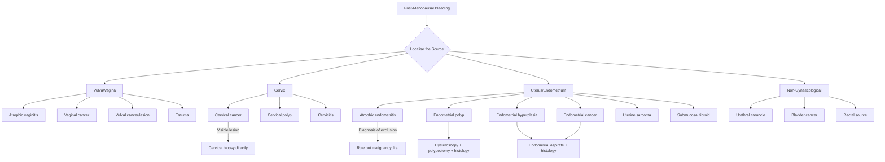

## Differential Diagnosis of Post-Menopausal Bleeding (PMB)

The approach to differential diagnosis in PMB is fundamentally about **localising the source** and then **identifying the pathology**. Think anatomically — bleeding can come from the vulva, vagina, cervix, or uterus (endometrium) — and work systematically. But the overriding clinical imperative is always: ***PMB is a worrisome symptom → must rule out CA endometrium*** [1].

---

### Conceptual Framework

Before listing differentials, understand the two broad pathophysiological drivers of PMB:

1. **Hypoestrogenic causes** (too little oestrogen): The post-menopausal state itself causes tissue atrophy → fragile epithelium → bleeding. This is the **most common** mechanism.
2. **Hyperestrogenic causes** (too much oestrogen, or oestrogen-driven pathology): Unopposed oestrogen drives endometrial proliferation → hyperplasia → polyps → cancer. This is the **most dangerous** mechanism.

A third category exists: **structural/infective/traumatic** causes unrelated to oestrogen balance (e.g., cervical cancer from HPV, trauma).

---

### Differential Diagnoses by Frequency

The following frequencies come from a combination of lecture material and large cohort data [1][3]:

| Rank | Diagnosis | Approximate Frequency | Pathophysiological Category |
|------|-----------|----------------------|----------------------------|
| 1 | ***Endometrial/cervical polyps*** | ***~37.7%*** [3] | Oestrogen-driven focal overgrowth |
| 2 | ***Atrophic vaginitis / atrophic endometritis*** | ***~30.8%*** [3] / ***commonest*** [1] | Hypoestrogenic |
| 3 | ***Proliferative/secretory endometrium*** | ***~14.5%*** [3] | Exogenous or endogenous oestrogen exposure |
| 4 | ***Malignancy*** | ***~6.6–10%*** [1][3] | Oestrogen-driven (Type I) or independent (Type II) |
| 5 | ***Fibroids (leiomyoma)*** | ***~6.2%*** [3] | Oestrogen/progesterone-responsive benign tumour |
| 6 | Endometrial hyperplasia | Variable | Unopposed oestrogen → precursor to Type I cancer |
| 7 | ***Oestrogen exposure*** | Variable | ***Herbal supplements, hormonal treatment, endogenous tumours*** [1] |
| 8 | Other (cervicitis, trauma, non-gynae) | Uncommon | Various |

<Callout title="Frequency Discrepancy" type="idea">
Note that the lecture slides state ***atrophic vaginitis/endometritis is the commonest cause*** [1], while the UpToDate data from the theme case ranks ***polyps as most common (37.7%) and atrophy second (30.8%)*** [3]. Both are correct in different contexts — atrophic changes are the most common cause of **symptomatic bleeding** in many series, while polyps dominate in series where hysteroscopy is performed systematically (many polyps are found incidentally). For exams, know both — state **atrophic vaginitis is the commonest clinical cause** and **polyps are the commonest hysteroscopic finding**.
</Callout>

---

### Detailed Differential Diagnoses

#### 1. Atrophic Vaginitis / Atrophic Endometritis — ***Commonest*** [1]

**"Atrophic"** = wasting/thinning (Greek: *a-* = without, *trophē* = nourishment)

- **Pathophysiology**: ***Due to post-menopausal hypoestrogenic state*** [1]. Ovarian follicular depletion → ↓ oestradiol → loss of trophic support to vaginal and endometrial epithelium → epithelium thins to just a few cell layers → subepithelial capillaries become exposed and fragile → spontaneous or contact-induced bleeding.
- ***Appearance: pale, dry, smooth, and shiny vaginal epithelium with petechial haemorrhage and patchy erythema, loss of rugae*** [1]
- ***Other signs/symptoms: dryness, irritation, discharge, dysuria*** [1]
- **Key point**: This is essentially a **diagnosis of exclusion** [3] — you must rule out malignancy first before attributing PMB to atrophy.
- **Why petechiae?** The thin epithelium cannot protect the underlying capillaries. Even minor trauma (wiping, coitus, speculum) causes microbleeds that appear as petechiae. More significant trauma causes frank bleeding.

#### 2. Endometrial Polyps — ***~37.7%*** [3]

**"Polyp"** = Greek *polypous* (many-footed) — a projection with a stalk

- **Pathophysiology**: Localised overgrowth of endometrial glands and stroma, forming a sessile or pedunculated mass. They are oestrogen-sensitive and may develop in response to even low levels of circulating oestrogen or exogenous oestrogen (including tamoxifen).
- ***May occur in perimenopausal or early post-menopausal women*** [1]
- **Why do they bleed?** Polyps have a central feeding artery with a rich vascular plexus. The surface epithelium can become congested, ulcerated, or necrotic → bleeding. Large polyps may prolapse through the cervical os and undergo torsion → infarction → bleeding.
- **Malignant potential**: Low (~0.5–3%), but must always be sent for histology. Risk increases with size > 1.5 cm, patient age, and tamoxifen use.

#### 3. Endometrial Cancer — ***~6.6–10%*** [1][3]

***The most common malignancy causing PMB is endometrial cancer*** [1].

- **Pathophysiology**:
  - **Type I (endometrioid, ~80%)**: Arises through the hyperplasia-carcinoma sequence driven by unopposed oestrogen. Well-differentiated. Better prognosis.
  - **Type II (serous/clear cell, ~20%)**: Arises from atrophic endometrium, oestrogen-independent. Poorly differentiated. Worse prognosis.
- **Why does it cause bleeding?** Tumour neovascularisation produces abnormal, thin-walled, friable vessels (lacking normal smooth muscle support) → these rupture easily → bleeding. Additionally, tumour surface necrosis exposes blood vessels.
- **Red flags**: Persistent or heavy PMB, watery blood-stained discharge, risk factors (obesity, DM, tamoxifen, family history of Lynch syndrome-associated cancers).
- ***Risk factors for endometrial cancer include: obesity, DM, previous anovulation, family history of CA breast/colon/endometrium, previous tamoxifen*** [1]

#### 4. Cervical Cancer [3]

- ***Cervical cancer should be considered, especially when PMB occurs after coitus (post-coital contact bleeding)*** [3]
- **Pathophysiology**: Almost always HPV-driven (types 16, 18). HPV oncoproteins E6 and E7 inactivate tumour suppressors p53 and Rb → uncontrolled proliferation of squamous or glandular epithelium at the transformation zone → invasive carcinoma.
- ***Naked eye appearance: can be exophytic or endophytic*** [3]
- **Why does it cause PMB?** The tumour surface is highly vascular and friable; even gentle contact (coitus, speculum) causes bleeding. Advanced tumours may bleed spontaneously due to surface necrosis.
- ***Investigation: should go straight for cervical biopsy (NOT just cervical smear) → must need to see architecture, depth of invasion*** [3]

<Callout title="Cervical Cancer vs Endometrial Cancer: Key Distinguishing Features" type="idea">
- **Post-coital bleeding** → think cervical cancer
- **Spontaneous PMB** → think endometrial cancer
- **Visible cervical lesion on speculum** → cervical cancer until proven otherwise → biopsy directly
- **Normal-looking cervix with blood at os** → endometrial source → endometrial aspirate + TVUS
</Callout>

#### 5. Endometrial Hyperplasia [1]

- **Pathophysiology**: A continuum of disordered endometrial proliferation driven by unopposed oestrogen, ranging from simple hyperplasia (low risk) to atypical hyperplasia (high risk of concurrent or future carcinoma).
- **Classification (WHO 2014)**:
  - **Hyperplasia without atypia**: Disordered proliferation but architecturally normal glands. Progression to cancer: ~1–3%. Manageable with progestins.
  - **Atypical hyperplasia**: Cytological atypia (nuclear enlargement, pleomorphism, prominent nucleoli). Progression to cancer: ~29%. Up to 40% already harbour concurrent carcinoma. Often managed with hysterectomy.
- **Why does it cause bleeding?** The thickened, fragile endometrium with disorganised vasculature breaks down irregularly → unpredictable bleeding.

#### 6. Uterine Fibroids (Leiomyomata) — ***~6.2%*** [3]

- **Pathophysiology**: Benign smooth muscle tumours of the myometrium. Although they typically regress after menopause (loss of oestrogen/progesterone drive), some persist — especially large ones or those in women on HRT or tamoxifen.
- **Why do they cause PMB?** Submucosal fibroids distort the endometrial cavity → increase endometrial surface area → disrupt normal endometrial vasculature → irregular bleeding. They may also cause compression of venous drainage → congestion → bleeding.

#### 7. Uterine Sarcoma [1]

- ***Malignancy from uterine sarcoma*** is mentioned as a differential [1].
- **Pathophysiology**: Malignant tumour of the myometrial smooth muscle (leiomyosarcoma) or endometrial stroma (endometrial stromal sarcoma). Rare but aggressive.
- **Key distinguishing feature from fibroids**: Rapid growth of a uterine "fibroid" post-menopause should raise suspicion (fibroids should be shrinking, not growing).
- **Why does it cause bleeding?** Tumour necrosis, endometrial surface disruption, and neovascularisation.

#### 8. Oestrogen Exposure [1]

***Oestrogen exposure from herbal supplements, hormonal treatment, or endogenous tumours*** [1].

| Source | Mechanism | Key Point |
|--------|-----------|-----------|
| **Exogenous HRT** (oestrogen-only) | Direct oestrogen stimulation of endometrium | Unopposed oestrogen HRT increases risk 2–10×; combined HRT does NOT |
| **Tamoxifen** | Partial agonist at endometrial oestrogen receptors | Causes polyps, hyperplasia, carcinoma; 2× risk in post-menopausal women |
| **TCM / Herbal supplements** | May contain undeclared oestrogens or phytoestrogens | Very common in Hong Kong — always ask specifically |
| **Oestrogen-secreting ovarian tumours** | Granulosa cell tumour, thecoma → direct oestrogen production | Suspect if adnexal mass + thickened endometrium |

#### 9. Vaginal / Vulval Causes [1]

- ***Malignancy from vagina or vulva*** [1]
- **Vaginal cancer**: Rare. Squamous cell carcinoma most common. Risk factors: DES exposure (historical), HPV, prior pelvic radiation.
- **Vulval cancer**: Squamous cell carcinoma. Often arises from lichen sclerosus or VIN. Presents with vulval bleeding, mass, or ulcer.
- **Vaginal/vulval trauma**: Atrophic tissue is easily traumatised.

#### 10. Non-Gynaecological Causes

Always consider:
- **Urethral**: Urethral caruncle (a small, benign, red vascular growth at the urethral meatus — common in post-menopausal women), urethral cancer, bladder cancer
- **Rectal**: Haemorrhoids, colorectal cancer, rectal prolapse
- Patients may describe any perineal bleeding as "vaginal bleeding" — careful examination is essential.

---

### Diagnostic Approach by Anatomy (Mermaid Diagram)

---

### Investigation-Guided Differential Diagnosis

***The theme case provides a useful framework for matching investigations to diagnoses*** [3]:

| | ***Atrophic Vaginitis*** | ***Endometrial Cancer*** | ***Cervical Cancer*** |
|---|---|---|---|
| ***Naked eye appearance*** | ***Petechiae*** on pale, dry vaginal epithelium | ***Normal cervix*** (blood at os) OR bulky uterus | ***Exophytic or endophytic growth*** on cervix |
| ***Cervical smear*** | ***Yes*** (to exclude concurrent cervical pathology) | ***Yes*** (screening) | ***Not needed — should go straight for biopsy*** [3] |
| ***Cervical biopsy*** | Not needed | Not needed | ***Yes — must see architecture, depth of invasion*** [3] |
| ***Pelvic ultrasonography*** | May show thin endometrium (≤ 4 mm) | May show thickened endometrium (> 4 mm), uterine mass | May show cervical mass, hydronephrosis (advanced) |
| ***Hysteroscopy / endometrial biopsy*** | Not first line (if atrophy confirmed and no other concerns) | Yes — ***mandatory endometrial aspirate in all cases of PMB*** [1] | Not for primary diagnosis |
| **Diagnostic certainty** | ***Diagnosis of exclusion*** [3] | Histological diagnosis from endometrial sampling | Histological diagnosis from cervical biopsy |

<Callout title="Critical Exam Point" type="error">
***If you see a visible cervical lesion on speculum, do NOT rely on a cervical smear — go straight for cervical biopsy*** [3]. A Pap smear samples only superficial cells and can miss invasive cancer (false negative). Biopsy provides tissue architecture, which is essential for diagnosing invasion depth and tumour type. This is a commonly tested point.
</Callout>

---

### Key Distinguishing Clinical Features

| Feature | Atrophic Changes | Endometrial Polyp | Endometrial Cancer | Cervical Cancer |
|---------|-----------------|-------------------|-------------------|-----------------|
| **Bleeding pattern** | Light spotting, often after trauma/coitus | Irregular spotting, may be cyclical if oestrogen-sensitive | Persistent, may be heavy, often spontaneous | Post-coital, contact bleeding |
| **Discharge** | Thin, watery | Minimal | Watery, blood-stained, offensive (if necrotic) | Offensive, blood-stained |
| **Pain** | Dyspareunia | Usually painless | Usually painless early; pain suggests advanced disease | Pelvic pain suggests parametrial invasion |
| **Speculum** | Pale, dry, petechiae, loss of rugae | May see polyp at os | Blood at os, usually normal cervix | Visible lesion — exophytic or endophytic |
| **Bimanual** | Normal or small atrophic uterus | Normal | Enlarged, irregular uterus (advanced) | Cervix may be hard, barrel-shaped; parametrial thickening |
| **TVUS endometrial thickness** | ≤ 4 mm | Focal thickening, vascular pedicle on Doppler | > 4 mm (diffuse thickening) | May be normal or show cervical mass |
| **Risk factor profile** | All post-menopausal women (universal) | Tamoxifen, HRT | Obesity, DM, anovulation, tamoxifen, Lynch syndrome | HPV, no screening, smoking, immunosuppression |

---

### Approach to Narrowing the Differential

The clinical approach can be summarised in a stepwise fashion:

**Step 1: Confirm PMB** — Is this truly post-menopausal bleeding? (Amenorrhoea > 12 months? Not perimenopausal bleeding?)

**Step 2: Localise the source** — Speculum examination.
- Vulval/vaginal lesion → biopsy
- ***Cervical lesion → cervical biopsy directly (do NOT just do smear)*** [3]
- Blood from the cervical os with normal-looking cervix → endometrial source → proceed to Step 3

**Step 3: Assess the endometrium** — ***Endometrial aspirate is mandatory in ALL cases of PMB*** [1]
- ***TVUS for endometrial thickness: should be ≤ 4 mm in post-menopausal women (NPV 99.4–100%)*** [1]
- If ET ≤ 4 mm and benign aspirate → likely atrophic changes
- ***If ET > 4 mm, on tamoxifen, or recurrent/refractory symptoms → hysteroscopy ± endometrial biopsy*** [1]

**Step 4: Exclude non-gynaecological sources** — Urinalysis (haematuria?), rectal examination if indicated.

---

<Callout title="High Yield Summary">

**Differential Diagnosis of PMB — ranked by frequency**:
1. ***Polyps (~37.7%)*** or ***Atrophic vaginitis/endometritis (commonest clinical cause, ~30.8%)***
2. ***Proliferative/secretory endometrium (~14.5%)***
3. ***Malignancy (~6.6–10%)*** — ***endometrium is the commonest malignant cause; cervical, vaginal, and vulval cancer also possible***
4. ***Fibroids (~6.2%)***
5. Endometrial hyperplasia, oestrogen exposure, other

**Two key principles**:
- ***PMB is a worrisome symptom → must rule out CA endometrium*** [1]
- ***Atrophic vaginitis is a diagnosis of exclusion*** — always exclude malignancy first

**Critical investigation points**:
- ***Endometrial aspirate: mandatory in ALL cases of PMB*** [1]
- ***Visible cervical lesion → go straight for cervical biopsy, NOT just smear*** [3]
- ***TVUS endometrial thickness ≤ 4 mm has NPV 99.4–100%*** [1]

</Callout>

---

<ActiveRecallQuiz
  title="Active Recall - Differential Diagnosis of PMB"
  items={[
    {
      question: "List the four most common causes of PMB in order of frequency, with approximate percentages.",
      markscheme: "1. Polyps (37.7%), 2. Atrophic vaginitis/endometritis (30.8%), 3. Proliferative/secretory endometrium (14.5%), 4. Endometrial carcinoma (6.6-10%). Note: Atrophic changes are often cited as the commonest clinical cause; polyps dominate hysteroscopic series.",
    },
    {
      question: "A 60-year-old woman with PMB is found to have a visible exophytic growth on the cervix on speculum examination. What investigation should be performed and why should you NOT rely on cervical smear alone?",
      markscheme: "Cervical biopsy should be performed directly. Cervical smear only samples superficial cells and can give false negatives in invasive cancer. Biopsy provides tissue architecture allowing assessment of depth of invasion, which is essential for diagnosis and staging.",
    },
    {
      question: "Explain why atrophic vaginitis is considered a diagnosis of exclusion in PMB.",
      markscheme: "Atrophic vaginitis is the most common cause of PMB but its symptoms and signs overlap with malignancy. Since approximately 10% of PMB is due to malignancy, you must first rule out endometrial cancer (via endometrial aspirate and TVUS) and cervical cancer (via examination and biopsy if lesion visible) before attributing PMB to atrophy.",
    },
    {
      question: "A post-menopausal woman on tamoxifen for breast cancer presents with blood-stained discharge. Describe the mechanism by which tamoxifen causes endometrial pathology and the recommended investigation protocol.",
      markscheme: "Tamoxifen is a SERM that acts as an oestrogen antagonist in breast tissue but a partial agonist in the endometrium, stimulating endometrial proliferation leading to polyps, hyperplasia, and carcinoma (2x risk). Recommended protocol: symptomatic patients should be seen within 2 weeks and offered endometrial aspirate plus diagnostic hysteroscopy (no need to wait for EA result). TVUS is not ideal due to false-positive endometrial thickening from myometrial vacuolation.",
    },
    {
      question: "What endometrial thickness cut-off on TVUS is used to exclude endometrial pathology in post-menopausal women, and what is its negative predictive value?",
      markscheme: "Endometrial thickness should be 4 mm or less in post-menopausal women. This cut-off has a negative predictive value of 99.4-100% for excluding endometrial cancer.",
    },
  ]}
/>

## References

[1] Lecture slides: Adrian Lui Gynecology Notes.pdf (p22)
[3] Lecture slides: Block C - O&G Theme Case 2.docx.pdf (p6)
