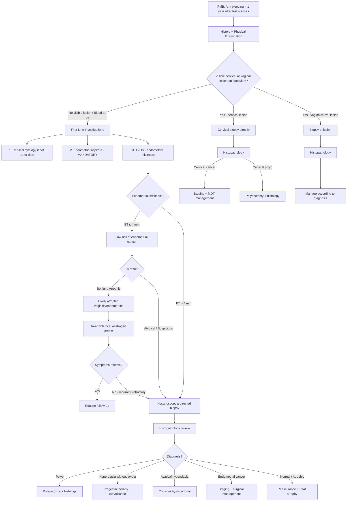
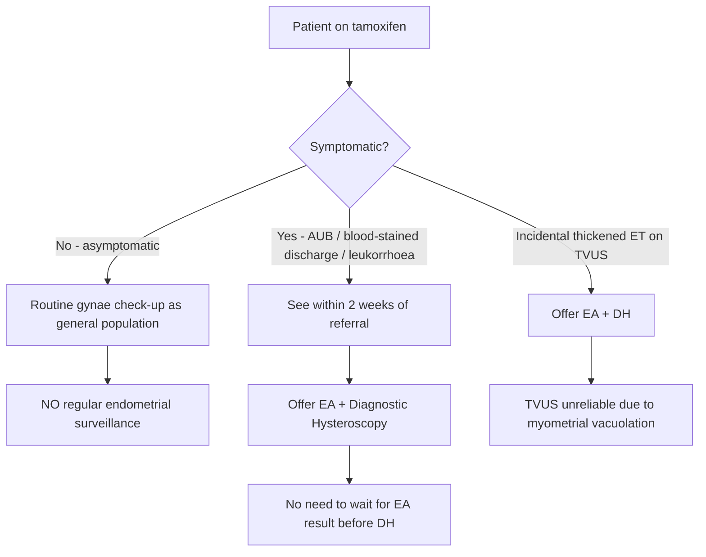

## Diagnostic Criteria, Algorithm, and Investigation Modalities for Post-Menopausal Bleeding (PMB)

### 1. Diagnostic Criteria

PMB is itself a **clinical symptom**, not a disease — so there is no "diagnostic criteria" for PMB per se. The diagnostic question is: **what is causing the PMB?** The systematic investigation aims to:

1. **Confirm the diagnosis of menopause** (was this truly post-menopausal?)
2. **Localise the source of bleeding** (vulva, vagina, cervix, endometrium, non-gynaecological)
3. **Obtain histological diagnosis** to rule out malignancy

#### 1.1 Confirming Menopause

***Clinical diagnosis: amenorrhoea for 12 months*** [1]. No single biological marker is adequate.

- ***Serum hormonal measurement: FSH > 20 IU/L + low E2*** — this supplements the diagnosis in specific situations (premature menopause, post-hysterectomy, women on hormonal contraception) [1].
- ***FSH > 25 IU × 2 measurements ≥ 4 weeks apart is diagnostic*** when clinical features are atypical [5].
- If the woman is < 45 years old with amenorrhoea and bleeding, consider **premature ovarian insufficiency** rather than true menopause — the approach differs.

#### 1.2 Key Diagnostic Thresholds

| Parameter | Cut-off | Significance |
|-----------|---------|-------------|
| ***Endometrial thickness on TVUS*** | ***≤ 4 mm in post-menopausal women*** | ***NPV 99.4–100%*** for excluding endometrial cancer [1] |
| Endometrial thickness on TVUS | > 4 mm | Requires further investigation (hysteroscopy ± biopsy) |
| ***Incidental thickened endometrium (asymptomatic)*** | ***> 11 mm AND a/w other US findings or RFs*** | ***Only then is endometrial aspirate indicated*** [1] |
| Endometrial thickness with tamoxifen | Unreliable | ***TVUS screening is not ideal because tamoxifen may lead to false-positive endometrial thickness due to myometrial vacuolation*** [2] |

<Callout title="The 4 mm Rule — Understanding from First Principles">
Why 4 mm? After menopause, the endometrium should be thin and atrophic because there is no oestrogen to drive proliferation. A normal post-menopausal endometrium measures ≤ 4 mm (bilayer thickness on TVUS). An endometrium thicker than 4 mm suggests either:
- Oestrogen stimulation (exogenous or endogenous)
- An endometrial lesion (polyp, hyperplasia, cancer)

***At 4 mm: sensitivity 96%, specificity 53%*** [4]. ***At 5 mm: sensitivity 96%, specificity 61%*** [4]. The high sensitivity means a thin endometrium effectively rules out cancer. The modest specificity means many women with ET > 4 mm will have benign pathology — but you cannot afford to miss the malignancies, so you investigate all of them.
</Callout>

<Callout title="Asymptomatic Thickened Endometrium — Common Exam Trap" type="error">
***Endometrial aspirate is NOT routinely performed in asymptomatic patients with incidental finding of thickened endometrium unless > 11 mm and associated with other ultrasound findings or risk factors*** [1]. This is frequently tested. The rationale: in asymptomatic women, the pre-test probability of cancer is low, and the 4 mm threshold was validated in **symptomatic** (PMB) women. In asymptomatic women, the false-positive rate is high, leading to unnecessary invasive procedures.
</Callout>

---

### 2. Diagnostic Algorithm

The algorithm follows a logical, stepwise approach: **History → Examination → First-line investigations → Second-line investigations** based on findings.

#### 2.1 Step-by-Step Approach

**Step 1: History and Physical Examination**

***History*** [1]:
- ***Nature of bleeding and any associating symptoms (especially if the same as in previous menses)***
- ***Any drug use: e.g., TCM, hormonal replacement, tamoxifen***
- ***Any health supplement/food changes that may contain exogenous oestrogen***
- ***Any other risk factors for CA endometrium: e.g., obesity, DM, previous anovulation, family history of CA breast/colon/endometrium, previous tamoxifen***

***Physical examination*** [1]:
- ***General: BMI, pallor, cervical and groin lymph nodes, abdomen for masses/ascites***
- ***Speculum: neoplasm, atrophic changes***
- ***Bimanual exam: pelvic masses***

**Step 2: First-Line Investigations (performed in ALL cases of PMB)**

1. ***Cervical cytology if no regular screening*** [1] — to exclude concurrent cervical pathology
2. ***Endometrial aspirate: mandatory in ALL cases of PMB*** [1]
3. ***TVUS for endometrial thickness*** [1]

**Step 3: Second-Line Investigations (based on findings)**

***Hysteroscopy ± endometrial biopsy*** is indicated if [1]:
- ***On tamoxifen***
- ***Endometrial thickness > 4 mm***
- ***Recurrent/refractory symptoms despite given treatment for atrophic changes***

**Step 4: Follow-Up**

***Review OT record if hysteroscopy performed*** [1]
***Review histopathology report for endometrial biopsy*** [1]

#### 2.2 Algorithm (Mermaid Diagram)

#### 2.3 Special Algorithm: Patients on Tamoxifen

***Tamoxifen protocol*** [2]:

#### 2.4 Special Considerations: HRT and Breakthrough Bleeding

***For women on HRT who develop bleeding*** [5]:

- ***Breakthrough bleeding in first 6 months of treatment requires no immediate intervention***
- ***For combined cyclical regimen: if bleeding is not around time of progestin withdrawal or is persistently irregular → endometrial biopsy***
- ***For continuous combined regimen: if bleeding occurs after achievement of amenorrhoea → endometrial biopsy***

This is important because women on HRT may present with "PMB" that is actually expected breakthrough bleeding. The key distinction: **timing and pattern** relative to the regimen.

---

### 3. Investigation Modalities — Detailed

#### 3.1 Cervical Cytology (Pap Smear / Liquid-Based Cytology)

***Indicated if no regular screening*** [1].

**What it is**: A sample of exfoliated cells from the cervical transformation zone, smeared on a slide or placed in liquid medium, then examined microscopically.

**Purpose in PMB**: To screen for cervical pre-cancer or cancer. Also, occasionally picks up **abnormal glandular cells** that may suggest endometrial pathology.

**Key findings and interpretation**:

| Finding | Interpretation | Action |
|---------|---------------|--------|
| Normal / NILM | No cervical abnormality | Does NOT exclude endometrial pathology — proceed with EA + TVUS |
| ASCUS / LSIL / HSIL | Cervical squamous abnormality | Colposcopy pathway (separate from PMB workup) |
| ***AGC-endometrial*** | Abnormal glandular cells of endometrial origin | ***First-line: endometrial aspirate*** [4] |
| ***Other AGC*** | Abnormal glandular cells (origin uncertain) | ***Colposcopy AND endometrial aspirate*** [4] |
| ***Benign endometrial cells*** | Normally shed endometrial cells found on smear | ***If ≥ 45 years + symptomatic or post-menopausal → endometrial aspirate*** [4] |

<Callout title="Important Principle" type="error">
A **normal cervical smear does NOT exclude cervical cancer** if a visible lesion is present. Smear is a screening test for pre-invasive disease. If you see a lesion, **biopsy it directly** [3]. Similarly, a normal smear says nothing about the endometrium — you still need endometrial sampling.
</Callout>

#### 3.2 Endometrial Aspirate (EA) / Pipelle Biopsy

***Mandatory in ALL cases of PMB*** [1].

**What it is**: A thin, flexible plastic catheter (Pipelle de Cornier is the most common device) is inserted through the cervix into the uterine cavity. Suction is applied by withdrawing the internal plunger, aspirating a strip of endometrial tissue.

**"Endometrial aspirate"** → "endo" = within, "metrial" = uterine wall; "aspirate" = sucked out. You are literally sucking out a strip of the inner lining of the womb.

**Why is it first-line?**
- ***Simple office-based procedure that can provide histopathology*** [4]
- ***Very commonly done and can be completed in 5 minutes without anaesthesia*** [4]
- Sensitivity for endometrial cancer: ~90–99% (high — but not 100%)
- Can be done in the outpatient clinic, no sedation needed
- Provides **histological tissue** — the gold standard for diagnosis

**Limitations**:
- **Blind procedure**: Samples only a strip of endometrium — may miss focal lesions (polyps, small cancers). This is why hysteroscopy is added when clinical suspicion is high.
- **Inadequate sample**: May occur if the endometrium is very atrophic (too thin to sample), if there is cervical stenosis (common in elderly), or if the uterine cavity is distorted.
- **Cannot assess architecture**: Unlike hysteroscopy, you cannot see the cavity directly.

**Indications beyond PMB** [4]:
- ***AUB: persistent intermenstrual/irregular bleeding if age ≥ 40, any AUB if age ≥ 45, or otherwise indicated (obesity, PCOS, tamoxifen, failed treatment)***
- ***Abnormal Pap smear: AGC-endometrial (1st line), other AGC (together with colposcopy), benign endometrial cells (if ≥ 45 + symptomatic or post-menopausal)***
- ***Monitoring in previous endometrial pathology or surveillance in high-risk (e.g., HNPCC/Lynch syndrome)***

**Key histological findings and interpretation**:

| Histological Finding | Interpretation | Next Step |
|---------------------|---------------|-----------|
| Atrophic / inactive endometrium | Consistent with post-menopausal atrophy — benign | Treat atrophic vaginitis if symptomatic; reassure |
| Proliferative endometrium | Unexpected in post-menopausal women — suggests oestrogen exposure | Investigate source of oestrogen (HRT, supplements, ovarian tumour) |
| Secretory endometrium | Suggests progesterone exposure — unusual post-menopause unless on HRT | Review medications |
| Endometrial polyp (fragments) | Benign polyp — but may be missed or incompletely sampled | Hysteroscopy for definitive diagnosis and polypectomy |
| Hyperplasia without atypia | Low risk of progression (~1–3%) | Progestin therapy + follow-up EA in 3–6 months |
| Atypical hyperplasia | High risk — ~29% progress to cancer; ~40% have concurrent carcinoma | Consider hysteroscopy + hysterectomy |
| Endometrial adenocarcinoma | Malignant — definitive diagnosis | Staging investigations + surgical management |
| Insufficient / inadequate sample | Not diagnostic — cannot exclude pathology | Consider repeat EA, hysteroscopy, or D&C under anaesthesia |

#### 3.3 Transvaginal Ultrasound (TVUS)

***TVUS for endometrial thickness: should be ≤ 4 mm in post-menopausal women (NPV 99.4–100%)*** [1].

**What it is**: A high-frequency (7.5–10 MHz) ultrasound probe inserted into the vagina to visualise the uterus, endometrium, and adnexae. The close proximity of the probe to the structures of interest provides superior resolution compared to transabdominal ultrasound.

**Why transvaginal and not transabdominal?** The vaginal probe is physically closer to the uterus and ovaries → higher frequency probe can be used → better resolution of the endometrium. ***Transvaginal ultrasound is the imaging modality of choice for pelvic pathology in the context of PMB*** [6].

**What to measure**: **Endometrial thickness (ET)** — measured as the maximal anteroposterior bilayer thickness (both layers of the endometrium together) in the sagittal plane at the thickest point.

**Key findings and interpretation**:

| TVUS Finding | Interpretation | Action |
|-------------|---------------|--------|
| ***ET ≤ 4 mm, homogeneous, thin stripe*** | Normal post-menopausal atrophic endometrium. ***NPV 99.4–100%*** [1] | If EA also benign → very reassuring. Treat atrophy. |
| ***ET > 4 mm, diffusely thickened*** | Suggests endometrial pathology — hyperplasia, cancer, or generalised oestrogen effect | ***Hysteroscopy ± endometrial biopsy*** [1] |
| Focal thickening / intracavitary mass | Suggests endometrial polyp or submucosal fibroid | Hysteroscopy for direct visualisation, polypectomy/biopsy |
| Heterogeneous endometrium with irregular myometrial border | Suspicious for endometrial cancer with myometrial invasion | Urgent hysteroscopy + biopsy; consider MRI for staging |
| Fluid in endometrial cavity (hydrometra / haematometra) | Cervical stenosis with trapped secretions; must exclude endometrial cancer | Drain + endometrial sampling |
| ***Thickened endometrium on tamoxifen*** | ***May be false positive due to myometrial vacuolation*** [2] — tamoxifen causes cystic changes in the subendometrial myometrium that ultrasonically mimic endometrial thickening | ***Proceed to EA + diagnostic hysteroscopy regardless*** [2] |
| Adnexal mass | Consider oestrogen-secreting ovarian tumour (granulosa cell tumour) as cause of endometrial stimulation | CT/MRI pelvis, tumour markers (inhibin, oestradiol) |
| ***Post-menopausal ovarian cyst with solid components and vascularity*** | ***Likely malignant in post-menopausal context*** [6] | CA-125, CT staging, MDT referral |

**Performance characteristics** [4]:

| ET Cut-off | Sensitivity | Specificity |
|-----------|------------|-------------|
| ***4 mm*** | ***96%*** | ***53%*** |
| ***5 mm*** | ***96%*** | ***61%*** |

Why is specificity low? Many benign conditions (polyps, simple hyperplasia, HRT effect) cause ET > 4 mm. The threshold is deliberately set low to maximise sensitivity (you don't want to miss cancer), accepting more false positives that will be sorted out by histology.

#### 3.4 Hysteroscopy ± Endometrial Biopsy

***Indicated if: on tamoxifen, endometrial thickness > 4 mm, recurrent/refractory symptoms despite given treatment for atrophic changes*** [1].

**What it is**: "Hystero" = womb (Greek *hystera*), "scopy" = looking at. A thin telescope is inserted through the cervix into the uterine cavity, which is distended with saline or CO₂ gas, allowing **direct visualisation** of the endometrial surface.

**Why is it superior to blind EA?**
- **Direct visualisation**: Can see the entire endometrial cavity, identify focal lesions (polyps, small cancers) that a blind EA might miss.
- **Directed biopsy**: Can take biopsies from specific suspicious areas rather than random sampling.
- **Therapeutic capability**: Can perform polypectomy, remove submucosal fibroids, and resect focal lesions at the same sitting.

**Types**:
- **Diagnostic hysteroscopy (DH)**: Visualisation + biopsy. Can be done in outpatient setting (office hysteroscopy) with miniature scopes (< 5 mm).
- **Operative hysteroscopy**: Under general anaesthesia. For polypectomy, myomectomy, endometrial resection.

**Key hysteroscopic findings and interpretation**:

| Finding | Appearance | Significance |
|---------|-----------|-------------|
| Normal atrophic endometrium | Thin, pale, smooth, vascular pattern visible | Benign — consistent with post-menopausal atrophy |
| Endometrial polyp | Smooth, rounded, pedunculated mass on a stalk, often with a visible feeding vessel | Usually benign — excise and send for histology (0.5–3% harbour malignancy) |
| Submucosal fibroid | Round, firm, white mass bulging into cavity, covered by normal endometrium | Benign — may cause bleeding by distorting vasculature and increasing endometrial surface area |
| Endometrial hyperplasia | Thickened, polypoid, irregular endometrium, often with abnormal vascular patterns | Take directed biopsies — classification (with/without atypia) determines management |
| Suspicious for cancer | Irregular, friable, necrotic tissue, atypical vessels (corkscrew, interrupted), focal or diffuse | Multiple directed biopsies — histology confirms diagnosis and grade |
| Synechiae (adhesions) | Thin or thick bands traversing the cavity | Asherman's syndrome — may cause haematometra but uncommon cause of PMB |

**Complications of hysteroscopy** (important to know for consent):
- Uterine perforation (~0.1–1%)
- Infection
- Bleeding
- Fluid overload (if using fluid distension medium)
- False passage creation

#### 3.5 Dilatation and Curettage (D&C)

Historically the gold standard for endometrial sampling. Now largely replaced by EA + hysteroscopy, but still used when:
- EA fails (cervical stenosis, inadequate sample)
- Hysteroscopy is not available
- Combined with hysteroscopy as part of operative management

**What it is**: Under general anaesthesia, the cervix is dilated with graduated dilators (Hegar dilators), and a curette is used to systematically scrape the entire endometrial cavity.

**Advantages**: More comprehensive sampling than EA; can obtain tissue even with cervical stenosis.
**Disadvantages**: Requires anaesthesia; still a blind procedure (misses ~10% of focal lesions); being replaced by hysteroscopy-guided biopsy.

#### 3.6 Additional Investigations

| Investigation | When Indicated | What It Tells You |
|--------------|----------------|-------------------|
| **Full blood count** | All cases of PMB | Haemoglobin — assess for anaemia from chronic/heavy bleeding |
| **Coagulation screen** | If heavy bleeding or suspected coagulopathy | Exclude bleeding diathesis |
| **Cervical biopsy** | ***Visible cervical lesion → biopsy directly*** [3] | Histological diagnosis of cervical cancer — must see architecture and depth of invasion |
| **MRI pelvis** | Confirmed endometrial cancer → pre-operative staging | Depth of myometrial invasion, cervical stromal invasion, lymph node involvement. Superior soft tissue contrast compared to CT. |
| **CT chest/abdomen/pelvis** | Staging for confirmed malignancy | Distant metastases (lungs, liver, peritoneum, lymph nodes) |
| **CA-125** | Suspected ovarian pathology or advanced endometrial cancer | Elevated in ovarian cancer, advanced endometrial cancer, peritoneal disease. Not diagnostic alone. |
| **Inhibin A/B, oestradiol** | Suspected granulosa cell tumour | Elevated inhibin = granulosa cell tumour marker; elevated oestradiol = oestrogen-producing tumour |
| ***Baseline investigations for HRT initiation*** | ***If initiating HRT*** | ***BP/pulse, urinalysis, lipid profile, LFT, bone biochemistry, TSH, mammography*** [5] |

#### 3.7 Summary Table: Matching Investigation to Clinical Scenario

| Clinical Scenario | First-Line Investigation | Second-Line Investigation |
|-------------------|------------------------|--------------------------|
| PMB, no visible lesion | ***EA (mandatory) + TVUS*** [1] | Hysteroscopy if ET > 4 mm, inadequate EA, or refractory symptoms |
| PMB, visible cervical lesion | ***Cervical biopsy directly*** [3] | Staging CT/MRI if cancer confirmed |
| PMB on tamoxifen | ***EA + diagnostic hysteroscopy*** [2] | Do not rely on TVUS for ET |
| Asymptomatic thickened ET | ***NOT routinely investigated unless > 11 mm + other US findings/RFs*** [1] | If indicated → EA |
| PMB with adnexal mass | TVUS + EA | CT/MRI, tumour markers (CA-125, inhibin) |
| PMB with bulky uterus | EA + TVUS | MRI if cancer suspected (myometrial invasion assessment) |
| HRT user with new bleeding | Assess timing relative to regimen | ***Endometrial biopsy if: bleeding not at time of progestin withdrawal (cyclical), or bleeding after achieved amenorrhoea (continuous combined)*** [5] |

---

### 4. Interpreting Combined Investigation Results

The power of the PMB workup lies in **combining** TVUS, EA, and hysteroscopy results:

| ET on TVUS | EA Result | Clinical Interpretation | Next Step |
|-----------|-----------|------------------------|-----------|
| ≤ 4 mm | Atrophic/benign | Very high confidence that this is atrophic change (NPV ~100%) | Treat with local oestrogen; reassure |
| ≤ 4 mm | Inadequate sample | Thin endometrium makes cancer very unlikely, but sample is not diagnostic | Clinical follow-up; repeat EA or hysteroscopy if symptoms persist |
| > 4 mm | Atrophic/benign | Discordant — thick endometrium but benign histology. May have a focal lesion (polyp) missed by blind EA | Hysteroscopy to visualise cavity directly |
| > 4 mm | Hyperplasia (no atypia) | Consistent — oestrogen-driven proliferation | Progestin therapy + repeat EA in 3–6 months |
| > 4 mm | Atypical hyperplasia | High risk — possible concurrent carcinoma (~40%) | Hysteroscopy + consider hysterectomy |
| > 4 mm | Carcinoma | Definitive diagnosis | MRI pelvis staging → MDT → surgery |
| Any (tamoxifen) | Any | TVUS unreliable; EA + hysteroscopy are the definitive investigations | Manage based on histology |

<Callout title="The 'Discordant' Result — Why Hysteroscopy Matters" type="idea">
The classic exam scenario: TVUS shows ET > 4 mm but EA returns "insufficient tissue" or "benign." Does this mean there's no cancer? **No.** The EA is a blind procedure — it samples only a strip of endometrium and can miss a focal polyp or small carcinoma. When the TVUS and EA results are discordant (thick endometrium but benign/inadequate EA), **hysteroscopy is essential** to directly visualise and biopsy focal lesions. This is why hysteroscopy is the final arbiter.
</Callout>

---

<Callout title="High Yield Summary">

**Key Investigation Principles in PMB**:

1. ***Endometrial aspirate is MANDATORY in ALL cases of PMB*** [1] — simple, office-based, 5-minute procedure, no anaesthesia needed
2. ***TVUS endometrial thickness ≤ 4 mm = NPV 99.4–100%*** [1] — effectively rules out endometrial cancer
3. ***TVUS performance: at 4 mm, sensitivity 96%, specificity 53%; at 5 mm, sensitivity 96%, specificity 61%*** [4]
4. ***Hysteroscopy ± biopsy indicated if: on tamoxifen, ET > 4 mm, or recurrent/refractory symptoms*** [1]
5. ***Visible cervical lesion → cervical biopsy directly (NOT just smear)*** [3]
6. ***EA is NOT routinely done for asymptomatic thickened endometrium unless > 11 mm with other US findings or risk factors*** [1]
7. ***Tamoxifen causes false-positive ET thickening on TVUS (myometrial vacuolation) → proceed directly to EA + DH*** [2]
8. ***For HRT users with bleeding: no intervention needed in first 6 months; after that, timing of bleeding relative to progestin dictates need for biopsy*** [5]

</Callout>

---

<ActiveRecallQuiz
  title="Active Recall - PMB: Diagnostic Criteria, Algorithm, and Investigations"
  items={[
    {
      question: "What is the endometrial thickness cut-off on TVUS for post-menopausal women, and what are its sensitivity and specificity at 4 mm and 5 mm?",
      markscheme: "Cut-off: 4 mm or less is reassuring (NPV 99.4-100%). At 4 mm: sensitivity 96%, specificity 53%. At 5 mm: sensitivity 96%, specificity 61%. Low specificity means many false positives (benign conditions cause thickening), but high sensitivity means thin endometrium effectively rules out cancer.",
    },
    {
      question: "A 65-year-old asymptomatic woman has an incidental finding of 8 mm endometrial thickness on pelvic ultrasound. Is endometrial aspirate indicated? What if it was 13 mm?",
      markscheme: "At 8 mm: EA is NOT routinely indicated in asymptomatic patients with incidental thickened endometrium unless greater than 11 mm AND associated with other US findings or risk factors. At 13 mm: EA IS indicated because it exceeds 11 mm. The 4 mm threshold applies only to symptomatic (PMB) women.",
    },
    {
      question: "List three indications for hysteroscopy with endometrial biopsy in the workup of PMB.",
      markscheme: "1. Patient on tamoxifen (TVUS unreliable due to myometrial vacuolation). 2. Endometrial thickness greater than 4 mm on TVUS. 3. Recurrent or refractory symptoms despite treatment for atrophic changes.",
    },
    {
      question: "A woman on tamoxifen for breast cancer has a TVUS showing endometrial thickness of 9 mm but is asymptomatic. What is the recommended management?",
      markscheme: "Offer endometrial aspirate plus diagnostic hysteroscopy. No need to wait for EA result before proceeding to DH. TVUS is unreliable in tamoxifen users due to false-positive endometrial thickening from myometrial vacuolation. Note: if she were asymptomatic with no thickening on TVUS, routine gynae check-up only with no regular endometrial surveillance.",
    },
    {
      question: "Explain why a blind endometrial aspirate may give a false-negative result, and what investigation addresses this limitation.",
      markscheme: "EA samples only a strip of endometrium in a blind fashion - it can miss focal lesions such as small polyps or localised carcinomas that are not in the sampled area. Hysteroscopy addresses this limitation by providing direct visualisation of the entire endometrial cavity, allowing directed biopsies from suspicious areas.",
    },
    {
      question: "A woman on continuous combined HRT achieves amenorrhoea for 8 months then develops vaginal bleeding. What investigation is indicated and why?",
      markscheme: "Endometrial biopsy is indicated. In continuous combined HRT, bleeding after achievement of amenorrhoea is abnormal and suggests endometrial pathology (breakthrough of the progestin suppression). This contrasts with bleeding in the first 6 months of HRT which requires no immediate intervention.",
    },
  ]}
/>

## References

[1] Lecture slides: Adrian Lui Gynecology Notes.pdf (p22)
[2] Lecture slides: Adrian Lui Gynecology Notes.pdf (p96)
[3] Lecture slides: Block C - O&G Theme Case 2.docx.pdf (p6)
[4] Lecture slides: Adrian Lui Gynecology Notes.pdf (p97)
[5] Lecture slides: Adrian Lui Gynecology Notes.pdf (p36)
[6] Senior notes: Ryan Ho Radiology.pdf (p34, p40)
