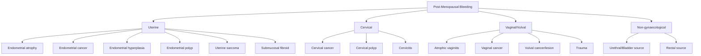

# Post-Menopausal Bleeding (PMB)

## 1. Definition

**Post-menopausal bleeding (PMB)** (絕經後出血) is defined as ***any uterine bleeding occurring > 1 year after the last natural menstrual period*** [1].

Let's break this down:
- **"Post-menopausal"**: Menopause itself is a clinical diagnosis — ***amenorrhoea for 12 months*** [1]. There is no single adequate biological marker. Serum FSH > 20 IU/L with low E2 can supplement the diagnosis in specific scenarios (premature menopause, post-hysterectomy, women on hormonal contraception), but **raised FSH per se should not be taken as diagnostic** as it can be observed many years before menopause [1].
- **"Bleeding"**: This includes any vaginal bleeding — from spotting to frank haemorrhage — originating from the uterine cavity, cervix, vagina, or vulva. In practice, the concern is always about the endometrium until proven otherwise.

<Callout title="Why is PMB so important?">
PMB is a **red flag symptom**. While the most common cause is benign (atrophic vaginitis), approximately ***10% of cases are due to malignancy*** [1] — most commonly endometrial carcinoma. Every case of PMB therefore mandates investigation to **rule out endometrial cancer**. Think of it this way: 9 out of 10 times it's nothing sinister, but you cannot afford to miss the 1 in 10.
</Callout>

---

## 2. Epidemiology

- ***Incidence: occurs in 4–11% of post-menopausal women*** [1].
- The prevalence increases with age, obesity, and oestrogen exposure.
- In Hong Kong, the ageing population and rising obesity rates make PMB an increasingly common presentation in gynaecology clinics and emergency departments.
- **Endometrial cancer** — the most feared cause — has an ***incidence of ~133/100,000/year***, ***most commonly in women aged 50–54 years***, with ***atypical hyperplasia more common in women aged 60–64 years*** [2].
- Hong Kong-specific considerations:
  - High prevalence of **Traditional Chinese Medicine (TCM)** use, which may contain phytoestrogens or undeclared hormones — a frequently overlooked cause of PMB.
  - Increasing use of **health supplements** containing soy isoflavones and other phytoestrogens.
  - Rising rates of obesity and type 2 diabetes mellitus — both major risk factors for endometrial cancer.

---

## 3. Risk Factors

Understanding risk factors for PMB requires understanding what drives the most dangerous cause (endometrial cancer) and the most common cause (atrophic changes).

### 3.1 Risk Factors for Endometrial Cancer (the key concern in PMB)

These all relate to **unopposed oestrogen exposure** — oestrogen stimulating the endometrium without the counterbalancing effect of progesterone.

| Category | Risk Factor | Mechanism | Relative Risk |
|----------|------------|-----------|---------------|
| ***Exogenous oestrogens*** | ***Unopposed oestrogen therapy*** | Direct oestrogen stimulation of endometrium without progesterone opposition | ***2–10×*** [2] |
| | ***Tamoxifen in post-menopausal women*** | Tamoxifen is a SERM — antagonist in breast but **partial agonist** in endometrium → stimulates endometrial proliferation | ***2×*** [2] |
| | **Phytoestrogens** (herbal supplements) | Plant-derived compounds with weak oestrogenic activity; ***risk of supplementation on CA endometrium is controversial*** [2] | Uncertain |
| ***Endogenous oestrogens*** | ***Chronic WHO Type 2 anovulation (e.g., PCOS)*** | ***No ovulation → no corpus luteum → no progesterone → unopposed oestrogen*** [2] | ***3×*** |
| | **Obesity** | Adipose tissue contains aromatase → converts adrenal androgens (androstenedione) to oestrone (E1) → peripheral oestrogen production | 2–5× |
| | **Early menarche / Late menopause** | Longer lifetime oestrogen exposure | Modest ↑ |
| | **Nulliparity** | Fewer periods of progesterone dominance (pregnancy is a progesterone-dominant state) | 2× |
| | Oestrogen-secreting ovarian tumours (e.g., granulosa cell tumour) | Direct oestrogen secretion from tumour | Variable |
| **Metabolic** | **Diabetes mellitus** | Hyperinsulinaemia → ↓SHBG → ↑free oestrogen; also direct mitogenic effect of insulin on endometrium | 2× |
| | **Metabolic syndrome / Hypertension** | Often co-exists with obesity and DM; shared insulin resistance pathway | Associated |
| **Genetic** | ***Family history of CA breast/colon/endometrium*** | Lynch syndrome (HNPCC) — mismatch repair gene mutations → lifetime risk of endometrial cancer ~40–60% | Significant |
| **Medications** | ***Tamoxifen*** (reiterated due to importance) | As above | ***2×*** [2] |
| | **Combined oestrogen-progestin HRT** | ***Risk is NOT increased in combined preparations*** [2] — the progesterone component protects the endometrium | No increased risk |

<Callout title="Key Concept: Unopposed Oestrogen" type="idea">
The unifying theme is **unopposed oestrogen**. Oestrogen drives endometrial proliferation. Without progesterone to induce secretory transformation and orderly shedding, the endometrium undergoes disordered proliferation → hyperplasia → atypia → carcinoma (the "hyperplasia-carcinoma sequence"). This is why combined HRT (oestrogen + progestin) does NOT increase risk, while oestrogen-only HRT does.
</Callout>

### 3.2 Risk Factors for Atrophic Changes (the most common cause)

- **Hypoestrogenic state** of menopause itself — the very absence of oestrogen that protects against cancer paradoxically causes atrophy.
- ***Prolonged oligomenorrhoea, amenorrhoea, or premature menopause*** [1] → longer duration of oestrogen deprivation → more severe atrophy.
- Not on HRT.
- Smoking (anti-oestrogenic effect).

---

## 4. Anatomy and Function (Relevant to PMB)

### 4.1 The Endometrium

The endometrium is the inner mucosal lining of the uterus, composed of two layers:

1. **Functional layer (stratum functionalis)**: The superficial layer that proliferates, secretes, and sheds cyclically under hormonal influence. This is the layer that bleeds during menstruation — and the layer that becomes atrophic or hyperplastic in PMB.
2. **Basal layer (stratum basalis)**: The deep layer that remains after shedding and regenerates the functional layer. It is relatively hormone-independent.

#### Hormonal Regulation of the Endometrium

```
Hypothalamus → GnRH → Anterior Pituitary → FSH + LH → Ovary → Oestrogen + Progesterone → Endometrium
```

- **Oestrogen (mainly E2 — oestradiol)**: Drives **proliferation** of endometrial glands and stroma (proliferative phase). Increases endometrial thickness, vascularity, and glandular development.
- **Progesterone**: Produced by the corpus luteum after ovulation. Converts the proliferative endometrium into a **secretory** endometrium — glands become tortuous and secrete glycogen-rich fluid. Progesterone **opposes** oestrogen's proliferative effect and induces orderly differentiation.
- **After menopause**: Ovarian follicles are depleted → minimal oestrogen and no progesterone → endometrium becomes **thin and atrophic** (normally ≤ 4 mm on transvaginal ultrasound).

### 4.2 The Vaginal Epithelium

- Stratified squamous (non-keratinised) epithelium.
- **Oestrogen-dependent**: Oestrogen promotes maturation, glycogen storage, and Lactobacillus colonisation (which produces lactic acid → acidic pH → protection against infection).
- **Post-menopause**: Loss of oestrogen → epithelium thins, loses rugae, becomes dry and fragile → ***atrophic vaginitis*** → susceptible to trauma and bleeding.

### 4.3 The Cervix

- Ectocervix: Stratified squamous epithelium.
- Endocervix: Columnar epithelium.
- The **transformation zone** (squamocolumnar junction) is the site of cervical neoplasia.
- Post-menopause: The transformation zone recedes into the endocervical canal, making visualisation more difficult at colposcopy.

### 4.4 Blood Supply

- **Uterine artery** (branch of internal iliac) → arcuate arteries → radial arteries → spiral arteries (supply functional endometrium) and basal arteries (supply basal endometrium).
- Spiral arteries are uniquely sensitive to hormonal changes — they constrict during progesterone withdrawal, leading to ischaemic necrosis and menstrual shedding. In the post-menopausal atrophic endometrium, these vessels are fragile and prone to rupture → bleeding.

---

## 5. Aetiology and Pathophysiology

### 5.1 Overview of Causes

***The differential diagnoses for PMB*** [1]:

| Cause | Approximate Frequency | Key Points |
|-------|----------------------|------------|
| ***Atrophic vaginitis / endometritis*** | ***Most common*** | Due to post-menopausal hypoestrogenic state |
| ***Malignancy*** | ***~10%*** | ***From endometrium (commonest), uterine sarcoma, cervix, vagina, or vulva*** |
| ***Endometrial hyperplasia*** | Variable | Precursor to endometrial carcinoma |
| ***Endometrial polyps*** | Variable | ***May occur in perimenopausal or early post-menopausal women*** |
| ***Oestrogen exposure*** | Variable | ***From herbal supplements, hormonal treatment, endogenous tumours*** |
| Cervical pathology | Variable | Cervical polyps, cervicitis, cervical cancer |
| Vaginal/vulval pathology | Less common | Vaginal cancer, vulval cancer, trauma |
| Exogenous hormones (HRT) | Common if on HRT | Breakthrough bleeding, incorrect regimen |

### 5.2 Detailed Pathophysiology of Each Cause

#### A. Atrophic Vaginitis / Atrophic Endometritis (Most Common)

**Pathophysiology**:
- Menopause → ovarian follicular depletion → ↓ oestrogen (E2) → loss of trophic effect on vaginal and endometrial epithelium.
- **Vaginal epithelium**: Becomes thin (↓ to as few as 3–4 cell layers), loses glycogen → ↓ Lactobacillus → ↑ vaginal pH (from ~4.5 to 6–7) → susceptible to infection and trauma.
- **Endometrium**: Becomes thin and fragile, with dilated superficial blood vessels that are prone to rupture → bleeding.
- The fragile epithelium is easily traumatised by minimal friction (e.g., intercourse, wiping, speculum examination).

***Appearance: pale, dry, smooth, and shiny vaginal epithelium with petechial haemorrhage and patchy erythema, loss of rugae*** [1].

Other effects of the hypoestrogenic state on different organ systems [1]:
- ***Atrophic bladder epithelium: urgency, urge incontinence, frequency, dysuria, UTI, voiding difficulties***
- ***↓ collagen → soft tissue laxity, ↓ muscle strength → bone and joint pain***

#### B. Endometrial Cancer

**Pathophysiology** — Two pathogenic types:

| Feature | Type I (Endometrioid) | Type II (Non-endometrioid) |
|---------|----------------------|---------------------------|
| Frequency | ~80% | ~20% |
| Precursor | Atypical endometrial hyperplasia | Endometrial intraepithelial carcinoma (EIC) |
| Oestrogen-dependent? | Yes — arises from unopposed oestrogen | No — arises from atrophic endometrium |
| Patient profile | Younger, obese, perimenopausal | Older, thin, post-menopausal |
| Histology | Endometrioid adenocarcinoma | Serous papillary, clear cell |
| Grade | Usually low grade (well-differentiated) | Usually high grade |
| Prognosis | Better | Worse |
| Molecular | PTEN loss, MSI, KRAS, CTNNB1 mutations | TP53 mutations, HER2 amplification |

The **hyperplasia-carcinoma sequence** for Type I:
```
Normal endometrium → Simple hyperplasia (1% → cancer) → Complex hyperplasia (3%) → Atypical hyperplasia (29%) → Endometrial carcinoma
```

**Why does unopposed oestrogen cause cancer?**
- Oestrogen activates oestrogen receptors (ERα) in endometrial cells → ↑ cell proliferation.
- More cell divisions → more chance of DNA replication errors → accumulation of mutations.
- Without progesterone to induce differentiation and apoptosis, these proliferating cells have no "brakes".
- Sequential accumulation of genetic hits (PTEN inactivation, microsatellite instability, etc.) drives the progression from hyperplasia to carcinoma.

#### C. Endometrial Hyperplasia

**Pathophysiology**: Same as above — **unopposed oestrogen** drives proliferation.

Classification (WHO 2014, simplified):
1. **Hyperplasia without atypia**: Low risk of progression (~1–3%). Often reversible with progestin therapy.
2. **Atypical hyperplasia**: High risk of progression (~29% progress to carcinoma; up to 40% already harbour concurrent carcinoma at hysterectomy). This is essentially a **pre-malignant** condition.

#### D. Endometrial Polyps

**Pathophysiology**:
- Localised overgrowth of endometrial glands and stroma, forming a sessile or pedunculated mass projecting into the uterine cavity.
- May be oestrogen-sensitive — hence more common in women on tamoxifen or HRT.
- Polyps have a rich vascular supply from a feeding artery → surface erosion or vascular congestion → bleeding.
- ***May occur in perimenopausal or early post-menopausal women*** [1].
- Malignant transformation is rare (~0.5–3%) but must be excluded by histology.

#### E. Oestrogen Exposure

***Sources include herbal supplements, hormonal treatment, and endogenous tumours*** [1].

- **Exogenous oestrogen (HRT)**: ***Unopposed oestrogen therapy increases risk 2–10×*** [2]. ***Risk is NOT increased in combined oestrogen-progestin preparations*** [2] because the progesterone component induces secretory change and prevents disordered proliferation.
- ***Tamoxifen***: A selective oestrogen receptor modulator (SERM). "Tamoxifen" → acts as an oestrogen **antagonist** in the breast (therapeutic for breast cancer) but as a partial **agonist** in the endometrium → stimulates endometrial proliferation → hyperplasia, polyps, and carcinoma. ***Risk ~2× in post-menopausal women; risk unclear in premenopausal women*** [2].

<Callout title="Tamoxifen Protocol (Protocol E-18)" type="idea">
***For patients on tamoxifen of any age*** [2]:
- ***If asymptomatic → routine gynae check-up as in the general population. NO gynae follow-up or regular endometrial surveillance (e.g., EA, hysteroscopy, TVUS)***
- ***If thickened endometrium on TVUS → offer EA + DH (diagnostic hysteroscopy) — no need to wait for result of EA***
  - ***TVUS screening is not ideal because tamoxifen may lead to false-positive endometrial thickness due to myometrial vacuolation***
- ***If symptomatic (AUB, blood-stained discharge, leukorrhoea) → see within ≤ 2 weeks of referral and offer EA + DH (no need to wait for result of EA)***
</Callout>

- **Phytoestrogens**: Found naturally in plants (soy, flaxseed). Have weak oestrogenic activity by binding to oestrogen receptors. ***Risk of supplementation on CA endometrium is controversial*** [2]. In Hong Kong, soy-based products are widely consumed, and many women take supplements post-menopause.
- **Endogenous tumours**: Granulosa cell tumours of the ovary, theca cell tumours → secrete oestrogen → endometrial stimulation.

#### F. Cervical Causes

- **Cervical polyps**: Benign growths from the endocervical canal; bleed on contact.
- **Cervical cancer**: Squamous cell carcinoma or adenocarcinoma. PMB may be a presenting symptom, especially in women who have not had regular cervical screening.
- **Cervicitis**: Inflammation/infection of the cervix.

#### G. Vaginal and Vulval Causes

- **Vaginal cancer**: Rare; squamous cell type most common. Risk factors include prior radiation, DES exposure.
- **Vulval cancer**: Squamous cell carcinoma; may present with vulval bleeding or blood-stained discharge.
- **Trauma**: Atrophic tissue is easily traumatised.

---

## 6. Classification

PMB can be classified by **source of bleeding**:



<Callout title="Common Exam Trap" type="error">
Always confirm the **source** of bleeding. Post-menopausal women may describe "vaginal bleeding" that is actually **haematuria** (from atrophic urethritis, bladder cancer) or **rectal bleeding** (from haemorrhoids, colorectal cancer). A careful history and examination are essential.
</Callout>

---

## 7. Clinical Features

### 7.1 Symptoms

| Symptom | Description | Pathophysiological Basis |
|---------|-------------|--------------------------|
| **Vaginal bleeding** | Any bleeding after > 1 year of amenorrhoea; may range from spotting to heavy bleeding | Atrophic: fragile, thin endometrium/vaginal epithelium with dilated superficial vessels → rupture. Malignancy: tumour neovascularisation with abnormal, friable vessels → erosion and bleeding. Polyps: surface erosion of vascular polyp. |
| ***Vaginal dryness*** | Sensation of dryness, discomfort | ***Hypoestrogenic state → thinning of vaginal epithelium → ↓ glycogen → ↓ Lactobacillus → ↓ transudate production*** [1] |
| ***Vaginal irritation*** | Itching, burning, soreness | Atrophic epithelium is more susceptible to mechanical irritation and infection due to loss of protective acid pH and epithelial barrier |
| ***Vaginal discharge*** | May be watery, blood-stained, or purulent | Atrophic vaginitis: thin watery or blood-tinged discharge. Endometrial cancer: watery or blood-stained discharge (especially serous papillary type). Infection: purulent discharge secondary to altered vaginal flora |
| ***Dysuria*** | Pain on micturition | ***Atrophic bladder epithelium*** [1] — the urethral and bladder trigone epithelium is also oestrogen-dependent → atrophy → hypersensitivity to urine |
| ***Urgency, frequency, urge incontinence*** | Lower urinary tract symptoms | ***Atrophic bladder epithelium → loss of mucosal barrier → detrusor overactivity*** [1] |
| **Dyspareunia** | Pain during intercourse | Atrophic vagina: ↓ elasticity, ↓ lubrication, thinning → friction-related pain and microtrauma |
| **Pelvic pain/pressure** | Dull ache, heaviness | Uterine mass (sarcoma, advanced endometrial cancer, large polyp, fibroid) → mechanical pressure on surrounding structures |
| **Weight loss, malaise** | Constitutional symptoms | Advanced malignancy → catabolic state, cytokine release (TNF-α, IL-6) |
| **Abdominal distension** | Bloating, increasing girth | Ascites from advanced malignancy (peritoneal carcinomatosis), large ovarian mass (granulosa cell tumour producing oestrogen) |

### 7.2 Signs

***Physical examination approach for PMB*** [1]:

#### A. General Examination

| Sign | What to Look For | Pathophysiological Basis |
|------|------------------|--------------------------|
| ***BMI*** | Obesity (BMI ≥ 30) | Adipose tissue aromatase → peripheral conversion of androgens to oestrone → unopposed oestrogen → endometrial stimulation |
| ***Pallor*** | Conjunctival or palmar pallor | Chronic or heavy bleeding → iron deficiency anaemia → ↓ haemoglobin → pale mucous membranes |
| ***Cervical and groin lymph nodes*** | Lymphadenopathy | Metastatic spread from cervical, endometrial, vaginal, or vulval malignancy via lymphatic drainage (cervical → pelvic → para-aortic nodes; vulval → inguinal nodes) |
| ***Abdominal masses / ascites*** | Palpable mass, shifting dullness, fluid thrill | Advanced pelvic malignancy with peritoneal dissemination; oestrogen-producing ovarian tumour (granulosa cell tumour) |

#### B. Speculum Examination

| Sign | What to Look For | Pathophysiological Basis |
|------|------------------|--------------------------|
| ***Atrophic changes*** | ***Pale, dry, smooth, and shiny vaginal epithelium with petechial haemorrhage and patchy erythema, loss of rugae*** [1] | Oestrogen deprivation → thinning of stratified squamous epithelium → visible subepithelial capillaries → petechial haemorrhage from fragile vessels |
| **Cervical lesion** | Visible tumour, ulceration, contact bleeding | Cervical malignancy — disorganised neovascularisation and tumour necrosis |
| **Cervical polyp** | Smooth, red/pink pedunculated mass protruding from the os | Benign overgrowth of endocervical epithelium; bleeds on contact due to rich vascular supply |
| **Blood at the os** | Fresh blood coming from the cervical os | Suggests an endometrial or endocervical source (atrophy, polyp, cancer, hyperplasia) |
| **Vaginal/vulval lesion** | Ulcer, mass, discolouration | Vaginal or vulval malignancy, lichen sclerosus (white, thin, wrinkled skin → secondary fissuring and bleeding) |

#### C. Bimanual Examination

| Sign | What to Look For | Pathophysiological Basis |
|------|------------------|--------------------------|
| ***Pelvic masses*** | Enlarged uterus, adnexal mass | Enlarged uterus: endometrial cancer expanding uterine cavity, uterine sarcoma, fibroids. Adnexal mass: ovarian tumour (granulosa cell tumour → oestrogen production → endometrial stimulation) |
| **Uterine tenderness** | Pain on palpation | Endometritis (infected atrophic endometrium), pyometra (pus in uterine cavity — cervical stenosis in elderly → drainage obstruction) |
| **Fixed/immobile uterus** | Restricted mobility | Advanced malignancy with parametrial invasion or pelvic sidewall fixation |
| **Cervical motion tenderness** | Pain on moving the cervix | Pelvic inflammatory disease (less common post-menopause), advanced malignancy |

### 7.3 Signs Specific to Particular Aetiologies

#### Atrophic Vaginitis
- ***Pale, dry, smooth, shiny vaginal epithelium***
- ***Petechial haemorrhage and patchy erythema***
- ***Loss of rugae***
- ***Other symptoms: dryness, irritation, discharge, dysuria*** [1]

Why these signs? The vaginal epithelium is oestrogen-dependent. Oestrogen promotes:
1. Epithelial proliferation (thick, rugated epithelium)
2. Glycogen storage → Lactobacillus → lactic acid → pH ~4.5
3. Transudation (lubrication)

Without oestrogen: epithelium thins → subepithelial vessels become visible and fragile → petechiae. Loss of rugae reflects loss of the thick, folded epithelium. Erythema reflects inflammation from loss of the protective barrier.

#### Endometrial Cancer
- May have a normal speculum/bimanual examination (early stage)
- Blood at the cervical os
- Enlarged uterus (if advanced or large tumour)
- Adnexal mass (if metastatic to ovary or concurrent ovarian pathology)
- Signs of metastatic disease: hepatomegaly, supraclavicular lymphadenopathy (Virchow's node — rare)

#### Cervical Cancer
- Visible cervical lesion (ulcerated, exophytic, or barrel-shaped)
- Contact bleeding on touch
- Fixed uterus and parametrial thickening (advanced)

### 7.4 Red Flags in PMB

The following should raise suspicion for malignancy:
- **Persistent or recurrent bleeding** despite treatment for atrophic changes
- **Heavy bleeding** (malignant vessels bleed more)
- **Blood-stained watery discharge** (especially serous papillary carcinoma)
- **Pelvic mass or lymphadenopathy**
- **Constitutional symptoms** (weight loss, anorexia)
- **Risk factors for endometrial cancer** (obesity, DM, tamoxifen use, family history)

---

## 8. Long-Term Sequelae of the Post-Menopausal State (Context for PMB)

Understanding PMB requires understanding the broader post-menopausal state:

### 8.1 Cardiovascular Disease
- ***Females < Males before menopause, but ↑ incidence among females after menopause*** [1]
- ***Oestrogen is protective to vasculature + favourable effect on lipid profile → ↑ chance of atherosclerosis in menopause*** [1]
- Why? Oestrogen promotes NO-mediated vasodilation, ↓ LDL, ↑ HDL, and has anti-inflammatory effects on vascular endothelium.

### 8.2 Postmenopausal Osteoporosis
- ***Definition: compromised bone strength (bone density + bone quality) → predisposing to ↑ risk of fracture*** [1]
- ***Cause: oestrogen has antiparathyroid and anticatabolic effects in bones → peak bone mass at 30–39 years in Chinese females with gradual loss with ageing → exaggerated after menopause*** [1]
- ***Risk factors*** [1]:
  - ***Prolonged oligomenorrhoea/amenorrhoea or premature menopause***
  - ***Prolonged immobilisation or inactivity***
  - ***Excessive smoking, alcohol, or caffeine***
  - ***Family history of low BMI and short stature***
  - ***Drugs: steroids, thyroxine, anticonvulsants***
  - ***Medical conditions: Cushing's, hyperthyroidism, hyperparathyroidism, rheumatoid arthritis, malabsorptive disorders, gastrectomy, chronic liver/kidney disease***

---

## 9. Evaluation (History and Physical Examination Approach)

***The approach to PMB evaluation*** [1]:

### 9.1 History

| Domain | Key Questions | Rationale |
|--------|--------------|-----------|
| ***Nature of bleeding*** | Onset, duration, amount, frequency, colour, presence of clots; ***any associating symptoms*** | Characterise severity; determine if cyclical (suggesting exogenous hormone use) or irregular |
| ***Association with previous menses*** | ***Is it the same as in previous menses?*** | Helps distinguish true PMB from perimenopausal bleeding in women who may not yet be truly post-menopausal |
| ***Drug use*** | ***TCM, hormonal replacement, tamoxifen*** | Exogenous oestrogen sources; tamoxifen-associated endometrial pathology |
| ***Health supplements / Food changes*** | ***Any that may contain exogenous oestrogen*** | Phytoestrogens in supplements widely used in Hong Kong |
| ***Risk factors for CA endometrium*** | ***Obesity, DM, previous anovulation, family history of CA breast/colon/endometrium, previous tamoxifen*** | Assess pre-test probability of endometrial malignancy |
| Previous cervical screening | Last Pap smear/HPV test, any abnormal results | Cervical cancer risk assessment |
| Menopausal symptoms | Hot flushes, night sweats, mood changes | Confirms menopausal status; if absent and on "HRT", consider whether diagnosis of menopause is correct |
| Sexual history | Dyspareunia, post-coital bleeding, recent intercourse | May reveal trauma to atrophic tissue or cervical pathology |
| Other bleeding symptoms | Haematuria, rectal bleeding | Exclude non-gynaecological source |

### 9.2 Physical Examination

***As outlined above*** [1]:
- ***General: BMI, pallor, cervical and groin lymph nodes, abdomen for masses/ascites***
- ***Speculum: neoplasm, atrophic changes***
- ***Bimanual exam: pelvic masses***

---

<Callout title="High Yield Summary">

**Definition**: ***Any uterine bleeding > 1 year after last natural menstrual period***

**Epidemiology**: ***4–11% of post-menopausal women; 10% are due to malignancy***

**Most Common Cause**: ***Atrophic vaginitis/endometritis*** (hypoestrogenic)

**Most Important Cause to Exclude**: ***Endometrial cancer*** (most common malignancy causing PMB)

**Risk Factors for Endometrial Cancer**: All relate to ***unopposed oestrogen*** — obesity, DM, anovulation (PCOS), unopposed oestrogen HRT (2–10×), tamoxifen (2×), nulliparity, late menopause, Lynch syndrome

**Key Principle**: ***Combined oestrogen-progestin HRT does NOT increase risk*** (progesterone protects the endometrium)

**Tamoxifen**: Partial agonist in endometrium → can cause hyperplasia, polyps, carcinoma. ***No routine screening in asymptomatic patients. If symptomatic → EA + diagnostic hysteroscopy within 2 weeks***

**Atrophic Vaginitis Appearance**: ***Pale, dry, smooth, shiny epithelium with petechial haemorrhage, patchy erythema, loss of rugae***

**History Must Include**: ***Nature of bleeding, drug use (TCM, HRT, tamoxifen), supplements, risk factors for endometrial cancer***

**Examination Must Include**: ***BMI, pallor, lymph nodes, abdomen (masses/ascites), speculum (neoplasm, atrophy), bimanual (pelvic masses)***

**Investigations (mandatory)**: ***Endometrial aspirate in ALL PMB cases; cervical cytology if no regular screening; TVUS (endometrial thickness ≤ 4 mm in post-menopausal = reassuring, NPV 99.4–100%); hysteroscopy ± biopsy if on tamoxifen, ET > 4 mm, or recurrent/refractory symptoms***

</Callout>

---

<ActiveRecallQuiz
  title="Active Recall - Post-Menopausal Bleeding (PMB): Definition, Epidemiology, Aetiology, and Clinical Features"
  items={[
    {
      question: "Define post-menopausal bleeding and state the approximate proportion of cases due to malignancy.",
      markscheme: "Any uterine bleeding occurring more than 1 year after the last natural menstrual period. Approximately 10% of cases are due to malignancy (most commonly endometrial cancer).",
    },
    {
      question: "What is the most common cause of PMB and describe its characteristic speculum findings?",
      markscheme: "Atrophic vaginitis/endometritis. Findings: pale, dry, smooth, shiny vaginal epithelium with petechial haemorrhage, patchy erythema, and loss of rugae.",
    },
    {
      question: "Explain why unopposed oestrogen increases the risk of endometrial cancer, and state the relative risk of unopposed oestrogen HRT vs combined oestrogen-progestin HRT.",
      markscheme: "Oestrogen drives endometrial proliferation. Without progesterone to induce secretory differentiation and apoptosis, disordered proliferation leads to the hyperplasia-carcinoma sequence. Unopposed oestrogen HRT: 2-10x risk. Combined HRT: no increased risk because progesterone opposes the proliferative effect.",
    },
    {
      question: "Why is TVUS screening not ideal for endometrial surveillance in patients on tamoxifen? What is the recommended protocol for symptomatic patients on tamoxifen?",
      markscheme: "Tamoxifen causes myometrial vacuolation leading to false-positive endometrial thickening on TVUS. Symptomatic patients should be seen within 2 weeks and offered endometrial aspirate plus diagnostic hysteroscopy (no need to wait for EA result).",
    },
    {
      question: "A 58-year-old obese woman with type 2 DM and a family history of colon cancer presents with PMB. List four history points and three examination components you must assess.",
      markscheme: "History: nature of bleeding and associated symptoms, drug use (TCM/HRT/tamoxifen), health supplements containing oestrogen, risk factors for endometrial cancer (obesity, DM, anovulation, family history of breast/colon/endometrial cancer). Examination: General (BMI, pallor, cervical and groin lymph nodes, abdomen for masses and ascites), Speculum (neoplasm, atrophic changes), Bimanual (pelvic masses).",
    },
    {
      question: "Explain the pathophysiological mechanism linking PCOS to endometrial cancer risk.",
      markscheme: "PCOS causes chronic anovulation (WHO Type 2). No ovulation means no corpus luteum, therefore no progesterone production. This results in unopposed oestrogen stimulation of the endometrium, leading to the hyperplasia-carcinoma sequence. PCOS confers approximately 3x increased risk of endometrial cancer.",
    },
  ]}
/>

## References

[1] Lecture slides: Adrian Lui Gynecology Notes.pdf (p22, p33, p38)
[2] Lecture slides: Adrian Lui Gynecology Notes.pdf (p96)
