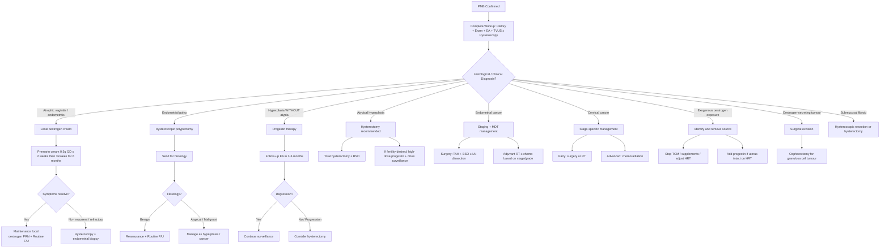

## Management of Post-Menopausal Bleeding (PMB)

### Core Principle

***Treatment is guided to the underlying cause*** [1]. PMB is a symptom, not a diagnosis. The management algorithm therefore flows directly from the diagnostic workup — once you have identified what is causing the bleeding, you treat that specific pathology. There is no "one-size-fits-all" treatment for PMB.

Think of it in two phases:
1. **Acute management**: Stabilise the patient if bleeding is heavy (rare in PMB — most PMB is light spotting)
2. **Definitive management**: Treat the underlying cause based on histological and imaging findings

---

### Management Algorithm

---

### Detailed Management by Aetiology

#### 1. Atrophic Vaginitis / Atrophic Endometritis — ***Most Common Cause***

***Local oestrogen cream: for atrophic vaginitis/endometritis*** [1]

***Regimen: Premarin cream 0.5g QD × 2 weeks then 3×/week for 6 months*** [1]

**First principles — why does local oestrogen work?**
- The problem is **oestrogen deficiency** → thinned, fragile vaginal and endometrial epithelium.
- Replacing oestrogen **locally** restores epithelial thickness, glycogen content, Lactobacillus colonisation, vaginal pH, and vascularity.
- "Premarin" = **Pre**gnant **mar**es' ur**in**e — conjugated equine oestrogens. The cream delivers oestrogen directly to the vaginal epithelium.

**Why local rather than systemic?**
- Local (topical vaginal) oestrogen delivers therapeutic concentrations to the vagina with **minimal systemic absorption** → avoids the risks of systemic HRT (VTE, breast cancer, endometrial stimulation).
- Systemic oestrogen is reserved for women with significant vasomotor symptoms or other indications for HRT.

**Available local oestrogen preparations**:

| Preparation | Active Ingredient | Regimen | Notes |
|-------------|------------------|---------|-------|
| ***Premarin cream*** | Conjugated equine oestrogens | ***0.5g QD × 2 weeks, then 3×/week for 6 months*** [1] | Most commonly mentioned in HK protocols |
| Ovestin cream | Oestriol (E3) | 0.5 mg QD × 2–3 weeks, then 2×/week | E3 is weaker → even less systemic absorption |
| Vagifem tablet | Oestradiol (E2) 10 μg | 1 tablet PV QD × 2 weeks, then 2×/week | More convenient; less messy than cream |
| Estring ring | Oestradiol | Inserted Q3 months | Continuous low-dose release; good compliance |

**Important points**:
- Local vaginal oestrogen at standard doses does **NOT** require concurrent progestogen even in women with an intact uterus — the systemic absorption is negligible.
- Treatment duration: can be long-term/indefinite for symptomatic relief, as symptoms recur upon cessation.
- If symptoms are **refractory** to topical oestrogen → ***hysteroscopy ± endometrial biopsy*** [1] to exclude a missed pathology.

<Callout title="Follow-Up After Treatment for Atrophy" type="idea">
***Review OT record if hysteroscopy performed*** [1]. ***Review histopathology report for endometrial biopsy*** [1]. If treated empirically with oestrogen cream and symptoms resolve → routine follow-up. If symptoms persist or recur → must reassess and consider hysteroscopy.
</Callout>

---

#### 2. Endometrial Polyps

**Management**: **Hysteroscopic polypectomy** — both diagnostic (histological examination of the entire polyp) and therapeutic (removal stops the bleeding).

**Why not just leave them?**
- Polyps are a cause of bleeding — removal treats the symptom.
- 0.5–3% harbour malignancy — histological examination of the whole polyp is essential. An EA may only sample the surface and miss focal carcinoma within the polyp.
- Recurrence is possible but uncommon after complete removal.

**Procedure**: Under hysteroscopic guidance, the polyp is identified, its base is divided (using scissors, electrosurgery, or morcellation), and the specimen is retrieved and sent for histology.

**Post-polypectomy management**:
- **Benign histology**: Reassurance + routine follow-up.
- **Atypical or malignant histology**: Manage as hyperplasia or cancer (see below).

---

#### 3. Endometrial Hyperplasia

Management depends on the presence or absence of **cytological atypia** — this is the critical distinction:

##### A. Hyperplasia WITHOUT Atypia

**Risk of progression to cancer**: ~1–3%. This is a low-risk condition that is often **reversible** with progestin therapy.

**First-line: Progestin therapy**
- **Why progestins?** Progesterone opposes oestrogen's proliferative effect on the endometrium. It induces:
  1. Secretory differentiation of glandular epithelium
  2. Stromal decidualisation
  3. Apoptosis of endometrial cells
  4. Down-regulation of oestrogen receptors
  → Net effect: reversal of the hyperplastic process.

**Progestin options**:

| Regimen | Details | Notes |
|---------|---------|-------|
| Mirena LNG-IUS | Levonorgestrel 20 μg/day intrauterine system | **Preferred** — delivers high local progestin concentration directly to endometrium with minimal systemic side effects. Regression rate ~90%. Also provides contraception if perimenopausal. |
| Oral medroxyprogesterone acetate (MPA) | 10–20 mg/day for 12–14 days per month (cyclical) or continuous | Systemic side effects (bloating, mood changes, weight gain). Regression rate ~70–80%. |
| Oral norethisterone | 10–15 mg/day cyclical or continuous | Similar efficacy and side effect profile to MPA |

**Follow-up**: Repeat endometrial aspirate at **3–6 months** to confirm regression.
- **If regression confirmed** → continue surveillance (EA every 6–12 months for ≥ 2 samples after regression)
- **If no regression or progression** → consider hysterectomy

**Identify and address the underlying cause** of unopposed oestrogen:
- Obesity → weight loss counselling (↓ peripheral aromatase activity)
- Exogenous oestrogen → add progestin or stop unopposed oestrogen
- Anovulation → induce ovulation or provide progestin

##### B. Atypical Hyperplasia

**Risk of progression to cancer**: ~29%. Moreover, ~40% of women with atypical hyperplasia on biopsy already have **concurrent endometrial carcinoma** at hysterectomy. This is essentially a **pre-malignant** condition.

**Standard management**: ***Hysterectomy*** — typically total hysterectomy ± bilateral salpingo-oophorectomy (BSO).

Why BSO? In post-menopausal women:
- The ovaries are no longer functional but may harbour occult pathology.
- Removes any residual endogenous oestrogen source.
- Reduces future risk of ovarian cancer.

**Conservative management** (fertility-sparing): Only considered in young women who strongly desire future fertility:
- High-dose progestin therapy (MPA 500 mg/day or megestrol 160–320 mg/day, or Mirena LNG-IUS)
- **Intensive surveillance**: EA every 3 months
- **Must counsel**: Significant risk of concurrent carcinoma, risk of progression, need for definitive hysterectomy after completing childbearing
- This approach requires MDT discussion and patient understanding of risks

---

#### 4. Endometrial Cancer

This is the most feared diagnosis and requires a structured, multidisciplinary approach.

**Staging**: FIGO surgical staging (2009, updated 2023):

| Stage | Description |
|-------|-------------|
| IA | Tumour confined to endometrium or invades < 50% myometrium |
| IB | Tumour invades ≥ 50% myometrium |
| II | Tumour invades cervical stroma |
| IIIA | Tumour invades serosa and/or adnexae |
| IIIB | Vaginal and/or parametrial involvement |
| IIIC1 | Pelvic lymph node metastasis |
| IIIC2 | Para-aortic lymph node metastasis |
| IVA | Tumour invades bladder and/or bowel mucosa |
| IVB | Distant metastasis |

**Pre-operative workup for staging**:
- MRI pelvis (preferred): Depth of myometrial invasion, cervical stromal invasion, lymph node status
- CT chest/abdomen/pelvis: Distant metastases
- Blood tests: FBC, RFT, LFT, CA-125 (elevated in advanced disease)
- CXR, ECG, pre-operative anaesthetic assessment

**Surgical management** (mainstay):

| Component | Details | Rationale |
|-----------|---------|-----------|
| Total abdominal hysterectomy (TAH) | Removal of the entire uterus including cervix | Removes the primary tumour |
| Bilateral salpingo-oophorectomy (BSO) | Removal of both ovaries and fallopian tubes | Removes potential oestrogen source; ovaries are common site of occult metastasis |
| Pelvic ± para-aortic lymph node dissection | Systematic sampling or complete dissection | Surgical staging; identifies nodal metastasis that determines adjuvant therapy |
| Peritoneal washings | Cytological examination of peritoneal fluid | Staging information (though removed from formal FIGO staging in 2009, still often performed) |
| Omentectomy | Removal of the greater omentum | Especially in serous/clear cell (Type II) histology — propensity for peritoneal spread |

**Minimally invasive surgery** (laparoscopic or robotic-assisted): Increasingly used for early-stage disease. Equivalent oncological outcomes with less morbidity.

**Sentinel lymph node mapping**: Emerging technique to reduce morbidity of full lymph node dissection in early-stage disease.

**Adjuvant therapy** (based on stage, grade, histological type, and molecular classification):

| Risk Category | Criteria | Adjuvant Therapy |
|---------------|----------|------------------|
| Low risk | Stage IA, Grade 1–2, endometrioid, no LVSI | Observation only |
| Intermediate risk | Stage IA Grade 3, or Stage IB Grade 1–2 | Vaginal cuff brachytherapy (VBT) |
| High-intermediate risk | Stage IB Grade 3, or LVSI+, or age > 60 with 2+ risk factors | Pelvic external beam RT (EBRT) ± VBT |
| High risk | Stage II–III, or Type II histology (serous, clear cell) | EBRT + chemotherapy (platinum-based, e.g., carboplatin + paclitaxel) |
| Advanced / Metastatic | Stage IVA/IVB | Systemic chemotherapy ± palliative RT |

***Hormonal therapy with tamoxifen*** is used for breast cancer but has endometrial side effects — ***SERM (e.g., tamoxifen): side effects include weight gain, flushing, ↑ risk of CA corpus, VTE*** [7].

**Molecular classification (TCGA/ProMisE)** — increasingly used to guide adjuvant therapy:
1. **POLE ultramutated**: Excellent prognosis → may de-escalate adjuvant therapy
2. **MSI-high / dMMR**: Good prognosis; immunotherapy (pembrolizumab) if advanced
3. **Copy number low (p53 wildtype)**: Intermediate prognosis
4. **Copy number high (p53 mutant)**: Poor prognosis → aggressive adjuvant therapy

---

#### 5. Cervical Cancer

Management is stage-dependent. This is briefly outlined here as PMB may be the presenting symptom:

| Stage | Management |
|-------|------------|
| IA1 (microinvasive, no LVSI) | Cone biopsy (fertility-sparing) or simple hysterectomy |
| IA2–IB1 | Radical hysterectomy + pelvic lymphadenectomy OR primary chemoradiation |
| IB2–IIA | Radical hysterectomy or primary chemoradiation (cisplatin-based) |
| IIB–IVA | Primary chemoradiation (cisplatin + EBRT + brachytherapy) |
| IVB | Palliative chemotherapy ± immunotherapy (pembrolizumab if PD-L1+) |

---

#### 6. Exogenous Oestrogen Exposure

***Oestrogen exposure from herbal supplements, hormonal treatment, or endogenous tumours*** [1]

**Management principle**: **Identify and remove the source**.

| Source | Action |
|--------|--------|
| ***TCM / Herbal supplements*** | ***Stop the offending product*** — counsel that these may contain undeclared oestrogens [1] |
| ***Unopposed oestrogen HRT*** | ***Add progestin if uterus intact*** — ***presence of uterus: cannot use unopposed oestrogen*** [5] |
| ***Tamoxifen*** | Cannot simply stop (needed for breast cancer); manage endometrial complications as they arise |
| Phytoestrogen supplements | Discuss risks; consider stopping |

**HRT adjustment if bleeding occurs on HRT** [5]:

***Choosing a suitable HRT regimen*** [5]:
- ***Presence of uterus: cannot use unopposed oestrogen*** → must add progestin (combined regimen)
- ***Time since menopause: > 2 years can use continuous regimen*** (aims for amenorrhoea)
- ***< 2 years since menopause: use cyclical regimen*** (expected withdrawal bleed)

***Management of bleeding on HRT*** [5]:
- ***Breakthrough bleeding occurring in first 6 months of treatment requires no immediate intervention***
- ***For combined cyclical regimen: if bleeding is not around time of progestin withdrawal / persistently irregular → endometrial biopsy***
- ***For continuous combined regimen: if bleeding occurs after achievement of amenorrhoea → endometrial biopsy***

***Stopping HRT: no universal rule*** [5]:
- ***Principle = lowest dose for shortest possible duration for symptom relief***
- ***Exception: premature ovarian insufficiency (POI)*** — continue until natural menopausal age (~50)

**Contraindications to HRT** (important to know — determines whether you can use it at all):

| Absolute Contraindications | Relative Contraindications |
|---------------------------|--------------------------|
| Active or recent VTE | History of VTE (can consider transdermal route — bypasses first-pass hepatic effect → less prothrombotic) |
| Active or recent arterial thromboembolic disease (MI, stroke) | Strong family history of VTE |
| Known or suspected breast cancer | Uncontrolled hypertension |
| Known or suspected oestrogen-dependent malignancy | Active liver disease |
| Undiagnosed abnormal genital bleeding | Endometriosis (may reactivate) |
| Untreated endometrial hyperplasia | Gallbladder disease |
| Active liver disease / acute porphyria | Migraine with aura |

<Callout title="Why Transdermal HRT is Safer for VTE Risk">
Oral oestrogen undergoes first-pass metabolism in the liver → ↑ hepatic synthesis of clotting factors (factors VII, X, fibrinogen) and ↓ antithrombin III → prothrombotic state. Transdermal oestrogen (patches, gels) bypasses the liver → minimal effect on clotting factors → significantly lower VTE risk. This is why transdermal is preferred in women with VTE risk factors.
</Callout>

***Side effects of HRT (usually transient)*** [5]:
- ***Breast tenderness, fluid retention, GI upset, headache, irregular bleeding***

***Routine follow-up on HRT*** [5]:
- ***2nd visit in 2–4 months, then subsequent F/U in 6–12 months***
- ***Every visit: body weight, BP, urinalysis***
- ***Routine PE: general, thyroid, cardiac, chest & abdominal exam, breast exam, pelvic exam***
- ***Routine investigations: cervical smear Q3 years, mammogram ± lipid profile, LFT, fasting glucose every 2 years; BMD studies if indicated***

---

#### 7. Oestrogen-Secreting Ovarian Tumours

- **Granulosa cell tumour**: Most common sex cord-stromal tumour. Secretes oestrogen → endometrial stimulation → PMB.
- **Management**: Surgical excision — typically unilateral oophorectomy (if unilateral), or TAH + BSO (if post-menopausal or bilateral).
- **Follow-up**: Serum inhibin B (tumour marker), oestradiol levels. Risk of late recurrence (even decades later).

---

#### 8. Submucosal Fibroids

Although fibroids typically regress post-menopause, those that persist (or grow on HRT/tamoxifen) may cause PMB.

***Surgical management of fibroids*** [8]:

***Indications for surgery*** [8]:
- ***Symptomatic*** — but warn patient that urinary frequency may not improve as it may be due to detrusor instability
- ***Rapid growth or post-menopausal growth → worrisome of malignancy***

| Approach | Details | When to Use |
|----------|---------|------------|
| ***Hysteroscopic resection*** | Resection of submucosal fibroid under hysteroscopic guidance ± endometrial ablation | Submucosal fibroids < 3–4 cm; preserves uterus |
| ***Hysterectomy*** | ***Indications: acute haemorrhage not responding to other therapies; completed childbearing; ↑ risk for CA cervix/endometrium/ovaries*** [8] | Definitive treatment; post-menopausal women who are symptomatic |
| ***Uterine artery embolisation (UAE)*** | ***Transcatheter embolisation of uterine arteries*** [9] — embolic agents block blood supply to fibroids → ischaemic necrosis → shrinkage | ***Alternative treatment*** [8]; generally for premenopausal women but can be used in select post-menopausal cases |

***Medical treatment of fibroids*** [8] — less relevant in the post-menopausal setting as most fibroids should be regressing, but includes:
- ***Tranexamic acid: oral 1g TDS up to 4 days, max 4g daily*** — reduces fibrinolysis → ↓ bleeding
- ***Iron supplement: oral ferrous sulphate 300mg TDS × 6 months if Hb < 10 g/dL***
- ***GnRH agonists/antagonists: pre-operative ↓ size before hysteroscopic resection***
  - ***MoA: desensitisation → medically induce menopause → ↓ size of fibroid*** — but ***NOT for long-term use*** due to ***significant climacteric symptoms and menopause-related side effects (e.g., bone density)*** [8]
  - ***Rapid relapse following discontinuation*** [8]

---

### Follow-Up Protocol

***Follow-up after PMB management*** [1]:
- ***Review OT record if hysteroscopy performed***
- ***Review histopathology report for endometrial biopsy***
- If treated for atrophic vaginitis: reassess in 3–6 months to ensure symptoms have resolved
- If endometrial hyperplasia: repeat EA at 3–6 months post-progestin therapy
- If endometrial cancer: oncology follow-up (3-monthly for first 2 years, then 6-monthly)
- If on HRT: ***routine F/U in 6–12 months in primary healthcare clinics if stable*** [5]

---

### Summary: Management by Diagnosis

| Diagnosis | First-Line Treatment | Second-Line / If Refractory | Key Points |
|-----------|---------------------|----------------------------|------------|
| ***Atrophic vaginitis/endometritis*** | ***Local oestrogen cream (Premarin 0.5g QD × 2w then 3×/w for 6m)*** [1] | ***Hysteroscopy ± biopsy*** [1] | Most common cause; diagnosis of exclusion |
| Endometrial polyp | Hysteroscopic polypectomy + histology | — | Always send for histology (0.5–3% malignant) |
| Hyperplasia without atypia | Progestin therapy (Mirena preferred) | Hysterectomy if no regression | ~1–3% progress to cancer; usually reversible |
| Atypical hyperplasia | Hysterectomy (TAH + BSO) | High-dose progestin if fertility desired | ~29% progress; ~40% have concurrent cancer |
| Endometrial cancer | TAH + BSO ± LN dissection ± adjuvant | Chemo/RT based on stage | MDT approach; molecular classification emerging |
| Cervical cancer | Surgery (early) or chemoradiation (advanced) | Palliative chemo for stage IV | Stage-dependent; biopsy visible lesions directly |
| ***Exogenous oestrogen*** | ***Remove source; add progestin if on unopposed oestrogen*** | — | ***Cannot use unopposed oestrogen if uterus present*** [5] |
| Oestrogen-secreting tumour | Surgical excision (oophorectomy / TAH + BSO) | — | Follow inhibin B and oestradiol |
| Submucosal fibroid | Hysteroscopic resection | ***Hysterectomy*** [8] | ***Post-menopausal growth → worrisome of malignancy*** [8] |

---

<Callout title="High Yield Summary">

**General Principle**: ***Treatment is guided to the underlying cause*** [1]

**Atrophic Vaginitis**: ***Local oestrogen cream (Premarin 0.5g QD × 2 weeks then 3×/week for 6 months)*** [1] — first-line. If refractory → hysteroscopy to exclude missed pathology.

**Endometrial Hyperplasia**: Without atypia → progestin therapy (Mirena LNG-IUS preferred) + follow-up EA at 3–6 months. Atypical → hysterectomy (TAH + BSO), because ~29% progress and ~40% already harbour carcinoma.

**Endometrial Cancer**: Surgical staging (TAH + BSO ± LN dissection) + adjuvant RT/chemo based on risk stratification. Molecular classification (POLE, MSI, p53) increasingly important.

**HRT Rules**: ***Presence of uterus → cannot use unopposed oestrogen*** [5]. ***Time since menopause > 2 years → continuous combined regimen*** [5]. ***Breakthrough bleeding in first 6 months → no immediate intervention; after that → endometrial biopsy if abnormal pattern*** [5]. ***Principle = lowest dose for shortest possible duration*** [5].

**Fibroids**: ***Post-menopausal growth is worrisome of malignancy*** [8] → surgical excision. ***GnRH agonists for pre-operative size reduction only — NOT for long-term use*** [8].

</Callout>

---

<ActiveRecallQuiz
  title="Active Recall - PMB: Management"
  items={[
    {
      question: "State the first-line treatment for atrophic vaginitis causing PMB, including the specific regimen. What should you do if symptoms are refractory?",
      markscheme: "Local oestrogen cream: Premarin cream 0.5g QD for 2 weeks then 3 times per week for 6 months. If refractory, perform hysteroscopy with endometrial biopsy to exclude missed pathology such as polyp or malignancy.",
    },
    {
      question: "A post-menopausal woman is found to have atypical endometrial hyperplasia on endometrial aspirate. What is the recommended management and why?",
      markscheme: "Hysterectomy (TAH plus BSO) is recommended. Reason: atypical hyperplasia has approximately 29% risk of progression to endometrial cancer, and approximately 40% of cases already harbour concurrent endometrial carcinoma at hysterectomy. Conservative management with high-dose progestin is only considered in young women desiring fertility preservation, with intensive surveillance (EA every 3 months) and full informed consent.",
    },
    {
      question: "A 55-year-old post-menopausal woman with an intact uterus wishes to start HRT for vasomotor symptoms. Her menopause was 3 years ago. What HRT regimen should be used and why?",
      markscheme: "Combined oestrogen-progestin regimen (not unopposed oestrogen, because she has an intact uterus — unopposed oestrogen causes endometrial hyperplasia and cancer). Since menopause was more than 2 years ago, a continuous combined regimen can be used (aiming for amenorrhoea, avoiding cyclical withdrawal bleeds).",
    },
    {
      question: "Explain why transdermal oestrogen HRT has a lower VTE risk compared to oral oestrogen.",
      markscheme: "Oral oestrogen undergoes first-pass hepatic metabolism, which increases hepatic synthesis of clotting factors (VII, X, fibrinogen) and decreases antithrombin III, creating a prothrombotic state. Transdermal oestrogen bypasses the liver, avoiding this first-pass effect and therefore having minimal impact on coagulation factors.",
    },
    {
      question: "A post-menopausal woman is found to have a rapidly growing uterine fibroid. Why is this concerning and what is the management?",
      markscheme: "Post-menopausal fibroid growth is worrisome of malignancy (uterine sarcoma/leiomyosarcoma), because fibroids should be regressing after menopause due to loss of oestrogen and progesterone stimulation. Management is surgical excision, typically hysterectomy, with the specimen sent for histology.",
    },
    {
      question: "A woman on continuous combined HRT achieved amenorrhoea 8 months ago but now has vaginal bleeding. What investigation is indicated and why?",
      markscheme: "Endometrial biopsy is indicated. In continuous combined HRT, bleeding after achievement of amenorrhoea suggests endometrial pathology (the progestin component should be suppressing the endometrium, so breakthrough bleeding implies either inadequate suppression or a structural lesion such as polyp or cancer). This contrasts with bleeding in the first 6 months of HRT initiation, which requires no immediate intervention.",
    },
  ]}
/>

## References

[1] Lecture slides: Adrian Lui Gynecology Notes.pdf (p22)
[5] Lecture slides: Adrian Lui Gynecology Notes.pdf (p36)
[7] Senior notes: Maksim Surgery Notes.pdf (p186)
[8] Lecture slides: Adrian Lui Gynecology Notes.pdf (p92)
[9] Senior notes: Ryan Ho Diagnostic Radiology.pdf (p85)
