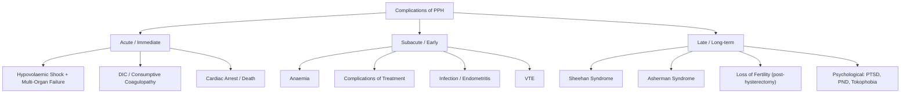

## Complications of Postpartum Haemorrhage

### The Big Picture

***PPH is one of the major causes of direct maternal death.*** [1][2][3][4] But even when the mother survives, PPH can leave a devastating trail of complications — from organ damage caused by hypovolaemic shock, to complications of the treatment itself (massive transfusion, surgery), to long-term endocrine and psychological consequences. Understanding these complications requires tracing the pathophysiological cascade from blood loss through to its downstream effects on every organ system.

***Whatever the initial cause of bleeding, the patient can develop blood coagulation defects after heavy bleeding, and this causes more bleeding.*** [14][15] — This single sentence from the lecture notes captures the vicious cycle that underpins the most dangerous acute complications.

---

### Classification of Complications

---

### A. Acute / Immediate Complications

#### 1. Hypovolaemic Shock and Multi-Organ Failure

This is the direct consequence of the massive blood loss and the most lethal immediate complication.

**Pathophysiology from first principles:**

Blood loss → ↓ circulating volume → ↓ venous return → ↓ preload → ↓ stroke volume → ↓ cardiac output → ↓ tissue oxygen delivery → tissue hypoxia → **anaerobic metabolism → lactic acidosis** → cellular injury → organ failure.

The body compensates initially through:
- Sympathetic activation → tachycardia, vasoconstriction (shunting blood from skin/gut/kidneys to brain/heart)
- ADH/aldosterone release → water/sodium retention
- Transcapillary fluid shift (interstitial fluid moves into intravascular space)

But these mechanisms have limits. Once compensation is overwhelmed (typically at > 30–40% blood volume loss), **decompensated shock** ensues — BP falls precipitously and organ damage begins.

| Organ | Mechanism of Injury | Clinical Manifestation |
|---|---|---|
| **Kidneys** | Renal hypoperfusion → ↓ GFR → acute tubular necrosis (ATN) from prolonged ischaemia | Acute kidney injury (AKI): oliguria → anuria; ↑ creatinine, ↑ urea, ↑ K⁺; may require renal replacement therapy (dialysis) |
| **Liver** | Hepatic hypoperfusion → centrilobular hepatocyte necrosis ("shock liver" / ischaemic hepatitis) | ↑↑ transaminases (ALT/AST can reach thousands), ↑ bilirubin, ↑ INR; usually reversible if perfusion restored |
| **Lungs** | Endothelial injury from shock + massive transfusion → capillary leak → pulmonary oedema; also TRALI from blood products | Acute respiratory distress syndrome (ARDS): bilateral pulmonary infiltrates, hypoxaemia refractory to supplemental O₂; PaO₂/FiO₂ ratio < 300 |
| **Brain** | Cerebral hypoperfusion → watershed infarction; severe cases → diffuse hypoxic-ischaemic encephalopathy | Confusion → obtundation → coma; seizures; may have permanent neurological deficit |
| **Heart** | Myocardial ischaemia from ↓ oxygen delivery to the myocardium (especially if pre-existing coronary disease) | Chest pain, ST changes on ECG, ↑ troponin; arrhythmias; cardiogenic shock (secondary) |
| **GI tract** | Splanchnic vasoconstriction (blood shunted away from gut) → mucosal ischaemia | Ileus, mucosal sloughing, stress ulceration; potential translocation of gut bacteria → secondary sepsis |
| **Adrenal glands** | Bilateral adrenal haemorrhage/infarction in the setting of DIC and shock (Waterhouse-Friderichsen-like syndrome) | Acute adrenal insufficiency: refractory hypotension despite fluids/vasopressors, hypoglycaemia, ↓ Na⁺, ↑ K⁺ |

<Callout title="The Lethal Triad — Revisited">
In massive PPH, three physiological derangements reinforce each other in a **lethal positive feedback loop**:
1. **Hypothermia** (exposure, cold fluids, massive transfusion) → slows enzymatic clotting cascade
2. **Acidosis** (lactic acid from hypoperfusion; citrate from transfused blood) → impairs clotting factor function and cardiac contractility
3. **Coagulopathy** (consumption + dilution + hypothermia/acidosis) → continued bleeding → more shock → more hypothermia and acidosis

Breaking this triad is the central goal of resuscitation — warm fluids, early blood products (not just crystalloid), and aggressive source control.
</Callout>

#### 2. Disseminated Intravascular Coagulation (DIC)

***Whatever the initial cause of bleeding, the patient can develop blood coagulation defects after heavy bleeding, and this causes more bleeding.*** [14][15]

DIC is both a **cause** of PPH (e.g., amniotic fluid embolism, abruption) and a **complication** of PPH (secondary to massive haemorrhage from any cause).

**Why does PPH cause DIC?**
- Massive tissue trauma (delivery, especially instrumental/operative) releases tissue factor (TF) into the circulation
- Hypotension and acidosis cause endothelial damage → further TF exposure
- Massive transfusion with stored blood (which contains activated procoagulant debris) contributes
- The combination triggers widespread intravascular coagulation → consumption of clotting factors and platelets → paradoxical bleeding [14][15][16][17]

**Clinical features**: Non-clotting blood, oozing from IV sites/wound edges/mucosal surfaces, worsening haemorrhage despite mechanical haemostasis

**Lab picture**: ↓ platelets, ↑ PT/aPTT, ↓ fibrinogen, ↑ D-dimer, schistocytes on PBS ("full-house" clotting) [16][17]

**Management**: Treat the underlying cause + replace consumed components (FFP, cryoprecipitate, platelets) [17]

#### 3. Maternal Death

***PPH is one of the major causes of direct maternal death.*** [1][2] When resuscitation fails, cardiac arrest and death result from:
- Severe hypovolaemia → pulseless electrical activity (PEA) or asystole
- Massive DIC → uncontrollable haemorrhage
- Multi-organ failure

Importantly, most PPH deaths are **preventable** — delays in recognition, treatment, and escalation are the leading modifiable factors (the "Three Delays" model). This is why ***communication with all relevant professionals*** is the first principle of PPH management [5][6].

---

### B. Subacute / Early Complications (Hours to Days)

#### 4. Anaemia and Iron Deficiency

Even after bleeding is controlled, the patient may be left profoundly anaemic:
- **Mechanism**: Direct loss of red blood cells + haemodilution from fluid resuscitation
- **Impact**: Fatigue, dyspnoea, tachycardia, impaired lactation, delayed recovery, poor wound healing, difficulty bonding with the baby
- **Management**: Oral or IV iron supplementation (IV iron preferred if Hb < 7–8 g/dL or intolerance of oral iron); continued blood transfusion if symptomatic or Hb critically low

#### 5. Complications of Massive Transfusion

When a patient receives > 10 units pRBC (or > 1–2× blood volume in 24 hours) [18][19], specific transfusion-related complications arise:

| Complication | Mechanism | Prevention/Treatment |
|---|---|---|
| **Hyperkalaemia** | Stored RBCs leak intracellular K⁺ over time (haemolysis during storage); rapid transfusion delivers a potassium load | Monitor K⁺ with serial VBGs; use fresher units if available; treat hyperkalaemia with calcium gluconate, insulin-dextrose, nebulised salbutamol [18][19] |
| **Hypocalcaemia** (citrate toxicity) | Stored blood contains citrate anticoagulant which chelates ionised Ca²⁺; Ca²⁺ is Factor IV — essential for multiple steps in the clotting cascade AND cardiac muscle contraction | Monitor ionised Ca²⁺; replace with **10 mL of 10% calcium gluconate IV** for every 4 units pRBC; signs: prolonged QT, tetany, worsening coagulopathy, cardiac dysfunction [18][19] |
| **Hypothermia** | Cold stored blood (4°C) is infused rapidly → core body temperature drops | Use fluid warmers for ALL blood products; forced-air warming blankets; hypothermia worsens coagulopathy and cardiac function [18][19] |
| **Dilutional coagulopathy / thrombocytopenia** | pRBCs contain no functional platelets or clotting factors; massive crystalloid dilutes existing factors | Balanced transfusion (pRBC:FFP:Plt = 1:1:1); cryoprecipitate if fibrinogen < 2 g/L; ROTEM-guided if available [18][19] |
| **Transfusion-related acute lung injury (TRALI)** | Donor antibodies (anti-HLA or anti-neutrophil) activate recipient neutrophils in the pulmonary vasculature → capillary leak → non-cardiogenic pulmonary oedema | Occurs within 6h of transfusion; presents like ARDS; supportive management; use male-only plasma donors (↓ anti-HLA antibodies) [19] |
| **Transfusion-associated circulatory overload (TACO)** | Rapid fluid administration exceeds cardiac capacity → hydrostatic pulmonary oedema | Diuretics; slower transfusion rate; upright positioning; more common in patients with cardiac comorbidity |
| **Febrile non-haemolytic transfusion reaction (FNHTR)** | Recipient antibodies react with donor leucocyte antigens → cytokine release → fever/rigors | Paracetamol; leucocyte-reduced blood products [19] |
| **Allergic reactions** | IgE-mediated reaction to donor plasma proteins | Antihistamines ± steroids; anaphylaxis protocol if severe [19] |
| **Metabolic alkalosis** | Citrate is metabolised to bicarbonate in the liver after transfusion → delayed alkalaemia | Usually self-correcting; monitor ABGs [18] |

#### 6. Complications of Surgical Interventions

| Procedure | Specific Complications |
|---|---|
| **Peripartum hysterectomy** | Permanent loss of fertility; bladder/ureteric injury (especially with PAS involving the bladder); haemorrhage; infection; VTE; prolonged recovery; psychological impact |
| **B-Lynch suture** | Uterine necrosis (rare — if suture too tight); pyometria (intrauterine infection trapped by compressed cavity); adhesions |
| **Uterine artery ligation** | Generally well-tolerated; rare: broad ligament haematoma, ureteric injury |
| **Internal iliac artery ligation** | Technically difficult; risk of injury to internal iliac vein (torrential venous haemorrhage), ureteric injury; buttock claudication (rare — usually adequate collaterals) |
| **UAE** | Post-embolisation syndrome (pain, fever, nausea — self-limiting); uterine necrosis/infection (rare); non-target embolisation (ovarian artery → ovarian failure); femoral artery access site complications (haematoma, pseudoaneurysm) |

#### 7. Infection / Endometritis

- **Why**: The uterine cavity is exposed and potentially contaminated after delivery; retained products, instrumentation (manual removal, EUA), and surgical procedures all increase risk; PPH itself impairs immune function (hypoperfusion, transfusion-related immunosuppression)
- **Presentation**: Fever, uterine tenderness, offensive lochia, tachycardia; can progress to sepsis
- **Management**: Broad-spectrum IV antibiotics; evacuate any retained products; rarely, drainage of pelvic abscess

#### 8. Venous Thromboembolism (VTE)

- **Why**: Pregnancy is already a hypercoagulable state (↑ fibrinogen, ↑ factors VII/VIII/X/vWF, ↓ protein S); PPH compounds this with immobilisation, dehydration, surgical intervention, DIC (which paradoxically causes both bleeding AND thrombosis), and post-transfusion procoagulant state
- **Risk**: Highest in the 6 weeks postpartum; PPH with surgical intervention significantly increases risk
- **Prevention**: Early mobilisation; mechanical thromboprophylaxis (TED stockings, pneumatic compression); pharmacological thromboprophylaxis (LMWH) once haemostasis is secure — typically started 6–12 hours after bleeding is controlled

---

### C. Late / Long-term Complications

#### 9. Sheehan Syndrome (Postpartum Hypopituitarism)

This is the **classic long-term complication of severe PPH** and is highly examinable.

- **Etymology**: Named after Harold Sheehan (1937) who described pituitary necrosis following postpartum haemorrhage
- **Pathophysiology**: During pregnancy, the anterior pituitary gland **doubles in size** (hyperplasia of lactotroph cells to prepare for lactation). This enlargement outpaces its blood supply — the pituitary is supplied by the portal venous system from the hypothalamus, which has low perfusion pressure. When severe PPH causes **prolonged hypotension**, the enlarged anterior pituitary is exquisitely vulnerable to **ischaemic necrosis** because:
  - The gland is enlarged but its vascular supply has not proportionally increased
  - It sits in the rigid sella turcica → swelling from ischaemia causes further compression
  - The portal system is low-pressure and easily compromised
- **Result**: Partial or complete destruction of the anterior pituitary → **panhypopituitarism** (deficiency of all anterior pituitary hormones)

| Hormone Lost | Clinical Consequence | Why / When It Manifests |
|---|---|---|
| **Prolactin** (first to manifest) | **Failure of lactation** (agalactia) — often the earliest sign | Prolactin is needed to initiate and maintain milk production; damaged lactotrophs cannot produce it; presents within days of delivery |
| **GH** (most common deficiency) | Fatigue, loss of muscle mass, central obesity, ↓ quality of life | GH deficiency is the most common single deficiency in Sheehan syndrome; manifests over weeks–months |
| **FSH / LH** (gonadotropins) | **Amenorrhoea** (failure to resume menstruation), loss of axillary/pubic hair, vaginal atrophy, loss of libido, infertility | Loss of gonadotropins → secondary hypogonadism → ↓ oestrogen; often the presenting complaint months–years later |
| **ACTH** | Secondary adrenal insufficiency: fatigue, weight loss, hypoglycaemia, inability to mount a stress response; can be life-threatening | Unlike primary adrenal insufficiency (Addison's), aldosterone is preserved (RAAS-dependent, not ACTH-dependent) → less hyperkalaemia; but ↓ cortisol is dangerous |
| **TSH** | Secondary hypothyroidism: cold intolerance, fatigue, weight gain, constipation, bradycardia, dry skin | T4 and T3 production ↓ due to lack of TSH stimulation |

<Callout title="Sheehan Syndrome — The Classic Exam Scenario">
A woman with a history of severe PPH presents **months to years later** with:
- **Failure to lactate** (earliest clue)
- **Amenorrhoea** (never resumed menses after delivery)
- **Loss of pubic/axillary hair**
- **Features of hypothyroidism and adrenal insufficiency**

Diagnosis: MRI pituitary (empty sella or atrophied gland) + hormonal profile (low anterior pituitary hormones with low/inappropriately normal target gland hormones)

Treatment: Lifelong hormone replacement — **cortisol first** (before thyroxine, because giving T4 without cortisol cover increases cortisol metabolism and can precipitate adrenal crisis), then T4, then oestrogen/progesterone, then GH.
</Callout>

#### 10. Asherman Syndrome (Intrauterine Adhesions)

- **What**: Formation of scar tissue (synechiae) within the uterine cavity
- **Why it happens after PPH**: Aggressive uterine curettage for retained products, manual removal of placenta, or intrauterine instrumentation damages the endometrial basalis layer → healing by fibrosis rather than regeneration → adhesions form between opposing uterine walls
- **Presentation**: Secondary amenorrhoea or hypomenorrhoea (reduced menstrual flow), cyclical pain (haematometra if outflow obstructed), infertility, recurrent miscarriage
- **Diagnosis**: Hysteroscopy (gold standard — direct visualisation of adhesions); USS may show thin endometrium; HSG shows filling defects
- **Treatment**: Hysteroscopic adhesiolysis (cutting the adhesions) + oestrogen therapy to promote endometrial regeneration + intrauterine balloon/stent to prevent re-adhesion

#### 11. Loss of Fertility

- Following **peripartum hysterectomy**: permanent, absolute loss of uterine fertility
- Following **UAE**: usually fertility-preserving (Gelfoam is temporary), but rare cases of ovarian failure (non-target embolisation), uterine necrosis, or Asherman syndrome can impair future reproduction
- Following **bilateral uterine artery ligation**: usually preserves fertility (ovarian collateral supply maintained), but there is a small risk of uterine ischaemia

#### 12. Psychological Complications

These are underappreciated but extremely common:

| Condition | Prevalence Post-PPH | Mechanism / Features |
|---|---|---|
| **Post-traumatic stress disorder (PTSD)** | ~5–15% after severe PPH | The traumatic experience of life-threatening haemorrhage, emergency surgery, ICU admission → intrusive memories, flashbacks, avoidance behaviours, hyperarousal |
| **Postnatal depression (PND)** | Increased risk after PPH | Multifactorial: physiological (anaemia, hormonal disruption, fatigue), psychological (trauma, separation from baby during resuscitation, failure to breastfeed due to Sheehan), social (prolonged hospital stay) |
| **Tokophobia** | Variable | "Tokos" = childbirth, "phobia" = fear → pathological fear of future pregnancy/childbirth; may lead to avoidance of future pregnancies or request for elective CS |
| **Impaired bonding / attachment** | Common in early period | Separation from baby during resuscitation/ICU; inability to breastfeed; maternal fatigue and anaemia |

---

### Summary Table: Complications by Time Course

| Timing | Complication | Key Mechanism |
|---|---|---|
| **Immediate** (minutes–hours) | Hypovolaemic shock → multi-organ failure | ↓ Cardiac output → ↓ tissue O₂ delivery → organ ischaemia |
| | DIC / consumptive coagulopathy | Tissue factor release + endothelial damage → consumption of clotting factors → paradoxical bleeding |
| | Cardiac arrest / maternal death | End-stage of unresuscitated shock |
| **Early** (hours–days) | Anaemia / iron deficiency | Direct blood loss + haemodilution |
| | Complications of massive transfusion | HyperK⁺, hypoCa²⁺, hypothermia, dilutional coagulopathy, TRALI, TACO |
| | Surgical complications | Hysterectomy (loss of fertility, organ injury); B-Lynch (uterine necrosis); UAE (post-embolisation syndrome) |
| | Endometritis / sepsis | Contamination of open uterine cavity; instrumentation; immunosuppression |
| | VTE | Hypercoagulable state + immobility + surgery |
| **Late** (weeks–years) | **Sheehan syndrome** | Ischaemic necrosis of enlarged anterior pituitary → panhypopituitarism |
| | **Asherman syndrome** | Intrauterine adhesions from curettage/instrumentation → amenorrhoea, infertility |
| | Loss of fertility | Post-hysterectomy; post-UAE ovarian failure (rare); Asherman |
| | Psychological (PTSD, PND, tokophobia) | Trauma of life-threatening event; separation; inability to breastfeed; hormonal disruption |

---

<Callout title="High Yield Summary">

**Acute complications** follow the pathophysiology of hypovolaemic shock: ↓ perfusion → multi-organ failure (AKI, shock liver, ARDS, DIC). ***The patient can develop blood coagulation defects after heavy bleeding, which causes more bleeding*** [14][15] — this vicious cycle of bleeding → coagulopathy → more bleeding is the central lethal mechanism.

**The lethal triad** (hypothermia + acidosis + coagulopathy) must be actively broken by warming, balanced transfusion, and early blood products.

**Complications of massive transfusion**: hyperkalaemia, hypocalcaemia (citrate toxicity), hypothermia, dilutional coagulopathy, TRALI, TACO.

**Sheehan syndrome** is THE classic long-term complication — ischaemic necrosis of the enlarged anterior pituitary from prolonged hypotension → failure of lactation (earliest sign), amenorrhoea, panhypopituitarism. Treat with **cortisol first** (before T4).

**Asherman syndrome** — intrauterine adhesions from instrumentation → secondary amenorrhoea, infertility; diagnosed by hysteroscopy; treated by adhesiolysis.

**Psychological sequelae** (PTSD, PND, tokophobia) are common and underdiagnosed — screen actively.

</Callout>

---

<ActiveRecallQuiz
  title="Active Recall - Complications of PPH"
  items={[
    {
      question: "Explain the pathophysiology of Sheehan syndrome. Why is the anterior pituitary particularly vulnerable during PPH?",
      markscheme: "During pregnancy, the anterior pituitary doubles in size (lactotroph hyperplasia for lactation) but its blood supply (low-pressure hypothalamic portal system) does not proportionally increase. The gland sits in the rigid sella turcica. Severe PPH with prolonged hypotension causes ischaemic necrosis of the enlarged, under-perfused gland. Results in partial or complete anterior pituitary hormone deficiency (panhypopituitarism)."
    },
    {
      question: "What is the earliest clinical manifestation of Sheehan syndrome and why? List 3 other hormonal deficiencies and their clinical features.",
      markscheme: "Earliest: failure of lactation (agalactia) — prolactin from destroyed lactotrophs cannot be produced; manifests within days. Others: (1) GH deficiency — fatigue, central obesity; (2) FSH/LH deficiency — secondary amenorrhoea, loss of pubic/axillary hair, infertility; (3) ACTH deficiency — secondary adrenal insufficiency: fatigue, hypoglycaemia, inability to mount stress response; (4) TSH deficiency — secondary hypothyroidism: cold intolerance, weight gain. Must replace cortisol BEFORE thyroxine."
    },
    {
      question: "Name 4 complications specific to massive blood transfusion and explain the mechanism for each.",
      markscheme: "1. Hyperkalaemia — stored RBCs leak intracellular K+ during storage; rapid transfusion delivers potassium load. 2. Hypocalcaemia — citrate anticoagulant in stored blood chelates ionised Ca2+ (Factor IV); impairs clotting cascade and cardiac contractility. 3. Hypothermia — cold stored blood (4 degrees C) lowers core temperature; worsens coagulopathy. 4. Dilutional coagulopathy/thrombocytopenia — pRBCs contain no functional platelets or clotting factors; massive crystalloid dilutes existing factors."
    },
    {
      question: "What is Asherman syndrome? Why does it occur after PPH and how does it present?",
      markscheme: "Asherman syndrome = intrauterine adhesions (synechiae). Occurs after PPH because aggressive curettage or instrumentation (manual removal of placenta, EUA) damages the endometrial basalis layer leading to fibrosis and adhesion formation between opposing uterine walls. Presents with secondary amenorrhoea or hypomenorrhoea, cyclical pain (haematometra), infertility, recurrent miscarriage. Diagnosed by hysteroscopy; treated by hysteroscopic adhesiolysis + oestrogen + intrauterine balloon."
    },
    {
      question: "Explain why PPH can cause DIC as a complication, even if DIC was not the initial cause of the bleeding.",
      markscheme: "Massive tissue trauma from delivery releases tissue factor into circulation. Prolonged hypotension and acidosis cause widespread endothelial damage exposing more tissue factor. Massive transfusion introduces procoagulant debris. Together these trigger widespread intravascular coagulation consuming platelets and clotting factors (consumption coagulopathy), plus secondary fibrinolysis. The result is paradoxical bleeding from inability to form stable clot, creating a vicious cycle of bleeding causing more coagulopathy causing more bleeding."
    }
  ]}
/>

---

## References

[1] Lecture slides: Block C - Postpartum Haemorrhage.pdf p1 (PPH as major cause of direct maternal death, definition)
[2] Lecture slides: Block C - Postpartum Haemorrhage.pdf p32 (summary: obstetric emergency, major cause of direct maternal death)
[3] Lecture slides: PPH for teaching (20210716)v6.pdf p2 (definition, major cause of direct maternal death)
[4] Lecture slides: PPH for teaching (20210716)v6.pdf p37 (summary)
[5] Lecture slides: Block C - Obstetric Emergency Notes to Students.pdf p5 (4 principles of PPH management)
[6] Lecture slides: GCBC-OG-Obs emergency_Notes to students_Sep2024.pdf p5 (4 principles of PPH management)
[14] Lecture slides: Block C - Obstetric Emergency Notes to Students.pdf p4 (coagulation defects after heavy bleeding causing more bleeding; DIC in pregnancy complications)
[15] Lecture slides: GCBC-OG-Obs emergency_Notes to students_Sep2024.pdf p4 (coagulation defects after heavy bleeding; DIC in pregnancy complications)
[16] Senior notes: Maksim Medicine Notes.pdf p165 (DIC pathophysiology, lab features, management — avoid TXA/PCC in DIC)
[17] Senior notes: Ryan Ho Haemtology.pdf p138 (DIC: acute vs chronic, lab features, management: treat underlying cause, supportive, blood products)
[18] Senior notes: Ryan Ho Critical Care.pdf p20 (massive transfusion: risks including hypothermia, coagulopathy, hyperK, citrate toxicity/hypoCa, metabolic alkalosis; pRBC:FFP:PLT = 1:1:1)
[19] Senior notes: Maksim Medicine Notes.pdf p184 (complications of massive transfusion: hyperK, hypoCa, acidosis, hypothermia, dilutional coagulopathy; complications of long-term transfusion)
