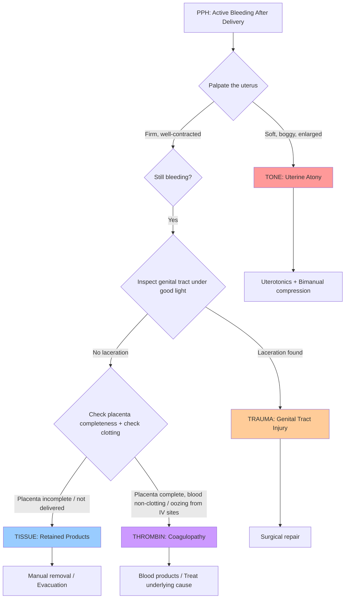

## Differential Diagnosis of Postpartum Haemorrhage

### The Conceptual Framework: Why Do We Need a DDx Approach?

When a woman is bleeding after delivery, you don't just shout "PPH!" — you need to **identify the specific cause** because the management differs radically for each. A boggy atonic uterus needs uterotonics; a cervical tear needs suturing; DIC needs blood products. The wrong treatment for the wrong cause wastes precious minutes and can kill.

***Differential diagnosis including the 4 T's — Tone, Tissue, Trauma, Thrombin.*** [1][2]

The 4 T's framework is not just an aetiology list — it is your **systematic diagnostic algorithm** at the bedside. You work through them in order of frequency, systematically excluding each one.

---

### The 4 T's as a Diagnostic Framework

<Callout title="Key Diagnostic Principle">
The single most important bedside manoeuvre is to **palpate the uterine fundus**. If it is soft and boggy → uterine atony (the #1 cause, ~70–80%). If it is firm and well-contracted but bleeding continues → you MUST look elsewhere: trauma, retained tissue, or coagulopathy. Multiple T's can coexist — always check all four systematically.
</Callout>

---

### Detailed Differential Diagnosis by Category

#### 1. TONE — Uterine Atony (~70–80%)

| Differential | Key Distinguishing Features | Why It Causes Bleeding |
|---|---|---|
| **Uterine atony** (primary/idiopathic) | Soft, boggy, enlarged uterus palpable above umbilicus; often with identifiable risk factors (overdistension, grand multiparity, prolonged labour) | The "living ligature" fails — myometrial fibres don't compress the spiral arteries at the placental bed → free-flowing haemorrhage from open vessels |
| **Drug-induced uterine relaxation** | History of MgSO₄ (for pre-eclampsia/eclampsia), volatile GA agents (sevoflurane), tocolytics (nifedipine, terbutaline) | These agents directly relax smooth muscle → same mechanism as atony above; the pharmacological effect opposes myometrial contraction |
| **Full bladder** | Distended bladder palpable suprapubically; uterus deviated to one side | A full bladder mechanically displaces and prevents the uterus from contracting effectively; simple catheterisation may resolve the "atony" — always catheterise first! |

> ***The lecture slide exam question [M27_R1(23)_Q2] identifies twin pregnancy and uterine fibroids as risk factors for PPH in a case of uterine atony*** — both cause overdistension and abnormal myometrium respectively. [3]

---

#### 2. TISSUE — Retained Placental Tissue / Products (~10–20%)

| Differential | Key Distinguishing Features | Why It Causes Bleeding |
|---|---|---|
| **Retained placental fragments / cotyledons** | Placenta inspection shows missing cotyledon(s) or ragged membranes; uterus may be suboptimally contracted | Retained tissue acts as a physical "wedge" preventing complete uterine contraction + the retained vascular tissue itself continues to bleed from exposed maternal vessels at the attachment site |
| **Retained whole placenta** (> 30 min post-delivery) | Placenta has not delivered; cord may be visible at introitus; no signs of separation (no gush of blood, no cord lengthening, no fundal rise) | If the whole placenta is still attached, it's usually not bleeding yet (vessels still compressed by intact attachment). But if partially separated → exposed bed bleeds while the remaining attached portion prevents contraction |
| **Succenturiate lobe** | Main placenta appears complete but there is a separate accessory lobe connected by membrane vessels; inspect membranes for torn vessels at the margin (suggests a missing accessory lobe) | Same mechanism — retained vascular tissue in the cavity |
| **Placenta accreta spectrum** (accreta / increta / percreta) | Failure to separate despite controlled cord traction; manual removal attempts encounter a plane-less attachment; history of prior CS with anterior low-lying placenta | Trophoblast has invaded through deficient decidua basalis into myometrium → no natural cleavage plane → attempted removal causes massive haemorrhage from torn myometrial vessels |
| **Intrauterine blood clots** | Uterus appears large/boggy but expels large clots on massage; may be confused with atony | Large clots filling the uterine cavity prevent wall coaptation → the clot itself acts as retained "tissue" preventing contraction → vicious cycle |

---

#### 3. TRAUMA — Genital Tract Injury (~5–10%)

This category is the key differential ***when the uterus is firm and well-contracted but bleeding continues*** — the bleeding source must be somewhere other than the placental bed.

| Differential | Key Distinguishing Features | Why It Causes Bleeding |
|---|---|---|
| **Vaginal / perineal lacerations** | Visible tear on inspection; bright red bleeding; history of instrumental delivery, macrosomia, precipitate delivery | Direct vascular injury — torn vessels bleed independently of uterine tone |
| **Cervical tear** | Well-contracted uterus + ongoing bright red bleeding; found on speculum examination (classically at 3 or 9 o'clock); often after rapid cervical dilatation or instrumental delivery | The cervix is highly vascular during pregnancy; tears can extend into the lower uterine segment and involve branches of the uterine artery → arterial-type bleeding |
| **Uterine rupture** | Sudden severe abdominal pain (may have preceded delivery), maternal tachycardia/shock, easily palpable fetal parts through abdomen, haematuria; history of ***previous surgery on uterus*** (***classical CS has ~10% rupture risk***) [1]; may see cessation of contractions | Full-thickness myometrial tear → blood flows into the peritoneal cavity (often concealed) and/or through the vagina → haemorrhagic shock |
| **Uterine inversion** | ***Uterus comes out like a reversed pocket*** [4][5]; fundus not palpable abdominally ("dimple sign"); fleshy mass in vagina; neurogenic (vagal) shock with bradycardia and hypotension disproportionate to blood loss | The inverted fundus drags the placental bed surface outside-in → exposed vessels bleed; simultaneously, traction on the peritoneum and round ligaments triggers a profound vasovagal response |
| **Episiotomy extension / haematoma** | Localised swelling, pain, discolouration at episiotomy site; may be vulval, paravaginal, or retroperitoneal | Unrecognised bleeding vessel at the surgical site; paravaginal haematoma can be concealed and massive |
| **Broad ligament haematoma** | Shock disproportionate to visible blood loss; unilateral pelvic mass on examination; lateral deviation of uterus | Concealed haemorrhage — blood tracks into the broad ligament from uterine/cervical vessel injury |

> ***The exam question [M27_R1(22)_Q3] presents a patient after twin CS with total blood loss 2.6L, complete placenta, well-contracted uterus, but profuse vaginal bleeding in recovery → answer is Coagulopathy (A)*** — demonstrating that when Tone and Tissue are excluded, you must consider Trauma and Thrombin. In that case, massive blood loss likely caused dilutional/consumptive coagulopathy. [3]

---

#### 4. THROMBIN — Coagulopathy (~1–2%, but often secondary)

Coagulopathy should be suspected when ***blood is non-clotting, there is oozing from IV sites or wound edges, and the other 3 T's have been addressed***. It can be pre-existing or develop secondary to massive haemorrhage from any cause.

| Differential | Key Distinguishing Features | Why It Causes Bleeding |
|---|---|---|
| **DIC** (most feared obstetric coagulopathy) | Clinical setting: amniotic fluid embolism, placental abruption, eclampsia/HELLP, sepsis, IUFD; Lab: ↓ platelets, ↑ PT, ↑ aPTT, ↓ fibrinogen, ↑ D-dimer, schistocytes on PBS [6][7] | Release of procoagulant material (tissue factor from placenta/amniotic fluid) → widespread intravascular coagulation → consumption of platelets and clotting factors → paradoxical bleeding ("consumption coagulopathy") + secondary fibrinolysis [6][7] |
| **Dilutional coagulopathy** | Occurs after massive crystalloid/colloid resuscitation without balanced blood product replacement; fibrinogen is the first factor to fall critically | Large-volume fluid replacement dilutes circulating clotting factors and platelets below the haemostatic threshold → cannot form stable clots |
| **Massive transfusion coagulopathy** | After > 10 units pRBC without FFP/cryoprecipitate/platelets; stored pRBCs contain no functional platelets or clotting factors | Same dilutional mechanism + citrate in stored blood chelates calcium (Ca²⁺ is Factor IV, essential for coagulation cascade) → further impairment |
| **Pre-existing bleeding disorders** | History of easy bruising, menorrhagia, family history; vWD (most common inherited bleeding disorder, ~1% prevalence, AD/AR), haemophilia carriers | Impaired primary haemostasis (vWD, platelet disorders) or secondary haemostasis (factor deficiencies) → cannot form adequate plug/clot at placental bed [8] |
| **HELLP syndrome** | Haemolysis (↑ LDH, ↑ bilirubin, schistocytes), Elevated Liver enzymes, Low Platelets; in the context of pre-eclampsia; RUQ pain, nausea | Secondary TMA with endothelial damage → thrombocytopenia (consumption in microvasculature) → both thrombotic and bleeding tendency [7][9] |
| **Acquired factor deficiencies** | Rare; autoantibodies against clotting factors (most commonly Factor VIII — "acquired haemophilia A"); classically described ***postpartum*** or with autoimmune disease [10] | Autoantibodies neutralise clotting factors → factor activity drops → bleeding from deep tissues, retroperitoneal haematoma, surgical sites |
| **Anticoagulant use** | History of LMWH, warfarin, DOACs for conditions like mechanical heart valve, VTE prophylaxis | Pharmacological inhibition of coagulation cascade → impaired clot formation |

<Callout title="Acquired Haemophilia A — A Rare But Important Postpartum Diagnosis" type="idea">
Acquired haemophilia A (autoantibodies against Factor VIII) is ***classically described as postpartum*** or associated with autoimmune disease [10]. It typically presents days to weeks after delivery with unexpected deep tissue bleeding (retroperitoneal haematoma, compartment syndrome) rather than the typical mucocutaneous bleeding of platelet disorders. Suspect it when aPTT is prolonged, does not correct with mixing study, and Factor VIII activity is very low. It is rare but carries high morbidity if missed.
</Callout>

---

### Differentiating the 4 T's at the Bedside — A Clinical Decision Table

| Feature | Tone (Atony) | Tissue (Retained) | Trauma (Injury) | Thrombin (Coagulopathy) |
|---|---|---|---|---|
| **Uterine fundus** | Soft, boggy, enlarged | May be soft (retained tissue prevents contraction) or subinvoluted | ***Firm, well-contracted*** | Usually firm (unless concurrent atony) |
| **Blood character** | Dark red, gushing, with clots | Similar to atony; may see tissue fragments | Bright red, continuous stream | Non-clotting blood; generalised ooze |
| **Placenta inspection** | Complete | Incomplete; missing cotyledon or ragged membranes | Complete | Complete |
| **Genital tract exam** | No tears | No tears | Visible tear / laceration | No tears (unless combined) |
| **Bleeding from other sites** | No | No | No | Yes — IV sites, wound edges, mucosal surfaces |
| **Response to uterotonics** | Improves (at least transiently) | Partial/no response until tissue removed | No response | No response |
| **Lab findings** | Normal clotting initially | Normal clotting | Normal clotting | ↓ Plt, ↑ PT/aPTT, ↓ fibrinogen, ↑ D-dimer |

---

### Secondary PPH — A Separate Differential

When bleeding occurs ***> 24 hours after delivery***, the differential shifts. The 4 T's still apply conceptually, but the relative frequencies change:

| Cause | Features | Why |
|---|---|---|
| **Endometritis** (most common cause of secondary PPH) | Fever, uterine tenderness, cervical excitation, foul-smelling lochia; ***temperature 38°C, cervical excitation and uterine tenderness on pelvic examination*** [3] | Infected uterine cavity → inflammation prevents involution → subinvolution of placental bed vessels → late bleeding; infection also breaks down early clot at placental site |
| **Retained products of conception** | Incomplete involution, ongoing bleeding, USS showing echogenic material in cavity | Same as primary — tissue prevents full contraction and acts as a nidus for infection |
| **Subinvolution of the placental site** | Prolonged lochia beyond expected, no fever, USS may show enlarged uterus with abnormal vascularity | The spiral arteries at the placental bed fail to undergo normal thrombosis and fibrosis → they remain patent and continue to bleed |
| **Gestational trophoblastic disease** (rare) | Persistently elevated β-hCG after delivery; USS shows abnormal uterine echogenicity | Residual trophoblastic tissue remains vascular and continues to grow |
| **Pseudoaneurysm of uterine artery** (rare) | Intermittent heavy bleeding; diagnosed on Doppler USS | Post-traumatic (CS or instrumentation) → weakened arterial wall forms pseudoaneurysm → ruptures intermittently |

> ***The exam question [M27_R1(23)_Q7] presents a patient 5 days post-CS with increased vaginal bleeding, temperature 38°C, cervical excitation and uterine tenderness → most likely diagnosis is Endometritis*** (secondary PPH). [3]

<Callout title="Primary vs Secondary PPH — Quick DDx Rule" type="error">
- **Primary PPH** (within 24h): Tone > Tissue > Trauma > Thrombin (the classic 4 T's in order of frequency)
- **Secondary PPH** (> 24h): Endometritis > Retained products > Subinvolution > Rare causes (GTD, pseudoaneurysm)

Don't confuse them in exam scenarios! Pay close attention to the **timing** stated in the question stem.
</Callout>

---

### Exam-Style Differential Diagnosis Reasoning

Let me walk you through the reasoning process the lectures expect, using actual exam questions:

**Scenario 1** [3]: *38-year-old G1P0, elective CS for twins, delivered uneventfully, total blood loss 2.6L requiring transfusion. Twin 1: 2.3 kg, Twin 2: 2.4 kg. Placenta checked and complete. Subsequently develops profuse vaginal bleeding in recovery. Uterus well-contracted.*

Step-by-step reasoning:
1. **Tone?** → Uterus well-contracted → Atony excluded
2. **Tissue?** → Placenta checked and complete → Retained products excluded
3. **Trauma?** → Possible but this was a CS (no vaginal instrumentation) and delivery was uneventful → less likely as primary cause
4. **Thrombin?** → She lost 2.6L (massive haemorrhage!) requiring transfusion → massive blood loss causes dilutional and consumptive coagulopathy → ***Answer: Coagulopathy (A)***

**Scenario 2** [3]: *20-year-old with PPH due to uterine atony. Given syntometrine, IV oxytocin, IV tranexamic acid, PR misoprostol, two doses IM carboprost. Uterine contraction improved but ongoing slow vaginal bleeding.*

Reasoning:
- Atony has been treated — contraction improved
- But still bleeding → Must exclude Tissue and Trauma
- ***Next step: Examination under anaesthesia in theatre (A)*** — to inspect the genital tract for lacerations and explore the uterine cavity for retained tissue [3]

**Scenario 3** [3]: *38-year-old G1P0 with twin pregnancy and uterine fibroids (6 cm anterior wall), emergency LSCS for breech, uterine atony with 1000 mL blood loss. Which are risk factors for PPH?*

- Twin pregnancy → ***overdistension*** [1]
- Uterine fibroids → ***abnormal myometrium*** [1]
- ***Answer: Twin pregnancy and uterine fibroids (B)*** [3]
- Note: PPROM and advanced maternal age are NOT established risk factors for uterine atony specifically (though age is a general PPH risk factor)

---

### Important Mimics and Pitfalls

| Condition | Why It Mimics PPH | How to Differentiate |
|---|---|---|
| **Concealed abruption** (if occurs before delivery) | Shock without proportionate visible bleeding | Woody-hard, tender uterus; fetal distress; often coexists with DIC |
| **Amniotic fluid embolism** | Sudden cardiovascular collapse ± DIC during or after delivery | Acute onset dyspnoea, hypoxia, cardiovascular collapse, seizures → then DIC develops; diagnosis of exclusion |
| **Uterine artery pseudoaneurysm** | Intermittent heavy vaginal bleeding post-CS | Delayed presentation; Doppler USS diagnostic |
| **Return of menses** (vs secondary PPH) | Vaginal bleeding weeks postpartum | Normal lochia pattern has resolved and then recurs cyclically; no fever, no tenderness; β-hCG negative |

---

<Callout title="High Yield Summary">

**The 4 T's are both the aetiological framework AND the diagnostic algorithm for PPH:**
- ***Tone (70–80%)*** → Soft, boggy uterus → Uterotonics
- ***Tissue (10–20%)*** → Incomplete placenta → Manual removal / Evacuation
- ***Trauma (5–10%)*** → Firm uterus + bright red bleeding → Inspect genital tract → Surgical repair
- ***Thrombin (1–2%)*** → Non-clotting blood, oozing from multiple sites → Blood products

**The key bedside manoeuvre**: Palpate the uterine fundus. Soft/boggy = atony. Firm = look for trauma or coagulopathy.

***When uterus is well-contracted, placenta is complete, but bleeding continues → think Trauma and Thrombin.*** Massive blood loss from any cause can lead to secondary coagulopathy (dilutional + consumptive) → always check clotting.

**Secondary PPH** (> 24 hours): Think endometritis first (fever + uterine tenderness + cervical excitation), then retained products, then subinvolution.

**Multiple T's coexist** — always check ALL four systematically, even if you find one cause.

</Callout>

---

<ActiveRecallQuiz
  title="Active Recall - Differential Diagnosis of PPH"
  items={[
    {
      question: "A woman has ongoing heavy vaginal bleeding after vaginal delivery. The uterus is firm and well-contracted. The placenta has been inspected and is complete. What are the two remaining differential diagnoses from the 4 T framework, and what bedside findings would help distinguish them?",
      markscheme: "Trauma (genital tract injury) and Thrombin (coagulopathy). Trauma: inspect genital tract under good light for cervical/vaginal/perineal tears — look for bright red continuous bleeding from a visible laceration. Thrombin: non-clotting blood, oozing from IV sites and wound edges, lab findings of raised PT/aPTT, low fibrinogen, low platelets, raised D-dimer."
    },
    {
      question: "A patient 5 days post-LSCS presents with increased vaginal bleeding, temperature 38 degrees Celsius, and cervical excitation with uterine tenderness on pelvic examination. What is the most likely diagnosis and why is this classified as secondary rather than primary PPH?",
      markscheme: "Most likely diagnosis is endometritis causing secondary PPH. Secondary because it occurs more than 24 hours after delivery. Endometritis features: fever, uterine tenderness, cervical excitation, foul lochia. Infection prevents normal uterine involution and breaks down early clot at the placental bed."
    },
    {
      question: "After twin Caesarean section with 2.6L blood loss requiring transfusion, the placenta is complete and the uterus is well-contracted, but profuse vaginal bleeding continues. What is the most likely cause and what is the pathophysiology?",
      markscheme: "Coagulopathy (Thrombin). Massive blood loss of 2.6L causes dilutional coagulopathy (from fluid resuscitation) and consumptive coagulopathy (consumption of clotting factors and platelets). Fibrinogen is the first factor to fall critically. Stored pRBCs lack functional platelets and clotting factors, worsening the problem."
    },
    {
      question: "Name 3 obstetric causes of DIC that can present as PPH, and explain the common pathophysiological mechanism.",
      markscheme: "Any 3 of: amniotic fluid embolism, placental abruption, eclampsia/HELLP syndrome, septic abortion, intrauterine fetal death. Common mechanism: release of procoagulant material (tissue factor, placental/amniotic fluid material) into maternal circulation causing widespread intravascular coagulation, followed by consumption of clotting factors and platelets (consumption coagulopathy) plus secondary fibrinolysis, leading to paradoxical bleeding."
    },
    {
      question: "How does uterine inversion present differently from uterine atony, and why does it cause neurogenic shock?",
      markscheme: "Uterine inversion: fundus not palpable abdominally (dimple sign), fleshy mass in vagina, neurogenic shock with bradycardia and hypotension disproportionate to blood loss. Atony: soft boggy uterus palpable above umbilicus, tachycardia proportional to blood loss. Inversion causes neurogenic (vagal) shock because the inverted fundus stretches the peritoneum and round ligaments, triggering a profound vasovagal response with bradycardia and vasodilatation."
    }
  ]}
/>

---

## References

[1] Lecture slides: Block C - Postpartum Haemorrhage.pdf (4T classification, risk factor classification, upper/lower segment physiology)
[2] Lecture slides: PPH for teaching (20210716)v6.pdf (summary, 4T classification)
[3] Lecture slides: OBGYN Clinical Test By Topic.pdf p11–12 (exam questions on PPH differential diagnosis, coagulopathy, endometritis, risk factors)
[4] Lecture slides: Block C - Obstetric Emergency Notes to Students.pdf (uterine inversion, iatrogenic causes)
[5] Lecture slides: GCBC-OG-Obs emergency_Notes to students_Sep2024.pdf (causes of primary PPH, uterine inversion)
[6] Senior notes: Maksim Medicine Notes.pdf p165 (DIC aetiology, pathophysiology, lab features)
[7] Senior notes: Ryan Ho Haemtology.pdf p136–138 (DIC causes, pathogenesis, acute vs chronic DIC, MAHA/TMA terminology)
[8] Senior notes: Maksim Medicine Notes.pdf p160–161 (platelet vs clotting disorder differentiation, clotting cascade interpretation)
[9] Senior notes: Ryan Ho Haemtology.pdf p137 (HELLP as secondary TMA)
[10] Senior notes: Ryan Ho Haemtology.pdf p123 (acquired haemophilia A — classically postpartum)
