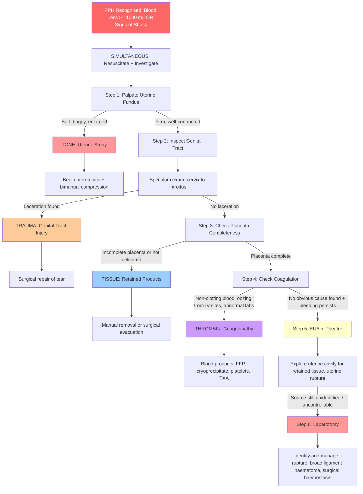
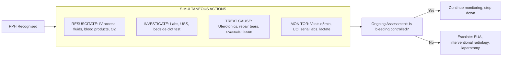

## Diagnostic Criteria and Algorithm for Postpartum Haemorrhage

### Why PPH Diagnosis Is Primarily Clinical — Not Criteria-Based

Unlike many medical conditions (e.g., SLE with ACR/EULAR criteria, or DIC with ISTH scoring), PPH does not have a formal "diagnostic criteria" scoring system. The diagnosis is made on the basis of:

1. **Quantitative blood loss** exceeding the threshold
2. **Clinical assessment** of haemodynamic status
3. **Systematic identification of the cause** using the 4 T's

This makes sense from first principles: PPH is an **emergency**. You cannot wait for lab results or imaging to make the diagnosis — a woman can exsanguinate in minutes from uterine atony. The diagnosis is made **at the bedside, with your hands and eyes**, and treatment begins simultaneously with investigation.

---

### Diagnostic Definition (Recap)

***PPH is defined as blood loss >= 1000 mL or signs/symptoms of hypovolemia within 24 hours after delivery, regardless of mode of delivery.*** [1][2]

***For clinical purposes, even if the estimated blood loss is below the numeric threshold, treatment should be initiated if the patient has symptoms or signs of shock.*** [3][4]

<Callout title="Treat the Patient, Not the Number" type="error">
Visual estimation of blood loss underestimates true loss by 30–50%. A soaked maternity pad holds ~100 mL; a soaked surgical drape can hide over a litre. Quantitative blood loss measurement (QBL) — using graduated drapes, weighing swabs (1 g = 1 mL blood) — improves accuracy but is not universally practiced. In practice, if the patient looks shocked, treat as PPH regardless of the estimated volume.
</Callout>

---

### The Diagnostic Algorithm — Systematic Clinical Approach

The lecture notes lay out a clear, stepwise approach to **identifying the source of bleeding** [5]:

***Identifying the source of bleeding:*** [5]
1. ***Palpate the uterus to check if it is contracting well.***
2. ***Vaginal examination systematically from cervix down to introitus to identify lower genital tract bleeding (local, regional or general anaesthesia).***
3. ***Check the placenta for completeness (if it has been delivered).***
4. ***Arrange emergency operation for examination under anaesthesia. Explore the inside of the uterus to check for retained placenta, rupture of the uterus (usually done through the cervix, does not require laparotomy, but regional or general anaesthesia required).***
5. ***Laparotomy is required in exceptional circumstances when the source of bleeding cannot be identified or to stop the bleeding.***

***(Always do 1–3. Do 4 if 1–3 fail to identify the source of bleeding and the bleeding persists. 4 is seldom needed and when needed, is more often for stopping the bleeding.)*** [5]

> This is the core diagnostic algorithm for your exam. Notice it follows the 4 T's in order: Tone → Trauma → Tissue → then EUA/Laparotomy for deeper causes.

---

### Master Diagnostic Algorithm — Mermaid Diagram

<Callout title="Key Exam Point — The Stepwise Approach">
***Always do Steps 1–3 (fundal palpation, genital tract inspection, placenta check). Step 4 (EUA) is performed if Steps 1–3 fail to identify the source and bleeding persists. Step 5 (laparotomy) is seldom needed and is more often for stopping the bleeding than for diagnosis.*** [5]

In the exam question where a patient has had all uterotonics but still has ongoing slow bleeding with improved uterine contraction, ***the next most appropriate action is Examination Under Anaesthesia in theatre (EUA)*** — to systematically inspect the cervix, vagina, and explore the uterine cavity. [6]
</Callout>

---

### Investigation Modalities

Investigations in PPH serve three purposes simultaneously:
1. **Assess the severity** of blood loss and haemodynamic compromise
2. **Identify the cause** (which T?)
3. **Monitor response** to resuscitation and treatment

Investigations run **in parallel** with resuscitation — never delay treatment to wait for results.

#### A. Bedside Investigations (Immediate)

| Investigation | Key Findings | Interpretation / Why We Do This |
|---|---|---|
| **Uterine fundal palpation** | Soft/boggy vs firm/contracted | THE most important bedside test — distinguishes atony (70–80% of PPH) from other causes in seconds. A boggy fundus = failure of the "living ligature" |
| **Placenta inspection** | Complete vs missing cotyledon/ragged membranes | A missing cotyledon means retained tissue in the uterine cavity → this tissue prevents full contraction and continues to bleed. Inspect both maternal surface (cotyledons) and fetal surface (membranes, vessels for succenturiate lobe) |
| **Genital tract inspection** | Perineal/vaginal/cervical tears | Requires adequate lighting, analgesia (often regional/GA), and systematic approach: cervix (speculum) → vaginal walls → perineum. A cervical tear missed at the bedside is a classic cause of "unexplained" ongoing PPH |
| **Vital signs monitoring** | BP, HR, SpO₂, RR, temperature, GCS | Tachycardia is the earliest sign of haemorrhage — appears before hypotension. Remember: young healthy women compensate well → a normal BP does NOT exclude significant blood loss [7] |
| **Urine output** (Foley catheter) | Oliguria < 0.5 mL/kg/hr | Renal hypoperfusion → ↓ GFR → ↓ UO. Also, emptying the bladder is therapeutic — a full bladder prevents uterine contraction! Two birds with one catheter. [7] |
| **Quantitative blood loss** (QBL) | Weigh swabs, graduated drapes, suction volume | More accurate than visual estimation. 1 g weight gain = 1 mL blood. Cumulative blood loss guides transfusion decisions |
| **Bedside clot test** | Place 5 mL blood in a red-top tube → observe at 7–10 minutes | If the blood fails to clot, or clots then lyses within 30 min → suggestive of coagulopathy/DIC/hypofibrinogenaemia. A rapid, no-cost bedside screen — especially useful in resource-limited settings |

#### B. Laboratory Investigations (Send Immediately with IV Access Bloods)

***Monitoring and investigation should be performed alongside resuscitation.*** [5] The lecture notes on shock assessment [7][8] guide the core blood panel:

| Investigation | Key Findings in PPH | Interpretation |
|---|---|---|
| **CBC/FBC** | ↓ Hb, ↓ Hct; ↓ platelets (if DIC or dilutional) | **Hb may be initially normal** in acute haemorrhage! Why? Because both red cells and plasma are lost proportionally — the Hb concentration doesn't change until compensatory haemodilution occurs (fluid shifts from interstitium to intravascular, or IV fluids are given). A "normal" Hb in the first hour does NOT exclude major blood loss. Serial Hb at 2–4 hours is more informative. Thrombocytopenia suggests DIC or dilutional effect [8][9] |
| **Group and Screen / Type and Screen** | ABO group, Rh type, antibody screen | Essential for blood product availability. In an emergency, give O-negative pRBCs if crossmatch not yet available. Always send this EARLY — crossmatching takes 45–60 minutes |
| **Crossmatch** | Prepare compatible pRBC units | Request 4–6 units initially for major PPH; activate massive transfusion protocol (MTP) if massive PPH |
| **Coagulation profile: PT, aPTT, fibrinogen** | ↑ PT, ↑ aPTT → consumed clotting factors; ↓ fibrinogen → critical predictor | ***Fibrinogen < 2 g/L*** is the strongest single predictor of progression to severe PPH (sensitivity ~100%). In pregnancy, normal fibrinogen is 4–6 g/L; a level of 2 g/L that would be "normal" in a non-pregnant patient is actually dangerously low in a parturient [8][9] |
| **D-dimer** | ↑↑ (if DIC) | D-dimer is a fibrin degradation product. In DIC, widespread clotting → widespread fibrinolysis → massively elevated D-dimer. However, D-dimer is physiologically elevated in pregnancy and post-delivery, so it is less specific — interpret alongside other clotting parameters |
| **Blood film / PBS** | Schistocytes (fragmented RBCs) | Schistocytes = microangiopathic haemolytic anaemia (MAHA) → suggests DIC, TTP, HELLP. The RBCs are sheared as they pass through fibrin strands deposited in small vessels [9][10] |
| **Renal function tests** (RFT: urea, creatinine, electrolytes) | ↑ Urea/Creatinine → AKI; ↑ K⁺ | Hypovolaemic shock → renal hypoperfusion → pre-renal AKI. Also needed as baseline before potential massive transfusion (citrate in stored blood binds Ca²⁺; K⁺ leaks from stored RBCs) [7] |
| **Liver function tests** (LFT) | ↑ ALT/AST → shock liver or HELLP; ↑ LDH → haemolysis | "Shock liver" = acute hepatic hypoperfusion → transaminase rise. In HELLP: elevated LDH (haemolysis marker) + elevated AST + low platelets. Always check LFT to exclude HELLP as the underlying cause [7] |
| **Venous/Arterial blood gas + Lactate** | Metabolic acidosis (↓ pH, ↓ HCO₃⁻, ↑ lactate); ↓ base excess | Lactate rises when tissues switch to anaerobic metabolism due to poor oxygen delivery → lactic acidosis. Lactate > 4 mmol/L in the context of PPH indicates severe tissue hypoperfusion and impending decompensation. Serial lactate measurements guide resuscitation adequacy [7] |

##### Interpreting the Clotting Profile — A Recap from First Principles [8]

| PT | aPTT | What It Means | PPH Context |
|---|---|---|---|
| ↑ | Normal | Extrinsic pathway defect (Factor VII) | Early DIC (Factor VII has shortest half-life ~6h, so is consumed first) |
| Normal | ↑ | Intrinsic pathway defect (Factors VIII, IX, XI, XII) | vWD, haemophilia carrier, lupus anticoagulant, heparin effect |
| ↑ | ↑ | Common pathway (Factors V, X, II) or multiple pathway defect | Established DIC, massive transfusion dilution, severe liver disease |
| Normal | Normal | Normal coagulation — but doesn't exclude platelet dysfunction or fibrinolytic disorders | Quantitative platelet and fibrinogen levels are needed separately |

<Callout title="The DIC Lab Pattern — 'Full House' Clotting">
***DIC classically shows 'full house' clotting parameters: ↓ platelet, ↑ PT/aPTT, ↑ D-dimer, ↓ fibrinogen*** [9][10], but seldom all present simultaneously. In the obstetric setting, the ISTH DIC scoring system can be used:

| Parameter | 0 points | 1 point | 2 points |
|---|---|---|---|
| Platelet count | > 100 | 50–100 | < 50 |
| D-dimer | No increase | Moderate increase | Strong increase |
| Prolonged PT | < 3 sec | 3–6 sec | > 6 sec |
| Fibrinogen | > 1 g/L | < 1 g/L | — |

**Score ≥ 5 = compatible with overt DIC.** Repeat daily. In pregnancy, use the modified obstetric DIC score as pregnancy physiologically alters these values (↑ fibrinogen, ↑ D-dimer).
</Callout>

#### C. Point-of-Care Testing (POCT)

| Test | What It Tells You | Why It's Valuable in PPH |
|---|---|---|
| **Thromboelastography (TEG) / Rotational thromboelastometry (ROTEM)** | Viscoelastic assessment of whole blood clot formation and lysis in real-time; measures clot initiation, propagation, strength, and fibrinolysis | Provides a **functional, real-time** picture of the coagulation status within 10–15 minutes — much faster than conventional lab clotting times (which take 30–60 min). Guides targeted blood component therapy: low clot strength → give fibrinogen/cryoprecipitate; evidence of fibrinolysis → give TXA; prolonged initiation → give FFP |
| **Point-of-care Hb** (HemoCue) | Rapid bedside Hb estimation | Useful for immediate triage; however, same caveat — initial Hb may not reflect acute blood loss |
| **iSTAT / blood gas analyser** | Rapid lactate, pH, base excess, ionised Ca²⁺, K⁺ | Ionised Ca²⁺ is critical: citrate in transfused blood chelates calcium → hypocalcaemia → impaired coagulation (Ca²⁺ is required for multiple steps in the clotting cascade) AND impaired cardiac contractility |

<Callout title="ROTEM/TEG in Massive Obstetric Haemorrhage" type="idea">
Modern obstetric haemorrhage protocols increasingly incorporate ROTEM/TEG-guided transfusion. The key advantage is speed and specificity:
- **FIBTEM A5 < 12 mm** → give fibrinogen concentrate or cryoprecipitate (low functional fibrinogen)
- **EXTEM CT > 75 sec** → give FFP (prolonged clot initiation)
- **EXTEM ML > 15%** → give tranexamic acid (hyperfibrinolysis)

This replaces the "blind" empirical approach of giving FFP:pRBC at fixed ratios and allows targeted, faster correction.
</Callout>

#### D. Imaging Investigations

Imaging is **not** first-line in acute primary PPH (this is a clinical and surgical diagnosis). However, imaging has specific roles:

| Modality | Indication | Key Findings |
|---|---|---|
| **Transabdominal ultrasound (TAUS)** | Suspected retained products; unclear uterine contents; secondary PPH evaluation | Echogenic/heterogeneous material within the uterine cavity suggests retained tissue. A "normal" empty cavity with thin endometrial stripe makes retained products unlikely. Endometrial thickness > 10 mm post-delivery is suggestive |
| **Transvaginal ultrasound (TVUS)** | Better resolution for retained products, subinvolution, uterine artery pseudoaneurysm | More sensitive than TAUS for small retained fragments; Colour Doppler shows vascularity of retained tissue (feeding vessels = PAS/accreta) or swirling "yin-yang" pattern of pseudoaneurysm |
| **Colour Doppler ultrasound** | Suspected placenta accreta spectrum (antenatal); uterine artery pseudoaneurysm (postnatal) | Antenatal: loss of clear retroplacental zone, "Swiss cheese" lacunae in placenta, myometrial thinning, bladder wall interruption. Postnatal: pseudoaneurysm shows to-and-fro flow |
| **CT angiography (CTA)** | Haemodynamically stable patient with ongoing bleeding from uncertain source; suspected broad ligament haematoma; retroperitoneal bleeding | Active contrast extravasation ("blush") identifies the bleeding point — guides interventional radiology embolisation. Useful for concealed bleeding (broad ligament haematoma, retroperitoneal haematoma) that cannot be seen on vaginal exam |
| **MRI pelvis** | Rarely used acutely; antenatal planning for suspected PAS; secondary PPH evaluation | Superior soft tissue contrast for mapping depth of placental invasion in PAS (accreta vs increta vs percreta). Not practical in acute emergency |

#### E. Invasive / Procedural Diagnostic Investigations

| Procedure | Indication | Key Findings |
|---|---|---|
| ***Examination Under Anaesthesia (EUA) in theatre*** | ***When Steps 1–3 fail to identify the source and bleeding persists*** [5][6] | Allows thorough cervical and vaginal inspection under optimal conditions (good light, relaxation, retractors). Manual exploration of the uterine cavity can identify: retained tissue (felt as rough/spongy areas vs smooth myometrium), uterine rupture (finger passes through myometrial defect into peritoneal cavity), placenta accreta (no cleavage plane) |
| ***Laparotomy*** | ***Required in exceptional circumstances when the source of bleeding cannot be identified or to stop the bleeding*** [5] | Direct visualisation of uterus, adnexae, broad ligament → identify uterine rupture site, broad ligament haematoma, bleeding vessels. Also the route for definitive surgical management (B-Lynch suture, uterine artery ligation, hysterectomy) |
| **Interventional radiology angiography** | Haemodynamically stable or stabilised patient with ongoing bleeding; complements or replaces laparotomy in selected cases | Fluoroscopy-guided selective catheterisation of uterine/internal iliac arteries → identifies active extravasation ("blush") → allows therapeutic embolisation in the same session [11] |

---

### The "Resuscitate and Investigate Simultaneously" Principle

***4 major principles in the management of PPH:*** [5]
1. ***Communication with all relevant professionals***
2. ***Resuscitation***
3. ***Monitoring and investigation***
4. ***Arresting the bleeding***

***This should be monitored with blood pressure, pulse rate, urine output, central venous pressure, laboratory haematology tests.*** [5]

The key concept is **parallelism** — you do NOT investigate first then treat. You resuscitate AND investigate AND treat concurrently:

---

### Blood Loss Estimation Methods

Since the diagnosis of PPH hinges on a quantitative threshold, accurate blood loss estimation matters. Here are the approaches:

| Method | Description | Accuracy |
|---|---|---|
| **Visual estimation** | Clinician eyeballs the blood on drapes, pads, floor | Underestimates by 30–50%; very poor for large volumes |
| **Gravimetric (weighing)** | Weigh soaked swabs/drapes; subtract dry weight; 1 g = 1 mL | More accurate; the RCOG and WHO recommended standard |
| **Volumetric (calibrated drapes)** | Blood collects in a graduated pouch under the patient | Good for vaginal delivery; less practical for CS |
| **Shock Index (SI)** | Heart rate ÷ systolic BP; normal = 0.5–0.7 | SI > 0.9 suggests significant haemorrhage even if BP is "normal"; SI > 1.7 suggests massive haemorrhage needing activation of MTP |
| **Haemoglobin drop** | Post-delivery Hb minus antenatal Hb | Useful retrospectively; each 1 g/dL drop ≈ 500 mL blood loss (very rough). Remember Hb is unreliable acutely |

<Callout title="The Shock Index — A Vital Bedside Tool">
**Shock Index = Heart Rate / Systolic Blood Pressure**

- Normal: 0.5–0.7
- 0.9–1.1: Mild shock (~1000 mL loss)
- 1.2–1.5: Moderate shock (~1500–2000 mL loss)
- > 1.5: Severe shock (> 2000 mL loss)

This is better than relying on BP alone because it incorporates the compensatory tachycardia. A patient with HR 110 and BP 100 systolic has SI = 1.1 — this is NOT "stable," this is significant haemorrhage despite the "normal" BP.
</Callout>

---

### Investigations for Secondary PPH

For bleeding > 24 hours post-delivery, the investigation approach shifts:

| Investigation | Purpose | Key Findings |
|---|---|---|
| **CBC, CRP, blood cultures** | Assess for infection (endometritis — the most common cause) | ↑ WCC, ↑ CRP, positive blood cultures → endometritis/sepsis |
| **Pelvic ultrasound (TAUS ± TVUS)** | Assess for retained products, subinvolution | Echogenic material in cavity → retained products; enlarged uterus with abnormal vascularity → subinvolution |
| **β-hCG** | Exclude gestational trophoblastic disease | Persistently elevated or rising β-hCG after delivery → GTD (molar remnant, choriocarcinoma) |
| **Coagulation screen** | Exclude coagulopathy | Usually normal in secondary PPH unless sepsis-related DIC |
| **Endometrial biopsy/histology** (if evacuation performed) | Confirm retained products vs GTD vs endometritis | Chorionic villi = retained products; hydropic villi = molar pregnancy; acute inflammatory infiltrate = endometritis |

---

### Summary Table: Investigation Timeline

| Timing | Investigation | Purpose |
|---|---|---|
| **Immediate (0–5 min)** | Fundal palpation, genital tract inspection, placenta check, vital signs, Foley catheter | Identify cause (4 T's); assess shock severity |
| **Early (5–15 min)** | CBC, group & screen/crossmatch, coagulation profile (PT/aPTT/fibrinogen), RFT, LFT, VBG with lactate | Baseline severity; guide transfusion; detect DIC |
| **Ongoing (15–60 min)** | Serial vitals q5min, repeat Hb/coag at 30–60 min, ROTEM/TEG if available, bedside USS | Monitor response to treatment; detect evolving coagulopathy |
| **If bleeding persists** | EUA in theatre, CT angiography (if stable), interventional radiology | Identify occult source; plan surgical/IR intervention |
| **Secondary PPH** | CBC, CRP, blood cultures, pelvic USS, β-hCG, ± endometrial biopsy | Different DDx: endometritis, retained products, GTD |

---

<Callout title="High Yield Summary">

**PPH is a clinical diagnosis** — defined by blood loss >= 1000 mL OR presence of haemodynamic compromise regardless of measured loss.

**The diagnostic algorithm follows the 4 T's systematically** [5]:
1. ***Palpate fundus*** (Tone)
2. ***Inspect genital tract*** (Trauma)
3. ***Check placenta completeness*** (Tissue)
4. ***Check coagulation*** (Thrombin)
5. ***EUA in theatre*** if source unidentified + bleeding persists
6. ***Laparotomy*** in exceptional circumstances

**Key lab investigations**: CBC, coag profile (PT/aPTT/**fibrinogen**), D-dimer, group & crossmatch, VBG with lactate, RFT, LFT. ***Fibrinogen < 2 g/L is the strongest predictor of severe PPH progression.*** Initial Hb may be normal — it is a lagging indicator.

**Point-of-care**: ROTEM/TEG guides targeted blood product therapy in real time. Shock Index (HR/SBP) is a better indicator of haemodynamic compromise than BP alone.

**Imaging**: USS for retained products/PAS; CTA for concealed haemorrhage; MRI for antenatal PAS planning. Imaging is NOT first-line in acute primary PPH.

</Callout>

---

<ActiveRecallQuiz
  title="Active Recall - PPH Diagnosis and Investigations"
  items={[
    {
      question: "List the 5 steps of the diagnostic algorithm for identifying the source of PPH as described in the lecture notes. At which step should you perform EUA?",
      markscheme: "1. Palpate uterus for contraction. 2. Vaginal examination from cervix to introitus for genital tract trauma. 3. Check placenta for completeness. 4. EUA in theatre to explore uterine cavity for retained placenta or uterine rupture (Step 4, done if Steps 1-3 fail to identify source and bleeding persists). 5. Laparotomy in exceptional circumstances."
    },
    {
      question: "Why can the initial Hb be normal in acute massive PPH? When is Hb most informative?",
      markscheme: "In acute haemorrhage, whole blood (red cells AND plasma) is lost proportionally, so the Hb concentration does not change immediately. Hb only falls after compensatory haemodilution (fluid shifts from interstitium to intravascular space) or after IV fluid resuscitation. Serial Hb at 2-4 hours post-event is more informative than the initial value."
    },
    {
      question: "What is the Shock Index, and why is it superior to blood pressure alone for assessing severity of PPH?",
      markscheme: "Shock Index = Heart Rate / Systolic BP. Normal 0.5-0.7. SI > 0.9 suggests significant haemorrhage. It is superior because young healthy women can maintain normal BP by compensatory vasoconstriction and tachycardia despite losing 15-30% of blood volume. SI incorporates the tachycardia component, detecting haemorrhage earlier than BP alone."
    },
    {
      question: "What fibrinogen level is the strongest predictor of progression to severe PPH, and why is this threshold different from the normal non-pregnant range?",
      markscheme: "Fibrinogen < 2 g/L. In pregnancy, fibrinogen is physiologically elevated to 4-6 g/L (vs normal 2-4 g/L in non-pregnant). Therefore a level of 2 g/L, while 'normal' for a non-pregnant patient, represents a significant fall in a parturient and indicates severe consumption, predicting progression to massive haemorrhage."
    },
    {
      question: "A 20-year-old has PPH from uterine atony. After uterotonics, uterine contraction improves but ongoing slow vaginal bleeding persists. What is the next most appropriate step and why?",
      markscheme: "Examination Under Anaesthesia (EUA) in theatre. Rationale: uterine tone has improved so atony is partially treated, but ongoing bleeding suggests a second cause (Trauma or Tissue). EUA allows thorough inspection of cervix and vaginal walls for lacerations, and exploration of uterine cavity for retained products or rupture, under optimal conditions with good lighting and anaesthesia."
    }
  ]}
/>

---

## References

[1] Lecture slides: Block C - Postpartum Haemorrhage.pdf (definition, 4T classification, summary)
[2] Lecture slides: PPH for teaching (20210716)v6.pdf (definition, summary)
[3] Lecture slides: Block C - Obstetric Emergency Notes to Students.pdf (definition, clinical purposes note on estimated blood loss)
[4] Lecture slides: GCBC-OG-Obs emergency_Notes to students_Sep2024.pdf (definition, clinical purposes note)
[5] Lecture slides: Block C - Obstetric Emergency Notes to Students.pdf p5 (management principles, identifying source of bleeding algorithm, monitoring)
[6] Lecture slides: OBGYN Clinical Test By Topic.pdf p12 (EUA exam question — M27_R1(22)_Q8)
[7] Senior notes: Ryan Ho Critical Care.pdf p17 (shock evaluation: ECG, CBC, RFT, LFT, ABG, clotting, D-dimer)
[8] Senior notes: Maksim Medicine Notes.pdf p161 (clotting cascade interpretation, PT/aPTT patterns)
[9] Senior notes: Ryan Ho Haemtology.pdf p136–138 (DIC pathogenesis, full-house clotting, ISTH scoring, lab features)
[10] Senior notes: Maksim Medicine Notes.pdf p165 (DIC aetiology, lab features — obstetric causes)
[11] Senior notes: Ryan Ho Diagnostic Radiology.pdf p85 (uterine artery embolisation for PPH)
