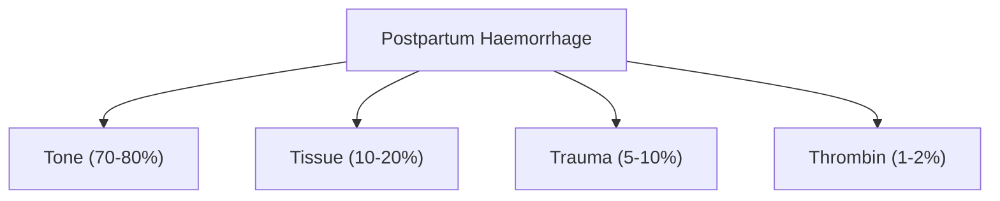
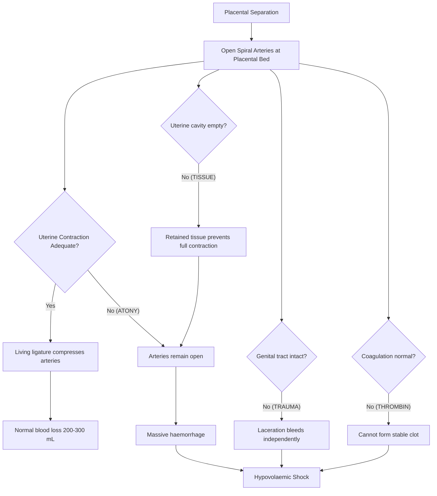

## Definition

Postpartum haemorrhage (PPH) — let's break the name down: "post" = after, "partum" = delivery/childbirth, "haemorrhage" = heavy bleeding. So it literally means heavy bleeding after childbirth.

***PPH is one of the major causes of direct maternal death worldwide.*** [1][2][3] In Hong Kong, maternal mortality from obstetric haemorrhage has dramatically fallen — ***17 women died from haemorrhage of pregnancy and childbirth in 1961; by 2000, only one woman died from this cause*** — but it remains a leading killer globally, particularly in resource-limited settings. [3][4]

### Formal Definition

The high-yield modern definition is unified across modes of delivery:

| Definition element | Threshold |
|---|---|
| ***Quantified blood loss*** | ***>= 1000 mL cumulative blood loss*** within 24 hours after delivery |
| ***Clinical trigger*** | ***Signs or symptoms of hypovolemia*** within 24 hours after delivery, even if measured blood loss is below the numeric threshold |

[1][2][3]

> Some lecture/source notes still use the older practical trigger of > 500 mL after vaginal delivery or Caesarean section to encourage early recognition. The SketchEase memory palace uses the >= 1000 mL or hypovolemia definition; in practice, treat the patient, not the number.

<Callout title="Clinical Pearl" type="idea">
***For clinical purposes, even if the estimated blood loss is below the numeric threshold, treatment should be initiated if the patient has symptoms or signs of shock.*** [3][4] Accurate estimation of blood loss is notoriously difficult — visual estimation consistently underestimates true loss by 30–50%. Always treat the patient, not the number.
</Callout>

### Classification by Timing

| Type | Timing | Proportion |
|---|---|---|
| ***Primary PPH*** | ***Within 24 hours of delivery*** | ***~90% of all PPH*** |
| ***Secondary PPH*** | ***> 24 hours after delivery*** (up to 6–12 weeks postpartum) | ~10% |

[1][2][3][4]

***Primary PPH is often torrential and can cause shock and death within a short period of time.*** [3][4]

### Severity Grading (Useful for Triage)

| Grade | Blood Loss | Clinical Significance |
|---|---|---|
| Minor postpartum bleeding | 500–1000 mL | May be well-compensated in healthy women; monitor closely and treat if symptomatic |
| Major PPH | >= 1000 mL | Requires urgent intervention |
| Massive PPH | > 2000 mL *or* haemodynamic instability | Life-threatening; activate massive transfusion protocol |

<Callout title="Why do sources use different thresholds?">
Historically, a higher threshold (> 1000 mL) was used for CS because operative blood loss is generally greater at baseline (~500–700 mL for an uncomplicated CS vs ~200–300 mL for a normal vaginal delivery). Some teaching notes lowered the trigger to > 500 mL for any delivery to encourage earlier recognition. The modern SketchEase anchor is >= 1000 mL or hypovolemia, regardless of mode of delivery.
</Callout>

---

## Epidemiology

- **Global incidence**: Primary PPH complicates approximately 5–10% of all deliveries worldwide; severe PPH (> 1000 mL) occurs in 1–3%.
- **Maternal mortality**: PPH accounts for approximately 25–30% of all maternal deaths globally (WHO). The vast majority of these deaths are in sub-Saharan Africa and South Asia.
- **Hong Kong context**: With modern obstetric care, the case fatality rate is extremely low, but morbidity (ICU admission, massive transfusion, hysterectomy, Sheehan syndrome) remains clinically significant. The incidence of PPH in Hong Kong tertiary centres is approximately 5–8% depending on definition used.
- **Trend**: Rates of PPH are actually *increasing* in many developed countries over the past two decades — likely due to rising CS rates, increasing maternal age, rising rates of obesity, and more induced/augmented labours.

### Risk Factors

Risk factors essentially map onto the "4 T's" causes (discussed below in Aetiology), but let's lay them out as the lectures present them:

***Risk factors for PPH can be classified into:*** [1]
- ***Overdistension of uterus*** (multiple pregnancy, polyhydramnios, large-for-gestational-age baby > 3800 g)
- ***Insensitivity to oxytocin*** (***grand multiparity*** — defined as ***≥ 5 births (live or stillborn) at ≥ 20 weeks of gestation***; "great grand multiparity" defined as ***≥ 10 births***)
- ***Abnormal myometrium*** (***fibroid, previous surgery on uterus***)

[1][5]

Complete list of risk factors from the lectures:

| Risk Factor | Mechanism |
|---|---|
| ***Antepartum haemorrhage*** (placenta praevia, abruption) | Abnormal placentation / disrupted placental bed |
| ***Previous history of manual removal of placenta, PPH, precipitated labour, repeated suction evacuation*** | Scarred/damaged endometrium → abnormal placental attachment or poor contractility |
| ***Previous surgery on uterus (Caesarean section, myomectomy)*** | Scar tissue in myometrium impairs coordinated contraction; risk of placenta accreta spectrum at scar site |
| ***Grand multiparity*** | Myometrial fibres become less responsive to oxytocin after repeated stretching |
| ***Anaemia (Haemoglobin < 10 g/dL) at onset of labour*** | Poor physiological reserve; even modest blood loss causes decompensation |
| ***Large for gestational age baby (> 3800 g)*** | Overdistension of uterus → poor contraction after delivery |
| ***Multiple pregnancy*** | Overdistension + larger placental bed |
| ***Polyhydramnios*** | Overdistension of uterus |
| ***Induced or augmented labour*** | Oxytocin receptor desensitisation from prolonged exogenous oxytocin; also prolonged labour → uterine fatigue |
| ***Bleeding tendencies*** | Coagulopathy (inherited or acquired, e.g. vWD, thrombocytopenia, anticoagulant use) impairs haemostasis at placental site |
| ***Low-lying placenta*** | ***The placental bed is where the uterus is very vascular; since this is the lower part of the uterus, it does not contract very well → blood vessels are not controlled → massive bleeding*** |

[1][5]

Additional risk factors to be aware of (not on lecture slide but clinically important):
- **Prolonged labour** (uterine fatigue)
- **Chorioamnionitis / intra-amniotic infection** (endotoxins impair myometrial contractility)
- **Retained placenta / placenta accreta spectrum** (especially with prior CS)
- **Obesity** (BMI > 35) — poor uterine tone, difficult bimanual compression
- **Advanced maternal age** (> 35 years)
- **Asian ethnicity** — some studies suggest higher baseline risk, though data are mixed
- **Use of tocolytics** (e.g., MgSO₄ for pre-eclampsia → relaxes myometrium)
- **General anaesthesia** (volatile agents like sevoflurane cause uterine relaxation)

<Callout title="High Yield Exam Point">
***Upper segment of the uterus is the main contraction force → hence a low segment Caesarean section (LSCS) is NOT a contraindication for future vaginal delivery, whereas high segment (classical CS) has ~10% rupture risk for subsequent vaginal delivery.*** [1] This is because the lower segment is relatively passive and thin — a scar here does not significantly weaken the contractile upper segment.
</Callout>

---

## Anatomy and Physiology of Uterine Haemostasis

Understanding *why* the uterus normally stops bleeding after placental separation is critical — because PPH occurs when any step in this process fails.

### The Uterine Blood Supply

- The uterus is supplied by the **uterine arteries** (branches of the internal iliac arteries) and has collateral supply from the **ovarian arteries**.
- During pregnancy, the uterine arteries undergo massive remodelling: the spiral arteries in the decidua are invaded by trophoblast, losing their smooth muscle layer and becoming wide, low-resistance conduits → this allows the massive blood flow needed to support the placenta (~500–700 mL/min at term, which is about 15–20% of cardiac output).
- ***The branches of the mother's blood vessels supplying the placenta implantation site course through the uterine muscles.*** [3][4]

### Normal Mechanism of Haemostasis After Delivery (The "Living Ligature")

***After delivery of the baby, the uterus decreases rapidly in size and this causes the separation of the placenta from the uterus.*** [3][4]

1. **Placental separation**: As the uterus contracts after delivery of the baby, the placental bed surface area shrinks dramatically. Since the placenta cannot shrink (it's a fixed-size disc), shearing forces at the decidua basalis cause it to separate.

2. **Exposure of raw placental bed**: ***The raw area left by the placenta in the uterus is very vascular and the bleeding from this area is heavy.*** [3][4] The opened spiral arteries at the placental site are essentially "bare pipes" that would bleed freely.

3. **Myometrial contraction — the "living ligature"**: ***In normal situations, the uterus rapidly contracts. Strong contraction of these muscles will occlude these vessels and the normal amount of bleeding from the uterus is around 200 to 300 mL.*** [3][4]
   - The myometrium is uniquely structured with a criss-cross lattice of smooth muscle fibres (the "figure-of-eight" arrangement, particularly in the **upper uterine segment**). When these fibres contract, they physically compress and kink the spiral arteries running between them — acting like a biological tourniquet.
   - This is why the ***upper segment of the uterus is the main contraction force***. [1]

4. **Coagulation cascade**: Simultaneously, the normal clotting cascade activates at the placental site — platelet plugs and fibrin mesh seal the torn vessels. Pregnancy is a hypercoagulable state (↑ fibrinogen, ↑ factors VII, VIII, X, vWF) which facilitates this.

5. **Retraction**: Unlike contraction (which is temporary), retraction means the muscle fibres do not return to their original length — the uterus stays small, maintaining vessel occlusion.

<Callout title="The Three Pillars of Postpartum Haemostasis">
1. **Myometrial contraction** (the dominant mechanism — the "living ligature")
2. **Blood coagulation** at the placental bed
3. **Intact genital tract** (no tears/lacerations diverting blood loss)

PPH occurs when one or more of these pillars fails. The 4 T's classification maps directly onto these pillars.
</Callout>

### Why the Lower Segment Is Vulnerable

***The placental bed is where the uterus is very vascular. Since this is the lower part of the uterus, it does not contract very well → hence, the blood vessels are not controlled, resulting in massive bleeding.*** [1]

The lower uterine segment is:
- Thinner, with fewer muscle fibres
- Derived from the isthmus, which is not designed for powerful contraction
- Therefore, when the placenta implants in the lower segment (placenta praevia), the "living ligature" mechanism is much less effective → this is why placenta praevia is a major risk factor for PPH.

---

## Aetiology and Pathophysiology

### The "4 T's" — A Systematic Framework

***Differential diagnosis including the 4 T's — Tone, Tissue, Trauma, Thrombin.*** [1][2]

This mnemonic is the backbone of your approach to PPH. Each "T" represents a category of cause, and they are listed roughly in order of frequency:

---

### 1. TONE — Uterine Atony (~70–80% of PPH)

**"Atony"** = a (without) + tonos (tension/tone) → the uterus lacks muscle tone and fails to contract.

This is ***the single most common cause of PPH*** because, as we explained above, myometrial contraction is the dominant haemostatic mechanism.

#### Pathophysiology
When the myometrium fails to contract adequately after placental separation:
- The criss-cross muscle fibres do not compress the spiral arteries
- The "living ligature" is lost
- The open spiral arteries at the placental bed bleed freely — at a rate of up to 500–700 mL/min (the full uteroplacental blood flow!)
- This explains why uterine atony can cause **life-threatening haemorrhage within minutes**

#### Causes of Uterine Atony

| Mechanism | Specific Causes |
|---|---|
| ***Overdistension of uterus*** | ***Multiple pregnancy, polyhydramnios, macrosomia/LGA baby (> 3800 g)*** [1][5] — overstretched myometrial fibres cannot contract efficiently |
| Uterine fatigue | Prolonged labour, precipitate labour, induced/augmented labour (oxytocin receptor downregulation) |
| ***Insensitivity to oxytocin*** | ***Grand multiparity (≥ 5 births)*** [1] — repeated pregnancies → myometrial fibre replacement by connective tissue → less responsive to oxytocin |
| ***Abnormal myometrium*** | ***Fibroids (leiomyomata), previous surgery on uterus (CS scar, myomectomy scar)*** [1] — disrupt coordinated contraction |
| Infection | Chorioamnionitis — bacterial endotoxins directly inhibit myometrial smooth muscle contraction |
| Drug-induced relaxation | Tocolytics (MgSO₄, nifedipine, terbutaline), volatile anaesthetic agents (sevoflurane, halothane), nitroglycerine |
| Functional | Full bladder (prevents uterine contraction by displacement — always catheterise!) |

#### The Iatrogenic Cause — A Key Teaching Point

***When the whole placenta is attached to the uterus and has not yet separated, there is no bleeding and there is no hurry to deliver the placenta. If attempts are made to deliver the placenta e.g. by pulling on the umbilical cord before the placenta has separated, the placenta separates partially. This exposes part of the placental site while the uterus cannot contract well. This causes heavy bleeding.*** [3][4]

***Occasionally, the uterus comes out like a reversed pocket with the attached placenta (uterine inversion), again causing heavy bleeding.*** [3][4]

***Therefore, do not attempt to deliver a placenta which has not separated from the uterine wall yet if there is little bleeding.*** [3][4]

<Callout title="Critical Safety Point" type="error">
Never pull on the umbilical cord to force delivery of an unseparated placenta. This can cause:
1. **Partial placental separation** → exposed placental bed bleeds while the still-attached portion prevents uterine contraction → massive PPH
2. **Uterine inversion** → the fundus turns inside-out through the cervix → profound neurogenic shock (vagal stimulation) + haemorrhage

Both are obstetric emergencies. Signs that the placenta has separated include: uterus becomes firm and globular, a gush of blood, cord lengthening, and the uterus rises in the abdomen.
</Callout>

---

### 2. TISSUE — Retained Placental Tissue (~10–20% of PPH)

**Why does retained tissue cause PPH?** The uterus cannot fully contract if something is inside the cavity. Retained tissue acts as a "wedge" that prevents the myometrial walls from coapting — the "living ligature" is incomplete.

#### Types of Retained Tissue

| Type | Explanation |
|---|---|
| **Retained placental fragments** | Cotyledons or membranes left behind — most common "tissue" cause; always inspect the placenta after delivery for completeness |
| **Retained whole placenta** (> 30 minutes after delivery = "retained placenta") | The placenta has not separated or has separated but is trapped |
| **Succenturiate lobe** | An accessory lobe of the placenta connected by vessels through the membranes — easy to miss, as it is separate from the main disc |
| **Placenta accreta spectrum (PAS)** | Abnormally adherent placenta — trophoblast invades beyond the decidua basalis into the myometrium (accreta), through the myometrium (increta), or through the serosa (percreta). Cannot separate normally → massive haemorrhage when attempted |
| **Blood clots in the uterine cavity** | A large intrauterine clot can prevent contraction — evacuation of the clot restores tone |

#### Placenta Accreta Spectrum — An Increasingly Important Entity

- Rising incidence due to ↑ CS rates worldwide (including HK)
- The strongest risk factor is **placenta praevia overlying a previous CS scar** (the risk of PAS is ~3% with one prior CS + praevia, rising to ~60–70% with ≥3 prior CS + praevia)
- Pathophysiology: deficient decidua basalis at the CS scar → trophoblast has no "stop signal" and invades deeper into the myometrium
- Classification:
  - **Accreta** (78%): adherent to myometrium but does not invade
  - **Increta** (17%): invades into myometrium
  - **Percreta** (5%): penetrates through myometrium and serosa, may invade adjacent organs (bladder most commonly)

---

### 3. TRAUMA — Genital Tract Injury (~5–10% of PPH)

Any laceration or injury to the genital tract creates a bleeding source *independent* of uterine contraction. Even with a well-contracted uterus, a woman can bleed to death from an unrecognised cervical tear.

| Type | Mechanism / Risk Factors |
|---|---|
| **Vaginal / perineal tears** | Especially 3rd/4th degree tears; instrumental delivery (forceps > vacuum), macrosomia, precipitate delivery |
| **Cervical tears** | Rapid cervical dilatation, instrumental delivery, pushing before full dilatation |
| **Uterine rupture** | ***Previous surgery on uterus (especially classical/high-segment CS — 10% rupture risk in subsequent vaginal delivery)*** [1]; obstructed labour; excessive oxytocin use; grand multiparity |
| **Uterine inversion** | Excessive cord traction on an unseparated placenta (iatrogenic); fundal placentation; short cord |
| **Episiotomy / surgical site bleeding** | Especially if extension occurs during delivery |
| **Broad ligament haematoma** | Concealed bleeding — may present with shock without visible blood loss |

---

### 4. THROMBIN — Coagulopathy (~1–2% of PPH, but often complicates the other T's)

**"Thrombin"** here is a catch-all for clotting disorders. Even if the uterus is well-contracted and the tract intact, failure to form stable clot leads to ongoing oozing.

Coagulopathy in PPH can be:

**A. Pre-existing (before delivery):**
- Inherited bleeding disorders: von Willebrand disease (most common inherited bleeding disorder — prevalence ~1%), haemophilia A carrier, platelet function disorders
- Acquired: thrombocytopenia (ITP, gestational thrombocytopenia), anticoagulant therapy, liver disease
- ***Bleeding tendencies*** [5]

**B. Acquired during/after delivery:**
- **Disseminated intravascular coagulation (DIC)** — the most feared coagulopathy in obstetrics
  - Obstetric causes of DIC (from senior notes [6][7]):
    - ***Amniotic fluid embolism*** (triggers massive coagulation cascade activation)
    - ***Abruptio placentae*** (retroplacental blood releases tissue factor)
    - ***Eclampsia / HELLP syndrome*** (endothelial damage)
    - ***Septic abortion / chorioamnionitis***
    - ***Intrauterine fetal death*** (retained dead fetus releases tissue factor over days–weeks)
  - Pathophysiology of DIC [6][7]: release of procoagulant materials (especially tissue factor) into the maternal circulation → widespread intravascular thrombosis → consumption of platelets and clotting factors ("consumption coagulopathy") + secondary fibrinolysis → paradoxical bleeding
  - Lab features of acute DIC: ↓ platelets, ↑ PT, ↑ aPTT, ↓ fibrinogen, ↑ D-dimer, schistocytes on PBS (MAHA)
- **Dilutional coagulopathy** — from massive fluid resuscitation without blood products; fibrinogen is the first factor to reach critically low levels
- **Massive transfusion-related coagulopathy** — stored packed RBCs contain no functional platelets or clotting factors; transfusing large volumes without FFP/cryoprecipitate → coagulopathy

<Callout title="Why Is Fibrinogen So Important in PPH?">
Fibrinogen (Factor I) is the substrate for fibrin clot formation. In pregnancy, fibrinogen levels are physiologically elevated (~4–6 g/L vs normal 2–4 g/L). During PPH, fibrinogen is consumed rapidly. A fibrinogen level < 2 g/L during PPH is a strong predictor of progression to severe haemorrhage. This is why early cryoprecipitate or fibrinogen concentrate is critical.
</Callout>

---

### Aetiology Summary Table

| "T" | Cause | Frequency | Primary Mechanism |
|---|---|---|---|
| ***Tone*** | Uterine atony | ***~70–80%*** | Failure of myometrial contraction → spiral arteries remain open |
| ***Tissue*** | Retained products | ***~10–20%*** | Prevents uterine wall coaptation; retained tissue = wedge preventing full contraction |
| ***Trauma*** | Genital tract injury | ***~5–10%*** | Direct vascular injury independent of uterine tone |
| ***Thrombin*** | Coagulopathy | ***~1–2%*** | Failure to form/maintain stable clot at placental bed or injury site |

> Multiple T's often coexist — e.g., prolonged atony → massive blood loss → dilutional coagulopathy → DIC → further bleeding. Always systematically assess ALL four T's.

---

## Classification

### By Timing (as above)
- **Primary PPH**: within 24 hours (90% of cases)
- **Secondary PPH**: > 24 hours to 6–12 weeks postpartum
  - Causes differ: most commonly endometritis, retained products of conception, subinvolution of placental site, rarely choriocarcinoma

### By Severity
| Category | Blood Loss | Notes |
|---|---|---|
| Minor | 500–1000 mL | Monitor closely; may not need transfusion in healthy women |
| Major (non-massive) | 1000–2000 mL | Activate PPH protocol |
| Major (massive/life-threatening) | > 2000 mL or rate > 150 mL/min, or haemodynamic instability despite resuscitation | Activate massive transfusion protocol; multidisciplinary team |

### By Cause (4 T's)
As detailed above: Tone, Tissue, Trauma, Thrombin.

---

## Clinical Features

This section covers what you will **see and hear** at the bedside. I'll separate symptoms (what the patient tells you) from signs (what you find on examination), with pathophysiological explanations inline.

### Symptoms

| Symptom | Pathophysiological Basis |
|---|---|
| **Heavy vaginal bleeding** (the cardinal symptom) | Direct blood loss from the uterine placental site (atony, retained tissue) or from genital tract lacerations |
| **Passage of blood clots** | When blood pools in the uterus/vagina, it clots; passage of large clots suggests significant ongoing haemorrhage |
| **Dizziness / lightheadedness** | ↓ circulating volume → ↓ cerebral perfusion → pre-syncope |
| **Feeling faint / wanting to lie down** | Baroreceptor-mediated; the body compensates by wanting to assume a supine position to improve venous return |
| **Palpitations** | Sympathetic activation → tachycardia to maintain cardiac output despite ↓ preload |
| **Breathlessness** | ↓ oxygen-carrying capacity (anaemia) + metabolic acidosis from tissue hypoperfusion → stimulates respiratory centre |
| **Anxiety / "sense of doom"** | Catecholamine surge; also seen in amniotic fluid embolism |
| **Abdominal pain** (suggests specific cause) | Uterine rupture → sudden severe pain; inverted uterus → acute lower abdominal pain; abruptio placentae → constant, tender uterus |
| **Urge to push / feeling of "something coming down"** | Uterine inversion → the inverted fundus descends through the cervix into the vagina → sensation of a mass |
| May be **asymptomatic initially** in young healthy women | Young women have excellent cardiovascular reserve; they may lose 1000–1500 mL before showing obvious haemodynamic compromise — then decompensate suddenly |

<Callout title="Beware the 'Well-Compensated' Young Woman" type="error">
A healthy 25-year-old parturient can maintain a normal blood pressure despite losing 15–20% of blood volume (~1000–1500 mL in a pregnant woman with expanded blood volume of ~6–7L). The first sign may be subtle tachycardia. Do NOT wait for hypotension — by the time she is hypotensive, she has lost > 30–40% of her blood volume and is in Class III/IV shock.
</Callout>

### Signs

#### A. General / Systemic Signs (Reflecting Hypovolaemia)

These signs correlate with the **classification of haemorrhagic shock** [8]:

| Class | Blood Loss | Heart Rate | BP | Other Signs |
|---|---|---|---|---|
| I | < 750 mL (< 15%) | Normal or mildly ↑ | Normal | Minimal symptoms |
| II | 750–1500 mL (15–30%) | 100–120 | Normal (maintained by ↑ SVR) | Anxiety, delayed cap refill, pallor |
| III | 1500–2000 mL (30–40%) | 120–140 | ↓ Systolic | Confusion, marked tachycardia, ↓ urine output, cold clammy skin |
| IV | > 2000 mL (> 40%) | > 140 or bradycardia (preterminal) | Severe ↓ | Obtunded, anuria, imminent cardiac arrest |

Specific signs of hypovolaemia [8]:
- **Tachycardia**: earliest compensatory sign — sympathetic activation → ↑ HR to maintain cardiac output (CO = HR × SV)
- **Hypotension**: late sign — means compensatory mechanisms are overwhelmed
- **Pallor**: sympathetic vasoconstriction shunts blood from skin to vital organs
- **Cold, clammy extremities**: peripheral vasoconstriction + sweating from sympathetic activation
- **Delayed capillary refill (> 2 seconds)**: poor peripheral perfusion
- **Collapsed / empty peripheral veins**: ↓ circulating volume
- **Oliguria (< 0.5 mL/kg/hr)**: renal hypoperfusion → ↓ GFR → ↓ urine output
- **Altered mental status**: confusion → drowsiness → unconsciousness as cerebral perfusion falls
- **Tachypnoea**: metabolic acidosis (lactic acid from anaerobic tissue metabolism) → respiratory compensation

#### B. Abdominal / Uterine Signs

| Sign | What It Tells You | Pathophysiology |
|---|---|---|
| **Soft, "boggy," enlarged uterus** (above the umbilicus) | ***Uterine atony*** — the #1 cause | The uterus has not contracted; it is distended with blood. Normally, the postpartum uterus should be firm, globular, and at or below the umbilicus. A boggy uterus = the "living ligature" is not working. |
| **Firm, well-contracted uterus** but still bleeding | The bleeding source is NOT atony → think **Trauma** or **Thrombin** | If the uterus is hard and contracted, the spiral arteries should be compressed. Ongoing bleeding must come from a genital tract laceration or coagulopathy. |
| **Uterine fundal height rising** | Blood is collecting inside the uterus (concealed haemorrhage) | The uterus fills with clot and blood; it may appear to contract but is actually distending |
| **Tender, rigid uterus** (Couvelaire uterus) | Placental abruption | Retroplacental haemorrhage infiltrates the myometrium → woody hard uterus that does not relax between contractions |
| **Uterus not palpable abdominally + mass in vagina** | ***Uterine inversion*** | The fundus has inverted through the cervix; the "dimple sign" (absent fundus on abdominal palpation) is pathognomonic |

#### C. Vaginal / Perineal Examination Signs

| Sign | Significance |
|---|---|
| **Continuous bright-red bleeding despite a well-contracted uterus** | Genital tract trauma (cervical/vaginal tear) — must examine under adequate light and analgesia |
| **Visible perineal / vaginal tear** | Trauma — classify degree (1st–4th) |
| **Cervical tear** (seen on speculum examination) | Often at 3 or 9 o'clock position; can extend into the lower uterine segment |
| **Foul-smelling discharge, fever** (in secondary PPH) | Endometritis / retained infected products |
| **Non-clotting blood** | Coagulopathy — blood that oozes and doesn't form clots at IV sites, wound edges, or from the vagina suggests DIC or severe hypofibrinogenaemia |

#### D. Signs Specific to Certain Causes

| Cause | Specific Signs |
|---|---|
| **Amniotic fluid embolism** | Sudden cardiovascular collapse, respiratory distress, DIC, seizures — often during or shortly after delivery; extremely high mortality |
| **Uterine rupture** | Sudden severe abdominal pain, loss of fetal station, cessation of contractions, easily palpable fetal parts abdominally, haematuria (if bladder involved) |
| **Uterine inversion** | Neurogenic shock (vagal — bradycardia + hypotension out of proportion to blood loss), mass protruding from vagina, fundus not palpable abdominally |
| **DIC** | Oozing from IV sites, bruising, petechiae, haematuria, non-clotting blood |
| **Broad ligament haematoma** | Shock with minimal visible blood loss ("concealed haemorrhage"), unilateral pelvic mass, lateral deviation of uterus |

<Callout title="Concealed vs Revealed Haemorrhage" type="error">
Not all PPH is visible. Blood can collect in:
- The uterus (atony with cervical/lower segment clot obstruction)
- The broad ligament (haematoma)
- The peritoneal cavity (uterine rupture)

Always correlate the **degree of shock** with the **visible blood loss**. If the patient looks worse than the blood loss suggests → think **concealed haemorrhage**.
</Callout>

---

## Summary of Pathophysiology → Clinical Feature Connections

---

<Callout title="High Yield Summary">

**Definition**: ***PPH = blood loss >= 1000 mL or signs/symptoms of hypovolemia within 24 hours after delivery, regardless of mode of delivery. Treat if symptomatic/shocked regardless of measured loss.*** [1][2][3]

**Classification**: ***Primary (within 24 hours, 90% of cases) vs Secondary (> 24 hours).*** [1][2]

**Aetiology — 4 T's** (in order of frequency): ***Tone (~70–80%), Tissue (~10–20%), Trauma (~5–10%), Thrombin (~1–2%).*** [1][2]

**Key Mechanism**: The "living ligature" — criss-cross myometrial fibres compress spiral arteries at the placental bed. Failure of this mechanism (uterine atony) is the #1 cause of PPH.

**Risk Factors**: Overdistension (multiple pregnancy, polyhydramnios, macrosomia), grand multiparity, abnormal myometrium (fibroids, previous uterine surgery), induced/augmented labour, low-lying placenta, bleeding tendencies, anaemia, antepartum haemorrhage.

***The upper segment is the main contractile force; low-segment CS does NOT contraindicate future vaginal delivery; classical CS carries ~10% rupture risk.*** [1]

***Never pull on the umbilical cord of an unseparated placenta — causes partial separation (PPH) or uterine inversion.*** [3][4]

**Clinical Features**: Boggy, atonic uterus → atony; firm uterus + continued bleeding → trauma or coagulopathy; non-clotting blood → DIC/thrombin; absent fundus + vaginal mass → uterine inversion. Beware concealed haemorrhage and the "well-compensated" young woman who decompensates suddenly.

</Callout>

---

<ActiveRecallQuiz
  title="Active Recall - Postpartum Haemorrhage (Definition, Epidemiology, Aetiology, Clinical Features)"
  items={[
    {
      question: "What is the updated definition of PPH? How should you act if the measured loss is below the threshold but the patient is shocked?",
      markscheme: "PPH is blood loss >= 1000 mL or signs/symptoms of hypovolemia within 24 hours after delivery, regardless of mode of delivery. Treat immediately if symptomatic or shocked regardless of measured loss because visual estimation underestimates true bleeding."
    },
    {
      question: "Name the 4 T's of PPH aetiology in order of frequency. Which is the most common and why?",
      markscheme: "Tone (70-80%), Tissue (10-20%), Trauma (5-10%), Thrombin (1-2%). Tone (uterine atony) is most common because myometrial contraction (the 'living ligature') is the dominant haemostatic mechanism after placental separation — failure means open spiral arteries bleed freely."
    },
    {
      question: "Explain the 'living ligature' mechanism. Why is the lower uterine segment more vulnerable to PPH?",
      markscheme: "Spiral arteries course through criss-cross myometrial fibres. When myometrium contracts, fibres compress these arteries, stopping bleeding. The lower segment has fewer muscle fibres, is thinner, and contracts poorly — so a low-lying placenta bleeds heavily because the vessels at the placental bed are not adequately compressed."
    },
    {
      question: "Why should you never pull on the umbilical cord before placental separation? What two complications can result?",
      markscheme: "Pulling before separation causes: (1) Partial placental separation — exposes raw placental bed while still-attached portion prevents uterine contraction, causing massive bleeding; (2) Uterine inversion — fundus inverts through cervix like a reversed pocket, causing neurogenic shock and haemorrhage."
    },
    {
      question: "A patient has ongoing bright red vaginal bleeding after delivery but the uterus is well-contracted and firm. What are the most likely causes?",
      markscheme: "If uterus is firm (atony excluded), think Trauma (cervical tear, vaginal laceration, perineal tear) or Thrombin (coagulopathy/DIC). Must perform speculum examination to inspect cervix and vagina. Check bloods for coagulopathy (CBC, PT, aPTT, fibrinogen, D-dimer)."
    },
    {
      question: "List 5 risk factors for uterine atony and explain the mechanism for each.",
      markscheme: "Any 5 of: (1) Overdistension (twins, polyhydramnios, macrosomia) — overstretched fibres cannot contract; (2) Grand multiparity — myometrium replaced by connective tissue, less responsive to oxytocin; (3) Prolonged/augmented labour — uterine fatigue and oxytocin receptor downregulation; (4) Chorioamnionitis — endotoxins inhibit myometrial contraction; (5) Fibroids — disrupt coordinated contraction; (6) MgSO4/volatile anaesthetics — pharmacological uterine relaxation; (7) Full bladder — mechanical displacement preventing contraction."
    }
  ]}
/>

---

## References

[1] Lecture slides: Block C - Postpartum Haemorrhage.pdf (definition, risk factors, 4T classification, summary)
[2] Lecture slides: PPH for teaching (20210716)v6.pdf (definition, risk factors, summary)
[3] Lecture slides: Block C - Obstetric Emergency Notes to Students.pdf (introduction, definition, causes of primary PPH, iatrogenic causes)
[4] Lecture slides: GCBC-OG-Obs emergency_Notes to students_Sep2024.pdf (introduction, definition, causes of primary PPH, iatrogenic causes)
[5] Lecture slides: PPH for teaching (20210716)v6.pdf p6 (risk factor list)
[6] Senior notes: Maksim Medicine Notes.pdf p165 (DIC pathophysiology, obstetric causes, lab features)
[7] Senior notes: Ryan Ho Haemtology.pdf p136–138 (DIC causes, pathogenesis, acute vs chronic DIC, management)
[8] Senior notes: Ryan Ho Critical Care.pdf p21 (hypovolaemic shock causes, clinical features, management)
