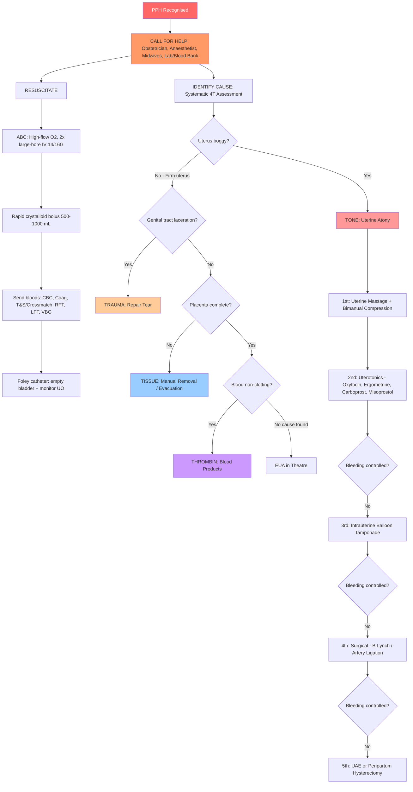
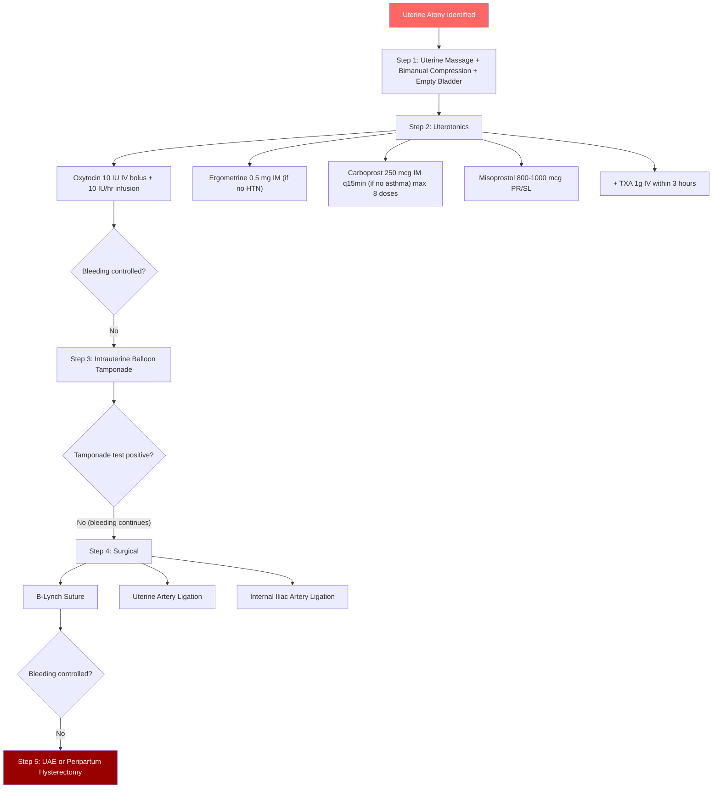

## Management of Postpartum Haemorrhage

### The Overarching Framework

***The management of PPH follows 4 major principles:*** [5][6]

1. ***Communication with all relevant professionals***
2. ***Resuscitation***
3. ***Monitoring and investigation***
4. ***Arresting the bleeding***

***Similar to the management of heavy bleeding elsewhere, the principles are to replace the blood loss to reverse or prevent shock while efforts are made to identify and stop the source of bleeding.*** [5][6]

The lecture notes draw an explicit analogy: ***Compare and contrast the management of severe haemorrhage in general, bleeding oesophageal varices versus primary PPH to see if the same principles apply. These include tension, pressure, balloon, medication, embolization and surgery.*** [5][6]

This is a brilliant teaching point. Whether it's a bleeding varix, a trauma patient, or a postpartum uterus, the management toolkit is the same: compress it (pressure/tamponade), constrict it (medication), block it (embolisation), or cut/remove it (surgery).

---

### Master Management Algorithm

---

### Principle 1: Communication — The Team Approach

PPH is a **team sport**. A single doctor cannot manage it alone. The moment PPH is recognised:

| Who to Call | Why |
|---|---|
| **Senior obstetrician / MO on call** | Decision-making for surgical intervention; ***the exam answer to "who to call first when you're an intern suspecting retained placenta" is the Medical Officer*** [7] |
| **Anaesthetist** | Airway management, haemodynamic resuscitation, GA if needed for EUA/surgery, massive transfusion protocol activation |
| **Midwives / nursing staff** | IV access, drug administration, vital sign monitoring, uterine massage, blood loss quantification |
| **Laboratory / Blood bank** | Urgent crossmatch, release of emergency blood products, massive transfusion protocol |
| **Haematologist** | Guidance on blood product therapy if coagulopathy |
| **Interventional radiologist** | If uterine artery embolisation (UAE) anticipated |
| **Porters / extra hands** | Rapid transfer to OT if needed |

<Callout title="Communication is Examinable">
In OSCE/clinical test scenarios, failure to call for help early is marked down. The very first action when PPH is recognised should be calling for senior help, even before you start examining the patient. Delegate tasks — you cannot put in IV access, give drugs, examine the genital tract, and call blood bank simultaneously as one person.
</Callout>

---

### Principle 2: Resuscitation

This follows standard **hypovolaemic shock management** [8], adapted for the obstetric setting.

#### A. Airway and Breathing
- **High-flow oxygen** 15 L/min via non-rebreather mask with reservoir bag
- Why? Even before Hb drops significantly, tissue oxygen delivery is compromised by ↓ cardiac output from hypovolaemia. Supplemental O₂ maximises the oxygen-carrying capacity of the remaining circulating haemoglobin

#### B. Circulation — Volume Resuscitation

***Replacement of blood loss:*** [5][6]
1. ***Volume replacement (e.g., giving intravenous fluids) to maintain an effective circulation***
2. ***Red cell replacement (oxygen carriage)***
3. ***Blood components replacement (platelet and FFP) to correct coagulation defect***

| Step | Detail | Rationale |
|---|---|---|
| **2× large-bore IV access** (14G or 16G, antecubital fossa) [8] | Take bloods simultaneously: CBC, coagulation profile, group & crossmatch, RFT, LFT, VBG with lactate | Large-bore cannulae allow rapid infusion rates (flow ∝ r⁴ / length — Poiseuille's law: a 14G cannula delivers ~300 mL/min vs ~60 mL/min for a 20G) |
| **Rapid crystalloid bolus** 500–1000 mL over 5–10 min [8] | Warmed Hartmann's / Ringer's lactate preferred over normal saline (NS causes hyperchloraemic metabolic acidosis in large volumes) | Expands intravascular volume immediately; warm fluids prevent hypothermia (hypothermia impairs coagulation → the "lethal triad": hypothermia + acidosis + coagulopathy) |
| **Reassess q5min** → repeat bolus if not responding [8] | Target: SBP > 90 mmHg, HR < 100, UO > 0.5 mL/kg/hr, improving lactate | Up to 2L crystalloid; beyond this, you are diluting clotting factors → transition to blood products |
| **Foley catheter** | Empty bladder (a full bladder prevents uterine contraction!) + monitor UO hourly | Therapeutic (restores uterine tone) AND diagnostic (UO reflects renal perfusion = adequacy of resuscitation) |

#### C. Blood Product Transfusion

| Product | Trigger / Indication | Content & Dose | Mechanism |
|---|---|---|---|
| **Packed Red Blood Cells (pRBC)** | Hb < 7–8 g/dL OR ongoing massive haemorrhage regardless of Hb; use O-negative if crossmatch not available | 1 unit ≈ raises Hb by ~1 g/dL | Restores oxygen-carrying capacity — each gram of Hb carries 1.34 mL O₂ |
| **Fresh Frozen Plasma (FFP)** | PT/aPTT > 1.5× normal + active bleeding; massive transfusion protocol; DIC [12] | 2–4 units adult; 12–15 mL/kg [12]; contains ALL soluble plasma proteins and clotting factors | Replaces consumed/diluted clotting factors — fibrinogen, Factors II, V, VII, X, etc. |
| **Cryoprecipitate** | Fibrinogen < 2 g/L (critical threshold in obstetric haemorrhage) [12] | 10 units/dose for adults; 1 unit contains fibrinogen 150–300 mg + FVIII 80–120 U + vWF [12]; standard dose raises fibrinogen by ~1 g/L | Concentrated source of fibrinogen (much higher concentration per mL than FFP — gives more fibrinogen in less volume → less fluid overload) |
| **Platelet concentrate** | Platelets < 50 × 10⁹/L with active bleeding; < 75 × 10⁹/L if ongoing haemorrhage [12] | 1 adult therapeutic dose (pool of 4 units or 1 apheresis unit) | Replaces consumed platelets to enable primary haemostasis at the bleeding site |
| **Fibrinogen concentrate** (Riastap) | Alternative to cryoprecipitate for fibrinogen < 2 g/L; faster to prepare, no thawing needed | 2–4 g IV; dose-adjusted by ROTEM/Clauss fibrinogen | Purified fibrinogen — bypasses the volume and time limitations of cryoprecipitate |

##### Massive Transfusion Protocol (MTP)

When blood loss is > 2000 mL or ongoing at > 150 mL/min, or the patient is in Class III/IV shock:

- Activate MTP → blood bank releases products in **pre-set packs**
- **Ratio-based approach**: pRBC : FFP : Platelets = **1 : 1 : 1** (or 4:4:1 units) — this is based on trauma literature (PROPPR trial) extrapolated to obstetric haemorrhage
- **Monitor ionised Ca²⁺** and replace with **calcium gluconate 10 mL of 10% IV** — stored blood contains citrate anticoagulant which chelates Ca²⁺; hypocalcaemia impairs coagulation (Ca²⁺ = Factor IV) AND cardiac contractility
- **Keep patient warm** — use fluid warmers, forced-air warming blankets; hypothermia < 35°C worsens coagulopathy and reduces uterotonic effectiveness

<Callout title="The 'Lethal Triad' of Massive Haemorrhage" type="error">
**Hypothermia + Acidosis + Coagulopathy** form a vicious cycle:
- Hypothermia → slows enzymatic clotting cascade → coagulopathy → more bleeding
- Acidosis (from lactic acid due to hypoperfusion) → impairs clotting factor function
- Coagulopathy → more bleeding → more shock → more acidosis and hypothermia

All three must be actively corrected simultaneously. This is why warm fluids, active warming, aggressive correction of acidosis (via perfusion restoration), and early blood products are critical.
</Callout>

#### D. Tranexamic Acid (TXA)

- **"Trans" = across; "examic" = from amino + hexanoic acid** — it's a synthetic lysine analogue
- **Mechanism**: competitively blocks the lysine-binding sites on plasminogen, preventing plasmin from binding to and degrading fibrin → **anti-fibrinolytic** → stabilises existing clots
- **WOMAN Trial (2017)**: landmark RCT showing TXA 1g IV given within 3 hours of PPH onset reduces death from bleeding (OR 0.81) with no increase in thrombotic events
- **Dose**: **1g IV over 10 minutes, as soon as possible, ideally within 3 hours of delivery**; can repeat a second 1g dose if bleeding continues after 30 minutes
- **Key point**: TXA does NOT cause uterine contraction — it is an **adjunct** to uterotonics, not a replacement

> ***The exam question specifically tests this: for uterine atony, the answer is "Uterotonic agent" (D), NOT tranexamic acid (C), NOT blood transfusion (A).*** [7] TXA supports haemostasis but does not treat the underlying cause of atony.

<Callout title="TXA in PPH — Timing Is Everything" type="idea">
The benefit of TXA diminishes rapidly after 3 hours. The WOMAN trial showed no benefit when given > 3 hours after PPH onset. In practice, give TXA **early** alongside uterotonics — don't wait for the coagulation results to come back. It is safe, cheap, and widely available.
</Callout>

---

### Principle 3: Monitoring and Investigation

***This should be monitored with blood pressure, pulse rate, urine output, central venous pressure, laboratory haematology tests.*** [5][6]

| Parameter | Frequency | Target |
|---|---|---|
| BP, HR, SpO₂ | q5 min during active bleeding, q15 min once stable | SBP > 90, HR < 100, SpO₂ > 95% |
| Urine output | Hourly (Foley in situ) | > 0.5 mL/kg/hr |
| Temperature | q30 min | > 36°C (prevent hypothermia) |
| CBC, Coag profile, fibrinogen | q30–60 min during active management | Hb > 8, Plt > 50, fibrinogen > 2 g/L, PT/aPTT < 1.5× |
| VBG with lactate | q30–60 min | Lactate < 2, pH > 7.35, BE > −6 |
| Ionised Ca²⁺ | With each VBG (especially during massive transfusion) | iCa > 1.0 mmol/L |
| ROTEM/TEG | If available: q30 min during active haemorrhage | Guides targeted blood product therapy |

---

### Principle 4: Arresting the Bleeding — Cause-Specific Treatment

This is the core of PPH management. Treatment is directed by the identified cause (4 T's).

---

#### A. Management of TONE — Uterine Atony (The Stepwise Escalation)

This is the most common cause and the one with the most detailed management pathway. The approach is **stepwise escalation**: simple and conservative measures first → escalating to progressively more invasive interventions if bleeding persists.

##### Step 1: First-Line Mechanical Measures

| Intervention | Technique | Why It Works |
|---|---|---|
| **"Rub up" the fundus / Uterine massage** | Place one hand on the abdominal surface over the fundus and massage firmly in a circular motion | Direct mechanical stimulation of the myometrium triggers reflex contraction; also expels clots from the cavity that may be preventing contraction |
| **Bimanual uterine compression** | One hand inside the vagina (fist in the anterior fornix pushing the uterus anteriorly), other hand on the abdomen compressing the fundus posteriorly → the uterus is "sandwiched" between two hands | Directly compresses the uterine body → physically occludes the spiral arteries (mimicking the "living ligature" externally) while uterotonics take effect; buys time |
| **Empty the bladder** (Foley catheter) | Insert urinary catheter | A distended bladder displaces the uterus and prevents effective contraction — this simple act alone may restore tone |

##### Step 2: Pharmacological — Uterotonic Agents

This is **the most high-yield section for exams**. The lecture Appendix I provides the exact dosing regimens used at QMH/HKU:

###### a) Prevention of PPH (Active Management of 3rd Stage)

***For prevention of primary postpartum haemorrhage:*** [9][10]

***a) At low risk of developing postpartum haemorrhage:*** [9][10]
- ***(i) Syntometrine® 1 mL (ergometrine 0.5 mg and oxytocin 5 units) IMI after delivery of fetal head***
- ***(ii) Use oxytocin instead if Syntometrine® is contraindicated (hypertension, heart disease)***

***b) At high risk of postpartum haemorrhage:*** [9][10]
- ***(i) Oxytocin 5 units IVI after delivery of fetal shoulder, followed by IV infusion of oxytocin 40 units in 500 mL of normal saline over 4 hours***
- ***(ii) Carbetocin 100 micrograms IV bolus for Caesarean section with high risk for PPH***

###### b) Treatment of PPH Due to Uterine Atony

***For treatment of primary postpartum haemorrhage due to uterine atony:*** [9][10]
- ***(i) Oxytocin 10 units IVI followed by infusion 10 units per hour***
- ***(ii) Carboprost (a prostaglandin) 250 micrograms IMI, can be repeated at 15 minutes later, up to maximum of 2 mg (8 doses)***
- ***(iii) Misoprostol 800–1000 micrograms per rectal or sublingual***

Now let me explain each drug from first principles:

| Drug | Class | Mechanism | Dose & Route | Contraindications | Side Effects |
|---|---|---|---|---|---|
| **Oxytocin** (Syntocinon) | Synthetic oxytocin analogue | Binds oxytocin receptors on myometrial smooth muscle → ↑ intracellular Ca²⁺ → muscle contraction. "Oxy" = quick/sharp, "tocin" = relating to birth | ***Prevention***: 5 IU IVI; ***Treatment***: **10 IU IVI bolus** → **10 IU/hr infusion** [9][10] | Few absolute CIs; caution with rapid IV bolus in cardiac disease (transient hypotension, tachycardia from vasodilation) | Water retention (ADH-like effect at high doses) → hyponatraemia; hypotension (especially with rapid IV bolus) |
| **Ergometrine** (Methergin) | Ergot alkaloid | Acts on smooth muscle α-adrenergic AND serotonin receptors → sustained tonic uterine contraction (not rhythmic like oxytocin) | 0.25–0.5 mg IM or slow IV | ***Contraindicated in HYPERTENSION, pre-eclampsia, heart disease*** [9][10] — causes systemic vasoconstriction → dangerously ↑ BP; also CI in Raynaud's, peripheral vascular disease | Nausea/vomiting (5-HT effect), hypertension, vasospasm, rarely coronary artery spasm |
| **Syntometrine®** | Combination: ergometrine 0.5 mg + oxytocin 5 IU | Combines the rapid onset of oxytocin (2–3 min) with the sustained action of ergometrine (up to 2–3 hours) → quick AND prolonged contraction | ***1 mL IMI after delivery of fetal head*** [9][10] | Same CIs as ergometrine: ***hypertension, heart disease*** [9][10] | Same as ergometrine |
| **Carboprost** (Hemabate, 15-methyl PGF₂α) | Prostaglandin F₂α analogue | Potent stimulator of myometrial contraction via PGF₂α receptors → ↑ intracellular Ca²⁺; also causes bronchospasm and GI smooth muscle contraction | ***250 μg IMI; can repeat q15 min; max 2 mg (= 8 doses)*** [9][10] | **Asthma** (causes bronchospasm — PGF₂α contracts bronchial smooth muscle); active cardiac, pulmonary, renal, or hepatic disease | Diarrhoea, vomiting, bronchospasm, fever, hypertension |
| **Misoprostol** (Cytotec, PGE₁ analogue) | Prostaglandin E₁ analogue | Binds EP receptors on myometrium → stimulates contraction; also softens cervix | ***800–1000 μg per rectal or sublingual*** [9][10] | Few absolute CIs; generally safe in asthma (PGE₁ is bronchodilatory, unlike PGF₂α) | Diarrhoea, fever/shivering (dose-related thermoregulatory effect), nausea |
| **Carbetocin** (Pabal) | Long-acting oxytocin analogue | Same mechanism as oxytocin but with longer half-life (~40 min vs ~3 min for oxytocin) → sustained contraction from single dose | ***100 μg IV bolus; used for CS with high risk for PPH*** [9][10] | Same cautions as oxytocin (cardiac disease) | Similar to oxytocin but generally better tolerated |

<Callout title="Key Contraindication Pair for Exams">
- **Ergometrine / Syntometrine® → Contraindicated in HYPERTENSION and HEART DISEASE** (causes vasoconstriction → ↑ BP → stroke / MI risk)
- **Carboprost → Contraindicated in ASTHMA** (PGF₂α causes bronchospasm)
- **Misoprostol → Safe in asthma** (PGE₁ is actually a bronchodilator)

These are among the most commonly tested contraindications in O&G exams.
</Callout>

##### Step 3: Intrauterine Balloon Tamponade (UBT)

If uterotonics fail to control atony:

- **What**: A balloon (Bakri balloon, Sengstaken-Blakemore tube, or condom catheter) is inserted into the uterine cavity and inflated with 300–500 mL warm saline
- **Mechanism**: Direct mechanical compression of the uterine walls → compresses the open spiral arteries at the placental bed from the inside; same principle as a Sengstaken tube for oesophageal varices or nasal packing for epistaxis — ***tension, pressure, balloon*** [5][6]
- **Why it's placed before surgery**: It's less invasive, buys time, can be performed at the bedside/labour ward, and is effective in ~80% of atony cases; it serves as a "tamponade test" — if bleeding stops, surgery can be avoided
- **Monitoring**: A drain catheter below the balloon allows ongoing blood loss to be measured — if > 200 mL/hr drains, the tamponade has failed → proceed to surgery
- **Remove**: Usually after 12–24 hours once haemostasis is established; deflate gradually

##### Step 4: Surgical Interventions (If Medical and Tamponade Fail)

These are performed via **laparotomy**:

| Procedure | Description | Mechanism | When to Use |
|---|---|---|---|
| **B-Lynch suture** (uterine compression suture) | A continuous suture is placed around the uterus in a "braces" (suspender) pattern, compressing the anterior and posterior walls together | Mechanically compresses the uterine walls → closes the uterine cavity → compresses spiral arteries (same principle as bimanual compression, but surgical and sustained) | First-line surgical option for atony unresponsive to uterotonics and tamponade; preserves fertility |
| **Uterine artery ligation** (bilateral) | Surgical ligation of the ascending branches of the uterine arteries at the level of the lower uterine segment | ↓ arterial inflow to the uterus → ↓ pulse pressure at the placental bed → promotes haemostasis; collateral supply from ovarian arteries maintains uterine viability | If B-Lynch insufficient; can be combined with B-Lynch; preserves fertility |
| **Internal iliac artery ligation** (bilateral) | Surgical ligation of the anterior division of the internal iliac arteries | Reduces pulse pressure to the pelvis by ~85% → converts arterial flow to venous-type flow → promotes clot formation; does NOT fully stop blood flow (extensive collaterals exist) | Technically demanding; requires surgical expertise; may be attempted before hysterectomy |
| **Hysterectomy** (subtotal or total) | Removal of the uterus — the definitive, last-resort procedure | Removes the bleeding source entirely | ***When all other measures have failed; placenta accreta spectrum with uncontrollable bleeding; uterine rupture not amenable to repair.*** This is the "nuclear option" — it ends future fertility but saves the mother's life |

<Callout title="Fertility-Preserving Approach">
The stepwise escalation is designed to exhaust all fertility-preserving options before proceeding to hysterectomy. B-Lynch sutures, artery ligations, and even balloon tamponade all allow future pregnancies. Hysterectomy is performed ONLY when the mother's life is at immediate risk and all other measures have failed. Never delay a life-saving hysterectomy for the sake of preserving fertility.
</Callout>

##### Step 5: Interventional Radiology — Uterine Artery Embolisation (UAE)

***Uterine artery embolization (UAE) for post-partum haemorrhage*** [11]

- **Technique**: Fluoroscopy-guided selective catheterisation of both uterine arteries (via femoral artery access) → injection of embolic agents (***Gelfoam, PVA particles, coil, glue*** [11]) to block blood flow
- **Mechanism**: Occludes the uterine arterial supply at the level of the bleeding source → promotes haemostasis; Gelfoam is temporary (resorbed in 2–4 weeks → allows recanalisation → preserves fertility)
- **Indication**: Haemodynamically stabilised or borderline-stable patient with ongoing bleeding refractory to uterotonics; particularly useful when surgical expertise is limited or anatomy is complex (***pelvic haemorrhage preferred over surgery due to complex anatomy*** [11])
- **Contraindication**: Haemodynamically unstable patient who cannot be transferred to IR suite (the IR suite is typically NOT in the labour ward — patient needs transport)
- **Success rate**: ~85–95% for PPH
- **Advantage**: Fertility-preserving; avoids laparotomy

---

#### B. Management of TISSUE — Retained Products

| Scenario | Management | Details |
|---|---|---|
| **Retained placenta** (not delivered > 30 min) | ***Manual removal of placenta*** under regional or general anaesthesia | The operator's hand enters the uterine cavity, identifies the cleavage plane between the placenta and decidua, and sweeps the placenta off the uterine wall. This requires anaesthesia (uterine relaxation, pain control). Start IV oxytocin infusion simultaneously to prevent atony after removal |
| **Retained placental fragments / incomplete placenta** | Surgical evacuation of uterus (suction curettage or digital/sponge-forceps evacuation) under USS guidance | Performed in OT under anaesthesia; USS guidance reduces risk of perforation; always send tissue for histology |
| **Placenta accreta spectrum** | **Do NOT attempt forcible manual removal** — will cause catastrophic haemorrhage; proceed to **hysterectomy** (usually planned electively if diagnosed antenatally); if unexpected, may attempt conservative management with the placenta left *in situ* in selected cases | The trophoblast has invaded into the myometrium — there is no cleavage plane. Tearing it off avulsions myometrial vessels. Antenatal diagnosis by USS/MRI allows planned CS-hysterectomy with multidisciplinary team |

---

#### C. Management of TRAUMA — Genital Tract Injury

| Injury | Management |
|---|---|
| **Perineal / vaginal tears** | Systematic inspection under good light + anaesthesia → primary surgical repair with absorbable sutures (Vicryl); ensure haemostasis of each vessel; classify degree (1st–4th) and repair accordingly |
| **Cervical tears** | Identified on speculum examination; grasp the cervix with ring forceps and systematically inspect all 360° → suture the tear with continuous absorbable suture. Deep tears extending into the lower segment may require EUA |
| **Uterine rupture** | Laparotomy → repair of the rupture site if feasible; if repair impossible (extensive rupture, PAS) → hysterectomy |
| **Uterine inversion** | **Immediate manual replacement** (Johnson manoeuvre): push the inverted fundus back through the cervix with steady pressure using the palm of the hand. If the cervix has contracted (making replacement impossible) → uterine relaxation with IV MgSO₄, terbutaline, or GA with volatile agents → then manual replacement. ***Do NOT remove the placenta before replacing the uterus*** (removing it increases bleeding). If manual replacement fails → surgical (Haultain's procedure at laparotomy: incise the constriction ring posteriorly, replace the fundus, then close) |
| **Broad ligament haematoma** | Small/stable: conservative management with monitoring; Large/expanding: surgical exploration at laparotomy, evacuate haematoma, ligate bleeding vessels |

---

#### D. Management of THROMBIN — Coagulopathy

***Blood components replacement (platelet and FFP) to correct coagulation defect.*** [5][6]

| Condition | Management | Key Points |
|---|---|---|
| **DIC** | Treat underlying cause (most important [12][13]); replace consumed components: FFP (PT/aPTT > 1.5× with bleeding), cryoprecipitate (fibrinogen < 2 g/L), platelet transfusion (Plt < 50 with active bleeding); TXA for fibrinolysis [12][13] | ***In DIC: AVOID PCC (promotes thrombosis); heparin is controversial (may reduce thrombin but increases bleeding)*** [13] |
| **Dilutional coagulopathy** | Balanced blood product transfusion (MTP with 1:1:1 ratio); cryoprecipitate to maintain fibrinogen > 2 g/L | Fibrinogen is the first factor to fall critically in dilution — target replacement early |
| **Pre-existing bleeding disorders (e.g., vWD)** | Factor-specific replacement: DDAVP (desmopressin) for mild vWD Type 1; vWF/FVIII concentrate for severe cases; cryoprecipitate as alternative [12] | Should have been identified antenatally and a delivery plan made with haematology input |
| **HELLP syndrome** | Deliver the baby (definitive treatment); supportive care; MgSO₄ for seizure prophylaxis; platelet transfusion if Plt < 50 + bleeding or < 20 + no bleeding | DIC may complicate HELLP — manage both simultaneously |

---

### Prevention of PPH — Active Management of the Third Stage of Labour (AMTSL)

Prevention is always better than cure. AMTSL reduces PPH by ~60%:

| Component | What | Why |
|---|---|---|
| **Prophylactic uterotonic** at delivery | ***Syntometrine® 1 mL IMI after delivery of fetal head*** (low risk) [9][10]; ***Oxytocin 5 IU IVI*** (if Syntometrine CI) [9][10] | Promotes immediate uterine contraction → the "living ligature" activates early |
| **Controlled cord traction** (Brandt-Andrews technique) | Gentle, sustained traction on the cord with counter-pressure on the uterus suprapubically (guarding against inversion) | Facilitates delivery of the separated placenta; ***must only be performed after signs of placental separation*** |
| **Early cord clamping** (within 1–3 minutes) | Clamp and cut cord | Reduces feto-maternal transfusion; though delayed clamping (1–3 min) now preferred for neonatal benefit (↑ iron stores), this is balanced against PPH risk in high-risk patients |
| **Uterine massage after placental delivery** | Firm massage of the uterine fundus | Stimulates contraction; expels any residual clots |

---

### Management of Secondary PPH

| Intervention | Detail |
|---|---|
| **Antibiotics** (first-line for endometritis) | Broad-spectrum IV antibiotics (e.g., IV amoxicillin + metronidazole + gentamicin, or piperacillin-tazobactam) — endometritis is the most common cause |
| **Ultrasound-guided surgical evacuation** | If retained products confirmed on USS → evacuate under GA with USS guidance |
| **Uterotonics** | Oxytocin infusion if uterine atony contributing |
| **Resuscitation** | Same principles as primary PPH if bleeding is significant |
| **Investigation for rare causes** | β-hCG (GTD), Doppler USS (pseudoaneurysm, AVM), endometrial biopsy |

---

### Exam-Style Clinical Decision Points

> ***The exam question [M28_R1(?1)_Q4]: G5P0 with multiple surgical TOPs, delivered 3.0 kg baby by SVD, heavy vaginal bleeding, BP 80/40, pulse 120 → most appropriate IMMEDIATE management?*** [7]
> - A. Emergency manual removal of placenta
> - B. ***IV fluid resuscitation*** ✓
> - C. IV oxytocin
> - D. IV TXA
>
> **Answer: B. IV fluid resuscitation** — The patient is in **haemorrhagic shock** (hypotensive, tachycardic). The ***immediate*** priority is to restore circulating volume to prevent cardiovascular collapse. Uterotonics and cause-specific treatment come immediately after (or simultaneously), but the very first action for a shocked patient is volume resuscitation. You cannot give uterotonics to a dead patient.

> ***The exam question [M27_R1(23)_Q6]: 22-year-old with uterine atony → what should be given for treatment?*** [7]
> Answer: ***Uterotonic agent (D)*** — NOT blood transfusion, NOT pethidine, NOT TXA. The specific treatment for atony is uterotonics. TXA is an adjunct; blood transfusion treats anaemia/hypovolaemia but doesn't address the cause.

---

### Summary Stepwise Escalation for Uterine Atony

---

<Callout title="High Yield Summary">

***4 major principles of PPH management: Communication, Resuscitation, Monitoring and Investigation, Arresting the bleeding.*** [5][6]

**Resuscitation**: ***Volume replacement → Red cell replacement → Blood components replacement*** [5][6]. 2× large-bore IV, rapid crystalloid, pRBC if needed, FFP/cryoprecipitate/platelets for coagulopathy. Warm fluids. Monitor q5min.

**Uterotonics** (in order of use):
- ***Oxytocin 10 IU IVI + 10 IU/hr infusion*** (first-line treatment)
- ***Carboprost 250 μg IM q15min, max 8 doses*** (CI: **asthma**)
- ***Misoprostol 800–1000 μg PR/SL*** (safe in asthma)
- Ergometrine 0.5 mg IM (CI: **hypertension, heart disease**)

**Stepwise escalation for refractory atony**: Massage + empty bladder → Uterotonics → Intrauterine balloon tamponade → Surgical (B-Lynch, artery ligation) → UAE or Hysterectomy (last resort).

***Syntometrine® is contraindicated in hypertension and heart disease; use oxytocin instead.*** [9][10]

**TXA 1g IV within 3 hours** — adjunct, not replacement for uterotonics.

***Immediate management of a shocked PPH patient = IV fluid resuscitation.*** [7]

***Treatment for uterine atony = uterotonic agent*** (not blood transfusion, not TXA alone). [7]

</Callout>

---

<ActiveRecallQuiz
  title="Active Recall - PPH Management"
  items={[
    {
      question: "List the 4 major principles of PPH management as stated in the lecture notes.",
      markscheme: "1. Communication with all relevant professionals. 2. Resuscitation. 3. Monitoring and investigation. 4. Arresting the bleeding."
    },
    {
      question: "State the drug, dose, and route for: (a) prevention of PPH in a low-risk vaginal delivery, and (b) treatment of PPH due to uterine atony. What is the key contraindication for Syntometrine?",
      markscheme: "(a) Prevention low-risk: Syntometrine 1 mL IMI (ergometrine 0.5 mg + oxytocin 5 IU) after delivery of fetal head. (b) Treatment: Oxytocin 10 IU IVI bolus then 10 IU/hr infusion; Carboprost 250 mcg IMI q15 min max 8 doses; Misoprostol 800-1000 mcg PR/SL. Syntometrine CI: hypertension, heart disease."
    },
    {
      question: "Why is carboprost contraindicated in asthma but misoprostol is considered safe?",
      markscheme: "Carboprost is PGF2-alpha analogue which contracts bronchial smooth muscle causing bronchospasm. Misoprostol is PGE1 analogue which is actually a bronchodilator (PGE1 relaxes bronchial smooth muscle), so it is safe in asthmatic patients."
    },
    {
      question: "Describe the stepwise escalation for refractory uterine atony from first-line mechanical measures to last-resort surgery.",
      markscheme: "Step 1: Uterine massage + bimanual compression + empty bladder. Step 2: Uterotonics (oxytocin, ergometrine, carboprost, misoprostol) + TXA. Step 3: Intrauterine balloon tamponade (e.g. Bakri balloon). Step 4: Surgical - B-Lynch compression suture, uterine artery ligation, internal iliac artery ligation. Step 5: UAE (interventional radiology) or peripartum hysterectomy (last resort)."
    },
    {
      question: "A G5P0 patient with BP 80/40 and HR 120 develops heavy vaginal bleeding after SVD. What is the MOST appropriate IMMEDIATE management and why? Options: emergency manual removal, IV fluid resuscitation, IV oxytocin, IV TXA.",
      markscheme: "Answer: IV fluid resuscitation. The patient is in haemorrhagic shock (hypotension + tachycardia). The immediate priority is to restore circulating volume to prevent cardiovascular collapse. Uterotonics and cause-specific treatment are given simultaneously or immediately after but volume resuscitation is the first life-saving action. Cannot give uterotonics to a patient in cardiovascular collapse."
    },
    {
      question: "What is the role of tranexamic acid in PPH? When should it be given and what is the key evidence?",
      markscheme: "TXA is an anti-fibrinolytic (lysine analogue that blocks plasminogen binding to fibrin, preventing clot breakdown). Give 1g IV over 10 minutes, ideally within 3 hours of PPH onset. WOMAN trial 2017 showed TXA reduces death from bleeding in PPH (OR 0.81). It is an ADJUNCT to uterotonics, not a replacement. No benefit if given after 3 hours."
    }
  ]}
/>

---

## References

[5] Lecture slides: Block C - Obstetric Emergency Notes to Students.pdf p5 (4 principles of PPH management, replacement of blood loss, identifying source of bleeding algorithm)
[6] Lecture slides: GCBC-OG-Obs emergency_Notes to students_Sep2024.pdf p5 (4 principles, replacement of blood loss, identifying source algorithm)
[7] Lecture slides: OBGYN Clinical Test By Topic.pdf p12–15 (exam questions: immediate management of shocked PPH, uterotonic for atony, call MO for retained placenta, atonic uterus as cause)
[8] Senior notes: Ryan Ho Critical Care.pdf p21 (hypovolaemic shock management: large bore IV, crystalloid bolus, reassess q5min, Foley, RBC transfusion)
[9] Lecture slides: Block C - Obstetric Emergency Notes to Students.pdf p7 (Appendix I: dosage and route of oxytocic agents — prevention and treatment)
[10] Lecture slides: GCBC-OG-Obs emergency_Notes to students_Sep2024.pdf p7 (Appendix I: dosage and route of oxytocic agents — prevention and treatment)
[11] Senior notes: Ryan Ho Diagnostic Radiology.pdf p85 (transcatheter embolization, UAE for PPH, embolic agents, pelvic haemorrhage)
[12] Senior notes: Ryan Ho Haemtology.pdf p144 (FFP content/indications/dosing, cryoprecipitate content/indications/dosing, PCC)
[13] Senior notes: Maksim Medicine Notes.pdf p165 (DIC management: treat cause, supportive, avoid TXA/PCC in DIC, ?heparin)
