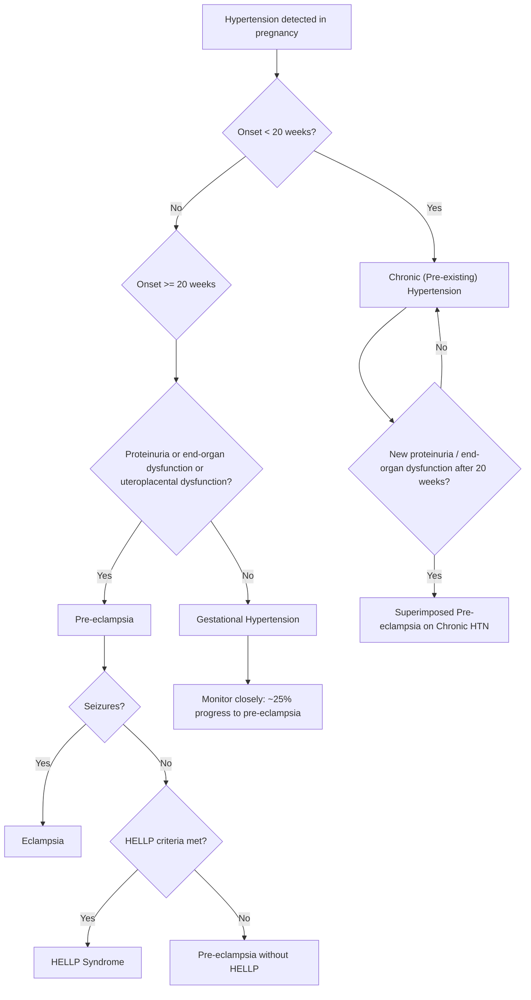

## Differential Diagnosis of Pre-eclampsia

The differential diagnosis of pre-eclampsia is really about answering two overlapping clinical questions:

1. **A pregnant woman presents with hypertension after 20 weeks — what type of hypertensive disorder of pregnancy is this?** (i.e., differentiating *within* the classification of hypertension in pregnancy)
2. **A pregnant woman presents with features that *mimic* pre-eclampsia (e.g., seizures, liver dysfunction, thrombocytopenia, proteinuria) — could this be something else entirely?** (i.e., differentiating pre-eclampsia from its clinical mimics)

Both angles are essential for exams and clinical practice. Let's work through them systematically.

---

### A. Differentiating Within Hypertensive Disorders of Pregnancy

This is the ***approach to HT: establishment of diagnosis, differentiate between different causes, and assessment of severity of HT*** [1][2].

The key clinical question is: **when did the hypertension first appear, and are there features of end-organ damage or proteinuria?**

***Just because a woman has chronic HT doesn't mean she cannot develop pre-eclampsia → must continue monitoring patient's BP trend + additional pre-eclampsia features such as proteinuria / end-organ damage*** [1].

| Condition | Onset of HTN | Proteinuria | End-Organ Damage | Key Distinguishing Feature |
|---|---|---|---|---|
| **Chronic HTN** | ***Before pregnancy or < 20 weeks*** | May have pre-existing proteinuria from CKD | Pre-existing (e.g., LVH, CKD) | HTN documented before pregnancy or persists > 12 weeks postpartum |
| **Gestational HTN** | ***≥ 20 weeks*** | **Absent** | **Absent** | New HTN without proteinuria or organ dysfunction; resolves by 12 weeks postpartum. ~25% progress to pre-eclampsia |
| **Pre-eclampsia** | ***≥ 20 weeks*** | ***≥ 300 mg/day*** (or absent if other organ dysfunction present) | ***Present*** (renal, hepatic, neuro, haem, uteroplacental) | Multisystem disorder; proteinuria NOT mandatory if other organ dysfunction exists [2][3] |
| **Superimposed pre-eclampsia** | < 20 weeks (chronic HTN baseline) | ***New-onset*** or worsening | ***New-onset*** after 20 weeks | Hardest to diagnose — look for sudden worsening of BP control, new proteinuria, or new organ dysfunction in a woman with known chronic HTN [1] |
| **Eclampsia** | ≥ 20 weeks (or postpartum) | Usually present | Present + ***seizures*** | ***Generalised tonic-clonic seizures*** in context of pre-eclampsia; can occur antepartum, intrapartum, or ***more than 48 hours after delivery*** [1][2] |
| **HELLP Syndrome** | Usually ≥ 20 weeks | Variable | ***Haemolysis, Elevated Liver enzymes, Low Platelets*** | Can occur ***without significant hypertension or proteinuria*** — a diagnostic trap [6] |

<Callout title="The 20-Week Rule and Its Exceptions" type="error">
***Pre-eclampsia occurs in the 2nd half of pregnancy — anytime after 20 weeks. Anything before 20 weeks is NOT the effect of pregnancy*** [1]. However, there are rare exceptions where "pre-eclampsia-like" features can present before 20 weeks:
- **Molar pregnancy** (hydatidiform mole): abnormal trophoblast proliferation → massive anti-angiogenic factor release → early pre-eclampsia
- **Triploidy**: abnormal placentation
- **Mirror syndrome**: fetal hydrops → placental oedema → maternal pre-eclampsia-like picture

If a woman presents with "pre-eclampsia" before 20 weeks, think molar pregnancy or chromosomal abnormality, NOT classical pre-eclampsia.
</Callout>

<Callout title="MCQ Trap: Gestational HTN vs Pre-eclampsia">
***MCQ from lecture: A pregnant woman admitted at 38 weeks for labour, BP persistently > 140/90, urine albumin negative. Diagnosis = Gestational hypertension*** [2]. Why? Because there is new-onset HTN after 20 weeks BUT no proteinuria and no mention of end-organ dysfunction. The moment you add proteinuria or organ dysfunction, it becomes pre-eclampsia.
</Callout>

---

### B. Clinical Mimics of Pre-eclampsia — The Broader Differential

Pre-eclampsia is a multisystem disorder, so it can mimic — and be mimicked by — many other conditions. This is particularly important when the presentation is atypical (e.g., seizures without hypertension, liver dysfunction without proteinuria, isolated thrombocytopenia).

Let's organise by the *dominant clinical feature*:

#### B1. Differential Diagnosis of Seizures in Pregnancy (Mimics of Eclampsia)

***Eclampsia is an end-stage of pre-eclampsia → generalised tonic-clonic seizures*** [1]. But not all seizures in pregnancy are eclampsia. ***Around 1 in 6 will have normal BP and no proteinuria prior to eclampsia*** [1][2] — making the differential even more challenging.

| Condition | Key Distinguishing Features | Why it mimics eclampsia |
|---|---|---|
| **Eclampsia** | HTN, proteinuria, end-organ dysfunction (usually); seizures ante-/intra-/postpartum; responds to MgSO₄ | — (this IS the diagnosis) |
| **Epilepsy** | Pre-existing seizure history; seizures unrelated to BP/proteinuria; normal LFT/RFT/platelets; responds to anti-epileptic drugs, not MgSO₄ | Both cause generalised tonic-clonic seizures in pregnancy |
| **Cerebral venous sinus thrombosis (CVST)** | Headache, seizures, focal neurological deficits; pregnancy is a prothrombotic state; diagnosed by MR venography; platelets and BP may be normal | Headache + seizures in a pregnant woman → looks like eclampsia |
| **Posterior reversible encephalopathy syndrome (PRES) — non-eclamptic** | Can occur from other causes of acute hypertension (e.g., renal disease, immunosuppressants); MRI shows vasogenic oedema in posterior circulation | PRES is the same pathological process as eclampsia but from a different cause |
| **Intracerebral haemorrhage / subarachnoid haemorrhage** | Sudden severe headache ("thunderclap"), focal deficits, altered consciousness; CT brain shows haemorrhage | Catastrophic headache + seizures in pregnancy |
| **Meningitis / encephalitis** | Fever, neck stiffness, photophobia; CSF analysis abnormal; may or may not have seizures | Headache, altered mental status, seizures |
| **Metabolic** (hypoglycaemia, hyponatraemia, hypocalcaemia) | Abnormal electrolytes/glucose; no HTN or proteinuria | Seizures from any metabolic cause |
| **Space-occupying lesion** (tumour, abscess) | Focal neurological signs; papilloedema; CT/MRI shows mass | Headache, seizures, visual disturbance |
| **Thrombotic thrombocytopenic purpura (TTP)** | Classic pentad: MAHA, thrombocytopenia, fever, renal impairment, neurological symptoms; ADAMTS13 < 10% | Seizures + thrombocytopenia + MAHA in pregnancy |

#### B2. Differential Diagnosis of Thrombocytopenia + MAHA in Pregnancy (Mimics of HELLP / Severe Pre-eclampsia)

This is a critical differential because several life-threatening conditions overlap. The key conditions sharing the triad of **thrombocytopenia, MAHA, and organ dysfunction** in pregnancy are:

| Condition | Timing | BP | Liver | Coagulation | Platelets | ADAMTS13 | Key Differentiator |
|---|---|---|---|---|---|---|---|
| **HELLP syndrome** | Usually 3rd trimester | Usually ↑ | ***↑↑ AST/ALT*** | May have DIC | < 100 | Normal ( > 10%) | Part of pre-eclampsia spectrum; resolves with delivery |
| **TTP** | Any trimester | Normal or mildly ↑ | Usually normal | Normal PT/APTT (platelets consumed, NOT coagulation cascade) | Severely ↓ ( < 20) | ***< 10%*** (diagnostic) | ADAMTS13 deficiency → uncleaved ultra-large vWF multimers → platelet-rich microthrombi [6] |
| **HUS (typical / atypical)** | Postpartum (typically) | ↑ | Usually normal | May have mild DIC | ↓ | Normal ( > 10%) | Predominant renal failure; complement-mediated (aHUS) or Shiga toxin (typical HUS) |
| **DIC** | Any time | Variable | Variable | ***↑ PT, ↑ APTT, ↓ fibrinogen, ↑↑ D-dimer*** | ↓ | Normal | Consumption of ALL coagulation factors — key difference from TTP/HUS where PT/APTT are normal [6][8] |
| **Acute fatty liver of pregnancy (AFLP)** | 3rd trimester (34–36 wk) | May be ↑ | ↑ AST/ALT + ***↑ bilirubin, ↓ glucose, ↑ ammonia*** | DIC common | ↓ | Normal | Hepatic failure features dominant — hypoglycaemia, hyperammonaemia, coagulopathy; microvesicular steatosis on biopsy |
| **SLE flare / lupus nephritis** | Any trimester | ↑ | Usually normal | May have ↓ complement | ↓ (immune-mediated) | Normal | Low C3/C4, ↑ anti-dsDNA, active urinary sediment; pre-existing SLE history [5] |
| **Antiphospholipid syndrome (APS)** | Any trimester | ↑ | Variable | Paradoxically ↑ APTT (lupus anticoagulant) but prothrombotic | ↓ | Normal | Recurrent thrombosis/pregnancy loss; positive aPL antibodies on ≥ 2 occasions ≥ 12 weeks apart [5] |

<Callout title="TTP vs HELLP vs DIC — The Key Distinguishers" type="idea">
All three cause thrombocytopenia + MAHA + organ damage in pregnancy. The quickest way to differentiate:

- **DIC**: Coagulation cascade activated → ***↑ PT, ↑ APTT, ↓ fibrinogen*** [6][8]. This is because all clotting factors are consumed.
- **TTP**: Coagulation cascade is NOT activated (PT, APTT, fibrinogen all normal) → it is purely a platelet/vWF problem. Diagnosis: ***ADAMTS13 activity < 10%*** [6].
- **HELLP**: Liver involvement is dominant (↑ AST/ALT); usually in context of pre-eclampsia; responds to delivery; ADAMTS13 normal.

This distinction matters because TTP requires **plasma exchange**, HELLP requires **delivery**, and DIC requires **treating the underlying cause**.
</Callout>

#### B3. Differential Diagnosis of Liver Dysfunction in Pregnancy

When a pregnant woman presents with ***elevated transaminases ± RUQ/epigastric pain*** [2][3], consider:

| Condition | Timing | Distinguishing Features |
|---|---|---|
| **HELLP syndrome** | 3rd trimester | HTN + proteinuria usually present; MAHA + thrombocytopenia; resolves with delivery |
| **Acute fatty liver of pregnancy (AFLP)** | 34–36 weeks | Nausea/vomiting, jaundice, ***hypoglycaemia***, ↑ ammonia, coagulopathy (DIC), polydipsia/polyuria (diabetes insipidus from impaired urea cycle). Liver biopsy: microvesicular steatosis. Associated with LCHAD deficiency in fetus |
| **Intrahepatic cholestasis of pregnancy (ICP)** | 3rd trimester | ***Pruritus*** (dominant symptom, especially palms and soles); ↑ bile acids ( > 10 μmol/L); mildly ↑ ALT; NO hypertension or thrombocytopenia. Risk of fetal stillbirth |
| **Viral hepatitis** | Any time | Fever, jaundice, ↑↑ ALT/AST (often > 1000); positive viral serology (HBsAg, anti-HAV IgM, anti-HCV, anti-HEV). HEV is particularly dangerous in pregnancy (high mortality) |
| **Hepatic rupture / subcapsular haematoma** | 3rd trimester | Severe RUQ pain, haemodynamic instability, peritoneal signs; usually complicates HELLP; CT/USS shows subcapsular collection |
| **Cholelithiasis / cholecystitis** | Any time | RUQ pain, Murphy's sign, fever; USS shows gallstones; no HTN, no proteinuria |

#### B4. Differential Diagnosis of Proteinuria in Pregnancy

| Condition | Key Differentiator |
|---|---|
| **Pre-eclampsia** | New-onset proteinuria after 20 weeks + hypertension ± organ dysfunction |
| **Chronic kidney disease / pre-existing nephropathy** | Proteinuria present BEFORE 20 weeks or before pregnancy; known renal disease history; no acute worsening of BP |
| **Lupus nephritis (SLE flare)** | Active urinary sediment (RBC casts), low C3/C4, ↑ anti-dsDNA; may coexist with pre-eclampsia [5] |
| **Diabetic nephropathy** | Pre-existing DM with known albuminuria; gradual progression |
| **UTI / pyelonephritis** | Fever, dysuria, pyuria, positive urine culture; leukocyte esterase/nitrite positive on dipstick |
| **Gestational proteinuria** | Isolated proteinuria without HTN; usually benign; must monitor for progression to pre-eclampsia |

#### B5. Differential Diagnosis of Hypertension in Pregnancy

***Differentiating between different causes*** [2] of hypertension is essential:

| Condition | Key Features |
|---|---|
| ***Chronic (pre-existing) hypertension*** | BP elevated before pregnancy or < 20 weeks; persists > 12 weeks postpartum; may have LVH, retinopathy |
| ***Gestational hypertension*** | New HTN ≥ 20 weeks; no proteinuria or organ dysfunction; resolves postpartum |
| ***Pre-eclampsia*** | New HTN ≥ 20 weeks + proteinuria/organ dysfunction |
| ***Superimposed pre-eclampsia*** | Chronic HTN + new features of pre-eclampsia after 20 weeks [1] |
| **Secondary hypertension** (unmasked in pregnancy) | Phaeochromocytoma (paroxysmal headache, palpitations, sweating), renal artery stenosis (renal bruit), primary hyperaldosteronism (hypokalaemia), Cushing's syndrome [8] |
| **White-coat hypertension** | ↑ office BP but normal ABPM/HBPM; ***15–30%, especially in pregnant women*** [7] |

<Callout title="SLE Flare vs Pre-eclampsia — A Classic Exam Trap" type="error">
In a pregnant woman with known SLE, differentiating a lupus flare from pre-eclampsia is notoriously difficult because both cause hypertension, proteinuria, thrombocytopenia, and renal dysfunction. Key distinguishers:

| Feature | SLE Flare | Pre-eclampsia |
|---|---|---|
| Complement (C3/C4) | ***↓↓*** (consumed by immune complexes) | Normal or ↑ (acute phase reactants in pregnancy) |
| Anti-dsDNA | ↑ (rising titres = active disease) | Normal |
| Urinary sediment | Active (RBC casts, dysmorphic RBCs) | Bland (no casts — the lesion is glomerular endotheliosis, not immune complex GN) |
| Uric acid | Normal | ↑ (↓ renal clearance in pre-eclampsia) |
| Response to delivery | Does NOT improve | Improves with delivery of placenta |
| Response to immunosuppression | Improves | No effect |

If in doubt, treat as pre-eclampsia (safer for mother and baby) while investigating for SLE flare simultaneously. They can also coexist — a lupus patient can develop superimposed pre-eclampsia.
</Callout>

---

### C. Postpartum Considerations

***Pre-eclampsia / eclampsia can still occur more than 48 hours after delivery*** [1][2] because ***endotoxins can still circulate after delivery*** [1]. This is important because:

- Late postpartum eclampsia (seizures > 48 hours after delivery) can be missed if clinicians assume the risk window has closed.
- The differential for postpartum seizures includes eclampsia, CVST (prothrombotic postpartum state), PRES from other causes, and epilepsy.
- Always check BP, proteinuria, and bloods (platelets, LFT, RFT) in any postpartum woman with headache, visual disturbance, or seizures.

---

### D. Summary of the Diagnostic Approach

***Most of these women are asymptomatic → when they complain with symptoms, already at the severe end of the spectrum. How can we catch them early? Via regular antenatal screening (i.e., normal follow-up, early pregnancy 4–6 weeks, later pregnancy every 2 weeks). Check BP, proteinuria by dipstick, ultrasound for fetal movement in every visit*** [1].

***However, have to remember screening cannot detect all — around 1 in 6 will have normal BP and no proteinuria prior to eclampsia*** [1][2].

The systematic approach:

1. **Establish the diagnosis**: Is this truly hypertension? Confirm with repeated measurements. Rule out white-coat hypertension if needed (ABPM/HBPM) [7].
2. **Classify the hypertension**: Chronic HTN vs gestational HTN vs pre-eclampsia vs superimposed pre-eclampsia vs eclampsia.
3. **Assess severity**: Mild vs severe pre-eclampsia (BP ≥ 160/110, symptoms, lab derangements) [1][2].
4. **Exclude mimics**: Especially TTP, AFLP, SLE flare, CVST when presentation is atypical.
5. **Assess fetal wellbeing**: USS for growth, Doppler for uteroplacental flow, CTG for fetal heart rate pattern.

---

<Callout title="High Yield Summary">

1. **Within hypertensive disorders of pregnancy**: differentiate chronic HTN (onset < 20 wk), gestational HTN (onset ≥ 20 wk, no organ dysfunction), pre-eclampsia (onset ≥ 20 wk + proteinuria/organ dysfunction), superimposed pre-eclampsia, and eclampsia (+ seizures).
2. **Key differentials for seizures in pregnancy**: eclampsia, epilepsy, CVST, ICH/SAH, meningitis/encephalitis, TTP, metabolic causes.
3. **HELLP vs TTP vs DIC**: DIC has deranged PT/APTT/fibrinogen; TTP has normal coagulation but ADAMTS13 < 10%; HELLP has dominant liver involvement and resolves with delivery.
4. **AFLP vs HELLP**: AFLP features hypoglycaemia, hyperammonaemia, DIC; HELLP features MAHA and is part of the pre-eclampsia spectrum.
5. **SLE flare vs pre-eclampsia**: Low complement and rising anti-dsDNA favour SLE flare; elevated uric acid and bland urinary sediment favour pre-eclampsia. They can coexist.
6. **Postpartum eclampsia is real**: Can occur > 48 hours after delivery due to circulating factors from the placenta.
7. **1 in 6 eclamptic women** have normal BP and no proteinuria prior to seizure — screening is not perfect.

</Callout>

---

<ActiveRecallQuiz
  title="Active Recall - Pre-eclampsia: Differential Diagnosis"
  items={[
    {
      question: "A woman at 38 weeks' gestation has BP persistently >140/90 mmHg. Urine albumin is negative. No symptoms or lab derangements. What is the diagnosis, and what must you monitor for?",
      markscheme: "Gestational hypertension (new-onset HTN >=20 weeks without proteinuria or end-organ dysfunction). Must monitor closely because approximately 25% of gestational HTN cases progress to pre-eclampsia. Monitor BP trend, serial urinalysis for new proteinuria, bloods (platelets, LFT, RFT), and fetal surveillance.",
    },
    {
      question: "How do you distinguish HELLP syndrome from TTP in a pregnant woman presenting with thrombocytopenia and MAHA?",
      markscheme: "HELLP: elevated AST/ALT (liver involvement dominant), usually in context of pre-eclampsia (HTN, proteinuria), PT/APTT may be mildly deranged or normal, ADAMTS13 >10%, resolves with delivery. TTP: normal liver enzymes, markedly low platelets, neurological symptoms prominent, ADAMTS13 <10% (diagnostic), PT/APTT/fibrinogen normal (coagulation cascade not activated), requires plasma exchange not delivery.",
    },
    {
      question: "A pregnant woman with known SLE presents at 30 weeks with worsening proteinuria, hypertension, and thrombocytopenia. How do you differentiate an SLE flare from pre-eclampsia?",
      markscheme: "SLE flare: low C3/C4, rising anti-dsDNA titres, active urinary sediment (RBC casts, dysmorphic RBCs), normal uric acid, responds to immunosuppression, does NOT improve with delivery. Pre-eclampsia: normal or raised complement, normal anti-dsDNA, bland urinary sediment (glomerular endotheliosis not immune-complex GN), elevated uric acid, improves with delivery. They can coexist. If in doubt, treat as pre-eclampsia.",
    },
    {
      question: "Why can eclampsia occur more than 48 hours after delivery? What is the implication for clinical practice?",
      markscheme: "Because the anti-angiogenic and pro-inflammatory factors released by the ischaemic placenta (sFlt-1, sEng, cytokines) continue to circulate in the maternal bloodstream even after the placenta is delivered. It takes time for these factors to be cleared. Clinical implication: postpartum women with headache, visual disturbance, or seizures must be evaluated for eclampsia with BP measurement, urinalysis, and blood tests, even if they were normotensive during delivery.",
    },
    {
      question: "List three conditions other than eclampsia that can cause seizures in pregnancy and state one key distinguishing feature for each.",
      markscheme: "(1) Epilepsy: pre-existing seizure disorder, normal BP and labs, responds to anti-epileptic drugs not MgSO4. (2) Cerebral venous sinus thrombosis (CVST): focal neurological deficits, diagnosed by MR venography, pregnancy is a prothrombotic state. (3) Intracerebral haemorrhage: sudden thunderclap headache, focal deficits, CT brain shows haemorrhage. Others acceptable: meningitis (fever, neck stiffness, abnormal CSF), TTP (ADAMTS13 <10%), metabolic (abnormal electrolytes/glucose).",
    },
  ]}
/>

## References

[1] Lecture slides: Block C - Hypertension and Pregnancy (CFB WCS in 2023_24).pdf
[2] Lecture slides: GC 224. Hypertension and Pregnancy.pdf
[3] Lecture slides: GC 115. I am pregnant medical problems complicating pregnancy.pdf
[5] Senior notes: Ryan Ho Rheumatology.pdf (p73 — Antiphospholipid syndrome, SLE)
[6] Senior notes: Ryan Ho Haemtology.pdf (p137 — TMA, DIC, MAHA terminology and causes)
[7] Senior notes: Ryan Ho Cardiology.pdf (p175 — White-coat hypertension, ABPM)
[8] Senior notes: Maksim Medicine Notes.pdf (p78 — Secondary hypertension differential, hypertensive emergency)
