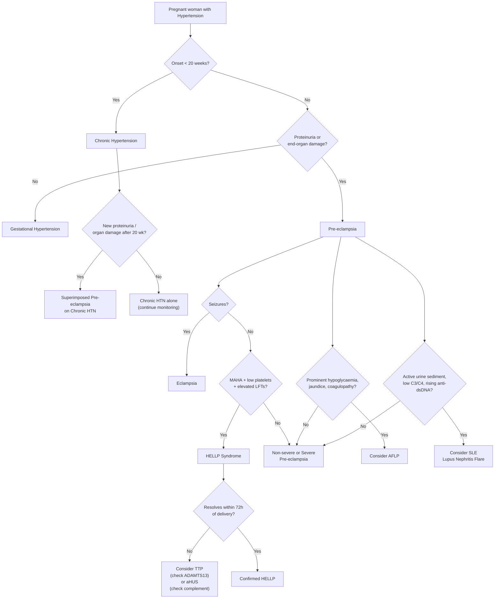

## Differential Diagnosis of Pre-eclampsia

The clinical scenario you are facing is usually this: a woman in the **second half of pregnancy** presents with hypertension ± proteinuria ± end-organ dysfunction. Your job is to figure out *what kind of hypertensive disorder of pregnancy this is* — and also to exclude mimics that can masquerade as pre-eclampsia.

> ***Approach to HT: establishment of diagnosis, differentiate between different causes, and assessment of severity of HT*** [1][2]

There are two layers of differential diagnosis here:
1. **Differentiating among the hypertensive disorders of pregnancy** (the most common clinical task)
2. **Differentiating pre-eclampsia from non-obstetric conditions that mimic it** (especially HELLP mimics and seizure mimics)

---

### A. Differentiating Among Hypertensive Disorders of Pregnancy

This is the bread and butter. You see a pregnant woman with high blood pressure — is it chronic HTN, gestational HTN, pre-eclampsia, or superimposed pre-eclampsia?

> ***Chronic HT doesn't mean she cannot develop pre-eclampsia → must continue monitoring patient's BP trend + additional pre-eclampsia features such as proteinuria / end-organ damage*** [1]

| Feature | Chronic Hypertension | Gestational Hypertension | Pre-eclampsia | Superimposed Pre-eclampsia on Chronic HTN |
|---|---|---|---|---|
| **Timing of onset** | Before pregnancy or **< 20 weeks** | **> 20 weeks** | **> 20 weeks** | Known chronic HTN + new features **> 20 weeks** |
| **BP** | ≥ 140/90 | ≥ 140/90 | ≥ 140/90 | Sudden worsening or previously controlled now uncontrolled |
| **Proteinuria** | May have baseline proteinuria (e.g. CKD) | **Absent** | **Present** (≥ 300 mg/day) OR absent if other organ dysfunction present | **New-onset** proteinuria or sudden significant increase from baseline |
| **End-organ damage** | May have pre-existing (LVH, retinopathy) — but stable | Absent | ***Present: renal, hepatic, neurological, haematological, uteroplacental*** [2][3] | New organ dysfunction not explained by pre-existing disease |
| **Postpartum course** | **Persists > 12 weeks postpartum** | Resolves by 12 weeks postpartum | Resolves by 12 weeks postpartum (usually within days to weeks) | Chronic HTN component persists |
| **Pathophysiology** | Pre-existing vascular disease (essential or secondary HTN) | Unknown; possibly mild endothelial dysfunction that doesn't cross the threshold for organ damage | Failed placentation → anti-angiogenic imbalance → systemic endothelial dysfunction | Pre-existing endothelial disease + superimposed placental dysfunction → the "double hit" |

> ***MCQ 1: A pregnant woman was admitted at 38 weeks of gestation for labour. Her blood pressure was persistently elevated > 140/90mmHg. Urine albumin was negative. What is your diagnosis?*** → Answer: **B. Gestational hypertension** [2]. Why? HTN after 20 weeks, no proteinuria, no end-organ damage = gestational HTN by definition. But remember: ~25% of gestational HTN will progress to pre-eclampsia, so keep monitoring.

<Callout title="The Key Differentiating Questions" type="idea">
When you see a pregnant woman with HTN, ask yourself:
1. **When did it start?** Before 20 weeks → chronic HTN. After 20 weeks → gestational HTN or pre-eclampsia.
2. **Is there proteinuria or end-organ damage?** No → gestational HTN. Yes → pre-eclampsia.
3. **Did she have HTN before pregnancy?** If yes + new proteinuria/organ damage → superimposed pre-eclampsia.
4. **Does the HTN persist > 12 weeks postpartum?** If yes → reclassify as chronic HTN.
</Callout>

The tricky scenario is when you don't have pre-pregnancy BP records. If a woman books late (e.g. presents at 22 weeks with HTN), you cannot be sure whether this is chronic HTN or new-onset. **Practically**, you manage conservatively and reclassify postpartum: if HTN resolves within 12 weeks → it was likely gestational HTN or pre-eclampsia; if it persists → chronic HTN.

---

### B. Conditions That Mimic Pre-eclampsia

This is where it gets clinically dangerous. Several conditions can present with hypertension + thrombocytopenia + liver dysfunction + neurological symptoms + renal dysfunction in pregnancy — and they are **NOT** pre-eclampsia but require completely different management.

#### 1. Thrombotic Microangiopathies (TMAs)

These are the most important mimics because they share the triad of MAHA + thrombocytopenia + organ damage.

> MAHA: non-immune haemolysis due to intravascular RBC fragmentation. Causes: TMA (due to microvascular thrombosis), prosthetic heart valve, LVAD, DIC [7]
>
> 1° TMA: TTP, HUS, drug-induced TMA, complement-mediated TMA
> 2° TMA: ***HELLP syndrome***, malignant HTN, SLE, scleroderma, antiphospholipid syndrome [7]

| Condition | Key Distinguishing Features | Why it mimics pre-eclampsia |
|---|---|---|
| **TTP (Thrombotic Thrombocytopenic Purpura)** | Classic pentad: MAHA + thrombocytopenia + neurological features + renal impairment + fever. **ADAMTS13 activity < 10%** is diagnostic. Platelets typically **very low** (< 30 × 10⁹/L). LFTs usually normal. Does NOT resolve with delivery | Both have MAHA + thrombocytopenia + neurological symptoms. But TTP has much lower platelets, normal LFTs, and ADAMTS13 deficiency. TTP needs **plasma exchange**, not delivery |
| **HUS (Haemolytic Uraemic Syndrome)** | **Renal failure is dominant** (much more prominent than in pre-eclampsia). Typical HUS: Shiga toxin-producing *E. coli* (usually preceded by bloody diarrhoea). Atypical HUS (aHUS): complement-mediated, can be triggered by pregnancy. Does NOT resolve with delivery | Both have MAHA + thrombocytopenia + AKI. But HUS has disproportionate renal failure, diarrhoeal prodrome (typical), and complement abnormalities (atypical). aHUS needs **eculizumab** (complement C5 inhibitor) |
| **HELLP syndrome** | This IS a severe variant of pre-eclampsia. **H**aemolysis + **E**levated **L**iver enzymes + **L**ow **P**latelets. Should improve within 48–72h of delivery. If it doesn't → consider TTP or aHUS | HELLP is on the pre-eclampsia spectrum, so it's not truly a "mimic" — but if features persist postpartum, you must reconsider the diagnosis |

<Callout title="TTP vs HELLP — The Critical Distinction" type="error">
If MAHA + thrombocytopenia + organ dysfunction does **NOT resolve within 72 hours of delivery**, you must urgently consider **TTP** (check ADAMTS13) or **atypical HUS** (check complement levels). Missing TTP is fatal — it requires plasma exchange, not just supportive care. Key clue: in TTP, platelets are usually profoundly low (< 30), LFTs are relatively spared, and neurological features predominate over hepatic features.
</Callout>

#### 2. Acute Fatty Liver of Pregnancy (AFLP)

| Feature | AFLP | HELLP/Severe Pre-eclampsia |
|---|---|---|
| **Primary pathology** | Microvesicular fatty infiltration of hepatocytes (defect in mitochondrial fatty acid β-oxidation, often linked to **LCHAD deficiency** in the fetus) | Endothelial dysfunction → hepatic sinusoidal obstruction → periportal necrosis |
| **Key features** | **Hypoglycaemia** (liver failure → impaired gluconeogenesis), markedly **↑bilirubin** (jaundice), **coagulopathy** (↑PT/INR from impaired hepatic synthesis of clotting factors), DIC, **↑ammonia**, **↑uric acid** | ↑Transaminases, thrombocytopenia, MAHA. Hypoglycaemia and coagulopathy less prominent unless very severe |
| **HTN/proteinuria** | May be absent or mild (only ~50% have HTN) | Present by definition |
| **Platelets** | Variable (may be low from DIC) | Characteristically low in HELLP |
| **Timing** | Usually 3rd trimester (35–36 weeks) | Any time after 20 weeks |
| **Imaging** | CT/US may show fatty liver (but sensitivity is low) | Usually unremarkable or shows subcapsular haematoma |
| **Postpartum** | Liver function gradually recovers; may need transplant if fulminant | Rapid recovery after delivery (usually within days) |

**Why the distinction matters**: AFLP management includes delivery but also aggressive supportive care for liver failure (IV glucose for hypoglycaemia, FFP/cryoprecipitate for coagulopathy, monitoring for hepatic encephalopathy). Rarely, liver transplant may be needed.

#### 3. Systemic Lupus Erythematosus (SLE) — Lupus Nephritis Flare

SLE can flare during pregnancy and mimic pre-eclampsia closely. Both can present with HTN, proteinuria, thrombocytopenia, and renal dysfunction.

| Feature | SLE Flare (Lupus Nephritis) | Pre-eclampsia |
|---|---|---|
| **Timing** | Can occur at any gestational age (including < 20 weeks!) | > 20 weeks |
| **Complement levels (C3/C4)** | **Low** (consumed by immune complex deposition) | **Normal or high** (complement is an acute-phase reactant and increases in normal pregnancy) |
| **Anti-dsDNA antibodies** | **Rising titres** | Not elevated (unless coincidental SLE) |
| **Urine sediment** | Active — RBC casts, dysmorphic RBCs (indicates glomerulonephritis) | Typically bland — no active sediment (glomerular endotheliosis, not GN) |
| **Other SLE features** | Rash, arthritis, serositis, oral ulcers, alopecia | Absent |
| **sFlt-1/PlGF ratio** | Normal (because it's not a placental disease) | Elevated sFlt-1/PlGF ratio |
| **Response to delivery** | Does NOT improve with delivery | Improves with delivery |

> ***Antiphospholipid syndrome*** can occur as primary or secondary to SLE [5]. It is both a **risk factor** for pre-eclampsia AND a condition that can independently cause pregnancy complications (thrombosis, pregnancy loss < 10 weeks, premature birth < 34 weeks due to eclampsia) [5].

#### 4. Other Causes of Seizures in Pregnancy (Eclampsia Mimics)

If a pregnant woman seizes, the differential is not just eclampsia:

| Condition | Distinguishing Features |
|---|---|
| **Eclampsia** | Pre-eclampsia features present (HTN, proteinuria, end-organ damage). Seizures are generalised tonic-clonic. Responds to MgSO₄ |
| **Epilepsy** | Known history of epilepsy, may have been on anti-epileptic drugs. BP and proteinuria normal. Diagnosed by history and EEG |
| **Cerebral venous sinus thrombosis (CVST)** | Pregnancy is a prothrombotic state → risk of CVST. Presents with headache, seizures, focal neurological deficits. CT venogram / MR venogram is diagnostic. May or may not have HTN |
| **Intracranial haemorrhage (ICH)** | Sudden severe headache ("thunderclap"), rapid neurological deterioration, focal deficits. CT brain shows haemorrhage. Can coexist with severe pre-eclampsia |
| **Posterior reversible encephalopathy syndrome (PRES)** | Actually occurs IN pre-eclampsia/eclampsia but can also occur independently from other causes of severe HTN, immunosuppressants (cyclosporine, tacrolimus). MRI shows characteristic posterior white matter oedema |
| **Meningitis / Encephalitis** | Fever, neck stiffness, altered consciousness. LP and neuroimaging diagnostic |
| **Hypoglycaemia** | Check glucose! Especially in context of AFLP (impaired gluconeogenesis) or insulin-treated diabetes |
| **Metabolic** | Hyponatraemia, hypocalcaemia, uraemia — all can cause seizures. Check electrolytes |

#### 5. Other Causes of Hypertension in Pregnancy

Don't forget that a pregnant woman can have **secondary hypertension** from non-obstetric causes [4]:

> Secondary hypertension: Renal (CKD, GN, renovascular disease, PCKD), Endocrine (primary hyperaldosteronism, Cushing's syndrome, phaeochromocytoma, hyperthyroidism, acromegaly), Respiratory (OSA), Cardiac (CoA), Drug-induced (immunosuppressant, sympathomimetic, steroid) [4]

**Phaeochromocytoma** deserves special mention in pregnancy because:
- It can mimic pre-eclampsia (paroxysmal HTN, headache, sweating)
- It is **extremely dangerous** in pregnancy if undiagnosed (catecholamine crisis during labour can be fatal)
- Clue: paroxysmal episodes of headache + palpitation + sweating ("phaeochromocytoma triad") [4]
- Diagnosis: 24h urine catecholamines / metanephrines, plasma metanephrines

#### 6. Other Causes of Thrombocytopenia in Pregnancy

If thrombocytopenia is the dominant finding, consider:

| Condition | Platelets | Context |
|---|---|---|
| **Gestational thrombocytopenia** | 100–150 × 10⁹/L (mild) | Most common cause of thrombocytopenia in pregnancy (~75%). Benign, incidental, no treatment needed. Usually > 70 × 10⁹/L |
| **Pre-eclampsia / HELLP** | Can be < 100 | HTN + proteinuria + other organ damage |
| **ITP (Immune Thrombocytopenic Purpura)** | Can be very low (< 20) | Isolated thrombocytopenia, no MAHA, no HTN, anti-platelet antibodies |
| **TTP** | Very low (< 30) | MAHA + neurological features, ADAMTS13 < 10% |
| **DIC** | Variable | Consumption coagulopathy — ↑PT, ↑aPTT, ↓fibrinogen, ↑D-dimer [7] |
| **SLE** | Variable | Other SLE features, ↓C3/C4, ↑anti-dsDNA |

---

### C. Diagnostic Differentiation Algorithm

---

### D. Key Differentiating Investigations

When you are faced with a diagnostic dilemma, these tests help discriminate:

| Investigation | What it helps differentiate | Interpretation |
|---|---|---|
| **sFlt-1 / PlGF ratio** | Pre-eclampsia vs other causes | Ratio > 38 favours pre-eclampsia; normal ratio effectively rules it out (high NPV). In SLE flare, AFLP, or TTP the ratio is usually normal |
| **ADAMTS13 activity** | TTP vs HELLP | < 10% = TTP. Normal (> 20%) in HELLP |
| **Complement levels (C3, C4)** | SLE flare vs pre-eclampsia | ↓ in SLE flare (consumption); normal/↑ in pre-eclampsia |
| **Anti-dsDNA titres** | SLE flare vs pre-eclampsia | Rising in SLE flare; normal in pre-eclampsia |
| **Urine microscopy** | Lupus nephritis vs pre-eclampsia | Active sediment (RBC casts, dysmorphic RBCs) in lupus nephritis; bland in pre-eclampsia |
| **Fibrinogen, PT, aPTT** | DIC vs pre-eclampsia / HELLP | Markedly ↑PT/aPTT + ↓fibrinogen + ↑D-dimer = DIC [7]. HELLP may have mild DIC but fibrinogen is often normal/only mildly low |
| **Blood glucose** | AFLP vs HELLP | Hypoglycaemia is a hallmark of AFLP (hepatic synthetic failure); rare in HELLP unless very severe |
| **Ammonia** | AFLP vs HELLP | ↑ in AFLP (liver failure); normal in HELLP |
| **Bile acids** | Intrahepatic cholestasis of pregnancy (ICP) vs HELLP | ↑ in ICP; normal in HELLP |
| **24h urine catecholamines / plasma metanephrines** | Phaeochromocytoma vs pre-eclampsia | ↑ in phaeochromocytoma [4] |
| **Antiphospholipid antibodies** | APS as underlying cause or co-contributor | Positive in APS; check lupus anticoagulant, anti-cardiolipin, anti-β2-GPI [5] |

---

### E. Severity Assessment Once Pre-eclampsia Is Diagnosed

Once you've established the diagnosis of pre-eclampsia, you must determine severity, as this dictates urgency of delivery:

> ***Severe pre-eclampsia or imminent eclampsia:***
> - ***Symptoms: headache, visual disturbance, epigastric or RUQ pain, nausea and vomiting***
> - ***Signs: BP ≥ 160/110, proteinuria (3 or 4+ or > 3g/d), gross and rapidly progressive oedema, brisk jerks or clonus, oliguria (< 30 mL/h)***
> - ***Lab: thrombocytopenia, impaired LFT, RFT, clotting profile*** [1][2]

| Finding | ***Mild*** | ***Severe*** |
|---|---|---|
| ***Convulsions (eclampsia)*** | ***Absent*** | ***Present*** |
| ***Diastolic Blood Pressure*** | ***> 90 mmHg but < 110 mmHg*** | ***110 mmHg or higher persistently*** |
| ***Generalised oedema (including face and hands)*** | ***Absent*** | ***Present*** |
| ***Headache*** | ***Absent*** | ***Present*** |
| ***Visual Disturbances*** | ***Absent*** | ***Present*** |
| ***Upper Abdominal Pain*** | ***Absent*** | ***Present*** |
| ***Oliguria*** | ***Absent*** | ***Present (< 400 mL/24h)*** |
| ***Diminished fetal movement*** | ***Absent*** | ***Present*** |

[1][2]

> ***Most of these women are asymptomatic → when they complain with symptoms, already severe end of spectrum. How can we catch them early? Via regular antenatal screening (i.e. normal follow up, early pregnancy 4–6 weeks, later pregnancy every 2 weeks). Check BP, proteinuria by dipstick, ultrasound for fetal movement in every visit*** [1]

<Callout title="Important Screening Limitations" type="error">
***Around 1 in 6 will have normal BP and no proteinuria prior to eclampsia*** [1][2]. Also remember that ***even though pre-eclampsia is a placenta problem, the endotoxins can still circulate after delivery, causing pre-eclampsia / eclampsia more than 48 hours after delivery*** [1]. So warn the woman and her family about this possibility.
</Callout>

---

### F. Summary — Differential Diagnosis Decision Framework

When you see **hypertension + proteinuria + organ dysfunction in pregnancy**, run through this mental checklist:

1. **Is it truly after 20 weeks?** If not → chronic HTN (or molar pregnancy as the exception)
2. **Is there proteinuria or organ damage?** If no → gestational HTN (monitor closely)
3. **Did she have pre-existing HTN?** If yes + new features → superimposed pre-eclampsia
4. **Are the liver enzymes and platelets very deranged?** → HELLP. Consider AFLP if hypoglycaemia/jaundice/coagulopathy prominent
5. **Is there MAHA + very low platelets + neurological features?** → Send ADAMTS13 to rule out TTP
6. **Does it persist after delivery?** → Think TTP, aHUS, or reclassify as chronic HTN
7. **Is there active urine sediment + low complement?** → Think SLE lupus nephritis flare
8. **Paroxysmal HTN + headache + sweating?** → Consider phaeochromocytoma
9. **Isolated mild thrombocytopenia (> 70) + no other features?** → Likely gestational thrombocytopenia

---

<Callout title="High Yield Summary">

**Differentiating hypertensive disorders of pregnancy:**
- Chronic HTN = before 20 weeks or persists > 12 weeks postpartum
- Gestational HTN = after 20 weeks, no proteinuria, no organ damage
- Pre-eclampsia = after 20 weeks + proteinuria or organ dysfunction or uteroplacental dysfunction
- Superimposed pre-eclampsia = chronic HTN + new features of pre-eclampsia

**Key mimics of pre-eclampsia / HELLP:**
- **TTP**: ADAMTS13 < 10%, very low platelets, normal LFTs, neurological features, does NOT resolve with delivery → needs plasma exchange
- **aHUS**: complement-mediated, disproportionate renal failure → needs eculizumab
- **AFLP**: hypoglycaemia, jaundice, coagulopathy, raised ammonia → hepatic synthetic failure
- **SLE flare**: low C3/C4, rising anti-dsDNA, active urine sediment, can occur < 20 weeks, does NOT resolve with delivery
- **Phaeochromocytoma**: paroxysmal HTN + headache + sweating + palpitations

**Severity of pre-eclampsia**: BP ≥ 160/110, symptoms (headache, visual disturbance, epigastric pain), oliguria, thrombocytopenia, impaired LFT/RFT/clotting → imminent eclampsia.

**Screening cannot catch everyone**: 1 in 6 have normal BP and no proteinuria before eclampsia. Eclampsia can occur > 48h postpartum.

**sFlt-1/PlGF ratio**: High NPV — normal ratio effectively rules out pre-eclampsia.

</Callout>

---

<ActiveRecallQuiz
  title="Active Recall - Pre-eclampsia Differential Diagnosis"
  items={[
    {
      question: "A woman at 32 weeks gestation presents with BP 160/100, platelets 22, LDH 1200 with schistocytes on film, and creatinine 280. Her LFTs are normal. She has confusion and headache. Her condition does not improve 72 hours after emergency caesarean delivery. What is the most likely diagnosis and what investigation confirms it?",
      markscheme: "Most likely TTP (thrombotic thrombocytopenic purpura). Key features: very low platelets (< 30), MAHA (schistocytes, raised LDH), neurological involvement, normal LFTs, and failure to resolve after delivery. Confirmatory investigation: ADAMTS13 activity level less than 10%. Treatment is plasma exchange, not just delivery."
    },
    {
      question: "How do you differentiate a lupus nephritis flare from pre-eclampsia in a pregnant woman with SLE who presents with hypertension and proteinuria at 28 weeks?",
      markscheme: "Lupus nephritis flare: low C3/C4 (complement consumption), rising anti-dsDNA titres, active urine sediment (RBC casts, dysmorphic RBCs), may have other SLE features (rash, arthritis), does NOT resolve with delivery, sFlt-1/PlGF ratio normal. Pre-eclampsia: complement normal or elevated, anti-dsDNA stable, bland urine sediment, sFlt-1/PlGF elevated, resolves with delivery. Both can coexist."
    },
    {
      question: "Name three key laboratory features that distinguish AFLP from HELLP syndrome.",
      markscheme: "1. Hypoglycaemia (impaired gluconeogenesis in liver failure) - hallmark of AFLP but rare in HELLP. 2. Markedly raised ammonia (hepatic encephalopathy pathway) - present in AFLP, normal in HELLP. 3. Coagulopathy with raised PT/INR and low fibrinogen from impaired hepatic synthetic function - more prominent in AFLP. Also elevated bilirubin/jaundice is more characteristic of AFLP."
    },
    {
      question: "A pregnant woman at 38 weeks has BP 148/95, no proteinuria, no symptoms, normal bloods. What is the diagnosis? What proportion of such patients progress to pre-eclampsia?",
      markscheme: "Gestational hypertension (new-onset HTN after 20 weeks without proteinuria or end-organ damage). Approximately 25% of women with gestational hypertension will progress to pre-eclampsia, so close monitoring with serial BP, urine protein, and blood tests is essential."
    },
    {
      question: "List the criteria from the lecture slides that distinguish severe from mild pre-eclampsia. What is the significance of symptoms being present?",
      markscheme: "Severe features: BP >= 160/110, convulsions (eclampsia), generalised oedema including face and hands, headache, visual disturbances, upper abdominal pain, oliguria (< 400 mL/24h), diminished fetal movement, thrombocytopenia, impaired LFT/RFT/clotting. Significance: most pre-eclampsia patients are asymptomatic; symptoms indicate severe end of spectrum and imminent risk of eclampsia, requiring urgent treatment."
    }
  ]}
/>

## References

[1] Lecture slides: Block C - Hypertension and Pregnancy (CFB WCS in 2023_24).pdf
[2] Lecture slides: GC 224. Hypertension and Pregnancy.pdf
[3] Lecture slides: GC 115. I am pregnant medical problems complicating pregnancy.pdf
[4] Senior notes: Maksim Medicine Notes.pdf (p78, Endocrinology — Hypertension DDx)
[5] Senior notes: Ryan Ho Rheumatology.pdf (p73, Antiphospholipid syndrome)
[7] Senior notes: Ryan Ho Haemtology.pdf (p137–138, MAHA, TMA, DIC)
