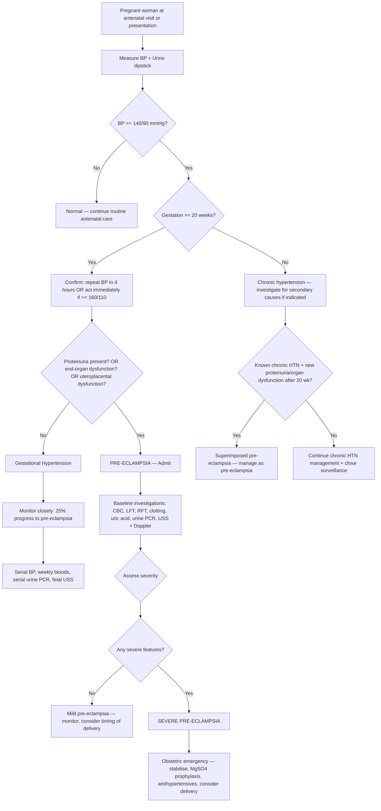

## Diagnostic Criteria, Diagnostic Algorithm, and Investigations for Pre-eclampsia

---

### A. Diagnostic Criteria

#### A1. The NICE 2019 Updated Definition (Current Standard)

***Due to atypical presentation of some patients not having proteinuria, the NICE guidelines have new diagnostic criteria → expanded diagnostic criteria, will include more patients just to be safe*** [1].

***Still must need new-onset HT after 20 weeks, along with 1 of the following*** [1][3]:

| Component | Criterion |
|---|---|
| **Mandatory** | ***New-onset hypertension after 20 weeks of gestation*** (BP ≥ 140/90 mmHg on two occasions ≥ 4 hours apart, OR a single reading ≥ 160/110 if clinically urgent) |
| **PLUS at least ONE of:** | |
| ***Proteinuria*** | ***≥ 300 mg/day*** (24-hour urine), OR urine protein:creatinine ratio ≥ 30 mg/mmol, OR dipstick ≥ 2+ |
| ***Renal dysfunction*** | ***Creatinine ≥ 90 μmol/L*** (or doubling from baseline in absence of other renal disease) [2][3] |
| ***Hepatic dysfunction*** | ***Elevated transaminases (ALT or AST) ± RUQ or epigastric pain*** [2][3] |
| ***Neurological*** | ***Eclampsia, altered mental status, blindness, stroke, clonus, severe headache or visual disturbance*** (not accounted for by alternative diagnosis) [2][3] |
| ***Haematological*** | ***Thrombocytopenia (platelets < 150 × 10⁹/L), DIC, or haemolysis*** [2][3] |
| ***Uteroplacental dysfunction*** | ***IUGR, abnormal umbilical artery Doppler waveform analysis, or stillbirth*** [2][3] |

<Callout title="Critical Conceptual Point" type="error">
***You can develop pre-eclampsia without proteinuria → but you must have hypertension*** [1][4]. This is the single most common exam misconception. The old definition required proteinuria. The modern NICE 2019 definition recognises that ~14% of women who develop eclampsia had no prior proteinuria [2]. The expanded criteria capture these women by including organ dysfunction and uteroplacental dysfunction as alternative qualifying features.
</Callout>

#### A2. How to Confirm Hypertension in Pregnancy

The diagnosis begins with **accurate BP measurement**. This sounds basic, but errors here lead to misdiagnosis.

| Step | Details | Why |
|---|---|---|
| Position | Sitting or semi-recumbent at 45°. NOT supine (aortocaval compression by gravid uterus → falsely low BP) | The gravid uterus compresses the IVC when supine → ↓ venous return → ↓ CO → hypotension |
| Cuff | Appropriate size (large cuff if arm circumference > 33 cm) | Too-small cuff → falsely high readings |
| Arm | At heart level; use the arm with higher reading | Consistency |
| ***Confirmation*** | ***Check BP, confirm HT based on 2 measurements 4 hours apart*** [1] | A single elevated reading could be white-coat effect, anxiety, pain. Two readings ≥ 4 hours apart confirm persistent hypertension |
| Exception | If BP ≥ 160/110 → can act on a SINGLE reading (clinical urgency) | Waiting 4 hours at these levels risks stroke, placental abruption, eclampsia |
| Korotkoff sound | Use **Korotkoff V** (disappearance of sounds) for diastolic BP in pregnancy | Korotkoff IV (muffling) was historically used in pregnancy but is less reproducible |

#### A3. How to Quantify Proteinuria

| Method | Threshold for "Significant" | Pros / Cons |
|---|---|---|
| **Urine dipstick** | ≥ 2+ | Rapid, available at bedside, but poor sensitivity/specificity (false positives with UTI, concentrated urine; false negatives with dilute urine). Used as **screening** |
| ***24-hour urine protein*** | ***≥ 300 mg/day*** | Gold standard for quantification but cumbersome (incomplete collections common, takes 24 hours) |
| **Spot urine protein:creatinine ratio (PCR)** | ≥ 30 mg/mmol | Correlates well with 24-hour collection; rapid; preferred in current practice as alternative to 24-hour collection |
| **Spot urine albumin:creatinine ratio (ACR)** | ≥ 8 mg/mmol (NICE) | More specific for glomerular proteinuria |

<Callout title="Practical Point">
In clinical practice, most centres now use **spot PCR** as the standard method because it is fast and reliable. The 24-hour urine is reserved for borderline cases or when precise quantification is needed. Dipstick is a screening tool only — a positive dipstick should be confirmed with PCR or 24-hour collection.
</Callout>

#### A4. Criteria for Severe Pre-eclampsia / Imminent Eclampsia

***Severe pre-eclampsia or imminent eclampsia*** is defined by the presence of ANY of the following [1][2]:

| Domain | ***Mild*** | ***Severe*** |
|---|---|---|
| ***Convulsions (eclampsia)*** | ***Absent*** | ***Present*** |
| ***Diastolic blood pressure*** | ***> 90 mmHg but < 110 mmHg*** | ***110 mmHg or higher, persistently*** |
| ***Generalised oedema (including face and hands)*** | ***Absent*** | ***Present*** |
| ***Headache*** | ***Absent*** | ***Present*** |
| ***Visual disturbances*** | ***Absent*** | ***Present*** |
| ***Upper abdominal pain*** | ***Absent*** | ***Present*** |
| ***Oliguria*** | ***Absent*** | ***Present ( < 400 mL/24 hr)*** |
| ***Diminished fetal movement*** | ***Absent*** | ***Present*** |

Additional ***lab criteria for severity*** [1][2]:
- ***Thrombocytopenia***
- ***Impaired LFT***
- ***Impaired RFT***
- ***Deranged clotting profile***

***Symptoms of severe pre-eclampsia: headache, visual disturbance, epigastric or RUQ pain, nausea and vomiting*** [1][2].

***Signs: BP ≥ 160/110, proteinuria (3 or 4+ or > 3 g/day), gross and rapidly progressive oedema, brisk jerks or clonus, oliguria ( < 30 mL/h)*** [1][2].

***Lab: thrombocytopenia, impaired LFT, RFT, clotting profile*** [1][2].

<Callout title="Why These Specific Features Define 'Severe'">
Each feature maps directly to the pathophysiology of advanced endothelial dysfunction:
- **Headache/visual disturbance/clonus** → cerebral vasospasm and vasogenic oedema (PRES) → impending eclampsia
- **Epigastric/RUQ pain** → hepatic capsule distension from periportal necrosis → risk of hepatic rupture
- **BP ≥ 160/110** → exceeds cerebral autoregulatory capacity → risk of haemorrhagic stroke
- **Oliguria** → severe renal vasospasm + glomerular endotheliosis → impending AKI
- **Thrombocytopenia + deranged clotting** → microangiopathic process → DIC risk
- **Diminished fetal movement** → fetal hypoxia from placental insufficiency
</Callout>

---

### B. Diagnostic Algorithm

The clinical approach follows a systematic pathway. ***The approach to HT: establishment of diagnosis, differentiate between different causes, and assessment of severity of HT*** [2].

***Most of these women are asymptomatic → when they complain with symptoms, already at the severe end of the spectrum. How can we catch them early? Via regular antenatal screening*** [1][2].

***Check BP, proteinuria by dipstick, ultrasound for fetal movement in every visit*** [1].

### Step-by-Step Walkthrough of the Algorithm

**Step 1 — Screen at every antenatal visit** [1][9]:
- ***Check BP*** at every visit. ***Urinalysis: protein (≥ 2+, pre-eclampsia)*** [9].
- In early pregnancy (booking visit): establish baseline BP. If BP ≥ 140/90 before 20 weeks → chronic HTN.

**Step 2 — Confirm hypertension**:
- ***Confirm HT based on 2 measurements 4 hours apart*** [1].
- If BP ≥ 160/110 → act on single reading (severe hypertension — do not wait 4 hours).

**Step 3 — Classify the hypertensive disorder**:
- Onset < 20 weeks → Chronic HTN.
- Onset ≥ 20 weeks, no proteinuria/organ dysfunction → Gestational HTN.
- Onset ≥ 20 weeks + proteinuria or organ dysfunction → Pre-eclampsia.
- Known chronic HTN + new features after 20 weeks → Superimposed pre-eclampsia.

**Step 4 — Admit and investigate** [1]:
- ***All patients with pre-eclampsia, admit them into the hospital*** [1].
- ***Baseline investigations will be ordered to screen for end-organ dysfunction caused by pre-eclampsia*** [1].

**Step 5 — Assess severity**:
- Use the clinical and laboratory criteria table above to classify as mild vs severe.
- Severe features → obstetric emergency → stabilise and plan delivery.

**Step 6 — Ongoing monitoring**:
- Serial BP (at least 4-hourly, more frequently if severe).
- Serial bloods (at least twice weekly in mild; daily or more in severe).
- Fetal surveillance (daily CTG, serial USS for growth and liquor volume, umbilical artery Doppler).

---

### C. Investigation Modalities

Let's organise all investigations systematically by purpose, expected findings, and interpretation.

#### C1. Baseline Bloods (Maternal End-Organ Assessment)

***Baseline investigations: Bloods — CBC*** [1]. But we need far more than just a CBC. Think of investigations as screening each organ system that pre-eclampsia can damage.

| Investigation | What to Look For | Pathophysiological Basis | Interpretation |
|---|---|---|---|
| **Full blood count (CBC)** | ***Thrombocytopenia (platelets < 150 × 10⁹/L)*** | Platelet consumption at sites of endothelial damage (microangiopathic process); may progress to DIC [6] | Plt < 100 = severe; Plt < 50 = critical (risk of haemorrhage during delivery/surgery). Also check haemoglobin — if Hb paradoxically ↑ in pregnancy → haemoconcentration (intravascular volume depletion from capillary leak) |
| **Peripheral blood smear (PBS)** | Schistocytes (fragmented RBCs) | RBCs sheared by fibrin strands deposited in damaged microvasculature → MAHA [6] | Presence of schistocytes confirms microangiopathic haemolysis → consider HELLP syndrome |
| **LDH** | ↑↑ | Released from damaged tissues (liver, RBCs). Also a marker of haemolysis | ↑ LDH with ↑ indirect bilirubin + ↓ haptoglobin = haemolysis triad (HELLP) |
| **Haptoglobin** | ↓ | Haptoglobin binds free haemoglobin released from lysed RBCs → consumed → low levels | Low haptoglobin = intravascular haemolysis |
| **Indirect bilirubin** | ↑ | Unconjugated bilirubin rises because haemolysed RBCs release haem → metabolised to indirect bilirubin faster than liver can conjugate | Supports haemolysis |
| ***Liver function tests (LFT)*** | ***Elevated transaminases (AST, ALT)*** | Hepatic arteriolar vasospasm → periportal hepatocellular necrosis → enzyme leakage into blood [2][3] | AST/ALT > 2× ULN = severe; AST > 70 = HELLP criterion (Tennessee). ↑ bilirubin may indicate haemolysis or hepatic dysfunction |
| ***Renal function tests (RFT)*** | ***Creatinine ≥ 90 μmol/L*** (or rising from baseline) | Renal vasospasm → ↓ GFR; glomerular endotheliosis [2][3] | In normal pregnancy, creatinine should be LOW (50–70 μmol/L) because GFR ↑ by 50%. So a "normal" non-pregnant creatinine of 90 is actually ABNORMAL in pregnancy |
| **Urea** | ↑ | ↓ GFR → impaired urea clearance | Less specific than creatinine |
| **Uric acid (serum urate)** | ↑ | Pre-eclampsia → ↓ renal urate clearance (due to ↓ GFR and ↑ proximal tubular reabsorption) | ↑ uric acid is one of the earliest biochemical markers of pre-eclampsia; > 350 μmol/L associated with adverse outcomes. Also useful to distinguish from SLE flare (where urate is normal) |
| ***Clotting profile (PT, APTT, fibrinogen)*** | ***Deranged in severe cases*** | DIC: consumption of clotting factors → ↑ PT, ↑ APTT, ↓ fibrinogen [6] | Normal clotting with isolated thrombocytopenia = microangiopathic process (HELLP). Deranged clotting = DIC — much more ominous |
| **D-dimer** | ↑ | Fibrin degradation products from ongoing microthrombus formation and lysis | Less useful in pregnancy because D-dimer is physiologically elevated. Only significant if markedly elevated in context of other DIC markers |
| **Blood group and crossmatch** | — | Anticipate need for transfusion (bleeding from thrombocytopenia/DIC, emergency caesarean section) | Always send early |

<Callout title="The Pregnancy Creatinine Trap" type="error">
In a non-pregnant woman, a creatinine of 85 μmol/L would be considered perfectly normal. But in pregnancy, GFR increases by ~50%, so serum creatinine should fall to 50–70 μmol/L. A "normal" creatinine in a pregnant woman is actually a sign of impaired renal function. ***The NICE threshold of creatinine ≥ 90 μmol/L for diagnosing renal dysfunction in pre-eclampsia*** reflects this pregnancy-specific physiology [2][3].
</Callout>

#### C2. Urine Investigations

| Investigation | Method | Threshold | Purpose |
|---|---|---|---|
| **Urine dipstick** | Bedside rapid test | ≥ 2+ = significant (but confirm with quantitative method) | ***Screening at every antenatal visit*** [1][9]. Quick but imprecise |
| ***24-hour urine protein*** | Collect all urine over 24 hours → measure total protein | ***≥ 300 mg/day = diagnostic*** [2]; > 3 g/day = severe [1] | Gold standard for quantification |
| **Spot urine protein:creatinine ratio (PCR)** | Single random urine sample | ≥ 30 mg/mmol | Equivalent to 300 mg/day in 24-hour collection. Faster, more practical, widely used |
| **Urine microscopy** | Centrifuged urine sample under microscope | Look for RBC casts, dysmorphic RBCs | Helps differentiate from lupus nephritis (active sediment = SLE) vs bland sediment in pre-eclampsia (glomerular endotheliosis) |

#### C3. Fetal Surveillance

***Remember the pathophysiology — poor perfusion to placenta → baby grows less*** [1]. Fetal assessment is integral.

| Investigation | What It Assesses | Key Findings in Pre-eclampsia | Why |
|---|---|---|---|
| **Ultrasound — fetal biometry** | Fetal size (estimated fetal weight, abdominal circumference, head circumference) | ***IUGR*** — EFW or AC < 10th centile for gestational age | Chronic placental insufficiency → ↓ nutrient delivery → asymmetric IUGR (brain-sparing: head circumference relatively preserved, abdominal circumference ↓ because liver glycogen stores depleted first) |
| **Amniotic fluid index (AFI)** | Liquor volume | Oligohydramnios (AFI < 5 cm) | ↓ fetal renal perfusion → ↓ fetal urine output → less amniotic fluid |
| **Umbilical artery Doppler** | Uteroplacental vascular resistance | ***Abnormal Doppler waveform***: ↑ resistance index, ↑ pulsatility index, absent end-diastolic flow (AEDF), reversed end-diastolic flow (REDF) [3] | Poorly remodelled spiral arteries = high-resistance uteroplacental circulation. AEDF/REDF indicates critical placental insufficiency → fetal compromise → may need urgent delivery |
| **Middle cerebral artery (MCA) Doppler** | Fetal cerebral blood flow | ↓ pulsatility index (brain-sparing effect) | In fetal hypoxia, blood is preferentially redistributed to the brain → cerebral vasodilation → ↓ MCA resistance. This is a compensatory mechanism (but indicates fetal distress) |
| **Cardiotocography (CTG)** | Fetal heart rate pattern | Late decelerations, reduced variability, absence of accelerations | Late decelerations = fetal hypoxia from uteroplacental insufficiency (contractions further compromise an already ischaemic placenta). Reduced variability = fetal CNS depression from hypoxia |
| **Biophysical profile (BPP)** | Composite score: tone, movement, breathing, CTG, AFI | ↓ score indicates fetal compromise | Combines multiple parameters for comprehensive assessment |

<Callout title="Umbilical Artery Doppler — Understanding the Waveform from First Principles" type="idea">
In normal pregnancy, the placental vascular bed is a low-resistance circuit (because spiral arteries have been remodelled into wide, floppy conduits). Blood flows forward throughout the cardiac cycle, including diastole → positive end-diastolic flow.

In pre-eclampsia, spiral arteries are narrow and high-resistance → the placental vascular bed resists flow → during diastole (when cardiac output is lowest), flow may slow, stop, or even reverse:
- **High resistance index** = early sign
- **Absent end-diastolic flow (AEDF)** = significant placental compromise → delivery usually indicated within days to a week
- **Reversed end-diastolic flow (REDF)** = critical — blood is flowing BACKWARDS in diastole → immediate delivery usually indicated
</Callout>

#### C4. Biomarkers — sFlt-1/PlGF Ratio (Emerging / Increasingly Used)

| Biomarker | What It Measures | Interpretation |
|---|---|---|
| **PlGF (placental growth factor)** | Angiogenic factor produced by healthy trophoblast | ↓ in pre-eclampsia (anti-angiogenic factors neutralise it) |
| **sFlt-1 (soluble fms-like tyrosine kinase 1)** | Anti-angiogenic factor released by ischaemic placenta | ↑ in pre-eclampsia |
| **sFlt-1/PlGF ratio** | Balance between anti-angiogenic and pro-angiogenic forces | Ratio < 38: pre-eclampsia very unlikely in next 1 week (high negative predictive value > 99%). Ratio ≥ 85 (before 34 wk) or ≥ 110 (after 34 wk): strongly suggestive of pre-eclampsia |

- **NICE 2019** recommends PlGF-based testing between 20–35 weeks when pre-eclampsia is suspected to help **rule out** the diagnosis (excellent negative predictive value).
- This is particularly useful in the grey zone — e.g., a woman with borderline BP elevation and equivocal proteinuria.
- The pathophysiological basis: in pre-eclampsia, the ischaemic placenta releases sFlt-1, which acts as a "decoy receptor" binding and neutralising free VEGF and PlGF in the maternal circulation → ↓ free PlGF and ↑ sFlt-1 → ↑ ratio.

#### C5. Other Investigations as Clinically Indicated

| Investigation | Indication | What It Shows |
|---|---|---|
| **Fundoscopy** | Suspected hypertensive retinopathy / visual symptoms | Arteriolar narrowing, haemorrhages, exudates, papilloedema, serous retinal detachment. Grading by modified Scheie classification [8] |
| **CT/MRI brain** | Persistent neurological symptoms, focal deficits, atypical seizures | PRES: bilateral symmetrical white-matter oedema in posterior parieto-occipital regions on MRI (T2/FLAIR hyperintensity). Also rules out ICH, CVST, SOL |
| **ECG** | Baseline cardiac assessment, especially if chronic HTN | LVH, ischaemic changes |
| **Echocardiography** | Suspected cardiac failure, pulmonary oedema | LV function, diastolic dysfunction, pericardial effusion |
| **CXR** | Suspected pulmonary oedema | Bilateral alveolar shadowing, Kerley B lines, pleural effusion, cardiomegaly |
| **Liver USS** | Severe RUQ pain, suspected subcapsular haematoma or hepatic rupture | Subcapsular haematoma appears as hyperechoic collection under liver capsule; hepatomegaly; free fluid if ruptured |
| **Complement levels (C3, C4) and anti-dsDNA** | Suspected SLE flare vs pre-eclampsia | Low C3/C4 + rising anti-dsDNA = SLE flare. Normal/high complement = pre-eclampsia [5] |
| **ADAMTS13 activity** | Suspected TTP (severe thrombocytopenia + MAHA out of proportion to pre-eclampsia features) | < 10% = TTP [6] |

#### C6. Summary Table of Investigations Organised by Category

| Category | Investigations | Key Findings in Pre-eclampsia |
|---|---|---|
| **Confirm diagnosis** | Serial BP, urine dipstick → PCR or 24-hr urine protein | BP ≥ 140/90; proteinuria ≥ 300 mg/day or PCR ≥ 30 |
| **Haematological** | CBC, PBS, clotting, LDH, haptoglobin, bilirubin | Thrombocytopenia, schistocytes, ↑ LDH, ↓ haptoglobin, ± DIC |
| **Hepatic** | LFT (AST, ALT, bilirubin, albumin) | ↑ AST/ALT; ↓ albumin |
| **Renal** | RFT (creatinine, urea), uric acid, urine microscopy | ↑ creatinine (≥ 90), ↑ uric acid, bland sediment |
| **Fetal** | USS biometry, AFI, umbilical artery Doppler, CTG | IUGR, oligohydramnios, abnormal Doppler, non-reassuring CTG |
| **Biomarkers** | sFlt-1/PlGF ratio | ↑ ratio (↑ sFlt-1, ↓ PlGF) |
| **Imaging (if indicated)** | MRI brain, liver USS, CXR, echo | PRES, subcapsular haematoma, pulmonary oedema |
| **Exclude mimics** | C3/C4, anti-dsDNA, ADAMTS13, blood cultures | Distinguish SLE flare, TTP, sepsis |

---

### D. Monitoring Frequency

| Severity | BP | Bloods | Urine | Fetal |
|---|---|---|---|---|
| **Gestational HTN** | At least twice weekly | Weekly (CBC, LFT, RFT) | Weekly PCR | USS every 2–4 weeks; weekly CTG |
| **Mild pre-eclampsia** | At least 4 times daily | Twice weekly minimum | 24-hr urine or PCR twice weekly | USS every 2 weeks; CTG daily to twice weekly |
| **Severe pre-eclampsia** | Continuous or every 15–30 min | Daily (or more frequently) | Hourly urine output (catheterise) | Continuous CTG; daily Doppler |

***Fluid balance crucial — pre-eclampsia characterised by leaky vessels and endothelial damage → so don't just pump fluids into patient, may cause third spacing and worsen generalised oedema / pulmonary oedema*** [1]. This is why strict **input/output monitoring** is essential, especially in severe disease.

---

### E. First Trimester Screening for Pre-eclampsia Risk (Prevention Context)

While not diagnostic of pre-eclampsia itself, first-trimester screening identifies women at high risk who should receive prophylactic aspirin:

| Component | What It Measures |
|---|---|
| **Maternal risk factors** | Age, BMI, ethnicity, parity, medical history, previous pre-eclampsia |
| **Mean arterial pressure (MAP)** | Average BP at 11–13 weeks |
| **Uterine artery pulsatility index (UtA-PI)** | Doppler assessment of uterine artery resistance at 11–13 weeks — high PI suggests impaired trophoblast invasion |
| **Serum PAPP-A** | Low PAPP-A associated with poor placentation |
| **Serum PlGF** | Low PlGF at 11–13 weeks associated with later development of pre-eclampsia |

The **FMF (Fetal Medicine Foundation) algorithm** combines these factors to calculate individual risk. If risk > 1 in 100, aspirin prophylaxis is recommended before 16 weeks [1].

---

<Callout title="High Yield Summary">

1. **Diagnostic criteria (NICE 2019)**: New-onset HTN after 20 weeks + proteinuria (≥ 300 mg/day) OR renal dysfunction (Cr ≥ 90) OR hepatic dysfunction (↑ AST/ALT ± RUQ pain) OR neurological complications OR haematological (plt < 150, DIC, haemolysis) OR uteroplacental dysfunction (IUGR, abnormal Doppler, stillbirth). Proteinuria is NOT mandatory.
2. **Confirm HTN**: Two readings ≥ 4 hours apart (or single reading if ≥ 160/110).
3. **Quantify proteinuria**: Dipstick for screening → confirm with spot PCR (≥ 30 mg/mmol) or 24-hour urine (≥ 300 mg/day).
4. **Severe features**: BP ≥ 160/110, symptoms (headache, visual disturbance, epigastric pain), signs (clonus, oliguria), labs (thrombocytopenia, deranged LFT/RFT/clotting).
5. **Pregnancy creatinine**: A "normal" creatinine of 90 μmol/L is ABNORMAL in pregnancy (GFR should be ↑ → Cr should be 50–70).
6. **Uric acid**: One of the earliest biochemical markers; helps distinguish from SLE flare.
7. **sFlt-1/PlGF ratio**: Excellent negative predictive value (< 38 → very unlikely pre-eclampsia in next week).
8. **Fetal Doppler**: Absent/reversed end-diastolic flow in umbilical artery = critical placental insufficiency → urgent delivery.
9. **All pre-eclampsia patients are admitted** — even if mild, because of risk of progression to eclampsia.
10. **Fluid management**: Be cautious — leaky endothelium means IV fluids → pulmonary oedema.

</Callout>

---

<ActiveRecallQuiz
  title="Active Recall - Pre-eclampsia: Diagnostic Criteria, Algorithm and Investigations"
  items={[
    {
      question: "State the NICE 2019 diagnostic criteria for pre-eclampsia. Why is proteinuria no longer mandatory?",
      markscheme: "New-onset hypertension after 20 weeks PLUS at least one of: proteinuria >=300mg/day, renal dysfunction (Cr >=90), hepatic dysfunction (elevated AST/ALT +/- RUQ pain), neurological complications (eclampsia, altered mental status, blindness, stroke, clonus, severe headache, visual disturbance), haematological (plt <150, DIC, haemolysis), or uteroplacental dysfunction (IUGR, abnormal Doppler, stillbirth). Proteinuria is not mandatory because ~14-16% of women who develop eclampsia had no prior proteinuria. The expanded criteria capture these atypical presentations.",
    },
    {
      question: "Why is a serum creatinine of 85 micromol/L concerning in a pregnant woman, even though this would be normal in a non-pregnant adult?",
      markscheme: "In normal pregnancy, GFR increases by approximately 50% due to renal vasodilation and increased renal plasma flow. Consequently, serum creatinine should FALL to 50-70 micromol/L. A value of 85 micromol/L, though within the normal non-pregnant range, actually represents significant impairment of renal function in a pregnant woman. The NICE criterion for renal dysfunction in pre-eclampsia is Cr >=90 micromol/L, reflecting this pregnancy-specific physiology.",
    },
    {
      question: "What does absent end-diastolic flow on umbilical artery Doppler mean pathophysiologically, and what is the clinical implication?",
      markscheme: "Normally, remodelled spiral arteries create a low-resistance placental vascular bed allowing continuous forward flow throughout the cardiac cycle including diastole. In pre-eclampsia, defective spiral artery remodelling creates high resistance. During diastole (lowest cardiac output), blood flow slows, stops (AEDF), or reverses (REDF). AEDF indicates significant placental compromise; REDF indicates critical compromise with very high risk of fetal hypoxia, acidosis, and death. AEDF usually requires delivery within days to a week; REDF often requires immediate delivery.",
    },
    {
      question: "List the laboratory investigations you would order in a woman newly diagnosed with pre-eclampsia and explain one key finding for each organ system being assessed.",
      markscheme: "Haematological: CBC (thrombocytopenia - platelet consumption at damaged endothelium), PBS (schistocytes - MAHA), clotting profile (deranged PT/APTT/fibrinogen if DIC), LDH/haptoglobin/indirect bilirubin (haemolysis markers). Hepatic: LFT - elevated AST/ALT from periportal hepatocellular necrosis. Renal: RFT - Cr >=90 abnormal in pregnancy (due to expected 50% GFR increase), uric acid elevated (decreased renal clearance, early marker). Urine: PCR or 24h protein (>=300mg/day). Also: blood group and crossmatch, and consider sFlt-1/PlGF ratio.",
    },
    {
      question: "What is the sFlt-1/PlGF ratio and how is it used clinically in suspected pre-eclampsia?",
      markscheme: "sFlt-1 is an anti-angiogenic factor released by the ischaemic placenta that acts as a decoy receptor binding and neutralising VEGF and PlGF. PlGF is a pro-angiogenic factor from healthy trophoblast. In pre-eclampsia, sFlt-1 is elevated and PlGF is low, so the ratio is high. Clinical use: ratio <38 has a >99% negative predictive value for pre-eclampsia in the next 1 week (excellent rule-out test). Ratio >=85 before 34 weeks or >=110 after 34 weeks is strongly suggestive. NICE recommends PlGF-based testing between 20-35 weeks when pre-eclampsia is suspected, especially useful in borderline presentations.",
    },
  ]}
/>

## References

[1] Lecture slides: Block C - Hypertension and Pregnancy (CFB WCS in 2023_24).pdf
[2] Lecture slides: GC 224. Hypertension and Pregnancy.pdf
[3] Lecture slides: GC 115. I am pregnant medical problems complicating pregnancy.pdf
[4] Lecture slides: Block C - I am pregnant_ medical problems complicating pregnancy.pdf
[5] Senior notes: Ryan Ho Rheumatology.pdf (p73 — SLE, APS, complement levels)
[6] Senior notes: Ryan Ho Haemtology.pdf (p137 — TMA, DIC, MAHA)
[8] Senior notes: Maksim Medicine Notes.pdf (p78 — Hypertension investigation, fundoscopy grading)
[9] Senior notes: Ryan Ho Fundamentals.pdf (p191 — Obstetric examination, antenatal screening)
