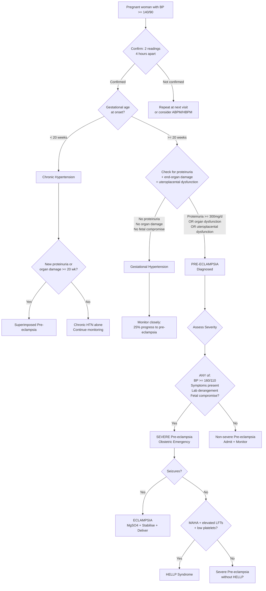

## Diagnostic Criteria, Diagnostic Algorithm, and Investigations for Pre-eclampsia

---

### A. Diagnostic Criteria

Let's start from first principles. Pre-eclampsia is a **clinical diagnosis** — there is no single pathognomonic test. You diagnose it by demonstrating: (1) new-onset hypertension after 20 weeks, AND (2) evidence that the disease has affected end-organs or the uteroplacental unit.

#### 1. Blood Pressure Criteria

**How to measure BP in pregnancy:**
- Patient seated or in left lateral position (to avoid aortocaval compression by the gravid uterus)
- Appropriate cuff size (common error: too small cuff → falsely elevated reading)
- Use **Korotkoff V** (disappearance of sounds) for diastolic BP — previously Korotkoff IV was used in pregnancy but current guidelines recommend V
- ***Confirm HT based on 2 measurements 4 hours apart*** [1]

| Category | Systolic | Diastolic |
|---|---|---|
| Hypertension in pregnancy | ≥ 140 mmHg | OR ≥ 90 mmHg |
| ***Severe hypertension*** | ***≥ 160 mmHg*** | ***OR ≥ 110 mmHg*** [1][2] |

Why the 4-hour interval? Because transient BP elevation (white coat effect, pain, anxiety) is common — you need to confirm it is sustained. However, if BP ≥ 160/110 on a single reading and the clinical picture is consistent, **treat immediately** — don't wait 4 hours.

#### 2. Updated NICE 2019 Diagnostic Criteria [2][3][9]

> ***Due to atypical presentation of some patients not having proteinuria, the NICE guidelines have new diagnostic criteria → expanded diagnostic criteria, will include more patients just to be safe*** [1]

> ***Still must need new-onset HT after 20 weeks, along with 1 of the following*** [1]:

**New-onset hypertension after 20 weeks** PLUS **one or more** of the following new-onset conditions:

| Domain | Criteria | Pathophysiological Basis |
|---|---|---|
| ***Proteinuria*** | ***≥ 300 mg/day*** (or protein:creatinine ratio ≥ 30 mg/mmol, or ≥ 2+ on dipstick if quantitative methods unavailable) [1][2] | Glomerular endotheliosis → disrupted filtration barrier → protein leak |
| ***Renal*** | ***Creatinine ≥ 90 μmol/L*** (or doubling from baseline in absence of other renal disease) [2][3] | Renal cortical vasoconstriction + glomerular endotheliosis → ↓GFR |
| ***Hepatic*** | ***Elevated transaminases (ALT or AST) ± RUQ or epigastric pain*** [2][3] | Hepatic sinusoidal endothelial damage → fibrin deposition → periportal necrosis → capsular distension |
| ***Neurological*** | ***Eclampsia, altered mental status, blindness, stroke, clonus, severe headache or visual disturbance*** [2][3] | Cerebral vasospasm or PRES → ischaemia/vasogenic oedema in posterior circulation |
| ***Haematological*** | ***Thrombocytopenia (platelets < 150 × 10⁹/L), DIC or haemolysis*** [2][3] | Endothelial damage → platelet consumption + coagulation activation + MAHA |
| ***Uteroplacental dysfunction*** | ***IUGR, abnormal umbilical artery Doppler waveform analysis, or stillbirth*** [2][3] | Failed spiral artery remodelling → placental ischaemia → ↓fetal nutrient/O₂ delivery |

> ***Meaning that by definition of diagnostic criteria, you can develop pre-eclampsia without proteinuria → but you must have hypertension*** [9]

<Callout title="Why was the definition expanded?">
The old definition required proteinuria. But we now know that some women develop severe end-organ damage (liver failure, eclampsia, DIC) BEFORE proteinuria appears — or without proteinuria at all. The expanded criteria capture these women earlier, preventing catastrophic outcomes. The unifying principle is **endothelial dysfunction**, which can manifest differently in different vascular beds. Some women's glomeruli are relatively spared while their livers or brains bear the brunt.
</Callout>

#### 3. Severity Criteria

> ***Severe pre-eclampsia or imminent eclampsia:***
> - ***Symptoms: headache, visual disturbance, epigastric or RUQ pain, nausea and vomiting***
> - ***Signs: BP ≥ 160/110, proteinuria (3 or 4+ or > 3g/d), gross and rapidly progressive oedema, brisk jerks or clonus, oliguria (< 30 mL/h)***
> - ***Lab: thrombocytopenia, impaired LFT, RFT, clotting profile*** [1][2]

| ***Finding*** | ***Mild*** | ***Severe*** |
|---|---|---|
| ***Convulsions (eclampsia)*** | ***Absent*** | ***Present*** |
| ***Diastolic Blood Pressure*** | ***> 90 mmHg but < 110 mmHg*** | ***110 mmHg or higher persistently*** |
| ***Generalised oedema (including face and hands)*** | ***Absent*** | ***Present*** |
| ***Headache*** | ***Absent*** | ***Present*** |
| ***Visual Disturbances*** | ***Absent*** | ***Present*** |
| ***Upper Abdominal Pain*** | ***Absent*** | ***Present*** |
| ***Oliguria*** | ***Absent*** | ***Present (< 400 mL/24h)*** |
| ***Diminished fetal movement*** | ***Absent*** | ***Present*** |

[1][2]

<Callout title="Clinical Pearl" type="error">
***Most of these women are asymptomatic → when they complain with symptoms, already severe end of spectrum*** [1]. The appearance of **any** symptom (headache, visual changes, epigastric pain) should immediately escalate your level of concern. Don't wait for "textbook" severe pre-eclampsia — a single warning symptom in the context of HTN after 20 weeks demands urgent evaluation.
</Callout>

#### 4. HELLP Syndrome Diagnostic Criteria (Tennessee Classification)

Since HELLP is a severe variant of pre-eclampsia, it has its own laboratory criteria:

| Component | Criterion | What to order |
|---|---|---|
| **Haemolysis** | Abnormal PBS (schistocytes), LDH > 600 IU/L, total bilirubin > 20 μmol/L | PBS, LDH, bilirubin, haptoglobin |
| **Elevated Liver Enzymes** | AST or ALT > 70 IU/L (or > 2× ULN) | LFT |
| **Low Platelets** | Platelets < 100 × 10⁹/L | CBC |

Partial HELLP (only 1–2 of 3 components present) is recognised and still requires close monitoring as it frequently progresses.

---

### B. Diagnostic Algorithm

Here is the systematic approach when a pregnant woman presents with hypertension:

> ***Your general approach to a patient you are suspecting to have pre-eclampsia:***
> 1. ***Check BP, confirm HT based on 2 measurements 4 hours apart***
> 2. ***Quantify urine protein***
> 3. ***Then depending on severity of the condition, fast the patient just in case an emergency OT is necessary***
> 4. ***All patients with pre-eclampsia, admit them into the hospital*** [1]

> ***If a lady at 24 weeks meets pre-eclampsia diagnostic criteria, it is a tough but necessary decision to hospitalise them for the next 13 weeks until they deliver at 37 weeks → cannot risk them developing eclampsia in the outpatient setting. Chance of developing eclampsia from pre-eclampsia is < 1%, so actually very low → however, due to several cases of this in HK in the past, we play it safe just in case*** [1]

---

### C. Investigations — Systematic Approach

> ***Baseline investigations will be ordered to screen for end-organ dysfunction caused by pre-eclampsia*** [1]

The purpose of investigations in pre-eclampsia is threefold:
1. **Confirm the diagnosis** (BP + proteinuria/organ damage)
2. **Assess severity and end-organ involvement** (is this mild or severe?)
3. **Monitor for progression and guide timing of delivery**

I'll organise these by modality, explaining what each test tells you and why you order it.

---

#### 1. Blood Pressure Assessment

| Modality | Details | Interpretation |
|---|---|---|
| **Office BP** | Seated/left lateral, appropriate cuff, 2 readings 4h apart | ≥ 140/90 = HTN; ≥ 160/110 = severe |
| **ABPM (Ambulatory BP Monitoring)** | 24-hour automated readings | Gold standard for confirming HTN; detects white coat HTN. Indicated when office BP is variable or to confirm diagnosis [10] |
| **HBPM (Home BP Monitoring)** | Patient self-monitors | Useful for ongoing monitoring; correlates better with prognosis than office BP |

Why not just rely on a single office reading? Because anxiety, pain, and the "white coat effect" are common in pregnant women. ***Ambulatory BP monitoring is indicated when there is increased office BP in pregnant women → to suspect pre-eclampsia*** [10].

---

#### 2. Urine Assessment — Quantifying Proteinuria

| Test | Method | Interpretation | Pitfalls |
|---|---|---|---|
| **Urine dipstick** | Semiquantitative; quick bedside test | ≥ 2+ suggests significant proteinuria | **High false-positive rate** (dehydration, concentrated urine, UTI, exercise). High false-negative rate too. Should be confirmed with quantitative method |
| **Spot urine protein:creatinine ratio (PCR)** | Random sample; corrects for urine concentration | **≥ 30 mg/mmol** = significant proteinuria (equivalent to ~300 mg/day) | Preferred first-line quantitative method — fast and convenient |
| **Spot urine albumin:creatinine ratio (ACR)** | More specific for glomerular protein | **≥ 8 mg/mmol** = significant | Alternative to PCR |
| **24-hour urine protein collection** | Gold standard for quantification | ***≥ 300 mg/day*** = significant proteinuria; ***> 3 g/day*** = severe [1][2] | Cumbersome, prone to collection errors, delays diagnosis by 24h. Increasingly replaced by spot PCR |

**Why does proteinuria matter?** It reflects glomerular endotheliosis — the pathognomonic renal lesion of pre-eclampsia. The degree of proteinuria roughly (but imperfectly) correlates with disease severity. However, remember: proteinuria is a **lagging indicator** — organ damage can precede detectable proteinuria.

<Callout title="Urine Dipstick Alone Is Not Enough" type="error">
A negative dipstick does NOT rule out pre-eclampsia. ***Around 1 in 6 will have normal BP and no proteinuria prior to eclampsia*** [1]. If clinical suspicion is high (symptoms, lab derangement), proceed with full workup regardless of dipstick result. Always confirm with a quantitative method (PCR or 24h collection).
</Callout>

---

#### 3. Haematological Investigations

> ***Bloods: CBC*** [1]

| Test | What to look for | Interpretation and Pathophysiology |
|---|---|---|
| **Full blood count (CBC)** | Haemoglobin, platelet count | ***Thrombocytopenia (platelets < 150 × 10⁹/L)*** indicates platelet consumption at sites of damaged endothelium [2]. Hb may be ↑ (haemoconcentration from reduced plasma volume) or ↓ (haemolysis). A **falling platelet trend** is as important as the absolute number |
| **Peripheral blood smear (PBS)** | Schistocytes (red cell fragments) | Schistocytes = MAHA = red cells being sheared by fibrin strands in damaged microvasculature. Their presence indicates TMA/HELLP. Also look for polychromasia (reticulocyte response to haemolysis) [7] |
| **LDH (Lactate Dehydrogenase)** | Elevation | ↑LDH > 600 IU/L = haemolysis (released from lysed RBCs) and/or tissue necrosis (liver). Non-specific but very useful — a rapidly rising LDH is alarming |
| **Haptoglobin** | Depletion | Haptoglobin binds free haemoglobin released from lysed RBCs → consumed → low/undetectable. Low haptoglobin confirms intravascular haemolysis |
| **Indirect bilirubin** | Elevation | Haem from lysed RBCs is converted to unconjugated (indirect) bilirubin → ↑ in haemolysis |
| **Coagulation profile (PT, aPTT, fibrinogen, D-dimer)** | DIC screen | ***Impaired clotting profile*** [1][2]: ↑PT, ↑aPTT = consumption of clotting factors; ↓fibrinogen = consumed in microthrombi; ↑D-dimer = fibrin degradation. Full DIC = acute decompensated DIC with predominantly bleeding tendency [7] |

**Why check coagulation?** Pre-eclampsia/HELLP can trigger DIC (intravascular activation of coagulation from widespread endothelial damage). This is critical to detect before any surgical delivery — you need to know if the patient can clot before you cut.

---

#### 4. Biochemistry — Renal Function

| Test | Finding | Interpretation |
|---|---|---|
| **Serum creatinine** | ***≥ 90 μmol/L*** (or doubling from baseline) [2][3] | Indicates renal involvement. In normal pregnancy, creatinine is **lower** than non-pregnant values (~50–60 μmol/L) because GFR increases by ~50%. So a creatinine of 90 μmol/L in pregnancy is equivalent to significant renal impairment — don't be fooled by "normal-looking" numbers |
| **Blood urea nitrogen (BUN)** | Elevated | Less specific than creatinine; also ↑ in dehydration, GI bleeding |
| **Uric acid (serum urate)** | Elevated (> 350 μmol/L) | ↑ in pre-eclampsia due to ↓renal excretion (vasoconstriction → ↓GFR) + ↑production from tissue ischaemia. Historically used as a severity marker — rising urate often precedes other derangements. **Not diagnostic** but a useful trend marker |
| **Electrolytes (Na, K)** | Usually normal | Monitor for safety, especially before MgSO₄ administration. Hyperkalaemia may occur in AKI |

<Callout title="Normal Creatinine in Pregnancy Is LOW" type="idea">
In normal pregnancy, plasma volume expands ~50% and GFR increases proportionally. So "normal" non-pregnant creatinine (60–110 μmol/L) would actually be **abnormally high** in pregnancy. A pregnant woman's creatinine should be ~50–60 μmol/L. A value of 90 μmol/L indicates significant renal compromise — this is why the NICE criteria threshold is set at 90 μmol/L, which would seem "normal" outside pregnancy but is clearly abnormal within it.
</Callout>

---

#### 5. Biochemistry — Liver Function

| Test | Finding | Interpretation |
|---|---|---|
| **ALT and AST** | ***Elevated (> 2× ULN)*** [2][3] | Hepatocellular damage from sinusoidal obstruction, fibrin deposition, periportal necrosis. AST may be elevated disproportionately to ALT in HELLP (because LDH is also measured in AST assay, and haemolysis contributes) |
| **Total and direct bilirubin** | ↑ total bilirubin (predominantly indirect) | Indirect hyperbilirubinaemia = haemolysis. If direct fraction also ↑ → cholestasis or severe hepatocellular damage |
| **Albumin** | Low | ↓ hepatic synthesis + ↑ capillary leak (protein lost into interstitium → oedema) + dilutional effect of expanded plasma volume |
| **LDH** | Elevated (often > 600 IU/L in HELLP) | Dual source: haemolysis + liver necrosis. Very sensitive but non-specific |

---

#### 6. Angiogenic Biomarkers — sFlt-1/PlGF Ratio

This is a **newer and increasingly important** investigation:

| Test | Finding in Pre-eclampsia | Clinical Utility |
|---|---|---|
| **sFlt-1 (soluble fms-like tyrosine kinase 1)** | ↑↑ (released by ischaemic placenta; binds and neutralises VEGF/PlGF) | Anti-angiogenic factor |
| **PlGF (Placental Growth Factor)** | ↓↓ (sequestered by sFlt-1 + reduced production by damaged placenta) | Pro-angiogenic factor |
| **sFlt-1/PlGF ratio** | **Elevated** | **Ratio > 38** (Elecsys assay): high positive predictive value for pre-eclampsia. **Ratio < 38**: high negative predictive value — effectively rules out pre-eclampsia developing within the next week. NICE 2019 recommends PlGF-based testing between 20 and 36+6 weeks to help **rule out** pre-eclampsia |

**Why is this test useful?**
- It reflects the underlying pathophysiology (anti-angiogenic imbalance) rather than just downstream manifestations
- The **negative predictive value is exceptionally high** (~99.3%) — if the ratio is normal, you can be very reassured
- Helps distinguish pre-eclampsia from other causes of HTN/proteinuria in pregnancy (e.g. chronic HTN, CKD, SLE flare — all of which have a normal ratio)
- Helps identify women who will develop pre-eclampsia within the next 1–4 weeks (allows planning)

---

#### 7. Fetal Assessment — Uteroplacental Dysfunction

> ***Uteroplacental dysfunction e.g. IUGR, abnormal umbilical artery Doppler waveform analysis, or stillbirth*** [2][3]

| Investigation | What it assesses | Key Findings |
|---|---|---|
| **Ultrasound biometry** | Fetal growth (estimated fetal weight, abdominal circumference) | ***IUGR*** — EFW or AC < 10th centile for gestational age. Serial measurements (every 2 weeks) show crossing of centile lines (faltering growth) |
| **Umbilical artery Doppler** | Placental vascular resistance | ***Abnormal waveforms***: raised pulsatility index → absent end-diastolic flow (AEDF) → reversed end-diastolic flow (REDF) [3]. AEDF/REDF indicate severely compromised placental perfusion — imminent fetal danger |
| **Middle cerebral artery (MCA) Doppler** | Fetal cerebral redistribution | Low PI (increased diastolic flow) = "brain-sparing effect" — fetus is preferentially shunting blood to the brain at the expense of other organs. Indicates chronic hypoxia |
| **Cerebroplacental ratio (CPR)** | MCA PI / UA PI | Low CPR (< 1) indicates fetal compromise even when individual Dopplers are borderline |
| **Amniotic fluid index (AFI)** | Amniotic fluid volume | Oligohydramnios (AFI < 5 cm or deepest pocket < 2 cm) — reflects fetal renal hypoperfusion (blood redirected away from kidneys to brain) |
| **Cardiotocography (CTG)** | Fetal heart rate pattern | Look for: reduced variability, late decelerations (both indicate fetal hypoxia), absent accelerations. A pathological CTG may mandate emergency delivery |
| **Biophysical profile (BPP)** | Composite score: CTG + fetal breathing + fetal movements + fetal tone + AFI | Score 0–8 (or 0–10 with CTG). Low score (≤ 4) = significant fetal compromise |
| **Uterine artery Doppler** | Uterine artery resistance (reflects spiral artery remodelling) | High PI with bilateral notching in the 2nd trimester suggests failed spiral artery remodelling — used as a **screening/prediction** tool rather than diagnostic. Note: most useful at 20–24 weeks as a risk prediction tool |

---

#### 8. Additional Investigations for Differential Diagnosis

These are ordered when the clinical picture is atypical or a mimic is suspected:

| Investigation | Purpose | When to order |
|---|---|---|
| **ADAMTS13 activity** | Rule out TTP | MAHA + very low platelets (< 30) + neurological features. If < 10% → TTP |
| **Complement levels (C3, C4)** | Distinguish SLE flare vs pre-eclampsia | Low → SLE flare or aHUS. Normal/high → pre-eclampsia |
| **Anti-dsDNA, ANA** | SLE flare | Rising titres suggest active SLE |
| **Antiphospholipid antibodies** | APS | Recurrent pregnancy loss, thrombosis history [5] |
| **Blood glucose** | AFLP | Hypoglycaemia = liver failure (AFLP) |
| **Ammonia** | AFLP | Elevated = hepatic encephalopathy |
| **Plasma/urine metanephrines** | Phaeochromocytoma | Paroxysmal HTN + headache + sweating + palpitations [4] |
| **Bile acids** | Intrahepatic cholestasis of pregnancy | Pruritus + ↑bile acids + ↑LFTs; no HTN or proteinuria |

---

#### 9. Summary — The "Baseline Investigation Panel" for Pre-eclampsia

> ***Baseline investigations will be ordered to screen for end-organ dysfunction*** [1]:

| Domain | Tests |
|---|---|
| **Haematological** | ***CBC*** [1], PBS, coagulation profile (PT, aPTT, fibrinogen), LDH, haptoglobin |
| **Renal** | RFT (creatinine, BUN, uric acid), electrolytes |
| **Hepatic** | LFT (ALT, AST, bilirubin, albumin, LDH) |
| **Proteinuria** | Spot urine PCR (or 24h urine protein if needed) |
| **Angiogenic markers** | sFlt-1/PlGF ratio (if available, 20–36+6 weeks) |
| **Fetal** | Ultrasound (biometry + AFI + Doppler), CTG |

These should be repeated **serially** (at least twice weekly in severe pre-eclampsia, or more frequently if deteriorating) because the hallmark of pre-eclampsia is **progression**.

---

### D. Monitoring and Frequency

| Severity | BP Monitoring | Bloods | Fetal Assessment |
|---|---|---|---|
| **Non-severe pre-eclampsia** | At least 4× daily | Twice weekly (CBC, LFT, RFT, coag) | Twice weekly CTG; serial USS every 2 weeks |
| **Severe pre-eclampsia** | Continuous or every 15–30 min | Daily or more frequently | Continuous CTG; daily umbilical artery Doppler if IUGR |
| **Gestational hypertension** | At least 2× weekly | Weekly (to detect progression to pre-eclampsia) | Serial USS every 2–4 weeks |

> ***Fluid balance is crucial. Pre-eclampsia is characterised by leaky vessels and endothelial damage → so don't just pump fluids into patient, may cause third spacing and worsen generalised oedema / pulmonary oedema*** [1]

Therefore, **strict fluid balance** monitoring (input/output chart, consider urinary catheter in severe cases for hourly output) is an essential part of the investigation and monitoring framework.

---

### E. First-Trimester Screening / Prediction (Brief Note)

While not "diagnostic" per se, current practice increasingly incorporates **first-trimester combined screening** for pre-eclampsia (e.g. the **FMF algorithm** — Fetal Medicine Foundation):

| Component | What it measures |
|---|---|
| **Maternal factors** | Age, BMI, ethnicity, medical history, parity, mode of conception |
| **Mean arterial pressure (MAP)** | Average of 3 readings at 11–13+6 weeks |
| **Uterine artery pulsatility index (UtA-PI)** | Doppler at 11–13+6 weeks; high PI suggests impaired early placentation |
| **Serum PAPP-A** | Low PAPP-A = poor placental function |
| **Serum PlGF** | Low PlGF in 1st trimester predicts later pre-eclampsia |

Combined, these give a **patient-specific risk** that determines whether prophylactic aspirin should be started. Detection rate for early-onset pre-eclampsia is approximately **90%** at a 10% false-positive rate using this combined approach.

---

<Callout title="High Yield Summary">

**Diagnostic Criteria (NICE 2019)**: New-onset HTN (≥ 140/90 on 2 readings 4h apart) after 20 weeks + ONE of: proteinuria ≥ 300 mg/day, renal dysfunction (Cr ≥ 90), hepatic involvement (↑ALT/AST ± RUQ pain), neurological features, haematological features (plt < 150, DIC, haemolysis), or uteroplacental dysfunction (IUGR, abnormal Doppler, stillbirth). **Proteinuria is no longer mandatory** if other organ dysfunction is present.

**Severity Assessment**: Severe = BP ≥ 160/110, symptoms (headache, visual disturbance, epigastric pain), oliguria, thrombocytopenia, impaired LFT/RFT/clotting, fetal compromise. Most patients are asymptomatic — symptoms indicate the severe end.

**Key Investigations**: CBC (platelets!), PBS (schistocytes), LFT (ALT/AST), RFT (creatinine — remember normal in pregnancy is ~50–60 μmol/L), coagulation profile, LDH, haptoglobin, spot urine PCR, sFlt-1/PlGF ratio (< 38 rules out pre-eclampsia with ~99% NPV), and fetal assessment (USS biometry, umbilical artery Doppler, CTG).

**HELLP Criteria (Tennessee)**: Haemolysis (schistocytes, LDH > 600, ↑bilirubin), Elevated Liver enzymes (AST/ALT > 70 or > 2× ULN), Low Platelets (< 100).

**Admit ALL pre-eclampsia patients**. Monitor BP, bloods, and fetal status serially. Fluid balance is critical — leaky vessels mean IV fluids can cause pulmonary oedema.

**sFlt-1/PlGF ratio** is the best "rule-out" test: ratio < 38 has ~99% NPV for pre-eclampsia within the next week.

</Callout>

---

<ActiveRecallQuiz
  title="Active Recall - Pre-eclampsia Diagnostic Criteria, Algorithm and Investigations"
  items={[
    {
      question: "List the six domains of end-organ dysfunction in the NICE 2019 diagnostic criteria for pre-eclampsia. For each, state one specific threshold or finding.",
      markscheme: "1. Proteinuria: >= 300 mg/day (or PCR >= 30 mg/mmol). 2. Renal: creatinine >= 90 umol/L. 3. Hepatic: elevated ALT or AST, with or without RUQ/epigastric pain. 4. Neurological: eclampsia, altered mental status, blindness, stroke, clonus, severe headache, visual disturbance. 5. Haematological: thrombocytopenia (plt < 150), DIC, or haemolysis. 6. Uteroplacental: IUGR, abnormal umbilical artery Doppler, or stillbirth."
    },
    {
      question: "Why is a serum creatinine of 90 umol/L considered abnormally high in pregnancy, even though it falls within the normal non-pregnant range?",
      markscheme: "In normal pregnancy, plasma volume expands by approximately 50% and GFR increases proportionally. Normal pregnant creatinine is around 50-60 umol/L. Therefore 90 umol/L represents a significant decline in GFR relative to the expected pregnancy physiology, equivalent to substantial renal impairment. The NICE criteria use this lower threshold to account for the physiological changes of pregnancy."
    },
    {
      question: "What is the sFlt-1/PlGF ratio and how is it used clinically in suspected pre-eclampsia? What ratio threshold is used and what is its most clinically useful property?",
      markscheme: "sFlt-1 is an anti-angiogenic factor released by the ischaemic placenta that binds and neutralises VEGF and PlGF. PlGF is a pro-angiogenic factor that is reduced in pre-eclampsia. The sFlt-1/PlGF ratio above 38 (Elecsys assay) suggests pre-eclampsia. Its most useful property is the very high negative predictive value (approximately 99%) when the ratio is below 38, effectively ruling out pre-eclampsia developing within the next 1 week. Used between 20 and 36+6 weeks. Also helps differentiate pre-eclampsia from mimics like SLE flare which have a normal ratio."
    },
    {
      question: "A woman at 30 weeks gestation with pre-eclampsia has a falling platelet count, LDH of 750, schistocytes on peripheral blood smear, and AST of 280. State the diagnosis and the three specific Tennessee classification criteria for this condition.",
      markscheme: "Diagnosis: HELLP syndrome. Tennessee criteria: (1) Haemolysis - abnormal PBS with schistocytes, LDH > 600 IU/L, total bilirubin > 20 umol/L; (2) Elevated Liver enzymes - AST or ALT > 70 IU/L or > 2x upper limit of normal; (3) Low Platelets - platelet count < 100 x 10^9/L."
    },
    {
      question: "Describe the sequential changes in umbilical artery Doppler as placental vascular resistance progressively worsens in pre-eclampsia. What is the most ominous finding?",
      markscheme: "Progressive worsening: (1) raised pulsatility index (high resistance), then (2) absent end-diastolic flow (AEDF) indicating severely increased placental resistance, then (3) reversed end-diastolic flow (REDF) which is the most ominous finding, indicating that resistance in the placental vascular bed is so high that blood flows backwards during diastole. AEDF and especially REDF indicate imminent fetal danger and typically mandate urgent delivery."
    }
  ]}
/>

## References

[1] Lecture slides: Block C - Hypertension and Pregnancy (CFB WCS in 2023_24).pdf
[2] Lecture slides: GC 224. Hypertension and Pregnancy.pdf
[3] Lecture slides: GC 115. I am pregnant medical problems complicating pregnancy.pdf
[4] Senior notes: Maksim Medicine Notes.pdf (p78, Hypertension DDx and investigations)
[5] Senior notes: Ryan Ho Rheumatology.pdf (p73, Antiphospholipid syndrome)
[7] Senior notes: Ryan Ho Haemtology.pdf (p137–138, MAHA, TMA, DIC)
[9] Lecture slides: Block C - I am pregnant_ medical problems complicating pregnancy.pdf
[10] Senior notes: Ryan Ho Cardiology.pdf (p175, ABPM indications in pregnancy)
