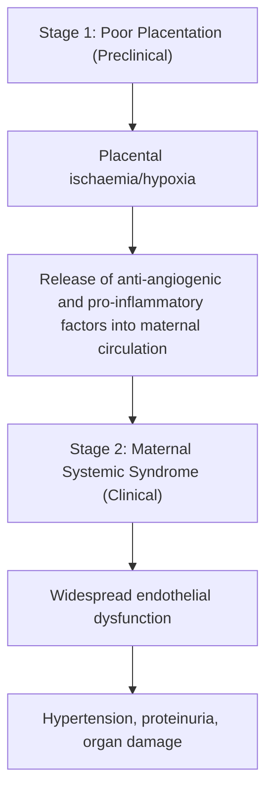

# Pre-eclampsia

## 1. Definition

Pre-eclampsia — let's break down the name first. "Pre-" = before, "eclampsia" = from Greek *eklampsis* meaning "a shining forth" or "sudden flashing," historically referring to the sudden onset of convulsions. So pre-eclampsia is literally the state *before* seizures occur. Eclampsia itself is the end-stage complication — generalised tonic-clonic seizures in the setting of pre-eclampsia [1].

***Pre-eclampsia is a pregnancy-specific multisystem disorder characterised by new-onset hypertension after 20 weeks of gestation with one or more of the following: proteinuria, other maternal organ dysfunction, or uteroplacental dysfunction*** [2][3].

The ***updated definition from NICE 2019*** [2] requires:
- **New onset of hypertension after 20 weeks** of gestation, PLUS at least one of:
  - ***Proteinuria ( ≥ 300 mg/day)***
  - ***Other maternal organ dysfunction:***
    - ***Renal: creatinine ≥ 90 μmol/L***
    - ***Hepatic: elevated transaminases (ALT or AST) ± right upper quadrant (RUQ) or epigastric pain***
    - ***Neurological: eclampsia, altered mental status, blindness, stroke, clonus, severe headache or visual disturbance***
    - ***Haematological: thrombocytopenia (platelets < 150 × 10⁹/L), DIC or haemolysis***
  - ***Uteroplacental dysfunction: e.g. IUGR, stillbirth*** [2]

<Callout title="Key Conceptual Shift" type="idea">
The ***old classical triad*** of pre-eclampsia was ***hypertension, proteinuria, and generalised oedema*** [1]. However, modern definitions have moved away from this because (1) oedema is extremely common in normal pregnancy and is non-specific, and (2) pre-eclampsia can occur WITHOUT proteinuria — it is the *end-organ damage* that matters. You can diagnose pre-eclampsia with hypertension + thrombocytopenia alone, for example.
</Callout>

<Callout title="Why 20 weeks?" type="error">
***Pre-eclampsia occurs in the 2nd half of pregnancy — anytime after 20 weeks. Anything before 20 weeks is NOT considered an effect of pregnancy but rather pre-existing (chronic) hypertension*** [1]. This is because the pathological process (defective placentation → inadequate spiral artery remodelling) manifests clinically only from the mid-second trimester onward, when placental demands outstrip the compromised uteroplacental blood supply.
</Callout>

### Defining the Blood Pressure Thresholds

| Term | Systolic (mmHg) | Diastolic (mmHg) |
|------|:-:|:-:|
| Hypertension in pregnancy | ≥ 140 | ≥ 90 |
| Severe hypertension in pregnancy | ≥ 160 | ≥ 110 |

- BP should be measured on **two occasions at least 4 hours apart** (or on a single occasion if severely elevated ≥ 160/110 and clinical urgency demands action).
- ***Eclampsia is the end-stage of pre-eclampsia — generalised tonic-clonic seizures*** [1].

---

## 2. Epidemiology

### Global Burden
- Pre-eclampsia complicates approximately **2–8%** of all pregnancies worldwide.
- It is a leading cause of maternal and perinatal morbidity and mortality globally, contributing to an estimated **76,000 maternal deaths** and **500,000 fetal/neonatal deaths** per year.
- In low-resource settings, case fatality rates are substantially higher due to delayed diagnosis and limited access to MgSO₄ and emergency obstetric care.

### Hong Kong Context
- Incidence in Hong Kong is approximately **1–3%** of pregnancies.
- Hong Kong has an ageing maternal population (more women delaying childbirth → older maternal age is a risk factor) and high rates of IVF/assisted reproduction (→ more multiple pregnancies → higher pre-eclampsia risk).
- The prevalence of chronic hypertension, diabetes, and obesity — all risk factors for pre-eclampsia — is rising in the HK population.
- Despite this, maternal mortality from pre-eclampsia in HK is very low due to robust antenatal screening, access to tertiary care, and early intervention.

### Key Epidemiological Points
- **Nulliparity** is the single most common risk factor — approximately 75% of pre-eclampsia cases occur in first pregnancies.
- Recurrence risk in subsequent pregnancies is approximately **15–20%** (higher if early-onset or severe in first pregnancy).
- ***Pre-eclampsia has long-term cardiovascular consequences*** for the mother — women with a history of pre-eclampsia have a **2–4× increased lifetime risk** of chronic hypertension, ischaemic heart disease, stroke, and chronic kidney disease.

---

## 3. Risk Factors (Predisposing Factors)

***Who is at risk of developing pre-eclampsia? First pregnancy, older maternal age, past obstetric history of pre-eclampsia, pre-existing maternal diseases, obstetric conditions*** [1].

Let's categorise these systematically and explain *why* each factor increases risk:

### 3.1 Maternal Demographic Factors

| Risk Factor | Mechanism / Why |
|---|---|
| ***Nulliparity (first pregnancy)*** | The immune system has never been exposed to paternal antigens in fetal trophoblast. First exposure → exaggerated maternal immune response → impaired trophoblast invasion → defective spiral artery remodelling. In subsequent pregnancies, immunological "priming" has occurred |
| ***Older maternal age ( > 35 years)*** | Age-related endothelial dysfunction and subclinical vascular disease → reduced capacity to accommodate the haemodynamic demands of pregnancy. Also higher prevalence of co-morbidities (chronic HTN, DM, obesity) |
| ***Younger maternal age ( < 20 years)*** | Less clearly understood, but may relate to immunological immaturity |
| Change of partner / limited sperm exposure | Pre-eclampsia is partly a disease of "first exposure" to paternal antigens. A new partner resets the immunological clock. Barrier contraception (less sperm exposure) also associated with higher risk — supports the immune maladaptation theory |

### 3.2 Past Obstetric History

| Risk Factor | Mechanism / Why |
|---|---|
| ***Previous pre-eclampsia*** | Strongest individual risk factor (RR ~7). Suggests underlying maternal predisposition (endothelial dysfunction, thrombophilia, immune dysregulation) |
| Previous IUGR / placental abruption / stillbirth | All share the common pathway of placental insufficiency |
| Long inter-pregnancy interval ( > 10 years) | Immunological "memory" wanes — similar to nulliparity |

### 3.3 Pre-existing Maternal Diseases

| Risk Factor | Mechanism / Why |
|---|---|
| ***Chronic hypertension*** | Pre-existing endothelial damage → impaired capacity for normal vascular adaptation in pregnancy → superimposed pre-eclampsia |
| ***Diabetes mellitus (pregestational or GDM)*** | Hyperglycaemia → endothelial dysfunction, oxidative stress, microvascular disease → impaired placentation |
| ***Chronic kidney disease*** | Proteinuria and impaired renal function at baseline → harder to adapt to pregnancy's ↑GFR demands; also endothelial dysfunction |
| ***Autoimmune disease (especially SLE)*** | Immune complex deposition, vasculitis, antiphospholipid antibodies → directly damage placental vasculature. SLE patients with lupus nephritis at particularly high risk |
| ***Antiphospholipid syndrome (APS)*** | Prothrombotic state → thrombosis of spiral arteries → placental ischaemia [4][5] |
| ***Obesity (BMI > 30)*** | Chronic inflammation, insulin resistance, oxidative stress, endothelial dysfunction. Every 5–7 kg/m² increase in BMI roughly doubles the risk |
| ***Thrombophilia*** | Factor V Leiden, protein C/S deficiency etc. → placental microvascular thrombosis [4] |

### 3.4 Current Pregnancy-Related (Obstetric) Factors

| Risk Factor | Mechanism / Why |
|---|---|
| ***Multiple pregnancy (twins, triplets)*** | Larger placental mass → greater degree of trophoblast–maternal interface → more antigen exposure; also higher placental sFlt-1 production |
| ***Molar pregnancy (hydatidiform mole)*** | Abnormal trophoblast proliferation → massive release of anti-angiogenic factors. Can cause "early" pre-eclampsia (before 20 weeks — one of the few exceptions to the 20-week rule) |
| ***Hydrops fetalis*** | Large placenta |
| ***Assisted reproduction (IVF/ICSI)*** | Altered immune tolerance at implantation; also associated with higher multiple pregnancy rates |
| ***Triploidy / chromosomal abnormality*** | Abnormal placental development |

### 3.5 Family History
- First-degree relative with pre-eclampsia (mother or sister) → RR approximately 2–3.
- Paternal family history of pre-eclampsia also contributes (paternal genes influence trophoblast invasion).

<Callout title="High-Yield Risk Factor Summary for Exams">
Think of pre-eclampsia risk factors in two buckets:
1. **Immunological maladaptation**: nulliparity, new partner, limited sperm exposure, donor eggs, long interpregnancy interval
2. **Pre-existing vascular/endothelial disease**: chronic HTN, DM, CKD, obesity, SLE/APS, thrombophilia, older age

Plus anything that increases placental mass (multiple pregnancy, molar pregnancy, hydrops).
</Callout>

---

## 4. Anatomy and Function: The Placenta and Uteroplacental Circulation

To understand pre-eclampsia, you must understand normal placentation. This is the foundation of *everything*.

### 4.1 Normal Spiral Artery Remodelling

The uterine blood supply comes from the **uterine arteries** → **arcuate arteries** → **radial arteries** → **spiral arteries**. The spiral arteries are the final branches that deliver blood directly into the **intervillous space** of the placenta, bathing the fetal chorionic villi.

In **normal pregnancy**, between **8–18 weeks** of gestation, the following critical process occurs:

1. **Extravillous trophoblast cells** (EVTs) from the fetal placenta invade the decidua (the transformed endometrium) and the inner third of the myometrium.
2. These trophoblasts **replace the endothelial lining and smooth muscle** of the maternal spiral arteries.
3. The result: spiral arteries are converted from **narrow, thick-walled, muscular, high-resistance vessels** into **wide, thin-walled, flaccid, low-resistance conduits** — essentially large-calibre "pipes" that allow massive blood flow (up to 600–700 mL/min by term) to the placenta.
4. Because the smooth muscle is destroyed, these remodelled vessels **cannot vasoconstrict** — they are maximally dilated. This ensures continuous, high-volume, low-pressure perfusion of the intervillous space.

### 4.2 Normal Cardiovascular Adaptation in Pregnancy

Understanding these changes is essential to appreciate why pre-eclampsia is so dangerous:

| Parameter | Change in Normal Pregnancy | Mechanism |
|---|---|---|
| Blood volume | ↑ 40–50% | Oestrogen → ↑ aldosterone, ADH; erythropoietin ↑ |
| Cardiac output | ↑ 30–50% | ↑ heart rate + ↑ stroke volume |
| Systemic vascular resistance (SVR) | ↓↓ | Progesterone → vasodilation; prostacyclin and NO production ↑; resistance of prostacyclin to angiotensin II |
| Blood pressure | ↓ (nadir in 2nd trimester, returns to baseline by term) | ↓ SVR outweighs ↑ CO |
| GFR | ↑ 50% | Renal vasodilation → ↑ renal plasma flow |
| Plasma oncotic pressure | ↓ | Haemodilution (plasma volume ↑ > RBC mass ↑) |

In pre-eclampsia, **all of these normal adaptations are deranged**.

---

## 5. Aetiology and Pathophysiology

***The pathogenesis/pathophysiology of pre-eclampsia is related to the placenta*** [1]. This is the single most important concept. The disease originates in the placenta — the proof is that **delivery of the placenta is the definitive cure**.

### 5.1 The Two-Stage Model of Pre-eclampsia

The currently accepted model divides pre-eclampsia into two stages:

#### Stage 1: Defective Placentation (Preclinical — 1st trimester)

- ***Failure of adequate trophoblast invasion*** → spiral arteries are NOT fully remodelled.
- The spiral arteries remain **narrow, thick-walled, muscular** → they retain the ability to vasoconstrict.
- Result: **reduced uteroplacental blood flow** → **placental ischaemia and hypoxia**.
- This stage is clinically silent — the mother has no symptoms.

Why does trophoblast invasion fail? The exact cause is not fully understood, but contributing factors include:
1. **Immunological maladaptation**: The maternal immune system fails to "tolerate" the semi-allogeneic fetal trophoblast (which carries paternal antigens). Natural killer (NK) cells at the decidual interface and their interaction with HLA-C on trophoblasts are key players. Abnormal NK cell function → hostile environment → poor trophoblast invasion.
2. **Genetic factors**: Both maternal and paternal/fetal genetic contributions play a role.
3. **Pre-existing endothelial disease**: Chronic HTN, DM, obesity, APS → the spiral arteries are already damaged before pregnancy begins, making them resistant to trophoblast-mediated remodelling.

#### Stage 2: Maternal Systemic Syndrome (Clinical — after 20 weeks)

The ischaemic, hypoxic placenta releases a cascade of harmful substances into the maternal circulation:

| Factor Released | Effect |
|---|---|
| **sFlt-1** (soluble fms-like tyrosine kinase 1) | Anti-angiogenic. Binds and neutralises VEGF and PlGF → endothelial dysfunction, ↓angiogenesis. This is the key pathogenic molecule |
| **sEng** (soluble endoglin) | Anti-angiogenic. Blocks TGF-β signalling → impairs NO and prostacyclin production → vasoconstriction |
| **Placental debris** (syncytiotrophoblast microparticles) | Directly damages maternal endothelium; activates inflammatory cascade |
| **Pro-inflammatory cytokines** (TNF-α, IL-6) | Systemic inflammatory response → endothelial activation |
| **Reactive oxygen species (ROS)** | Oxidative stress → lipid peroxidation → endothelial damage |
| **Thromboxane A₂ (TxA₂)** ↑, **Prostacyclin (PGI₂)** ↓ | Imbalance favouring vasoconstriction and platelet aggregation (TxA₂) over vasodilation and platelet inhibition (PGI₂) |
| **Endothelin-1** ↑ | Potent vasoconstrictor |

The net result is **widespread maternal endothelial dysfunction**, which produces the clinical syndrome:

- **↑ SVR** → **hypertension** (loss of normal pregnancy-associated vasodilation; angiotensin II sensitivity restored)
- **↑ vascular permeability** → **proteinuria, oedema** (endothelial damage in glomerular capillaries → "glomerular endotheliosis")
- **Activation of coagulation cascade** → **thrombocytopenia, DIC, HELLP syndrome**
- **Hepatic involvement** → **periportal necrosis, elevated transaminases, subcapsular haematoma**
- **Cerebral involvement** → **seizures (eclampsia), posterior reversible encephalopathy syndrome (PRES)**

### 5.2 Placental vs Maternal Pre-eclampsia

***There are two phenotypic subtypes*** [2]:

| Feature | ***Placental Pre-eclampsia*** | ***Maternal Pre-eclampsia*** |
|---|---|---|
| Onset | Early-onset ( < 34 weeks) | Late-onset ( ≥ 34 weeks) |
| Primary problem | Defective placentation (Stage 1 dominant) | Pre-existing maternal vascular disease (Stage 2 dominant) |
| Placental pathology | Prominent (infarction, poor spiral artery remodelling) | Minimal |
| IUGR | Common (placental insufficiency) | Uncommon |
| Fetal effects | Severe (IUGR, oligohydramnios, prematurity) | Milder |
| Maternal effects | Severe (HELLP, eclampsia, DIC) | Variable |
| Biomarkers | sFlt-1/PlGF ratio markedly elevated | Less abnormal |
| Recurrence | Higher | Lower |

***Mixed presentations combining maternal and placental contributions*** also exist [2].

<Callout title="The Fundamental Unifying Concept">
Pre-eclampsia is fundamentally a disease of the **endothelium**. Whether it starts in the placenta (poor trophoblast invasion → placental ischaemia → anti-angiogenic factors) or in the mother (pre-existing vascular disease → endothelial vulnerability), the final common pathway is **systemic endothelial dysfunction**. That is why it can affect virtually every organ system.
</Callout>

### 5.3 Detailed Organ-Specific Pathophysiology

Understanding the organ-specific pathophysiology allows you to predict and explain every clinical feature:

#### Cardiovascular
- Loss of normal vasodilation (↓ prostacyclin, ↓ NO, ↑ endothelin-1, ↑ TxA₂) → **↑ SVR → hypertension**
- Loss of normal refractoriness to angiotensin II → exaggerated vasopressor response
- ↑ vascular permeability → **third-spacing** but paradoxically **intravascular volume depletion** (haemoconcentration)

#### Renal
- Endothelial swelling within glomerular capillaries = **glomerular endotheliosis** (pathognomonic lesion)
- Swollen endothelial cells encroach on capillary lumen → ↓ GFR
- Disruption of glomerular filtration barrier → **proteinuria**
- Severe cases → **acute kidney injury (AKI)**, acute tubular necrosis, cortical necrosis

#### Hepatic
- Vasospasm of hepatic arterioles → **periportal hepatocellular necrosis** → elevated AST/ALT
- Fibrin deposition in hepatic sinusoids
- Subcapsular haemorrhage → **hepatic haematoma** → if ruptures → catastrophic haemoperitoneum
- Part of the **HELLP syndrome** spectrum (Haemolysis, Elevated Liver enzymes, Low Platelets)

#### Haematological
- Endothelial damage → platelet activation and consumption → **thrombocytopenia**
- Microangiopathic haemolytic anaemia (MAHA): RBCs sheared by fibrin strands in damaged microvasculature → **schistocytes** on blood film, ↑ LDH, ↑ indirect bilirubin, ↓ haptoglobin [4]
- Activation of coagulation cascade → may progress to **DIC** [4][6]

#### Neurological
- Cerebral vasospasm + endothelial dysfunction → **posterior reversible encephalopathy syndrome (PRES)**
  - Autoregulation failure → vasogenic oedema predominantly in posterior circulation (occipital/parietal lobes — supplied by posterior cerebral arteries which have less sympathetic innervation → less autoregulatory reserve)
- PRES manifests as **headache, visual disturbance, altered mental status, seizures (eclampsia)**
- Severe: intracerebral haemorrhage (leading cause of maternal death from pre-eclampsia)

#### Uteroplacental
- Inadequate spiral artery remodelling → **chronic placental ischaemia**
- ***Poor perfusion to placenta → baby grows less → IUGR*** [1]
- Risk of **placental abruption** (premature separation of placenta)
- Oligohydramnios (↓ fetal renal perfusion → ↓ fetal urine output)
- ***Preterm and low birth weight has many long-term complications (NEC, cardiovascular etc.)*** [1]

#### Pulmonary
- ↑ vascular permeability + iatrogenic fluid overload → **pulmonary oedema**
- ARDS in severe cases

#### Ophthalmic
- Retinal arteriolar vasospasm → retinal oedema, serous retinal detachment
- Cortical blindness (from occipital lobe involvement in PRES)

---

## 6. Classification of Hypertensive Disorders of Pregnancy

This is the overarching framework within which pre-eclampsia sits. The classification system is essential for exams.

### ***ISSHP (International Society for the Study of Hypertension in Pregnancy) Classification*** [2]:

| Category | Definition | Key Features |
|---|---|---|
| **1. Chronic (Pre-existing) Hypertension** | HTN diagnosed before pregnancy OR before 20 weeks' gestation OR persisting > 12 weeks postpartum | Present before placental pathology can manifest |
| **2. Gestational Hypertension** | New-onset HTN ≥ 20 weeks WITHOUT proteinuria or other features of pre-eclampsia | May progress to pre-eclampsia in ~25% |
| **3. Pre-eclampsia** | New-onset HTN ≥ 20 weeks WITH proteinuria OR other end-organ dysfunction OR uteroplacental dysfunction | See detailed definition above |
| **3a. Pre-eclampsia superimposed on chronic HTN** | Woman with chronic HTN develops NEW proteinuria or other features of pre-eclampsia after 20 weeks | Harder to diagnose; suspect if worsening BP control, new proteinuria, new organ dysfunction |
| **4. Eclampsia** | Pre-eclampsia + new-onset generalised tonic-clonic seizures | End-stage; medical emergency |
| **5. HELLP Syndrome** | Haemolysis + Elevated Liver enzymes + Low Platelets | May occur with or without significant hypertension; variant/severe form of pre-eclampsia |

<Callout title="Exam Favourite: Gestational HTN vs Pre-eclampsia" type="error">
Gestational hypertension is hypertension after 20 weeks WITHOUT end-organ damage. The moment you find proteinuria, thrombocytopenia, elevated liver enzymes, or any other feature of organ dysfunction, it becomes **pre-eclampsia**. About 25% of gestational hypertension cases will eventually develop pre-eclampsia — so these patients need close surveillance.
</Callout>

### Classification by Severity

| Feature | Non-severe Pre-eclampsia | ***Severe Pre-eclampsia*** |
|---|---|---|
| Blood pressure | ≥ 140/90 but < 160/110 | ***≥ 160/110 mmHg*** |
| Proteinuria | ≥ 300 mg/day | > 5 g/day (though this alone no longer defines "severe" in current guidelines) |
| Platelets | ≥ 100 × 10⁹/L | ***< 100 × 10⁹/L*** |
| Liver enzymes | Mildly elevated | ***> 2× upper limit of normal*** |
| Renal function | Creatinine < 90 μmol/L | ***Creatinine > 90 μmol/L or doubling*** |
| Neurological | None | ***Severe headache, visual disturbance, hyperreflexia with clonus, eclampsia*** |
| Pulmonary | None | ***Pulmonary oedema*** |
| Fetal | Normal growth | ***IUGR, oligohydramnios, absent/reversed end-diastolic flow on umbilical artery Doppler*** |
| Epigastric/RUQ pain | Absent | ***Present (hepatic capsule distension or subcapsular haematoma)*** |

### Classification by Onset

| | Early-onset | Late-onset |
|---|---|---|
| Timing | < 34 weeks | ≥ 34 weeks |
| Pathophysiology | Predominantly placental | Predominantly maternal |
| Severity | Generally more severe | Generally milder |
| IUGR | Common | Uncommon |
| Recurrence risk | Higher | Lower |
| Proportion | ~10% of cases | ~90% of cases |

---

## 7. Clinical Features

***Pre-eclampsia has many consequences to the mother and child*** [1]. ***Think of maternal risk from head to toe — remember the pathophysiology of pre-eclampsia, basically a systemic condition, so can result in many, many problems*** [1].

### 7.1 Symptoms

Pre-eclampsia may be **asymptomatic** in early stages — detected only on routine antenatal BP screening and urinalysis. When symptoms occur, they indicate progression and often correlate with severity.

| Symptom | Pathophysiological Basis |
|---|---|
| **Headache** (frontal, throbbing, persistent, not relieved by paracetamol) | Cerebral vasospasm → endothelial dysfunction → vasogenic oedema (PRES). ↑ ICP from cerebral oedema |
| ***Severe headache*** | ***Neurological involvement — a warning sign of impending eclampsia*** [2] |
| ***Visual disturbance*** (blurred vision, scotomata, flashing lights/photopsia, diplopia, cortical blindness) | Retinal arteriolar vasospasm → retinal ischaemia/oedema; occipital cortex oedema (PRES) → cortical blindness. Serous retinal detachment may occur |
| ***Epigastric/right upper quadrant (RUQ) pain*** | Hepatic capsule distension due to periportal necrosis and subcapsular haematoma. Hepatic sinusoidal obstruction by fibrin → liver swelling → stretching of Glisson's capsule (richly innervated) → pain |
| Nausea and vomiting | Hepatic involvement; also raised ICP from cerebral oedema. Can mimic gastroenteritis — beware! |
| Sudden oedema (facial, periorbital, hands) | ↑ vascular permeability from endothelial dysfunction → capillary leak → interstitial oedema. Loss of albumin (proteinuria) → ↓ plasma oncotic pressure |
| Rapid weight gain ( > 1 kg/week) | Fluid retention from capillary leak and sodium retention |
| Dyspnoea | Pulmonary oedema (capillary leak + fluid overload ± cardiac failure) |
| Decreased urine output (oliguria) | Renal vasospasm → ↓ GFR; glomerular endotheliosis; intravascular volume depletion (paradoxical — fluid shifts to third space) |
| Bruising/bleeding | Thrombocytopenia + DIC (consumption coagulopathy) |
| ***Altered mental status*** | Cerebral oedema (PRES), severe hypertensive encephalopathy |
| Seizures (eclampsia) | End-stage cerebral involvement — PRES → cortical irritability → generalised tonic-clonic seizures |

<Callout title="The 'Warning Symptoms' of Severe Pre-eclampsia / Impending Eclampsia" type="error">
These are **red flags** that demand immediate action:
1. ***Severe persistent headache***
2. ***Visual disturbance***
3. ***Epigastric / RUQ pain***
4. ***Hyperreflexia with clonus***
5. ***Oliguria***

Any of these in a hypertensive pregnant woman after 20 weeks = assume severe pre-eclampsia until proven otherwise.
</Callout>

### 7.2 Signs

| Sign | Pathophysiological Basis |
|---|---|
| ***Hypertension (BP ≥ 140/90 mmHg)*** | ↑ SVR from vasospasm + loss of normal vasodilatory adaptation; ↑ sensitivity to angiotensin II; ↑ endothelin-1, ↑ TxA₂; ↓ NO, ↓ PGI₂ |
| ***Severe hypertension (BP ≥ 160/110 mmHg)*** | As above, more extreme |
| **Proteinuria** (dipstick ≥ 1+ or ≥ 300 mg/24h or PCR ≥ 30 mg/mmol) | Glomerular endotheliosis → disrupted filtration barrier → protein leaks into urine |
| **Oedema** (generalised, non-dependent: facial, periorbital, hands) | Capillary leak (endothelial dysfunction) + ↓ oncotic pressure (proteinuria → hypoalbuminaemia). Note: dependent ankle oedema is common in normal pregnancy and is NON-specific |
| ***Hyperreflexia ± clonus*** | Upper motor neuron hyperexcitability from cerebral oedema / cortical irritability → indicator of impending eclampsia. Clonus (≥ 3 beats at ankle) is particularly ominous |
| **Papilloedema** (rare) | Severe ↑ ICP from cerebral oedema |
| **Retinal changes** (arteriolar narrowing, haemorrhages, exudates, serous detachment) | Retinal arteriolar vasospasm; severe cases → MAHA in retinal vessels |
| **Hepatomegaly / RUQ tenderness** | Liver congestion and periportal necrosis → hepatic swelling |
| **Oliguria ( < 500 mL/24h or < 0.5 mL/kg/h)** | ↓ GFR from renal vasospasm + glomerular endotheliosis + intravascular volume depletion |
| ***Thrombocytopenia*** (petechiae, bruising) | Platelet consumption at sites of endothelial damage (microangiopathic process); DIC |
| **IUGR** (symphysis-fundal height < expected for gestational age) | ***Poor perfusion to placenta → baby grows less → IUGR*** [1]. Chronic placental ischaemia → ↓ nutrient and O₂ delivery to fetus |
| **Abnormal fetal heart rate pattern (CTG)** | Fetal hypoxia from placental insufficiency → late decelerations, reduced variability |

### 7.3 Signs Organised "Head-to-Toe" (Exam Approach)

***Think of maternal risk from head to toe*** [1]:

| System | Features |
|---|---|
| **CNS/Brain** | Headache, visual disturbance, altered mental status, hyperreflexia, clonus, seizures (eclampsia), PRES, intracerebral haemorrhage |
| **Eyes** | Blurred vision, scotomata, photopsia, cortical blindness, papilloedema, retinal detachment |
| **Cardiovascular** | Hypertension, ↑ SVR, intravascular volume depletion, cardiac failure (severe cases) |
| **Respiratory** | Pulmonary oedema (↑ permeability + fluid overload), dyspnoea, ARDS |
| **Hepatic** | RUQ/epigastric pain, elevated transaminases, subcapsular haematoma, hepatic rupture (rare, catastrophic) |
| **Renal** | Proteinuria, ↑ creatinine, oliguria, AKI, glomerular endotheliosis |
| **Haematological** | Thrombocytopenia, MAHA (schistocytes), DIC, ↑ LDH, ↑ bilirubin, ↓ haptoglobin |
| **Feto-placental** | IUGR, oligohydramnios, abnormal Doppler, placental abruption, fetal distress, stillbirth, preterm delivery |

### 7.4 Fetal/Neonatal Consequences

***Remember pathophysiology of pre-eclampsia — basically poor perfusion to placenta, meaning that: Baby grows less → IUGR, potential preterm delivery. Preterm and low birth weight has many long-term complications (NEC, cardiovascular etc.)*** [1].

| Complication | Mechanism |
|---|---|
| ***IUGR (Intrauterine Growth Restriction)*** | Chronic placental insufficiency → ↓ nutrient and O₂ delivery |
| ***Preterm delivery*** | Either spontaneous (from placental abruption) or iatrogenic (delivery indicated for maternal/fetal safety) |
| Oligohydramnios | ↓ fetal renal perfusion → ↓ fetal urine output |
| Fetal distress / non-reassuring CTG | Acute placental insufficiency → fetal hypoxia |
| Placental abruption | Vasospasm in decidual vessels → haemorrhage behind placenta → separation |
| Stillbirth | Severe placental insufficiency or acute abruption |
| Neonatal complications | Prematurity: respiratory distress syndrome (RDS), intraventricular haemorrhage (IVH), necrotising enterocolitis (NEC), retinopathy of prematurity, long-term neurodevelopmental delay, long-term cardiovascular risk |

---

## 8. HELLP Syndrome — Special Consideration

HELLP = **H**aemolysis + **E**levated **L**iver enzymes + **L**ow **P**latelets

- Occurs in **10–20%** of severe pre-eclampsia cases.
- May occur **without significant hypertension or proteinuria** — a diagnostic trap.
- Pathophysiology: extreme manifestation of the microangiopathic process in pre-eclampsia → hepatic sinusoidal fibrin deposition, periportal necrosis, endothelial damage.
- ***HELLP is a cause of DIC*** [4][6].
- Can mimic other conditions: viral hepatitis, acute fatty liver of pregnancy (AFLP), cholecystitis, TTP-HUS.

| Diagnostic Criteria (Tennessee Classification) | |
|---|---|
| Haemolysis | Schistocytes on PBS, ↑ LDH ( > 600 IU/L), ↑ indirect bilirubin, ↓ haptoglobin |
| Elevated Liver enzymes | AST ≥ 70 IU/L (or > 2× ULN) |
| Low Platelets | < 100 × 10⁹/L |

---

## 9. Prevention of Pre-eclampsia

***For those with risk factors / previous history of pre-eclampsia → give low dose aspirin*** [1].

***When to give aspirin? Give aspirin before 16 weeks of gestation*** [1].

***Go back to pathophysiology — pre-eclampsia is failure of good blood supply to placenta in second trimester. So any drug you give should be given in first trimester to maximize the chance of this happening → if you give it too late, after the inadequate blood supply is formed, there is nothing more that can be done*** [1].

***Mechanism of aspirin in pre-eclampsia: irreversibly inactivates the cyclooxygenase-1 (COX-1) enzyme, suppressing the production of prostaglandins and thromboxane and inhibiting inflammation and platelet aggregation*** [1].

- **Dose**: Low-dose aspirin 75–150 mg daily (typically 100–150 mg in current guidelines).
- **Timing**: ***Start before 16 weeks***, continue until 36 weeks or delivery.
- **Who**: Women with **≥ 1 high-risk factor** (previous pre-eclampsia, chronic HTN, CKD, diabetes, autoimmune disease) OR **≥ 2 moderate-risk factors** (nulliparity, age > 40, BMI > 35, family history, multiple pregnancy, interpregnancy interval > 10 years).
- **Mechanism explained from first principles**: At low doses, aspirin preferentially inhibits COX-1 in *platelets* (which cannot synthesise new COX because they are anucleate) → ↓ TxA₂ production → ↓ vasoconstriction and platelet aggregation. Endothelial cells (which have nuclei and can resynthesize COX) continue to produce PGI₂ (prostacyclin) → net shift toward vasodilation and anti-aggregation → improved uteroplacental blood flow.
- **Evidence**: Meta-analyses show ~**17–25% relative risk reduction** for pre-eclampsia when started before 16 weeks.
- **Calcium supplementation** (≥ 1 g/day) is recommended in populations with low dietary calcium intake (relevant in some developing countries; less relevant in HK).

---

## 10. Long-term Maternal Cardiovascular Risk

Women with a history of pre-eclampsia have significantly increased lifetime cardiovascular risk:
- **2× risk** of ischaemic heart disease
- **2× risk** of cerebrovascular disease (stroke)
- **4× risk** of chronic hypertension
- **↑ risk** of CKD, type 2 diabetes, metabolic syndrome

This supports the concept that pre-eclampsia is a "stress test" for the maternal cardiovascular system — women with subclinical endothelial dysfunction or metabolic predisposition are unmasked by the haemodynamic demands of pregnancy. Post-delivery, these risk factors persist.

**Implication**: Women with history of pre-eclampsia should have long-term cardiovascular follow-up, lifestyle modification counselling, and annual BP and metabolic screening.

---

<Callout title="High Yield Summary">

1. **Definition**: New-onset HTN after 20 weeks + proteinuria OR end-organ dysfunction OR uteroplacental dysfunction (NICE 2019).
2. **Old triad**: HTN + proteinuria + oedema (outdated — oedema removed from criteria; proteinuria no longer mandatory).
3. **Pathophysiology**: Two-stage model: (Stage 1) defective trophoblast invasion → poor spiral artery remodelling → placental ischaemia; (Stage 2) release of anti-angiogenic factors (sFlt-1, sEng) → systemic endothelial dysfunction → multisystem disease.
4. **Two phenotypes**: Placental (early-onset, < 34 wk, IUGR) vs Maternal (late-onset, ≥ 34 wk, pre-existing vascular disease).
5. **Risk factors**: Nulliparity, previous pre-eclampsia, chronic HTN, DM, CKD, SLE/APS, obesity, multiple pregnancy, extremes of age, family history.
6. **Warning symptoms of severe pre-eclampsia**: Severe headache, visual disturbance, epigastric/RUQ pain, hyperreflexia with clonus, oliguria.
7. **HELLP syndrome**: Haemolysis + Elevated Liver enzymes + Low Platelets — can occur without significant HTN.
8. **Eclampsia** = pre-eclampsia + generalised tonic-clonic seizures = end-stage.
9. **Prevention**: Low-dose aspirin started before 16 weeks in at-risk women. Mechanism: COX-1 inhibition → ↓ TxA₂ → improved prostacyclin/thromboxane balance.
10. **Definitive treatment**: Delivery of the placenta.
11. **Long-term**: Women with history of pre-eclampsia have ↑ lifetime cardiovascular risk — needs follow-up.

</Callout>

---

<ActiveRecallQuiz
  title="Active Recall - Pre-eclampsia: Definition, Epidemiology, Risk Factors, Pathophysiology, Classification and Clinical Features"
  items={[
    {
      question: "What is the updated NICE 2019 definition of pre-eclampsia? What components are required for diagnosis?",
      markscheme: "New-onset hypertension after 20 weeks of gestation PLUS one or more of: proteinuria (>=300 mg/day), renal dysfunction (Cr >=90), hepatic dysfunction (elevated AST/ALT +/- RUQ pain), neurological complications (eclampsia, altered mental status, blindness, stroke, clonus, severe headache, visual disturbance), haematological (thrombocytopenia plt <150, DIC, haemolysis), or uteroplacental dysfunction (IUGR, stillbirth). Proteinuria is NOT mandatory.",
    },
    {
      question: "Describe the two-stage model of pre-eclampsia pathophysiology. What is the key molecule released by the ischaemic placenta?",
      markscheme: "Stage 1 (preclinical): Defective extravillous trophoblast invasion of spiral arteries in 1st trimester leads to failure of conversion from high-resistance muscular arteries to low-resistance conduits, resulting in placental ischaemia/hypoxia. Stage 2 (clinical, after 20 wk): Ischaemic placenta releases anti-angiogenic factors (key molecule: sFlt-1 which binds and neutralises VEGF and PlGF), soluble endoglin (sEng), pro-inflammatory cytokines, ROS, and syncytiotrophoblast debris into maternal circulation, causing widespread endothelial dysfunction leading to hypertension, proteinuria, and multi-organ damage.",
    },
    {
      question: "Why must low-dose aspirin for pre-eclampsia prevention be started before 16 weeks of gestation? What is its mechanism?",
      markscheme: "The defective placentation (Stage 1) occurs during 8-18 weeks of gestation. Aspirin must be given before this process completes, ideally before 16 weeks, because once the inadequate blood supply is already established, the damage cannot be reversed. Mechanism: Aspirin irreversibly inactivates COX-1 enzyme in platelets (which are anucleate and cannot resynthesise COX), suppressing thromboxane A2 production (vasoconstrictor, pro-aggregatory) while endothelial prostacyclin (PGI2) production is preserved, shifting the balance toward vasodilation and anti-aggregation, improving uteroplacental blood flow.",
    },
    {
      question: "Differentiate placental pre-eclampsia from maternal pre-eclampsia in terms of onset, primary pathology, IUGR, and severity.",
      markscheme: "Placental: early-onset (<34 weeks), primary problem is defective placentation (Stage 1 dominant), IUGR common, generally more severe disease, prominent placental pathology, markedly elevated sFlt-1/PlGF ratio, higher recurrence risk. Maternal: late-onset (>=34 weeks), primary problem is pre-existing maternal vascular/metabolic disease (Stage 2 dominant), IUGR uncommon, variable severity, minimal placental pathology, less abnormal biomarkers, lower recurrence risk. Mixed presentations also exist.",
    },
    {
      question: "List the warning symptoms and signs of severe pre-eclampsia that suggest impending eclampsia. Explain the pathophysiology of ONE of them.",
      markscheme: "Warning features: (1) Severe persistent headache, (2) Visual disturbance (blurred vision, scotomata, photopsia), (3) Epigastric/RUQ pain, (4) Hyperreflexia with clonus (>=3 beats), (5) Oliguria. Example pathophysiology of visual disturbance: Cerebral vasospasm and endothelial dysfunction cause PRES (posterior reversible encephalopathy syndrome) - autoregulation failure leads to vasogenic oedema predominantly in posterior cerebral circulation (occipital/parietal lobes have less sympathetic innervation, hence less autoregulatory capacity), causing visual cortex dysfunction.",
    },
    {
      question: "What is HELLP syndrome? State its diagnostic criteria (Tennessee Classification) and explain why it can be a diagnostic trap.",
      markscheme: "HELLP = Haemolysis + Elevated Liver enzymes + Low Platelets. Tennessee criteria: Haemolysis (schistocytes on PBS, LDH >600, raised indirect bilirubin, low haptoglobin), Elevated liver enzymes (AST >=70 or >2x ULN), Low platelets (<100 x 10^9/L). Diagnostic trap because it can occur WITHOUT significant hypertension or proteinuria, and it mimics other conditions (viral hepatitis, AFLP, cholecystitis, TTP-HUS). It is a severe variant of pre-eclampsia occurring in 10-20% of severe cases.",
    },
  ]}
/>

## References

[1] Lecture slides: Block C - Hypertension and Pregnancy (CFB WCS in 2023_24).pdf
[2] Lecture slides: GC 224. Hypertension and Pregnancy.pdf
[3] Lecture slides: GC 115. I am pregnant medical problems complicating pregnancy.pdf
[4] Senior notes: Maksim Medicine Notes.pdf (Haematology section, p165 — DIC, MAHA)
[5] Senior notes: Ryan Ho Rheumatology.pdf (p73 — Antiphospholipid syndrome, Sapporo criteria)
[6] Senior notes: Ryan Ho Haemtology.pdf (p137 — TMA, DIC causes including HELLP/eclampsia)
[7] Senior notes: Ryan Ho Cardiology.pdf (p175–182 — Hypertension, malignant HTN, hypertensive emergency including eclampsia)
[8] Senior notes: Maksim Medicine Notes.pdf (Endocrinology section, p78 — Secondary hypertension, hypertensive emergency)
