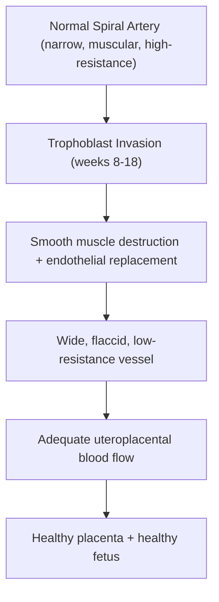
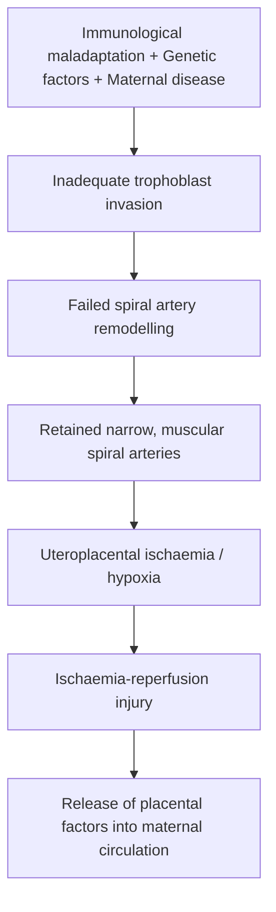
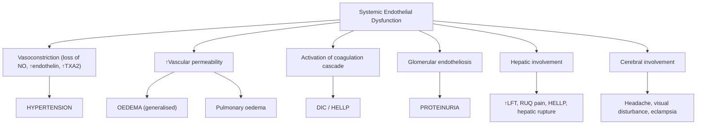

# Pre-eclampsia

## 1. Definition

Pre-eclampsia — let's break the name down first. "Pre-" = before, "eclampsia" = from Greek *eklampsis* meaning "a shining forth" or "sudden flashing" (referring to seizures/convulsions). So pre-eclampsia literally means the state *before seizures* — a pregnancy-specific multisystem disorder that, if left unchecked, can progress to eclampsia (generalised tonic-clonic seizures).

> ***Pre-eclampsia occurs in the 2nd half of pregnancy → anytime after 20 weeks*** [1]. Anything before 20 weeks is considered the patient's **pre-existing (chronic) hypertension**, not a pregnancy-induced phenomenon [1].

**The old classical triad** was:
1. ***Hypertension***
2. ***Proteinuria***
3. ***Generalised oedema*** [1]

However, we now recognise that proteinuria is **not required** for diagnosis if other features of end-organ damage are present, and generalised oedema is too non-specific to be a diagnostic criterion.

### Updated Definition (NICE 2019) [2]

> ***New onset of hypertension after 20 weeks of gestation with one or more of the following new-onset conditions:***
> - ***Proteinuria (≥300 mg/day)***
> - ***Other maternal organ dysfunction:***
>   - ***Renal: creatinine ≥ 90 μmol/L***
>   - ***Hepatic: elevated transaminases (ALT or AST) ± RUQ or epigastric pain***
>   - ***Neurological: eclampsia, altered mental status, blindness, stroke, clonus, severe headache or visual disturbance***
>   - ***Haematological: thrombocytopenia (platelets < 150 × 10⁹/L), DIC or haemolysis***
> - ***Uteroplacental dysfunction e.g. IUGR, stillbirth*** [2]

***Eclampsia is an end-stage of pre-eclampsia → generalised tonic-clonic seizures*** [1]. This is a life-threatening emergency.

<Callout title="Key Conceptual Point">
Pre-eclampsia is fundamentally a **disease of the placenta** that manifests as a **maternal systemic endothelial disorder**. The pathogenesis is related to the placenta [1] — the only definitive cure is **delivery of the placenta** (not just the baby).
</Callout>

---

## 2. Epidemiology

### Global Burden
- Pre-eclampsia complicates **2–8% of all pregnancies** worldwide [3]
- It is a leading cause of maternal and perinatal morbidity and mortality, responsible for an estimated **70,000+ maternal deaths** and **500,000+ fetal/neonatal deaths** annually worldwide
- Disproportionately affects low- and middle-income countries where access to antenatal care is limited

### Hong Kong Context
- Incidence in Hong Kong is approximately **2–3%** of pregnancies
- Hong Kong has an ageing maternal population (older maternal age at first pregnancy), increasing prevalence of obesity, diabetes, and chronic hypertension — all of which contribute to a rising incidence
- HELLP syndrome complicates approximately 0.5–0.9% of all pregnancies and 10–20% of those with severe pre-eclampsia
- Eclampsia is rare in Hong Kong (< 0.1% of deliveries) owing to good antenatal surveillance, but when it occurs, it carries significant morbidity

### Timing
- **Early-onset pre-eclampsia** (< 34 weeks): ~10–15% of cases; associated with more severe disease, placental pathology, IUGR, and poorer maternal/fetal outcomes
- **Late-onset pre-eclampsia** (≥ 34 weeks): ~85–90% of cases; more often related to maternal constitutional factors (obesity, metabolic syndrome) rather than placental pathology

---

## 3. Risk Factors (Predisposing Factors)

> ***Who is at risk of developing pre-eclampsia? First pregnancy, older maternal age, past obstetric history of pre-eclampsia, pre-existing maternal diseases, obstetric conditions*** [1]

Let me systematically organise these and explain **why** each is a risk factor:

### A. Maternal Factors

| Risk Factor | Relative Risk | Why? (Pathophysiological Basis) |
|---|---|---|
| **Nulliparity (first pregnancy)** | ~2–3× | First-time exposure of the maternal immune system to paternal antigens in the placenta → inadequate immune tolerance → impaired trophoblast invasion. In subsequent pregnancies, the immune system has "learned" to tolerate these antigens |
| **Previous pre-eclampsia** | ~7× | Demonstrates an underlying maternal predisposition (genetic susceptibility, endothelial dysfunction tendency) |
| **Family history of pre-eclampsia** (mother or sister) | 2–5× | Genetic component — multiple susceptibility genes involved in angiogenesis, immune regulation, and endothelial function |
| ***Older maternal age*** (> 35 years) | ~1.5–2× | Age-related endothelial dysfunction, increased arterial stiffness, and higher prevalence of chronic diseases |
| **Advanced paternal age** | Modest increase | Paternally-derived fetal antigens may be more immunogenic |
| **New partner / limited sperm exposure** | Increased | Reduced prior exposure to paternal antigens → impaired immune tolerance (same mechanism as nulliparity) |
| **Interval > 10 years since last pregnancy** | Increased | Loss of immune "memory" to paternal antigens |
| **Obesity (BMI > 30)** | ~2–3× | Chronic inflammation, insulin resistance, endothelial dysfunction, oxidative stress |
| **African / South Asian ethnicity** | Increased | Genetic predisposition; also confounded by higher rates of chronic hypertension and socioeconomic factors |

### B. Pre-existing Maternal Diseases

| Condition | Why? |
|---|---|
| ***Chronic hypertension*** | Already-damaged endothelium → reduced capacity to handle the additional vascular stress of pregnancy. Superimposed pre-eclampsia on chronic HTN is common |
| ***Diabetes mellitus (Type 1 > Type 2 > GDM)*** | Hyperglycaemia → advanced glycation end-products → endothelial damage + microvascular disease → impaired placentation |
| ***Chronic kidney disease*** | Impaired renal endothelial function + baseline proteinuria + RAAS dysregulation |
| ***Systemic lupus erythematosus (SLE)*** | Autoimmune-mediated endothelial damage; antiphospholipid antibodies directly damage trophoblasts |
| ***Antiphospholipid syndrome (APS)*** | Antibodies promote thrombosis in placental vasculature → impaired placentation → pre-eclampsia. Also associated with recurrent pregnancy loss [5] |
| ***Autoimmune conditions*** | Chronic inflammation → endothelial activation |

### C. Obstetric Conditions

| Condition | Why? |
|---|---|
| ***Multiple pregnancy (twins, triplets)*** | Larger placental mass → greater placenta-derived anti-angiogenic factor release (sFlt-1, sEng) + greater demand on maternal cardiovascular system |
| ***Molar pregnancy (hydatidiform mole)*** | Abnormal trophoblast proliferation → massive release of placental factors. Can cause pre-eclampsia **even before 20 weeks** (an exception to the rule) |
| ***Hydrops fetalis*** | Large placenta → same mechanism as multiple pregnancy |
| ***Triploidy*** | Abnormal placentation |
| ***Donor oocyte / donor insemination*** | Complete foreign paternal antigen exposure → reduced immune tolerance |

### D. Other Factors
- **IVF/ART**: modestly increased risk (~1.5×), possibly related to donor gametes, hormonal manipulation, or underlying subfertility
- **Interpregnancy interval < 2 years or > 10 years**: both associated with increased risk
- **High altitude**: chronic hypoxia → impaired trophoblast invasion

<Callout title="High-Risk vs Moderate-Risk Factors (for aspirin prophylaxis decisions)" type="idea">
**High-risk factors** (any ONE = offer aspirin):
- Previous pre-eclampsia
- Chronic hypertension
- Chronic kidney disease
- Autoimmune disease (SLE, APS)
- Diabetes (type 1 or 2)

**Moderate-risk factors** (TWO or more = offer aspirin):
- Nulliparity
- Age ≥ 40
- BMI ≥ 35
- Family history of pre-eclampsia
- Multiple pregnancy
- Interpregnancy interval > 10 years
</Callout>

---

## 4. Anatomy and Function — The Placenta in Normal Pregnancy

To understand pre-eclampsia, you **must** understand normal placentation. This is the crux of the disease.

### Normal Placental Development

The placenta is a transient organ that serves as the interface between maternal and fetal circulations. Its key functions:
- **Gas exchange** (O₂ and CO₂)
- **Nutrient transfer** (glucose, amino acids, lipids)
- **Waste removal** (urea, creatinine)
- **Endocrine function** (hCG, progesterone, oestrogen, hPL)
- **Immune barrier** (prevents fetal rejection)

### Normal Spiral Artery Remodelling

This is the **single most important concept** to understand pre-eclampsia:

1. In early pregnancy (weeks 8–18), **extravillous cytotrophoblasts** (EVTs) invade the **decidua** (endometrium modified for pregnancy) and **inner myometrium**
2. These trophoblasts **invade and remodel the spiral arteries** of the uterus
3. Normal remodelling involves:
   - **Destruction of the smooth muscle and elastic tissue** in the spiral artery walls
   - **Replacement** of the endothelium with trophoblast cells
   - Conversion of narrow, muscular, high-resistance spiral arteries into **wide, flaccid, low-resistance conduits** (diameter increases from ~200 μm to ~800 μm)
4. This creates a **high-flow, low-resistance** uteroplacental circulation that can deliver up to **600–700 mL/min** of blood to the intervillous space by the third trimester

### Uteroplacental Circulation
- The **intervillous space** is a large blood lake into which maternal blood is pumped via the remodelled spiral arteries
- Fetal blood circulates within the **chorionic villi** which are bathed in this maternal blood pool
- Exchange occurs across the **placental barrier**: syncytiotrophoblast → cytotrophoblast → fetal capillary endothelium

---

## 5. Etiology and Pathophysiology

> ***The pathogenesis / pathophysiology is related to the placenta*** [1]
> ***Placental pre-eclampsia*** and ***Maternal pre-eclampsia*** and ***Mixed presentations: combining maternal and placental contributions*** [2]

This is a **two-stage model** (Redman & Sargent), now expanded to incorporate maternal susceptibility:

### Stage 1: Abnormal Placentation (the "Placental" Stage)

**What goes wrong:**
- **Failure of normal spiral artery remodelling** — this is the central defect
- Extravillous trophoblasts fail to adequately invade the myometrial segments of the spiral arteries
- The spiral arteries **retain their muscular walls** and remain narrow, high-resistance vessels
- Some develop **acute atherosis** (lipid-laden macrophage infiltration of vessel walls — similar to atherosclerosis)
- Result: **reduced uteroplacental perfusion** → placental ischaemia/hypoxia

**Why does this happen?**
Several mechanisms contribute:
1. **Immunological maladaptation**: the maternal immune system fails to develop adequate tolerance to paternal/fetal antigens expressed by trophoblasts → NK cell and T cell-mediated rejection of invading trophoblasts
2. **Genetic factors**: polymorphisms in genes controlling angiogenesis (VEGF, PlGF), immune regulation (HLA-C/KIR), coagulation, and oxidative stress
3. **Abnormal decidual environment**: pre-existing maternal endothelial disease (e.g. chronic HTN, DM, CKD, obesity) creates a hostile decidual environment for trophoblast invasion

### Stage 2: Maternal Systemic Endothelial Dysfunction (the "Maternal" Stage)

The ischaemic placenta releases a variety of factors into the maternal circulation that cause **widespread maternal endothelial dysfunction**:

#### Key Circulating Factors

| Factor | What it does | Consequence |
|---|---|---|
| **sFlt-1** (soluble fms-like tyrosine kinase 1) | Decoy receptor that **binds and neutralises** VEGF and PlGF → anti-angiogenic | Loss of VEGF/PlGF signalling → endothelial damage, loss of fenestrations in glomerular endothelium (→ proteinuria), vasoconstriction |
| **sEng** (soluble endoglin) | Binds TGF-β → anti-angiogenic | Potentiates sFlt-1 effects; impairs TGF-β-mediated vasodilation via NO and prostacyclin pathways |
| **PlGF** (placental growth factor) — **decreased** | Pro-angiogenic factor normally produced by placenta | Low PlGF = biomarker of placental dysfunction; loss of its endothelial protective effects |
| **Oxidative stress mediators** (ROS, lipid peroxides) | Direct endothelial damage | Activate inflammatory cascades |
| **Syncytiotrophoblast debris** (STBMs) | Microparticles shed from damaged placenta | Trigger maternal inflammatory response |
| **Pro-inflammatory cytokines** (TNF-α, IL-6, IL-1β) | Systemic inflammatory activation | Endothelial activation → adhesion molecule expression, leukocyte recruitment |

#### The Anti-angiogenic Imbalance

This is the **unifying concept**:

- Normal pregnancy: **pro-angiogenic** state (↑VEGF, ↑PlGF) → healthy endothelium
- Pre-eclampsia: **anti-angiogenic** state (↑sFlt-1, ↑sEng, ↓PlGF) → endothelial dysfunction

> The sFlt-1/PlGF ratio is now used as a biomarker: **sFlt-1/PlGF ratio > 38** (Elecsys assay) is highly suggestive of pre-eclampsia.

#### Downstream Consequences of Endothelial Dysfunction

Endothelial dysfunction is the **final common pathway** that explains ALL the clinical features of pre-eclampsia:

### The Two Phenotypes [2]

| | ***Placental Pre-eclampsia*** | ***Maternal Pre-eclampsia*** |
|---|---|---|
| Onset | Early (< 34 weeks) | Late (≥ 34 weeks) |
| Primary pathology | Defective placentation | Maternal constitutional factors (obesity, metabolic syndrome, chronic HTN) |
| Placental pathology | Marked — infarcts, abnormal Doppler | Minimal |
| Fetal effects | Prominent — IUGR, oligohydramnios, abnormal umbilical artery Doppler | Usually mild |
| Maternal severity | Often severe | Variable |
| Anti-angiogenic imbalance | Very pronounced (very high sFlt-1, very low PlGF) | Less pronounced |
| Recurrence risk | Higher | Lower |

***Mixed presentations: combining maternal and placental contributions*** are common in clinical practice [2].

<Callout title="Why does the placenta cause a systemic maternal disease?">
Think of the placenta as a "sensor" — when it is ischaemic, it releases an SOS signal (sFlt-1, sEng, inflammatory cytokines, oxidative stress mediators) into the maternal bloodstream. These signals don't just affect the placenta — they affect **every maternal endothelium**: brain, kidneys, liver, lungs, vasculature. The mother's body essentially "sacrifices" itself to try to increase blood pressure and perfusion to the ischaemic placenta, but this compensatory mechanism spirals out of control.
</Callout>

### Specific Organ Pathophysiology

#### 1. Vascular System → Hypertension
- **Loss of normal vasodilators**: NO↓, prostacyclin (PGI₂)↓
- **Excess vasoconstrictors**: endothelin-1↑, thromboxane A₂ (TXA₂)↑, angiotensin II sensitivity↑
- **Reduced plasma volume**: paradoxically, despite oedema, intravascular volume is **contracted** (fluid shifts to extravascular space due to ↑capillary permeability)
- **Loss of normal pregnancy-associated vasodilation**: normal pregnancy has ↓SVR and ↓BP in 2nd trimester; this fails to occur in pre-eclampsia

#### 2. Kidney → Proteinuria and Renal Dysfunction
- **Glomerular endotheliosis**: pathognomonic lesion of pre-eclampsia
  - Swelling and vacuolisation of glomerular endothelial cells
  - Loss of fenestrations in the endothelium
  - Subendothelial fibrin deposits
  - Narrowing of capillary lumina
- This disrupts the glomerular filtration barrier → proteinuria
- Severe cases → acute kidney injury (↑creatinine) from renal cortical ischaemia
- GFR falls (compare to the normal 50% increase in GFR during pregnancy)

#### 3. Liver → HELLP Syndrome
- **Hepatic sinusoidal endothelial damage** → fibrin deposition → periportal necrosis → ↑transaminases
- **Subcapsular haematoma** → can rupture (rare but catastrophic → haemoperitoneum)
- HELLP = **H**aemolysis, **E**levated **L**iver enzymes, **L**ow **P**latelets

#### 4. Brain → Eclampsia
- **Cerebral vasospasm** → ischaemia
- **Posterior reversible encephalopathy syndrome (PRES)**: breakdown of cerebral autoregulation → vasogenic oedema, especially in the posterior circulation (occipital/parietal lobes — supplied by posterior cerebral arteries which have less sympathetic innervation → more vulnerable to hyperperfusion injury)
- Explains visual symptoms (occipital cortex) and seizures
- Can progress to intracerebral haemorrhage

#### 5. Haematological System → DIC, Thrombocytopenia
- Endothelial damage → **platelet activation and consumption** → thrombocytopenia
- Activation of coagulation cascade → microthrombi formation → consumption coagulopathy (DIC)
- Red cells sheared by fibrin strands in damaged microvasculature → **microangiopathic haemolytic anaemia (MAHA)** → schistocytes on blood film [4]

#### 6. Placenta → Fetal Compromise
> ***Remember pathophysiology of pre-eclampsia, basically poor perfusion to placenta, meaning that: Baby grows less → IUGR, potential preterm delivery. Preterm and low birth weight has many long-term complications (NEC, cardiovascular etc.)*** [1]

- Placental infarction → reduced nutrient/oxygen delivery → IUGR
- Premature placental ageing → oligohydramnios
- Risk of placental abruption (haemorrhage behind the placenta)
- May culminate in intrauterine fetal death

---

## 6. Classification of Hypertensive Disorders of Pregnancy

> ***Classification*** is a key exam topic [2]

| Category | Definition | Key Features |
|---|---|---|
| **Chronic (pre-existing) hypertension** | HTN present **before pregnancy** or diagnosed **before 20 weeks** gestation, or persisting **> 12 weeks postpartum** | May be essential or secondary. Need to screen for secondary causes if young |
| **Gestational hypertension** | New-onset HTN **after 20 weeks** without proteinuria or other features of pre-eclampsia | Usually mild; resolves postpartum. ~25% progress to pre-eclampsia |
| **Pre-eclampsia** | New-onset HTN **after 20 weeks** + proteinuria or other end-organ damage (as per NICE 2019 definition above) | Can be non-severe or severe; can be superimposed on chronic HTN |
| **Pre-eclampsia superimposed on chronic hypertension** | New-onset proteinuria or sudden worsening of HTN/proteinuria, or development of HELLP/other features in a woman with chronic HTN | Occurs in ~25% of women with chronic HTN; higher risk of adverse outcomes than either condition alone |
| **Eclampsia** | Pre-eclampsia + **generalised tonic-clonic seizures** not attributable to other causes | End-stage; medical emergency |
| **HELLP syndrome** | A severe variant of pre-eclampsia: Haemolysis + Elevated Liver enzymes + Low Platelets | Can occur without significant hypertension or proteinuria (diagnostic trap!) |

### Severity Classification of Pre-eclampsia

| Feature | Non-severe | Severe |
|---|---|---|
| **Blood pressure** | ≥ 140/90 but < 160/110 | **≥ 160/110 on two occasions at least 4h apart** (or once if treated immediately) |
| **Proteinuria** | Present but < 5g/24h | ≥ 5g/24h (or 3+ on dipstick) — though this threshold is debated |
| **Symptoms** | Usually asymptomatic | Severe persistent headache, visual disturbance, RUQ/epigastric pain, altered mental status |
| **Platelets** | ≥ 100 × 10⁹/L | **< 100 × 10⁹/L** |
| **Liver enzymes** | Normal or mildly elevated | **> 2× upper limit of normal** |
| **Renal function** | Creatinine < 90 μmol/L | **Creatinine > 90 μmol/L (or doubling)** |
| **Pulmonary oedema** | Absent | Present |
| **Fetal status** | Normal growth, reassuring CTG | IUGR, oligohydramnios, abnormal Doppler |

<Callout title="Important Distinction" type="error">
Do NOT confuse **gestational hypertension** with **pre-eclampsia**. Gestational hypertension is new-onset HTN after 20 weeks WITHOUT proteinuria or end-organ damage. However, ~25% of women with gestational hypertension will progress to pre-eclampsia, so they need close monitoring.
</Callout>

---

## 7. Clinical Features

> ***Pre-eclampsia has many consequences to the mother and child. Think of maternal risk from head to toe → remember the pathophysiology of pre-eclampsia, basically a systemic condition, so can result in many many problems*** [1]

### A. Symptoms

Pre-eclampsia may be **asymptomatic** and detected only on routine antenatal screening (hence the importance of regular BP and urine checks). When symptoms develop, they often indicate **severe disease**.

| Symptom | Pathophysiological Basis |
|---|---|
| **Severe headache** (frontal, throbbing, persistent, not relieved by paracetamol) | Cerebral vasospasm → ischaemia; or vasogenic oedema (PRES) from hypertensive hyperperfusion in posterior circulation. Indicates cerebral involvement and imminent eclampsia risk |
| ***Visual disturbance***: blurred vision, scotomata (blind spots), photopsia (flashing lights), diplopia, cortical blindness | Occipital lobe oedema/ischaemia (PRES) — the visual cortex is in the occipital lobe which is selectively vulnerable. Retinal vasospasm → retinal oedema/detachment can also occur |
| ***RUQ or epigastric pain*** | Hepatic capsule distension from sinusoidal obstruction and periportal haemorrhage/necrosis. The liver capsule (Glisson's capsule) has pain fibres → distension causes pain. This is a red flag for HELLP syndrome and possible subcapsular haematoma |
| **Nausea and vomiting** (in late pregnancy) | Hepatic involvement; also may relate to cerebral oedema (↑ICP) |
| **Sudden facial/hand oedema** | ↑Capillary permeability from endothelial dysfunction → fluid shifts to interstitial space. Particularly hands and face (not just dependent oedema) |
| **Rapidly progressive generalised oedema** | Same mechanism as above, but more severe |
| **Dyspnoea** | Pulmonary oedema from ↑capillary permeability + fluid overload (especially if given excessive IV fluids). Can also be from peripartum cardiomyopathy or pleural effusion |
| **Reduced urine output (oliguria)** | Renal vasoconstriction + glomerular endotheliosis → ↓GFR → oliguria (< 500 mL/24h) |
| **Hyperreflexia / clonus** | Upper motor neuron excitability from cerebral oedema/ischaemia. Clonus (especially sustained ankle clonus) is a warning sign of impending eclampsia |
| **Sudden weight gain** (> 1 kg/week) | Fluid retention from endothelial dysfunction → oedema |
| ***Seizures (eclampsia)*** | End-stage: cerebral vasospasm → ischaemia → cortical irritability → generalised tonic-clonic seizure. Or PRES mechanism with vasogenic oedema exceeding autoregulatory capacity |

### B. Signs

| Sign | Pathophysiological Basis |
|---|---|
| **Hypertension** (≥ 140/90 mmHg) | ↑SVR from vasoconstriction (endothelin-1↑, TXA₂↑, NO↓, PGI₂↓) + ↑sensitivity to angiotensin II. In normal pregnancy, there is relative refractoriness to angiotensin II; in pre-eclampsia, this is lost |
| **Severe hypertension** (≥ 160/110 mmHg) | Same mechanism, more severe. Immediate treatment needed to prevent stroke |
| **Proteinuria** (≥ 300 mg/24h or ≥ 30 mg/mmol protein:creatinine ratio) | Glomerular endotheliosis → disrupted filtration barrier → protein leak. The podocytes are also damaged (podocyturia can be detected) |
| ***Brisk deep tendon reflexes / clonus*** | Cerebral irritability from oedema and ischaemia → ↑upper motor neuron excitability. Check patellar reflexes and ankle clonus at every assessment |
| **Facial and periorbital oedema** | ↑Capillary permeability (non-dependent oedema = more specific for pre-eclampsia than ankle oedema which is common in normal pregnancy) |
| **Pulmonary crepitations** | Pulmonary oedema from capillary leak ± fluid overload |
| **RUQ tenderness** | Hepatomegaly from congestion, subcapsular haematoma, or hepatic capsular distension |
| **Papilloedema** (rare) | Severely ↑BP → hypertensive retinopathy grade 4 |
| **Retinal changes**: arteriolar spasm, exudates, haemorrhages, serous retinal detachment | Retinal arteriolar vasospasm → ischaemia → exudation; severe cases → serous detachment (usually resolves postpartum) |
| **Small-for-gestational-age (SGA) fetus** | Placental insufficiency → ↓nutrient/O₂ delivery → IUGR |
| **Oligohydramnios** | Fetal renal hypoperfusion (due to redistribution of fetal blood flow away from kidneys to brain — the "brain-sparing effect") → ↓fetal urine output → oligohydramnios |
| **Abnormal fetal heart rate pattern on CTG** | Placental insufficiency → fetal hypoxia → late decelerations, reduced variability |

### C. HELLP Syndrome — A Special Severe Variant

HELLP can present **atypically** — sometimes with minimal hypertension or proteinuria! The mnemonic tells you what to look for:

- **H** — **Haemolysis**: MAHA from endothelial damage → schistocytes on blood film, ↑LDH, ↑indirect bilirubin, ↓haptoglobin [4]
- **EL** — **Elevated Liver enzymes**: AST/ALT elevated (often > 2× ULN), reflecting hepatocellular necrosis
- **LP** — **Low Platelets**: < 100 × 10⁹/L from consumption in damaged microvasculature

HELLP can present as:
- Epigastric/RUQ pain (90%)
- Nausea/vomiting (50%)
- Malaise
- Can be mistaken for gastritis, gallbladder disease, or viral hepatitis — **always check platelets and LFTs in any pregnant woman with upper abdominal pain in the second half of pregnancy**

<Callout title="Clinical Pearl" type="error">
HELLP syndrome can occur **postpartum** (up to 7 days after delivery) and can occur **without significant hypertension** in up to 15% of cases. Do not be falsely reassured by a "normal" blood pressure in a woman with epigastric pain and deranged bloods.
</Callout>

### D. Maternal Risks — Head to Toe

> ***Think of maternal risk from head to toe*** [1]

| System | Complications |
|---|---|
| **Brain** | Eclampsia (seizures), intracerebral haemorrhage, PRES, cortical blindness, cerebral oedema |
| **Eyes** | Retinal vasospasm, papilloedema, serous retinal detachment, cortical blindness |
| **Cardiovascular** | Severe hypertension, pulmonary oedema, peripartum cardiomyopathy |
| **Respiratory** | Pulmonary oedema, laryngeal oedema (if intubation needed, may be difficult), ARDS (rare) |
| **Liver** | HELLP syndrome, hepatic rupture (rare, catastrophic — 60% mortality), subcapsular haematoma |
| **Kidney** | AKI (acute tubular necrosis or cortical necrosis), oliguria |
| **Haematological** | DIC, MAHA, thrombocytopenia |
| **Placenta** | Abruption (2–3% risk in severe pre-eclampsia), infarction |
| **Fetal** | IUGR, prematurity, stillbirth, neonatal complications (NEC, IVH, RDS) |

### E. Fetal Risks

> ***Baby grows less → IUGR, potential preterm delivery. Preterm and low birth weight has many long-term complications (NEC, cardiovascular etc.)*** [1]

- **IUGR** (intrauterine growth restriction): most common fetal consequence; from chronic placental insufficiency
- **Prematurity**: either iatrogenic (delivery for maternal/fetal indications) or spontaneous
- **Oligohydramnios**: ↓fetal urine output from renal redistribution
- **Placental abruption**: acute haemorrhage → fetal distress → potential stillbirth
- **Stillbirth**: from acute placental insufficiency or abruption
- **Long-term neonatal complications**: respiratory distress syndrome (RDS), necrotising enterocolitis (NEC), intraventricular haemorrhage (IVH), bronchopulmonary dysplasia, retinopathy of prematurity
- **Long-term cardiovascular risk**: Barker hypothesis — fetal programming from in-utero stress → increased adult cardiovascular disease risk

---

## 8. Prevention of Pre-eclampsia

> ***For those with risk factors / previous history of pre-eclampsia → give low dose aspirin*** [1]
> ***Give aspirin before 16 weeks of gestation*** [1]
> ***Go back to pathophysiology → pre-eclampsia is failure of good blood supply to placenta in second trimester. So any drug you give, should be given in first trimester to maximize the chance of this happening → if you give it too late, after the inadequate blood supply is formed, there is nothing more that can be done*** [1]

### Low-Dose Aspirin

- **Dose**: 75–150 mg daily (commonly 150 mg in current guidelines, taken at bedtime)
- **Timing**: ***Started before 16 weeks of gestation*** — this is critical because trophoblast invasion and spiral artery remodelling occur during weeks 8–18. After this window closes, the damage is done [1]
- **Mechanism**: ***Irreversibly inactivates the cyclooxygenase-1 enzyme, suppressing the production of prostaglandins and thromboxane and inhibiting inflammation and platelet aggregation*** [1]
  - At low doses, aspirin preferentially inhibits **thromboxane A₂ (TXA₂)** production in platelets (which promotes vasoconstriction and platelet aggregation) while relatively sparing **prostacyclin (PGI₂)** production in endothelial cells (which promotes vasodilation and inhibits platelet aggregation)
  - This shifts the TXA₂/PGI₂ balance towards vasodilation and anti-aggregation → improved uteroplacental blood flow → better trophoblast invasion
- **Evidence**: reduces pre-eclampsia risk by ~15–20% overall; **most effective when started before 16 weeks** (up to 60% reduction in early-onset pre-eclampsia in some studies, e.g., ASPRE trial)
- **Continue until**: 36 weeks gestation (to avoid bleeding complications at delivery) — some guidelines continue to delivery
- **Who to give it to**: women with ≥1 high-risk factor OR ≥2 moderate-risk factors (see Risk Factors section above)

### Other Preventive Measures
- **Calcium supplementation** (1–2 g/day): recommended in populations with low dietary calcium intake (< 600 mg/day); reduces pre-eclampsia risk by ~50% in calcium-deficient populations
- **Exercise and weight management**: regular moderate exercise may reduce risk
- **No evidence for**: vitamin C, vitamin E, fish oil, garlic, or bed rest in prevention

---

## 9. Connecting Pathophysiology to Clinical Features — A Summary Table

| Pathophysiological Event | Clinical Feature | Why? |
|---|---|---|
| ↑sFlt-1 / ↓PlGF → endothelial dysfunction | Hypertension | Loss of vasodilators (NO, PGI₂) + ↑vasoconstrictors (endothelin, TXA₂) → ↑SVR |
| Glomerular endotheliosis | Proteinuria | Swollen endothelium + loss of fenestrations → disrupted filtration barrier → protein leak |
| ↑Capillary permeability | Oedema | Protein-poor fluid leaks into interstitium (Starling forces disrupted) |
| Hepatic sinusoidal obstruction | RUQ pain, ↑LFTs | Fibrin deposition in hepatic sinusoids → periportal necrosis → capsular distension |
| Cerebral vasospasm / PRES | Headache, visual Sx, seizures | Ischaemia (vasospasm) or vasogenic oedema (PRES) in posterior circulation |
| Platelet consumption in damaged vessels | Thrombocytopenia | Platelets consumed at sites of endothelial injury |
| MAHA from fibrin strands | Haemolysis (↑LDH, schistocytes) | RBCs sheared passing through damaged microvasculature |
| Placental ischaemia | IUGR, oligohydramnios | Reduced nutrient/O₂ delivery; fetal renal hypoperfusion |
| Coagulation cascade activation | DIC | Widespread endothelial damage → tissue factor exposure → consumption coagulopathy |

---

<Callout title="High Yield Summary">

**Definition**: Pre-eclampsia = new-onset HTN after 20 weeks + proteinuria OR end-organ damage (renal, hepatic, neurological, haematological) OR uteroplacental dysfunction (IUGR, stillbirth). Updated NICE 2019 definition no longer requires proteinuria if other features present.

**Pathophysiology (Two-Stage Model)**:
- Stage 1: Failed spiral artery remodelling → placental ischaemia → release of anti-angiogenic factors (↑sFlt-1, ↑sEng, ↓PlGF)
- Stage 2: Systemic maternal endothelial dysfunction → vasoconstriction (HTN), capillary leak (oedema), glomerular endotheliosis (proteinuria), hepatic damage (HELLP), cerebral oedema/vasospasm (eclampsia)
- Two phenotypes: early-onset "placental" pre-eclampsia (< 34 wk, severe) vs late-onset "maternal" pre-eclampsia (≥ 34 wk, constitutional)

**Risk Factors**: Nulliparity, previous pre-eclampsia, chronic HTN, CKD, SLE/APS, DM, obesity, older age, multiple pregnancy, molar pregnancy, family history.

**Clinical Features**: May be asymptomatic. Warning symptoms = severe headache, visual disturbance, RUQ/epigastric pain, brisk reflexes/clonus. HELLP = haemolysis + elevated liver enzymes + low platelets.

**Fetal Effects**: IUGR, prematurity, oligohydramnios, placental abruption, stillbirth.

**Prevention**: Low-dose aspirin (150 mg/day) started before 16 weeks in high-risk women. Works by inhibiting COX-1 → ↓TXA₂ → improved uteroplacental perfusion.

**Classification**: Chronic HTN | Gestational HTN | Pre-eclampsia | Pre-eclampsia superimposed on chronic HTN | Eclampsia | HELLP.

**Key Concept**: Pre-eclampsia is a disease of the placenta manifesting as maternal systemic endothelial dysfunction. Only definitive cure = delivery of the placenta.

</Callout>

---

<ActiveRecallQuiz
  title="Active Recall - Pre-eclampsia (Definition, Epidemiology, Risk Factors, Pathophysiology, Clinical Features)"
  items={[
    {
      question: "Describe the two-stage model of pre-eclampsia pathophysiology. What is the central defect in Stage 1 and what is the consequence in Stage 2?",
      markscheme: "Stage 1: Failure of spiral artery remodelling by extravillous trophoblasts leading to retained narrow high-resistance arteries causing placental ischaemia/hypoxia. Stage 2: Ischaemic placenta releases anti-angiogenic factors (sFlt-1, sEng) and inflammatory mediators into maternal circulation causing systemic endothelial dysfunction manifesting as HTN, proteinuria, oedema, liver/brain/haem involvement."
    },
    {
      question: "What is the updated NICE 2019 definition of pre-eclampsia? List the categories of organ dysfunction that can substitute for proteinuria.",
      markscheme: "New-onset HTN after 20 weeks with one or more of: (1) Proteinuria >= 300mg/day, (2) Renal dysfunction (creatinine >= 90), (3) Hepatic (elevated AST/ALT +/- RUQ pain), (4) Neurological (eclampsia, altered mental status, blindness, stroke, clonus, severe headache, visual disturbance), (5) Haematological (plt < 150, DIC, haemolysis), (6) Uteroplacental dysfunction (IUGR, stillbirth)."
    },
    {
      question: "Explain why low-dose aspirin must be started before 16 weeks gestation for pre-eclampsia prevention. What is its mechanism of action?",
      markscheme: "Trophoblast invasion and spiral artery remodelling occur at weeks 8-18. Aspirin must be given during this window to improve the process. If given after inadequate remodelling is established, it is too late. Mechanism: irreversibly inhibits COX-1, suppressing TXA2 production (vasoconstrictor, pro-aggregatory) while relatively sparing PGI2 (vasodilator, anti-aggregatory), shifting balance towards vasodilation and improved uteroplacental perfusion."
    },
    {
      question: "A 34-week pregnant woman presents with epigastric pain, nausea, and BP 148/96. Her bloods show platelets 68, ALT 340, LDH 890, and schistocytes on film. What is the diagnosis and explain the pathophysiology of each lab finding.",
      markscheme: "HELLP syndrome (variant of severe pre-eclampsia). Thrombocytopenia: platelet consumption at sites of damaged endothelium. Elevated ALT: hepatic sinusoidal endothelial damage causing fibrin deposition and periportal hepatocellular necrosis. Elevated LDH and schistocytes: microangiopathic haemolytic anaemia (MAHA) from RBC fragmentation through fibrin strands in damaged microvasculature."
    },
    {
      question: "List 5 high-risk factors and 5 moderate-risk factors for pre-eclampsia. How do you use these to decide on aspirin prophylaxis?",
      markscheme: "High-risk (any 1 qualifies): previous pre-eclampsia, chronic HTN, CKD, autoimmune disease (SLE/APS), DM type 1 or 2. Moderate-risk (need 2 or more): nulliparity, age >= 40, BMI >= 35, family history of pre-eclampsia, multiple pregnancy, interpregnancy interval > 10 years. Give low-dose aspirin 150mg daily before 16 weeks if >= 1 high-risk OR >= 2 moderate-risk factors."
    },
    {
      question: "Explain why pre-eclampsia causes proteinuria using the specific renal histological lesion. Why does this differ from other causes of proteinuria?",
      markscheme: "Glomerular endotheliosis: swelling and vacuolisation of glomerular capillary endothelial cells with loss of fenestrations and subendothelial fibrin deposits. This narrows capillary lumina and disrupts the glomerular filtration barrier leading to non-selective proteinuria. Unlike diabetic nephropathy (basement membrane thickening) or minimal change disease (podocyte foot process effacement), the primary lesion is endothelial rather than podocyte or basement membrane pathology, though podocyte injury also occurs."
    }
  ]}
/>

## References

[1] Lecture slides: Block C - Hypertension and Pregnancy (CFB WCS in 2023_24).pdf
[2] Lecture slides: GC 224. Hypertension and Pregnancy.pdf
[3] Senior notes: Ryan Ho Cardiology.pdf (Section 3.6 Hypertension)
[4] Senior notes: Maksim Medicine Notes.pdf (p165, MAHA and DIC section)
[5] Senior notes: Ryan Ho Rheumatology.pdf (p73, Antiphospholipid syndrome and Revised Sapporo criteria)
[6] Senior notes: Ryan Ho Urogenital.pdf (p31, Magnesium — IV MgSO4 in eclampsia)
[7] Senior notes: Ryan Ho Haemtology.pdf (p137, MAHA and TMA section)
[8] Lecture slides: GC 115. I am pregnant_ medical problems complicating pregnancy.pdf
[9] Lecture slides: Block C - I am pregnant_ medical problems complicating pregnancy.pdf
