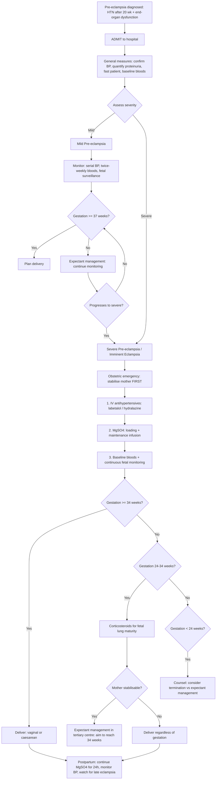

## Management of Pre-eclampsia

---

### A. Overarching Principles

***Management of pre-eclampsia is divided into mild and severe*** [1].

***Mild is considered asymptomatic → no need to consider delivery*** (yet) [1].

***Severe is an obstetric emergency → have to consider whether a delivery is necessary, for the health of mother and child*** [1].

***Since the placenta is the problem, basically the only treatment that will really work is delivery*** [1]. Everything else — antihypertensives, MgSO₄, monitoring — is **temporising** to buy time for fetal maturation while keeping the mother safe.

***Pre-eclampsia is a balance between the problems of systemic end-organ damage, and prematurity of the baby*** [1].

The ***five principles of management*** can be remembered as **"ABCDF"**:

| Principle | Detail |
|---|---|
| **A — Admit** | ***All patients with pre-eclampsia, admit them into the hospital*** [1] |
| **B — BP control** | Antihypertensive therapy to prevent maternal stroke/haemorrhage |
| **C — Convulsion prevention** | ***Magnesium sulphate*** to prevent/treat eclampsia [1][3][4] |
| **D — Delivery planning** | ***Definitive treatment of pre-eclampsia is delivery*** [1][2][4] |
| **F — Fluid balance** | ***Fluid balance crucial — pre-eclampsia characterised by leaky vessels and endothelial damage → so don't just pump fluids into patient, may cause third spacing and worsen generalised oedema / pulmonary oedema*** [1] |

Additional: ***Pregnancy increases risk of thromboembolic complications, pre-eclampsia also a risk factor → may need to consider thromboprophylaxis → pressure stockings ± LMWH*** [1].

<Callout title="Why Admit Everyone?">
***If a lady at 24 weeks meets pre-eclampsia diagnostic criteria, it is a tough but necessary decision to hospitalise them for the next 13 weeks until they deliver at 37 weeks → cannot risk them developing eclampsia in the outpatient setting. Chance of developing eclampsia from pre-eclampsia is < 1%, so actually very low → however, due to several cases of this in HK in the past, we play it safe just in case*** [1]. Pre-eclampsia is progressive and unpredictable — a woman who is "mild" today can become "severe" overnight.
</Callout>

---

### B. Management Algorithm

---

### C. Detailed Management by Severity

#### C1. Mild Pre-eclampsia (Expectant Management)

***Mild is considered asymptomatic → no need to consider delivery*** [1]. The goal is to **buy time** for fetal maturation while monitoring closely for progression.

| Component | Details |
|---|---|
| **Admission** | Inpatient monitoring (all pre-eclampsia = admitted) |
| **BP monitoring** | At least 4 times daily |
| **Bloods** | Twice weekly: CBC, LFT, RFT, uric acid, clotting |
| **Urine** | Serial PCR or 24-hour urine protein |
| **Fetal surveillance** | USS for growth every 2 weeks, umbilical artery Doppler, CTG daily to twice weekly |
| **Antihypertensives** | Start if BP persistently ≥ 140/90 (see drug section below) |
| **MgSO₄** | NOT routinely given in mild pre-eclampsia — reserved for severe/imminent eclampsia |
| **Delivery** | ***All should be delivered by 37 weeks*** [1] — no benefit of continuing pregnancy beyond term |
| **Corticosteroids** | If < 34 weeks and delivery is anticipated within 7 days |
| ***Fasting*** | ***Fast the patient just in case an emergency OT is necessary*** [1] |
| **Thromboprophylaxis** | ***Pressure stockings ± LMWH*** [1] — pre-eclampsia + pregnancy = dual thrombotic risk |

***If mother is asymptomatic / only mild biochemical derangement, monitor closely and hope they can reach 37 weeks*** [1].

#### C2. Severe Pre-eclampsia / Imminent Eclampsia

***If mother is symptomatic (e.g., headaches, visual disturbances, epigastric pain): give paracetamol first, and start worrying if there is persistent headache. Baby then must be delivered regardless of gestational age*** [1].

***Stabilise patient before delivery → i.e., don't open emergency OT while patient is having a fit in front of you*** [4].

| Step | Action | Rationale |
|---|---|---|
| **1. Stabilise the mother** | ABC approach. Left lateral position to prevent aortocaval compression. IV access (×2 large-bore). Continuous pulse oximetry | Mother's safety takes priority over fetal delivery |
| **2. Control BP** | ***IV labetalol / hydralazine*** [1] | ***Shooting up too high beyond 160/110 may cause ICH*** [1]. Prevent maternal stroke |
| **3. Prevent/treat seizures** | ***Magnesium sulphate*** [3][4] | Prevents eclampsia; treats eclampsia if it occurs |
| **4. Fluid management** | Restrict IV fluids to 80 mL/hour (or ~1 mL/kg/h). Strict I/O charting with urinary catheter | ***Leaky vessels → fluid overload → pulmonary oedema*** [1] |
| **5. Investigations** | CBC, LFT, RFT, clotting, crossmatch; continuous CTG | Assess end-organ damage; monitor fetal wellbeing |
| **6. Delivery planning** | See timing algorithm below | ***Definitive treatment is delivery*** [1][2] |
| **7. Corticosteroids** | Dexamethasone or betamethasone if < 34 weeks | Fetal lung maturity (accelerates surfactant production) |
| **8. Thromboprophylaxis** | TED stockings ± LMWH (withhold if platelets < 50 or imminent delivery) | Hypercoagulable state [1] |

---

### D. Antihypertensive Therapy in Pre-eclampsia

#### D1. BP Targets

***Antenatally, goal is to keep BP less than 140/90 → don't lower BP too much, since you want to maintain end-organ perfusion*** [1].

This is a critical concept. In pre-eclampsia, the uteroplacental circulation is already compromised (poorly remodelled spiral arteries). If you drop the maternal BP too aggressively, you reduce perfusion pressure across an already high-resistance placental bed → fetal hypoxia. So the target is a **controlled reduction**, not normalisation.

| Scenario | Target BP | Why |
|---|---|---|
| Non-severe pre-eclampsia | < 140/90 | Prevent progression to severe hypertension while maintaining adequate perfusion |
| ***Severe pre-eclampsia*** | ***< 140 in first hour*** [8] | Prevent maternal ICH and hypertensive encephalopathy |
| Maintenance (severe) | 130–140 / 80–90 | Balance between maternal safety and fetal perfusion |

<Callout title="Don't Drop Too Fast" type="error">
***Rapid BP reduction may precipitate CVA or MI*** [7]. In chronic HTN and elderly patients, autoregulatory thresholds are shifted rightward — a sudden drop below these thresholds → cerebral/myocardial ischaemia. The same principle applies in pre-eclampsia: controlled reduction, not a crash.
</Callout>

#### D2. First-Line Antihypertensives

***IV labetalol / hydralazine*** [1] are the two workhorses of acute BP control in pre-eclampsia.

| Drug | Class | Mechanism | Dose | Advantages | Side Effects / Cautions |
|---|---|---|---|---|---|
| ***Labetalol*** | Combined α₁ + β blocker | α₁-blockade → vasodilation (↓ SVR). β₁-blockade → ↓ HR, ↓ contractility, ↓ CO. Net effect: ↓ BP with maintained uteroplacental flow | ***IV: 20 mg over 2 min → repeat 40 mg bolus if uncontrolled at 15 min → IV infusion*** [8]. PO: 100–400 mg BD–TDS | Rapid onset IV; smooth BP control; does not cause reflex tachycardia (β-blockade prevents it); safe in pregnancy | C/I in asthma (β₂ blockade → bronchospasm); caution in heart block; neonatal bradycardia if used near delivery |
| ***Hydralazine*** | Direct arteriolar vasodilator | Relaxes vascular smooth muscle → ↓ SVR. Exact mechanism: likely inhibits IP₃-mediated Ca²⁺ release from sarcoplasmic reticulum | ***IV: 5–10 mg slow IV over 20 min, repeat every 30 min*** [7] or infusion 200–300 μg/min | Long track record in pregnancy; effective at lowering SVR | Reflex tachycardia (baroreceptor response to ↓ SVR → ↑ HR → ↑ cardiac work); headache; fluid retention; lupus-like syndrome with chronic use. ***C/I in AMI, aortic dissection*** [7][8] |

#### D3. Oral Antihypertensives (Maintenance / Mild Pre-eclampsia)

| Drug | Class | Mechanism | Dose | Notes |
|---|---|---|---|---|
| **Labetalol** (PO) | α/β blocker | As above | 100–400 mg BD–TDS | First-line oral agent in pregnancy |
| **Nifedipine** (modified release) | Dihydropyridine CCB | Blocks L-type Ca²⁺ channels in vascular smooth muscle → vasodilation → ↓ SVR | 10–40 mg BD (modified release) | Second-line. ***Note: sublingual nifedipine may precipitate ischaemic insult due to rapid ↓ BP*** [7] → always use modified-release formulation. Safe in pregnancy |
| **Methyldopa** | Central α₂ agonist | Stimulates α₂-adrenergic receptors in brainstem → ↓ sympathetic outflow → ↓ SVR, ↓ HR | 250–500 mg TDS (max 3 g/day) | Oldest pregnancy antihypertensive with longest safety record. Slow onset (6–8 hours). Side effects: sedation, depression, positive Coombs test (autoimmune haemolytic anaemia), hepatitis. Usually used as add-on or when labetalol contraindicated |

#### D4. Drugs CONTRAINDICATED in Pregnancy

| Drug Class | Why Contraindicated |
|---|---|
| ***ACE inhibitors (e.g., enalapril, captopril)*** | Fetotoxic: renal tubular dysgenesis → fetal anuria → oligohydramnios → limb contractures, pulmonary hypoplasia, skull ossification defects. Also neonatal hypotension and renal failure |
| ***ARBs (e.g., losartan, valsartan)*** | Same fetotoxic effects as ACEi — both act on the fetal RAAS which is critical for renal development |
| ***Sodium nitroprusside*** | ***C/I: pregnancy*** [8] — cyanide toxicity to fetus (nitroprusside is metabolised to cyanide and thiocyanate) |
| **Thiazide diuretics** | Reduce plasma volume (already depleted in pre-eclampsia → worsen haemoconcentration and placental hypoperfusion); electrolyte disturbances in fetus |
| **Atenolol** | Associated with fetal growth restriction (more so than other β-blockers); labetalol preferred |

<Callout title="ACEi/ARBs in Pregnancy — An Absolute No" type="error">
This is a guaranteed exam question. ACE inhibitors and ARBs are **absolutely contraindicated in ALL trimesters** of pregnancy. The fetal RAAS is essential for normal kidney development — blocking it causes renal agenesis/dysgenesis. If a woman on ACEi/ARB becomes pregnant, stop immediately and switch to labetalol, nifedipine MR, or methyldopa. ***ACEi/ARBs are the most commonly tested contraindicated drug in pregnancy-related MCQs.***
</Callout>

---

### E. Magnesium Sulphate (MgSO₄)

This is the single most important drug in eclampsia management and one of the highest-yield topics in obstetrics.

#### E1. Indications

| Indication | Evidence Base |
|---|---|
| ***Treatment of eclampsia (seizures)*** | ***Cannot use conventional anti-epileptics → keep using Magnesium sulphate*** [1]. The Collaborative Eclampsia Trial (Lancet 1995) showed MgSO₄ was superior to diazepam and phenytoin in preventing recurrent eclamptic seizures |
| ***Prevention of eclampsia in severe pre-eclampsia*** | The MAGPIE trial (Lancet 2002) showed MgSO₄ halved the risk of eclampsia in women with severe pre-eclampsia (NNT ~100) |
| **NOT routine in mild pre-eclampsia** | Risk of eclampsia in mild disease is very low; MgSO₄ has a narrow therapeutic window |

***Treatment principle of eclampsia: Cannot use conventional anti-epileptics → keep using Magnesium sulphate. Some trials in NEJM demonstrating its superiority over other antiepileptics, and also safety of the drug in pregnancy*** [1].

#### E2. Mechanism of Action

MgSO₄ works through multiple mechanisms — it is NOT a conventional anticonvulsant:

| Mechanism | Explanation |
|---|---|
| **Cerebral vasodilation** | Mg²⁺ is a physiological calcium antagonist → relaxes cerebral vascular smooth muscle → ↓ cerebral vasospasm → improves cerebral blood flow → reduces PRES-related ischaemia |
| **NMDA receptor antagonism** | Mg²⁺ blocks the NMDA glutamate receptor channel (voltage-dependent Mg²⁺ block) → ↓ excitatory neurotransmission → ↑ seizure threshold |
| **Neuroprotection** | ↓ calcium influx into neurons → ↓ excitotoxicity |
| **Endothelial protection** | ↓ endothelin-1 production; ↓ oxidative stress; may improve endothelial function |
| **Tocolytic effect** | Mild uterine smooth muscle relaxation (blocks Ca²⁺ entry) — minor, not its primary purpose |

#### E3. Dosing Protocol (Pritchard Regimen — Most Commonly Used)

| Phase | Route | Dose | Details |
|---|---|---|---|
| **Loading dose** | IV | 4 g MgSO₄ in 100 mL normal saline over 15–20 minutes | Achieves therapeutic levels rapidly |
| **Maintenance** | IV infusion | 1–2 g/hour | Continue for **24 hours after delivery** or **24 hours after last seizure** (whichever is later) |

Alternative: IM regimen (Pritchard original) — 10 g IM loading (5 g in each buttock) + 5 g IM every 4 hours. Less used now due to pain and unpredictable absorption.

***Remember postpartum presentation of eclampsia is possible, due to the residual circulating debris → so continue MgSO₄ infusion until 24 hours after delivery*** [1].

#### E4. Therapeutic Window and Toxicity Monitoring

This is critical because MgSO₄ has a **narrow therapeutic index**.

| Serum Mg²⁺ Level (mmol/L) | Clinical Effect |
|---|---|
| 1.0–2.0 | Normal physiological range |
| ***2.0–4.0 (therapeutic range)*** | Seizure prophylaxis/treatment |
| 4.0–5.0 | ***Loss of deep tendon reflexes (first sign of toxicity)*** — specifically ***loss of knee jerk*** [1] |
| 5.0–6.5 | Respiratory depression, muscle weakness |
| > 7.5 | Respiratory arrest |
| > 12.5 | Cardiac arrest (asystole) |

***At this juncture, check knee jerk, respiratory rate every hour. Loss of knee jerk is the first sign of magnesium toxicity (10 mEq), from the normal therapeutic level of 4–8*** [1].

#### E5. Monitoring Protocol

***Check the following every hour*** [1]:

| Parameter | Threshold for Concern | Action if Abnormal |
|---|---|---|
| ***Knee jerk (patellar reflex)*** | ***Absent*** = first sign of toxicity | **Stop MgSO₄ infusion immediately** |
| ***Respiratory rate*** | < 12 breaths/min | **Stop MgSO₄**; consider assisted ventilation |
| **Urine output** | < 25–30 mL/hour | **Reduce rate or stop MgSO₄** — Mg²⁺ is renally excreted, so in oliguria/AKI, Mg²⁺ accumulates rapidly [10] |
| **Serum Mg²⁺ levels** | > 4.0 mmol/L | Adjust infusion rate |

#### E6. Antidote for MgSO₄ Toxicity

**Calcium gluconate 10% — 10 mL (1 g) IV over 10 minutes**

Why does this work? Mg²⁺ toxicity causes neuromuscular blockade and cardiac depression because Mg²⁺ antagonises Ca²⁺ at the neuromuscular junction and myocardium. IV calcium directly opposes these effects by restoring the Ca²⁺/Mg²⁺ ratio at the cell membrane.

<Callout title="MgSO₄ Monitoring Mnemonic: 'RPU'" type="idea">
**R** = Reflexes (knee jerk — check every hour; absent = STOP)
**P** = (res)**P**iratory rate (< 12 = STOP)
**U** = Urine output (< 25–30 mL/h = reduce/stop — renal excretion impaired)

Antidote = **Calcium gluconate** (keep at bedside at ALL times when MgSO₄ is running)
</Callout>

<Callout title="MgSO₄ vs Conventional Anticonvulsants" type="error">
***Cannot use conventional anti-epileptics*** [1] in eclampsia. Why? Because:
1. Eclampsia is NOT epilepsy — the mechanism is vasospasm/PRES, not a cortical focus. MgSO₄ addresses the underlying vasospasm.
2. Diazepam/phenytoin have MORE side effects in pregnancy (fetal sedation, respiratory depression, cardiac arrhythmia in mother) and are LESS effective at preventing recurrent seizures (Collaborative Eclampsia Trial).
3. MgSO₄ has the added benefit of neuroprotection for the preterm fetus.

***Pregnant lady with first episode of convulsions at 34 weeks → treat as eclampsia until proven otherwise, unless patient has a known history of poorly controlled epilepsy*** [1].
</Callout>

---

### F. Timing of Delivery

This is the central clinical decision — ***when should delivery be done?*** [1]

#### F1. Key Gestational Age Thresholds

***Three critical gestational age cutoffs*** [1]:

| Gestation | Significance |
|---|---|
| ***37 weeks*** | ***Defines term. All pre-eclampsia should be delivered by 37 weeks*** [1] — after this, further fetal development gives no additional benefit, so delivery maximises benefit for mother and child |
| ***34 weeks*** | ***Defines lung viability. Before 34 weeks, give 1 course of corticosteroids*** [1] for fetal lung maturity |
| ***24 weeks*** | ***Defines viability. Before 24 weeks, no matter what we do, baby cannot be saved*** [1] — counsel about termination vs. expectant management |

#### F2. Decision Framework

| Clinical Scenario | Timing of Delivery |
|---|---|
| ***Mild pre-eclampsia, stable*** | ***Monitor closely and hope they can reach 37 weeks*** [1]. Deliver at 37 weeks |
| ***Severe pre-eclampsia, ≥ 37 weeks*** | Deliver now (after stabilisation) |
| ***Severe pre-eclampsia, 34–36+6 weeks*** | Generally deliver after stabilisation with antihypertensives + MgSO₄. Corticosteroids if < 35 weeks and time permits |
| ***Severe pre-eclampsia, 24–33+6 weeks*** | ***Give corticosteroids*** [1]. If mother stabilisable → expectant management in tertiary centre, aiming to reach 34 weeks. If uncontrollable → deliver regardless of gestation |
| ***Severe pre-eclampsia, < 24 weeks*** | Counsel about termination. Fetal survival extremely unlikely; continuing pregnancy puts mother at grave risk |
| **HELLP syndrome** | Deliver regardless of gestation (disease usually does not stabilise) |
| **Eclampsia** | ***Convulsion — usually self-limiting. Start MgSO₄ to prevent recurrence. Stabilise mother then deliver*** [1] |
| **Persistent severe headache/visual disturbance despite treatment** | ***Baby then must be delivered regardless of gestational age*** [1] |
| **Non-reassuring fetal status** (AEDF/REDF on Doppler, pathological CTG) | Deliver — fetal compromise |

#### F3. Mode of Delivery

***A caesarean is not a must in pre-eclampsia → if patient stable, vaginal delivery is possible, once the placenta is expelled then the condition will be treated*** [1].

| Indication for Vaginal Delivery | Indication for Caesarean Section |
|---|---|
| Stable mild pre-eclampsia | ***IUGR baby*** [1] (may not tolerate labour) |
| Favourable cervix (Bishop score ≥ 6) | ***Heart rate abnormal*** [1] (non-reassuring CTG) |
| Cephalic presentation | ***Breech baby*** [1] |
| Expected to deliver within reasonable timeframe | Very preterm ( < 32 weeks — cervix usually unfavourable; induction may be prolonged and risky) |
| | Rapidly deteriorating maternal condition requiring immediate delivery |
| | Failed induction |

#### F4. Corticosteroids for Fetal Lung Maturity

| Drug | Dose | Timing |
|---|---|---|
| **Betamethasone** | 12 mg IM × 2 doses, 24 hours apart | ***Before 34 weeks, give 1 course*** [1] |
| **Dexamethasone** | 6 mg IM × 4 doses, 12 hours apart | Alternative to betamethasone |

Why? Corticosteroids accelerate fetal type II pneumocyte maturation → ↑ surfactant production → ↓ risk of neonatal respiratory distress syndrome (RDS). Peak effect at 24 hours after second dose; benefit wanes after 7 days. In HELLP syndrome, dexamethasone may also transiently improve maternal platelet count (mechanism unclear but may relate to anti-inflammatory effects).

---

### G. Management of Eclampsia

***Eclampsia → obstetric emergency*** [1].

***Convulsion — usually self-limiting. Start MgSO₄ to prevent recurrence. Stabilise mother then deliver*** [1].

| Step | Action | Details |
|---|---|---|
| **1. During seizure** | Protect airway + prevent injury | Left lateral position; suction if needed; do NOT restrain or insert anything into mouth. Seizures are usually self-limiting (60–90 seconds) |
| **2. Immediate post-ictal** | ABC | High-flow O₂; check airway patency; establish IV access |
| **3. MgSO₄** | Loading + maintenance | 4 g IV over 15–20 min → 1–2 g/h infusion. Continue for 24 hours after last seizure or delivery |
| **4. Recurrent seizures** | Further MgSO₄ bolus | 2 g IV over 5 minutes. If still seizing → consider diazepam 10 mg IV or thiopentone (ICU with intubation) |
| **5. BP control** | IV labetalol or hydralazine | Target BP < 140/90, prevent ICH |
| **6. Fluid restriction** | 80 mL/h | Prevent pulmonary oedema |
| **7. Investigations** | CBC, LFT, RFT, clotting, crossmatch | Assess for HELLP/DIC |
| **8. Stabilise → then deliver** | ***Stabilise patient before delivery*** [4] | Do not rush to theatre during active seizures |

---

### H. Postpartum Management

Pre-eclampsia does NOT end at delivery. ***Remember postpartum presentation of eclampsia is possible*** [1].

| Component | Details |
|---|---|
| **Continue MgSO₄** | ***Continue infusion until 24 hours after delivery*** [1] |
| **BP monitoring** | At least 4 times daily for 3–4 days postpartum; BP often worsens at days 3–5 post-delivery (fluid redistribution from extravascular space back into circulation → ↑ BP) |
| **Antihypertensives** | Step down gradually. Switch to pregnancy-safe drugs only if breastfeeding: labetalol, nifedipine, enalapril (safe in breastfeeding unlike in pregnancy). Avoid methyldopa postpartum (↑ risk of postnatal depression) |
| **Fluid balance** | Continue strict I/O monitoring. Watch for pulmonary oedema (mobilisation of third-space fluid in first 48 hours) |
| **Thromboprophylaxis** | LMWH + TED stockings until fully mobile |
| **Counselling** | Long-term cardiovascular risk (2× CVD, 4× chronic HTN); recommend annual BP and metabolic screening; contraceptive counselling; recurrence risk ~15–20% in next pregnancy; aspirin prophylaxis in future pregnancies |
| **Bloods** | Repeat CBC, LFT, RFT at 48–72 hours to confirm improving trend. Persistent derangement → consider other diagnoses (TTP, AFLP) |

---

### I. Summary of Drug Therapies

| Drug | Indication in Pre-eclampsia | Route | Key Points |
|---|---|---|---|
| ***Labetalol*** | First-line antihypertensive | IV (acute) / PO (maintenance) | α₁ + β blocker. C/I: asthma |
| ***Hydralazine*** | Second-line antihypertensive (acute) | IV | Direct arteriolar vasodilator. Reflex tachycardia. ***C/I: AMI, aortic dissection*** [7][8] |
| **Nifedipine MR** | Oral maintenance | PO | Dihydropyridine CCB. Use modified-release ONLY |
| **Methyldopa** | Oral maintenance (add-on) | PO | Central α₂ agonist. Longest safety record. Side effects: sedation, depression |
| ***MgSO₄*** | Prevention and treatment of eclampsia | IV (loading + infusion) | Antidote: calcium gluconate. Monitor reflexes, RR, urine output hourly |
| **Betamethasone / Dexamethasone** | Fetal lung maturity ( < 34 weeks) | IM | Accelerates surfactant production |
| **LMWH** | Thromboprophylaxis | SC | Pre-eclampsia + pregnancy = high VTE risk [1][11] |
| **Low-dose aspirin** | Prevention (started < 16 weeks in at-risk women) | PO | COX-1 inhibition → ↓ TxA₂ → improved placental blood flow |

| Drug | CONTRAINDICATED | Reason |
|---|---|---|
| ***ACEi / ARBs*** | Absolutely | Fetotoxic — renal tubular dysgenesis |
| ***Sodium nitroprusside*** | Absolutely | ***C/I: pregnancy*** [8] — fetal cyanide toxicity |
| **Atenolol** | Relatively | Fetal growth restriction |
| **Thiazide diuretics** | Relatively | Worsen haemoconcentration; reduce placental perfusion |
| **Diazepam/phenytoin for seizures** | Relatively | Inferior to MgSO₄; more side effects |

---

<Callout title="High Yield Summary">

1. ***Definitive treatment of pre-eclampsia is delivery*** — everything else is temporising.
2. **Five principles**: Admit, BP control, Convulsion prevention (MgSO₄), Delivery planning, Fluid restriction.
3. ***Antihypertensives: IV labetalol (first-line) or IV hydralazine***. Target BP < 140/90 antenatally; don't drop too fast.
4. ***MgSO₄: loading 4 g IV over 15–20 min → maintenance 1–2 g/h. Continue 24 hours after delivery.***
5. **MgSO₄ monitoring**: Check **R**eflexes, res**P**iratory rate, **U**rine output every hour. Loss of knee jerk = first sign of toxicity. Antidote = calcium gluconate.
6. ***Three gestational thresholds***: 37 wk (deliver all), 34 wk (give steroids if < 34), 24 wk (viability limit).
7. ***Caesarean is not mandatory*** — vaginal delivery is fine if stable; caesarean for IUGR, fetal distress, breech.
8. ***ACEi/ARBs and sodium nitroprusside are absolutely contraindicated.***
9. ***Fluid balance is crucial*** — leaky endothelium means aggressive fluids → pulmonary oedema.
10. ***Postpartum***: Continue MgSO₄ 24 h; BP often worsens day 3–5; late eclampsia is possible.

</Callout>

---

<ActiveRecallQuiz
  title="Active Recall - Pre-eclampsia: Management"
  items={[
    {
      question: "List the five principles of pre-eclampsia management and explain the rationale behind fluid restriction.",
      markscheme: "Five principles: (1) Admit all patients, (2) BP control with antihypertensives, (3) Convulsion prevention/treatment with MgSO4, (4) Delivery planning (definitive treatment), (5) Fluid balance management. Fluid restriction rationale: Pre-eclampsia causes widespread endothelial dysfunction leading to increased vascular permeability (leaky vessels). Aggressive IV fluid administration causes third-spacing of fluid into the extravascular space, worsening generalised oedema and risking pulmonary oedema. Restrict to ~80 mL/h with strict I/O monitoring.",
    },
    {
      question: "A woman at 30 weeks with severe pre-eclampsia has her BP controlled on IV labetalol and MgSO4 infusion running. She is stable. What is the next step regarding delivery, and what drug should you give for the fetus?",
      markscheme: "Give corticosteroids for fetal lung maturity (betamethasone 12 mg IM x 2 doses, 24 hours apart, or dexamethasone 6 mg IM x 4 doses, 12 hours apart) because the fetus is less than 34 weeks. If the mother remains stable on treatment, adopt expectant management in a tertiary centre aiming to reach 34 weeks. If she becomes uncontrollable (persistent severe symptoms, worsening labs, fetal compromise), deliver regardless of gestational age. The three thresholds to remember are 37 weeks (deliver all), 34 weeks (give steroids), 24 weeks (viability limit).",
    },
    {
      question: "Describe the MgSO4 dosing protocol, monitoring parameters, first sign of toxicity, and its antidote.",
      markscheme: "Loading dose: 4 g IV in 100 mL normal saline over 15-20 minutes. Maintenance: 1-2 g/h IV infusion, continued for 24 hours after delivery or 24 hours after last seizure. Monitoring (hourly): (R) patellar reflex/knee jerk, (P) respiratory rate (>=12/min), (U) urine output (>=25-30 mL/h). First sign of toxicity: loss of deep tendon reflexes (absent knee jerk) at serum Mg ~4-5 mmol/L. Antidote: calcium gluconate 10%, 10 mL (1 g) IV over 10 minutes. Stop MgSO4 immediately if reflexes absent, RR <12, or oliguria.",
    },
    {
      question: "Why are ACE inhibitors, ARBs, and sodium nitroprusside contraindicated in pregnancy? Name the safe antihypertensive alternatives.",
      markscheme: "ACEi/ARBs: block the fetal RAAS which is essential for normal kidney development, causing renal tubular dysgenesis leading to fetal anuria, oligohydramnios, limb contractures, pulmonary hypoplasia, skull ossification defects, neonatal hypotension and renal failure. Contraindicated in ALL trimesters. Sodium nitroprusside: metabolised to cyanide and thiocyanate which are toxic to the fetus. Safe alternatives: labetalol (alpha/beta blocker, first-line), nifedipine modified-release (CCB, second-line), methyldopa (central alpha-2 agonist, longest safety record), hydralazine (IV for acute BP control).",
    },
    {
      question: "Why is MgSO4 preferred over conventional anticonvulsants such as diazepam and phenytoin for eclampsia?",
      markscheme: "Three reasons: (1) Eclampsia is NOT epilepsy - the mechanism is cerebral vasospasm and PRES (posterior reversible encephalopathy syndrome), not a cortical epileptic focus. MgSO4 directly addresses vasospasm via cerebral vasodilation and NMDA receptor antagonism. (2) The Collaborative Eclampsia Trial (Lancet 1995) demonstrated MgSO4 was superior to both diazepam and phenytoin in preventing recurrent eclamptic seizures. (3) Diazepam/phenytoin cause more side effects in pregnancy (fetal sedation, maternal respiratory depression, cardiac arrhythmia) and are less effective. MgSO4 also provides neuroprotection for the preterm fetus.",
    },
    {
      question: "After delivery for pre-eclampsia, what specific postpartum management steps must be taken and why?",
      markscheme: "Continue MgSO4 infusion for 24 hours after delivery (late postpartum eclampsia possible due to residual circulating anti-angiogenic factors). Monitor BP at least QID for 3-5 days (BP often worsens day 3-5 as third-space fluid mobilises back into circulation). Continue strict I/O monitoring (risk of pulmonary oedema from fluid redistribution). Step down antihypertensives gradually. Avoid methyldopa postpartum (risk of postnatal depression). Repeat bloods at 48-72 hours to confirm improving trend. Thromboprophylaxis (LMWH + TED stockings) until mobile. Counsel about long-term cardiovascular risk (2x IHD, 4x chronic HTN) and recommend annual screening. Discuss recurrence risk (~15-20%) and aspirin prophylaxis for future pregnancies.",
    },
  ]}
/>

## References

[1] Lecture slides: Block C - Hypertension and Pregnancy (CFB WCS in 2023_24).pdf
[2] Lecture slides: GC 224. Hypertension and Pregnancy.pdf
[3] Lecture slides: GC 115. I am pregnant medical problems complicating pregnancy.pdf
[4] Lecture slides: Block C - I am pregnant_ medical problems complicating pregnancy.pdf
[7] Senior notes: Ryan Ho Cardiology.pdf (p182–183 — Hypertensive emergency management, drug therapy)
[8] Senior notes: Maksim Medicine Notes.pdf (p78 — Hypertensive emergency, target BP, drug C/I)
[10] Senior notes: Ryan Ho Chemical Path.pdf (p28 — Hypermagnesaemia causes including eclampsia Tx)
[11] Senior notes: Ryan Ho Haemtology.pdf (p132 — Anticoagulation in pregnancy, LMWH)
