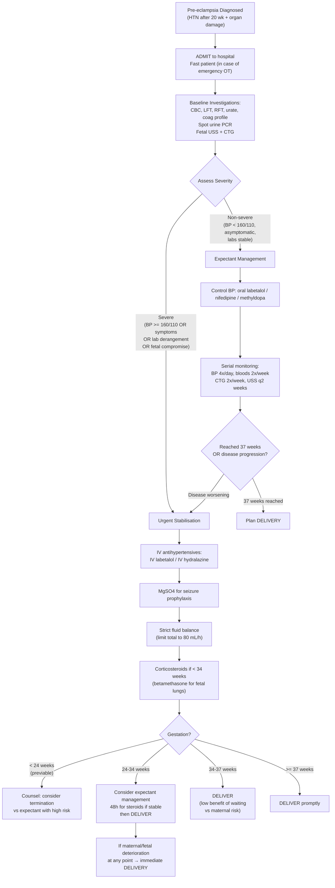

## Management of Pre-eclampsia

The overarching philosophy is straightforward, but the execution is nuanced. Let me lay it out from first principles.

> ***Definitive treatment of pre-eclampsia is delivery*** [1][2]
> ***Since the placenta is the problem, basically the only treatment that will really work is delivery*** [1]

But the catch is: delivery is not always in the best interest of the fetus, particularly if preterm. So the entire management framework is a **balancing act** between maternal safety (worse the longer you wait) and fetal maturity (better the longer you wait).

> ***Pre-eclampsia is a balance between the problems of systemic end organ damage, and prematurity of the baby*** [1]

---

### A. The Five Pillars of Pre-eclampsia Management

> ***Management of pre-eclampsia is divided into mild and severe. Mild is considered asymptomatic → no need to consider delivery. Severe is obstetric emergency → have to consider whether a delivery is necessary, for the health of mother and child*** [1]

> ***5 principles of management of pre-eclampsia*** [1]:

The lecture organises management around five key domains [2]:

1. ***Stabilisation of maternal condition*** — BP control, fluid balance
2. ***Prevention of eclampsia*** — magnesium sulphate
3. ***Screening and managing associated complications*** — HELLP, DIC, pulmonary oedema, renal failure, stroke, fetal growth
4. ***Planning for delivery*** — timing and mode
5. ***Monitoring*** — maternal and fetal well-being

Let me now work through each systematically.

---

### B. Overall Management Algorithm

---

### C. Pillar 1 — Blood Pressure Control

#### Why treat hypertension?

> ***Control of BP in severe pre-eclampsia → shooting up too high beyond 160/110 may cause ICH*** [1]
> ***BP control (uteroplacental, cerebral perfusion)*** [2]

The goals are:
1. **Prevent maternal cerebrovascular catastrophe** (haemorrhagic stroke, PRES) — this is the most dangerous acute complication of uncontrolled severe hypertension in pregnancy
2. **Maintain uteroplacental perfusion** — don't drop BP too aggressively or you'll compromise blood flow to an already ischaemic placenta

> ***Antenatally, goal is to keep BP less than 140/90 → don't lower BP too much, since you want to maintain end-organ perfusion*** [1]

#### BP Targets

| Setting | Target | Rationale |
|---|---|---|
| **Non-severe pre-eclampsia** | < 140/90 mmHg | Prevent progression to severe; maintain perfusion |
| **Severe pre-eclampsia** | < 160/110 urgently (within first hour); then aim < 140/90 | Prevent stroke. But don't overshoot — maintain uteroplacental flow |
| ***Pre-eclampsia/eclampsia — hypertensive emergency*** | ***Target SBP < 140 in first hour*** [4] | This is more aggressive than general hypertensive emergency (≤25% drop) because eclampsia/severe pre-eclampsia is a compelling indication for rapid BP control [10] |

#### Antihypertensive Agents

> ***IV labetalol / hydralazine*** [1]

##### First-Line Acute Agents (Severe Pre-eclampsia / Hypertensive Emergency)

| Drug | Dose | Mechanism | Advantages | Cautions/Contraindications |
|---|---|---|---|---|
| ***IV Labetalol*** | ***20 mg IV over 2 min → repeat 40 mg bolus at 15 min if uncontrolled → IV infusion 0.5–2 mg/min → transition to PO*** [4][10] | Combined α₁-blocker (peripheral vasodilation) + β-blocker (↓HR, ↓CO). "Labet-" doesn't stand for anything specific, but think **L**owers **A**fterload and **B**eta-blocks the heart | Smooth, controlled BP reduction. Does not cause reflex tachycardia (unlike hydralazine). Does not raise ICP. First-line in most guidelines | **C/I: asthma** (β-blockade → bronchospasm), heart block, severe bradycardia, decompensated heart failure. Use with caution in diabetic patients (masks hypoglycaemia symptoms) |
| ***IV Hydralazine*** | ***5–10 mg slow IV over 20 min, repeat every 30 min, or IV infusion at 200–300 μg/min*** [10] | Direct arteriolar smooth muscle relaxation (mechanism involves NO release and interference with calcium signalling in vascular smooth muscle). "Hydral-" relates to its original discovery as a hydrazine derivative | Very effective vasodilator; long track record in obstetric practice | Causes **reflex tachycardia** (baroreceptor-mediated) → can be problematic in patients with ischaemic heart disease. Can cause headache (vasodilation → mimics worsening pre-eclampsia symptoms!). ***C/I: AMI, aortic dissection*** [4] |
| **IV Nicardipine** | 5–15 mg/h infusion | Dihydropyridine calcium channel blocker → arteriolar vasodilation | Smooth titratable infusion; no reflex tachycardia as pronounced as hydralazine | Avoid with IV MgSO₄ in some protocols (both are vasodilators → risk of profound hypotension — though in practice this combination is used with careful monitoring) |

##### Oral Maintenance Agents (Non-severe Pre-eclampsia)

| Drug | Dose | Mechanism | Advantages | Cautions/Contraindications |
|---|---|---|---|---|
| **Labetalol PO** | 100–400 mg BD–TDS | α₁ + β-blocker (see above) | Good first-line oral agent; smooth BP control | Same as IV labetalol — avoid in asthma |
| **Nifedipine MR** (modified release) | 20–40 mg BD | Dihydropyridine CCB → arteriolar vasodilation. Blocks L-type calcium channels in vascular smooth muscle → ↓intracellular Ca²⁺ → relaxation | Effective second-line; widely available | Use **modified release only** — short-acting nifedipine can cause precipitous BP drops → fetal distress. Avoid sublingual nifedipine [10] |
| **Methyldopa** | 250 mg BD–TDS (max 3g/day) | Central α₂-agonist → ↓sympathetic outflow from brainstem → ↓SVR and ↓HR | Longest safety track record in pregnancy (used since 1960s). Can be used in first trimester for chronic HTN | Slow onset (6–8h); sedation, depression, dry mouth, hepatotoxicity (rare). Less effective than labetalol/nifedipine for acute control |

<Callout title="Drugs CONTRAINDICATED in Pregnancy" type="error">
**Never use the following antihypertensives in pregnancy:**
- ***ACE inhibitors (e.g. enalapril, ramipril)***: teratogenic — renal agenesis, oligohydramnios, pulmonary hypoplasia, fetal death. Mechanism: RAAS is critical for fetal renal development; ACEi blocks angiotensin II → ↓fetal renal perfusion
- ***ARBs (e.g. losartan, valsartan)***: same mechanism and teratogenic effects as ACEi
- ***Sodium nitroprusside***: risk of fetal cyanide toxicity (metabolised to cyanide and thiocyanate) [4][10]
- ***Atenolol***: associated with IUGR (↓uteroplacental perfusion more than labetalol due to β₁-selectivity without α-blockade-mediated vasodilation)
- ***Diuretics***: generally avoided — further reduce the already contracted intravascular volume in pre-eclampsia (exception: furosemide for acute pulmonary oedema)
</Callout>

---

### D. Pillar 2 — Prevention of Eclampsia (Magnesium Sulphate)

> ***Prevention of eclampsia (for S/S of pending eclampsia / severe PET): Magnesium sulphate (10% risk of second seizure)*** [2]
> ***Cannot use conventional anti-epileptics → keep using Magnesium sulphate*** [1]
> ***So basically treat the HT, treat the pre-eclampsia and prevent it from turning into eclampsia using magnesium sulphate*** [9]

#### Why MgSO₄ and Not Conventional Anticonvulsants?

This was definitively established by the **Magpie Trial** (Lancet, 2002) and the **Collaborative Eclampsia Trial** (Lancet, 1995):
- MgSO₄ **halved the risk** of eclampsia compared to placebo in women with pre-eclampsia (Magpie Trial)
- MgSO₄ was **superior to diazepam and phenytoin** in preventing recurrent seizures in eclampsia (Collaborative Eclampsia Trial)

***Magnesium sulphate is the drug of choice for both prophylaxis and treatment of eclampsia*** — this is not debatable.

#### Mechanism of Action

MgSO₄ has multiple complementary actions:
1. **Central anticonvulsant effect**: Mg²⁺ blocks NMDA receptors (excitatory glutamate receptors) in the brain → ↓neuronal excitability → ↓seizure threshold. Think of Mg²⁺ as a physiological calcium antagonist at the NMDA receptor — it normally sits in the channel pore and blocks it at resting membrane potential
2. **Cerebral vasodilation**: relieves cerebral vasospasm → improves cerebral perfusion → reduces PRES
3. **Peripheral vasodilation**: modest ↓BP (additional but minor benefit)
4. **Endothelial protection**: anti-inflammatory and antioxidant effects
5. **Tocolytic effect**: relaxes uterine smooth muscle (minor side benefit — but not used primarily as a tocolytic)

#### Dosing Regimen (Pritchard Regimen — most commonly used)

| Phase | Route and Dose | Details |
|---|---|---|
| **Loading dose** | 4 g IV over 15–20 min | Dilute in 100 mL saline. Given slowly to avoid cardiovascular side effects |
| **Maintenance dose** | 1 g/h IV continuous infusion | Typically 20 g MgSO₄ in 500 mL saline at 25 mL/h. Continue for **24 hours after delivery** (or 24h after last seizure, whichever is later) |
| **Alternative (IM — Pritchard original)** | 5 g IM into each buttock (total 10 g IM) after the IV loading | Painful; IV preferred where available |
| **Recurrent seizure despite loading** | Additional 2 g IV bolus over 5 min | Maximum one additional bolus. If still seizing → consider intubation + other anticonvulsants (thiopental, diazepam) |

> ***Continue MgSO₄ infusion until 24 hours after delivery. And at this juncture, check knee jerk, respiratory rate every hour. Loss of knee jerk is the first sign of magnesium toxicity (10 mEq), from the normal therapeutic level of 4–8*** [1]

#### Monitoring for Magnesium Toxicity

This is **critical** — MgSO₄ has a narrow therapeutic window:

| Serum Mg Level (mmol/L) | Clinical Effect |
|---|---|
| **2.0–4.0** | **Therapeutic range** (anticonvulsant effect) |
| **4.0–5.0** | Loss of deep tendon reflexes (patella reflex first to go) |
| **5.0–6.5** | Respiratory depression (diaphragmatic paralysis) |
| **> 7.5** | Cardiac arrest (asystole from myocardial depression) |

**Monitoring checklist (before each dose / hourly):**
1. ***Knee jerk*** (patellar reflex) — **must be present** to continue infusion. This is the first clinical sign of toxicity [1][6]
2. ***Respiratory rate*** — must be **> 12/min** [1]
3. **Urine output** — must be **> 25 mL/h** (Mg²⁺ is renally excreted → oliguria causes accumulation) [6]
4. **Serum Mg levels** — check if renal function impaired or clinical concern

**Antidote for Mg toxicity:**
- **10% Calcium gluconate 10 mL IV over 10 min** — directly antagonises Mg²⁺ at the neuromuscular junction and cardiac myocytes
- Have this drawn up and available at the bedside whenever MgSO₄ is running

> IV MgSO₄ is an important anti-epileptic in eclampsia → important to monitor serum Mg [6]

<Callout title="Magnesium Toxicity — The Three-Check Rule">
Before every dose or hourly during infusion, check three things:
1. **Reflexes present?** (knee jerk) — first sign of toxicity if absent
2. **Respiratory rate > 12?** — respiratory depression is life-threatening
3. **Urine output > 25 mL/h?** — oliguria causes Mg accumulation

If ANY is abnormal → **STOP** the infusion and check serum Mg. Have **calcium gluconate** at the bedside at all times.
</Callout>

#### Indications for MgSO₄

| Indication | Evidence |
|---|---|
| ***Severe pre-eclampsia*** (seizure prophylaxis) | ***MgSO₄ for severe pre-eclampsia*** [2]. Magpie Trial: 58% risk reduction in eclampsia |
| ***Eclampsia*** (treatment of seizures + prevention of recurrence) | ***Magnesium Sulphate (10% risk of second seizure)*** [2]. Collaborative Eclampsia Trial: superior to diazepam and phenytoin |
| ***Imminent eclampsia*** (prodromal symptoms) | Severe headache, visual disturbance, clonus, hyperreflexia — all warrant MgSO₄ even without seizures |

---

### E. Pillar 3 — Fluid Management

> ***Fluid balance crucial. Pre-eclampsia characterised by leaky vessels and endothelial damage → so don't just pump fluids into patient, may cause third spacing and worsen generalised oedema / pulmonary oedema*** [1]
> ***Fluid balance*** [2]

This is counterintuitive but critical: pre-eclampsia patients have **contracted intravascular volume** (because fluid is leaking out through damaged endothelium) but you **cannot** simply give more IV fluids because the leaked fluid will worsen oedema and precipitate **pulmonary oedema** — a major killer.

**Fluid management principles:**
- **Restrict total IV input to ~80 mL/h** (or 1 mL/kg/h)
- **Strict input/output charting**
- **Insert urinary catheter** in severe pre-eclampsia for hourly urine output monitoring
- **Target urine output ≥ 25 mL/h** (but don't "chase" urine output with fluid boluses — this is dangerous)
- **If pulmonary oedema develops**: sit up, high-flow O₂, IV furosemide 20–40 mg (this is the one situation where diuretics ARE indicated)
- Avoid colloids (no proven benefit, risk of anaphylaxis)

---

### F. Pillar 4 — Planning for Delivery

> ***The definitive treatment of pre-eclampsia is delivery*** [2]
> ***The timing is a balance between severity of pre-eclampsia and risk of prematurity*** [2]

#### Timing of Delivery

> ***For pre-eclampsia, all should be delivered by 37 weeks → the cutoff for term pregnancy, after 37 weeks further development of baby does not give further benefit, so delivery at this time will be most beneficial for mother and child health*** [1]

> Key gestational age thresholds [1]:
> - ***37 weeks → defines term and preterm pregnancy***
> - ***24 weeks → defines viable and non-viable baby (before 24 weeks, no matter what we do, baby cannot be saved)***
> - ***34 weeks → defines lung viability and non-mature baby lungs (before 34 weeks, give 1 course of steroid)***

| Gestational Age | Management Approach | Rationale |
|---|---|---|
| **< 24 weeks** (previable) | Counsel regarding termination vs expectant management. Maternal risk is very high with expectant approach. Neonatal survival is negligible | ***Before 24 weeks, no matter what we do, baby cannot be saved*** [1]. The only indication for continuing is maternal wish — but the risk of maternal complications escalates dramatically |
| **24–34 weeks** | ***If extreme prematurity, can consider conservative treatment (to improve neonatal outcome) with close monitoring of maternal well-being*** [2]. **Give corticosteroids** (betamethasone 12 mg IM × 2 doses, 24h apart) for fetal lung maturity. Aim to delay delivery by 48h to allow steroids to work. Then deliver | Steroids induce surfactant production in type II pneumocytes → ↓risk of neonatal RDS, IVH, NEC. The 48h window is to allow maximal steroid effect. ***Steroid: Betamethasone to promote fetal lung maturity (if gestation < 34 weeks)*** [2] |
| **34–37 weeks** | ***Deliver*** — low benefit of continuing expectant management vs increasing maternal risk [2] | After 34 weeks, neonatal outcomes are generally good. Continuing pregnancy risks maternal deterioration with marginal fetal benefit |
| **≥ 37 weeks** | ***Deliver promptly*** [1][2] | ***After 37 weeks, further development of baby does not give further benefit*** [1]. No reason to delay |

> ***If mother is asymptomatic / only mild biochemical derangement, monitor closely and hope they can reach 37 weeks*** [1]
> ***If mother is symptomatic (e.g. headaches, visual disturbances, epigastric pain): Give panadol first, and start worrying if there is persistent headache. Baby then must be delivered regardless of gestational age*** [1]

**Absolute indications for immediate delivery** (regardless of gestation):
- Uncontrollable severe hypertension despite maximal therapy
- Eclampsia (after stabilisation)
- Pulmonary oedema
- Placental abruption
- DIC / rapidly falling platelets
- Deteriorating liver function (especially with HELLP)
- Persistent severe symptoms despite treatment
- Pathological CTG / non-reassuring fetal status

> ***Stabilize patient before delivery → i.e. don't open emergency OT while patient is having a fit in front of you*** [9]

#### Mode of Delivery

> ***A caesarean is not a must in pre-eclampsia → if patient stable, vaginal delivery is possible, once the placenta is expelled then the condition will be treated. Caesarean indications are the general stuff → IUGR baby, heart rate abnormal, breech baby*** [1]

| Factor | Vaginal Delivery | Caesarean Section |
|---|---|---|
| **Cervical favourability** | Favourable cervix (Bishop score ≥ 6) → induce | Unfavourable cervix + urgent need for delivery |
| **Gestational age** | More likely achievable at later GA | Early preterm (< 32 wk) — induction less likely to succeed |
| **Fetal status** | Reassuring CTG | ***Non-reassuring fetal heart rate*** [2] |
| **Fetal presentation** | Cephalic | Breech, transverse |
| **IUGR severity** | Mild | Severe IUGR — baby may not tolerate labour |
| **Platelet count** | > 80 × 10⁹/L (for regional anaesthesia) | If < 80 → general anaesthesia often required (epidural contraindicated due to spinal haematoma risk) |
| **Urgency** | Can afford time for induction | Immediate delivery needed |

**Anaesthetic considerations:**
- **Regional anaesthesia (epidural/spinal)** is preferred if platelets > 80 (some anaesthetists accept > 75) and coagulation is normal — provides good BP control and analgesia
- **General anaesthesia** if: platelet count too low for regional, eclamptic seizure, need for immediate delivery, patient refusal of regional
  - Risk: exaggerated hypertensive response to laryngoscopy/intubation → treat with short-acting agents (remifentanil, alfentanil, or IV labetalol before induction)
  - Airway may be difficult due to oedema (laryngeal/pharyngeal)

---

### G. Pillar 5 — Monitoring and Managing Complications

> ***Monitor maternal well-being: BP, Blood tests — CBP, L/RFT, urate, coagulation profile, Urine protein/creatinine ratio or 24-hour urine protein, Symptoms*** [2]
> ***Monitor fetal well-being: Cardiotocogram, USG for growth, liquor volume, Doppler studies, Fetal movement*** [2]
> ***Thromboprophylaxis — pressure stockings ± LMWH*** [2]

#### Thromboprophylaxis

> ***Pregnancy increases risk of thromboembolic complications, pre-eclampsia also a risk factor. May need to consider giving these patients thromboprophylaxis → pressure stockings ± LMWH*** [1]

Pre-eclampsia is a prothrombotic state (endothelial damage + immobilisation + pregnancy hypercoagulability). Once platelets are > 50 × 10⁹/L and coagulation is not deranged, prophylactic LMWH (e.g. enoxaparin 40 mg SC daily) + TED stockings should be commenced, especially postpartum.

#### Corticosteroids — Dual Role

| Purpose | Agent and Dose | When |
|---|---|---|
| ***Fetal lung maturity*** | ***Betamethasone 12 mg IM × 2 doses, 24h apart*** [2] | ***If gestation < 34 weeks*** [1][2] — induces surfactant production in fetal type II pneumocytes |
| **HELLP syndrome** (debated) | Dexamethasone 10 mg IV q12h × 2 then 5 mg IV q12h × 2 | Some evidence suggests steroids may improve platelet count and LFTs in HELLP transiently — may buy time for fetal steroid benefit. Not universally recommended |

---

### H. Management of Eclampsia

> ***Eclampsia → obstetric emergency*** [1]
> ***Pregnant lady with first episode of convulsions at 34 weeks pregnancy → is this eclampsia or epilepsy? We will treat it as eclampsia until proven otherwise, unless patient has a known history of poorly controlled epilepsy*** [1]

> ***Management of eclampsia:***
> - ***ABC***
> - ***Prevention of injury and aspiration***
> - ***Stabilisation of maternal condition:***
>   - ***Magnesium Sulphate (10% risk of second seizure)***
>   - ***Fluid balance***
>   - ***BP control (uteroplacental, cerebral perfusion)***
>   - ***Secondary or associated complications: HELLP, Coagulopathy, pulmonary oedema, renal failure, Stroke (ischaemic/haemorrhage)***
> - ***Planning for delivery: Mode of delivery (non-reassuring fetal heart rate)*** [2]

> ***Convulsion – usually self-limiting. Start MgSO₄ to prevent recurrence. Stabilise mother then deliver*** [1]

**Step-by-step eclampsia management:**

| Step | Action | Why |
|---|---|---|
| 1. **ABC** | Left lateral position (recovery position), secure airway, suction oropharynx, high-flow O₂ by face mask | Seizures → aspiration risk, hypoxia |
| 2. **Prevent injury** | Side rails up, padded, remove dangerous objects, do NOT restrain or insert anything into mouth | Most eclamptic seizures are self-limiting (60–90 seconds) |
| 3. **MgSO₄** | Loading dose 4 g IV over 15–20 min → maintenance 1 g/h IV for 24h post-delivery | ***10% risk of second seizure*** [2] — MgSO₄ prevents this. Superior to diazepam and phenytoin |
| 4. **BP control** | IV labetalol or IV hydralazine (as above) | Prevent haemorrhagic stroke |
| 5. **Fluid restriction** | 80 mL/h total | Prevent pulmonary oedema |
| 6. **Investigations** | CBC, LFT, RFT, coag, blood gas, CTG | Assess for HELLP, DIC, fetal distress |
| 7. **Stabilise then deliver** | ***Don't rush to OT while patient is fitting*** [9]. Stabilise first (usually within 1–2 hours), then plan delivery | Maternal stabilisation > immediate delivery |

> ***Remember postpartum presentation of eclampsia is possible, due to the residual circulating debris*** [1]

---

### I. Postnatal Management and Counselling

> ***Hypertension and proteinuria should resolve by 6 weeks after delivery, if not ? chronic HT / renal disease*** [2]

#### Postpartum monitoring
- Continue BP monitoring at least daily for first 48–72h (risk of late postpartum eclampsia)
- Continue MgSO₄ for **24h after delivery** (or 24h after last seizure)
- Antihypertensives may need to be continued postpartum — step down gradually
- **Switch from methyldopa to another agent** (risk of postnatal depression with methyldopa)
- If breastfeeding: labetalol, nifedipine, and enalapril are all safe. **ACEi/ARBs are safe postpartum** (only contraindicated antenatally)
- If BP and proteinuria persist > 6 weeks postpartum → investigate for underlying chronic HTN or renal disease

#### Long-term Cardiovascular Risk

> ***Recurrence of PET: 1 in 10, 1 in 4 (if eclampsia)*** [2]
> ***Long term risk of cardiovascular disease after PET:***
> - ***HT: relative risks were 3.70 after 14.1 years weighted mean follow-up***
> - ***Ischaemic heart disease 2.16 after 11.7 years***
> - ***Stroke 1.81 after 10.4 years*** [2]

This means pre-eclampsia is a **lifetime cardiovascular risk marker**. These women should receive:
- Annual BP checks
- Screening for metabolic syndrome
- Lifestyle counselling (weight, diet, exercise)
- Low threshold for cardiovascular risk assessment

#### Contraception

> ***If BP normal, no contraindication to use oral combined contraceptive pills*** [2]

If HTN persists postpartum → COCP is contraindicated (oestrogen-containing contraceptives ↑BP and VTE risk) → use progesterone-only methods, IUDs, or barrier methods.

#### Future Pregnancy Counselling
- **Aspirin prophylaxis** from < 16 weeks in next pregnancy
- Pre-pregnancy optimisation of weight, BP, comorbidities
- Early and frequent antenatal surveillance
- Consider referral to high-risk obstetric clinic

---

### J. Special Scenario — Management of HELLP Syndrome

| Component | Management |
|---|---|
| **Delivery** | Definitive treatment — same as pre-eclampsia. Deliver once stabilised |
| **BP control** | As per severe pre-eclampsia |
| **MgSO₄** | Seizure prophylaxis |
| **Blood products** | Platelet transfusion if < 20 × 10⁹/L (or < 50 × 10⁹/L if surgical delivery). FFP/cryoprecipitate if active DIC with bleeding |
| **Steroids** | Dexamethasone may transiently improve platelet count and LFTs — debated but sometimes used to buy 24–48h for fetal steroid benefit |
| **Postpartum** | Expect improvement within 48–72h. If no improvement → reconsider diagnosis (TTP, aHUS, AFLP) |

---

### K. Summary — Quick Reference Drug Table

| Drug | Route | Indication | Key CI |
|---|---|---|---|
| ***IV Labetalol*** | IV → PO | 1st-line for acute severe HTN | Asthma, heart block, bradycardia |
| ***IV Hydralazine*** | IV | 2nd-line for acute severe HTN | AMI, aortic dissection; causes reflex tachycardia |
| **Nifedipine MR** | PO | Maintenance oral BP control | Short-acting formulations (precipitous BP drop) |
| **Methyldopa** | PO | Maintenance; chronic HTN in pregnancy | Sedation, depression; switch postpartum |
| ***MgSO₄*** | IV | Seizure prophylaxis and treatment | Renal failure (dose adjust); monitor reflexes/RR/UO |
| **Betamethasone** | IM | Fetal lung maturity < 34 weeks | Not a contraindication issue — always give if indicated |
| **Calcium gluconate** | IV | MgSO₄ toxicity antidote | — |

<Callout title="What You MUST NOT Do" type="error">
- ***IV sodium nitroprusside is CONTRAINDICATED in pregnancy*** (cyanide toxicity to fetus) [4]
- **ACEi/ARBs are CONTRAINDICATED antenatally** (fetal renal agenesis, oligohydramnios)
- **Do NOT give excessive IV fluids** — leaky endothelium → pulmonary oedema
- **Do NOT use short-acting nifedipine** (sublingual or immediate-release) — precipitous BP drop → fetal distress
- **Do NOT use diuretics** routinely (already volume-depleted intravascularly) — exception: acute pulmonary oedema
- **Do NOT insert anything into the mouth during an eclamptic seizure** — it's self-limiting
- **Do NOT rush to theatre while the patient is seizing** — stabilise first, then deliver
</Callout>

---

<Callout title="High Yield Summary">

**Definitive treatment** = delivery of the placenta. All else is temporising.

**BP Control**: Target < 140/90 (don't overshoot). Acute: IV labetalol (1st-line) or IV hydralazine. Maintenance: oral labetalol, nifedipine MR, or methyldopa. ACEi/ARBs CONTRAINDICATED antenatally.

**MgSO₄**: Drug of choice for BOTH prophylaxis (severe pre-eclampsia) and treatment (eclampsia). Loading 4g IV, maintenance 1g/h for 24h post-delivery. Monitor reflexes, RR, urine output hourly. Antidote: IV calcium gluconate 10%.

**Fluid balance**: Restrict to ~80 mL/h. Leaky vessels → pulmonary oedema risk.

**Timing of delivery**: All by 37 weeks. Severe disease → deliver after stabilisation regardless of gestation (except < 24 wk = counsel). 24–34 wk: give betamethasone + aim 48h delay. 34–37 wk: deliver. ≥ 37 wk: deliver promptly.

**Mode of delivery**: Vaginal delivery is acceptable if stable. Caesarean for standard obstetric indications (fetal distress, breech, unfavourable cervix + urgency).

**Eclampsia**: ABC → MgSO₄ → BP control → stabilise → deliver. Treat as eclampsia until proven otherwise. 10% risk of second seizure → MgSO₄ prevents this.

**Postnatal**: Continue monitoring ≥72h. HTN and proteinuria should resolve by 6 weeks (if not → chronic HTN/renal disease). Recurrence 10% (25% if eclampsia). Long-term CVD risk elevated (HT RR 3.7, IHD RR 2.16, stroke RR 1.81).

</Callout>

---

<ActiveRecallQuiz
  title="Active Recall - Pre-eclampsia Management"
  items={[
    {
      question: "A 29-year-old primigravida at 32 weeks gestation has BP 172/114, 3+ proteinuria, severe headache, and platelets of 88. Outline the immediate management steps in order.",
      markscheme: "1. Admit, left lateral position, establish IV access, fast patient. 2. IV labetalol (20mg over 2min, escalate as needed) to bring BP below 160/110 within the first hour. 3. MgSO4 loading 4g IV over 15-20min then 1g/h maintenance for seizure prophylaxis. 4. Strict fluid balance (80mL/h max), insert urinary catheter. 5. Baseline investigations: CBC, LFT, RFT, coag, PBS. 6. Betamethasone 12mg IM for fetal lung maturity (< 34 weeks). Repeat at 24h. 7. CTG for fetal monitoring. 8. Plan delivery after stabilisation and ideally 48h for steroid effect, but deliver immediately if deterioration."
    },
    {
      question: "List three antihypertensives safe in pregnancy and three that are contraindicated. For each contraindicated drug, explain why.",
      markscheme: "Safe: labetalol (alpha+beta blocker), nifedipine MR (dihydropyridine CCB), methyldopa (central alpha-2 agonist). Contraindicated: (1) ACE inhibitors - teratogenic, fetal renal agenesis, oligohydramnios, pulmonary hypoplasia (block RAAS needed for fetal renal development). (2) ARBs - same mechanism and effects as ACEi. (3) Sodium nitroprusside - metabolised to cyanide causing fetal cyanide toxicity."
    },
    {
      question: "Describe the mechanism of action of MgSO4 in preventing eclamptic seizures. What are the three clinical parameters monitored during infusion and what are the cut-off values? What is the antidote for toxicity?",
      markscheme: "Mechanism: blocks NMDA receptors in brain reducing neuronal excitability, relieves cerebral vasospasm improving perfusion, has anti-inflammatory and antioxidant effects. Monitoring: (1) Patellar reflex - must be present (loss of reflexes is first sign of toxicity at ~4-5 mmol/L). (2) Respiratory rate - must be above 12/min. (3) Urine output - must be above 25 mL/h (Mg is renally excreted, oliguria causes accumulation). Antidote: IV calcium gluconate 10%, 10mL over 10 minutes."
    },
    {
      question: "State the gestational age thresholds that determine management decisions in pre-eclampsia. For each threshold, state the key management decision.",
      markscheme: "24 weeks: defines viability. Below 24 weeks, neonatal survival negligible, counsel regarding termination vs expectant management with high maternal risk. 34 weeks: defines lung maturity threshold. Below 34 weeks, give betamethasone (12mg IM x2, 24h apart) for fetal lung maturity, try to delay delivery 48h for steroid effect. 37 weeks: defines term. All pre-eclampsia patients should be delivered by 37 weeks as continued pregnancy offers no further fetal benefit but increases maternal risk."
    },
    {
      question: "What long-term counselling should be given to a woman who had pre-eclampsia? Include recurrence rates and cardiovascular risk data from the lecture slides.",
      markscheme: "Recurrence: 1 in 10 for pre-eclampsia, 1 in 4 if eclampsia occurred. Long-term cardiovascular risk: HT relative risk 3.70 after 14.1 years, ischaemic heart disease RR 2.16 after 11.7 years, stroke RR 1.81 after 10.4 years. Counselling: annual BP monitoring, cardiovascular risk factor screening, lifestyle modification (weight, diet, exercise). Future pregnancies: aspirin prophylaxis from before 16 weeks, early antenatal booking, high-risk obstetric surveillance. Contraception: COCP safe if BP normalised; if persistent HTN use progesterone-only or non-hormonal methods. Proteinuria and HTN should resolve by 6 weeks postpartum; if not, investigate for chronic HTN or renal disease."
    },
    {
      question: "Why is aggressive IV fluid resuscitation dangerous in severe pre-eclampsia? What is the recommended fluid rate and what is the exception where diuretics are indicated?",
      markscheme: "In pre-eclampsia, systemic endothelial dysfunction causes increased capillary permeability (leaky vessels). Intravascular volume is already contracted as fluid leaks into the interstitium. Giving aggressive IV fluids does not stay intravascular but leaks through damaged endothelium into extravascular space, worsening generalised oedema and precipitating life-threatening pulmonary oedema. Recommended rate: restrict total IV input to approximately 80 mL/h (1 mL/kg/h). The exception: if pulmonary oedema develops, IV furosemide 20-40mg is indicated to offload fluid."
    }
  ]}
/>

## References

[1] Lecture slides: Block C - Hypertension and Pregnancy (CFB WCS in 2023_24).pdf
[2] Lecture slides: GC 224. Hypertension and Pregnancy.pdf
[4] Senior notes: Maksim Medicine Notes.pdf (p78, Hypertensive crisis management)
[6] Senior notes: Ryan Ho Urogenital.pdf (p31, Magnesium — IV MgSO4 in eclampsia)
[9] Lecture slides: Block C - I am pregnant_ medical problems complicating pregnancy.pdf
[10] Senior notes: Ryan Ho Cardiology.pdf (p182–183, Hypertensive emergency management)
