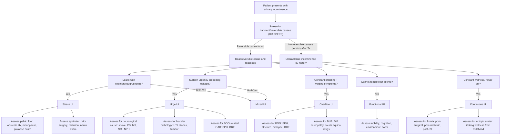

## Differential Diagnosis of Urinary Incontinence

The differential diagnosis of urinary incontinence is really a two-layered problem. First, you must determine **what type** of incontinence the patient has (stress, urge, overflow, functional, continuous, or mixed). Second, you must determine **what is causing** that type. A third — and often forgotten — layer is to always consider whether the incontinence is **transient** (reversible) before labelling it as established.

Let me walk you through this systematically, the way you'd think on a ward round.

---

### 1. The First Step: Is It Transient or Established?

Before diving into anatomical and urodynamic subtypes, always screen for **reversible causes** first. This is crucial because treating the reversible cause can cure the incontinence without any further workup.

Use the mnemonic **DIAPPERS** (covered in Part 1, reused here for the DDx framework):

| Transient Cause | Why It Causes Incontinence | How to Identify |
|---|---|---|
| **D**elirium | Acute confusion → patient cannot process bladder signals or respond appropriately | Acute onset, fluctuating cognition, identifiable precipitant |
| **I**nfection (UTI) | Mucosal inflammation → afferent hyperstimulation → reflex detrusor contractions → urge UI | Dysuria, frequency, cloudy/offensive urine, +ve urine C/ST |
| **A**trophic urethritis/vaginitis | Oestrogen deficiency → thinned urethral mucosa → loss of mucosal coaptation → reduced urethral closure pressure | Post-menopausal woman, vaginal dryness, pale atrophic mucosa on speculum |
| **P**harmaceuticals | Multiple mechanisms (see drug table in Part 1) | Temporal correlation with drug initiation/dose change |
| **P**sychological (depression) | Apathy, reduced motivation to reach toilet | Screening for depression (PHQ-9) |
| **E**xcess urine output | Polyuria overwhelms functional bladder capacity → frequency and urgency → leakage | Bladder diary showing high 24h urine volume (> 2.5-3L); check glucose, calcium, fluid intake |
| **R**estricted mobility | Cannot reach toilet in time despite intact LUT function | Observe mobility; check for arthritis, fractures, restraints |
| **S**tool impaction | Faecal mass in rectum → (1) mechanical compression of bladder neck, (2) shared sacral afferent stimulation → detrusor overactivity | DRE reveals loaded rectum; constipation history |

<Callout title="Exam Tip" type="error">
A very common mistake is to jump straight to urodynamics and surgery when a patient presents with new-onset incontinence. Always rule out transient causes first — especially UTI, medications, constipation, and delirium in the elderly. Treat these and reassess before any invasive investigation.
</Callout>

---

### 2. Differentiating the Type of Incontinence

Once you have excluded or addressed transient causes and the incontinence persists, the next step is to differentiate between the established types. This is fundamentally a clinical exercise — the history is the most powerful tool.

#### Key Differentiating Features

| Feature | Stress UI | Urge UI | Overflow | Functional | Continuous |
|---|---|---|---|---|---|
| **Leakage trigger** | Physical exertion, cough, sneeze, laugh | Sudden urgency (may be provoked by running water, cold, key-in-lock) | No clear trigger; positional changes; often at night | Inability to reach toilet | Constant, no relation to triggers |
| **Volume leaked** | Small spurts | Moderate-large gush | Constant small dribble | Variable | Constant |
| **Urgency** | Absent | ***Strong desire to void that is difficult to defer*** [2] | May be absent (bladder sensation impaired) | Present but patient cannot act on it | Absent |
| **Voiding symptoms** | Usually absent | May have frequency, nocturia | ***Hesitancy, weak stream, incomplete emptying, straining*** [6][7] | Usually absent | Usually absent |
| **Post-void residual** | Low (< 50 mL) | Low | ***Significant post-void residual, palpable bladder*** [2] | Low | Variable |
| **Typical patient** | Multiparous woman; post-prostatectomy male | Elderly woman; BPH male with OAB; neurological disease | BPH male; DM neuropathy; cauda equina | Demented/immobile elderly | Post-surgical female (fistula); congenital (ectopic ureter) |

***Clinical vs Urodynamic terminology*** [1]:
- ***Stress urinary incontinence (clinical) → Urodynamic stress incontinence (urodynamic finding)***
- ***Overactive bladder / Urgency urinary incontinence (clinical) → Detrusor overactivity (urodynamic finding)***
- ***OAB can be Dry OAB (urgency without leakage) vs Wet OAB (urgency with leakage)*** [1]

This distinction matters because the clinical symptom does not always match the urodynamic diagnosis — up to 30% of women with clinically diagnosed stress UI will have detrusor overactivity on urodynamics, and vice versa [1].

---

### 3. Differential Diagnosis by Type — Underlying Aetiologies

Now, for each type of incontinence, you need to think about what is causing it. This is where you link the symptom pattern to a specific pathology.

#### 3.1 Stress Urinary Incontinence — DDx of Causes

| Category | Specific Cause | Why It Causes SUI |
|---|---|---|
| **Pelvic floor weakness** | ***Vaginal childbirth / multiparity*** [4] | Stretching/tearing of levator ani + pudendal nerve damage → loss of urethral hammock support |
| | ***Menopause / oestrogen deficiency*** [4] | Atrophy of urethral mucosa → reduced mucosal coaptation |
| | ***Obesity*** [4] | Chronic raised intra-abdominal pressure → cumulative pelvic floor fatigue |
| | ***Chronic cough (e.g. COPD)*** [3] | Repetitive stress on pelvic floor |
| | ***Chronic constipation*** [4] | Repetitive straining |
| | Congenital collagen disorders (e.g. Ehlers-Danlos, Marfan) | Inherent weakness of connective tissue supporting urethra |
| **Intrinsic sphincter deficiency** | Post-radical prostatectomy [6] | Surgical damage to external urethral sphincter (late complication: stress UI in ~10%) |
| | Post-TURP [6] | Sphincter damage (rare, ~1%) |
| | ***Post-incontinence surgery*** [7] | Over-correction or scarring → may paradoxically worsen UI |
| | Radiation therapy | Fibrosis and devascularisation of sphincter mechanism |
| | Neurological disease (pudendal neuropathy) | Denervation of external sphincter |

***Weakened pelvic floor will contribute to stress urinary incontinence*** [4].

#### 3.2 Urge Urinary Incontinence — DDx of Causes

| Category | Specific Cause | Why It Causes UUI |
|---|---|---|
| **Neurogenic detrusor overactivity** | Stroke, TBI | Loss of cortical inhibition on pontine micturition centre → uninhibited detrusor contractions [7][8] |
| | Multiple sclerosis | Demyelination of suprasacral spinal cord pathways → interrupted coordination |
| | Parkinson's disease | Degeneration of basal ganglia inhibitory pathways on micturition reflex |
| | ***Normal pressure hydrocephalus*** [9] | Stretching of periventricular fibres controlling bladder → ***classical triad: frontal dementia, apraxic gait, urinary incontinence*** [9] |
| | Spinal cord injury (suprasacral) | Initially spinal shock (retention) → then reflex detrusor overactivity ± ***detrusor-sphincter dyssynergia*** [8][10] |
| **Non-neurogenic detrusor overactivity** | Idiopathic (most common) | Unknown — possibly myogenic or microscopic neurogenic changes |
| | Secondary to BOO (e.g. BPH) | Chronic obstruction → tissue ischaemia → denervation supersensitivity → spontaneous detrusor contractions (affects 30-60% of BOO patients) [7] |
| | ***Bladder pathology: cystitis, tumour, stones, foreign body*** [7] | Local mucosal irritation → afferent hyperstimulation → reflex detrusor overactivity |
| | Drugs (cholinesterase inhibitors) [6] | ↑ ACh at muscarinic M3 receptors on detrusor → enhanced contractility |
| | Drugs (diuretics) | Rapid bladder filling → overwhelms capacity → urgency |

#### 3.3 Overflow Incontinence — DDx of Causes

Think of this as two mechanisms: either the outlet is **blocked** or the muscle **can't squeeze**.

| Mechanism | Specific Cause | Why |
|---|---|---|
| **Bladder outlet obstruction (BOO)** | ***BPH*** (most common in males, 53% of AROU) [11] | Static (stromal hyperplasia) + dynamic (smooth muscle contraction) components obstruct urethra |
| | CA prostate [11] | Tumour invasion/compression of urethra |
| | Urethral stricture [11] | Scarring narrows urethral lumen |
| | ***Cystocele / pelvic organ prolapse*** [3][4] | ***Prolapse of the bladder leads to difficulty in completely emptying bladder, kinked urethra*** [4] |
| | Faecal impaction | Extrinsic compression of bladder neck/urethra |
| | Gynaecological tumours (e.g. fibroid) [11] | Extrinsic compression |
| | Bladder/urethral stone [11] | Mechanical luminal obstruction |
| | ***Phimosis*** [11] | Tight foreskin → obstructed urethral meatus |
| **Detrusor underactivity (DUA)** | ***DM neuropathy*** [3][4] | Autonomic neuropathy → progressive denervation of detrusor → hypotonic bladder → ↓ability to sense full bladder, incomplete emptying |
| | Cauda equina syndrome [10] | Destruction of S2-S4 motor neurons → areflexic detrusor → ***autonomic: urinary retention with overflow incontinence, faecal incontinence, impotence*** [10] |
| | Conus medullaris lesion [10] | Similar — S2-S4 segment involvement |
| | Drugs: anticholinergics, opioids, alpha-agonists | Block detrusor contraction or increase outlet resistance |
| | Acute overdistension (post-GA, post-operative) [11] | Stretches detrusor beyond optimal length for contraction → ineffective voiding |

#### 3.4 Functional Incontinence — DDx of Causes

| Cause | Why |
|---|---|
| Dementia (Alzheimer's, vascular) | Cannot recognise bladder signals or navigate to toilet |
| Impaired mobility (arthritis, stroke, fracture) | Cannot reach toilet in time |
| Environmental barriers | Distant or inaccessible toilet, restraints, unfamiliar environment (hospitalisation) |
| Lack of carer | No assistance for toileting |
| Severe depression | Apathy → does not attempt to reach toilet |

#### 3.5 Continuous Incontinence — DDx of Causes

| Cause | Why |
|---|---|
| ***Vesicovaginal fistula*** [6] | Abnormal connection between bladder and vagina → urine bypasses sphincter entirely; causes: post-hysterectomy (most common in developed countries), post-radiation, obstetric (developing countries) |
| Ureterovaginal fistula | Urine drains from ureter directly into vagina (classically post-pelvic surgery) |
| ***Ectopic ureter*** [6] | Ureter inserts below the sphincter mechanism → continuous leakage from birth (in girls); in boys, ectopic ureter always inserts above the sphincter so this doesn't cause incontinence |
| Urethral diverticulum | Pooling of urine in diverticulum → post-void dribbling / leakage |
| Severe intrinsic sphincter deficiency | Sphincter so weak that closure pressure is essentially zero |

<Callout title="Why does ectopic ureter cause incontinence in girls but not boys?" type="idea">
In males, the ectopic ureter can insert into the prostatic urethra, seminal vesicle, or vas deferens — all of which are **above** the external sphincter. So the sphincter still guards against leakage. In females, the ectopic ureter can insert into the vagina, vestibule, or distal urethra — all **below** the sphincter mechanism. Urine therefore bypasses the sphincter entirely, causing continuous leakage.
</Callout>

---

### 4. Special Differential Diagnostic Scenarios

#### 4.1 The Elderly Woman with Prolapse and Incontinence

This is a classic exam scenario (as in the theme case [3][4]):

***Internal organ prolapse, resulting in AROU → classify based on compartment of vagina that is weakened*** [3]:
- ***Anterior → cystourethrocele***
- ***Middle → uterine / vault prolapse***
- ***Posterior → rectocele***

The differential in this patient includes:
1. **Stress UI** from weakened pelvic floor (most common associated UI type)
2. **Overflow incontinence** from urethral kinking by the cystocele → ***need reduction of uterus before urination → or else it will kink the urethra, cannot urinate*** [3]
3. **Urge UI** from detrusor overactivity (can coexist)
4. **Mixed incontinence** (stress + urge — very common in this demographic)

***Remember the possibility of occult stress incontinence in case of severe prolapse*** [1] — this is a key DDx consideration before any surgical planning.

#### 4.2 The Man with LUTS and Incontinence

***Not ALL LUTS is due to BPH! → ≥ 1/3 of men with LUTS do NOT have BOO*** [7]

The differential includes:
- **BPH** → BOO → overflow UI and/or secondary detrusor overactivity → urge UI [6][7]
- **CA prostate** → BOO
- **Urethral stricture** → BOO
- **OAB** (idiopathic or neurogenic) → urge UI
- **Neurological disease** (stroke, PD, MS, NPH) → urge UI
- **Post-prostatectomy** → stress UI [6]

#### 4.3 Neurological Causes — Thinking by Level

This is a favourite exam topic. The pattern of incontinence tells you the level of the lesion:

| Level of Lesion | Examples | Bladder Pattern | Type of UI |
|---|---|---|---|
| **Suprapontine** (above pons) | Stroke, dementia, PD, NPH, brain tumour | Detrusor overactivity with coordinated sphincter relaxation | Urge UI |
| **Suprasacral spinal cord** (between pons and S2) | MS, SCI, transverse myelitis | ***Detrusor-sphincter dyssynergia (DSD)*** [2][8] — simultaneous detrusor contraction + sphincter contraction | Urge UI + high-pressure voiding → upper tract damage |
| **Sacral cord / Conus** (S2-S4) | Conus medullaris lesion, tumour | Areflexic detrusor (LMN bladder) | Overflow UI |
| **Cauda equina** | Disc herniation (L4/5, L5/S1), tumour, infection | Areflexic detrusor (LMN bladder); ***urinary retention with overflow incontinence, faecal incontinence, impotence*** [10] | Overflow UI |
| **Peripheral nerve** | DM neuropathy | Progressive detrusor underactivity | Overflow UI |

***Note that urinary incontinence may not always be due to sacral cord injuries. In suprasacral spinal cord injury, this reflex is absent in the spinal shock phase (AROU/overflow incontinence) and becomes hyperactive afterwards (urge incontinence) with reflexive bladder function (no voluntary control) or even detrusor striated sphincter dyssynergia (DESD) leading to reflux nephropathy. The pattern is all along hyporeflexic in sacral cord or nerve root injuries.*** [8]

<Callout title="Red Flag: Cauda Equina Syndrome" type="error">
***Cauda equina syndrome is the most important red flag to rule out*** in any patient with new-onset urinary retention/overflow incontinence + back pain [10]. Look for: bilateral radicular pain, saddle anaesthesia, reduced anal tone, absent bulbocavernosus reflex, lower limb LMN signs. This requires emergency MRI whole spine and surgical decompression within 48 hours — delay leads to irreversible sphincter dysfunction and incontinence [10].
</Callout>

---

### 5. Differential Diagnosis Algorithm

The following algorithm represents the clinical approach to differentiating the type and cause of urinary incontinence:

---

### 6. Putting It All Together — A Systematic DDx Table

| Type of UI | Most Common Causes | Less Common / Must-Not-Miss Causes |
|---|---|---|
| **Stress** | Pelvic floor weakness (multiparity, menopause, obesity), chronic cough, constipation | ISD (post-prostatectomy, post-radiation), congenital connective tissue disorder |
| **Urge** | Idiopathic OAB, UTI, BPH-related OAB | Neurological (stroke, MS, PD, NPH, SCI), bladder tumour, bladder stone |
| **Overflow** | BPH (males), DM neuropathy, drugs (anticholinergics) | Cauda equina syndrome, urethral stricture, pelvic organ prolapse (females) |
| **Functional** | Dementia, immobility, hospitalisation | Depression, environmental barriers |
| **Continuous** | Vesicovaginal fistula (post-hysterectomy/obstetric) | Ectopic ureter (congenital), severe ISD |
| **Mixed** | Combination of stress + urge (very common in elderly women) | Any combination of the above |
| **Transient** | UTI, medications, constipation, delirium | Atrophic vaginitis, depression, excess fluid intake |

---

### 7. History Clues That Point to Specific Diagnoses

These are the "clinical pointers" that help you narrow the DDx efficiently:

| Historical Clue | Points Towards |
|---|---|
| ***Frequency > 7 voids in daytime, urgency, nocturia, urgency urinary incontinence*** [1] | OAB / Urge UI |
| Leakage only with cough/sneeze/exertion, no urgency | Stress UI |
| Progressive difficulty voiding + dribbling in a male > 50 | BPH → overflow |
| ***DM → innervation to pelvic floor impaired*** [3] | Overflow UI (autonomic neuropathy) |
| ***COPD → chronic cough, increased abdominal pressure*** [3] | Stress UI (worsened) |
| ***Needs reduction of mass before urination*** [3] | Prolapse with urethral kinking → overflow |
| New back pain + saddle numbness + bilateral leg weakness | Cauda equina → overflow UI (EMERGENCY) |
| Gait disturbance + cognitive decline + incontinence | NPH (Hakim triad) |
| Continuous wetness since childhood with normal voiding | Ectopic ureter |
| Continuous wetness after pelvic surgery/difficult delivery | Vesicovaginal fistula |
| Acute confusion + new incontinence in hospital | Delirium (transient cause) |
| Incontinence started after new medication | Drug-induced (check which drug — see table) |
| ***Splinting required before defecation*** [3] | Rectocele → posterior compartment prolapse |

<Callout title="The NPH Triad — A Classic DDx">
***Normal pressure hydrocephalus*** presents with the triad of ***frontal dementia, apraxic gait, and urinary incontinence*** [9]. The gait disturbance typically comes first ("magnetic gait" — feet appear glued to the floor), followed by cognitive decline, and incontinence comes last. This is important because NPH is one of the **reversible causes of dementia** — ventriculoperitoneal shunting can improve all three symptoms if caught early. On imaging, ***ALL ventricles are enlarged disproportionate to sulcal effacement*** [9].
</Callout>

---

> **Key DDx Principles to Remember:**
> 1. Always screen for transient causes (DIAPPERS) before labelling incontinence as established
> 2. The history is the most powerful differentiating tool — characterise timing, triggers, volume, and associated symptoms
> 3. Clinical diagnosis does NOT always match urodynamic diagnosis — up to 30% discordance
> 4. Mixed incontinence is extremely common in elderly women — don't force a single diagnosis
> 5. Always think about neurological causes and perform a focused neuro exam (especially cauda equina — a surgical emergency)
> 6. In women with prolapse, always assess for occult stress incontinence
> 7. In men, not all LUTS = BPH — at least 1/3 of men with LUTS do not have BOO

---

<Callout title="High Yield Summary">

**DDx Framework:** (1) Rule out transient causes (DIAPPERS), (2) Characterise type by history, (3) Identify underlying aetiology

**Stress UI causes:** Pelvic floor weakness (childbirth, menopause, obesity, cough, constipation), ISD (post-surgery, radiation, neuro)

**Urge UI causes:** Idiopathic OAB (most common), neurogenic (stroke, PD, MS, NPH, SCI), bladder pathology (UTI, stones, tumour), BOO-related, drugs

**Overflow UI causes:** BOO (BPH, stricture, prolapse) or DUA (DM neuropathy, cauda equina, drugs, post-GA overdistension)

**Functional:** Dementia, immobility, environmental. **Continuous:** Fistula (VVF), ectopic ureter

**Neurological DDx by level:** Suprapontine → urge; Suprasacral cord → DSD; Sacral/cauda equina → overflow

**Red flags:** Cauda equina syndrome (back pain + saddle anaesthesia + retention → emergency MRI + decompression < 48h); NPH (gait + dementia + incontinence → reversible with VP shunt)

**Key lecture points:** Clinical vs urodynamic diagnosis distinction is critical. OAB = Dry vs Wet. Not all LUTS = BPH. Prolapse can mask occult SUI. DM impairs pelvic floor innervation. COPD increases abdominal pressure.

</Callout>

---

<ActiveRecallQuiz
  title="Active Recall - Differential Diagnosis of Urinary Incontinence"
  items={[
    {
      question: "A 70-year-old woman with severe uterine prolapse reports no urinary leakage. After pessary insertion to reduce the prolapse, she develops stress incontinence. What is this phenomenon called and why does it occur?",
      markscheme: "Occult stress incontinence. Severe prolapse kinks the urethra, mechanically obstructing it and masking underlying stress UI. When the prolapse is reduced, the urethral kinking is relieved and the weak sphincter mechanism is unmasked, revealing stress incontinence. Must be tested for before prolapse surgery to plan concomitant anti-incontinence procedure.",
    },
    {
      question: "A 55-year-old man presents with back pain, bilateral leg weakness, saddle anaesthesia, and new-onset urinary retention with overflow dribbling. What is the diagnosis, the expected bladder pattern, and the urgency of management?",
      markscheme: "Cauda equina syndrome. Bladder pattern: areflexic/hypotonic detrusor (LMN bladder) causing overflow incontinence. This is a surgical emergency requiring urgent MRI whole spine and surgical decompression within 48 hours to prevent permanent sphincter dysfunction.",
    },
    {
      question: "List four neurological conditions that cause urge urinary incontinence via suprapontine mechanisms, and explain the common pathophysiology.",
      markscheme: "Stroke, Parkinson disease, normal pressure hydrocephalus, traumatic brain injury (also accept: MS with cerebral lesions, brain tumour, dementia). Common pathophysiology: loss of cortical inhibition on the pontine micturition centre, leading to uninhibited detrusor contractions during the filling phase with preserved sphincter coordination.",
    },
    {
      question: "Explain why up to 30-60% of patients with BPH-related bladder outlet obstruction develop detrusor overactivity.",
      markscheme: "Chronic obstruction causes increased intravesical pressure during voiding, leading to detrusor wall tissue ischaemia. This results in smooth muscle injury and cholinergic denervation supersensitivity, producing spontaneous involuntary detrusor contractions (detrusor overactivity). This is why men with BPH often have both obstructive (voiding) and irritative (storage) LUTS.",
    },
    {
      question: "A woman has continuous urinary leakage since birth alongside normal voiding. What is the most likely diagnosis, and why does this condition cause incontinence in females but not males?",
      markscheme: "Ectopic ureter. In females, the ectopic ureter can insert below the sphincter mechanism (into vagina, vestibule, or distal urethra), bypassing the continence mechanism entirely. In males, the ectopic ureter always inserts above the external sphincter (prostatic urethra, seminal vesicle, vas deferens), so the sphincter still prevents leakage.",
    },
    {
      question: "Name the three components of the classical triad of normal pressure hydrocephalus and state which typically appears first and last.",
      markscheme: "Triad: (1) Apraxic gait (magnetic gait), (2) Frontal dementia, (3) Urinary incontinence. Gait disturbance typically appears first; incontinence appears last. NPH is important because it is a reversible cause of dementia (VP shunt can improve symptoms).",
    },
  ]}
/>

---

## References

[1] Lecture slides: GC 116. I felt a lump below urinary incontinence in females; genital prolapse.pdf (p53, p57)
[2] Senior notes: Ryan Ho Urogenital.pdf (p159, p160)
[3] Lecture slides: Block C - O&G Theme Case 4.pdf (p2, p4, p6)
[4] Lecture slides: Block C - O&G Theme Case 4.pdf (p4)
[6] Senior notes: Maksim Surgery Notes.pdf (p309, p316, p320)
[7] Senior notes: Ryan Ho Fundamentals.pdf (p355)
[8] Senior notes: Ryan Ho Neurology.pdf (p53)
[9] Senior notes: Ryan Ho Psychiatry.pdf (p82)
[10] Senior notes: Maksim Surgery Notes.pdf (p223); Maksim Medicine Notes.pdf (p47)
[11] Senior notes: Ryan Ho Fundamentals.pdf (p349); Ryan Ho Urogenital.pdf (p164)
