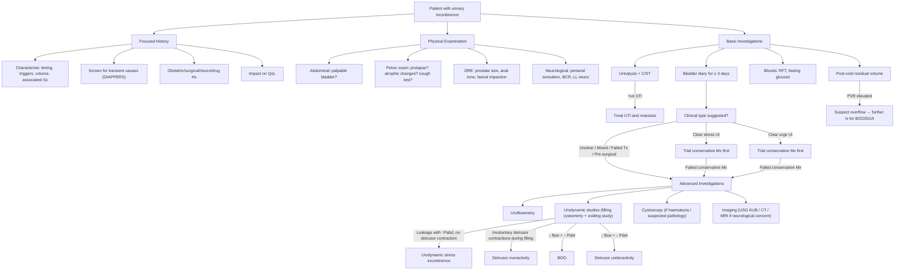

## Diagnostic Criteria, Algorithm, and Investigations for Urinary Incontinence

Here's the key concept to grasp: **urinary incontinence is primarily a clinical diagnosis made by history**, but the specific subtype and underlying cause often require confirmation by investigations — especially before surgical intervention. The clinical diagnosis and the urodynamic diagnosis are **not always the same thing**, and this distinction is exam-critical.

---

### 1. Diagnostic Criteria

Unlike many medical conditions, urinary incontinence does not have a single set of "diagnostic criteria" like the Jones criteria for rheumatic fever. Instead, diagnosis proceeds in layers: (1) confirm incontinence exists, (2) classify the type, (3) identify the cause.

#### 1.1 Clinical Diagnostic Criteria (Symptom-Based)

***The IUGA/ICS definitions (Haylen 2010)*** [1] establish the clinical diagnostic terminology:

| Clinical Diagnosis | Criteria |
|---|---|
| ***Stress urinary incontinence*** | ***Involuntary loss of urine on effort or physical exertion or on sneezing or coughing*** [1] |
| ***Urgency urinary incontinence*** | ***Involuntary loss of urine associated with urgency*** [1] |
| ***Overactive bladder (OAB)*** | Urgency ± frequency ± nocturia ± urge incontinence, in the absence of UTI or other obvious pathology; subdivided into ***Dry OAB vs Wet OAB*** [1] |
| Mixed urinary incontinence | Both stress and urgency components present |
| Overflow incontinence | Constant dribbling with significant post-void residual / palpable bladder [2] |
| Functional incontinence | Leakage due to inability to reach toilet; diagnosis of exclusion [2] |
| Continuous incontinence | Constant leakage (never dry) — think fistula or ectopic ureter [6] |

<Callout title="Clinical vs Urodynamic: Why Both Exist" type="error">
The clinical diagnosis is what the patient tells you. The urodynamic diagnosis is what the machine tells you. They do not always match — up to 30% discordance. A woman saying "I leak when I cough" might actually have detrusor overactivity provoked by coughing (not true stress UI). This is why ***urodynamics is recommended before surgical intervention*** — you want to be sure you are operating on the right diagnosis [1][7].
</Callout>

#### 1.2 Urodynamic Diagnostic Criteria

| Urodynamic Diagnosis | Criteria |
|---|---|
| ***Urodynamic stress incontinence (USI)*** | ***The finding of involuntary leakage during filling cystometry, associated with increased intra-abdominal pressure, in the absence of a detrusor contraction*** [1] |
| ***Detrusor overactivity (DO)*** | ***Involuntary detrusor muscle contractions occur during filling cystometry*** [1] — i.e. a rise in detrusor pressure (Pdet) during the filling phase that the patient cannot suppress |
| ***Bladder outlet obstruction (BOO)*** | ***↓ uroflow + ↑ detrusor pressure*** [12] — defined urodynamically, not clinically |
| Detrusor underactivity (DUA) | ***↓ uroflow + ↓ detrusor pressure*** [12] |

***BOO is a urodynamic diagnosis!*** [12]

#### 1.3 The Hald Diagram — Understanding the Diagnostic Overlap

This is conceptually important and frequently tested [7]:

- ***Bladder outlet obstruction (BOO)***: defined urodynamically (high Pdet + low flow rate) [7]
- ***Lower urinary tract symptoms (LUTS)***: defined clinically [7]
- ***Benign prostatic enlargement (BPE)***: LUTS + clinically enlarged prostate on DRE [7]

***Different patients have different components of the three — small prostate ≠ no BOO; TURP targets BOO but may not solve all LUTS. Treatment should be individualised.*** [7]

---

### 2. Diagnostic Algorithm

The overall approach follows a logical sequence: screen for reversible causes → characterise the type clinically → perform basic investigations → consider advanced investigations if needed (especially before surgery).

---

### 3. Investigation Modalities — Detailed Breakdown

#### 3.1 Bedside / First-Line Investigations

##### 3.1.1 Bladder Diary (Frequency-Volume Chart)

***Bladder diary: urine output, voiding pattern, fluid intake pattern*** [6]

- **What it is:** The patient records every void (time, volume), every fluid intake (time, volume, type), every episode of leakage, and any associated triggers/urgency, for ***≥ 3 days*** [7][2]
- **Why it matters:** This is arguably the single most informative non-invasive investigation. It tells you:

| Finding on Bladder Diary | Interpretation | Why |
|---|---|---|
| High total 24h urine volume ( > 2.5–3L) | Polyuria | Excess fluid intake, DM, DI, diuretics → the incontinence may simply be from volume overload |
| Nocturnal polyuria ( > 33% of 24h output at night) | Nocturnal polyuria | CHF, peripheral oedema redistribution, sleep apnoea, habit → explains nocturia |
| ***Frequent voiding of small volumes*** [6] | OAB / detrusor overactivity | Bladder capacity functionally reduced by involuntary contractions → patient voids frequently to avoid leakage |
| Normal volume per void but too frequent | Polyuria or excess intake | Calculate total output; if high → polyuria workup |
| Large voided volumes with infrequent voids | Possible overflow pattern | Bladder over-distended before voiding occurs |

***Perform voiding diary / frequency-volume chart: at least 3 days, especially if frequency / nocturia*** [6]

##### 3.1.2 Urinalysis and Urine C/ST

***Urine C/ST*** [6] — ***Urinalysis and C/ST: to rule out UTI*** [7]

- **Purpose:** Rule out UTI (a treatable, transient cause of urge incontinence), haematuria (may indicate bladder pathology — stones, tumour), glycosuria (undiagnosed DM)
- **Key findings:**

| Finding | Significance |
|---|---|
| Leukocytes + nitrites | UTI → treat first, then reassess incontinence |
| Haematuria | Consider bladder tumour, stones, glomerular disease → further investigation needed (cystoscopy, imaging) |
| Glycosuria | Undiagnosed/poorly controlled DM → polyuria, also neuropathy risk |
| Proteinuria | Renal disease, possible cause of polyuria |

##### 3.1.3 Post-Void Residual Volume (PVR)

- **Method:** Bladder scan (ultrasound) immediately after voiding, or catheterisation
- **What it tells you:** How much urine is left in the bladder after the patient's best effort to empty

| PVR Finding | Interpretation | Why |
|---|---|---|
| ***< 50 mL*** [12] | Normal | Bladder empties well |
| 50–200 mL | Borderline (***interpret with age: 0 mL ideal in young, accept up to 100–200 mL in elderly***) [12] | Some degree of impaired emptying, may be normal in elderly |
| > 200 mL | Significant retention | Either BOO or DUA → further investigation with uroflowmetry / urodynamics |
| ***≥ 300 mL in a patient unable to void*** | Urinary retention [13] | Requires catheterisation |
| ***≥ 1L*** | Chronic retention of urine [13] | Likely neurogenic or chronic obstruction; check RFT for obstructive nephropathy |

***The bladder was full and palpable in the suprapubic region*** [4] — in the theme case, this indicated retention requiring ***AROU → Foley insertion + documentation of first catheterisation urine volume, send urine for C/ST*** [4].

##### 3.1.4 Cough Stress Test (Provocation Test)

- **Method:** Patient stands (or lies with full bladder) and coughs vigorously while the examiner observes the urethral meatus
- **Positive test:** Visible leakage simultaneous with cough = supports clinical diagnosis of stress UI
- **Why it works:** Coughing raises intra-abdominal pressure. If the urethral sphincter mechanism is weak, the pressure exceeds urethral resistance and urine leaks
- ***Evidence of urine leakage upon straining (stress urinary incontinence)*** [4]

<Callout title="Testing for Occult Stress Incontinence">
In a patient with significant pelvic organ prolapse, the cough test should be repeated **after reducing the prolapse** (e.g. with a ring pessary or Sims speculum supporting the prolapsed tissue). If the test is negative with prolapse in situ but positive after reduction, this confirms ***occult stress incontinence*** — the prolapse was kinking the urethra and masking the incontinence. This must be done before prolapse surgery to plan for a combined anti-incontinence procedure [1].
</Callout>

##### 3.1.5 Pad Test

- **Method:** Patient wears a pre-weighed pad for 1 hour (short test) or 24 hours (long test) during standardised activities (drinking, walking, coughing, stair climbing)
- **Positive test:** Weight gain ≥ 1g (1-hour test) or ≥ 4g (24-hour test)
- **Purpose:** Objective quantification of urine loss; useful when the patient reports leakage but it cannot be demonstrated on examination

#### 3.2 Blood Investigations

***RFT (obstructive uropathy) and glucose (DM is a risk factor)*** [7]

| Blood Test | Why | Key Findings |
|---|---|---|
| ***RFT (creatinine, eGFR, urea)*** [7] | Screen for obstructive uropathy (bilateral obstruction → post-renal AKI), CKD | Elevated creatinine suggests upper tract compromise — urgent if overflow pattern |
| ***Fasting glucose / HbA1c*** [7][2] | DM causes polyuria (osmotic diuresis) and autonomic neuropathy (detrusor underactivity) | Elevated glucose → manage DM; neuropathy workup if suspected |
| Calcium | Hypercalcaemia causes polyuria (nephrogenic DI) | Elevated → malignancy workup, PTH |
| TFT | Hyperthyroidism → polyuria; hypothyroidism → constipation (exacerbates incontinence) | Usually second-line |
| ***PSA (in males)*** [7] | ***Controversial, probably not indicated but often taken. EAU 2017: measured if dx of CA prostate will change Mx*** [7] | Elevated → further prostate workup. ***Do NOT take PSA in AROU → false elevation (to be done 4–6 weeks later)*** [13] |

#### 3.3 Symptom Scores

##### ***International Prostate Symptom Score (IPSS)*** [7]

- ***Use: quantify severity of LUTS, predict treatment response, guide Tx decision and monitor response to Tx (NOT a diagnostic tool)*** [7]
- ***Involves:*** [7]
  - ***Voiding symptoms: incomplete emptying, intermittency, weak stream, straining***
  - ***Storage symptoms: frequency, urgency, nocturia***
  - ***Quality of life measure***
- ***Interpretation: mild (1–7), moderate (8–19), severe (20–35)*** [7]
- Despite its name, it can be used in both sexes for quantifying LUTS severity

Other validated questionnaires (for women specifically):
- **ICIQ-SF** (International Consultation on Incontinence Questionnaire — Short Form): widely used, covers frequency, volume, impact on QoL, and type of incontinence
- **King's Health Questionnaire**: assesses QoL impact across multiple domains
- **UDI-6** (Urogenital Distress Inventory): brief screening tool

#### 3.4 Uroflowmetry

***Uroflowmetry: screening for BOO (does not rule out DUA!)*** [7]

**What it is:** A non-invasive test where the patient urinates into a funnel device that measures the volume of urine accumulated over time, generating a flow-time curve [12].

**Procedure:** Patient voids with a comfortably full bladder into the uroflowmeter. ***Uroflow requires voided volume > 150 mL to be valid*** [12][6]. Post-void residual (PVR) is measured immediately after by bladder scan.

**Key findings and interpretation:**

| Parameter | Normal | Abnormal | What It Means |
|---|---|---|---|
| ***Flow curve pattern*** | ***Bell-shaped*** [12] | ***↓ peak (BPH)***: flattened curve; ***Plateaued (urethral stricture)***: constant low flow [12] | Shape gives a clue to the nature of obstruction |
| ***Peak flow rate (Qmax)*** | ***> 15 mL/s (M); > 30 mL/s (F)*** [12] | < 15 mL/s (M) suggests possible BOO | ***Significance: 90% no BOO if Qmax > 15 mL/s; 60% if 10–15; 33% if < 10*** [12] |
| ***Qmax < 10 mL/s*** [6] | — | Strongly suggestive of BOO | ***Better outcome after TURP if Qmax < 10*** [6] — prognostic value |
| ***Strain pattern*** | Single smooth peak | ***Multiple peaks (abnormal strain pattern)*** [6] | Patient using abdominal muscles to push urine out → either obstruction or detrusor weakness |
| ***Post-void residual*** | ***< 50 mL*** [12] | ***< 150 mL*** generally acceptable; > 200 mL significant [6] | Elevated PVR → either BOO or DUA |

<Callout title="Critical Caveat" type="error">
***Uroflowmetry alone is NOT sufficient to diagnose outlet obstruction!*** [12] A low Qmax can be caused by either BOO or DUA — both produce a ↓ flow rate. You **cannot** distinguish between the two without measuring detrusor pressure simultaneously, which requires urodynamics. Additionally, ***18% of patients have obstruction despite Qmax > 15 mL/s*** [12]. Uroflowmetry is a screening tool, not a definitive diagnostic test.
</Callout>

#### 3.5 Urodynamic Studies (Gold Standard)

***Urodynamic study to differentiate type if history not diagnostic*** [6]

***Urodynamics: gold-standard for dx of BOO*** [7]

***Cystometry is basically a portion of urodynamic studies*** [4]

**What it is:** A comprehensive assessment of bladder and urethral function during filling and voiding phases. It measures pressures, flow rates, volumes, and sphincter activity simultaneously.

**Indications:** [12]
- Clinical type uncertain (especially mixed incontinence)
- ***Suspicious for non-BPH cause: history of neurological disease, young age < 50 years*** [12]
- ***Failed initial treatment*** [12]
- ***Before surgical intervention*** (essential to confirm the diagnosis you are operating on) [4]
- Suspected DSD, neurogenic bladder

**Procedure:** [12]
1. A dual-lumen catheter is inserted into the bladder via the urethra (one lumen fills, one measures intravesical pressure)
2. A rectal catheter is placed (measures intra-abdominal pressure as a surrogate)
3. ***Detrusor pressure (Pdet) = Intravesical pressure (Pves) − Intra-abdominal pressure (Pabd)*** [12]
4. The bladder is slowly filled with saline (or contrast, if videourodynamics)
5. During **filling phase** (cystometry): record first sensation of filling, first desire to void, strong desire to void, maximum cystometric capacity; look for involuntary detrusor contractions
6. During **voiding phase** (pressure-flow study): patient voids → measure Pdet and flow rate simultaneously
7. Additional: uroflowmetry integrated; sphincter EMG (usually not done in routine practice) [12]; contrast cystogram to assess reflux and voiding function [12]

**Key findings and interpretation:**

| Phase | Finding | Diagnosis | Why |
|---|---|---|---|
| **Filling** | ***Leakage with ↑ Pabd, NO detrusor contraction*** | ***Urodynamic stress incontinence (USI)*** [1][4] | Proves that leakage is from raised abdominal pressure overcoming a weak sphincter, NOT from an involuntary bladder contraction |
| **Filling** | ***Involuntary detrusor contractions*** (rise in Pdet during filling that the patient cannot suppress) | ***Detrusor overactivity (DO)*** [1] | Proves the bladder is contracting when it shouldn't be |
| **Voiding** | ***↓ Qmax + ↑ Pdet*** | ***BOO*** [12] | The bladder is squeezing hard (high pressure) but urine isn't flowing well (low flow) → obstruction |
| **Voiding** | ***↓ Qmax + ↓ Pdet*** | ***Detrusor underactivity (DUA)*** [12] | The bladder isn't squeezing adequately → low pressure AND low flow |
| **Filling** | Simultaneous detrusor contraction + sphincter contraction | ***Detrusor-sphincter dyssynergia (DSD)*** | Both contract at once → very high pressures → danger to upper tract |
| **Filling** | Reduced cystometric capacity, early first desire to void | Reduced compliance or overactivity | May indicate fibrosis (post-radiation) or neurogenic cause |

**Specific urodynamic measurements for incontinence:**
- ***Leak point pressure (LPP)***: the abdominal (Pabd) or detrusor (Pdet) pressure at which leakage occurs [2]
  - **Abdominal LPP** (Valsalva LPP): < 60 cmH₂O suggests intrinsic sphincter deficiency; > 90 cmH₂O suggests urethral hypermobility
  - Clinical significance: helps determine which surgical approach is best
- ***Urethral pressure profilometry (UPP)***: measures urethral pressure along its length → generates a urethral pressure profile [2]
  - Maximum urethral closure pressure (MUCP) = maximum urethral pressure − bladder pressure
  - Low MUCP ( < 20 cmH₂O) suggests intrinsic sphincter deficiency

***From the theme case: the diagnosis from the filling phase cystometrogram was stress urinary incontinence*** [4] — meaning they saw leakage with increased abdominal pressure and no involuntary detrusor contraction.

<Callout title="When Do You NEED Urodynamics?">
Not every patient needs urodynamics. For a straightforward case (e.g. young multiparous woman with pure stress symptoms, positive cough test, no voiding symptoms), conservative management can be started empirically. Urodynamics is reserved for: (1) diagnostic uncertainty, (2) failed conservative treatment, (3) before surgery, (4) neurological component suspected, (5) recurrent incontinence after previous surgery [12][6].
</Callout>

#### 3.6 Cystoscopy

***Cystoscopy*** [6]

- **What it is:** Direct visualisation of the bladder interior using a camera
- **Types:** Flexible (under LA, outpatient) vs rigid (under GA, allows biopsy/therapeutic intervention) [6]
- **Indications in UI workup:**
  - Haematuria (to rule out bladder tumour)
  - Suspected bladder pathology (stones, tumour, foreign body, diverticulum)
  - Recurrent UTI (looking for structural cause)
  - Suspected fistula (VVF — may see the fistula opening in the bladder wall)
  - NOT routinely indicated in straightforward stress or urge UI

| Finding | Significance |
|---|---|
| Bladder tumour | Cause of haematuria and irritative LUTS / urgency |
| Bladder stone | Cause of irritative symptoms and urgency |
| Trabeculation of bladder wall | Chronic BOO → detrusor hypertrophy (the muscle works harder against the obstruction and becomes thickened, like a bodybuilder) |
| Diverticulum | Outpouching from chronic high pressures; site of stagnant urine → recurrent UTI |
| Fistula opening | Confirms VVF or uretero-vesical fistula |
| Urethral stricture | Identified during passage of scope |

#### 3.7 Imaging

Imaging is not routinely first-line for UI but is indicated in specific situations:

| Modality | When to Use | Key Findings |
|---|---|---|
| ***KUB (plain X-ray)*** [4] | AROU (to check for stones, faecal loading); ***immediate action for AROU: Foley insertion + KUB*** [4] | Radio-opaque stones, faecal loading in rectum/colon |
| **Renal/bladder USG** | Elevated PVR, elevated RFT (check for hydronephrosis), palpable mass | Hydronephrosis (obstruction), bladder wall thickening, large PVR, renal masses, adnexal masses |
| ***Transvaginal USG*** [14] | ***PV detect adnexal mass + urinary incontinence → transvaginal US is the most appropriate imaging*** [14] | Pelvic masses (fibroid, ovarian tumour) that may compress bladder; also assesses bladder neck position |
| **CT urogram** | Haematuria workup (to rule out upper tract tumour, stones) [6] | Non-contrast: stones; parenchymal phase: tumours; excretory phase: urothelial lesions |
| **MRI pelvis** | Suspected fistula (best modality for delineating fistula tract), neurological causes (MRI spine for cauda equina / cord lesion) | Fistula tract, disc herniation, cord compression, tethered cord |
| ***Micturating cystourethrogram (MCU)*** [15] | ***Most commonly paediatric patients; vesicoureteric reflux; study of urethral anatomy during micturition*** [15] | VUR (contrast refluxing up ureters during voiding), posterior urethral valves in boys, urethral diverticulum |

---

### 4. Special Investigation Scenarios

#### 4.1 The Theme Case Approach (Mrs. Wong) [4]

This is the exact approach demonstrated in the O&G theme case and is highly testable:

1. ***Immediate action for AROU: Foley insertion + documentation of first catheterisation urine volume + send urine for C/ST*** [4]
2. ***KUB*** [4]
3. Discharge plan: ***Ring pessary + teach pelvic floor exercises + bladder training*** [4]
4. Follow-up with ***frequency-volume chart*** [4]
5. When conservative management failed (pessary fell out) → ***cystometry arranged*** [4]
6. ***Filling phase cystometrogram → diagnosis of stress urinary incontinence*** [4]
7. Then proceed to surgical planning (if patient opts for surgery)

#### 4.2 Assessment of Prolapse with Incontinence

***Assess degree of prolapse in relation to introitus + ask patient to cough / bear down*** [4]

***Can use the speculum to determine the compartment of prolapse*** [4]

***POP-Q score*** (Pelvic Organ Prolapse Quantification) [4] — the standardised scoring system that uses 6 defined points on the vaginal wall, measured in centimetres relative to the hymen:
- Negative values = above the hymen
- Zero = at the hymen
- Positive values = below the hymen (prolapsing beyond introitus)

#### 4.3 When Neurological Cause Is Suspected

- Focused lower limb neurological examination (power, reflexes, sensation)
- ***Perianal sensation, anal tone, bulbocavernosus reflex (BCR, S2-4)*** [2]
  - ***BCR: anal sphincter contraction upon squeezing of glans penis/clitoris/tugging on Foley*** [10] — tests the S2-4 sacral reflex arc
  - Absent BCR → suggests LMN lesion (sacral cord/cauda equina)
- ***MRI whole spine*** if cauda equina syndrome suspected [10]
- Video-urodynamics with EMG: for DSD characterisation

---

### 5. Summary Table: Which Investigation for Which Question?

| Clinical Question | Investigation | Expected Finding |
|---|---|---|
| Is there a UTI? | Urinalysis + C/ST | Leukocytes, nitrites, positive culture |
| How much is the patient voiding and when? | Bladder diary (≥ 3 days) | Frequency, volume patterns, triggers |
| Is there urinary retention? | Bladder scan / PVR | Elevated PVR > 200 mL |
| Is there obstruction? (screening) | Uroflowmetry | ↓ Qmax, abnormal flow pattern |
| Is it BOO or DUA? | Urodynamic studies | BOO: ↓ flow + ↑ Pdet; DUA: ↓ flow + ↓ Pdet |
| Is it true stress incontinence? | Cough stress test (bedside) → Urodynamics (definitive) | Leakage with ↑ Pabd, no detrusor contraction |
| Is it detrusor overactivity? | Urodynamics (filling cystometry) | Involuntary detrusor contractions during filling |
| Is there a bladder tumour/stone/fistula? | Cystoscopy | Direct visualisation of pathology |
| Is there upper tract damage? | RFT + renal USG | Elevated creatinine, hydronephrosis |
| Is there a pelvic mass causing compression? | Transvaginal USG | Fibroid, ovarian mass |
| Is there a neurological cause? | Neuro exam + MRI spine | Absent BCR, cauda equina findings on MRI |
| Is there a fistula? | MRI pelvis ± cystoscopy ± dye test | Fistula tract visualised |
| What is the severity of LUTS? | IPSS | Mild (1-7), moderate (8-19), severe (20-35) |

---

<Callout title="High Yield Summary">

**Diagnosis of UI is clinical first, urodynamic second.** History + bladder diary + cough test can diagnose most cases.

**Clinical vs Urodynamic terminology** (must know): SUI ↔ USI; OAB/UUI ↔ Detrusor overactivity. Haylen 2010 IUGA/ICS definitions.

**Basic Ix for all patients:** Urinalysis + C/ST, bladder diary (≥ 3 days), PVR (bladder scan), bloods (RFT, glucose).

**Uroflowmetry:** Screening for BOO. Needs voided volume > 150 mL. Qmax > 15 = 90% no BOO. Cannot distinguish BOO from DUA alone. Not sufficient to diagnose obstruction by itself.

**Urodynamics:** Gold standard. Pdet = Pves − Pabd. Filling phase diagnoses USI and DO. Voiding phase diagnoses BOO vs DUA. Essential before surgery.

**BOO is a urodynamic diagnosis** — not clinical, not by uroflowmetry alone.

**IPSS:** Quantifies LUTS severity (mild/moderate/severe). NOT a diagnostic tool.

**Theme case approach:** AROU → Foley + document volume + C/ST + KUB → conservative Mx → if fails → cystometry → plan surgery.

**Occult stress incontinence:** Test by reducing prolapse then performing cough test.

**PSA pitfall:** Do NOT check PSA during AROU — false elevation. Wait 4-6 weeks.

</Callout>

---

<ActiveRecallQuiz
  title="Active Recall - Diagnosis and Investigation of Urinary Incontinence"
  items={[
    {
      question: "Define urodynamic stress incontinence using the IUGA/ICS criteria. How does this differ from the clinical definition of stress urinary incontinence?",
      markscheme: "USI: involuntary leakage during filling cystometry, associated with increased intra-abdominal pressure, in the absence of a detrusor contraction. Clinical SUI: involuntary loss of urine on effort, physical exertion, sneezing, or coughing. The difference is that USI is confirmed objectively on urodynamics whereas clinical SUI is symptom-based. Up to 30% discordance between the two — some women with clinical SUI actually have detrusor overactivity on urodynamics.",
    },
    {
      question: "On urodynamics, how do you distinguish bladder outlet obstruction from detrusor underactivity? Why can uroflowmetry alone not make this distinction?",
      markscheme: "BOO: decreased flow rate + increased detrusor pressure (Pdet). DUA: decreased flow rate + decreased Pdet. Uroflowmetry only measures flow rate — both conditions produce low Qmax. Without simultaneous Pdet measurement (which requires urodynamics), you cannot tell if the low flow is from obstruction (high back-pressure) or weak muscle (low driving pressure).",
    },
    {
      question: "A patient with AROU and pelvic organ prolapse presents to the gynaecological ward. List four immediate actions in order.",
      markscheme: "(1) Foley catheter insertion, (2) Document first catheterisation urine volume, (3) Send catheterised urine for C/ST, (4) KUB. Do NOT check PSA if male — AROU causes false elevation; wait 4-6 weeks.",
    },
    {
      question: "State the minimum voided volume required for a valid uroflowmetry reading, the normal Qmax threshold in males, and the probability of no BOO at different Qmax values.",
      markscheme: "Minimum voided volume: 150 mL. Normal Qmax in males: > 15 mL/s. Probability of no BOO: 90% if Qmax > 15 mL/s, 60% if 10-15 mL/s, 33% if < 10 mL/s. However, 18% still have obstruction despite Qmax > 15 mL/s — uroflowmetry alone is not sufficient.",
    },
    {
      question: "What is the significance of Leak Point Pressure in the urodynamic assessment of stress incontinence? What do different LPP values indicate?",
      markscheme: "Leak Point Pressure (LPP) is the abdominal or detrusor pressure at which leakage occurs. Abdominal LPP < 60 cmH2O suggests intrinsic sphincter deficiency (the sphincter itself is weak). Abdominal LPP > 90 cmH2O suggests urethral hypermobility (the sphincter works but the support is poor). This distinction guides surgical approach — ISD may need a sling or bulking agent rather than simple repositioning.",
    },
    {
      question: "A postmenopausal woman has a left adnexal mass detected on PV examination and also has urinary incontinence. What is the most appropriate imaging investigation?",
      markscheme: "Transvaginal ultrasound. This is the most appropriate initial imaging for evaluating an adnexal mass detected on PV examination and can also assess the bladder and pelvic floor structures. Superior to transabdominal US for pelvic pathology in this context.",
    },
  ]}
/>

---

## References

[1] Lecture slides: GC 116. I felt a lump below urinary incontinence in females; genital prolapse.pdf (p53)
[2] Senior notes: Ryan Ho Urogenital.pdf (p159, p161)
[4] Lecture slides: Block C - O&G Theme Case 4.pdf (p3, p4, p5, p6)
[6] Senior notes: Maksim Surgery Notes.pdf (p309, p316)
[7] Senior notes: Ryan Ho Fundamentals.pdf (p354, p355); Ryan Ho Urogenital.pdf (p170)
[8] Senior notes: Ryan Ho Neurology.pdf (p53)
[10] Senior notes: Maksim Medicine Notes.pdf (p47)
[12] Senior notes: Ryan Ho Fundamentals.pdf (p356, p357); Ryan Ho Urogenital.pdf (p171)
[13] Senior notes: Ryan Ho Fundamentals.pdf (p352)
[14] Senior notes: Ryan Ho Radiology.pdf (p40)
[15] Senior notes: Ryan Ho Diagnostic Radiology.pdf (p23)
