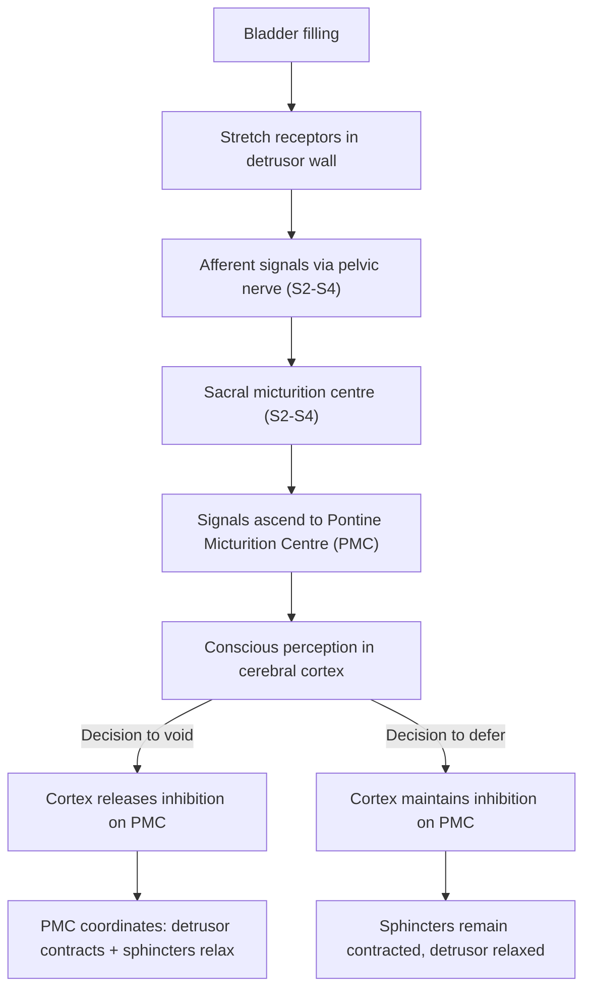

# Urinary Incontinence

## 1. Definition

***Urinary incontinence (UI): the complaint of any involuntary leakage of urine*** [1]. This is the standardised IUGA/ICS (International Urogynecological Association / International Continence Society) definition from 2010 [1].

Let's break down the terminology:
- "Urinary" = relating to urine (Latin: *urina*)
- "Incontinence" = inability to contain (Latin: *in-* = not, *continentia* = holding together)

So the name literally tells you: the person cannot hold their urine in.

<Callout title="Key Distinction">
UI is **not** the same as enuresis. **Enuresis** refers to *any* involuntary loss of urine (classically nocturnal bedwetting), while **urinary incontinence** specifically implies it is a social/hygienic problem that is objectively demonstrable [2]. In clinical practice, "incontinence" carries the connotation of a clinically significant complaint affecting quality of life.
</Callout>

Related terminology:
- **Nocturia**: waking ≥ 1 time per night to void, with each void preceded and followed by sleep [2]
- **Overactive bladder (OAB)**: a clinical syndrome of urgency ± frequency ± nocturia ± urge incontinence, in the absence of UTI or other obvious pathology — subdivided into ***Dry OAB*** (urgency without leakage) vs ***Wet OAB*** (urgency with leakage, i.e. urge incontinence) [1]

---

## 2. Epidemiology

- ***Prevalence is highly variable because of differences in definition, method of enquiry, and the nature of the population studied*** [1]
- General figures: affects approximately ***1 in 4 women and 1 in 10 men***, with prevalence ***increasing with age but NOT a normal part of ageing*** [2]
- In women:
  - Stress UI is the most common type in younger women (< 60 years)
  - Mixed incontinence becomes more prevalent with age
  - Urge UI predominates in older women (> 70 years)
- In men:
  - UI is less common than in women (the prostate acts as a continence device) [2]
  - Post-prostatectomy stress UI is a significant cause
  - Urge UI from OAB/BPH is common in older men
- **Hong Kong context**: With an ageing population and high prevalence of diabetes mellitus, UI is a significant public health issue. Many patients under-report symptoms due to embarrassment or the misconception that it is a normal part of ageing.

***Genital prolapse and incontinence are important primary health problems of women*** [3].

***Although genital prolapse and urinary incontinence are not life-threatening conditions, they can affect the quality of life of a woman*** [3].

<Callout title="High Yield Exam Point">
UI is NOT a normal part of ageing. Always look for a treatable cause. The prevalence increases with age due to accumulation of risk factors (pelvic floor weakening, comorbidities, medications), not because of ageing per se.
</Callout>

---

## 3. Risk Factors

Risk factors are best understood by thinking about what maintains continence and what can go wrong.

### Female-specific risk factors (heavily emphasised in lectures):

| Risk Factor | Mechanism / Why |
|---|---|
| ***Vaginal childbirth / Multiparity*** [1][3][4] | Stretching and tearing of pelvic floor muscles (levator ani), pudendal nerve damage during delivery, fascial disruption — all weaken the support holding the urethra and bladder neck in place |
| ***Menopause*** [4] | Oestrogen deficiency → atrophy of urethral mucosa and periurethral tissues → reduced mucosal coaptation and submucosal vascular cushion → reduced intrinsic urethral closure pressure |
| ***Obesity / Raised BMI*** [4][5] | Chronically raised intra-abdominal pressure → stretches and weakens pelvic floor over time; also a risk factor for prolapse progression |
| ***Age*** [4] | Cumulative tissue degeneration, sarcopenia of pelvic floor muscles, reduced collagen quality |
| ***Chronic constipation*** [4] | Repeated straining → chronic raised intra-abdominal pressure → pelvic floor damage |
| ***Diabetes mellitus*** [4] | Autonomic neuropathy → detrusor underactivity → overflow incontinence; also peripheral neuropathy affecting pelvic floor innervation; diabetic polyuria worsens symptoms |
| ***Pelvic surgery / radiotherapy*** | Disruption of pelvic floor support, nerve damage |
| ***Grand multiparity*** [5] | More deliveries = more cumulative pelvic floor trauma |

### General risk factors (both sexes):

| Risk Factor | Mechanism |
|---|---|
| Neurological disease (stroke, MS, PD, SCI, NPH) | Disruption of pontine micturition centre control → detrusor overactivity or detrusor-sphincter dyssynergia |
| Medications (see drug causes below) | Anticholinergics → retention → overflow; diuretics → polyuria; alpha-blockers → reduced sphincter tone |
| Cognitive impairment / dementia | Functional incontinence — inability to recognise urge or reach toilet |
| Impaired mobility | Functional incontinence |
| UTI | Bladder mucosal irritation → detrusor overactivity → transient urge incontinence |
| Smoking | Chronic cough → repetitive stress on pelvic floor |
| Caffeine / excessive fluid intake | Bladder irritant + polyuria |

### Male-specific risk factors:

| Risk Factor | Mechanism |
|---|---|
| Post-prostatectomy (radical or TURP) | Damage to external sphincter mechanism → stress UI (10% after RP) [6] |
| BPH | Detrusor overactivity secondary to chronic BOO → urge UI; or chronic retention → overflow UI |

---

## 4. Anatomy and Function of the Continence Mechanism

Understanding incontinence requires understanding what keeps you continent. Think of it as a system with structural, muscular, neural, and mucosal components all working together.

### 4.1 The Pelvic Floor

***The pelvic floor is more than just the levator ani muscles. More accurately, it includes all structures supporting the pelvic cavity: peritoneum, pelvic viscera, endopelvic fascia, levator ani, perineal membrane, and superficial genital muscles*** [3].

#### Key components:

1. **Levator ani muscle complex** (the most important muscular component):
   - Comprises: pubococcygeus (including pubovaginalis in women), puborectalis, iliococcygeus
   - Innervation: direct branches from S3–S4 (pudendal nerve branches and direct sacral branches)
   - Function: provides a "hammock" of tonic contraction that supports pelvic organs and keeps the urogenital hiatus closed
   - The **pubovaginalis** portion specifically forms a U-shaped sling around the vagina and urethra in women — when it contracts, it compresses the urethra against the pubic symphysis

2. **Endopelvic fascia** (connective tissue):
   - Pubocervical fascia (anterior vaginal wall support → supports bladder)
   - Rectovaginal fascia (posterior vaginal wall support → supports rectum)
   - Cardinal and uterosacral ligaments (apical support)
   - When this fascia weakens or tears, organs prolapse through the vaginal walls

3. **Perineal membrane** (urogenital diaphragm):
   - A triangular fibromuscular sheet spanning the anterior pelvic outlet
   - Supports the distal urethra and vagina

4. **External urethral sphincter** (rhabdosphincter):
   - Striated muscle under voluntary (somatic) control
   - Innervated by the pudendal nerve (S2–S4)
   - Provides "guarding reflex" — reflexive contraction during sudden increases in abdominal pressure (cough, sneeze)

### 4.2 Mechanisms of Continence

***Physiologically, continence arises from*** [2]:

1. ***Anatomical support by intact pelvic floor holding bladder neck and urethra in place (especially in females)*** [2]
   - The "hammock hypothesis" (DeLancey): the urethra rests on a hammock of supportive tissue (anterior vaginal wall + endopelvic fascia + levator ani). When abdominal pressure rises, the urethra is compressed against this hammock → maintains closure
   - If the hammock is weak or lax (e.g. after vaginal delivery), the urethra descends and can no longer be compressed → stress incontinence

2. ***Intrinsic urethral mechanism by*** [2]:
   - ***Coaptation of mucosa*** — the urethral mucosa folds inward to create a watertight seal (oestrogen-dependent in women — this is why menopause is a risk factor)
   - ***Compression by submucosa and internal/external sphincters*** — the submucosal vascular plexus acts as a "cushion" that helps seal the urethra; the smooth muscle internal sphincter (sympathetic, α1-adrenergic tone) provides resting tone; the striated external sphincter provides voluntary and reflex closure

3. ***Prostate as a continence device in males → the above factors are less important*** [2]
   - The prostate surrounds the proximal urethra and contributes to urethral resistance. This is why men have lower rates of stress incontinence — but it also explains why prostatectomy can cause stress UI.

4. ***Neurological control by CNS and spinal cord*** [2]

### 4.3 Neural Control of Micturition

This is absolutely critical to understand because different neurological lesions produce different types of incontinence.

#### The micturition reflex arc:

#### Key neural pathways:

| Component | Nerve | Origin | Neurotransmitter | Effect |
|---|---|---|---|---|
| **Parasympathetic** (pelvic nerve) | Pelvic splanchnic nerves | S2–S4 | ACh (muscarinic M3) | Detrusor **contraction** (voiding) |
| **Sympathetic** (hypogastric nerve) | Hypogastric nerve | T10–L2 | Noradrenaline | β3 receptors on detrusor → **relaxation** (storage); α1 receptors on bladder neck/internal sphincter → **contraction** (storage) |
| **Somatic** (pudendal nerve) | Pudendal nerve | S2–S4 (Onuf's nucleus) | ACh (nicotinic) | External sphincter **contraction** (voluntary continence) |
| **Central** | — | Pontine micturition centre, cerebral cortex | — | Coordinates the switch between storage and voiding; provides conscious control |

#### Patterns of neurological bladder dysfunction:

| Lesion Location | Phase | Pattern | Result |
|---|---|---|---|
| **Suprapontine** (stroke, dementia, PD, NPH) | Loss of cortical inhibition on PMC | Detrusor overactivity with intact coordination | **Urge incontinence** (the bladder contracts involuntarily but sphincters still relax appropriately) |
| **Suprasacral spinal cord** (SCI above S2, MS) | Loss of PMC coordination | ***Detrusor-sphincter dyssynergia (DSD)***: simultaneous contraction of detrusor AND sphincters [2][7] | High-pressure voiding → **upper tract damage**, UTI, autonomic dysreflexia |
| **Sacral cord / cauda equina** (S2–S4 lesion) | Loss of detrusor motor innervation | Areflexic/hypotonic bladder | **Overflow incontinence** (constant dribbling, large residual) |
| **Peripheral nerve** (DM neuropathy) | Progressive denervation | Detrusor underactivity | **Overflow incontinence** |

<Callout title="Why does suprasacral SCI cause DSD?" type="idea">
Normally, the PMC (Barrington's nucleus in the pons) acts as the "coordination centre" — when it commands the detrusor to contract, it simultaneously commands the external sphincter to relax. In suprasacral SCI, the spinal reflex arc is intact (so the detrusor can contract reflexively), but the PMC signal that tells the sphincter to relax is interrupted. The result: both contract at the same time → very high intravesical pressures → risk of vesicoureteral reflux → hydronephrosis → renal failure [2][7].
</Callout>

---

## 5. Aetiology and Pathophysiology

### 5.1 Classification of Urinary Incontinence by Type

***Subtypes of urinary incontinence: Structural incontinence, Stress, Urge, Overflow, Functional, Mixed*** [3].

#### 5.1.1 Stress Urinary Incontinence (SUI)

**Definition (Clinical):** ***Stress urinary incontinence — involuntary loss of urine on effort or physical exertion or on sneezing or coughing*** [1]

**Definition (Urodynamic):** ***Urodynamic stress incontinence — the finding of involuntary leakage during filling cystometry, associated with increased intra-abdominal pressure, in the absence of a detrusor contraction*** [1]

<Callout title="Clinical vs Urodynamic Diagnosis" type="error">
The clinical symptom is called "stress urinary incontinence." The confirmed urodynamic diagnosis is called "urodynamic stress incontinence." They are not interchangeable — a woman who complains of stress incontinence may actually have detrusor overactivity on urodynamics. This is why urodynamics may be needed before surgery [1].
</Callout>

**Pathophysiology — two mechanisms:**

1. **Urethral hypermobility** (most common):
   - ***Weakened pelvic floor*** → loss of anatomical support for the urethra and bladder neck [1][4]
   - When abdominal pressure rises (cough, sneeze, Valsalva), the urethra is no longer compressed against the supportive "hammock" → intra-abdominal pressure exceeds urethral closure pressure → leakage
   - ***Intra-abdominal pressure > urethral pressure*** [6]
   - Risk factors: vaginal delivery, menopause, obesity, chronic straining

2. **Intrinsic sphincter deficiency (ISD):**
   - The sphincter mechanism itself is deficient (weak muscular tone, poor mucosal coaptation)
   - Causes: prior surgery (e.g. radical prostatectomy, anti-incontinence surgery), radiation, neurological disease, ageing
   - Typically more severe — leaks with minimal provocation or even at rest

**Triggers:** cough, sneeze, laughing, heavy lifting, running, jumping — anything that raises intra-abdominal pressure [2]

#### 5.1.2 Urge Urinary Incontinence (UUI)

**Definition (Clinical):** ***Urgency urinary incontinence — involuntary loss of urine associated with urgency*** [1]

**Definition (Urodynamic):** ***Detrusor overactivity — involuntary detrusor muscle contractions occur during filling cystometry*** [1]

**Pathophysiology:**
- The detrusor muscle contracts involuntarily during the filling/storage phase, generating intravesical pressure that overcomes urethral resistance → leakage
- ***Overactive bladder syndrome / detrusor hyperactivity causing increased intravesical pressure*** [6]

**Aetiologies of detrusor overactivity:**

| Category | Examples | Mechanism |
|---|---|---|
| **Neurogenic** | Stroke, PD, MS, SCI, NPH, TBI | Loss of cortical inhibition on PMC → uninhibited detrusor contractions [7] |
| **Non-neurogenic** | Idiopathic (most common), secondary to BOO, bladder pathology (cystitis, tumour, stones, FB), drugs (cholinesterase inhibitors) [7] | Various: inflammation → afferent hypersensitivity; BOO → tissue ischaemia → denervation supersensitivity; idiopathic: possibly myogenic or neurogenic micro-changes |
| **Infection** | UTI | Mucosal inflammation → afferent hyperstimulation → reflex detrusor contractions [6] |

***Idiopathic detrusor overactivity*** is the most common cause and its exact pathophysiology remains incompletely understood [3].

<Callout title="BOO → OAB Connection" type="idea">
Up to 30-60% of patients with bladder outlet obstruction develop detrusor overactivity. The postulated mechanism: chronic obstruction → ↑ intravesical pressure → tissue ischaemia → smooth muscle injury and cholinergic denervation supersensitivity → spontaneous detrusor contractions [7]. This is why men with BPH often have both obstructive AND irritative LUTS.
</Callout>

#### 5.1.3 Mixed Incontinence

- Combination of both stress and urge incontinence
- ***Often mixed with SUI (mixed incontinence) and may be worsened by anxiety/stress*** [2]
- Very common in older women
- Management targets the predominant, most bothersome component first

#### 5.1.4 Overflow Incontinence

**Definition:** ***Constant dribbling (especially at night) with associated retention of urine*** [2]

**Pathophysiology:**
- ***BOO / detrusor underactivity (DUA) → bladder over-distension with continuous dribbling*** [2]
- The bladder fills beyond its capacity and "spills over" — urethral pressure is eventually exceeded by the sheer volume of urine
- ***Chronic urinary retention*** [6]

**Causes:**
- **Obstruction:** BPH (most common in men), urethral stricture, pelvic organ prolapse (in women — ***cystocele leads to difficulty in completely emptying bladder, kinked urethra*** [4]), faecal impaction
- **Underactive detrusor:** DM neuropathy, cauda equina syndrome, post-anaesthetic, medications (anticholinergics, opioids), chronic overdistension injury

**Signs:** ***Significant post-void residual, palpable bladder*** [2]

**Complications:** ***UTI, bladder stones, obstructive uropathy*** [2]

#### 5.1.5 Functional Incontinence

**Definition:** ***Urine leakage due to inability to get to toilet*** [2]

**Causes:** ***Impaired mobility (e.g. elderly), dementia, lack of carer*** [2]

- The lower urinary tract itself is often normal
- ***Usually a diagnosis of exclusion as other types also present in functionally limited individuals*** [2]

#### 5.1.6 Continuous Incontinence (Structural)

**Definition:** Constant, unremitting leakage

**Causes:**
- ***Anatomical abnormalities (e.g. ectopic ureter), bladder fistula — consider in female*** [6]
- Vesicovaginal fistula (VVF): classically post-hysterectomy, post-radiation, or obstetric injury (prolonged obstructed labour — important in developing countries)
- Ectopic ureter: drains below the sphincter mechanism (in girls — presents as continuous wetness since birth alongside normal voiding)
- Urethral diverticulum

### 5.2 Transient / Reversible Causes

A useful mnemonic for transient causes is **DIAPPERS** (or **DIAPERS**):

| Letter | Cause | Mechanism |
|---|---|---|
| **D** | Delirium | Acute confusion → patient unaware of bladder signals |
| **I** | Infection (UTI) | Mucosal irritation → urgency and frequency → urge incontinence |
| **A** | Atrophic urethritis/vaginitis | Oestrogen deficiency → mucosal thinning → reduced urethral coaptation |
| **P** | Pharmaceuticals | See drug causes below |
| **P** | Psychological (depression) | Apathy → reduced motivation to reach toilet |
| **E** | Excess urine output (polyuria) | DM, DI, excessive fluid/caffeine intake, diuretics → overwhelms bladder capacity |
| **R** | Restricted mobility | Cannot reach toilet in time → functional incontinence |
| **S** | Stool impaction (constipation) | Faecal mass compresses bladder neck/urethra → overflow; also stimulates detrusor overactivity via shared sacral afferents |

### 5.3 Drug Causes of Urinary Incontinence

| Drug Class | Mechanism | Type of UI |
|---|---|---|
| **Diuretics** (furosemide, HCTZ) | Polyuria → overwhelms bladder capacity | Urge / functional |
| **Anticholinergics** (TCAs, antihistamines, antipsychotics) | Detrusor underactivity → retention → overflow | Overflow |
| **Alpha-blockers** (prazosin, tamsulosin) | Relax internal sphincter tone → reduced urethral resistance | Stress (esp. in women) |
| **Alpha-agonists** (pseudoephedrine) | ↑ urethral tone → retention | Overflow |
| **Calcium channel blockers** | Detrusor relaxation → impaired emptying | Overflow |
| **Opioids** | ↓ detrusor contraction + ↓ sensation | Overflow |
| **Cholinesterase inhibitors** (donepezil) | ↑ ACh → detrusor overactivity | Urge [6] |
| **Sedatives/hypnotics** | ↓ awareness → functional | Functional |
| **ACE inhibitors** | Chronic cough → repeated pelvic floor stress | Stress (worsening) |

---

## 6. Classification

### 6.1 By Mechanism (Most Clinically Useful)

| Type | Mechanism | Typical Patient | Key Feature |
|---|---|---|---|
| **Stress (SUI)** | Urethral hypermobility / ISD | Younger multiparous women | Leaks with cough/sneeze; no urgency |
| **Urge (UUI)** | Detrusor overactivity | Older women; men with BPH/neuro | Sudden urgency → can't make it to toilet |
| **Mixed** | Both SUI + UUI | Older women | Features of both |
| **Overflow** | BOO or DUA | Men with BPH; DM neuropathy | Constant dribbling; palpable bladder |
| **Functional** | Physical/cognitive barriers | Elderly, demented, immobile | Normal LUT but can't reach toilet |
| **Continuous / Structural** | Fistula, ectopic ureter | Post-surgical women; congenital | Constant wetness; never dry |

### 6.2 By Duration

- **Transient**: reversible causes (DIAPPERS) — always look for these first!
- **Established / Chronic**: structural or neurological cause requiring specific management

---

## 7. Clinical Features

### 7.1 Symptoms (with pathophysiological basis)

#### History-Taking Framework:

**Characterise the incontinence:**
- **Timing**: Does leakage occur with exertion (SUI), with urgency (UUI), continuously (fistula/overflow), or only at night (overflow/enuresis)?
- **Triggers**: Cough, sneeze, laughing, exercise (SUI); running water, key-in-lock (UUI — conditioned reflex triggers)
- **Volume**: Small spurts (SUI); large volume gush (UUI); constant dribble (overflow)
- **Associated symptoms**: Urgency, frequency, nocturia (OAB); hesitancy, weak stream, incomplete emptying (BOO → overflow); mass/lump at introitus (prolapse)

| Symptom | Pathophysiological Basis | Suggests |
|---|---|---|
| **Leakage with cough/sneeze/exertion** | Raised intra-abdominal pressure exceeds weakened urethral closure pressure | SUI |
| **Sudden urgency with inability to defer voiding** | Involuntary detrusor contraction generates intravesical pressure exceeding urethral resistance | UUI |
| **Frequency (> 8 voids/day)** | Detrusor overactivity → reduced functional bladder capacity; or polyuria | OAB / UUI |
| **Nocturia (≥ 1 void/night)** | Nocturnal polyuria, OAB, reduced bladder capacity, sleep disturbance | Multiple causes |
| **Constant dribbling** | Bladder chronically overdistended → intravesical pressure exceeds urethral pressure continuously | Overflow |
| **Hesitancy, weak stream, incomplete emptying** | BOO or detrusor underactivity → voiding phase dysfunction | Overflow (underlying retention) |
| **Continuous wetness (never dry)** | Urine bypasses sphincter mechanism entirely via fistula or ectopic ureter | Structural/continuous |
| ***Feeling of "lump below" / mass at introitus*** [4] | Pelvic organ prolapse (cystocele, uterine prolapse) due to pelvic floor weakness — may co-exist with SUI | Prolapse ± SUI |
| **Worsened by anxiety/stress** | Central nervous system modulation of detrusor activity; psychological stress can lower threshold for detrusor contraction | UUI/Mixed |

**Always ask about:**
- **Obstetric history**: parity, mode of delivery, birth weight, instrumental deliveries, perineal tears
- **Menopausal status**: oestrogen deficiency worsens SUI
- **Bowel habits**: constipation both a risk factor and reversible cause
- **Medications**: review full drug list (DIAPPERS)
- **Neurological symptoms**: back pain, leg weakness/numbness (cauda equina), tremor (PD), previous stroke
- **Impact on quality of life**: use of pads, social restriction, sexual dysfunction
- **Fluid intake**: volume, type (caffeine, alcohol)
- ***Bladder diary: urine output, voiding pattern, fluid intake pattern*** [6]

### 7.2 Signs (with pathophysiological basis)

#### General Examination:
| Sign | Pathophysiological Basis | Significance |
|---|---|---|
| **Obesity** | Chronically raised intra-abdominal pressure → pelvic floor strain | Risk factor for SUI and prolapse |
| **Cognitive impairment** | Unable to recognise/respond to bladder signals | Functional incontinence |
| **Impaired mobility** | Cannot reach toilet in time | Functional incontinence |
| **Peripheral neuropathy signs** (glove-and-stocking sensory loss) | DM neuropathy → detrusor underactivity | Overflow incontinence |

#### Abdominal Examination:
| Sign | Pathophysiological Basis | Significance |
|---|---|---|
| ***Palpable bladder (suprapubic distension)*** [2][4] | Chronic urinary retention → overdistension | Overflow incontinence; ***bladder was full and palpable in the suprapubic region*** [4] |
| Abdominal mass | Pelvic tumour compressing bladder/urethra | Overflow / obstruction |

#### Vaginal Examination (Critical in Females):
| Sign | Pathophysiological Basis | Significance |
|---|---|---|
| ***Urine leakage on straining (cough stress test)*** [4] | Raised abdominal pressure exceeds urethral resistance → demonstrates SUI | Confirms stress incontinence clinically |
| ***Cystocele*** (anterior vaginal wall descent) [4] | Defect in pubocervical fascia → bladder herniates into vaginal canal | May cause voiding difficulty (kinked urethra) → retention; associated with SUI |
| Rectocele (posterior vaginal wall descent) | Defect in rectovaginal fascia → rectum herniates into vagina | May cause incomplete defecation; associated with chronic straining |
| Uterine prolapse / cervical descent | Weakened cardinal/uterosacral ligaments → uterus descends | ***Cervix descended to 1cm beyond the introitus*** [4] |
| Vaginal atrophy | Oestrogen deficiency → thin, pale, dry vaginal mucosa | Reduced mucosal coaptation → worsens SUI |
| Urethral hypermobility (Q-tip test) | Weakened urethral support → excessive movement of urethra with straining | SUI due to hypermobility |

<Callout title="Occult Stress Incontinence" type="error">
***Remember the possibility of occult stress incontinence in case of severe prolapse*** [1]. In severe pelvic organ prolapse, the prolapsed tissue may kink the urethra and actually mask stress incontinence. The patient appears continent only because the urethra is mechanically obstructed. When the prolapse is reduced (e.g. with a pessary or during surgery), the stress incontinence becomes apparent. This MUST be tested for before prolapse surgery — otherwise the patient will be "cured" of her prolapse but develop new-onset incontinence postoperatively.
</Callout>

#### DRE (Digital Rectal Examination):
| Sign | Significance |
|---|---|
| **Enlarged prostate** (in males) | BPH → BOO → overflow/urge incontinence |
| **Reduced anal tone** | Suggests sacral nerve lesion (S2-S4) → neurogenic bladder |
| **Faecal impaction** | Reversible cause of incontinence (DIAPPERS — "S" for stool) |
| **Rectal mass** | Possible compression of bladder/urethra |

#### Neurological Examination:
| Sign | Significance |
|---|---|
| **Perianal sensation (S2-S4 dermatomes)** | Tests sacral nerve integrity — absent in cauda equina syndrome |
| **Bulbocavernosus reflex** | Tests S2-S4 arc — absent in lower motor neuron lesion |
| **Anal tone** | Reduced in cauda equina / conus medullaris lesion |
| **Lower limb neurology** (power, reflexes, sensation) | Upper motor neuron signs suggest suprasacral cord lesion; lower motor neuron signs suggest cauda equina |

---

## 8. Association Between Pelvic Organ Prolapse and Urinary Incontinence

***Weakened pelvic floor support is the basic pathophysiology*** for both genital prolapse and stress urinary incontinence [1].

***Common association of prolapse and urinary incontinence in an elderly woman*** [1].

***Vaginal childbirth is an important risk factor*** for both conditions [1].

The relationship is nuanced:
- Mild-moderate prolapse (especially cystocele) often **co-exists** with SUI because both share the same pathophysiology (pelvic floor weakness)
- Severe prolapse may paradoxically **mask** SUI by kinking the urethra (occult stress incontinence)
- ***If surgery is indicated, surgery for both conditions may be needed*** [1]
- ***Conservative management is available but rarely curative*** [1]

***Natural history of pelvic organ prolapse***: prolapse waxes and wanes over time in individual women. ***Increasing BMI and grand multiparity increased the risk for vaginal descent progression*** [5].

---

## 9. Special Considerations in the Hong Kong Context

- **Ageing population**: Hong Kong has one of the world's oldest populations → increasing prevalence of UI
- **High prevalence of DM**: autonomic neuropathy → overflow incontinence; also diabetic polyuria
- **Cultural factors**: Many Chinese women are reluctant to discuss incontinence or undergo vaginal examination → under-reporting and delayed presentation
- **Occupational factors**: Physically demanding occupations with heavy lifting may exacerbate SUI
- **Healthcare system**: HA (Hospital Authority) provides subsidised urodynamic studies and continence services; awareness campaigns are important for early presentation

---

<Callout title="High Yield Summary">

**Definition:** UI = complaint of any involuntary leakage of urine (IUGA/ICS 2010)

**Epidemiology:** 1 in 4 women, 1 in 10 men; increases with age but is NOT normal ageing

**Key Risk Factors (Females):** Vaginal childbirth, menopause, obesity, age, chronic constipation, DM

**Continence depends on:** (1) Pelvic floor support (hammock), (2) Intrinsic urethral mechanism (mucosal coaptation + sphincters), (3) Prostate in males, (4) Neurological control (cortex → PMC → sacral cord)

**Types:** Stress (exertional leakage, pelvic floor weakness), Urge (detrusor overactivity, sudden urgency), Overflow (retention → dribbling, BOO/DUA), Functional (mobility/cognition), Mixed, Continuous (fistula/ectopic ureter)

**Clinical vs Urodynamic diagnosis:** Stress UI ≠ Urodynamic stress incontinence; OAB ≠ Detrusor overactivity — urodynamics confirms the diagnosis

**Neurological patterns:** Suprapontine → urge UI; Suprasacral SCI → DSD (dangerous — high pressures → upper tract damage); Sacral/peripheral → overflow

**Always look for reversible causes (DIAPPERS):** Delirium, Infection, Atrophic urethritis, Pharmaceuticals, Psychological, Excess output, Restricted mobility, Stool impaction

**Prolapse + SUI:** Both share weakened pelvic floor pathophysiology. Severe prolapse may mask occult stress incontinence. If surgery needed, may need combined procedure.

**Key lecture points:** Weakened pelvic floor = basic pathophysiology for both prolapse and SUI. Vaginal childbirth = important risk factor. Remember occult stress incontinence in severe prolapse. Conservative Mx available but rarely curative.

</Callout>

---

<ActiveRecallQuiz
  title="Active Recall - Urinary Incontinence"
  items={[
    {
      question: "Name the four physiological mechanisms that maintain urinary continence.",
      markscheme: "(1) Anatomical support by intact pelvic floor holding bladder neck and urethra in place; (2) Intrinsic urethral mechanism - mucosal coaptation, submucosal compression, internal and external sphincters; (3) Prostate as continence device in males; (4) Neurological control by CNS and spinal cord.",
    },
    {
      question: "A patient with suprasacral spinal cord injury develops urinary incontinence. What is the mechanism and what is the dangerous consequence?",
      markscheme: "Mechanism: Detrusor-sphincter dyssynergia (DSD) - loss of pontine micturition centre coordination leads to simultaneous contraction of detrusor and sphincters. Consequence: Very high intravesical pressures leading to vesicoureteral reflux, hydronephrosis, and upper tract damage (renal failure).",
    },
    {
      question: "What is occult stress incontinence and why is it clinically important?",
      markscheme: "Occult stress incontinence is stress UI that is masked by severe pelvic organ prolapse, which kinks the urethra and prevents leakage. It is clinically important because if prolapse is surgically repaired without testing for occult SUI, the patient will develop new-onset stress incontinence postoperatively. Must test by reducing the prolapse (e.g. with pessary) and performing a cough stress test.",
    },
    {
      question: "List the mnemonic DIAPPERS for transient causes of urinary incontinence and give one example for each.",
      markscheme: "D - Delirium; I - Infection (UTI); A - Atrophic urethritis/vaginitis; P - Pharmaceuticals (diuretics, anticholinergics); P - Psychological (depression); E - Excess urine output (DM, excessive fluid); R - Restricted mobility; S - Stool impaction (constipation).",
    },
    {
      question: "Differentiate stress urinary incontinence from urge urinary incontinence in terms of mechanism, typical triggers, and typical patient demographics.",
      markscheme: "SUI: mechanism is urethral hypermobility or intrinsic sphincter deficiency (intra-abdominal pressure exceeds urethral pressure); triggers are cough, sneeze, exertion; typical patient is younger multiparous woman. UUI: mechanism is detrusor overactivity (involuntary detrusor contractions exceed urethral resistance); triggers are sudden urgency, running water, key-in-lock; typical patient is older woman or man with BPH/neurological disease.",
    },
    {
      question: "Name three risk factors for pelvic floor dysfunction that are shared between genital prolapse and stress urinary incontinence, as emphasised in the O&G lecture.",
      markscheme: "Any 3 of: vaginal childbirth/multiparity, menopause, obesity/raised BMI, chronic constipation, age, DM. Both conditions share weakened pelvic floor support as the basic pathophysiology.",
    },
  ]}
/>

---

## References

[1] Lecture slides: GC 116. I felt a lump below urinary incontinence in females; genital prolapse.pdf (p51, p53, p74); Block C - I felt a lump below_ urinary incontinence in females; genital prolapse.pdf (p42, p45, p65)
[2] Senior notes: Ryan Ho Urogenital.pdf (p159)
[3] Lecture slides: Block C - I felt a lump below_ urinary incontinence in females; genital prolapse.pdf (p1, p45); Block C - O&G Theme Case 4.pdf (p1)
[4] Lecture slides: Block C - O&G Theme Case 4.pdf (p4)
[5] Lecture slides: GC 116. I felt a lump below urinary incontinence in females; genital prolapse.pdf (p37)
[6] Senior notes: Maksim Surgery Notes.pdf (p309, p316, p320)
[7] Senior notes: Ryan Ho Fundamentals.pdf (p349, p354, p355); Ryan Ho Neurology.pdf (p53)
