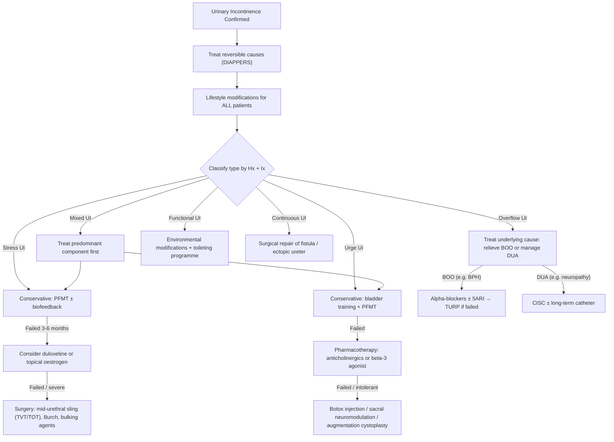

## Management of Urinary Incontinence

The overarching principle of management is simple: **treat the underlying cause, treat reversible factors first, start conservative, and escalate only when needed**. The management pathway is different for each type of incontinence, but they all share this philosophy.

***Management: treat underlying cause!*** [2]

---

### 1. General Principles

Before diving into type-specific treatments, there are universal management steps for ALL patients with UI:

#### 1.1 Address Transient / Reversible Causes First

Always screen for and treat DIAPPERS causes before committing to long-term management:
- Treat UTI (antibiotics → reassess)
- Review and modify offending medications
- Treat constipation (faecal impaction → disimpaction, then laxative regimen)
- Address delirium (treat precipitant)
- Manage polyuria (optimise DM control, reduce excessive fluid/caffeine)
- Treat atrophic vaginitis (topical oestrogen)
- Improve mobility / provide accessible toileting

#### 1.2 Lifestyle Modifications (For All Types)

***Initial management: Behavioural therapy — smoking cessation, weight reduction, reduce caffeine intake, fluid intake advice (8 glasses of water is a myth!)*** [16][17]

***Lifestyle: weight loss, reduce caffeine intake, smoking cessation*** [6]

| Modification | Mechanism / Why It Helps |
|---|---|
| ***Weight reduction*** [6][16] | Reduces chronic intra-abdominal pressure on the pelvic floor → less stress on weakened support structures; even 5-10% weight loss significantly improves SUI |
| ***Reduce caffeine intake*** [6][16] | Caffeine is both a bladder irritant (stimulates detrusor) and a mild diuretic → increases frequency and urgency |
| ***Smoking cessation*** [6][16] | (1) Chronic cough from smoking → repetitive pelvic floor stress → worsens SUI; (2) Nicotine may stimulate detrusor overactivity |
| ***Fluid intake advice*** [16] | Not too much (overwhelms bladder capacity) and not too little (concentrated urine irritates bladder mucosa). ***8 glasses of water is a myth*** [16] — advise ~1.5L/day, adjusted to activity and climate |
| ***Reduce alcohol*** [2] | Alcohol is a diuretic + sedative → polyuria + impaired awareness of bladder fullness |
| ***Manage constipation*** [2] | Chronic straining weakens pelvic floor; faecal loading compresses bladder/urethra |

***Protective pads/garments: risk of contact dermatitis or infections*** [2] — these are containment measures, not treatment. Use them as a bridge while definitive management takes effect.

***External (condom) catheters: preferred to indwelling ones*** [2] — less risk of CAUTI and urethral trauma.

#### 1.3 Role of Primary Care

***Patients usually do not volunteer incontinence symptoms due to: embarrassment, accepting it as part of normal ageing and childbirth, not aware that treatment is available, symptom not troublesome enough. Always take note of the symptom and refer if indicated*** [18].

---

### 2. Overall Management Algorithm

---

### 3. Type-Specific Management

#### 3.1 Stress Urinary Incontinence (SUI)

The management ladder: **conservative → pharmacological → surgical**. Always start conservative.

##### 3.1.1 Conservative (First-Line for All SUI)

***Stress UI: pelvic floor muscle training ± biofeedback (repeated sets, repetition of contraction and relaxation)*** [6]

| Intervention | Details | Mechanism / Why It Works |
|---|---|---|
| ***Pelvic floor muscle training (PFMT / Kegel exercises)*** [2][6] | ***3 sets of 8-12 contractions for 8-10 seconds each, performed TDS, for ≥ 15-20 weeks*** [2] | Strengthens the levator ani and periurethral muscles → improves the "hammock" support under the urethra → when abdominal pressure rises, the urethra is better compressed against a stronger support → less leakage. This also improves the guarding reflex (reflexive sphincter contraction during cough). |
| ***Biofeedback*** [2][6] | ***Placement of vaginal pressure sensor → live feedback of strength of pelvic floor contractions → associated with better outcome than PFMT alone*** [2] | Many women (up to 50%) perform Kegel exercises incorrectly — they bear down instead of squeezing. Biofeedback lets the patient and therapist see whether the correct muscles are contracting and how strong the contraction is. |
| Vaginal pessary | Ring pessary or incontinence pessary placed in vagina | Mechanically supports the urethra and bladder neck, restoring anatomical position → re-establishes the hammock effect. Useful when prolapse coexists. |
| Vaginal cones / weights | Weighted cones inserted into vagina; patient maintains in place by contracting pelvic floor | Progressive resistance training for pelvic floor muscles |

##### 3.1.2 Pharmacological (Second-Line / Adjunct)

| Drug | Mechanism | Details |
|---|---|---|
| ***Duloxetine*** [2] | ***SNRI → ↑ 5-HT/NA activity in Onuf's nucleus → ↑ urethral sphincter activity*** [2] | Onuf's nucleus (S2-S4) contains the motor neurons that innervate the external urethral sphincter. By increasing serotonin and noradrenaline at these synapses, duloxetine enhances the tonic activity of the sphincter → increased urethral closure pressure. ***Not licensed in HK*** [2]. Used in some countries as an adjunct when surgery is not desired. Side effects: nausea (most common), dizziness, dry mouth. |
| ***Vaginal oestrogen*** (topical) [2] | Restores urethral mucosal coaptation, improves submucosal vascular cushion, improves periurethral connective tissue | ***Suitable for postmenopausal women with vaginal atrophy*** [2]. Does NOT improve stress incontinence definitively on its own but improves tissue quality and is useful as an adjunct. Available as cream, pessary, or ring. Important: systemic HRT does NOT improve and may worsen UI — only topical vaginal preparations are recommended. |

##### 3.1.3 Surgical (Third-Line: Failed Conservative ≥ 3-6 Months)

***Discuss the usual indication for surgical and non-surgical management for pelvic organ prolapse and stress urinary incontinence*** [3]

| Procedure | Technique | Indication | Mechanism | Complications |
|---|---|---|---|---|
| ***Mid-urethral sling (MUS)***: ***Tension-free vaginal tape (TVT)*** [6] / ***Trans-obturator tape (TOT)*** [2] | A synthetic polypropylene mesh tape is placed under the mid-urethra via a minimally invasive vaginal approach. TVT passes retropubically; TOT passes through the obturator foramen. | First-line surgical option for female SUI | The tape acts as a new "hammock" — during cough/strain, the urethra is compressed against the tape → restores continence. It is "tension-free" because it is not pulled tight but rather acts as a passive support. | Bladder perforation (TVT > TOT), voiding difficulty (tape too tight), mesh erosion into vagina or urethra, groin pain (TOT), de novo urgency, infection. **2024 note:** Mesh complications have led to significant regulatory scrutiny; in some countries, full mesh slings are restricted — always discuss risks. |
| ***Burch colposuspension*** [2] | ***Suture lateral vaginal walls to iliopectineal (Cooper's) ligaments → bladder neck lifted*** [2] | Alternative to MUS; good for women who also need abdominal surgery (e.g. concomitant hysterectomy) | Elevates and stabilises the bladder neck → restores its intra-abdominal position so that rises in abdominal pressure are transmitted equally to both bladder and urethra | Voiding difficulty, de novo urgency (10-20%), enterocele formation, longer recovery than MUS |
| ***Transurethral bulking agent injection*** [2] | ***Bulking agents (e.g. silicone, collagen, polyacrylamide hydrogel) injected via cystoscope to mid-urethra*** [2] | Intrinsic sphincter deficiency (ISD); elderly/unfit for major surgery; failed MUS | Injected material increases the bulk of the submucosal tissue → improves mucosal coaptation → ↑ urethral closure pressure | Less invasive but less durable than MUS (may need repeated injections); migration of material; UTI; urinary retention |
| ***Artificial urinary sphincter (AUS)*** [2] | An inflatable cuff around the urethra, a pressure-regulating balloon, and a control pump (in labia or scrotum). Patient deflates cuff before voiding. | ***Most effective treatment for male SUI*** [2] (post-prostatectomy); severe female ISD refractory to other surgery | Cuff maintains constant circumferential pressure around urethra → complete occlusion; deflated voluntarily for voiding | Mechanical failure, erosion, infection (may require explantation), urethral atrophy |
| ***Fascia lata sling*** [6] | Autologous fascial strip harvested from thigh → placed under urethra as a sling | Alternative to synthetic mesh in patients who want to avoid mesh | Same hammock principle as MUS but uses patient's own tissue → no mesh erosion risk | Donor site morbidity (thigh pain, seroma), longer operative time |

<Callout title="TVT vs TOT — How to Choose?" type="idea">
**TVT (retropubic)**: Slightly higher cure rate for ISD; higher risk of bladder perforation (intraoperative cystoscopy mandatory). **TOT (transobturator)**: Easier, faster, lower risk of bladder/bowel injury; slightly higher risk of groin pain; may be less effective for severe ISD. For most women with urethral hypermobility-type SUI, either is acceptable. For ISD, TVT or bulking agents are preferred.
</Callout>

---

#### 3.2 Urge Urinary Incontinence (UUI) / Overactive Bladder (OAB)

The management ladder: **conservative → pharmacological → advanced therapies**.

##### 3.2.1 Conservative (First-Line)

***Urge UI: bladder training*** [6]

| Intervention | Details | Mechanism |
|---|---|---|
| ***Bladder training*** [2][6] | ***Timed voiding with controlling of urgency by distraction or mental relaxation techniques*** [2]. Patient starts with short voiding intervals (e.g. every 1 hour) then gradually extends by 15-30 minutes per week until reaching 3-4 hour intervals. | Re-trains the cortical inhibition of the micturition reflex. By learning to suppress urgency signals (distraction, deep breathing), the brain gradually regains its ability to inhibit the pontine micturition centre → ↓ involuntary detrusor contractions. |
| ***Pelvic floor exercises (PFMT)*** [2] | Same as for SUI (3 sets of 8-12 contractions, TDS, ≥ 15-20w) | Voluntary pelvic floor contraction sends an inhibitory signal to the detrusor via the "guarding reflex" (pudendal nerve activation reflexively inhibits parasympathetic outflow) → helps suppress urgency |
| ***Biofeedback*** [2] | As for SUI | Enhances correct PFMT technique → better urgency suppression |

##### 3.2.2 Pharmacological (Second-Line)

***Urge UI: anti-ACh (e.g. oxybutynin, solifenacin), β3-agonist (mirabegron), Botox injection*** [6]

***Medical therapy: check for C/I to anticholinergics, usually require ~4 weeks to see full benefit*** [2]

**A. Anticholinergics (Antimuscarinics)**

These are the traditional mainstay of OAB pharmacotherapy. They work by blocking muscarinic receptors (primarily M3) on the detrusor muscle → reduce involuntary contractions during filling.

| Drug | Selectivity | Key Points |
|---|---|---|
| ***Oxybutynin*** [6][2] | Non-selective (M1, M2, M3) | Oldest and cheapest. High rate of side effects due to non-selectivity (especially M1 in CNS → cognitive impairment). Extended-release (ER) and transdermal patch formulations reduce side effects. |
| Tolterodine [2] | Relatively non-selective | Better tolerated than oxybutynin IR; available as ER formulation |
| ***Solifenacin*** [6][2] | M3-selective | Better side effect profile than oxybutynin; once-daily dosing |
| Darifenacin | M3-selective | Minimal CNS penetration → least cognitive side effects (good for elderly) |
| Fesoterodine | Non-selective (active metabolite of tolterodine) | Dose flexibility |
| Trospium | Non-selective, quaternary amine | Does NOT cross blood-brain barrier → no CNS side effects; excellent for elderly |

***Side effects of anticholinergics: dry mouth, dry eye, constipation, cognitive impairment*** [6]

| Side Effect | Mechanism | Clinical Significance |
|---|---|---|
| ***Dry mouth*** | Blockade of M3 receptors on salivary glands → ↓ saliva | Most common reason for discontinuation |
| ***Dry eyes*** | Blockade of M3 on lacrimal glands → ↓ tear production | Problematic in contact lens wearers |
| ***Constipation*** | Blockade of M3 on GI smooth muscle → ↓ peristalsis | Ironic: constipation worsens pelvic floor problems! |
| ***Cognitive impairment*** | Blockade of M1 receptors in CNS → ↓ cholinergic transmission | Major concern in elderly — can worsen or mimic dementia. Avoid oxybutynin in elderly. Prefer M3-selective or trospium. |
| Urinary retention | Over-suppression of detrusor contractility | ***C/I if PVR > 150 mL due to risk of AROU*** [6] |
| Tachycardia | Blockade of M2 on heart | Usually mild |
| Blurred vision | Blockade of M3 on ciliary muscle → ↓ accommodation | |
| Acute angle-closure glaucoma | ↑ intraocular pressure if predisposed | **Absolute C/I: uncontrolled narrow-angle glaucoma** |

<Callout title="Anticholinergics in the Elderly" type="error">
The Beers Criteria and STOPP criteria both flag anticholinergics as potentially inappropriate in older adults due to cognitive side effects. In an elderly patient with OAB, prefer: (1) non-pharmacological therapy first, (2) if drugs needed, use M3-selective agents (solifenacin, darifenacin) or trospium (doesn't cross BBB), (3) AVOID oxybutynin IR. Also avoid in patients already on cholinesterase inhibitors for dementia — the two drugs work against each other.
</Callout>

**B. Beta-3 Adrenergic Agonist**

***Beta-3 agonist: mirabegron*** [6]

| Drug | Mechanism | Key Points |
|---|---|---|
| ***Mirabegron*** | Agonist at β3-adrenergic receptors on detrusor muscle → promotes detrusor relaxation during filling phase | Alternative to anticholinergics — ***no anticholinergic side effects*** (no dry mouth, no cognitive impairment). Can be combined with low-dose anticholinergics for synergistic effect. |
| Vibegron (newer) | Same mechanism as mirabegron | Less CYP2D6 interaction than mirabegron |

***Side effect of mirabegron: elevated BP ( > 10%)*** [6]

| Side Effect | Mechanism | Clinical Action |
|---|---|---|
| ***Hypertension*** | β3 agonism also present on vascular smooth muscle → ↑ BP | Monitor BP. **C/I: severe uncontrolled hypertension** (BP ≥ 180/110). Use with caution if existing HTN. |
| UTI, headache, nasopharyngitis | Unrelated to mechanism | Common but mild |
| Tachycardia (rare) | β-adrenergic stimulation | Monitor in patients with cardiac history |

**C. Topical Oestrogen**

***Vaginal oestrogen: suitable for postmenopausal women with vaginal atrophy*** [2]

Mechanism: Restores urethral and bladder trigone epithelium (both embryologically derived from the same urogenital sinus) → reduces mucosal irritation → ↓ afferent signals → ↓ urgency/frequency.

**D. Desmopressin**

***Desmopressin: suitable for persistent nocturia*** [2]

Mechanism: Synthetic analogue of ADH → promotes water reabsorption in collecting ducts → ↓ urine production at night. Must monitor serum sodium (risk of hyponatraemia, especially in elderly). C/I: heart failure, hyponatraemia, renal impairment.

##### 3.2.3 Advanced / Third-Line Therapies

***Surgical therapy: percutaneous sacral nerve stimulation, Botox injection, augmentation cystoplasty, diversion*** [2]

| Therapy | Mechanism | Indication | Key Points |
|---|---|---|---|
| ***Botulinum toxin A (Botox) injection*** [6][2] | Injected into detrusor wall via cystoscope → blocks ACh release at neuromuscular junction → ↓ detrusor contractility | Refractory OAB failing conservative + pharmacotherapy | Effective for 6-9 months → requires repeat injections. Risk of urinary retention (need to teach patient CISC before injection). Dose: 100-200 units for idiopathic OAB; 200-300 units for neurogenic DO. |
| ***Percutaneous sacral nerve stimulation (SNS / InterStim)*** [2] | Electrode placed at S3 foramen → modulates sacral nerve activity → restores balance between excitatory and inhibitory signals to detrusor | Refractory OAB; also useful for urinary retention from DUA | Two-stage procedure: test stimulation → if > 50% improvement, permanent implant. MRI compatibility is now available with newer devices. |
| Percutaneous tibial nerve stimulation (PTNS) | Needle electrode near posterior tibial nerve (at ankle) → retrograde stimulation of S2-S4 via the tibial nerve → neuromodulation of bladder | Alternative to SNS; less invasive | Weekly 30-minute sessions for 12 weeks, then monthly maintenance. Less effective than SNS but avoids surgery. |
| ***Augmentation cystoplasty*** [2] | Detubularised segment of ileum is sewn onto the opened bladder → increases bladder capacity and reduces detrusor pressure | Last resort for intractable OAB / neurogenic DO (e.g. SCI with dangerous high-pressure bladder) | Major surgery. Patient must perform lifelong CISC (the augmented bladder cannot contract effectively). Risks: metabolic acidosis (NAGMA — ileum reabsorbs NH₄Cl), mucus production, bladder stones, rare malignancy risk in the ileal segment. |
| ***Urinary diversion*** [2] | Ileal conduit or continent diversion (e.g. Mitrofanoff) | Absolute last resort | Permanent stoma (ileal conduit) or self-catheterisable channel (Mitrofanoff via appendix to umbilicus). Reserved for patients where all else has failed or bladder must be removed. |

---

#### 3.3 Overflow Incontinence

The key principle: **relieve the obstruction** (if BOO) or **ensure regular bladder emptying** (if DUA). The management is fundamentally different depending on which mechanism is at play.

##### 3.3.1 Acute Retention (AROU)

***AROU → Foley insertion + documentation of first catheterisation urine volume, send urine for C/ST*** [4]

***Immediate bladder decompression by urethral catheterisation (first-line) by 14-18 Fr Foley catheter*** [13]

| Step | Details | Why |
|---|---|---|
| 1. Catheterise | ***14 Fr Foley catheter, aseptic technique, xylocaine jelly*** [13] | Immediate relief of retention; document volume drained |
| 2. Send urine C/ST | From catheterised specimen | Rule out UTI as precipitant |
| 3. Bloods | CBC, RFT, glucose | Leukocytosis (infection), elevated creatinine (obstructive nephropathy), hyperglycaemia (DM) |
| 4. KUB | Plain X-ray [4] | Check for stones, faecal loading |
| 5. ***Do NOT check PSA*** | [13] | ***AROU causes false elevation; check 4-6 weeks later*** |

**If catheter cannot be passed:** [6][13]
- Enlarged prostate → ***use thicker catheter (20-22 Fr)*** — stiffer, easier to navigate past enlarged gland
- Urethral stricture → ***use thinner catheter (10-12 Fr)***
- If still fails → Tiemann catheter (curved tip) → cystoscopic-guided insertion → urethral dilators
- If all fail → ***suprapubic catheterisation (SPC)*** [13]

***SPC indications: failed urethral catheterisation, Hx of urethral trauma, long-term drainage expected ( > 3 weeks)*** [13]

***SPC C/I: non-distended bladder, uncorrected bleeding tendency, known/suspected urothelial CA*** [13]

##### 3.3.2 Management of Underlying BOO

**For BPH (most common cause of overflow in males):**

***Prescribe alpha-blocker (Xatral) + trial wean-off catheter (TWOC) later*** [6]

| Treatment | Details | Mechanism |
|---|---|---|
| ***Alpha-1 adrenergic blockers*** (first-line medical) [6] | ***Non-selective: prazosin, terazosin, doxazosin, alfuzosin*** [6]; ***Selective α1A: tamsulosin, silodosin*** [6] | ***Relax smooth muscles in prostate and bladder neck (NOT body)*** [6] → reduces dynamic component of obstruction. Onset: days to weeks. |
| ***5-alpha reductase inhibitors (5ARI)*** [6] | ***Finasteride, dutasteride*** [6] | ***Reduce DHT → decrease size of prostate + decrease vascularity + progression prevention*** [6]. ***Slow onset (3-6 months for max effect)***. ***Preferred for larger glands ≥ 30-40 mL (TRUS) / IPSS ≥ 12*** [6]. ***50% decrease in PSA — multiply PSA by 2 when screening for CA prostate.*** [6] |
| Combination therapy | α-blocker + 5ARI | For large prostates with bothersome symptoms; better long-term outcomes than monotherapy (MTOPS trial) |
| ***PDE5 inhibitor (tadalafil)*** [6] | Daily low-dose tadalafil | Relaxes prostatic smooth muscle via NO/cGMP pathway. ***Avoid if using nitrate*** [6]. Bonus: also treats ED. |
| ***Anticholinergics for OAB component*** [6] | For men with BPH + predominant irritative LUTS | ***C/I if PVR > 150 mL due to risk of AROU*** [6] |
| ***Beta-3 agonist (mirabegron)*** [6] | For OAB component | Safer than anticholinergics in terms of retention risk |

**Surgical management of BPH:**

***Indications for surgery: failed medical therapy, recurrent complications*** [6]

***Absolute indication: complications of BPH (refractory AROU, bladder stones, recurrent UTI, obstructive uropathy)*** [16]

***Relative indication: bothersome symptoms despite medical treatment*** [16]

| Procedure | Technique | Key Points |
|---|---|---|
| ***TURP (gold standard)*** [6][16] | ***Transurethral insertion of resectoscope → scrap pieces of prostate off using monopolar or bipolar diathermy until prostatic fibrous capsule*** [16] | Monopolar uses 1.5% glycine irrigation (risk of TUR syndrome); bipolar uses NS (safer but slower). ***3-way Foley post-op to irrigate bladder with NS to avoid clot retention.*** [6] |
| ***Holmium laser enucleation (HoLEP)*** [6] | Laser enucleation of adenoma → morcellated for removal | Useful for large prostates; saline irrigation → no TUR syndrome; lower bleeding risk |
| ***PVP (Greenlight laser)*** [6] | Photoselective vaporisation | Less bleeding, good for patients on anticoagulation; no histological specimen obtained |
| ***TUIP*** [16] | Longitudinal incision in prostate → widens bladder neck | Only for small prostates ≤ 30g; lower morbidity than TURP |
| ***Minimally invasive: UroLift, Rezūm, PAE, TUMT*** [6] | Various mechanisms to reduce prostatic tissue | Newer options; generally less durable than TURP but fewer sexual side effects |

***TURP specific complications*** [6]:
- ***Bleeding, infection***
- ***Perforation*** (can form fistula)
- ***TUR syndrome***: ***dilutional hypoNa + fluid overload + glycine toxicity; S/S: nausea (1st), confusion, cerebral oedema, visual disturbance; Mx: manage as hypoNa, hypertonic NS; Prevention: use bipolar (NS irrigant), limit volume < 1L and irrigation pressure < 60 mmHg*** [6]
- ***Retrograde ejaculation (70-80%)*** [6] — due to resection of bladder neck
- ***Urethral stricture*** [6]
- ***Incontinence (1%): urge (early) / stress (late)*** [6]

##### 3.3.3 Management of Detrusor Underactivity (DUA)

| Treatment | Details | Mechanism |
|---|---|---|
| ***Clean intermittent self-catheterisation (CISC)*** | Patient learns to catheterise 4-6 times daily, draining the bladder each time | Gold standard for neurogenic bladder / DUA. Prevents overdistension, reduces UTI risk vs indwelling catheter, preserves bladder compliance |
| ***Long-term catheterisation (Foley / SPC / CISC)*** [6] | For patients who cannot perform CISC (poor dexterity, cognitive impairment) | SPC preferred over long-term urethral Foley (less urethral trauma, easier care) |
| Bethanechol (cholinergic agonist) | Stimulates muscarinic receptors on detrusor | Rarely used — limited efficacy and significant side effects (GI cramping, bradycardia). Not recommended by current guidelines. |
| Sacral neuromodulation | Electrode at S3 | May help some cases of non-obstructive retention |

---

#### 3.4 Functional Incontinence

The management here is NOT urological — it's about removing barriers to toileting:

| Intervention | Details |
|---|---|
| **Prompted voiding** | Carer asks patient regularly (every 2 hours) if they need to use the toilet → helps demented patients who cannot initiate |
| **Timed voiding / scheduled toileting** | Fixed schedule (e.g. every 2-3 hours) regardless of urge → prevents accidents |
| **Environmental modifications** | Commode by bed, raised toilet seat, adequate lighting, clothing that is easy to remove (Velcro instead of buttons) |
| **Mobility aids** | Walking frame, wheelchair access to bathroom |
| **Carer education** | Teach carers to assist with toileting; involve medical social worker |
| **Containment** | Pads, condom catheters (men), adult diapers — not treatment but improves dignity and hygiene |

---

#### 3.5 Continuous Incontinence (Fistula / Ectopic Ureter)

| Cause | Treatment |
|---|---|
| **Vesicovaginal fistula (VVF)** | If small and diagnosed early (< 2 weeks): prolonged catheter drainage may allow spontaneous closure. If not: surgical repair (vaginal approach for small fistulae; abdominal approach for complex/high fistulae) with interposition flap (e.g. omental or Martius fat pad flap) |
| **Ectopic ureter** | Surgical re-implantation of ureter into bladder (ureteroneocystostomy) or nephroureterectomy if the associated kidney is non-functioning |

---

#### 3.6 Management of Coexisting Prolapse and Incontinence

This is a central theme of the O&G lecture [3][4]:

***Management options: Observe / Ring pessary / Surgery*** [4]

##### Non-Surgical Management

***Ring pessary*** [4]:
- ***Foreign body, change every 4 to 6 months*** [4]
- ***Try one size, if falls out → try bigger size, if falls out → try two, if falls out → surgery*** [4]
- Also provides support to urethra → may improve coexisting SUI
- Can be used to test for occult stress incontinence (if SUI appears after pessary insertion → confirms occult SUI)

***Teach pelvic floor exercise + bladder training*** [4]

***Medication for urge incontinence → symphony trial*** [4] (trial of anticholinergics if urgency symptoms present)

***Conservative management is available but rarely curative*** [1]

##### Surgical Management

***If surgery is indicated, surgery for both conditions may be needed*** [1]

| Procedure | Details | Considerations |
|---|---|---|
| ***Vaginal hysterectomy*** [4] | Removal of uterus vaginally → treats uterine prolapse | ***Remnant vault can prolapse as well*** [4] → need vault suspension |
| ***Colpocleisis*** [4] | ***Close the vagina*** [4] | ***In the future will not be able to do cervical smears or endometrial workup*** [4]. Only for elderly women certain they do not want vaginal function. |
| ***Laparoscopic sacrocolpopexy*** [4] | ***Not first line; have to have done vaginal hysterectomy before*** [4]; mesh attached from vaginal vault to sacral promontory | ***3 hours*** [4]; for younger, fitter patients with vault prolapse |
| Combined anti-incontinence procedure | TVT/TOT at same sitting as prolapse repair | Essential if occult SUI demonstrated on preoperative assessment |

---

### 4. Management of Neurogenic Bladder

This is a special and important situation — the management depends on the type of neurological lesion:

| Pattern | Examples | Bladder Type | Goal | Management |
|---|---|---|---|---|
| **Suprapontine** (detrusor overactivity, coordinated sphincter) | Stroke, PD, NPH, dementia | Reflex bladder with urgency | Reduce overactivity, prevent incontinence | Bladder training, anticholinergics/mirabegron, prompted voiding (if cognitive impairment) |
| **Suprasacral SCI** (DSD) | SCI above S2, MS | High-pressure bladder with DSD | ***Protect upper tract*** (prevent reflux nephropathy) | ***CISC*** (gold standard) + anticholinergics (to reduce detrusor overactivity) ± Botox to detrusor ± sphincterotomy if DSD refractory. Avoid indwelling catheter if possible. |
| **Sacral / infrasacral** (areflexic bladder) | Cauda equina, conus, DM neuropathy | Acontractile bladder | Ensure regular emptying, prevent overdistension | ***CISC*** (4-6 times/day), long-term catheter if CISC not possible |

***Genitourinary complications management in neurological patients: indwelling catheter or condom catheter (if incontinent male) → avoid bladder overdistension and genitourinary infection → intermittent catheterisation → measure post-void residual volume*** [8]

<Callout title="DSD — Why Is It Dangerous?">
In DSD, the detrusor contracts against a closed sphincter → very high intravesical pressures → vesicoureteral reflux → hydronephrosis → renal failure. The management priority is to **protect the upper tract**, not just achieve social continence. CISC + anticholinergics convert the high-pressure reflex bladder into a low-pressure storage system that is emptied regularly [8].
</Callout>

---

### 5. Summary of Contraindications to Key Treatments

| Treatment | Contraindications | Why |
|---|---|---|
| **Anticholinergics** | Uncontrolled narrow-angle glaucoma, significant BOO/PVR > 150 mL, severe constipation, cognitive impairment/dementia (relative), myasthenia gravis | Glaucoma: ↑ IOP; BOO: risk of AROU; Constipation: worsens; Cognition: anti-M1 effects |
| **Mirabegron** | Severe uncontrolled HTN (BP ≥ 180/110) | β3-mediated vasorelaxation can paradoxically raise BP |
| **Duloxetine** | Uncontrolled HTN, hepatic impairment, concomitant MAOIs | Serotonergic syndrome risk; hepatotoxicity |
| **Desmopressin** | Heart failure, hyponatraemia (Na < 130), renal impairment (eGFR < 50), age > 65 (relative — need close Na monitoring) | Water retention → fluid overload, dilutional hyponatraemia |
| **TVT/TOT (mesh sling)** | Active urinary/vaginal infection, concurrent pregnancy, uncorrected coagulopathy | Infection risk; mesh complications |
| **Botox (intravesical)** | UTI at time of injection, unable/unwilling to perform CISC | Risk of retention; active infection → systemic spread |
| **SPC** | Non-distended bladder, uncorrected bleeding tendency, known/suspected urothelial CA [13] | Risk of bowel injury if bladder not distended; seeding of tumour along tract |
| **Urethral catheterisation** | Urethral injury (blood at meatus, high-riding prostate), recent urological surgery [13] | Risk of creating false passage |

---

<Callout title="High Yield Summary">

**Universal first steps:** Treat reversible causes (DIAPPERS). Lifestyle: weight loss, reduce caffeine, smoking cessation, fluid advice, manage constipation.

**Stress UI ladder:** (1) PFMT ± biofeedback for ≥ 15-20 weeks → (2) Duloxetine or topical oestrogen (adjunct) → (3) Surgery: mid-urethral sling (TVT/TOT) is first-line surgical; alternatives: Burch colposuspension, bulking agents, artificial sphincter (best for males).

**Urge UI ladder:** (1) Bladder training + PFMT → (2) Anticholinergics (oxybutynin, solifenacin) or beta-3 agonist (mirabegron) → (3) Botox injection / sacral neuromodulation / augmentation cystoplasty.

**Anticholinergic side effects:** Dry mouth, dry eyes, constipation, cognitive impairment, urinary retention. C/I if PVR > 150 mL, narrow-angle glaucoma, dementia. Mirabegron side effect: elevated BP.

**Overflow UI:** BOO → alpha-blockers ± 5ARI → TURP if failed. DUA → CISC is gold standard.

**Prolapse + UI:** Ring pessary + PFMT first → if fails, surgery for both conditions may be needed. Always test for occult SUI before prolapse surgery.

**Neurogenic bladder:** Protect upper tract in DSD (CISC + anticholinergics). Areflexic bladder → CISC.

**TURP complications:** TUR syndrome (hypoNa + glycine toxicity), retrograde ejaculation (70-80%), urethral stricture, incontinence (1%).

</Callout>

---

<ActiveRecallQuiz
  title="Active Recall - Management of Urinary Incontinence"
  items={[
    {
      question: "Describe the stepwise management of stress urinary incontinence in a multiparous postmenopausal woman, from first-line to surgical options.",
      markscheme: "Step 1: Lifestyle modifications (weight loss, reduce caffeine, stop smoking, manage constipation) + PFMT with biofeedback (3 sets of 8-12 contractions held 8-10s, TDS, for at least 15-20 weeks). Step 2: Adjuncts — topical vaginal oestrogen (if atrophic), duloxetine (SNRI, increases sphincter tone via Onuf's nucleus — not licensed in HK). Step 3: Surgery if failed conservative management — first-line surgical: mid-urethral sling (TVT retropubic or TOT transobturator). Alternatives: Burch colposuspension, periurethral bulking agents (for ISD or unfit patients), autologous fascia lata sling.",
    },
    {
      question: "Name three anticholinergic drugs used for OAB, state their common class side effects, and explain why oxybutynin should be avoided in elderly patients.",
      markscheme: "Drugs: oxybutynin, tolterodine, solifenacin (also accept darifenacin, trospium, fesoterodine). Class side effects: dry mouth, dry eyes, constipation, cognitive impairment, urinary retention, blurred vision, tachycardia. Oxybutynin should be avoided in elderly because it is non-selective (blocks M1 in CNS), crosses the blood-brain barrier readily, and causes significant cognitive impairment — can worsen or mimic dementia. Prefer M3-selective agents (solifenacin, darifenacin) or trospium (quaternary amine, does not cross BBB).",
    },
    {
      question: "A patient with suprasacral spinal cord injury develops a high-pressure neurogenic bladder with DSD. What is the management priority and what is the gold-standard treatment?",
      markscheme: "Management priority: protect the upper urinary tract (prevent vesicoureteral reflux, hydronephrosis, and renal failure from high intravesical pressures). Gold standard: clean intermittent self-catheterisation (CISC) combined with anticholinergics to convert the high-pressure reflex bladder into a low-pressure storage system that is emptied regularly. If refractory: Botox injection into detrusor, external sphincterotomy, sacral neuromodulation. Avoid indwelling catheter if possible.",
    },
    {
      question: "What are the specific complications of TURP? How do you prevent TUR syndrome?",
      markscheme: "Complications: bleeding, infection, perforation (fistula), TUR syndrome (dilutional hyponatraemia + fluid overload + glycine toxicity — S/S: nausea first, then confusion, cerebral oedema, visual disturbance), retrograde ejaculation (70-80%), urethral stricture, incontinence (1% — urge early, stress late). Prevention of TUR syndrome: use bipolar TURP (NS irrigant instead of glycine), limit irrigation volume to less than 1L, keep irrigation pressure less than 60 mmHg, limit operating time.",
    },
    {
      question: "In the theme case, Mrs. Wong's ring pessary fell out. Outline the escalation pathway for management of prolapse with coexisting SUI when conservative measures fail.",
      markscheme: "Try one size pessary → if falls out, try bigger size → if falls out, try two → if fails, proceed to surgery. Before surgery: arrange cystometry to confirm type of incontinence. Surgical options for prolapse: vaginal hysterectomy (but vault can prolapse later), need vault suspension. For elderly not wanting vaginal function: colpocleisis (closes vagina — cannot do cervical smears or endometrial workup afterwards). For young and fit with vault prolapse: laparoscopic sacrocolpopexy. Must combine with anti-incontinence procedure (e.g. TVT/TOT) if SUI confirmed or occult SUI demonstrated.",
    },
    {
      question: "State the mechanism of action, main advantage, and key side effect of mirabegron compared to anticholinergics for OAB.",
      markscheme: "Mechanism: beta-3 adrenergic receptor agonist on detrusor smooth muscle → promotes detrusor relaxation during filling phase. Main advantage: no anticholinergic side effects (no dry mouth, no cognitive impairment) — therefore better tolerated especially in elderly and those with contraindications to anticholinergics. Key side effect: elevated blood pressure (more than 10%). Contraindicated in severe uncontrolled hypertension (BP 180/110 or above).",
    },
  ]}
/>

---

## References

[1] Lecture slides: GC 116. I felt a lump below urinary incontinence in females; genital prolapse.pdf (p73, p74)
[2] Senior notes: Ryan Ho Urogenital.pdf (p159, p161)
[3] Lecture slides: Block C - O&G Theme Case 4.pdf (p1)
[4] Lecture slides: Block C - O&G Theme Case 4.pdf (p4, p5, p6)
[6] Senior notes: Maksim Surgery Notes.pdf (p309, p317, p318)
[7] Senior notes: Ryan Ho Fundamentals.pdf (p354, p355)
[8] Senior notes: Ryan Ho Neurology.pdf (p53, p82)
[13] Senior notes: Ryan Ho Fundamentals.pdf (p352); Ryan Ho Urogenital.pdf (p167)
[16] Senior notes: Maksim Surgery Notes.pdf (p316, p317); Ryan Ho Urogenital.pdf (p176)
[17] Lecture slides: Block C - I felt a lump below_ urinary incontinence in females; genital prolapse.pdf (p52)
[18] Lecture slides: GC 116. I felt a lump below urinary incontinence in females; genital prolapse.pdf (p73)
