## Differential Diagnosis of Uterine Fibroid

The differential diagnosis of uterine fibroid is best approached from two angles:

1. **The patient presents with a pelvic mass** — what else could it be?
2. **The patient presents with abnormal uterine bleeding (AUB)** — what else could cause it?

These are two distinct clinical presentations, and the DDx list differs for each. We will cover both systematically.

---

### Approach to the Differential Diagnosis

***Uterine fibroid, ovarian mass and cancer are important differential diagnoses of pelvic mass*** [1][2]. The key principle is to **classify by organ of origin** and then use history, examination, and imaging to narrow down.

```mermaid
graph TD
    A["Pelvic Mass DDx"] --> B["Gynaecological"]
    A --> C["Gastrointestinal"]
    A --> D["Urological"]
    A --> E["Retroperitoneal"]
    A --> F["Others"]

    B --> B1["Uterine origin"]
    B --> B2["Ovarian / Adnexal origin"]
    B --> B3["Pregnancy-related"]

    B1 --> B1a["Fibroid / Leiomyoma"]
    B1 --> B1b["Adenomyosis"]
    B1 --> B1c["Uterine sarcoma / Leiomyosarcoma"]
    B1 --> B1d["Endometrial cancer"]

    B2 --> B2a["Ovarian cyst - functional, dermoid, endometrioma"]
    B2 --> B2b["Paraovarian cyst"]
    B2 --> B2c["Hydrosalpinx"]
    B2 --> B2d["Ovarian cancer"]

    B3 --> B3a["Undiagnosed intrauterine pregnancy"]
    B3 --> B3b["Molar pregnancy"]
    B3 --> B3c["Ectopic pregnancy"]

    C --> C1["Mesenteric cyst"]
    C --> C2["Colorectal tumour"]
    C --> C3["Diverticular abscess"]
    C --> C4["Hernia"]
    C --> C5["Dilated bowel / faecal loading"]

    D --> D1["Distended bladder"]
    D --> D2["Bladder diverticulum"]
    D --> D3["Pelvic kidney / Transplanted kidney"]

    E --> E1["Retroperitoneal sarcoma"]

    F --> F1["Pseudocyst"]
    F --> F2["Pelvic abscess"]
```

---

### A. Differential Diagnosis of a Pelvic Mass

***Classify according to gynaecological, and non-gynaecological. Non-gynaecological: separate into gastrointestinal, urological, retroperitoneal*** [2].

#### I. Gynaecological Causes

##### 1. Uterine Origin

| Condition | Key Differentiating Features from Fibroid | Why it mimics fibroid |
|---|---|---|
| ***Adenomyosis*** | ***Uniformly enlarged, globular, boggy, tender*** uterus (vs. fibroid: irregular, firm, non-tender). ***Less mobile on PE*** since inflammation may cause adhesions dragging it down to the Pouch of Douglas [9]. Dysmenorrhoea is typically more prominent and progressive. MRI shows diffuse junctional zone thickening ( > 12 mm) rather than a discrete mass | Both cause HMB, dysmenorrhoea, and an enlarged uterus. They frequently **coexist** (up to 20–35% of cases) |
| ***Uterine sarcoma / Leiomyosarcoma*** | ***Rapid growth especially postmenopausally***. Often heterogeneous on imaging with areas of necrosis and haemorrhage. Irregular margins. LDH may be elevated. Definitive diagnosis is histological | ***A necrotic fibroid and a leiomyosarcoma can look identical on imaging*** — both show heterogeneous signal on MRI. Key red flag is rapid enlargement without oestrogen exposure [2] |
| ***Endometrial cancer*** | Typically presents with **postmenopausal bleeding** (PMB) or irregular/heavy bleeding in premenopausal women. USS shows thickened endometrium ( > 4 mm in PMB). Diagnosed by endometrial biopsy (pipelle or hysteroscopy). Risk factors: ***unopposed oestrogen, obesity, Lynch syndrome*** [5] | Both can cause AUB. A large endometrial mass can mimic a submucosal fibroid |

<Callout title="Adenomyosis vs Fibroid on Examination" type="idea">
***Adenomyosis: less mobile on PE since the inflammation may cause adhesions dragging it down to the Pouch of Douglas. Fibroid: mobile, irregular, firm mass*** [9]. This is a classic clinical exam question. On bimanual, the adenomyotic uterus feels **diffusely enlarged and tender** whereas the fibroid uterus is **irregularly enlarged with discrete nodules and non-tender**.
</Callout>

##### 2. Ovarian / Adnexal Origin

| Condition | Key Differentiating Features | Why it mimics fibroid |
|---|---|---|
| ***Ovarian cyst (functional, dermoid, endometrioma)*** | ***Mobile cystic mass arising from the pelvis***. On bimanual: ***ovarian-origin mass is more apparent when palpating the sides*** (lateral to uterus), and there is a palpable groove between mass and uterus. USS: ***unilocular, smooth-walled, mainly fluid component, no free fluid*** for benign cysts [9] | A large ovarian cyst can fill the pelvis and be difficult to distinguish from a fibroid clinically. A pedunculated subserosal fibroid (FIGO Type 7) can mimic an adnexal mass |
| ***Ovarian cancer*** | ***Fixed and hard mass***, constitutional symptoms (weight loss, fatigue), ***ascites, nodular deposits in Pouch of Douglas*** on PR exam. USS: ***heterogeneous with solid component, irregular wall, papillary projections, increased vascularity, multilocular, free abdominal fluid*** [9]. Elevated CA-125 | A solid ovarian mass can mimic a pedunculated fibroid. However, ovarian cancer typically has constitutional symptoms, ascites, and peritoneal disease |
| ***Paraovarian cyst*** | Arises from mesosalpinx (embryological remnant). Typically unilocular, smooth, separate from ovary on USS | Large paraovarian cysts can be mistaken for ovarian or uterine masses |
| ***Hydrosalpinx*** | Fluid-filled fallopian tube (often from PID sequelae). Tubular shape on USS with "cogwheel" sign on cross-section | Usually identifiable on USS; can be confused with cystic adnexal mass |

> **How to differentiate uterine mass from ovarian mass on bimanual examination**: ***Uterine origin → central and more apparent; entire mass moves up with cervical palpation (transmitted mobility). Ovarian origin → more apparent when palpating the sides (lateral), and there is a plane of separation between it and the uterus*** [9].

##### 3. Pregnancy-Related

| Condition | Key Features |
|---|---|
| ***Undiagnosed intrauterine pregnancy*** | ***Don't forget about pregnancy — especially for teenage girls*** [2]. A gravid uterus is soft, symmetrically enlarged, and the patient has amenorrhoea. Always do a **urine pregnancy test (UPT)** in any woman of reproductive age presenting with a pelvic mass or AUB. LMP history is critical |
| ***Molar pregnancy*** (hydatidiform mole) | Markedly elevated β-hCG, "snowstorm" appearance on USS, uterus large for dates, hyperemesis, possibly pre-eclampsia in first trimester |
| ***Ectopic pregnancy*** | Positive pregnancy test, adnexal mass/tenderness, PV bleeding, acute pain. Not a pelvic "mass" per se but must be excluded in acute presentations |

<Callout title="Never Forget Pregnancy" type="error">
***Always exclude pregnancy first*** in any reproductive-age woman with a pelvic mass or abnormal bleeding. A simple urine pregnancy test takes 5 minutes and can be life-saving (e.g., ruptured ectopic). This is consistently emphasised in both lecture slides and clinical practice [2][9].
</Callout>

#### II. Non-Gynaecological Causes

##### 1. ***Gastrointestinal*** [1][2]

- ***Mesenteric cyst*** — rare, thin-walled cystic mass within the mesentery; typically mobile perpendicular to mesenteric axis
- ***Colorectal tumour*** — especially a sigmoid/rectal tumour; may present with altered bowel habit, PR bleeding, weight loss. CEA may be elevated
- ***Diverticular abscess / mass*** — history of diverticulitis, LIF pain, fever, leukocytosis. CT shows pericolic abscess
- ***Hernia*** — inguinal or femoral hernia extending into pelvis; reducible on examination, cough impulse positive
- ***Dilated bowel / faecal loading*** — constipated patients can have palpable faecal masses; AXR shows loaded colon. Distinguish by the "indentable" nature on palpation

##### 2. ***Urological*** [1][2]

- ***Distended bladder*** — midline, smooth, dull to percussion, tender. Disappears after catheterisation. Always catheterise before assuming a mass is uterine!
- ***Bladder diverticulum*** — can form a palpable mass; cystoscopy diagnostic
- ***Pelvic kidney / transplanted kidney*** — important to remember in patients with unusual anatomy or post-renal transplant. USS/CT clarifies

##### 3. ***Retroperitoneal*** [1][2]

- ***Retroperitoneal sarcoma*** — ***usually not palpable*** [1] as these are deep; when large enough to be palpable, they are typically fixed and hard. CT/MRI diagnostic

##### 4. ***Others*** [1][2]

- ***Pseudocyst*** — ***related to previous surgeries*** [2]; lymphocele, seroma, or peritoneal inclusion cyst
- ***Pelvic abscess*** — post-surgical, post-PID, or post-appendicitis. Tender, fluctuant, patient is febrile. CT shows rim-enhancing collection

---

### B. Differential Diagnosis of Abnormal Uterine Bleeding (AUB)

When the presenting complaint is **heavy menstrual bleeding** rather than a pelvic mass, the DDx broadens. The ***PALM-COEIN*** classification (FIGO system) is the standard framework for AUB [5]:

| Category | Structural (PALM) | Non-structural (COEIN) |
|---|---|---|
| **P** | ***Polyp*** (endometrial) | **C** — ***Coagulopathy*** (e.g., von Willebrand disease, platelet disorders) |
| **A** | ***Adenomyosis*** | **O** — ***Ovulatory dysfunction*** (e.g., PCOS, hypothyroidism, hyperprolactinaemia) |
| **L** | ***Leiomyoma (Fibroid)*** | **E** — ***Endometrial*** (primary endometrial disorder, e.g., chronic endometritis, AVM) |
| **M** | ***Malignancy and hyperplasia*** (endometrial cancer, sarcoma, cervical cancer) | **I** — ***Iatrogenic*** (e.g., anticoagulants, IUD, hormonal) |
| | | **N** — ***Not yet classified*** |

Key differentiators for the common structural DDx of AUB:

| Feature | Fibroid | Adenomyosis | Endometrial Polyp | Endometrial Cancer |
|---|---|---|---|---|
| Typical age | 30–50 | 35–50 | Any; more common peri/postmenopausal | Postmenopausal (mostly) |
| Bleeding pattern | ***Regular, heavy periods*** | Heavy, painful periods | IMB, postmenstrual spotting, PMB | ***PMB, irregular bleeding*** |
| Dysmenorrhoea | Variable | ***Prominent, progressive*** | Uncommon | Uncommon |
| Uterine size | Enlarged, irregular | Enlarged, ***globular, boggy*** | Usually normal | Usually normal (or enlarged if advanced) |
| USS finding | ***Well-defined hypoechoic mass, pseudocapsule, vascular on Doppler*** [4] | Heterogeneous myometrium, poor JZ definition, myometrial cysts | Echogenic focal lesion within endometrium | Thickened endometrium, irregular |
| Diagnostic test | USS / MRI | MRI (gold standard) | Hysteroscopy + polypectomy | ***Endometrial biopsy (pipelle) or hysteroscopy*** |

---

### C. Causes of Acute Pain in a Patient with Known Fibroid

***If a patient with a known fibroid presents with sudden onset of severe abdominal pain***, the DDx includes [9]:

1. ***Degeneration of fibroid*** — outgrowing blood supply and becoming necrotic
   - ***Red/haemorrhagic degeneration*** (especially during pregnancy)
   - Other types of degeneration (hyaline, cystic)
2. ***Torsion/twisting of a pedunculated fibroid*** on its stalk — ischaemic pain, peritonism
3. **Non-gynaecological causes must also be excluded**:
   - Acute appendicitis
   - Renal colic (ureteric stone)
   - Bowel obstruction
   - Ruptured ovarian cyst / ovarian torsion (if concurrent adnexal pathology)

<Callout title="Two DDx for a Necrotic-Looking Fibroid">
***A very brown, necrotic fibroid has 2 DDx: (1) malignant — leiomyosarcoma; (2) benign — growth of fibroid faster than growth of blood supply (degeneration)*** [2]. Always consider sarcoma if the clinical picture is atypical (postmenopausal, rapid growth, systemic symptoms).
</Callout>

---

### D. Clinical Approach to Differentiating Fibroid from Key Mimics

***History and physical examination usually help to suggest a diagnosis*** [1][2].

| Feature | Uterine Fibroid | Ovarian Cyst | Ovarian Cancer | Pregnancy |
|---|---|---|---|---|
| **Menstrual history** | ***Menorrhagia, regular cycles*** | Usually normal cycles | May have irregular bleeding | ***Amenorrhoea*** |
| **Pressure symptoms** | Frequency, constipation | Usually not unless large | Bloating, early satiety | Urinary frequency |
| **Constitutional symptoms** | Absent (unless anaemia) | Absent | ***Weight loss, fatigue, anorexia*** | Nausea/vomiting (1st trimester) |
| **Abdominal examination** | ***Mobile, irregular, firm mass*** | ***Mobile, cystic mass*** | ***Fixed, hard, ascites*** | Soft, symmetrical |
| **Bimanual exam** | ***Central, moves with cervix*** | ***Lateral, separate from uterus*** | Fixed to pelvis | Soft enlarged uterus |
| **USS appearance** | Solid, hypoechoic, ***pseudocapsule, vascular on Doppler*** | ***Unilocular, anechoic, smooth*** | ***Solid/mixed, papillary projections, multilocular, vascularity, free fluid*** | Gestational sac, fetal pole |
| **Key investigation** | USS / MRI | USS ± tumour markers | CA-125, CT staging, surgical biopsy | UPT, β-hCG, USS |

---

### E. Key Differentiating Points — Fibroid vs. Ovarian Pathology on Examination

This is a **favourite exam question** (both written and OSCE):

| Feature | Uterine Mass (Fibroid) | Ovarian Mass |
|---|---|---|
| Position | ***Central / midline*** | ***Lateral*** |
| Relationship to uterus | ***Continuous with uterus; no plane of separation*** | ***Separate from uterus; palpable groove between mass and uterus*** |
| Cervical excitation | ***Entire mass moves when cervix is moved*** (transmitted mobility) | Mass does **not** move with cervical excitation |
| Consistency | ***Firm, irregular*** | Variable (cystic if benign cyst, solid/hard if malignancy) |
| Mobility | ***Mobile side to side*** | ***Mobile in all directions*** (if not fixed by adhesions or malignancy) |

---

### F. Rare Mimics and Pitfalls

- ***Broad ligament fibroid*** — can be lateral and mimic an adnexal mass. MRI helps by showing myometrial tissue continuous with the mass
- ***Pedunculated subserosal fibroid (FIGO Type 7)*** — hangs off the uterus on a stalk; can be indistinguishable from a solid ovarian tumour on initial imaging. Doppler may show a feeding vessel from the uterine artery (the "bridging vessel sign")
- ***Endometriosis with ovarian endometrioma*** — can cause a pelvic mass and dysmenorrhoea/AUB. ***Endometriosis also causes nodular deposits in the Pouch of Douglas*** [9], potentially mimicking ovarian cancer
- ***Distended bladder*** — an embarrassingly common cause of a "pelvic mass." Always ask about last void and catheterise if in doubt

<Callout title="High Yield Summary — DDx of Uterine Fibroid">

**When presenting as a pelvic mass**, the key DDx categories are:
- **Gynaecological**: adenomyosis, ovarian cyst, ovarian cancer, undiagnosed pregnancy, molar pregnancy, uterine sarcoma, endometrial cancer
- **GI**: colorectal tumour, diverticular abscess, mesenteric cyst, faecal loading
- **Urological**: distended bladder, pelvic kidney
- **Retroperitoneal**: sarcoma (usually not palpable)
- **Others**: pseudocyst (post-surgical), pelvic abscess

**When presenting as AUB**, use ***PALM-COEIN***: Polyp, Adenomyosis, Leiomyoma, Malignancy — Coagulopathy, Ovulatory dysfunction, Endometrial, Iatrogenic, Not classified.

**Clinical differentiation keys**:
- Fibroid: firm, irregular, central, moves with cervix, non-tender
- Adenomyosis: globular, boggy, tender, less mobile
- Ovarian cyst: lateral, cystic, separate from uterus, does not move with cervix
- Ovarian cancer: fixed, hard, ascites, constitutional symptoms
- Always exclude pregnancy (UPT) in reproductive-age women

</Callout>

---

<ActiveRecallQuiz
  title="Active Recall - Differential Diagnosis of Uterine Fibroid"
  items={[
    {
      question: "List the differential diagnoses for a pelvic mass, classified by organ system.",
      markscheme: "Gynaecological: fibroid, adenomyosis, uterine sarcoma, endometrial cancer, ovarian cyst, ovarian cancer, paraovarian cyst, hydrosalpinx, undiagnosed pregnancy, molar pregnancy, ectopic pregnancy. GI: mesenteric cyst, colorectal tumour, diverticular abscess, hernia, dilated bowel. Urological: distended bladder, bladder diverticulum, pelvic kidney, transplanted kidney. Retroperitoneal: sarcoma. Others: pseudocyst, pelvic abscess.",
    },
    {
      question: "On bimanual examination, how do you differentiate a uterine fibroid from an ovarian mass? Give at least 3 distinguishing features.",
      markscheme: "1) Uterine mass is central/midline vs ovarian mass is lateral. 2) Uterine mass is continuous with uterus with no palpable groove vs ovarian mass has a palpable groove between it and uterus. 3) Uterine mass moves when cervix is moved (transmitted mobility) vs ovarian mass does not move with cervical excitation. 4) Fibroid is firm and irregular vs ovarian cyst is cystic. 5) Fibroid mobile side-to-side vs ovarian mass mobile in all directions.",
    },
    {
      question: "How do you clinically differentiate adenomyosis from fibroid?",
      markscheme: "Adenomyosis: uniformly enlarged, globular, boggy, tender uterus; less mobile on PE due to adhesions to Pouch of Douglas; prominent progressive dysmenorrhoea. Fibroid: irregularly enlarged, firm, non-tender uterus with discrete nodules; more mobile. On USS: adenomyosis shows heterogeneous myometrium with poor junctional zone definition; fibroid shows well-circumscribed hypoechoic mass with pseudocapsule. MRI is gold standard to differentiate.",
    },
    {
      question: "What are the PALM-COEIN categories for abnormal uterine bleeding?",
      markscheme: "PALM (structural): Polyp, Adenomyosis, Leiomyoma, Malignancy/hyperplasia. COEIN (non-structural): Coagulopathy, Ovulatory dysfunction, Endometrial, Iatrogenic, Not yet classified.",
    },
    {
      question: "A patient with a known fibroid presents with sudden severe abdominal pain. Give at least 4 differential diagnoses.",
      markscheme: "1) Red/haemorrhagic degeneration of fibroid (especially in pregnancy). 2) Torsion of pedunculated fibroid. 3) Acute appendicitis. 4) Ovarian cyst torsion or rupture. 5) Renal colic. 6) Bowel obstruction. Also accept: leiomyosarcoma (if necrotic-looking fibroid).",
    },
    {
      question: "What clinical features on USS differentiate a benign ovarian cyst from ovarian cancer?",
      markscheme: "Benign cyst: unilocular, smooth-walled, anechoic, no solid component, no free fluid, no increased vascularity. Ovarian cancer: heterogeneous with solid component, irregular wall, papillary projections, multilocular, increased vascularity on Doppler, free abdominal fluid (ascites).",
    },
  ]}
/>

## References

[1] Lecture slides: GC 118. Pelvic mass ovarian cancer and cysts; uterine fibroid; pelvic imaging.pdf
[2] Lecture slides: Block C - Pelvic mass\_ ovarian cancer and cysts; uterine fibroid; pelvic imaging.pdf
[4] Senior notes: Ryan Ho Radiology.pdf (p33 — Uterine mass, leiomyoma on USS)
[5] Lecture slides: GC 112. Abnormal vaginal bleeding Gynaecological cancer.pdf
[9] Lecture slides: Block C - O&G Theme Case 3.pdf (p3–5 — DDx of pelvic mass, clinical differentiation of fibroid vs adenomyosis vs ovarian pathology)
