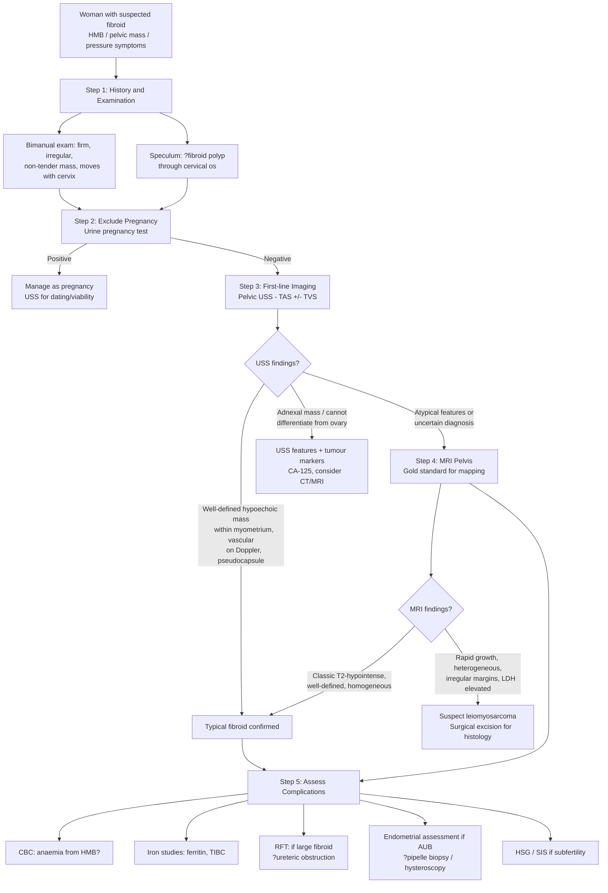

## Diagnosis of Uterine Fibroid

### Diagnostic Criteria

Unlike many medical conditions, there are **no formal consensus "diagnostic criteria"** for uterine fibroids in the way that exist for, say, rheumatoid arthritis or SLE. The diagnosis of uterine fibroid is primarily a **clinico-radiological diagnosis** — made by correlating clinical features with imaging findings.

***In the past, investigation for fibroid was based solely on clinical (examination). But now, patient expectation is higher so you have to use USG*** [2].

The diagnosis rests on:

1. **Clinical suspicion** — based on symptoms (HMB, pressure symptoms) and examination findings (firm, irregular, non-tender pelvic mass that moves with the cervix)
2. **Imaging confirmation** — ***pelvic ultrasound is commonly performed*** and is the **first-line imaging modality** [1][2]
3. **Exclusion of differentials** — particularly pregnancy, ovarian pathology, adenomyosis, and malignancy (endometrial cancer, leiomyosarcoma)
4. **Histological confirmation** — only obtained when the fibroid is surgically removed (myomectomy/hysterectomy specimen); pre-operative tissue diagnosis is **not** routinely performed because biopsy of a myometrial mass is impractical and carries risks

<Callout title="No Biopsy Needed for Most Fibroids" type="idea">
Unlike many tumours where tissue diagnosis is mandatory before treatment, fibroids are **diagnosed by imaging** and confirmed only after surgical excision. The reason: (1) USS/MRI have high sensitivity and specificity for typical fibroids; (2) a needle biopsy of a myometrial mass is technically difficult, may not be representative, and carries bleeding risk; (3) the distinction between fibroid and leiomyosarcoma **cannot be reliably made by needle biopsy** — the entire specimen is needed for assessment of mitotic rate, necrosis pattern, and atypia.
</Callout>

---

### Diagnostic Algorithm

The diagnostic approach follows a logical sequence: **Clinical assessment → Exclude pregnancy → First-line imaging → Further imaging if needed → Exclude co-pathology → Additional investigations for complications**.

---

### Investigation Modalities — Detailed

#### Step 1: Clinical Assessment

##### History
- **Menstrual history**: cycle length, duration, volume (number of pads/tampons, flooding, clots), regularity — fibroids typically cause ***regular, heavy periods*** [9]
- **Pressure symptoms**: urinary frequency, urgency, retention, constipation, tenesmus
- **Pain**: dysmenorrhoea (also think adenomyosis), acute pain (degeneration, torsion)
- **Reproductive history**: subfertility, recurrent miscarriage
- **Red flags for malignancy**: postmenopausal bleeding, constitutional symptoms (weight loss, anorexia), rapid enlargement
- ***Don't forget about pregnancy — especially for teenage girls*** [2]

##### Examination
Key examination findings were covered in the Clinical Features section. To summarise the diagnostic value:

| Finding | Significance |
|---|---|
| ***Pallor*** | ***Due to menorrhagia caused by fibroid*** → iron deficiency anaemia [1][2] |
| ***Usually non-tender*** | ***Except for red degeneration*** (bleeding within the fibroid, can occur during pregnancy) [1][2] |
| ***Asymmetric/irregular*** enlargement | Typical of fibroid; ***if the uterus is globally enlarged symmetrically, may suggest adenomyosis instead*** [2] |
| ***Firm mass arising from pelvis, rubbery consistency*** | Classic fibroid feel [1] |
| ***Mass moved with the cervix*** | Confirms uterine origin; ***if you feel this upon digital examination, could be a cervical fibroid*** [1][2] |
| ***Special locations*** | ***Pedunculated/subserosal fibroids, fibroid polyps*** — ***hard to determine based on physical examination alone*** → imaging needed [2] |

<Callout title="Bimanual Palpation — Uterine vs Ovarian Origin">
***Uterine origin → central and more apparent; entire mass moves up with palpation. Ovarian origin → more apparent when palpating the sides*** [9]. This distinction on bimanual exam is a fundamental clinical skill and frequent OSCE station.
</Callout>

#### Step 2: Exclude Pregnancy

- **Urine pregnancy test (UPT)** — mandatory in **every** woman of reproductive age with a pelvic mass, AUB, or pelvic pain before any further investigation or treatment
- Why? Because a gravid uterus can feel like a fibroid (soft, enlarged), and treating a pregnant uterus as a fibroid (e.g., attempting myomectomy) would be catastrophic
- Serum **β-hCG** — if ectopic pregnancy is suspected or UPT is equivocal

#### Step 3: First-Line Imaging — ***Pelvic Ultrasound (USS)***

***Pelvic ultrasound is commonly performed*** [1][2] and is the **first-line** investigation for suspected uterine fibroid. It is widely available, non-invasive, inexpensive, and radiation-free.

Two approaches are used, often combined:

| Modality | Technique | Advantages | Limitations |
|---|---|---|---|
| **Transabdominal USS (TAS)** | Probe placed on abdomen; requires a **full bladder** as acoustic window | Better for **large masses** that extend out of the pelvis; gives overview of pelvic/abdominal anatomy | Lower resolution; limited by body habitus (obesity) |
| **Transvaginal USS (TVS)** | Probe inserted into vagina; higher frequency, closer to target | **Higher resolution** for uterine detail; better for **submucosal** fibroids and endometrial assessment | Limited field of view; cannot visualise very large masses that extend above the pelvis |

**Typical USS Findings of a Fibroid** [4][9]:

| Feature | Description | Explanation |
|---|---|---|
| ***Well-defined, round/oval hypoechoic mass*** | Appears darker than surrounding myometrium with clear margins | Dense smooth muscle and collagen reflect sound differently from normal myometrium |
| ***Pseudocapsule*** | Thin echogenic rim surrounding the fibroid | Compressed normal myometrium and connective tissue forms a false capsule around the fibroid — important surgical landmark for myomectomy [9] |
| ***Posterior acoustic shadowing*** | Dark shadow behind the fibroid | Dense fibrous tissue attenuates the ultrasound beam, preventing passage to deeper structures — a hallmark of solid, collagenous lesions |
| ***Whorled internal echo pattern*** | Heterogeneous internal echoes in a swirled pattern | Corresponds to the interlacing bundles of smooth muscle and fibrous tissue |
| ***Very vascular on Doppler*** | Peripheral and intralesional blood flow on colour Doppler | Fibroids have a rich blood supply, predominantly from the uterine artery via peripheral feeding vessels [4] |
| Endometrial distortion | Submucosal fibroids indent or distort the endometrial echo (stripe) | Mass effect on the cavity — correlates with AUB and infertility |
| Calcification | ***Hyperechoic foci with dense posterior acoustic shadowing*** | Calcific degeneration of longstanding fibroids |
| Cystic areas | Anechoic spaces within the fibroid | Cystic or hyaline degeneration |

> **A classic USS case**: ***50/F, menorrhagia with clots, referred by GP for USG. Transabdominal ultrasound: uterine mass noted, very vascular on Doppler. Impression: leiomyoma*** [4].

<Callout title="USS — Pseudocapsule is a Key Finding">
***The pseudocapsule on USS*** is a thin echogenic halo around the fibroid [9]. This is the compressed myometrium that the surgeon dissects along during myomectomy. Its presence on USS is a reassuring sign of a benign fibroid (leiomyosarcomas tend to have **irregular, ill-defined margins** without a true pseudocapsule).
</Callout>

##### Saline Infusion Sonohysterography (SIS)

- Also called **sonohysterogram** or **saline-infused sonography**
- Technique: sterile saline is infused through a catheter into the uterine cavity during TVS → the fluid distends the cavity and provides contrast, delineating intracavitary and submucosal lesions
- **Indications**: better assessment of submucosal fibroids (FIGO Types 0–2), endometrial polyps, and endometrial cavity distortion
- Particularly useful for **pre-surgical planning** of hysteroscopic myomectomy — to determine how much of the fibroid is intracavitary vs intramural
- More sensitive than TVS alone for detecting submucosal fibroids

#### Step 4: Second-Line Imaging

##### ***MRI Pelvis — Gold Standard for Fibroid Mapping***

MRI is **not** the first-line investigation (it is expensive and not always readily available), but it is the **gold standard** for:

1. **Precise fibroid mapping** — number, size, location (FIGO type) of every fibroid
2. **Surgical planning** — especially before myomectomy (deciding approach: hysteroscopic, laparoscopic, or open)
3. **Differentiating fibroid from adenomyosis** — MRI is superior to USS for this
4. **Differentiating fibroid from leiomyosarcoma** — though not 100% reliable
5. ***Pre-treatment assessment for HIFU and UAE*** — ***contrast-enhanced MRI*** is required to assess fibroid vascularity, necrosis, and suitability for these modalities [1]

**Typical MRI Findings of a Fibroid**:

| Sequence | Appearance | Explanation |
|---|---|---|
| **T1-weighted** | ***Iso- to hypointense*** (similar to or darker than normal myometrium) | Dense fibrous tissue has low signal on T1 |
| **T2-weighted** | ***Hypointense (dark)*** — this is the hallmark | Dense fibrous and smooth muscle tissue has very low water content → low T2 signal. This is in contrast to most other soft tissue tumours which are bright on T2 |
| **T2 — degenerated fibroid** | ***Heterogeneous or hyperintense*** areas | Hyaline/cystic degeneration → increased water content → bright on T2; red degeneration → haemorrhagic areas with variable signal |
| **Contrast-enhanced T1** | ***Homogeneous enhancement*** (non-degenerated); ***poor/absent enhancement*** in degenerated areas | Enhancement reflects vascularity; non-enhancing areas suggest necrosis/degeneration |

**MRI — Red Flags for Leiomyosarcoma** (as opposed to benign fibroid):
- Irregular, ill-defined margins (no pseudocapsule)
- **Heterogeneous signal** on T2 with areas of haemorrhage and necrosis
- **High T1 signal** (haemorrhage) and **high T2 signal** (necrosis/oedema) — more heterogeneous than typical fibroid
- Central unenhanced areas on contrast (necrosis)
- **Rapid growth** on serial imaging
- **Restricted diffusion** on DWI (high cellularity)
- However: **no single MRI feature reliably distinguishes fibroid from leiomyosarcoma** — histology remains the definitive test

##### CT Abdomen/Pelvis

- **Not** routinely used for fibroid diagnosis (USS and MRI are superior for soft tissue characterisation)
- May be useful when:
  - Evaluating a pelvic mass of **uncertain origin** (CT gives a broader view of abdominal/pelvic anatomy)
  - Assessing for ureteric obstruction / hydronephrosis from large fibroids
  - Incidental finding: calcified fibroid on CT performed for another indication
  - Staging of suspected malignancy
- CT findings: well-defined soft tissue mass with the same density as myometrium; ***calcification appears as dense foci*** ("popcorn" calcification)

##### Abdominal X-ray (AXR)

- Not a diagnostic tool for fibroids, but ***calcified fibroids may be seen incidentally as "popcorn" calcification in the pelvis*** on AXR [4]
- Also relevant: the tooth-shaped radiodensity is **not** a fibroid — it's an ovarian teratoma (dermoid cyst) [4]

#### Step 5: Assess for Complications and Co-pathology

These investigations are not for diagnosing the fibroid itself, but for evaluating its impact and excluding co-existing pathology:

##### A. Blood Investigations

| Test | Purpose | Expected Findings |
|---|---|---|
| **CBC** | Assess for ***anaemia related to menorrhagia*** [2] | Microcytic, hypochromic anaemia (low MCV, low MCH) from iron deficiency |
| **Iron studies** (ferritin, serum iron, TIBC, transferrin saturation) | Confirm iron deficiency | Low ferritin ( < 30 μg/L), low serum iron, high TIBC |
| **Blood group and screen / crossmatch** | Pre-operative preparation | Needed before myomectomy/hysterectomy (risk of significant blood loss) |
| **RFT (renal function tests)** | If large fibroid — assess for obstructive uropathy | Elevated creatinine/urea if bilateral ureteric obstruction |
| **Coagulation screen** | If AUB is severe or suspect coagulopathy | Usually normal in fibroid-related AUB; abnormal suggests coagulopathy (the "C" in PALM-COEIN) |
| **TFTs** | Exclude hypothyroidism as cause of AUB | Hypothyroidism can cause menorrhagia via anovulation |
| **LDH** | If suspecting leiomyosarcoma | May be elevated in sarcoma (non-specific) |
| **β-hCG** | Exclude pregnancy | Must be negative before any intervention |
| **CA-125** | If ovarian pathology cannot be excluded | Elevated in ovarian cancer; can also be mildly elevated in fibroids, adenomyosis, endometriosis (low specificity) |

##### B. Endometrial Assessment

- ***Endometrial sampling (pipelle biopsy)*** — indicated in women with AUB to exclude **endometrial hyperplasia or cancer**, especially if:
  - Age ≥ 40 (or ≥ 35 with risk factors)
  - Irregular bleeding (not just regular heavy menses)
  - Postmenopausal bleeding
  - Failed medical treatment
  - Thickened endometrium on USS ( > 4 mm postmenopausal)
- Why? Because fibroid and endometrial cancer can **coexist**, and HMB attributed to fibroids may actually be from co-existing endometrial pathology

- ***Hysteroscopy*** — direct visualisation of the uterine cavity with a camera:
  - Diagnostic: visualise submucosal fibroids, polyps, endometrial abnormalities
  - Therapeutic: hysteroscopic myomectomy (resection of submucosal fibroids, FIGO 0–2), polypectomy, directed biopsy
  - "See and treat" — the advantage of hysteroscopy over blind pipelle biopsy

<Callout title="When to Biopsy the Endometrium" type="error">
Do **not** assume that HMB in a 45-year-old woman is "just fibroids." Endometrial cancer and endometrial hyperplasia must be excluded with endometrial sampling, especially in women with risk factors for endometrial cancer (***obesity, unopposed oestrogen, nulliparity, PCOS, tamoxifen, Lynch syndrome***) [5]. A fibroid and endometrial cancer can coexist.
</Callout>

##### C. Assessment of Uterine Cavity for Fertility

- ***Hysterosalpingogram (HSG)*** — ***visualises uterus and fallopian tubes*** under fluoroscopy [3]:
  - Technique: ***water-soluble contrast injected into cervix under fluoroscopic guidance; movement of contrast up genital tract observed***
  - Indication: ***assess patency of fallopian tubes and uterine anatomy in infertility, recurrent abortions, following tubal surgery*** [3]
  - Can show: filling defects from submucosal fibroids distorting the cavity; tubal obstruction near fibroid-distorted cornua
  - ***Contraindicated in pregnancy*** [3]
  - ***Patent fallopian tubes show free spill of contrast into the peritoneal cavity*** [3]

- **Saline infusion sonohysterography (SIS)** — as described above; increasingly used as an alternative to HSG for cavity assessment

- **3D USS** — provides a coronal view of the uterus (not possible with conventional 2D USS) → useful for mapping submucosal fibroids and assessing cavity distortion

##### D. Assessment of Urinary Tract

- **Renal USS** — to assess for hydronephrosis if a large fibroid (especially broad ligament or lateral wall) is suspected of compressing the ureter
- **IVU (intravenous urogram)** — largely replaced by CT urogram but can show ureteric displacement/obstruction

##### E. Diagnostic Radiology for Treatment Planning

- ***Uterine artery embolisation (UAE)*** requires **pre-procedural MRI** with gadolinium contrast to:
  - Confirm the fibroid is suitable for embolisation (not pedunculated — risk of detachment and peritonitis)
  - Assess vascularity and degree of degeneration (poorly vascular fibroids respond poorly)
  - Exclude adenomyosis (which can also be treated with UAE but outcomes differ)
  - Exclude leiomyosarcoma (relative contraindication)

- ***HIFU (High-Intensity Focused Ultrasound)*** — also requires ***contrast-enhanced MRI*** for selection:
  - ***One dominant fibroid of less than 12 cm in diameter without significant areas of necrosis*** as judged by contrast-enhanced MRI [1]
  - ***Non-pedunculated fibroid***
  - ***Fibroid not suspicious of malignancy*** [1]

---

### Summary Table — Investigations for Uterine Fibroid

| Investigation | Purpose | Key Finding |
|---|---|---|
| **UPT / β-hCG** | Exclude pregnancy | Must be negative |
| ***Pelvic USS (TAS + TVS)*** | ***First-line imaging*** | Well-defined hypoechoic mass, pseudocapsule, vascular on Doppler, posterior shadowing |
| **SIS (sonohysterogram)** | Submucosal fibroid assessment | Intracavitary component delineated by saline |
| ***MRI Pelvis*** | ***Gold standard for fibroid mapping; pre-HIFU/UAE*** | T2-hypointense, well-defined; heterogeneous if degenerated |
| **CT** | Not routine; for uncertain masses or staging | Soft tissue mass ± calcification |
| **AXR** | Incidental finding | Popcorn calcification in pelvis |
| **CBC + iron studies** | Assess anaemia | Microcytic hypochromic anaemia, low ferritin |
| **RFT** | Obstructive uropathy | Elevated creatinine if ureteric obstruction |
| ***Endometrial sampling (pipelle)*** | ***Exclude endometrial cancer/hyperplasia*** | Histology: normal, hyperplasia, or malignancy |
| ***Hysteroscopy*** | ***Direct visualisation of uterine cavity*** | Submucosal fibroid, polyp; allows "see and treat" |
| ***HSG*** | ***Tubal patency + cavity assessment in infertility*** | Filling defect from submucosal fibroid; tubal patency |
| **Renal USS** | Hydronephrosis from ureteric compression | Dilated collecting system |
| **CA-125** | If ovarian pathology not excluded | Mildly elevated possible in fibroids; markedly elevated in ovarian Ca |
| **LDH** | Suspecting sarcoma | Elevated (non-specific) |

---

### Special Pathological Findings (Post-Excision Histology)

While histology is **not** a diagnostic investigation (it is post-hoc), knowing the pathological features is important for understanding and exams:

| Feature | Description |
|---|---|
| **Gross** | ***Whorl (whorled) appearance*** on cut section [9]; firm, well-circumscribed, white/grey |
| **Microscopic** | Interlacing bundles of uniform spindle-shaped smooth muscle cells; low mitotic rate ( < 5 mitoses per 10 HPF); no cellular atypia; no tumour cell necrosis |
| **Leiomyosarcoma features (contrast)** | ≥ 10 mitoses per 10 HPF, moderate-to-severe atypia, coagulative tumour cell necrosis ("Stanford criteria" — need 2 of 3 features) |

> ***Typical internal gross appearance of bisected fibroid: whorl appearance*** [9]. This is a classic pathology viva/exam image.

---

<Callout title="High Yield Summary — Diagnosis of Uterine Fibroid">

1. **Diagnosis is clinico-radiological** — no formal diagnostic criteria; clinical suspicion + imaging confirmation
2. ***Always exclude pregnancy first (UPT)*** in reproductive-age women
3. ***Pelvic USS (TAS + TVS) is the first-line imaging*** — look for hypoechoic mass, pseudocapsule, vascular on Doppler
4. ***MRI is the gold standard for fibroid mapping and surgical planning***, and is required pre-HIFU and pre-UAE
5. **SIS/hysteroscopy** — for submucosal fibroid assessment and endometrial cavity evaluation
6. ***HSG*** — for tubal patency assessment in infertility workup
7. **Always assess for anaemia** (CBC + iron studies) — anaemia from HMB is extremely common
8. ***Endometrial sampling (pipelle/hysteroscopy)*** — mandatory in women ≥ 40, irregular bleeding, PMB, or risk factors for endometrial cancer; fibroid and endometrial cancer can coexist
9. **No pre-operative biopsy** is routine — histology is obtained from the surgical specimen
10. **Red flags for leiomyosarcoma on MRI**: heterogeneous signal, irregular margins, no pseudocapsule, restricted diffusion, rapid growth post-menopause
11. ***AXR: "popcorn" calcification*** — calcific degeneration of longstanding fibroid

</Callout>

---

<ActiveRecallQuiz
  title="Active Recall - Diagnosis of Uterine Fibroid"
  items={[
    {
      question: "What is the first-line imaging modality for suspected uterine fibroid, and what are the 4 key USS findings?",
      markscheme: "First-line: pelvic ultrasound (TAS plus TVS). Key findings: (1) well-defined hypoechoic mass within myometrium; (2) pseudocapsule (echogenic rim); (3) posterior acoustic shadowing; (4) very vascular on colour Doppler. May also mention whorled internal echo pattern.",
    },
    {
      question: "When is MRI indicated in the workup of uterine fibroids? List at least 4 indications.",
      markscheme: "(1) Precise fibroid mapping for surgical planning (number, size, FIGO type); (2) differentiating fibroid from adenomyosis; (3) suspicion of leiomyosarcoma; (4) pre-treatment assessment for HIFU; (5) pre-treatment assessment for UAE; (6) when USS is inconclusive or technically difficult.",
    },
    {
      question: "Why is endometrial sampling important in a 45-year-old woman with heavy menstrual bleeding attributed to fibroids?",
      markscheme: "Because fibroid and endometrial cancer/hyperplasia can coexist. Endometrial sampling (pipelle biopsy or hysteroscopy with directed biopsy) is needed to exclude endometrial pathology, especially in women aged 40 or above, those with irregular bleeding, risk factors for endometrial cancer (obesity, unopposed oestrogen, PCOS, tamoxifen, Lynch syndrome), or failed medical treatment.",
    },
    {
      question: "What imaging investigation assesses tubal patency and uterine cavity in subfertile women with fibroids? Describe the technique briefly.",
      markscheme: "Hysterosalpingogram (HSG). Technique: water-soluble contrast injected into the cervix under fluoroscopic guidance; movement of contrast through uterine cavity and fallopian tubes is observed. Patent tubes show free spill of contrast into peritoneal cavity. Can also show filling defects from submucosal fibroids distorting the cavity. Contraindicated in pregnancy.",
    },
    {
      question: "What are the MRI red flags that suggest leiomyosarcoma rather than a benign fibroid?",
      markscheme: "Irregular, ill-defined margins (no pseudocapsule); heterogeneous signal on T2 with areas of haemorrhage and necrosis; high T1 signal (haemorrhage); central unenhanced areas on contrast (necrosis); restricted diffusion on DWI (high cellularity); rapid growth on serial imaging. However, no single MRI feature reliably distinguishes fibroid from sarcoma; histology is definitive.",
    },
    {
      question: "What are the HIFU selection criteria for fibroid treatment as assessed by contrast-enhanced MRI?",
      markscheme: "One dominant fibroid of less than 12 cm in diameter; without significant areas of necrosis on contrast-enhanced MRI; non-pedunculated fibroid; fibroid not suspicious of malignancy.",
    },
  ]}
/>

## References

[1] Lecture slides: GC 118. Pelvic mass ovarian cancer and cysts; uterine fibroid; pelvic imaging.pdf
[2] Lecture slides: Block C - Pelvic mass\_ ovarian cancer and cysts; uterine fibroid; pelvic imaging.pdf
[3] Senior notes: Ryan Ho Diagnostic Radiology.pdf (p23 — Hysterosalpingogram; p85 — Transcatheter Embolization / UAE)
[4] Senior notes: Ryan Ho Radiology.pdf (p33 — USS findings of leiomyoma; AXR calcification)
[5] Lecture slides: GC 112. Abnormal vaginal bleeding Gynaecological cancer.pdf
[9] Lecture slides: Block C - O&G Theme Case 3.pdf (p3–5 — clinical differentiation, USS findings, pathological specimen)
