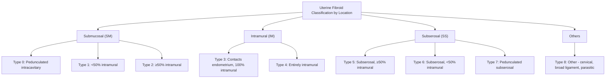

# Uterine Fibroid (Leiomyoma)

## 1. Definition

Uterine fibroids — medically termed **leiomyomata** (singular: leiomyoma) — are **benign monoclonal neoplasms arising from the smooth muscle cells (myocytes) of the myometrium** [1][2].

Let's break down the name:
- **"Leio-"** (Greek *leios*) = smooth
- **"-myo-"** (Greek *mys*) = muscle
- **"-oma"** = tumour/mass

So a **leiomyoma** literally means "a tumour of smooth muscle." The common name **"fibroid"** comes from the firm, fibrous cut-surface appearance due to abundant extracellular matrix (collagen, fibronectin, proteoglycans) deposited between the neoplastic smooth muscle cells. Despite the name, these are **not** primarily fibrous tissue tumours — they are smooth muscle tumours with a heavy fibrous stroma [1].

<Callout title="Key Distinction">
Fibroids are **benign**. Malignant transformation to leiomyosarcoma is exceedingly rare ( < 0.1–0.5%) and is now thought to arise *de novo* rather than from pre-existing fibroids in most cases. ***Do not confuse fibroid with leiomyosarcoma*** [1][2].
</Callout>

Each fibroid is **monoclonal** — meaning each individual fibroid arises from a single progenitor myocyte that acquires a somatic mutation (most commonly in *MED12*, *HMGA2*, or other driver genes), then proliferates. A single uterus can harbour multiple fibroids, each genetically distinct (i.e., each fibroid is an independent clonal proliferation) [2].

***Fibroids are the most common pelvic tumour in women*** [1][2].

---

## 2. Epidemiology

### Prevalence
- ***Fibroids are extremely common — affecting up to 70–80% of women by age 50*** [1][2].
- Clinically significant (symptomatic) fibroids occur in approximately **25–30%** of reproductive-age women.
- Many fibroids are **asymptomatic** and found incidentally on imaging or at surgery.

### Age
- ***Peak incidence in the reproductive years, particularly ages 30–50*** [1].
- Uncommon before menarche (because they are oestrogen-dependent).
- ***Tend to shrink after menopause*** due to declining oestrogen levels [1][2].
- Fibroids that persist or enlarge post-menopause should raise concern for leiomyosarcoma (red flag).

### Ethnicity
- African and Afro-Caribbean women have a **2–3× higher incidence**, earlier onset (younger age), and tend to develop larger and more numerous fibroids compared to Caucasian and Asian women.
- In **Hong Kong**, fibroids remain a very common gynaecological condition, though specific local prevalence data are less well-characterised. They are a leading indication for hysterectomy and myomectomy in the Chinese population [1].

### Risk Factors

| Factor | Effect | Mechanism |
|---|---|---|
| ***Oestrogen exposure*** | ↑ risk | Oestrogen is a major mitogen for fibroid growth (see Pathophysiology) |
| ***Early menarche*** | ↑ risk | Longer lifetime oestrogen exposure |
| ***Nulliparity*** | ↑ risk | No pregnancy-related amenorrhoea → more cumulative oestrogen cycles |
| ***Obesity (BMI > 25)*** | ↑ risk | Adipose tissue converts androgens → oestrogens via aromatase; also ↓SHBG → ↑free oestrogen |
| ***Family history (1st degree)*** | ↑ risk (2–3×) | Genetic predisposition (*MED12*, *HMGA2* mutations) |
| ***African ethnicity*** | ↑ risk (2–3×) | Genetic and possibly epigenetic factors |
| ***Hypertension*** | ↑ risk | Likely related to smooth muscle cell injury and cytokine milieu |
| ***Tamoxifen*** | ↑ risk of fibroid growth | Tamoxifen has **oestrogenic** activity on uterine tissue (partial agonist at uterine oestrogen receptors) |
| ***Parity*** | ↓ risk | Each pregnancy provides months of anovulation + remodelling of myometrium |
| ***Combined OCP*** | Variable | May be protective if started early; but exogenous oestrogen can promote growth in some |
| ***Smoking*** | Slightly ↓ risk | Anti-oestrogenic effect (↑hepatic oestrogen metabolism + ↓aromatase); note: smoking is harmful overall |
| ***Progesterone*** | Complex role | Progesterone can stimulate fibroid growth (hence why GnRH agonists alone, which suppress both E2 and P4, are effective) |
| ***Diet high in red meat, alcohol*** | ↑ risk | Possibly via oestrogen metabolism; vitamin D deficiency may also contribute |

<Callout title="High Yield — Oestrogen Dependence">
The single most important concept to understand about fibroid biology: ***fibroids are oestrogen (and progesterone) dependent***. This explains why they appear after menarche, enlarge during pregnancy (high E2/P4), enlarge with obesity/HRT, and shrink after menopause or with GnRH agonist treatment [1][2].
</Callout>

---

## 3. Anatomy and Function: The Uterus

To understand fibroids, you need to know the anatomy of the uterus — because the **location** of the fibroid within the uterine wall determines its symptoms.

### 3.1 Gross Anatomy of the Uterus

The uterus is a thick-walled, hollow, pear-shaped muscular organ located in the pelvis between the bladder (anteriorly) and rectum (posteriorly). It has:

- **Fundus**: the dome-shaped upper portion above the level of the tubal ostia
- **Body (corpus)**: the main bulk
- **Isthmus**: the narrow transitional zone between body and cervix
- **Cervix**: the lower cylindrical portion opening into the vagina

### 3.2 Layers of the Uterine Wall

| Layer | Structure | Relevance to Fibroids |
|---|---|---|
| **Endometrium** (innermost) | Mucosal lining; functional layer sheds during menstruation | Submucosal fibroids distort this layer → abnormal uterine bleeding |
| **Myometrium** (middle) | Thick layer of smooth muscle arranged in interlacing bundles; the layer from which fibroids arise | Intramural fibroids reside here |
| **Serosa / Perimetrium** (outermost) | Peritoneal covering (visceral peritoneum) | Subserosal fibroids project outward from here |

### 3.3 Blood Supply

- **Uterine artery** (branch of the internal iliac artery) — the dominant blood supply
- **Ovarian artery** (branch of the aorta) — provides collateral supply via tubo-ovarian anastomosis
- ***The uterine artery is the target vessel in uterine artery embolisation (UAE)*** [3]

### 3.4 Functional Significance

The myometrium contracts during labour to expel the fetus, and during menstruation to help shed the endometrium. Fibroids distort the normal myometrial architecture and can:
- Impair contractility → heavy menstrual bleeding (failure to compress spiral arterioles)
- Distort the endometrial cavity → abnormal implantation / infertility
- Compress adjacent organs (bladder, ureters, rectum) → urinary/bowel symptoms

---

## 4. Aetiology and Pathophysiology

### 4.1 Initiation (Tumourigenesis)

Each fibroid begins as a **single mutated myometrial stem cell** that gains a proliferative advantage:

- **MED12 mutations** — found in ~70% of fibroids; MED12 is a subunit of the Mediator complex involved in transcriptional regulation. Mutations here lead to dysregulated cell proliferation.
- **HMGA2 rearrangements** — HMGA2 (High Mobility Group AT-hook 2) is a chromatin architectural protein; its overexpression promotes cell growth.
- **Fumarate hydratase (FH) mutations** — seen in **hereditary leiomyomatosis and renal cell cancer (HLRCC)** syndrome; loss of this Krebs cycle enzyme leads to pseudohypoxia and growth factor activation.
- Other less common drivers: *COL4A5/COL4A6* deletions (Alport syndrome-associated)

### 4.2 Promotion (Growth — the role of sex steroids)

Once initiated, **oestrogen and progesterone** are the key promoters of fibroid growth:

#### Oestrogen
- Oestrogen stimulates fibroid growth by:
  - Upregulating growth factors (EGF, IGF-1, TGF-β)
  - Promoting extracellular matrix (ECM) deposition
  - Increasing progesterone receptor expression (priming the fibroid for P4 effects)
- Fibroids overexpress **aromatase** (CYP19A1), allowing *local conversion* of androgens to oestrogen within the fibroid itself — creating an **autocrine/paracrine loop** that sustains growth even when systemic oestrogen is relatively low.

#### Progesterone
- Progesterone's role is now recognised as equally important (if not more so in promoting mitotic activity):
  - Progesterone stimulates **cell proliferation** (mitotic activity peaks in the secretory/luteal phase, not the follicular/oestrogenic phase)
  - Upregulates anti-apoptotic factors (Bcl-2)
  - This is why **selective progesterone receptor modulators (SPRMs)** like ulipristal acetate can shrink fibroids

<Callout title="Why do fibroids enlarge during pregnancy?">
During pregnancy, both oestrogen and progesterone levels rise dramatically. The combined mitogenic effect drives fibroid enlargement. Additionally, the increase in blood flow to the uterus provides more nutrients. However, fibroids may also undergo **red/carneous degeneration** during pregnancy due to outgrowing their blood supply (see Degeneration below) [1].
</Callout>

### 4.3 Extracellular Matrix (ECM)

Fibroids produce a disproportionately large amount of **ECM** (collagen types I and III, fibronectin, proteoglycans). This gives them their characteristically **firm, whorled, white cut surface** and contributes to bulk symptoms. The ECM also acts as a reservoir for growth factors (TGF-β, bFGF) that promote further fibroid growth.

### 4.4 Degeneration

When fibroids outgrow their blood supply, they undergo **degenerative changes**. This is clinically important because degeneration can cause acute pain:

| ***Type of Degeneration*** | Pathophysiology | Clinical Significance |
|---|---|---|
| ***Hyaline degeneration*** | Most common (60%); homogeneous acellular areas replace smooth muscle | Usually asymptomatic; fibroid becomes softer |
| ***Cystic degeneration*** | Liquefaction of hyalinised areas → cyst formation | Mimics ovarian cyst on imaging |
| ***Calcification (calcific degeneration)*** | Calcium deposition, especially post-menopause with poor blood supply | ***Visible on X-ray / AXR as "popcorn" calcification*** [4]; usually asymptomatic |
| ***Red (carneous) degeneration*** | Venous thrombosis at fibroid periphery → haemorrhagic infarction; classically occurs in **pregnancy** (2nd trimester) or with OCP use | ***Acute pain, tenderness, low-grade fever; managed conservatively with analgesia*** [1] |
| ***Fatty degeneration*** | Rare; lipid deposition | Usually incidental |
| ***Sarcomatous change*** | Extremely rare ( < 0.5%); likely represents *de novo* leiomyosarcoma | Suspect if rapid growth post-menopause; needs surgical excision |

<Callout title="Red Degeneration in Pregnancy" type="idea">
A pregnant woman (typically 2nd trimester) presenting with **acute localised uterine tenderness, low-grade fever, and mild leukocytosis** with a known fibroid should be suspected of red/carneous degeneration. Management is **conservative** — rest, hydration, analgesia (paracetamol, NSAIDs avoided in late pregnancy). Surgery is almost never needed [1].
</Callout>

---

## 5. Classification

Fibroids are classified by their **location** within the uterine wall, which directly determines the symptom profile. The ***FIGO leiomyoma subclassification system*** (FIGO classification / ***PALM-COEIN*** system for AUB) is the standard [1][2]:

### 5.1 By Location (FIGO Subclassification)

| FIGO Type | Location | Key Clinical Feature |
|---|---|---|
| **0** | Pedunculated submucosal (entirely intracavitary) | Heavy bleeding; may prolapse through cervix |
| **1** | Submucosal, < 50% intramural component | Heavy bleeding; affects fertility |
| **2** | Submucosal, ≥ 50% intramural component | Heavy bleeding; harder to resect hysteroscopically |
| **3** | Intramural, contacts endometrium | May cause bleeding |
| **4** | Entirely intramural | Bulk symptoms; may affect bleeding if large |
| **5** | Subserosal, ≥ 50% intramural | Bulk symptoms |
| **6** | Subserosal, < 50% intramural | Bulk symptoms, pressure effects |
| **7** | Pedunculated subserosal | Torsion risk; may mimic adnexal mass |
| **8** | Cervical, parasitic, broad ligament, round ligament | Site-specific symptoms |

<Callout title="Clinical Pearl — Location Determines Symptoms">
- ***Submucosal fibroids*** (Types 0–2) → ***most likely to cause abnormal uterine bleeding (AUB) and infertility*** even when small, because they distort the endometrial cavity [1][2].
- ***Intramural fibroids*** (Types 3–4) → cause both bleeding (if large/close to endometrium) and bulk symptoms.
- ***Subserosal fibroids*** (Types 5–7) → primarily cause bulk/pressure symptoms; unlikely to cause bleeding unless very large distorting the cavity.
</Callout>

### 5.2 Other Descriptors

- ***Pedunculated***: attached to the uterus by a stalk (pedicle). Can be submucosal (intracavitary, Type 0) or subserosal (Type 7). The stalk can twist → **torsion** → acute pain from ischaemia [1].
- ***Parasitic fibroid***: a fibroid that has detached from the uterus and gained an alternative blood supply (e.g., from the omentum or bowel mesentery). Increasingly recognised post-laparoscopic morcellation.
- ***Broad ligament fibroid***: grows laterally between the layers of the broad ligament. Can displace the ureter → hydroureter/hydronephrosis. Can be mistaken for an ovarian mass.
- ***Cervical fibroid***: arises from the cervix; can obstruct labour or cause urinary retention.
- ***Intraligamentary fibroid***: within the broad or round ligament.

---

## 6. Clinical Features

***The majority (50–80%) of fibroids are asymptomatic*** and discovered incidentally [1][2]. When symptomatic, the clinical features depend on the **size, number, and location** of the fibroids.

### 6.1 Symptoms

#### A. ***Abnormal Uterine Bleeding (AUB) — the most common symptom*** [1][2]

***The "P" in PALM-COEIN stands for Polyp, Adenomyosis, Leiomyoma, Malignancy*** — fibroids are a **structural cause** of abnormal uterine bleeding [5].

- ***Heavy menstrual bleeding (HMB / menorrhagia)*** — the single most common presenting complaint
  - ***Prolonged periods (> 7 days) and/or increased volume***
  - Characteristically **regular** cycle (as opposed to anovulatory bleeding which is irregular) — because fibroids do not disrupt the hypothalamic-pituitary-ovarian axis
  - Patients may report **flooding**, **passage of large clots**, needing to change pads/tampons every 1–2 hours, and **soaking through clothes or bedsheets**

**Why do fibroids cause heavy bleeding? Multiple mechanisms:**

1. **Increased endometrial surface area**: submucosal and large intramural fibroids enlarge the uterine cavity → more endometrium to shed → more bleeding
2. **Distortion of the subendometrial venous plexus**: fibroids compress and dilate the venous sinuses underlying the endometrium → venous ectasia → heavy bleeding
3. **Impaired myometrial contractility**: the myometrium normally contracts after menstruation to compress spiral arterioles and stop bleeding (similar to how it contracts post-partum). Fibroids disrupt the normal architecture, preventing effective contraction around blood vessels → failure of haemostasis
4. **Altered local prostaglandin/growth factor production**: fibroids increase local production of PGE2, PGI2 (vasodilators and anti-platelet) and decrease PGF2α (vasoconstrictor) → impaired vasoconstriction and platelet aggregation → ongoing bleeding
5. **Ulceration of overlying endometrium**: submucosal fibroids can cause pressure necrosis and ulceration of the overlying endometrium → bleeding from a raw surface

- ***Intermenstrual bleeding (IMB)*** — less common; can occur if submucosal fibroid causes endometrial ulceration
- ***Postcoital bleeding*** — if cervical fibroid present
- ***Iron deficiency anaemia*** — consequence of chronic heavy menstrual blood loss

<Callout title="Fibroid vs. Adenomyosis" type="error">
Both fibroids and adenomyosis cause HMB and dysmenorrhoea, and they frequently **coexist**. Key clinical differences: adenomyosis causes a **uniformly enlarged, boggy, tender** uterus (often described as "globular"), whereas fibroids cause an **irregularly enlarged, firm, non-tender** uterus with discrete nodules. On USS, adenomyosis shows a heterogeneous myometrium with poor junctional zone definition, whereas fibroids appear as well-circumscribed round lesions. MRI is the gold standard to differentiate them.
</Callout>

#### B. Bulk/Pressure Symptoms

As fibroids enlarge, they exert **mass effect** on adjacent pelvic structures:

- ***Pelvic pressure / heaviness / discomfort*** — from the sheer mass of the fibroid(s) in the pelvis
- ***Urinary symptoms*** — from compression of the **bladder** (anterior to uterus):
  - ***Urinary frequency*** — reduced bladder capacity
  - ***Urgency***
  - ***Nocturia***
  - ***Acute urinary retention*** — particularly with a large ***cervical fibroid*** or ***anterior wall fibroid*** impacting the bladder neck [6]
  - ***Hydroureter / hydronephrosis*** — large broad ligament or laterally placed fibroids can compress the ureter at the pelvic brim, causing obstruction. If bilateral or in a solitary kidney, this can lead to **renal impairment** (obstructive uropathy)
- ***Bowel symptoms*** — from compression of the **rectum** (posterior to uterus):
  - ***Constipation***
  - ***Tenesmus*** (sensation of incomplete evacuation)
  - ***Rectal pressure***
- ***Abdominal distension*** — very large fibroids (can reach up to the xiphisternum in extreme cases; uterine size often described in "weeks" like a pregnant uterus, e.g., "20-week size")

#### C. Pain

Fibroids per se are often **painless**. When pain occurs, consider:

- ***Dysmenorrhoea (painful periods)*** — due to:
  - Abnormal myometrial contractions trying to expel submucosal fibroids
  - Distortion of the uterine cavity
  - Concomitant adenomyosis (common co-pathology)
- ***Acute pain*** — suggests:
  - ***Red (carneous) degeneration*** — especially in pregnancy (2nd trimester); localised tenderness over the fibroid, low-grade fever
  - ***Torsion of a pedunculated fibroid*** — sudden onset severe pain, peritonism
  - ***Acute urinary retention*** — suprapubic pain
- ***Dyspareunia (deep)*** — if fibroid is in the posterior wall or cervix, pressing on the pouch of Douglas or vaginal fornices
- ***Chronic pelvic pain*** — less specific; may be due to degeneration, pressure, or associated conditions

#### D. ***Reproductive Symptoms*** [1][2]

- ***Subfertility / infertility*** — fibroids may impair fertility through several mechanisms:
  - Submucosal fibroids distort the endometrial cavity → impaired implantation
  - Intramural fibroids near the tubal ostia → mechanical tubal obstruction
  - Altered endometrial receptivity (local cytokine/growth factor changes)
  - Altered uterine contractility → impaired sperm transport
  - However, fibroids are the **sole cause** of infertility in only ~2–3% of cases
- ***Recurrent pregnancy loss*** — submucosal fibroids associated with increased miscarriage risk
- ***Pregnancy complications*** — if fibroids are present during pregnancy:
  - ***Red degeneration*** (as above)
  - ***Malpresentation*** (e.g., transverse lie, breech) — fibroid distorts uterine cavity
  - ***Preterm labour***
  - ***Placental abruption*** — if fibroid is at the placental site
  - ***Obstructed labour*** — particularly cervical or lower segment fibroids
  - ***Postpartum haemorrhage (PPH)*** — ***fibroids are a risk factor for uterine atony (the most common cause of PPH)*** because the fibroid-laden uterus cannot contract effectively to compress the placental bed blood vessels [7]

<Callout title="Fibroid and PPH" type="idea">
***Fibroids cause abnormal myometrium*** — this is listed as a risk factor for PPH under the "Tone" category (the 4 T's: Tone, Tissue, Trauma, Thrombin). The ***upper segment of the uterus is the main contractile force*** in PPH prevention; fibroids in the upper segment are therefore particularly problematic [7].
</Callout>

#### E. Other Symptoms

- ***Polycythaemia (secondary erythrocytosis)*** — rare paraneoplastic phenomenon; some fibroids produce **erythropoietin (EPO)** → secondary erythrocytosis (this is listed under "inappropriate EPO production" alongside RCC, HCC, and cerebellar haemangioblastoma) [8]
- ***Ascites + pleural effusion*** — ***Meigs-like syndrome*** (pseudo-Meigs syndrome): very rare; large subserosal fibroids can produce a triad of pelvic mass + ascites + pleural effusion, mimicking ovarian cancer

### 6.2 Signs (Physical Examination)

#### Abdominal Examination

- ***Palpable pelvic/abdominal mass*** — arising from the pelvis (you cannot "get below it" on abdominal palpation, i.e., the lower margin is continuous with the pelvis)
  - ***Firm to hard*** in consistency (due to smooth muscle and collagen)
  - ***Irregular / lobulated*** surface if multiple fibroids
  - ***Non-tender*** (unless undergoing degeneration)
  - ***Mobile side to side but not up and down*** if connected to the uterus (transmits movement with cervical excitation — see bimanual exam)
  - ***Dull to percussion*** (as opposed to tympanitic for bowel)
  - ***The mass moves with respiration*** (if intraperitoneal) — actually, a pelvic mass typically does *not* move with respiration because it is fixed in the pelvis (contrast with hepatomegaly or splenomegaly)

> **How to differentiate a pelvic mass from an ovarian mass on examination**: A fibroid uterus is typically a **midline** mass; you cannot feel a plane of separation between it and the uterus on bimanual exam; it moves when the cervix is moved (i.e., transmitted mobility on bimanual exam). An ovarian mass tends to be more **lateral**, with a palpable groove between it and the uterus.

#### Pelvic (Bimanual) Examination

- ***Enlarged uterus*** — often described in terms of gestational weeks
- ***Irregular contour*** — multiple fibroids give a "knobbly" or lobulated feel
- ***Firm consistency***
- ***Non-tender*** (unless degeneration)
- ***Cervical fibroid*** — may be palpable as a mass at the cervix; a ***pedunculated submucosal fibroid*** may prolapse through the cervical os and be visible/palpable on speculum examination (polypoidal mass protruding through cervix — ***fibroid polyp***)
- ***Uterus may be retroverted and fixed*** if posterior wall fibroids are present

#### Speculum Examination

- ***Fibroid polyp*** protruding through the cervical os (pedunculated submucosal fibroid, FIGO Type 0)
- Cervix may appear displaced by cervical or lower uterine segment fibroids

#### General Examination

- ***Pallor*** — suggesting iron deficiency anaemia from chronic HMB
- Signs of iron deficiency: koilonychia, angular stomatitis, glossitis (smooth tongue)

<Callout title="What if the fibroid grows rapidly postmenopausally?" type="error">
A fibroid that ***enlarges after menopause*** is a **red flag** for ***leiomyosarcoma***. In the absence of HRT or other oestrogen sources, fibroids should be regressing. Rapid growth (especially with pain) warrants urgent investigation (MRI +/- surgical excision for histological assessment). However, note that "rapid growth" alone has poor predictive value for sarcoma — the overall risk remains very low [2].
</Callout>

---

## 7. Secondary Effects (Paraneoplastic and Systemic)

Beyond local effects, fibroids can rarely cause systemic phenomena:

| Effect | Mechanism |
|---|---|
| ***Iron deficiency anaemia*** | Chronic heavy menstrual blood loss → depleted iron stores |
| ***Secondary erythrocytosis*** | Inappropriate EPO production by the fibroid [8] |
| ***Pseudo-Meigs syndrome*** | Large fibroid → peritoneal irritation → ascites; sympathetic pleural effusion (usually right-sided) |
| ***Hypercalcaemia*** | Extremely rare; production of PTHrP |
| ***Venous thromboembolism*** | Large fibroids can compress pelvic veins → venous stasis → DVT/PE |

---

## 8. Imaging Appearances (Preview)

***This will be covered in more detail in the Diagnosis section***, but for completeness of clinical features:

- ***USS (transabdominal +/- transvaginal)*** — first-line imaging [1][4]:
  - ***Well-defined, hypoechoic, round mass*** within the myometrium
  - May show ***posterior acoustic shadowing*** (due to dense fibrous tissue)
  - ***Very vascular on Doppler*** (peripheral and intralesional vascularity) [4]
  - Submucosal fibroids indent/distort the endometrial stripe
  - Calcified fibroids → ***hyperechoic foci with shadowing***

- ***AXR*** — ***"popcorn" or amorphous calcification*** in the pelvis may indicate calcific degeneration of a fibroid [4]

- ***MRI*** — gold standard for mapping fibroid number, location, and type; essential for surgical planning
  - T1: iso- to hypointense
  - T2: typically ***hypointense*** (dark) due to dense fibrous tissue; degenerated fibroids may show heterogeneous or hyperintense signal

- ***Uterine artery embolisation (UAE)*** — both diagnostic and therapeutic; demonstrates the vascular supply on angiography before embolisation [3]

---

## 9. Relation to the PALM-COEIN System

***Fibroids are classified under the "L" (Leiomyoma) of the PALM-COEIN system for abnormal uterine bleeding (AUB)*** [5]. The FIGO system further subclassifies the fibroid based on its relationship to the endometrial cavity:

- **AUB-L (SM)** — submucosal component present (FIGO 0–2) → most likely to cause AUB
- **AUB-L (O)** — other types without submucosal component (FIGO 3–8)

This distinction is important because only submucosal fibroids are strongly associated with AUB, and the management approach differs (hysteroscopic resection is possible for submucosal fibroids).

---

<Callout title="High Yield Summary">

**Uterine Fibroid (Leiomyoma) — Key Points for Exams:**

1. ***Most common pelvic tumour in women*** — benign, monoclonal, smooth muscle neoplasm of the myometrium
2. ***Oestrogen AND progesterone dependent*** — appears after menarche, grows in pregnancy, shrinks after menopause
3. Risk factors: early menarche, nulliparity, obesity, African ethnicity, family history, hypertension
4. ***Location determines symptoms*** — Submucosal (bleeding/infertility), Intramural (bleeding + bulk), Subserosal (bulk/pressure)
5. ***Heavy menstrual bleeding (HMB) is the most common symptom*** — due to ↑endometrial surface area, venous ectasia, impaired myometrial contractility, altered prostaglandins
6. Bulk symptoms: urinary frequency/retention, constipation, abdominal distension
7. ***Red degeneration*** — acute pain in pregnancy (2nd trimester); manage conservatively
8. ***Fibroid is a risk factor for PPH*** — abnormal myometrium → uterine atony
9. ***Pedunculated subserosal fibroid can mimic adnexal mass***; pedunculated submucosal fibroid can prolapse through cervix
10. ***Rapid enlargement post-menopause → suspect leiomyosarcoma***
11. USS is first-line imaging; MRI is gold standard for mapping
12. ***"L" in PALM-COEIN*** (AUB classification); FIGO leiomyoma subclassification Types 0–8
13. Rare: secondary erythrocytosis (EPO production), pseudo-Meigs syndrome
14. ***On AXR: "popcorn" calcification*** (calcific degeneration)

</Callout>

---

<ActiveRecallQuiz
  title="Active Recall - Uterine Fibroid (Definition to Clinical Features)"
  items={[
    {
      question: "Why do fibroids cause heavy menstrual bleeding? Name at least 4 mechanisms.",
      markscheme: "1) Increased endometrial surface area; 2) Distortion/ectasia of subendometrial venous plexus; 3) Impaired myometrial contractility (cannot compress spiral arterioles); 4) Altered prostaglandin balance (increased PGE2/PGI2, decreased PGF2alpha); 5) Ulceration of overlying endometrium (submucosal). Any 4 for full marks.",
    },
    {
      question: "A 32-year-old pregnant woman at 20 weeks presents with acute localised uterine pain, low-grade fever, and a known fibroid. What is the most likely diagnosis and how should it be managed?",
      markscheme: "Red (carneous) degeneration of fibroid. Pathophysiology: venous thrombosis at fibroid periphery leading to haemorrhagic infarction. Management: conservative — rest, hydration, analgesia (paracetamol; avoid NSAIDs in late pregnancy). Surgery almost never needed.",
    },
    {
      question: "What is the FIGO leiomyoma subclassification system? Classify types 0-2 and explain why they are clinically distinct from types 5-7.",
      markscheme: "Types 0-2 are submucosal fibroids (0 = pedunculated intracavitary, 1 = less than 50% intramural, 2 = 50% or more intramural). Types 5-7 are subserosal (5 = 50% or more intramural, 6 = less than 50% intramural, 7 = pedunculated subserosal). Submucosal fibroids are most likely to cause abnormal uterine bleeding and infertility (distort endometrial cavity) whereas subserosal fibroids primarily cause bulk/pressure symptoms.",
    },
    {
      question: "Name 3 mechanisms by which fibroids can cause infertility.",
      markscheme: "1) Distortion of endometrial cavity impairing implantation (submucosal); 2) Mechanical tubal obstruction (near cornua/ostia); 3) Altered endometrial receptivity (abnormal cytokine/growth factor milieu); Also acceptable: altered uterine contractility impairing sperm transport.",
    },
    {
      question: "Why are fibroids a risk factor for postpartum haemorrhage?",
      markscheme: "Fibroids cause abnormal myometrium that cannot contract effectively after delivery. The upper uterine segment is the main contractile force to compress placental bed blood vessels. Fibroids disrupt this contraction leading to uterine atony, the most common cause of PPH.",
    },
    {
      question: "A 58-year-old postmenopausal woman not on HRT presents with a rapidly enlarging pelvic mass previously diagnosed as a fibroid. What is the main concern and why?",
      markscheme: "Main concern is leiomyosarcoma. Rationale: fibroids are oestrogen/progesterone dependent and should shrink or remain stable after menopause without exogenous hormones. Rapid enlargement in this context is a red flag for malignant transformation (though likely de novo sarcoma rather than true transformation). Requires urgent investigation with MRI and surgical excision for histological assessment.",
    },
  ]}
/>

## References

[1] Lecture slides: GC 118. Pelvic mass ovarian cancer and cysts; uterine fibroid; pelvic imaging.pdf
[2] Lecture slides: Block C - Pelvic mass_ ovarian cancer and cysts; uterine fibroid; pelvic imaging.pdf
[3] Senior notes: Ryan Ho Diagnostic Radiology.pdf (p85 — Transcatheter Embolization: uterine fibroid embolization)
[4] Senior notes: Ryan Ho Radiology.pdf (p33 — Uterine mass, leiomyoma on USS)
[5] Lecture slides: GC 112. Abnormal vaginal bleeding Gynaecological cancer.pdf
[6] Senior notes: Ryan Ho Urogenital.pdf (p164 — gynaecological tumours e.g. fibroid as cause of female AROU)
[7] Lecture slides: Block C - Postpartum Haemorrhage.pdf (p5 — risk factors for PPH: abnormal myometrium including fibroid)
[8] Senior notes: Maksim Medicine Notes.pdf (p170 — uterine fibroma as cause of inappropriate EPO production / secondary erythrocytosis)
