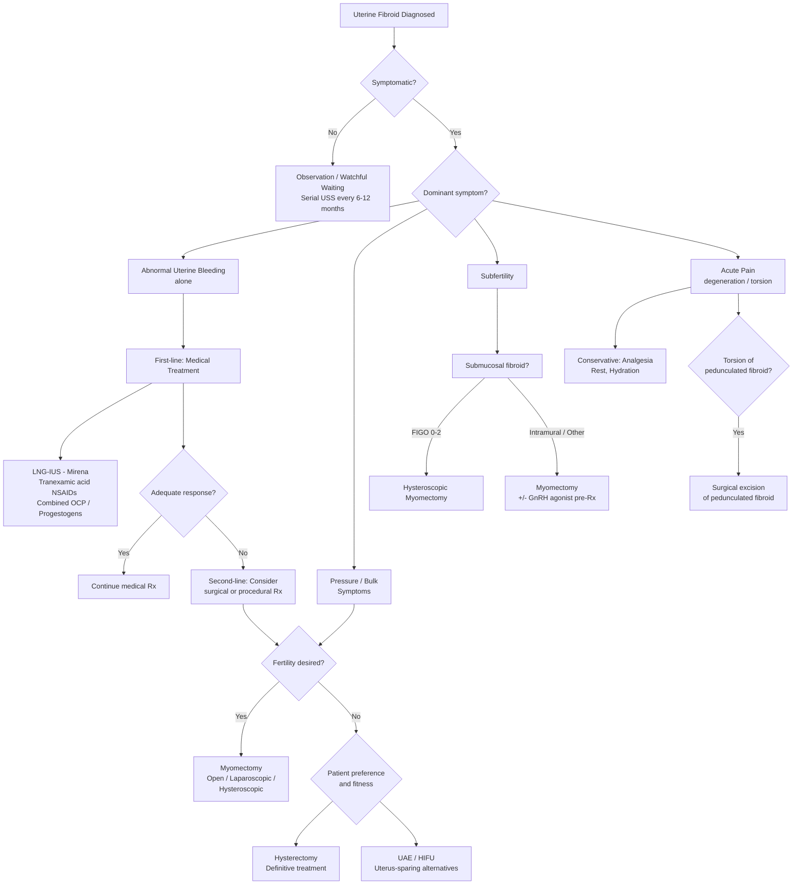

## Management of Uterine Fibroid

### Guiding Principles

Before diving into specific treatments, you need to understand the **core philosophy** that guides fibroid management:

***Management will depend on the age, symptom, condition and wish of the patient*** [1][2].

This single sentence from the lecture slides captures everything. Unlike cancer management where you have relatively standardised protocols, fibroid management is highly **individualised**. The key decision-making factors are:

1. **Is the patient symptomatic?** — ***Asymptomatic fibroids can still be observed*** [2]. Even very large fibroids ("***I have seen a fibroid up to the epigastric area***", but if the patient is asymptomatic and it is her choice, ***observation is still fine***) [2]
2. **What are the dominant symptoms?** — ***If menorrhagia alone, then medical treatment should be sufficient. But if there are pressure symptoms, then surgical removal may be better*** [2]
3. **What is the patient's age and reproductive wish?** — A 28-year-old wanting children requires a completely different approach from a 52-year-old nearing menopause
4. **Fibroid characteristics** — size, number, location (FIGO type), presence of degeneration
5. **Patient preference** — some patients wish to avoid surgery entirely; others want definitive treatment

***Treatment principle is to rule out acute conditions first → since those can deteriorate quickly and threaten life*** [2].

---

### Management Algorithm

---

### I. Expectant Management (Observation / Watchful Waiting)

**Who is this for?**
- ***Asymptomatic fibroids*** — regardless of size [2]
- Perimenopausal women with mild symptoms (fibroids will likely shrink after menopause as oestrogen declines)
- Small fibroids discovered incidentally

**What does it involve?**
- Reassurance and patient education
- ***Serial USS monitoring*** every 6–12 months to track growth
- Monitoring haemoglobin if any bleeding symptoms develop
- Prompt reassessment if symptoms develop or fibroid grows rapidly (red flag for sarcoma post-menopausally)

**Why does it work?**
Fibroids are benign, slow-growing, and oestrogen-dependent. After menopause, they shrink. Many women live with fibroids their entire reproductive lives without needing intervention. The risk of malignant transformation ( < 0.5%) is negligible.

<Callout title="Observation Even for Large Fibroids">
***Size alone is not an indication for treatment***. A large asymptomatic fibroid reaching the epigastrium can still be observed if the patient is well-informed and chooses not to intervene [2]. However, you must ensure no complications are developing (e.g., ureteric obstruction → check RFT, renal USS).
</Callout>

---

### II. Medical Treatment

Medical treatment primarily targets **abnormal uterine bleeding (menorrhagia)** and, to some extent, **pain/dysmenorrhoea**. Medical therapy does **not** significantly reduce fibroid size (except GnRH agonists/antagonists). It is therefore most useful when bleeding is the dominant complaint, not bulk/pressure symptoms.

***Approach to fibroid can be conservative vs. surgical, based on what symptoms there are. E.g. menorrhagia alone, then medical treatment should be sufficient*** [2].

#### A. ***Symptomatic Relief*** [1]

##### 1. ***LNG-IUS (Levonorgestrel-releasing Intrauterine System — Mirena®)***

- **Mechanism**: Releases levonorgestrel (a potent progestogen) directly into the uterine cavity → causes endometrial atrophy (thinning of the endometrium) → less endometrium to shed → dramatically reduced menstrual blood loss (up to 90% reduction)
- **Indication**: First-line treatment for HMB in women who do not want immediate fertility; works well for small-to-moderate fibroids
- **Duration**: Licensed for 5 years; also provides contraception
- **Limitations**:
  - May be difficult to insert if the uterine cavity is significantly distorted by submucosal or large intramural fibroids
  - Higher expulsion rate with submucosal fibroids (the fibroid can push it out)
  - Does **not** shrink fibroids — only controls bleeding
  - Not suitable if cavity is > 12 cm (device may not sit properly)
- **Why it works so well**: The progestogen acts *locally* on the endometrium with minimal systemic absorption → maximal endometrial effect, minimal systemic side effects

##### 2. ***Tranexamic Acid (Transamin)*** [1]

- **Mechanism**: Anti-fibrinolytic agent — inhibits plasminogen activation → prevents clot breakdown → clots persist longer over bleeding endometrial vessels → reduced blood loss
- "Trans-" = across; "examic" from "aminocaproic" family — blocks the lysine-binding sites on plasminogen, preventing its conversion to plasmin
- **Dose**: 1g TDS–QDS during menstruation only (not taken continuously)
- **Reduction**: ~40–50% reduction in menstrual blood loss
- **Advantages**: Non-hormonal; taken only during periods; can be combined with other therapies
- **Contraindications**: History of thromboembolic disease (because anti-fibrinolytic → theoretically pro-thrombotic, though evidence for this is weak at standard doses)
- Does **not** affect fibroid size or reduce pressure symptoms

##### 3. ***NSAIDs (e.g., Mefenamic acid)***

- **Mechanism**: Inhibit cyclooxygenase (COX) → reduced prostaglandin synthesis → reduced PGE2 (vasodilator) and PGI2 (anti-platelet) → relative ↑ in vasoconstriction and platelet aggregation → reduced blood loss. Also analgesic → helps with dysmenorrhoea
- **Dose**: Mefenamic acid 500mg TDS during menstruation
- **Reduction**: ~20–30% reduction in menstrual blood loss
- Often used **in combination** with tranexamic acid
- Does **not** shrink fibroids

##### 4. ***Combined Oral Contraceptive Pill (COCP) / Cyclical Progestogens***

- **Mechanism**: COCP provides exogenous oestrogen + progestogen → suppresses endogenous HPO axis → thinner, more stable endometrium → lighter withdrawal bleeds. Cyclical progestogens (e.g., norethisterone, medroxyprogesterone) also stabilise the endometrium
- **Limitation**: May theoretically promote fibroid growth due to the oestrogen component (though in practice, low-dose COCPs rarely cause significant fibroid enlargement). Not first-line for fibroid-related HMB but used in younger women who also need contraception
- Cyclical norethisterone (5mg TDS, days 5–26) can regulate bleeding but is less effective than LNG-IUS

#### B. Agents That Shrink Fibroids (Pre-Operative / Short-Term)

These are generally used **pre-operatively** to shrink fibroids before surgery, making the operation technically easier and reducing blood loss. They are not used long-term (with one exception).

##### 5. GnRH Agonists (e.g., Goserelin / Zoladex®, Leuprorelin / Lupron®)

- **Mechanism**: GnRH agonists initially stimulate the pituitary (flare effect), then cause **downregulation** of GnRH receptors → pituitary desensitisation → ↓FSH, ↓LH → profound ↓oestrogen (to postmenopausal levels / "medical castration") → fibroid shrinkage (up to 50% volume reduction over 3–6 months)
- "GnRH agonist" = mimics GnRH but given continuously (the pituitary normally responds to pulsatile GnRH; continuous exposure paradoxically shuts it down)
- **Indications**:
  - ***Pre-operative*** — to shrink large fibroids before myomectomy or hysterectomy (makes surgery easier, reduces blood loss, may allow laparoscopic approach instead of open)
  - To correct severe anaemia before surgery (cessation of menses allows Hb to recover)
  - Bridge therapy for perimenopausal women (shrink fibroid until menopause occurs naturally)
- **Duration**: Maximum **6 months** continuous use
- **Side effects**: Menopausal symptoms (hot flushes, vaginal dryness, mood changes, decreased libido), and critically — **bone mineral density loss** (because oestrogen is essential for bone metabolism). This is why they cannot be used long-term without "add-back therapy" (low-dose HRT to protect bones while still keeping oestrogen low enough to maintain fibroid shrinkage)
- **Limitation**: Fibroids **regrow rapidly** after cessation → must proceed to surgery while on treatment, or transition to another therapy
- **Flare effect**: Initial 2-week stimulation can worsen bleeding → may need to cover with progestogen or start mid-luteal phase

##### 6. GnRH Antagonists (e.g., Relugolix, Elagolix — oral; Cetrorelix — injectable)

- **Mechanism**: Directly block GnRH receptors on the pituitary → immediate suppression of FSH/LH (no flare effect!) → ↓oestrogen → fibroid shrinkage
- **Advantage over GnRH agonists**: No initial flare, oral formulation available, can be combined with add-back therapy from the start
- **Relugolix combination therapy (Myfembree®)**: Relugolix 40mg + estradiol 1mg + norethindrone acetate 0.5mg — approved for long-term use (up to 2 years) because the add-back therapy mitigates bone loss and menopausal symptoms while maintaining fibroid control
- This represents a **newer approach** (approved 2021–2023) that allows longer-term medical management of fibroids

##### 7. Selective Progesterone Receptor Modulators (SPRMs) — e.g., Ulipristal Acetate (UPA / Esmya®)

- **Mechanism**: Modulates the progesterone receptor → inhibits progesterone's mitogenic effect on fibroids → induces fibroid cell apoptosis + amenorrhoea (via endometrial effect) → fibroid shrinkage (comparable to GnRH agonists) WITHOUT causing hypoestrogenism (oestrogen levels remain in mid-follicular range → no hot flushes, no bone loss)
- **Advantage**: Can achieve amenorrhoea (stops bleeding) AND shrink fibroid without menopausal symptoms
- **Limitation**: **SERIOUS SAFETY CONCERN** — reports of severe liver injury (including cases requiring liver transplantation) led to EMA restriction in 2020. Currently restricted to pre-operative use in specific circumstances with mandatory liver function monitoring (LFTs before, during, and after treatment). Not available/recommended in many centres
- Previously considered a game-changer but safety profile has limited its use

<Callout title="GnRH Agonist vs Antagonist vs SPRM" type="idea">

| Feature | GnRH Agonist | GnRH Antagonist | SPRM (UPA) |
|---|---|---|---|
| Route | SC/IM injection (monthly/3-monthly) | Oral (newer) or SC | Oral |
| Onset | Delayed (2–4 weeks, after flare) | Immediate | Rapid |
| Flare | Yes | No | No |
| Oestrogen effect | Profound suppression | Partial suppression (with add-back) | Maintained mid-follicular |
| Bone loss | Yes (limits to 6 months) | Mitigated by add-back (up to 2 years) | Minimal |
| Fibroid shrinkage | ~35–50% | ~40% | ~40% |
| Liver risk | Minimal | Minimal | **Serious (rare)** |
| Current status | Established; widely used pre-op | Increasingly first-line for long-term medical Rx | Restricted due to hepatotoxicity |

</Callout>

---

### III. Surgical Treatment

***Surgical removal (myomectomy vs hysterectomy), approach (open / laparoscopic / vaginal / hysteroscopic)*** [1].

Surgery is indicated when:
- Medical treatment fails or is not appropriate
- Pressure/bulk symptoms (medical treatment does not help)
- Subfertility attributed to fibroids
- Suspicion of malignancy (leiomyosarcoma)
- Patient preference for definitive treatment

#### A. ***Myomectomy*** — Uterus-Preserving Surgery

"Myo-" = muscle, "-ectomy" = surgical removal. Myomectomy removes the fibroid(s) while preserving the uterus.

##### Indications
- Symptomatic fibroids in women who **wish to preserve fertility** or **wish to retain their uterus**
- Submucosal fibroids causing HMB or infertility (hysteroscopic approach)
- Failed medical treatment

##### Approach — depends on fibroid location and size

| Approach | Indication | Technique | Advantages | Limitations |
|---|---|---|---|---|
| ***Hysteroscopic myomectomy*** | ***Submucosal fibroids (FIGO 0, 1, 2)*** | Resectoscope inserted through cervix → fibroid shaved/resected under direct vision | No abdominal incision; outpatient/day case; rapid recovery; preserves uterus and fertility | Limited to submucosal fibroids ≤ 4–5 cm; Type 2 may require staged procedure; risk of fluid overload (glycine absorption), uterine perforation |
| ***Laparoscopic myomectomy*** | Subserosal or intramural fibroids, ≤ 3–4 fibroids, size ≤ 8–10 cm | Keyhole surgery; fibroid enucleated from pseudocapsule, uterine defect sutured laparoscopically, fibroid removed via morcellation or colpotomy | Minimally invasive; less pain, shorter hospital stay, faster recovery | Technically demanding; risk of morcellation spreading occult sarcoma (see below); limited by fibroid number/size |
| ***Open (abdominal) myomectomy*** | Large fibroids ( > 10 cm), multiple fibroids, deep intramural location | Laparotomy; fibroid(s) enucleated through uterine incision | Can handle any size/number; suturing of myometrium under direct vision → more secure closure (important for future pregnancy) | Major surgery; longer recovery (4–6 weeks); larger scar; more adhesion formation |

<Callout title="Morcellation Controversy" type="error">
**Power morcellation** (using a device to cut the fibroid into small pieces for extraction through a laparoscopic port) has been controversial since 2014 when the FDA issued a safety communication. The concern: if the "fibroid" is actually an **occult leiomyosarcoma** (which cannot be reliably excluded pre-operatively), morcellation will **disseminate malignant tissue** throughout the abdomen → upstaging and worsening prognosis. Current practice:
- **Contained morcellation** (within a bag) is now preferred if morcellation is used
- **Informed consent** must include discussion of this risk
- Pre-operative MRI to assess for atypical features is recommended
</Callout>

##### Key Surgical Points for Myomectomy
- **Pseudocapsule** is the surgical plane — the compressed myometrium around the fibroid provides a natural dissection plane. The surgeon incises the myometrium, identifies the pseudocapsule, and "shells out" the fibroid
- **GnRH agonist pre-treatment** (3 months) can be given to shrink the fibroid and reduce vascularity → less intra-operative blood loss. However, it can obscure the pseudocapsule plane (fibroids become softer and harder to identify)
- **Recurrence**: ~15–30% recurrence rate at 5 years (because myomectomy removes existing fibroids but does not address the underlying predisposition to form new ones)
- **Uterine rupture risk in future pregnancy**: after myomectomy (especially open, with full-thickness myometrial incision), there is a small risk of uterine rupture during labour → elective caesarean section may be recommended (similar to the concept of a ***high segment*** uterine scar having ***10% rupture risk for subsequent vaginal delivery*** [7])

#### B. ***Hysterectomy*** — Definitive Treatment

"Hyster-" (Greek *hystera*) = uterus, "-ectomy" = surgical removal. Hysterectomy removes the entire uterus and is the **only treatment that guarantees no recurrence**.

##### Indications
- Symptomatic fibroids in women who have **completed their family** and desire definitive treatment
- Failed medical treatment and myomectomy
- Suspicion of malignancy
- Very large/multiple fibroids making myomectomy impractical
- Co-existing uterine pathology (e.g., adenomyosis, endometrial hyperplasia)

##### Types

| Type | What is removed | When to choose |
|---|---|---|
| **Total hysterectomy** | Uterus + cervix | Standard; most common. Cervix removed to eliminate risk of cervical stump cancer |
| **Subtotal (supracervical) hysterectomy** | Uterus only; cervix retained | May preserve pelvic floor support and sexual function (controversial); requires continued cervical screening |
| **Total hysterectomy with BSO** | Uterus + cervix + bilateral ovaries + tubes | If concurrent ovarian pathology, or as risk-reducing surgery (e.g., BRCA carriers); causes surgical menopause if premenopausal |

##### Approach

| Approach | Indication | Advantages |
|---|---|---|
| ***Vaginal hysterectomy*** | Smaller uterus (≤ 12-week size); uterine prolapse | No abdominal incision; fastest recovery; preferred route if feasible |
| ***Laparoscopic hysterectomy (TLH)*** | Moderate-sized uterus; no prolapse | Minimally invasive; good visualisation; shorter recovery than open |
| ***Abdominal (open) hysterectomy*** | Very large uterus; suspected malignancy; extensive adhesions | Handles any size; allows complete staging if cancer suspected |

##### Key Points
- **Definitive** — no recurrence (obviously, since uterus is removed)
- **Irreversible** — loss of fertility; significant psychological impact for some women
- **Ovaries**: should be **conserved** in premenopausal women unless there is a specific indication for removal (e.g., endometriosis, BRCA mutation, concurrent ovarian pathology). Removing ovaries causes immediate surgical menopause with increased cardiovascular and osteoporosis risk
- ***Decision between myomectomy and hysterectomy depends on the age, symptom, condition and wish of the patient*** [1][2]

---

### IV. ***Other Modalities*** [1]

These are ***alternatives to surgery*** for women who wish to avoid an operation.

#### A. ***Uterine Artery Embolisation (UAE)*** [1][3]

- **What it is**: An ***interventional radiology*** procedure where the uterine arteries are selectively catheterised (via femoral artery puncture) and ***embolic agents*** (e.g., ***Gelfoam, PVA particles, coil, glue***) are injected to occlude the blood supply to the fibroids [3]
- "Embol-" = plug/block; "-isation" = the process of blocking
- **Mechanism**: Fibroids have a disproportionately high blood supply relative to normal myometrium. Embolisation preferentially infarcts the fibroids (which depend on end-artery supply) while normal myometrium recovers via collateral circulation → fibroids undergo ischaemic necrosis and shrink (40–70% volume reduction over 6 months)
- **Advantages**:
  - ***Minimally invasive*** — percutaneous (small groin puncture), LA/conscious sedation, no abdominal incision [3]
  - ***Suitable for patients who may not be suitable for surgery*** [3]
  - ***↓hospital stay + faster recovery*** [3]
  - Preserves the uterus
  - Can treat multiple fibroids simultaneously
- **Indications**:
  - Symptomatic fibroids (HMB and/or bulk symptoms) in women who wish to avoid surgery
  - Women who are poor surgical candidates (significant comorbidities)
  - Failed medical treatment
- **Contraindications**:
  - **Pregnancy** or desire for future fertility (effects on fertility and pregnancy outcomes are uncertain; UAE may damage ovarian reserve, especially in women > 40, due to non-target embolisation of ovarian vessels)
  - **Active pelvic infection** (risk of infected fibroid → abscess)
  - **Pedunculated subserosal fibroid** (risk of fibroid detachment post-embolisation → free intraperitoneal body → peritonitis)
  - **Pedunculated submucosal fibroid** (risk of infarcted fibroid detaching into cavity → expulsion, infection)
  - **Known or suspected malignancy** (leiomyosarcoma)
  - **Severe contrast allergy** or **renal impairment** (contrast used for angiography)
- **Complications**: Post-embolisation syndrome (pain, fever, nausea — occurs in most patients for 1–2 weeks; managed with analgesia); infection/abscess; premature ovarian failure (especially > 45 years); fibroid expulsion (submucosal); failure requiring subsequent surgery (~15–20%)

> ***Uterine fibroid embolisation*** and ***uterine artery embolisation (UAE) for post-partum haemorrhage*** are both clinical indications for transcatheter embolisation, but they are different procedures with different contexts [3].

#### B. ***High-Intensity Focused Ultrasound (HIFU)*** [1]

- **What it is**: A non-invasive procedure where focused ultrasound waves (guided by either MRI or USS) are directed at the fibroid → thermal ablation (heating to > 55°C) → coagulative necrosis of fibroid tissue → fibroid shrinks
- Think of it as using a magnifying glass to focus sunlight — except with ultrasound energy focused on the fibroid
- **Two modalities**:
  - **MRgFUS** (MRI-guided Focused Ultrasound Surgery) — uses MRI for real-time temperature monitoring and targeting. More precise but more expensive and time-consuming
  - **USgHIFU** (Ultrasound-guided HIFU) — uses USS for guidance. Faster, more widely available (especially in Asia/China), less expensive
- **Advantages**: Completely non-invasive (no incision, no puncture); outpatient; preserves uterus; rapid recovery (return to work within 1–2 days)
- **Selection criteria** (as assessed by ***contrast-enhanced MRI***) [1]:
  - ***One dominant fibroid of less than 12 cm in diameter***
  - ***Without significant areas of necrosis*** (non-enhancing fibroid does not absorb ultrasound energy effectively)
  - ***Non-pedunculated fibroid*** (pedunculated fibroids may detach after treatment)
  - ***Fibroid not suspicious of malignancy*** [1]
  - Fibroid should be accessible (not obscured by bowel or behind a surgical scar that could cause skin burn)
  - T2 signal intensity matters: ***T2-dark fibroids*** (dense, fibrous) respond **better** to HIFU than T2-bright fibroids (degenerated, high water content — absorb less energy)
- **Limitations**: Not suitable for multiple large fibroids; recurrence possible (~20% may need re-treatment); limited availability in some centres; treatment time can be long (several hours per session)

#### C. Other Minimally Invasive Techniques (Less Common)

| Technique | Principle | Status |
|---|---|---|
| **Radiofrequency ablation (RFA)** — e.g., Acessa® | Laparoscopic or transcervical insertion of a radiofrequency probe into the fibroid → thermal destruction | Emerging; FDA-approved; limited data on long-term outcomes and fertility |
| **Microwave ablation** | Similar to RFA but uses microwave energy | Used in some centres in Asia |
| **Laparoscopic uterine artery occlusion** | Surgical clipping/coagulation of uterine arteries laparoscopically | Alternative to UAE but requires GA; limited adoption |

---

### V. Management of Specific Clinical Scenarios

#### A. Fibroid in Pregnancy

- Most fibroids **do not cause problems** during pregnancy
- **Red degeneration** (2nd trimester): ***conservative management — rest, analgesia (paracetamol), hydration. Surgery is almost never needed*** [2]
- **Fibroids at lower uterine segment**: may cause malpresentation or obstruct labour → planned caesarean section
- **Myomectomy during pregnancy**: generally **avoided** (high risk of bleeding), unless there is torsion of a pedunculated fibroid causing acute abdomen
- **Myomectomy at caesarean section**: traditionally avoided (increased bleeding risk), but selective removal of pedunculated fibroids during CS is increasingly practiced in experienced hands
- ***Fibroid is a risk factor for PPH*** (abnormal myometrium → uterine atony) [7] → active management of third stage of labour; be prepared with uterotonics and blood products

#### B. Fibroid and Subfertility

- Assess whether the fibroid is the **sole or contributing** factor for infertility (it is the sole cause in only ~2–3%)
- ***Submucosal fibroids (FIGO 0–2)***: hysteroscopic myomectomy is recommended — evidence shows improved pregnancy rates after resection
- **Intramural fibroids ≥ 4 cm distorting the cavity**: consider myomectomy, though evidence is less clear
- **Subserosal fibroids**: generally do **not** affect fertility → usually no intervention needed
- **GnRH agonist**: can be used pre-operatively to shrink fibroids before myomectomy in the infertility context, but should not delay fertility treatment unduly (GnRH agonist suppresses ovulation → cannot conceive while on treatment)
- **UAE and HIFU**: generally **not recommended** for women desiring pregnancy (uncertain effects on uterine integrity and ovarian reserve)

#### C. Perimenopausal Woman

- If symptoms are manageable → **expectant management** with medical treatment (LNG-IUS, tranexamic acid) until menopause, when fibroids will shrink naturally
- GnRH agonist can be used as a **bridge to menopause** — shrink fibroid and control symptoms until natural oestrogen decline takes over
- Avoids the need for surgery in many perimenopausal women

#### D. Acute Presentations

| Scenario | Management |
|---|---|
| **Severe acute menorrhagia with haemodynamic instability** | Resuscitation (***large bore IV access, crystalloid, blood transfusion if needed***) [10]; high-dose IV tranexamic acid; IV conjugated oestrogen (stops acute bleeding); emergency hysteroscopic/surgical intervention if unresponsive |
| **Red degeneration** | Conservative: rest, analgesia, hydration |
| **Torsion of pedunculated fibroid** | Surgical excision (laparoscopic or open) |
| **Acute urinary retention** | Catheterisation; definitive management of fibroid |

---

### Summary: Treatment Selection Framework

| Patient Profile | First-Line Treatment | Alternatives |
|---|---|---|
| Asymptomatic | ***Observation*** | — |
| HMB only, small fibroids, fertility not desired | ***LNG-IUS (Mirena)*** / Tranexamic acid / NSAIDs | COCP; GnRH antagonist |
| HMB from submucosal fibroid | ***Hysteroscopic myomectomy*** | LNG-IUS if Type 2 with small intracavitary component |
| Bulk/pressure symptoms, fertility desired | ***Myomectomy (open or laparoscopic)*** | GnRH agonist pre-op to shrink |
| Bulk/pressure symptoms, family complete | ***Hysterectomy*** | UAE; HIFU |
| Fertility desired, submucosal fibroid | ***Hysteroscopic myomectomy*** | — |
| Fertility desired, intramural/subserosal | ***Open/laparoscopic myomectomy*** | GnRH agonist pre-op |
| Perimenopausal, mild symptoms | ***Medical Rx + expectant*** (bridge to menopause) | GnRH agonist bridge |
| Wishes to avoid surgery, not suitable for surgery | ***UAE*** | ***HIFU*** |
| Suspected malignancy | ***Total hysterectomy + BSO*** (via laparotomy) | — |

---

<Callout title="High Yield Summary — Management of Uterine Fibroid">

1. ***Management depends on age, symptoms, condition, and patient wish*** — highly individualised
2. ***Asymptomatic fibroids → observation*** regardless of size
3. ***Menorrhagia alone → first try medical treatment***: LNG-IUS (Mirena) is first-line; tranexamic acid, NSAIDs, COCP as adjuncts
4. ***Pressure/bulk symptoms → surgical or procedural treatment*** (medical Rx does not help bulk symptoms)
5. **GnRH agonists** shrink fibroids (up to 50%) but limited to 6 months (bone loss). Used **pre-operatively**
6. **GnRH antagonists** (relugolix combination) — newer, oral, no flare, can be used longer-term with add-back therapy
7. ***Surgical removal: myomectomy vs hysterectomy; approach: open / laparoscopic / vaginal / hysteroscopic*** [1]
8. **Myomectomy** preserves uterus and fertility; 15–30% recurrence rate
9. **Hysterectomy** is definitive (no recurrence); only for completed family or suspected malignancy
10. ***Other modalities: UAE and HIFU*** [1] — non-surgical uterus-preserving options
11. **UAE**: embolic agents occlude uterine artery → fibroid ischaemia/shrinkage; CI: fertility desired, pedunculated, suspected malignancy
12. **HIFU**: thermal ablation; requires contrast-enhanced MRI for selection (***one dominant fibroid < 12 cm, non-pedunculated, no necrosis, not suspicious of malignancy***) [1]
13. ***Fibroids in pregnancy → conservative for red degeneration; fibroids are a risk factor for PPH*** [7]
14. **Power morcellation** carries risk of disseminating occult sarcoma → use contained morcellation and inform patient

</Callout>

---

<ActiveRecallQuiz
  title="Active Recall - Management of Uterine Fibroid"
  items={[
    {
      question: "A 35-year-old nulliparous woman presents with heavy menstrual bleeding and a 4 cm submucosal fibroid (FIGO Type 1) on USS. She desires future fertility. What is the recommended management?",
      markscheme: "Hysteroscopic myomectomy. Submucosal fibroids (FIGO 0-2) are best treated by hysteroscopic resection, which improves both bleeding and pregnancy rates. This preserves the uterus and fertility. No abdominal incision needed. May consider pre-operative GnRH agonist if fibroid is large to shrink it first.",
    },
    {
      question: "Explain the mechanism of action of GnRH agonists in fibroid treatment. Why are they limited to 6 months of use?",
      markscheme: "GnRH agonists cause initial stimulation (flare) then downregulation of pituitary GnRH receptors leading to suppression of FSH/LH and profound hypoestrogenism (medical castration). This reduces oestrogen to postmenopausal levels, causing fibroid shrinkage of 35-50%. Limited to 6 months because prolonged hypoestrogenism causes significant bone mineral density loss (osteoporosis risk) and menopausal symptoms. Can be extended with add-back therapy (low-dose HRT). Fibroids regrow upon cessation.",
    },
    {
      question: "What are the contraindications for uterine artery embolisation in fibroid management? List at least 4.",
      markscheme: "(1) Desire for future fertility (uncertain effects on ovarian reserve and uterine integrity). (2) Pedunculated subserosal fibroid (risk of detachment and peritonitis). (3) Pedunculated submucosal fibroid (risk of expulsion/infection). (4) Known or suspected malignancy/leiomyosarcoma. (5) Active pelvic infection. (6) Severe contrast allergy or renal impairment. (7) Pregnancy.",
    },
    {
      question: "Compare myomectomy and hysterectomy: indications, advantages, and key limitations of each.",
      markscheme: "Myomectomy: indicated when fertility desired or patient wishes to keep uterus; preserves fertility; but 15-30% recurrence rate and risk of uterine rupture in future pregnancy. Hysterectomy: indicated when family complete, failed other treatments, or suspected malignancy; definitive (no recurrence); but irreversible, loss of fertility, major surgery. Both approaches can be open, laparoscopic, vaginal, or hysteroscopic depending on fibroid characteristics.",
    },
    {
      question: "What are the selection criteria for HIFU treatment of fibroids?",
      markscheme: "Assessed by contrast-enhanced MRI: (1) one dominant fibroid of less than 12 cm in diameter; (2) without significant areas of necrosis; (3) non-pedunculated fibroid; (4) fibroid not suspicious of malignancy. Additional: fibroid should be accessible (not obscured by bowel), T2-dark fibroids respond better.",
    },
    {
      question: "A 48-year-old woman with heavy menstrual bleeding from fibroids asks about non-surgical options while waiting for menopause. What medical treatments can you offer and what is the rationale?",
      markscheme: "Bridge to menopause strategy: (1) LNG-IUS (Mirena) - first-line, causes endometrial atrophy, reduces bleeding by up to 90%, also provides contraception; (2) Tranexamic acid during menses - anti-fibrinolytic, reduces bleeding 40-50%; (3) NSAIDs during menses - reduce prostaglandin-mediated bleeding; (4) GnRH agonist as bridge - shrinks fibroid and induces amenorrhoea until natural menopause occurs (max 6 months without add-back); (5) GnRH antagonist combination (relugolix) - can be used longer-term with add-back. Rationale: fibroids are oestrogen-dependent and will shrink naturally after menopause.",
    },
  ]}
/>

## References

[1] Lecture slides: GC 118. Pelvic mass ovarian cancer and cysts; uterine fibroid; pelvic imaging.pdf
[2] Lecture slides: Block C - Pelvic mass\_ ovarian cancer and cysts; uterine fibroid; pelvic imaging.pdf
[3] Senior notes: Ryan Ho Diagnostic Radiology.pdf (p78, p85 — Interventional Radiology; Transcatheter Embolization including uterine fibroid embolisation and UAE)
[7] Lecture slides: Block C - Postpartum Haemorrhage.pdf (p5 — fibroid as risk factor for PPH due to abnormal myometrium)
[10] Senior notes: Ryan Ho Critical Care.pdf (p21 — Management of hypovolemic shock including uterine haemorrhage)
