## Differential Diagnosis of Acute Shortness of Breath in Children

The differential diagnosis (DDx) of acute SOB in a child is one of the broadest in paediatric medicine. The key to narrowing it down efficiently is a **systematic, anatomical-plus-physiological framework**, layered with **age-specific thinking**. On a ward round, the first question I'd ask is: *"Where in the respiratory-cardiovascular axis is the problem?"* — and the second is *"How old is this child?"* because age is perhaps the single most powerful discriminator.

---

### Organising Framework

The mnemonic **"UPPER – LOWER – LUNG – PLEURA – PUMP – OTHER"** captures the six anatomical-physiological compartments responsible for acute SOB in children:

```mermaid
graph TD
    A["Acute SOB in a Child"] --> B["UPPER AIRWAY\n(Stridor)"]
    A --> C["LOWER AIRWAY\n(Wheeze)"]
    A --> D["LUNG PARENCHYMA\n(Crackles / Consolidation)"]
    A --> E["PLEURA / CHEST WALL"]
    A --> F["CARDIAC\n(Pump failure / Shunt)"]
    A --> G["OTHER\n(Metabolic / Neuromuscular / Psychogenic)"]

    B --> B1["Croup"]
    B --> B2["Epiglottitis"]
    B --> B3["Foreign body - supraglottic/glottic"]
    B --> B4["Retropharyngeal / peritonsillar abscess"]
    B --> B5["Anaphylaxis / angioedema"]
    B --> B6["Bacterial tracheitis"]

    C --> C1["Acute asthma exacerbation"]
    C --> C2["Acute bronchiolitis"]
    C --> C3["Viral-induced wheeze"]
    C --> C4["Foreign body - bronchial"]

    D --> D1["Pneumonia"]
    D --> D2["RDS - neonates"]
    D --> D3["PARDS"]
    D --> D4["Meconium aspiration - neonates"]

    E --> E1["Pneumothorax"]
    E --> E2["Pleural effusion / empyema"]

    F --> F1["Heart failure from CHD"]
    F --> F2["SVT / arrhythmia"]
    F --> F3["Myocarditis / cardiomyopathy"]
    F --> F4["Duct-dependent lesions - neonates"]
    F --> F5["Cardiac tamponade"]

    G --> G1["DKA"]
    G --> G2["Severe anaemia"]
    G --> G3["Sepsis"]
    G --> G4["Inborn error of metabolism - neonates"]
    G --> G5["Neuromuscular disease"]
    G --> G6["Psychogenic hyperventilation"]
```

---

### Age-Based Differential Diagnosis

Age is the single most powerful discriminator because it reflects developmental anatomy, immunological maturity, and the natural history of congenital lesions. The table below organises the DDx by age group, highlighting the most common and most dangerous diagnoses.

#### Neonates (< 28 days)

| Category | Differential | Why It Presents at This Age | Key Distinguishing Features |
|---|---|---|---|
| Parenchymal | ***Respiratory distress syndrome (RDS)*** | ***Surfactant deficiency in premature infants; type II pneumocytes immature before ~32 weeks*** [2] | ***Premature, onset ≤ 4–6 h of life, worsens over 48 h, grunting, ground-glass CXR*** [2] |
| Parenchymal | Transient tachypnoea of newborn (TTN) | Delayed clearance of fetal lung fluid; more common after C-section (lack of thoracic squeeze and adrenergic surge) | Term/near-term, tachypnoea within hours of birth, ***generally less severe than RDS and resolves spontaneously*** [2] |
| Parenchymal | Neonatal pneumonia | Organisms acquired from maternal genital tract (Group B Strep, *E. coli*, *Listeria*) or nosocomial; immature immune system | Fever/hypothermia, poor feeding, respiratory distress; ***may be indistinguishable from RDS on CXR — always consider and check blood/ET aspirate cultures*** [2] |
| Parenchymal | Meconium aspiration syndrome (MAS) | Term/post-term infant; meconium passage in utero → aspiration at first breath | Meconium-stained liquor, hyperinflation ± patchy consolidation on CXR, ball-valve obstruction + chemical pneumonitis |
| Cardiac | ***Duct-dependent CHD*** | ***PDA begins to close in first 24–72 h of life; if systemic (LVOT obstruction: CoA, critical AS, IAA, HLHS) or pulmonary (critical PS, pulmonary atresia) circulation depends on the duct → collapse/cyanosis when duct closes*** [2][5][6] | ***Acute collapse/shock (LVOT lesions) or profound cyanosis (RVOT lesions) at day 1–3; unresponsive to O₂ if cyanotic CHD; femoral pulses absent/weak in CoA*** |
| Cardiac | ***Arrhythmias (SVT, congenital heart block)*** | Accessory pathways (e.g., ***WPW syndrome***) present from birth; congenital heart block associated with maternal anti-Ro/La antibodies (neonatal lupus) [2][5] | ***SVT: sustained HR > 220 bpm, narrow complex tachycardia, poor perfusion, irritability. Heart block: bradycardia, wide pulse pressure*** |
| Cardiac | ***Extracardiac: sepsis, asphyxia, hypoCa, anaemia*** | Neonatal sepsis → myocardial depression + metabolic acidosis → tachypnoea; hypoCa common in low birth weight; anaemia from fetomaternal transfusion [2] | Systemic signs of illness; hypoCa → prolonged QT, tetany; anaemia → pallor, tachycardia |
| Pleural | Pneumothorax | Spontaneous (especially with first breaths) or secondary to positive-pressure ventilation | Sudden deterioration, unilateral absent breath sounds, hyperresonance; transillumination positive in neonates |
| Structural | Congenital diaphragmatic hernia (CDH) | Failure of diaphragmatic closure during embryogenesis → abdominal viscera herniate into thorax → pulmonary hypoplasia | Scaphoid abdomen, absent breath sounds on affected side, bowel sounds in chest, CXR shows bowel loops in thorax |
| Other | Persistent pulmonary hypertension of the newborn (PPHN) | Failure of normal postnatal fall in PVR → persistent R→L shunting through PDA and/or foramen ovale → severe hypoxaemia | ***Severe cyanosis disproportionate to respiratory distress, labile oxygenation, pre-post ductal SpO₂ difference > 10%*** |

<Callout title="The Pre-Post Ductal SpO₂ Test" type="idea">
A difference of > 10% between right hand (pre-ductal) and foot (post-ductal) SpO₂ suggests R→L shunting through the PDA — seen in PPHN and some duct-dependent cyanotic CHD. This simple bedside test can be life-saving in the first hours.
</Callout>

#### Infants (1–12 months)

| Category | Differential | Why It Presents at This Age | Key Distinguishing Features |
|---|---|---|---|
| Lower airway | ***Acute bronchiolitis*** | ***Peak age 1–9 months*** [2]; small airways easily occluded by viral-induced oedema + mucus; RSV seasonality (winter in HK) | ***URTI prodrome → SOB, fine crackles ± wheeze, worst day 2–3, clinical diagnosis, supportive Mx*** [2] |
| Lower airway | Viral-induced wheeze | Recurrent episodic wheeze triggered by viral infections in pre-school children | No interval symptoms between episodes, no atopic features; responds to bronchodilators |
| Cardiac | ***Heart failure from large L→R shunt (VSD, AVSD, PDA)*** | ***PVR falls over first 6–8 weeks → ↑L→R shunt → pulmonary overcirculation → pulmonary oedema → symptoms at ~2–3 months*** [2][5][6] | ***Feeding difficulty, diaphoresis, tachypnoea, FTT, hepatomegaly, tachycardia, gallop rhythm, pansystolic murmur (VSD) or continuous machinery murmur (PDA)*** |
| Cardiac | ***SVT*** [2][5] | Accessory pathway conduction; infants cannot report palpitations — present with irritability, poor feeding, then heart failure if prolonged | ***Sustained HR > 220 bpm, narrow complex, pallor, poor feeding; may present in florid HF if SVT has been going unrecognised for hours*** |
| Parenchymal | Pneumonia | Immature immune system; viral causes predominate in this age group | Fever, cough, tachypnoea, focal crackles, consolidation on CXR |
| Parenchymal | Pertussis (whooping cough) | *Bordetella pertussis* in incompletely vaccinated infants; paroxysmal cough can be severe | Paroxysms of cough → inspiratory "whoop" → post-tussive vomiting ± apnoea (especially in young infants); lymphocytosis on FBC |
| Upper airway | Foreign body (supraglottic/tracheal) | Mouthing behaviour begins ~6 months | Sudden onset choking, coughing, stridor; history of choking episode |

> The classic teaching point: ***a 2–3-month-old infant presenting with tachypnoea, diaphoresis during feeds, and failure to thrive should always prompt evaluation for congenital heart disease with large L→R shunt*** [2][5][6]. Do NOT dismiss this as "just a chest infection" without auscultating the heart and feeling the liver.

#### Toddlers (1–3 years)

| Category | Differential | Why It Presents at This Age | Key Distinguishing Features |
|---|---|---|---|
| Upper airway | ***Croup (laryngotracheobronchitis)*** | ***Peak age 6 months–3 years***; subglottic airway is narrowest part and most vulnerable to oedema (Poiseuille's Law) [2] | ***Barking cough, hoarse voice, inspiratory stridor, low-grade fever, preceded by URTI, worse at night; CXR: steeple sign*** |
| Upper airway | ***Foreign body aspiration (laryngeal/tracheal/bronchial)*** | Peak age 1–3 years — toddlers explore by putting objects in mouths; peanuts, grapes, small toys most common [2] | ***Sudden onset choking + coughing in previously well child ± witnessed event; unilateral wheeze or ↓air entry suggests bronchial FB; stridor if laryngeal/tracheal*** |
| Lower airway | Asthma / viral-induced wheeze | First presentations of asthma can occur from ~2 years; viral triggers predominate | Episodic wheeze ± cough; family/personal history of atopy; responds to bronchodilators |
| Parenchymal | Pneumonia | Ongoing susceptibility; *S. pneumoniae* becomes more common | Fever, tachypnoea, cough, focal signs |
| Upper airway | ***Bacterial tracheitis (pseudomembranous croup)*** | Rare but serious; typically follows viral croup → secondary bacterial infection (*S. aureus*, *M. catarrhalis*) | Toxic-appearing child, high fever, worsening stridor despite standard croup Mx, copious purulent secretions |

<Callout title="Croup vs. Epiglottitis vs. Foreign Body — The Stridor Triad" type="error">

| Feature | Croup | Epiglottitis | Foreign Body |
|---|---|---|---|
| Onset | Gradual (preceded by URTI) | Abrupt (hours) | Sudden (seconds) |
| Cough | ***Barking*** | Absent or muffled | Initial paroxysm then may settle |
| Voice | Hoarse | ***Muffled / "hot potato"*** | Normal or absent |
| Drooling | No | ***Yes*** | ± |
| Fever | Low-grade | ***High, toxic*** | Absent |
| Position | Any | ***Tripod, sitting forward*** | Variable |
| Age | 6 mo–3 yr | Any (rare since Hib vaccine) | 1–3 yr |

This table is extremely high-yield for exams. The key discriminating features are: barking cough = croup; drooling + toxic + muffled voice = epiglottitis; sudden onset in a well child = foreign body.
</Callout>

#### Pre-school and School-Age Children (3–12 years)

| Category | Differential | Why It Presents at This Age | Key Distinguishing Features |
|---|---|---|---|
| Lower airway | ***Acute asthma exacerbation*** | ***Most common chronic respiratory disease; ~75% diagnosed before age 7*** [1][2]; atopic inflammation well-established by this age | ***Episodic wheeze, cough (esp nocturnal/early morning), SOB, triggers (exercise, allergens, cold air, viral URTI), family/personal Hx of atopy, reversible airflow obstruction*** [1][2] |
| Parenchymal | Pneumonia | *Mycoplasma pneumoniae* becomes most common cause > 5 years | Insidious onset, dry cough, low-grade fever, headache, bilateral crackles (atypical pattern) |
| Pleural | Pneumothorax | Rare in this age group unless underlying disease (cystic fibrosis, asthma) or trauma | Sudden pleuritic chest pain, ↓breath sounds, hyperresonance |
| Other | ***Psychogenic hyperventilation*** | Emerging from school age; ***anxiety-driven ↑RR → ↓pCO₂ → respiratory alkalosis → ↓ionised Ca²⁺ → perioral/digital paraesthesiae, carpopedal spasm*** [7][8] | ***Diagnosis of exclusion; features suggesting psychogenic cause: subjective "inability to take a deep breath", frequent sighing, digital/perioral paraesthesiae, light-headedness, occurs at rest, rarely disturbs sleep*** [7][8] |
| Cardiac | Myocarditis | Post-viral (Coxsackie B, adenovirus); more common in school-age children and adolescents | Preceding viral illness, tachycardia out of proportion to fever, gallop rhythm, cardiomegaly on CXR, ↑troponin |

#### Adolescents (> 12 years)

| Category | Differential | Why It Presents at This Age | Key Distinguishing Features |
|---|---|---|---|
| Lower airway | Acute asthma exacerbation | Ongoing or new-onset asthma | Same as above; additionally, non-compliance with inhalers is a major trigger in this age group |
| Pleural | ***Spontaneous pneumothorax*** | Tall, thin males; rupture of apical subpleural blebs | Sudden onset pleuritic chest pain + SOB, absent breath sounds ± hyperresonance on affected side |
| Cardiac | ***Myocarditis / dilated cardiomyopathy*** | Viral myocarditis, autoimmune; also consider drug-related (chemotherapy-related if oncology patient) [2] | Fatigue, exertional dyspnoea, orthopnoea, tachycardia, gallop rhythm; BNP/NT-proBNP elevated |
| Other | ***DKA*** | ***New-onset Type 1 DM (peak diagnosis 10–14 years); or non-compliance with insulin in known T1DM*** [3] | ***Polyuria, polydipsia, weight loss, Kussmaul's respiration (deep and rapid, compensating for metabolic acidosis), fruity breath (acetone), dehydration, abdominal pain, altered consciousness*** [3] |
| Other | ***Psychogenic hyperventilation / panic disorder*** | Adolescent anxiety disorders; panic disorder median onset ~24 years but can begin in adolescence [7][8] | ***Recurrent unexpected panic attacks with palpitations, SOB, chest discomfort, paraesthesiae, dizziness; diagnosis of exclusion after ruling out organic causes*** [7][8] |
| Vascular | ***Pulmonary embolism (rare but important)*** | Adolescent girls on OC pills, immobilisation (post-surgery, trauma), thrombophilia, antiphospholipid syndrome, SLE, nephrotic syndrome [9][10] | Acute pleuritic chest pain, SOB, haemoptysis, tachycardia; unilateral leg swelling (DVT); risk factors must be sought |
| Other | Severe anaemia | Menorrhagia (adolescent girls), iron deficiency, haemoglobinopathies (thalassaemia major in HK) | Pallor, fatigue, flow murmur, tachycardia; low Hb on FBC |
| Neuromuscular | ***Guillain-Barré syndrome (GBS)*** | Post-infectious ascending polyneuropathy; respiratory failure if diaphragm/intercostals involved | Ascending weakness starting in legs, areflexia, preceding GI/respiratory illness; monitor FVC — < 20 mL/kg indicates need for ventilatory support |

---

### Differentiating by Key Clinical Clue

Sometimes a single clinical feature can point you toward the diagnosis. The table below maps cardinal signs/symptoms to the most likely DDx:

| Cardinal Feature | Most Likely DDx | Reasoning |
|---|---|---|
| ***Inspiratory stridor + barking cough*** | ***Croup*** | Subglottic oedema → turbulent flow through narrowed extrathoracic airway; barking quality from vocal cord/subglottic inflammation [2] |
| ***Drooling + muffled voice + toxic*** | ***Epiglottitis*** | Supraglottic swelling → inability to swallow secretions (drooling) + altered vocal resonance; systemic toxicity from bacterial infection [2] |
| ***Sudden choking in toddler*** | ***Foreign body aspiration*** | Mechanical obstruction of airway by foreign body; sudden onset without prodrome is the hallmark [2] |
| ***Fine crackles ± wheeze in infant < 1 yr with coryzal prodrome*** | ***Bronchiolitis*** | Viral bronchiolar inflammation → oedema + mucus → crackles from reopening of closed small airways and wheeze from narrowed airways [2] |
| ***Episodic wheeze responsive to bronchodilators + atopic history*** | ***Asthma*** | Bronchial hyperreactivity + reversible bronchospasm; atopic predisposition (IgE-mediated) [1][2] |
| ***Feeding difficulty + diaphoresis + hepatomegaly in 2–3 month old*** | ***Heart failure from CHD (large L→R shunt)*** | Falling PVR → ↑pulmonary blood flow → pulmonary oedema → ↑work of breathing during feeds; hepatomegaly from systemic venous congestion [2][5][6] |
| ***Kussmaul's breathing + fruity breath + polyuria*** | ***DKA*** | Metabolic acidosis → respiratory compensation (deep, rapid breathing); ketone bodies → fruity odour; osmotic diuresis from hyperglycaemia [3] |
| ***Grunting in a premature neonate*** | ***RDS*** | ***Infant partially closes glottis to generate auto-PEEP → prevent alveolar collapse due to surfactant deficiency*** [2] |
| ***Cyanosis unresponsive to O₂ in neonate*** | ***Cyanotic CHD*** | Fixed R→L shunt (e.g., TGA, ToF, pulmonary atresia) → deoxygenated blood enters systemic circulation regardless of supplemental O₂; "failed hyperoxia test" [5][6] |
| ***Sudden pleuritic chest pain + absent breath sounds in tall thin adolescent*** | ***Spontaneous pneumothorax*** | Rupture of apical bleb → air in pleural space → loss of negative intrapleural pressure → lung collapse [9] |
| ***Paraesthesiae + carpopedal spasm + anxiety in adolescent*** | ***Psychogenic hyperventilation*** | Anxiety → ↑RR → ↓pCO₂ → respiratory alkalosis → ↓ionised Ca²⁺ → neuromuscular excitability → paraesthesiae/tetany [7][8] |

---

### Differentiating Cardiac vs. Respiratory Cause of Acute SOB

This is a critical clinical distinction because management diverges completely. The table below, adapted for paediatric practice, highlights the key discriminators:

| Feature | Cardiac Dyspnoea | Respiratory Dyspnoea |
|---|---|---|
| **Mechanism** | ***Heart failure → pulmonary congestion → ↓lung compliance + airway oedema*** [4][11] | Airway/parenchymal pathology → ↑work of breathing; hypoxia/hypercapnia → ↑respiratory drive [4][11] |
| **Feeding** (infants) | ***Diaphoresis and tachypnoea during feeds (cardinal feature)*** [2][5][6] | May have poor feeding if severe, but sweating during feeds less prominent |
| **Growth** | ***Failure to thrive (chronic insufficient cardiac output → caloric deficit)*** [2][5][6] | Generally normal growth unless chronic lung disease (e.g., BPD) |
| **Hepatomegaly** | ***Present (RHF / biventricular failure → hepatic congestion)*** [2][5][6] | Absent (unless cor pulmonale — rare in children) |
| **Heart sounds** | ***Gallop rhythm (S3), murmur*** [5][6] | Normal |
| **Response to O₂** | Partial improvement (underlying problem is congestion, not primary V/Q mismatch); ***cyanotic CHD: no response to O₂ ("failed hyperoxia test")*** [5][6] | Usually good improvement with supplemental O₂ (V/Q mismatch is correctable) |
| **CXR** | Cardiomegaly (CTR > 0.6 in infants, > 0.55 in children), pulmonary plethora (↑vascular markings from overcirculation), pulmonary oedema | Hyperinflation (asthma, bronchiolitis), focal consolidation (pneumonia), pleural effusion, pneumothorax |
| **BNP / NT-proBNP** | Elevated | Normal |

<Callout title="Exam Trap: Wheezing in Heart Failure" type="error">
***Young children with heart failure may present with recurrent or chronic cough with wheezing*** [2] — so-called "cardiac asthma." This is because pulmonary oedema compresses small airways, mimicking lower airway obstruction. If a "wheezy infant" is not responding to bronchodilators, has hepatomegaly, and is failing to thrive, consider heart failure rather than asthma!
</Callout>

---

### Rare but Must-Not-Miss Diagnoses

| Diagnosis | Why You Must Not Miss It | Clinical Clue |
|---|---|---|
| ***Epiglottitis*** | Complete airway obstruction → death within hours if not recognised | ***Drooling + muffled voice + toxic + NO barking cough*** (rare since Hib vaccine but still occurs) [2] |
| ***Tension pneumothorax*** | Mediastinal shift → ↓venous return → cardiac arrest | Tracheal deviation away from affected side + absent breath sounds + hyperresonance + haemodynamic compromise — ***needle decompression before CXR*** |
| ***Cardiac tamponade*** | Pericardial fluid compresses heart → ↓diastolic filling → ↓CO | Beck's triad: hypotension + muffled heart sounds + ↑JVP; pulsus paradoxus |
| ***Anaphylaxis*** | Laryngeal oedema + bronchospasm + distributive shock | Acute onset after allergen exposure, urticaria, angioedema, wheeze, stridor, hypotension — ***IM adrenaline immediately*** |
| ***DKA*** | Cerebral oedema risk (most dangerous complication in paediatric DKA) | Kussmaul's breathing + fruity breath + dehydration + known/suspected T1DM [3] |
| ***Sepsis*** | Rapid progression to multiorgan failure | Fever/hypothermia + poor perfusion + tachypnoea + altered consciousness; ***think of it whenever a child "looks unwell"*** |
| ***Congenital diaphragmatic hernia (neonate)*** | Pulmonary hypoplasia + mediastinal shift | Scaphoid abdomen + respiratory distress at birth + bowel sounds in chest |
| ***GBS with respiratory failure*** | Ascending paralysis may reach diaphragm → respiratory arrest | Progressive ascending weakness + areflexia; ***monitor FVC*** |

---

### Differential Diagnosis Algorithm — Putting It All Together

The clinical approach can be summarised as follows:

1. **ABCDE first** — stabilise before diagnosing [4]
2. **Listen**: stridor → upper airway; wheeze → lower airway; crackles → parenchyma; grunting → alveolar disease; silent → either upper airway (complete) or severe lower airway (no air entry)
3. **Age**: neonate → RDS, CHD, TTN, pneumothorax; infant → bronchiolitis, CHD; toddler → croup, FB; school-age → asthma, pneumonia; adolescent → asthma, pneumothorax, DKA, psychogenic
4. **Fever?**: yes → infective (bronchiolitis, pneumonia, croup, epiglottitis, tracheitis, sepsis); no → FB, asthma, CHD, pneumothorax, DKA, anaphylaxis, psychogenic
5. **Feeding difficulty + FTT + sweating?** → think cardiac [2][5][6]
6. **Kussmaul's breathing without pulmonary signs?** → metabolic acidosis (DKA, IEM, sepsis) [3]
7. **Cyanosis unresponsive to O₂?** → cyanotic CHD or PPHN [5][6]
8. **Sudden onset in a previously well child?** → FB aspiration, pneumothorax, anaphylaxis
9. **Anxiety + paraesthesiae + normal examination?** → psychogenic hyperventilation (diagnosis of exclusion) [7][8]

---

<Callout title="High Yield Summary — DDx of Acute SOB in Children">

1. **Organise by anatomy**: upper airway (stridor) → lower airway (wheeze) → parenchyma (crackles) → pleura → cardiac → other (metabolic/neuromuscular/psychogenic).
2. **Age is the most powerful discriminator**: neonates = RDS, CHD, TTN; infants = bronchiolitis, CHD (L→R shunts at 2–3 mo); toddlers = croup, FB; school-age = asthma; adolescents = asthma, pneumothorax, DKA, psychogenic.
3. ***Feeding difficulty + diaphoresis + FTT + hepatomegaly in infant = heart failure from CHD until proven otherwise*** [2][5][6].
4. ***Croup = barking cough + stridor; Epiglottitis = drooling + muffled voice + toxic; FB = sudden onset in well toddler*** [2].
5. ***Wheezing in infant may be cardiac ("cardiac asthma") — always check for hepatomegaly and growth*** [2].
6. ***Failed hyperoxia test (cyanosis unresponsive to 100% O₂) = cyanotic CHD or PPHN*** [5][6].
7. ***Kussmaul's breathing without respiratory signs = metabolic acidosis (DKA, IEM, sepsis)*** [3].
8. ***Psychogenic hyperventilation is a diagnosis of EXCLUSION*** — always rule out organic causes first [7][8].
9. Must-not-miss diagnoses: tension pneumothorax, anaphylaxis, epiglottitis, DKA, sepsis, duct-dependent CHD, cardiac tamponade.

</Callout>

---

<ActiveRecallQuiz
  title="Active Recall - DDx of Acute SOB in Children"
  items={[
    {
      question: "A 2.5-month-old infant presents with tachypnoea, sweating during feeds, poor weight gain, and hepatomegaly. The chest is clear. What is the most likely category of diagnosis and name three common structural causes?",
      markscheme: "Heart failure from congenital heart disease with large left-to-right shunt. Three common structural causes: ventricular septal defect (VSD), atrioventricular septal defect (AVSD), and patent ductus arteriosus (PDA). Presents at 2-3 months because pulmonary vascular resistance falls postnatally, increasing the shunt."
    },
    {
      question: "List four clinical features that distinguish epiglottitis from croup in a child with acute stridor.",
      markscheme: "Epiglottitis: abrupt onset, high fever with toxic appearance, muffled or hot potato voice, drooling, absence of barking cough, tripod positioning. Croup: gradual onset with URTI prodrome, low-grade fever, barking or seal-like cough, hoarse voice, no drooling. Any four from these distinguishing features."
    },
    {
      question: "A 15-year-old girl on the oral contraceptive pill presents with sudden-onset pleuritic chest pain, shortness of breath, and tachycardia. What diagnosis must be excluded and why is her medication relevant?",
      markscheme: "Pulmonary embolism must be excluded. Oral contraceptive pills increase the risk of venous thromboembolism by 2-4 times through increasing coagulation factor levels and reducing natural anticoagulants. Although rare in adolescents, PE should be considered with risk factors present."
    },
    {
      question: "Explain why a wheezy infant who is failing to thrive and not responding to bronchodilators should be investigated for heart failure rather than just treated for asthma.",
      markscheme: "Pulmonary oedema from heart failure compresses small airways, producing wheeze that mimics asthma (cardiac asthma). Failure to thrive occurs because of chronic increased metabolic demand and poor caloric intake. Non-response to bronchodilators is a clue that the wheeze is from extrinsic airway compression by oedema rather than intrinsic bronchospasm. Must examine for hepatomegaly, gallop rhythm, and cardiomegaly."
    },
    {
      question: "A child is breathing deeply and rapidly (Kussmaul pattern) but has a clear chest on auscultation and normal oxygen saturations. Name three possible causes and explain the mechanism of Kussmaul breathing.",
      markscheme: "Causes: diabetic ketoacidosis, inborn error of metabolism causing organic acidosis, and severe sepsis with lactic acidosis. Mechanism: metabolic acidosis stimulates central and peripheral chemoreceptors, resulting in compensatory increase in both rate and depth of breathing to lower pCO2 and partially correct the acidosis."
    }
  ]}
/>

---

## References

[1] Lecture slides: GC 141. A child with cough acute and chronic cough in children.pdf
[2] Senior notes: Adrian Lui Pediatrics.pdf (Sections on Bronchiolitis p163, Asthma p168–172, RDS p32, Heart Failure p197, Stridor p155)
[3] Senior notes: Ryan Ho Endocrine.pdf (DKA p91)
[4] Senior notes: Ryan Ho Critical Care.pdf (Approach to Acute SOB p6, Airway Management p13)
[5] Lecture slides: GC 147. Heart failure and cyanosis in children acyanotic and cyanotic congenital heart disease - Part 1.pdf
[6] Lecture slides: GC 147. Heart failure and cyanosis in children acyanotic and cyanotic congenital heart disease - Part 2.pdf
[7] Senior notes: Ryan Ho Psychiatry.pdf (Panic Disorder p178–179, Approach to Anxiety p170)
[8] Senior notes: Ryan Ho Fundamentals.pdf (Psychogenic hyperventilation features p223)
[9] Senior notes: Ryan Ho Respiratory.pdf (PE p134, Dyspnoea DDx p19–20)
[10] Senior notes: Ryan Ho Haemtology.pdf (VTE clinical features p131)
[11] Senior notes: Ryan Ho Cardiology.pdf (Dyspnoea p59, ADHF p73)
