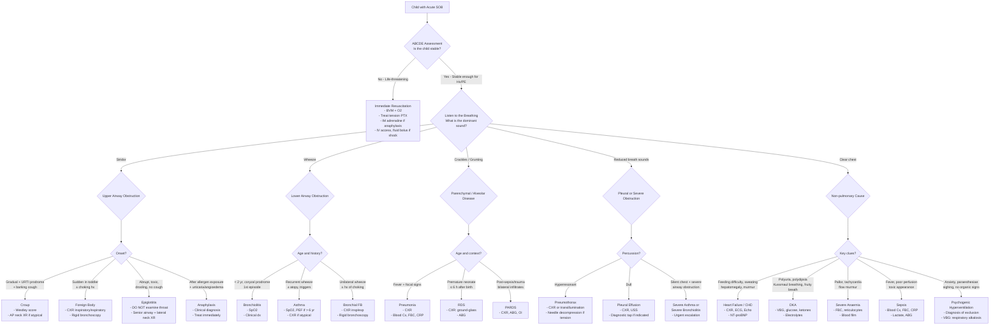

## Diagnostic Criteria, Algorithm, and Investigation Modalities for Acute SOB in Children

### Guiding Principle

Acute SOB in children is **not a diagnosis** — it is a presentation. There is no single "diagnostic criterion" for acute SOB itself. Instead, your job is to:

1. **Stabilise** (ABCDE)
2. **Localise** the problem anatomically (upper airway / lower airway / parenchyma / pleura / cardiac / systemic)
3. **Reach the specific diagnosis** using condition-specific criteria

What follows is a systematic approach to the diagnostic workup — the algorithm that moves you from "child in respiratory distress" to a specific, actionable diagnosis.

---

### Diagnostic Criteria for Key Conditions Causing Acute SOB

Because acute SOB encompasses many diagnoses, below are the condition-specific diagnostic criteria for the most important causes in paediatric practice. Understanding *why* each criterion exists is more important than memorising the list.

#### 1. Acute Bronchiolitis

- ***Diagnosis is CLINICAL*** [2] — no specific lab test or imaging is required in straightforward cases
- Criteria (consensus guidelines — AAP, NICE, Australasian):
  - Age < 2 years (typically < 12 months)
  - ***URTI prodrome (coryzal symptoms) followed by lower respiratory tract signs (tachypnoea, crackles ± wheeze)*** [2]
  - ***Worst on day 2–3*** [2]
- **Why clinical?** Because the condition is self-limiting and viral; investigations do not change management in most cases. CXR may show hyperinflation or patchy atelectasis but is non-specific and can lead to unnecessary antibiotics if over-interpreted.

<Callout title="When to Investigate in Bronchiolitis" type="idea">
***Pulse oximetry*** is the most important investigation — it guides O₂ therapy [2]. CXR and ABG are reserved for suspected respiratory failure or diagnostic uncertainty (e.g., is this pneumonia? Is there a cardiac cause?). NPA for RSV is useful for cohorting/infection control but does not change individual patient management.
</Callout>

#### 2. Asthma — Diagnosis in Children

***Diagnosis of asthma is predominantly clinical*** in children, supported by evidence of variable expiratory airflow limitation when age-appropriate testing is possible [1][12].

| Age Group | Diagnostic Approach | Rationale |
|---|---|---|
| **< 5 years** | ***Clinical diagnosis only***: recurrent episodes of wheeze, cough, SOB, esp with triggers (exercise, allergens, cold air, viral URTI), diurnal variation (worse at night/early morning), family/personal Hx of atopy, response to bronchodilator trial | Children < 5 yr cannot perform reliable spirometry; diagnosis is based on pattern recognition and therapeutic trial |
| **≥ 6 years** | Clinical features **PLUS** confirmed variable expiratory airflow limitation by spirometry or PEF [12] | Spirometry becomes reliable from ~6 years |

**Objective confirmation (≥ 6 years, per GINA 2024)** [12]:
- ***≥ 1 instance of ↓FEV₁/FVC ratio (≤ 90% in children)*** [12]
- ***Excessive variability in lung function:***
  - ***> 12% ↑FEV₁ after bronchodilator*** (10–15 min after 200–400 µg salbutamol) [12]
  - ***> 13% diurnal variability in twice-daily PEF over 2 weeks*** [12] (Note: 10% in adults, slightly higher threshold in children due to greater normal variability)
  - ***> 12% ↓FEV₁ after exercise*** [12]
- ***Airway hyper-reactivity (bronchoprovocation):*** ≥ 20% ↓FEV₁ post-methacholine; NOT routinely done — only if resting spirometry is normal and diagnosis uncertain [12]
- ***Airway inflammation markers:*** FENO > 35 ppb (in children) suggests eosinophilic airway inflammation and likelihood of ICS response; sputum eosinophils > 2% [12]

#### 3. Croup — Westley Croup Score

Croup is a ***clinical diagnosis*** — no lab test or imaging is required in typical cases. However, severity must be graded to guide management. The **Westley Croup Score** is the most widely used:

| Feature | 0 | 1 | 2 | 3 | 4 | 5 |
|---|---|---|---|---|---|---|
| Stridor | None | At rest, with stethoscope | At rest, without stethoscope | — | — | — |
| Retractions | None | Mild | Moderate | Severe | — | — |
| Air entry | Normal | Mildly decreased | Markedly decreased | — | — | — |
| Cyanosis | None | — | — | — | With agitation | At rest |
| Level of consciousness | Normal | — | — | — | — | Disoriented |

- **Mild**: 0–2; **Moderate**: 3–5; **Severe**: 6–11; **Impending respiratory failure**: ≥ 12
- **Why score?** Because management differs: mild → supportive; moderate → oral dexamethasone; severe → nebulised adrenaline + dexamethasone + close monitoring [2]

#### 4. Pneumonia

- ***No universally accepted paediatric diagnostic criteria*** — diagnosis is a combination of clinical + radiological + (sometimes) microbiological evidence
- **Clinical features suggestive of pneumonia** [2][12]:
  - Fever + cough + tachypnoea (***WHO: tachypnoea is the most useful clinical sign for pneumonia in children***)
  - Focal crackles, bronchial breathing, dullness to percussion
- **CXR**: consolidation (lobar or patchy) confirms the diagnosis radiologically, but is not always required in outpatient settings for uncomplicated community-acquired pneumonia in children

> ***WHO tachypnoea thresholds for pneumonia*** [2]: < 2 months: RR ≥ 60; 2–12 months: RR ≥ 50; 1–5 years: RR ≥ 40; > 5 years: RR ≥ 20

#### 5. Heart Failure from CHD

***Diagnosis is based on clinical, radiographic, echocardiographic, and laboratory findings*** [2][5][6].

| Modality | Key Findings |
|---|---|
| **Clinical** | ***Tachypnoea, tachycardia, hepatomegaly, gallop rhythm, poor feeding, FTT, diaphoresis*** [2] |
| **CXR** | ***Cardiomegaly (CTR ≥ 0.6 in infants, ≥ 0.5 in older children), pulmonary plethora (↑vascular markings = ↑pulmonary blood flow), pulmonary venous congestion*** [2] |
| **ECG** | Chamber enlargement/hypertrophy patterns; arrhythmias |
| **Echocardiography** | ***Definitive*** — identifies structural lesion, quantifies shunt, assesses ventricular function |
| **NT-proBNP / BNP** | Elevated in heart failure; useful for confirming diagnosis and monitoring |

***Ross Classification for paediatric heart failure severity*** [2]:

| Class | Description |
|---|---|
| I | Asymptomatic |
| II | Mild tachypnoea or diaphoresis with feeding (infants); dyspnoea on exertion (older children) |
| III | Marked tachypnoea or diaphoresis with feeding (infants); marked dyspnoea on exertion (older children); prolonged feeding times, growth failure |
| IV | Symptoms at rest: tachypnoea, retractions, grunting, diaphoresis |

#### 6. Respiratory Distress Syndrome (Neonates)

***Diagnosis: clinical + radiological*** [2]
- ***Clinical***: premature infant, respiratory distress (tachypnoea, grunting, retractions, cyanosis) presenting ***≤ 4–6 h after birth, worsening over first 48 h*** [2]
- ***CXR***: ***↓lung volume, ground-glass appearance with reticulo-granular pattern, air bronchogram, blurring of cardiac border*** [2]
- Must exclude differentials: neonatal pneumonia (consider cultures), TTN (less severe, resolves), pneumothorax, cyanotic CHD [2]

#### 7. Pneumothorax

- **Clinical**: sudden onset SOB ± pleuritic chest pain; unilateral ↓breath sounds, hyperresonance, ± tracheal deviation (tension)
- **CXR**: visible visceral pleural line with absent lung markings peripherally
- **In neonates**: transillumination of the chest with a fibre-optic light — a positive test (glow) on the affected side can rapidly diagnose pneumothorax at the bedside before CXR
- ***Tension pneumothorax is a CLINICAL diagnosis → do NOT wait for CXR → immediate needle decompression*** [4]

#### 8. DKA (Paediatric Criteria — ISPAD 2022/2024)

***Diagnostic criteria for DKA in children*** [3]:
- **Hyperglycaemia**: blood glucose > 11 mmol/L (or known diabetes)
- **Metabolic acidosis**: venous pH < 7.3 or bicarbonate < 15 mmol/L
- **Ketonaemia**: blood β-hydroxybutyrate ≥ 3 mmol/L (or ketonuria ≥ 2+)

| Severity | pH | Bicarbonate |
|---|---|---|
| ***Mild*** | ***7.2–7.3*** | ***10–15 mmol/L*** |
| ***Moderate*** | ***7.1–7.2*** | ***5–10 mmol/L*** |
| ***Severe*** | ***< 7.1*** | ***< 5 mmol/L*** |

**Why Kussmaul's breathing?** Metabolic acidosis (↑H⁺) stimulates central chemoreceptors in the medulla and peripheral chemoreceptors in carotid bodies → drives deep, rapid breathing to blow off CO₂ and partially compensate the acidosis [3].

---

### Diagnostic Algorithm

The following algorithm represents the systematic clinical approach to a child presenting with acute SOB, from initial stabilisation through to specific diagnosis.

---

### Investigation Modalities — Systematic Review

Below is every important investigation modality for acute SOB in children, with the **rationale** for each test, its **key findings**, and **age-specific interpretation pitfalls**.

#### A. Bedside / Immediate Investigations

##### 1. Pulse Oximetry (SpO₂)

- **What it measures**: Percentage of haemoglobin saturated with oxygen, detected by differential absorption of red vs. infrared light through a pulsatile vascular bed (usually finger/toe, earlobe in older children; wrap-around sensor in neonates)
- **Why it's first**: Non-invasive, instantaneous, and the single most important initial assessment of oxygenation — guides immediate O₂ therapy
- **Key values**:
  - Normal: > 95% (> 94% in neonates in first 24 h)
  - ***SpO₂ < 92% = significant hypoxaemia requiring O₂ supplementation*** [2]
  - ***SpO₂ < 90% = severe — escalate to high-flow O₂ ± respiratory support***
- **Pitfalls**:
  - **Motion artefact**: crying/moving child → false readings
  - **Poor perfusion**: cold extremities, shock → unreliable signal
  - **Methaemoglobinaemia / CO poisoning**: SpO₂ reads ~85% (metHb) or falsely normal (COHb) — always correlate with clinical picture and consider co-oximetry (ABG) if suspicion
  - **Anaemia**: SpO₂ can be normal even when O₂ content is dangerously low (because SpO₂ measures percentage saturation, not absolute O₂ content — a child with Hb 4 g/dL and SpO₂ 98% is still severely O₂-deprived at tissue level)

##### 2. Pre-Post Ductal SpO₂ Screening (Neonates)

- **When**: all neonates with cyanosis or unexplained respiratory distress in the first hours/days of life
- **Method**: Right hand (pre-ductal, receives blood from aorta before the PDA) vs. either foot (post-ductal)
- **Key finding**: ***Difference > 10% suggests R→L shunting through PDA*** — seen in PPHN and certain duct-dependent cyanotic CHD [5][6]
- **Why right hand specifically?** The right subclavian artery arises from the brachiocephalic trunk, which is proximal to the PDA insertion on the aortic arch. Left hand is unreliable because the left subclavian may arise at or near the level of the PDA.

##### 3. Peak Expiratory Flow (PEF)

- **When**: children ≥ 6 years with suspected asthma exacerbation (younger children cannot perform reliably)
- **What it measures**: Maximum flow rate during a forced expiration — reflects large airway calibre
- **Key interpretation in acute asthma** [12]:
  - > 75% of best/predicted → mild exacerbation
  - 50–75% → moderate
  - ***33–50% → severe*** [4]
  - ***< 33% → life-threatening*** [4]
- **Pitfall**: Effort-dependent — an exhausted, severely dyspnoeic child may give a falsely low reading due to inability to blow, not just airway obstruction. Never withhold treatment to obtain PEF.

##### 4. Blood Glucose (Bedside Capillary)

- **When**: any child with acute SOB + altered consciousness, Kussmaul's breathing, or known diabetes
- **Why**: to rapidly diagnose or exclude DKA (blood glucose > 11 mmol/L) [3]; also, hypoglycaemia can present with tachypnoea (especially in neonates with metabolic disease)
- **Pitfall**: In known T1DM, DKA can occasionally present with near-normal glucose ("euglycaemic DKA") — always check ketones and VBG

---

#### B. Blood Tests

##### 5. Arterial / Venous Blood Gas (ABG / VBG)

This is arguably the single most informative blood test in acute SOB. It tells you about oxygenation, ventilation, and acid-base status simultaneously.

| Parameter | What It Tells You | Key Paediatric Values |
|---|---|---|
| **pH** | Acidosis vs. alkalosis | Normal: 7.35–7.45 |
| **pCO₂** | Ventilation (respiratory component) | Normal: 35–45 mmHg. ↑pCO₂ = hypoventilation (Type 2 RF); ↓pCO₂ = hyperventilation (compensation or psychogenic) |
| **pO₂** | Oxygenation (only on ABG) | Normal: 80–100 mmHg. ***pO₂ < 60 mmHg = respiratory failure*** [4] |
| **HCO₃⁻** | Metabolic component | Normal: 22–26 mmol/L. ↓HCO₃⁻ = metabolic acidosis (DKA, sepsis, IEM) |
| **Base excess** | Overall acid-base balance | Normal: -2 to +2. More negative = more acidotic |
| **Lactate** | Tissue perfusion | Normal < 2 mmol/L. ↑lactate = poor tissue perfusion (shock, sepsis) |

**Type 1 respiratory failure** (hypoxaemic): ↓pO₂ < 60 mmHg + normal/↓pCO₂ — seen in pneumonia, bronchiolitis, ARDS (V/Q mismatch and shunt) [4]

**Type 2 respiratory failure** (hypercapnic): ↓pO₂ < 60 mmHg + ↑pCO₂ > 50 mmHg — seen in severe asthma/bronchiolitis with exhaustion, neuromuscular disease, upper airway obstruction [4]

**Metabolic acidosis with respiratory compensation**: ↓pH, ↓HCO₃⁻, ↓pCO₂ (compensatory hyperventilation) — seen in DKA, sepsis, IEM [3]

**Respiratory alkalosis**: ↑pH, ↓pCO₂ — seen in psychogenic hyperventilation, anxiety/panic [8]

> **VBG vs. ABG**: In paediatrics, VBG is often used first because it is less painful and provides adequate information on pH, pCO₂ (usually ~5–7 mmHg higher than arterial), HCO₃⁻, and lactate. ABG is reserved for when accurate pO₂ is needed or when SpO₂ is unreliable.

##### 6. Full Blood Count (FBC / CBC)

| Parameter | Relevance |
|---|---|
| **Hb** | ***Severe anaemia (Hb < 7 g/dL) can cause acute SOB via ↓O₂ carrying capacity*** → compensatory tachycardia and tachypnoea |
| **WBC / differential** | ↑WBC with neutrophilia → bacterial infection (pneumonia, sepsis); ↑lymphocytes → viral infection, pertussis; ↑eosinophils → allergic/atopic process (asthma) |
| **Platelets** | ↓ in DIC (severe sepsis), ↑ as acute-phase reactant |

##### 7. C-reactive Protein (CRP) and Procalcitonin (PCT)

- **CRP**: acute-phase protein synthesised by liver in response to IL-6. ↑ in bacterial infection, but also in viral infection (less markedly). Useful to support diagnosis of bacterial pneumonia and monitor response to antibiotics.
- **PCT**: more specific for bacterial infection than CRP; ↑ markedly in bacterial sepsis. Increasingly used in paediatric emergency departments. Levels > 0.5 ng/mL suggest bacterial infection; > 2 ng/mL suggest severe sepsis.

##### 8. Blood Cultures

- **When**: any child with suspected bacterial infection (pneumonia, sepsis), especially if febrile and unwell
- **Why**: identifies causative organism and guides targeted antibiotic therapy
- **Key point**: obtain BEFORE starting antibiotics (but never delay antibiotics to wait for cultures in a critically ill child)

##### 9. Cardiac Biomarkers

| Marker | When to Order | Interpretation |
|---|---|---|
| **NT-proBNP / BNP** | Suspected heart failure | ***Elevated in heart failure*** [5][6][11]; helps differentiate cardiac from respiratory cause of SOB. Normal NT-proBNP essentially excludes significant HF. Age-specific cut-offs apply (neonates have physiologically high levels in first weeks). |
| **Troponin** | Suspected myocarditis, Kawasaki with coronary involvement | ↑ indicates myocardial injury |

##### 10. Blood Glucose + Ketones + Electrolytes

- **When**: suspected DKA, or any child with Kussmaul's breathing and clear chest [3]
- **Key findings in DKA**: glucose > 11 mmol/L, β-hydroxybutyrate ≥ 3 mmol/L, ↓pH, ↓HCO₃⁻, ↓Na⁺ (pseudohyponatraemia from hyperglycaemia), K⁺ may be normal/↑ on admission despite total body K⁺ deficit (because acidosis drives K⁺ out of cells) [3]

---

#### C. Imaging

##### 11. Chest X-Ray (CXR)

***The most important imaging study in paediatric acute SOB.*** However, it is NOT always necessary — bronchiolitis and croup are clinical diagnoses. CXR is indicated when:
- Diagnosis is uncertain
- There is concern for pneumonia, heart failure, pneumothorax, foreign body, or structural abnormality
- The child is not improving as expected

| Condition | CXR Findings | Why These Findings Occur |
|---|---|---|
| ***Bronchiolitis*** | Hyperinflation (flattened diaphragms, > 8 posterior rib spaces visible), peribronchial thickening, patchy atelectasis | Air trapping distal to partially obstructed bronchioles (ball-valve mechanism); atelectasis from complete mucus plugging |
| ***Asthma*** | ***Normal or hyperinflated ± lobar collapse*** (secondary to mucus plugging) [12] | Same ball-valve mechanism as bronchiolitis but in larger airways |
| ***Pneumonia*** | ***Consolidation*** (lobar = homogeneous opacification; bronchopneumonia = patchy bilateral opacities), air bronchograms | Alveoli filled with inflammatory exudate are radiopaque; air in surrounding bronchi remains radiolucent → air bronchograms |
| ***RDS (neonates)*** | ***↓lung volume, ground-glass / reticulo-granular pattern, air bronchograms, blurring of cardiac border*** [2] | Diffuse atelectasis from surfactant deficiency; hyaline membranes in alveoli |
| ***Heart failure / CHD*** | ***Cardiomegaly (CTR ≥ 0.6 in infants, ≥ 0.5 in children)***, ***pulmonary plethora (↑vascular markings in L→R shunt)***, ***pulmonary venous congestion (hazy venous markings, Kerley B lines, perihilar oedema)*** [2][5][6] | ↑pulmonary blood flow from L→R shunt → engorged pulmonary vessels; ↑pulmonary venous pressure → interstitial/alveolar oedema |
| ***Pneumothorax*** | Visible pleural line with absent lung markings beyond it; mediastinal shift away from affected side if tension | Air in pleural space separates visceral from parietal pleura |
| ***Pleural effusion*** | Blunted costophrenic angle, meniscus sign, homogeneous opacification of lower zone | Fluid in dependent portion of pleural space |
| ***Foreign body*** | Unilateral hyperinflation (expiratory film more sensitive), mediastinal shift to contralateral side on expiration | Ball-valve obstruction → air enters on inspiration but cannot exit on expiration → trapped air on affected side; mediastinum shifts toward the less-expanded (normal) side on expiration |
| ***Croup*** | ***Steeple sign*** on AP view: symmetrical subglottic narrowing | Mucosal oedema narrows the subglottic lumen below the vocal cords |
| ***Epiglottitis*** | ***Thumb sign*** on lateral neck view: swollen, rounded epiglottis (normally thin like a little finger) | Bacterial infection causes supraglottic swelling |

<Callout title="CXR Interpretation Pitfalls in Paediatrics" type="error">

1. ***Thymic shadow in infants/young children can simulate cardiomegaly*** [2] — the thymus sits in the anterior mediastinum and is large in infants. The "sail sign" (triangular thymic shadow) should not be confused with cardiac enlargement. Lateral view or USS can differentiate.
2. **CTR thresholds differ by age**: ≥ 0.6 in infants (because the heart is proportionally larger), ≥ 0.5 in older children and adults [2].
3. **AP films** (standard in young children who cannot stand) magnify the heart and widen the mediastinum — always note the projection.
4. **Expiratory films** can mimic cardiomegaly and pulmonary congestion because the lungs appear smaller and whiter — ensure good inspiratory effort (≥ 8 posterior ribs visible).
</Callout>

##### 12. Lateral Neck X-Ray (Soft Tissue Neck)

- **When**: suspected epiglottitis (if stable enough — airway management takes priority), retropharyngeal abscess, or to clarify upper airway anatomy
- **Key findings**:
  - ***Epiglottitis: "thumb sign"*** — swollen, rounded epiglottis
  - **Retropharyngeal abscess**: widened prevertebral soft tissue (> 7 mm at C2 or > 14 mm at C6 in children)
  - **Croup**: subglottic narrowing (better seen on AP as steeple sign)

<Callout title="NEVER Examine the Throat in Suspected Epiglottitis" type="error">
Attempting to visualise the epiglottis with a tongue depressor can trigger complete airway obstruction and cardiac arrest from vagal stimulation. If epiglottitis is suspected, keep the child calm, do NOT lie them down, call for senior anaesthetic/ENT support, and take a lateral neck XR only if airway is stable.
</Callout>

##### 13. Echocardiography

- **When**: suspected cardiac cause (murmur, hepatomegaly, cardiomegaly on CXR, FTT in infant, failed hyperoxia test)
- ***Echocardiography is the definitive investigation for congenital heart disease*** [5][6]
- **Key assessments**:
  - **Structural anatomy**: identifies VSD, ASD, AVSD, PDA, coarctation, TOF, TGA, etc.
  - **Shunt quantification**: Qp:Qs ratio (pulmonary to systemic flow ratio; > 1.5:1 indicates haemodynamically significant L→R shunt)
  - **Ventricular function**: ejection fraction (normal > 55%), fractional shortening
  - **Pulmonary artery pressure**: estimated from tricuspid regurgitation jet velocity (modified Bernoulli equation: PAP ≈ 4v² + RAP)
  - **Pericardial effusion / tamponade**: fluid around the heart, diastolic collapse of RA/RV

##### 14. CT Chest

- **When**: complex pneumonia with suspected empyema/abscess, suspected mediastinal mass, congenital lung malformation, suspected PE (CTPA) in adolescents
- Not first-line due to radiation exposure — always weigh risk vs. benefit in children
- **CTPA (CT pulmonary angiography)**: gold standard for PE diagnosis in adolescents with high clinical suspicion [9]

##### 15. Chest Ultrasound (Point-of-Care USS)

- Increasingly used in paediatric emergency medicine
- **Pleural effusion**: very sensitive (more so than CXR); can guide thoracocentesis
- **Pneumothorax**: absent lung sliding, absent comet-tail artefacts
- **Consolidation**: tissue-like appearance of lung ("hepatisation")
- **Pericardial effusion**: subcostal/parasternal view
- **Diaphragmatic excursion**: assess for diaphragmatic paralysis

---

#### D. Specific Investigations

##### 16. Nasopharyngeal Aspirate (NPA) / Viral Respiratory Panel

- **When**: bronchiolitis (for infection control/cohorting), suspected pertussis, or unusual/severe respiratory infection
- **Method**: NPA or nasal/throat swab → viral PCR (RSV, influenza, parainfluenza, adenovirus, HMPV, rhinovirus) and/or pertussis PCR
- **Key point**: does not usually change individual management in bronchiolitis but is essential for hospital infection control in HK (cohorting RSV-positive patients)

##### 17. Hyperoxia Test (Nitrogen Washout Test) — Neonates

- ***Used to differentiate cyanotic CHD from respiratory disease in a cyanotic neonate*** [5][6]
- **Method**: Place neonate in 100% FiO₂ for 10 minutes → measure PaO₂ on ABG
- **Interpretation**:
  - ***PaO₂ > 150 mmHg (> 20 kPa) → likely respiratory cause*** (the lung disease allows O₂ to eventually reach alveoli and correct the hypoxaemia)
  - ***PaO₂ < 100 mmHg (< 13 kPa) → strongly suggests cyanotic CHD*** (fixed R→L shunt means deoxygenated blood bypasses the lungs regardless of FiO₂)
  - ***PaO₂ 100–150 mmHg → equivocal → proceed to echocardiography***
- **Why it works**: In lung disease, V/Q mismatch and shunt can often be overcome by flooding the alveoli with 100% O₂. In cyanotic CHD, the shunt is anatomical (intracardiac) — O₂ never reaches the shunted blood.

##### 18. ECG (12-Lead Electrocardiogram)

- **When**: suspected cardiac cause, arrhythmia (SVT), myocarditis, hyperkalaemia (in DKA), PE
- **Age-specific paediatric ECG normals** differ markedly from adults:
  - Neonates: physiological right axis deviation (right ventricular dominance), T-wave inversion in V1–V3 is normal (because RV is dominant at birth)
  - Sinus tachycardia thresholds vary by age (HR 160 may be normal in a febrile neonate but abnormal in a teenager)
  - ***SVT: narrow-complex tachycardia, HR > 220 bpm in infants / > 180 bpm in children, absent P waves or retrograde P waves*** [5]
- **Key findings by condition**:

| Condition | ECG Findings |
|---|---|
| SVT | Narrow QRS, HR > 220 (infants), absent/retrograde P waves |
| Myocarditis | Low-voltage QRS, ST-T changes, arrhythmias |
| Hyperkalaemia (DKA) | Peaked T waves → widened QRS → sine wave |
| PE (adolescent) | Sinus tachycardia, S1Q3T3, RV strain, RBBB [9] |
| LVH (large L→R shunt) | Tall R in V5–V6, deep S in V1, left axis |
| RVH (RV pressure overload) | Tall R in V1, right axis, ± RV strain |

##### 19. Spirometry / Lung Function Tests

- **When**: children ≥ 6 years with suspected asthma (not in acute severe attack — do after stabilisation) [12]
- ***FEV₁/FVC ≤ 90% (in children) confirms obstructive airflow limitation*** [12]
- ***Bronchodilator reversibility: > 12% ↑FEV₁ after SABA confirms variable airflow obstruction (diagnostic of asthma)*** [12]
- **Flow-volume loop**: "scooped-out" concave shape in lower airway obstruction (asthma, bronchiolitis); plateau in expiration or inspiration suggests fixed upper airway obstruction [12]

##### 20. Rigid Bronchoscopy

- ***Diagnostic AND therapeutic for suspected foreign body aspiration*** [2]
- **When**: witnessed choking episode, unilateral hyperinflation on CXR, unexplained persistent wheeze/stridor unresponsive to treatment
- Performed under general anaesthesia — allows direct visualisation and retrieval of the foreign body

##### 21. Flexible Nasopharyngolaryngoscopy

- **When**: recurrent/persistent stridor to assess for laryngomalacia, subglottic stenosis, vocal cord paralysis
- Can be performed awake at bedside in infants — a thin flexible scope is passed through the nose to the level of the larynx

---

#### E. Summary Table — Investigations by Suspected Diagnosis

| Suspected Diagnosis | First-Line Investigations | Second-Line / Confirmatory |
|---|---|---|
| ***Bronchiolitis*** | ***SpO₂, clinical assessment*** [2] | NPA for RSV (cohorting); CXR/ABG only if respiratory failure or diagnostic uncertainty |
| ***Asthma*** | SpO₂, PEF (if ≥ 6 yr), clinical assessment [12] | Spirometry with bronchodilator reversibility (when stable); FENO; allergic status (IgE, skin prick) |
| ***Croup*** | Clinical + Westley score; SpO₂ | AP neck XR (steeple sign) if atypical or not responding |
| ***Epiglottitis*** | Clinical suspicion → secure airway first | Lateral neck XR (thumb sign) if stable; blood culture after airway secured |
| ***Foreign body*** | CXR inspiratory + expiratory | ***Rigid bronchoscopy (diagnostic + therapeutic)*** |
| ***Pneumonia*** | CXR, SpO₂, FBC, CRP, blood culture | NPA viral panel; sputum (older children); PCT if uncertain bacterial vs. viral |
| ***RDS (neonate)*** | CXR, ABG, SpO₂ | Blood culture, ET aspirate culture (to exclude neonatal pneumonia) [2] |
| ***Heart failure / CHD*** | ***CXR, ECG, SpO₂, pre-post ductal SpO₂ (neonates)*** | ***Echocardiography (definitive)***, NT-proBNP [2][5][6] |
| ***Cyanotic CHD (neonate)*** | Pre-post ductal SpO₂, ***hyperoxia test*** | ***Echocardiography*** [5][6] |
| ***DKA*** | Capillary glucose, VBG, blood ketones, electrolytes [3] | Urine ketones, osmolality, serial VBG monitoring |
| ***Pneumothorax*** | CXR (transillumination in neonates) [4] | CT if complex; USS |
| ***Severe anaemia*** | FBC, reticulocyte count, blood film | Iron studies, Hb electrophoresis (thalassaemia screen in HK) |
| ***Sepsis*** | FBC, CRP, blood culture, VBG + lactate | PCT, urine culture, LP (neonates), CXR |
| ***Psychogenic hyperventilation*** | VBG (respiratory alkalosis: ↑pH, ↓pCO₂), SpO₂ (normal) | ***Diagnosis of exclusion*** — must rule out all organic causes first [8] |
| ***PE (adolescent)*** | D-dimer (high NPV), CXR, ECG, SpO₂ | ***CTPA (gold standard)***; LL duplex USS for DVT [9] |

---

<Callout title="High Yield Summary — Diagnosis of Acute SOB in Children">

1. **Acute SOB is a presentation, not a diagnosis** — the diagnostic process is about reaching the specific underlying cause.
2. ***Bronchiolitis, croup, and asthma are CLINICAL diagnoses*** — investigations serve to assess severity (SpO₂) and exclude complications, not to "prove" the diagnosis.
3. ***CXR is the single most important imaging study*** — but is NOT always necessary. It is essential when diagnosis is uncertain, pneumonia/HF/pneumothorax suspected, or the child is not improving.
4. ***Paediatric CXR pitfalls***: thymic shadow mimics cardiomegaly; CTR threshold is ≥ 0.6 in infants (not 0.5); AP projection magnifies the heart; expiratory film mimics congestion.
5. ***VBG is often sufficient*** in paediatrics — ABG reserved for when accurate PaO₂ is needed.
6. ***Hyperoxia test***: PaO₂ < 100 mmHg on 100% O₂ = cyanotic CHD until proven otherwise [5][6].
7. ***Echocardiography is the definitive test for CHD*** — always obtained when cardiac cause suspected [5][6].
8. ***In DKA***: diagnostic triad = glucose > 11, pH < 7.3 or HCO₃⁻ < 15, plus ketonaemia ≥ 3 mmol/L [3].
9. ***Tension pneumothorax is a CLINICAL diagnosis*** — treat first (needle decompression), image later [4].
10. ***PEF is effort-dependent*** — never delay treatment to obtain a reading in a severely dyspnoeic child.
11. ***Physical examination findings*** to assess on every child with acute SOB [1]: ***temperature, vital signs, respiratory distress signs (respiratory rate, retraction/insucking/use of accessory muscles, cyanosis, SpO₂), chest exam (deformity, percussion, auscultation for wheeze/crackles/rhonchi), associated findings (skin rash, eczema, tonsils, lymph nodes, rhinorrhoea)***.

</Callout>

---

<ActiveRecallQuiz
  title="Active Recall - Diagnosis of Acute SOB in Children"
  items={[
    {
      question: "A 3-week-old cyanotic neonate is placed on 100% FiO2 for 10 minutes. ABG shows PaO2 of 55 mmHg. What does this result indicate and what is the next investigation?",
      markscheme: "PaO2 less than 100 mmHg on 100% O2 strongly suggests cyanotic congenital heart disease with a fixed right-to-left shunt (failed hyperoxia test). The next investigation is echocardiography to identify the structural cardiac lesion. The low PaO2 occurs because deoxygenated blood bypasses the lungs through an intracardiac shunt regardless of the FiO2 delivered."
    },
    {
      question: "What cardiothoracic ratio on CXR defines cardiomegaly in infants vs. older children, and why does the threshold differ?",
      markscheme: "CTR at or above 0.6 in infants and at or above 0.5 in older children and adults. The threshold is higher in infants because the heart is proportionally larger relative to the thorax. Additionally, the thymic shadow in infants may simulate cardiomegaly, which is a common interpretation pitfall."
    },
    {
      question: "Name three investigations that should be ordered immediately in a child presenting with Kussmaul breathing, fruity-smelling breath, and a clear chest on auscultation. Explain the expected findings.",
      markscheme: "1. Capillary blood glucose: expected to be above 11 mmol/L (hyperglycaemia). 2. Venous blood gas: expected to show metabolic acidosis with pH below 7.3 and low bicarbonate. 3. Blood ketones (beta-hydroxybutyrate): expected at or above 3 mmol/L. These findings confirm DKA. Electrolytes should also be checked for hyperkalaemia/hypokalaemia."
    },
    {
      question: "A 7-year-old with recurrent episodic wheeze and atopic eczema has spirometry showing FEV1/FVC of 85 percent. After 400 micrograms of salbutamol, FEV1 increases by 15 percent. Does this confirm asthma? Explain the criteria.",
      markscheme: "Yes. In children, FEV1/FVC at or below 90 percent is one criterion for obstructive airflow limitation (85 percent meets this). Additionally, a greater than 12 percent increase in FEV1 after bronchodilator confirms significant bronchodilator reversibility, which demonstrates variable expiratory airflow limitation diagnostic of asthma per GINA guidelines."
    },
    {
      question: "Why is an expiratory CXR more useful than an inspiratory CXR in diagnosing a bronchial foreign body, and what findings would you expect?",
      markscheme: "A bronchial foreign body acts as a ball-valve: air enters past the FB during inspiration but cannot exit during expiration. On an inspiratory film, both lungs may appear similar. On an expiratory film, the affected side remains hyperinflated (air trapping) while the normal side deflates. There will also be mediastinal shift toward the normal (deflated) side on expiration."
    },
    {
      question: "List three CXR features you would look for when evaluating suspected paediatric heart failure, and explain the pathophysiological basis of each.",
      markscheme: "1. Cardiomegaly (CTR at or above 0.6 in infants): reflects chamber dilatation from volume overload. 2. Pulmonary plethora (increased vascular markings): indicates increased pulmonary blood flow from a left-to-right shunt. 3. Pulmonary venous congestion (hazy venous markings, Kerley B lines, perihilar oedema): indicates elevated pulmonary venous pressure from left heart failure causing interstitial and alveolar oedema."
    }
  ]}
/>

---

## References

[1] Lecture slides: GC 141. A child with cough acute and chronic cough in children.pdf (p13)
[2] Senior notes: Adrian Lui Pediatrics.pdf (Bronchiolitis p163, Heart Failure p197–198, RDS p32, Stridor p155, Asthma p170–172)
[3] Senior notes: Ryan Ho Endocrine.pdf (DKA p91)
[4] Senior notes: Ryan Ho Critical Care.pdf (Approach to Acute SOB p6, Pneumothorax/APO/Asthma p13–14)
[5] Lecture slides: GC 147. Heart failure and cyanosis in children acyanotic and cyanotic congenital heart disease - Part 1.pdf
[6] Lecture slides: GC 147. Heart failure and cyanosis in children acyanotic and cyanotic congenital heart disease - Part 2.pdf
[8] Senior notes: Ryan Ho Psychiatry.pdf (Panic Disorder p178–179)
[9] Senior notes: Ryan Ho Respiratory.pdf (PE initial investigations and diagnosis p134–135)
[11] Senior notes: Ryan Ho Cardiology.pdf (ADHF p73, Dyspnoea Ix p60)
[12] Senior notes: Ryan Ho Respiratory.pdf (Asthma diagnosis p98)
