# Acute Shortness of Breath in Children

## Definition

Dyspnoea (from Greek: *dys-* = difficult, *pnoia* = breathing) is the subjective awareness of difficulty breathing or an uncomfortable sensation of breathing. In paediatrics, the term is used broadly to encompass respiratory distress — an objective state of increased work of breathing manifested by signs such as tachypnoea, retractions, grunting, nasal flaring, and accessory muscle use.

**Acute shortness of breath (SOB)** refers to the sudden or rapid onset (minutes to hours to days) of respiratory distress or difficulty breathing in a child. Because infants and young children cannot verbalise "I'm breathless," caregivers typically report rapid breathing, noisy breathing, feeding difficulty, colour change, or general irritability — all surrogate markers for acute SOB.

> The key concept: SOB occurs when ventilatory demand exceeds the system's ability to deliver adequate gas exchange, OR when the work of breathing is perceived as excessive. In children, the respiratory system is both anatomically smaller and physiologically less resilient than in adults, making them more vulnerable to acute decompensation.

---

## Epidemiology

- **Acute respiratory complaints are the single most common reason for paediatric emergency department visits worldwide** (up to 20–30% of all presentations) [1][2].
- In Hong Kong, respiratory diseases including pneumonia, bronchiolitis, and asthma exacerbations account for the majority of paediatric medical admissions, particularly during winter months (November–March, RSV and influenza season) [1][2].
- ***Asthma*** is the most common chronic respiratory disease in Hong Kong children with a prevalence of ~8–10% (decreasing trend in recent surveys) [1][2].
- ***Bronchiolitis*** is the most common lower respiratory tract infection (LRTI) in infants < 2 years, with peak incidence at 1–9 months [2].
- Pneumonia remains a leading cause of childhood mortality globally; in HK it is a significant contributor to paediatric ICU admissions.
- ***Croup*** peaks at ages 6 months to 3 years, typically autumn/winter.
- Foreign body aspiration: peak age 1–3 years (toddlers who put everything in their mouths).

### Age-Specific Patterns (High Yield)

| Age Group | Common Aetiologies of Acute SOB |
|---|---|
| Neonate (< 28 days) | ***Respiratory distress syndrome (RDS)***, transient tachypnoea of newborn (TTN), neonatal pneumonia, congenital heart disease (CHD), pneumothorax, congenital diaphragmatic hernia, persistent pulmonary hypertension of newborn (PPHN), meconium aspiration syndrome |
| Infant (1–12 months) | ***Bronchiolitis***, pneumonia, pertussis, heart failure from CHD (large L→R shunt presenting ~2–3 months), foreign body |
| Toddler (1–3 years) | ***Croup***, asthma/viral-induced wheeze, foreign body aspiration, pneumonia |
| Pre-school (3–5 years) | ***Asthma***, pneumonia, croup (less common) |
| School-age / Adolescent | ***Asthma***, pneumonia, pneumothorax (esp. tall thin males), psychogenic hyperventilation, diabetic ketoacidosis (DKA), pulmonary embolism (rare but consider in adolescents with risk factors) |

---

## Risk Factors

### Host Factors
- **Prematurity**: lung immaturity (surfactant deficiency), chronic lung disease of prematurity (bronchopulmonary dysplasia, BPD), increased susceptibility to RSV bronchiolitis
- **Congenital heart disease**: predisposes to heart failure and pulmonary overcirculation
- **Atopy / family history of asthma**: strongest risk factor for childhood asthma
- **Immunodeficiency** (primary or acquired): increased risk of severe/unusual infections
- **Neuromuscular disease**: spinal muscular atrophy, Duchenne muscular dystrophy → respiratory muscle weakness
- **Obesity**: increasingly relevant in HK children; affects lung mechanics and predisposes to asthma and obstructive sleep apnoea [3]
- **Male sex**: higher incidence of asthma and RDS in childhood [1][2]

### Environmental Factors
- **Viral exposures**: RSV, rhinovirus, influenza, parainfluenza — seasonal peaks
- **Tobacco smoke exposure** (second-hand/third-hand): major trigger for asthma, increases risk of LRTI
- **Air pollution**: Hong Kong's air quality is a significant contributor to respiratory morbidity [1]
- ***Indoor allergens***: house dust mite (HDM) faecal pellets (extremely important in HK due to humid subtropical climate), pet dander, cockroach allergens [1][2]
- **Overcrowding / daycare attendance**: facilitates viral transmission
- **Non-breastfeeding**: less passive immunity, higher LRTI risk

---

## Anatomy and Physiology of the Paediatric Respiratory System

Understanding **why** children get into trouble faster than adults requires knowledge of paediatric respiratory anatomy and physiology.

### Anatomical Differences (Child vs. Adult)

| Feature | Paediatric Implication |
|---|---|
| **Large head, short neck, large tongue, high anterior larynx (C3–4 vs. C5–6 in adults)** | Upper airway obstruction is more likely; tongue easily obstructs airway in unconscious child |
| **Narrow subglottic area** (smallest part of paediatric airway is the cricoid ring, which is round and complete) | Even 1 mm of mucosal oedema → dramatic ↑ in resistance. By Poiseuille's Law, resistance ∝ 1/r⁴ — so halving the radius increases resistance **16-fold**. This is why croup (subglottic oedema) causes stridor in children but not in adults |
| **Smaller airways** | More easily obstructed by mucus, oedema, or foreign bodies |
| **Fewer alveoli** (newborn ~50 million vs. adult ~300 million) | Less gas exchange surface → less reserve |
| **Compliant chest wall (cartilaginous ribs)** | Chest wall retracts inward instead of expanding during increased respiratory effort → visible subcostal/intercostal recessions; also leads to paradoxical breathing in infants |
| **Horizontal ribs** | Ribs cannot be "bucket-handle" elevated to increase tidal volume → infants are diaphragm-dependent |
| **Higher metabolic rate** | Greater O₂ consumption per kg (6–8 mL/kg/min in infants vs. 3–4 mL/kg/min in adults) → faster desaturation during apnoea |
| **Lower functional residual capacity (FRC) relative to closing capacity** | Airway closure occurs during tidal breathing → prone to atelectasis and V/Q mismatch |

<Callout title="Poiseuille's Law — The Most Important Concept in Paediatric Airways" type="idea">
Resistance = 8ηL / πr⁴. When the airway radius is already small (as in an infant), even a tiny reduction (e.g., 1 mm oedema in croup or bronchiolitis) causes a disproportionately massive increase in airway resistance. This is why infants decompensate so rapidly with airway inflammation.
</Callout>

### Physiological Differences

- **Obligate nose breathers** (< 3 months): nasal obstruction (e.g., choanal atresia, upper respiratory congestion) can cause significant distress
- **Higher baseline respiratory rate**: normal RR varies by age (see table below) — tachypnoea must be interpreted in context of age
- **Lower respiratory reserve**: cannot sustain high work of breathing for prolonged periods → fatigue → apnoea → respiratory arrest (rather than the adult pattern of gradual failure)
- **Immature respiratory centre** (especially in premature neonates): prone to central apnoea

### Normal Respiratory and Heart Rates by Age

| Age | Normal RR (breaths/min) | Normal HR (bpm) |
|---|---|---|
| Neonate | 30–60 | 100–160 |
| Infant (< 1 yr) | 25–50 | 100–160 |
| 1–2 years | 20–40 | 90–150 |
| 3–5 years | 20–30 | 80–140 |
| 6–12 years | 15–25 | 70–120 |
| > 12 years | 12–20 | 60–100 |

<Callout title="Common Exam Error" type="error">
Students often apply adult thresholds for tachypnoea (RR > 20) to children. A 6-month-old with RR 50 may still be within the upper normal range; conversely, a "normal" RR of 20 in a neonate may actually represent bradypnoea and impending respiratory failure. Always use age-appropriate reference ranges.
</Callout>

---

## Aetiology (Focused on Hong Kong Paediatric Practice)

The causes of acute SOB in children can be systematically categorised by anatomical location and mechanism. Below is a comprehensive framework.

### A. Upper Airway Obstruction

Upper airway pathology typically presents with ***inspiratory stridor*** (a high-pitched sound during inspiration), because during inspiration, negative intraluminal pressure collapses the extrathoracic airway. The noise is generated by turbulent airflow through a narrowed segment.

| Cause | Key Features | Pathophysiology |
|---|---|---|
| ***Croup (laryngotracheobronchitis)*** | Age 6 mo–3 yr, barking cough, hoarse voice, inspiratory stridor, preceded by URTI. Parainfluenza virus (types 1 & 3) most common | Subglottic mucosal oedema → narrowing of the already narrow paediatric subglottic airway → turbulent airflow → stridor |
| ***Epiglottitis*** | Rare since Hib vaccination; sudden onset, toxic-appearing, drooling, sitting in tripod position, muffled voice, no barking cough | Bacterial infection (H. influenzae type b, now more often Streptococcal) → supraglottic swelling → airway obstruction. Emergency! |
| ***Foreign body aspiration*** | Sudden onset choking/coughing in toddler, unilateral decreased air entry or wheeze, may present with stridor if lodged in larynx/trachea | Physical obstruction ± ball-valve mechanism → air trapping distally if bronchial, or complete obstruction if laryngeal/tracheal |
| ***Retropharyngeal / peritonsillar abscess*** | Fever, neck stiffness/torticollis, drooling, muffled voice, unilateral tonsillar bulging (peritonsillar) | Deep neck space infection → mass effect compressing airway |
| ***Anaphylaxis / angioedema*** | Rapid onset after allergen exposure, urticaria, wheeze, stridor, hypotension | IgE-mediated mast cell degranulation → histamine release → laryngeal oedema + bronchospasm + vasodilation |
| ***Laryngomalacia*** | Most common cause of chronic stridor in infancy (usually presents < 2 weeks of life), worse with feeding/crying/supine, generally benign | Omega-shaped, floppy epiglottis collapses into airway during inspiration — more of a chronic condition but can cause acute distress during intercurrent illness |

### B. Lower Airway Obstruction

Lower airway pathology typically presents with ***expiratory wheeze*** (polyphonic), because during expiration, positive intrathoracic pressure compresses the intrathoracic airways, exacerbating pre-existing narrowing.

| Cause | Key Features | Pathophysiology |
|---|---|---|
| ***Acute asthma exacerbation*** | Commonest chronic respiratory disease [1][2]. Recurrent episodes of wheeze, cough, SOB, chest tightness. Often with atopic history, triggers include viral URTI, exercise, allergens, cold air | Chronic airway inflammation (eosinophilic, Th2-driven) → bronchial hyperreactivity → acute bronchospasm + mucosal oedema + mucus hypersecretion → airflow obstruction (reversible) |
| ***Acute bronchiolitis*** | Infants < 2 yr, peak 1–9 mo, winter, coryzal prodrome then SOB, fine inspiratory crackles ± wheeze. ***RSV is the most common cause (50–80%)*** [2] | Viral infection of bronchiolar epithelium → necrosis of ciliated cells → oedema + mucus plugging of small airways → air trapping + atelectasis → V/Q mismatch |
| ***Viral-induced wheeze*** | Episodic wheeze triggered only by viral infections in pre-school children, no interval symptoms, no atopy | Viral-triggered bronchial inflammation and oedema in small airways (without the chronic eosinophilic inflammation of true asthma) |
| ***Foreign body (bronchial)*** | Unilateral wheeze, hyperinflation on one side, history of choking episode | Ball-valve obstruction → air trapping → hyperinflation distal to the FB |

### C. Alveolar / Parenchymal Disease

| Cause | Key Features | Pathophysiology |
|---|---|---|
| ***Pneumonia*** | Fever, cough (productive in older children), tachypnoea, focal crackles, ↓ breath sounds, dullness to percussion | Infection → alveolar inflammation → exudate fills alveoli → consolidation → V/Q mismatch (shunt physiology) → hypoxaemia |
| ***ARDS (Paediatric ARDS / PARDS)*** | Often secondary to sepsis, pneumonia, or trauma; bilateral infiltrates, severe hypoxaemia (OI ≥ 4 or SpO₂/FiO₂ ratio) | Diffuse alveolar damage → capillary leak → protein-rich pulmonary oedema → ↓compliance, ↓surfactant → atelectasis + shunting [4] |
| ***Respiratory Distress Syndrome (neonates)*** | ***Premature infants, presents ≤ 4–6 h after birth, worsens over first 48 h. Tachypnoea, grunting, retractions, cyanosis. CXR: ground-glass, air bronchograms*** [2] | ***Surfactant deficiency → ↑surface tension → widespread atelectasis → ↓SA for gas exchange + ↑diffusion distance → hypoxaemia + respiratory failure*** |
| ***Meconium Aspiration Syndrome (neonates)*** | Term/post-term, meconium-stained liquor, respiratory distress at birth | Meconium obstructs airways (ball-valve) → air trapping + chemical pneumonitis + surfactant inactivation |

### D. Pleural / Chest Wall Disease

| Cause | Key Features | Pathophysiology |
|---|---|---|
| ***Pneumothorax*** | Sudden pleuritic pain + SOB, absent breath sounds, hyperresonance. In neonates: can occur spontaneously or with positive-pressure ventilation | Air in pleural space → loss of negative intrapleural pressure → lung collapse → ↓gas exchange. Tension pneumothorax → mediastinal shift → ↓venous return → haemodynamic compromise |
| ***Pleural effusion / empyema*** | Dullness to percussion, ↓breath sounds, may be febrile if infective | Fluid in pleural space → compressive atelectasis → V/Q mismatch |

### E. Cardiac Causes

***Heart failure and cyanosis are important cardiac causes of acute SOB in children*** [5][6].

| Cause | Key Features | Pathophysiology |
|---|---|---|
| ***Heart failure from congenital heart disease (CHD)*** | ***Feeding difficulty, diaphoresis, tachypnoea, failure to thrive, hepatomegaly. Large L→R shunt (VSD, AVSD, PDA) typically presents at ~2–3 months*** [2][5][6] | ***As pulmonary vascular resistance (PVR) falls postnatally → ↑L→R shunt → pulmonary overcirculation → pulmonary oedema → ↓lung compliance → ↑work of breathing*** |
| ***Duct-dependent lesions (neonatal)*** | ***Collapse/cyanosis when PDA closes (day 1–3). LVOT obstruction (coarctation, critical AS, HLHS) → shock; RVOT obstruction (critical PS, pulmonary atresia) → cyanosis*** [2][5][6] | ***Closing ductus arteriosus removes the only pathway for systemic (in LVOT obstruction) or pulmonary (in RVOT obstruction) blood flow*** |
| ***Supraventricular tachycardia (SVT)*** | ***Sustained HR > 220 bpm (infants), > 180 bpm (children), poor perfusion, irritability*** [2] | Reentrant circuit or abnormal automaticity → HR so fast that diastolic filling is severely compromised → ↓CO → ↑pulmonary congestion → SOB |
| ***Myocarditis*** | Preceded by viral illness, tachycardia out of proportion to fever, gallop rhythm, cardiomegaly | Viral myocardial inflammation → ↓contractility → acute heart failure |

### F. Other / Systemic Causes

| Cause | Key Features | Pathophysiology |
|---|---|---|
| ***Diabetic ketoacidosis (DKA)*** | Polyuria, polydipsia, weight loss, Kussmaul's breathing, fruity breath, dehydration [3] | Insulin deficiency → ketoacid production → metabolic acidosis → respiratory compensation with deep, rapid breathing (Kussmaul's) to blow off CO₂ |
| ***Severe anaemia*** | Pallor, tachycardia, flow murmur | ↓O₂ carrying capacity → tissue hypoxia → compensatory ↑CO and ↑RR |
| ***Metabolic acidosis (non-DKA)*** | Inborn errors of metabolism (especially in neonates), sepsis, renal tubular acidosis | ↑H⁺ → stimulates central and peripheral chemoreceptors → ↑ventilatory drive |
| ***Neuromuscular disease*** | Progressive weakness, hypoventilation, recurrent aspiration | ↓Respiratory muscle strength → inadequate ventilation → Type 2 respiratory failure |
| ***Psychogenic hyperventilation*** | Older children/adolescents, anxiety, perioral/digital paraesthesiae, carpopedal spasm | Anxiety → ↑RR → ↓pCO₂ → respiratory alkalosis → ↓ionised Ca²⁺ → tetany/paraesthesiae |
| ***Sepsis*** | Fever/hypothermia, poor perfusion, tachycardia, tachypnoea | Systemic inflammatory response → tissue hypoxia + lactic acidosis → compensatory tachypnoea; may also → ARDS |

<Callout title="Key Paediatric vs. Adult Differences in Aetiology">
In adults, the big three causes of acute SOB are COPD exacerbation, acute heart failure, and pulmonary embolism. In children: COPD essentially doesn't exist; PE is extremely rare (except in adolescents with thrombophilia or lupus); instead, the big causes are bronchiolitis (infants), asthma exacerbation (all ages), croup (toddlers), pneumonia, and congenital heart disease.
</Callout>

---

## Pathophysiology — Mechanisms of Dyspnoea in Children

The sensation of SOB (or its objective manifestations) arises from a mismatch between ventilatory demand and the respiratory system's ability to meet it. Let's break this down mechanistically:

### 1. Increased Airway Resistance
- **Where**: upper airway (croup, FB, epiglottitis) or lower airways (asthma, bronchiolitis)
- **Why SOB**: by Poiseuille's Law (R ∝ 1/r⁴), even small reductions in airway calibre dramatically increase resistance → respiratory muscles must generate more pressure to move the same volume of air → sensation of effort and visible retractions
- **Manifestation**: stridor (upper) or wheeze (lower), prolonged inspiratory (upper) or expiratory (lower) phase, accessory muscle use

### 2. Decreased Lung Compliance
- **Where**: alveolar disease (pneumonia, RDS, pulmonary oedema, ARDS)
- **Why SOB**: stiff lungs require more negative intrapleural pressure to expand → ↑work of breathing. In RDS, surfactant deficiency directly increases surface tension per LaPlace's law (P = 2T/r), making alveoli harder to inflate and prone to collapse [2]
- **Manifestation**: tachypnoea (rapid, shallow breaths — the body's strategy to minimise work per breath), grunting (infant auto-PEEP to maintain alveolar recruitment)

### 3. V/Q Mismatch and Shunt
- **Where**: pneumonia (shunt through consolidated, unventilated lung), bronchiolitis (V/Q mismatch from uneven airway obstruction), CHD with L→R shunt (pulmonary overcirculation)
- **Why SOB**: hypoxaemia detected by peripheral chemoreceptors (carotid body) → ↑ventilatory drive → tachypnoea

### 4. Decreased Cardiac Output
- **Where**: heart failure from CHD, myocarditis, SVT, cardiomyopathy
- **Why SOB**: ↓forward flow → ↑pulmonary venous pressure → pulmonary oedema → ↓compliance + stimulation of J-receptors in alveolar walls → ↑respiratory drive. Additionally, systemic hypoperfusion → tissue hypoxia → metabolic acidosis → further ↑ventilatory drive [5][6]

### 5. Metabolic Drive
- **Where**: DKA, inborn errors of metabolism, sepsis (lactic acidosis), renal failure
- **Why SOB**: acidosis stimulates central and peripheral chemoreceptors → ↑respiratory rate and depth (Kussmaul's respiration in severe metabolic acidosis)

### 6. Reduced O₂ Carrying Capacity
- **Where**: severe anaemia, methaemoglobinaemia, carbon monoxide poisoning
- **Why SOB**: tissue hypoxia despite normal PaO₂ → ↑cardiac output and ↑RR as compensation

### 7. Neuromuscular Failure
- **Where**: Guillain-Barré syndrome, spinal muscular atrophy, myasthenia gravis
- **Why SOB**: respiratory muscles (diaphragm, intercostals) cannot generate adequate tidal volume → hypoventilation → Type 2 respiratory failure (hypoxia + hypercapnia)

---

## Classification of Acute SOB in Children

### By Anatomical Level (Most Useful Clinically)

```mermaid
graph TD
    A["Acute SOB in Children"] --> B["Upper Airway"]
    A --> C["Lower Airway"]
    A --> D["Alveolar / Parenchymal"]
    A --> E["Pleural / Chest Wall"]
    A --> F["Cardiac"]
    A --> G["Other / Systemic"]
    B --> B1["Croup"]
    B --> B2["Epiglottitis"]
    B --> B3["Foreign Body (laryngeal/tracheal)"]
    B --> B4["Retropharyngeal abscess"]
    B --> B5["Anaphylaxis"]
    C --> C1["Asthma"]
    C --> C2["Bronchiolitis"]
    C --> C3["Foreign Body (bronchial)"]
    D --> D1["Pneumonia"]
    D --> D2["RDS (neonates)"]
    D --> D3["ARDS"]
    E --> E1["Pneumothorax"]
    E --> E2["Pleural effusion"]
    F --> F1["CHD with heart failure"]
    F --> F2["SVT / arrhythmias"]
    F --> F3["Myocarditis"]
    G --> G1["DKA"]
    G --> G2["Severe anaemia"]
    G --> G3["Sepsis"]
    G --> G4["Psychogenic"]
```

### By Mechanism

| Mechanism | Examples |
|---|---|
| Obstructive (↑resistance) | Croup, asthma, bronchiolitis, FB aspiration |
| Restrictive (↓compliance) | Pneumonia, RDS, ARDS, pleural effusion |
| Cardiac (↓CO / congestion) | CHD, myocarditis, SVT |
| Metabolic drive | DKA, sepsis, inborn errors |
| ↓O₂ carrying capacity | Severe anaemia, methaemoglobinaemia |
| Neuromuscular | GBS, SMA |

---

## Clinical Features

### A. Symptoms (What the Child / Caregiver Reports)

Remember: infants cannot tell you they are breathless. You must rely on caregiver observations and objective signs.

| Symptom | Pathophysiological Basis | Age-Specific Notes |
|---|---|---|
| ***Rapid breathing / "breathing fast"*** | ↑ventilatory drive from hypoxia, hypercapnia, or acidosis; body attempts to ↑minute ventilation by ↑RR (especially in infants who cannot increase tidal volume effectively) | Caregivers of infants often describe "belly going in and out fast" |
| ***Noisy breathing*** | Turbulent airflow through narrowed airway: stridor = upper airway; wheeze = lower airway; grunting = alveolar | ***Stridor*** → upper airway narrowing; ***wheeze*** → lower airway narrowing; ***grunting*** → infant attempting auto-PEEP to keep alveoli open (seen in RDS, pneumonia) |
| ***Cough*** | Airway irritation → cough reflex via vagal afferents. ***Barking cough*** = croup (subglottic oedema alters vocal quality); dry cough = asthma (bronchial hyperreactivity); productive cough = pneumonia | [1] ***Acute cough < 2 weeks; chronic cough ≥ 4 weeks in children*** |
| ***Feeding difficulty / poor feeding*** | ***SOB → inability to coordinate suck-swallow-breathe cycle*** (especially in infants); also, ↑metabolic demand from ↑work of breathing → fatigue during feeds | ***Highly specific to cardiac causes in infants — diaphoresis and breathlessness during feeds is a classic presentation of heart failure from CHD*** [5][6] |
| ***Diaphoresis (sweating)*** | ***Sympathetic activation from ↑work of breathing and ↓cardiac output*** | ***Particularly important sign of heart failure in infants, as infants cannot report exertional dyspnoea*** [2][5] |
| ***Colour change*** | Cyanosis = deoxyHb > 5 g/dL in capillaries; pallor = anaemia or poor perfusion | Central cyanosis → cardiac or severe respiratory cause; peripheral cyanosis may be normal in neonates (acrocyanosis) |
| ***Chest pain*** | Pleuritic pain (pneumonia with pleuritis, pneumothorax) via phrenic/intercostal nerve irritation; chest tightness in asthma (smooth muscle spasm + inflammation) | Older children can localise; young children may just cry or be irritable |
| ***Inability to speak in full sentences*** | Severe airflow limitation — child must pause to breathe every few words; indicates near-critical obstruction | ***Inability to speak = life-threatening*** (from [4]) — airway, breathing, or neurologically compromised |
| ***Irritability / lethargy*** | Hypoxia → cerebral dysfunction; initial hypoxia causes agitation, profound hypoxia causes drowsiness/obtundation | A suddenly quiet, floppy child who was previously distressed = ominous sign of impending respiratory arrest |
| ***Fever*** | Infectious cause (pneumonia, bronchiolitis, croup, epiglottitis); fever also ↑metabolic rate → ↑O₂ demand → ↑RR | Absence of fever does not exclude infection in neonates or immunocompromised children |

### B. Signs (What You Find on Examination)

#### Inspection

| Sign | Pathophysiological Basis |
|---|---|
| ***Tachypnoea*** | The most sensitive sign of respiratory distress in children. ↑RR to compensate for ↓tidal volume (restrictive disease) or to ↑minute ventilation in response to hypoxia/acidosis. Must be compared to age-appropriate norms |
| ***Subcostal, intercostal, suprasternal retractions (recessions)*** | Generated when the child creates exaggerated negative intrapleural pressure to overcome ↑airway resistance or ↓lung compliance. The compliant paediatric chest wall is sucked inward (whereas the adult, stiffer chest wall resists this). ***The more severe the retraction, the greater the work of breathing*** |
| ***Nasal flaring*** | Infant's attempt to reduce nasal resistance (nose = 50% of total airway resistance in infants who are obligate nose breathers). Dilating the nares increases the cross-sectional area and ↓resistance |
| ***Expiratory grunting*** | ***Infant closes glottis during expiration to generate positive end-expiratory pressure (auto-PEEP), preventing alveolar collapse. Characteristic of RDS and neonatal pneumonia*** [2]. Think of it as "the infant's own CPAP" |
| ***Head bobbing*** | Sternocleidomastoid contracts with each breath as an accessory muscle → head bobs with each respiratory cycle. Sign of severe respiratory distress in infants |
| ***Tripod positioning*** | Older child leans forward on outstretched arms to fix the shoulder girdle and maximise accessory muscle (pectoralis, serratus anterior) mechanical advantage for inspiration |
| ***Paradoxical (see-saw) breathing*** | ***In severe distress, the compliant infant chest wall is drawn inward while the abdomen pushes outward during diaphragmatic contraction → chest and abdomen move in opposite directions***. Indicates diaphragmatic fatigue or severe obstruction |
| ***Cyanosis*** | Central cyanosis (tongue, lips) indicates SpO₂ roughly < 85% (requires > 5 g/dL deoxyHb). In anaemic children, cyanosis appears later (less total Hb to desaturate). In polycythaemic children (e.g., cyanotic CHD with compensatory polycythaemia), cyanosis appears earlier |
| ***Stridor*** | High-pitched inspiratory sound from turbulent airflow through narrowed extrathoracic (supraglottic/glottic/subglottic) airway. Biphasic stridor = fixed obstruction (e.g., tracheal FB or vascular ring). ***Inspiratory stridor*** = supraglottic/glottic; ***Biphasic*** = subglottic/tracheal |
| ***Wheeze*** | Musical expiratory sound from oscillation of narrowed intrathoracic airways. ***Polyphonic wheeze*** = diffuse narrowing (asthma, bronchiolitis). ***Monophonic/unilateral wheeze*** = localised obstruction (foreign body, endobronchial lesion) |
| ***Crackles (crepitations)*** | Produced by sudden opening of previously closed small airways or by bubbling of air through fluid. ***Fine, end-inspiratory crackles*** = alveolar disease (pneumonia, pulmonary oedema). ***Coarse crackles*** = secretions in larger airways (bronchiectasis) |

<Callout title="The Silent Chest — A Dangerous Sign" type="error">
In severe asthma or bronchiolitis, the absence of wheeze ("silent chest") does NOT mean improvement — it means air movement is so reduced that turbulent flow (which generates the wheeze) is no longer occurring. This is a pre-arrest sign and requires immediate escalation.
</Callout>

#### Palpation, Percussion, Auscultation

| Finding | Significance |
|---|---|
| Tracheal deviation | Away from affected side → tension pneumothorax, large pleural effusion; towards affected side → lobar collapse |
| Reduced chest expansion | Unilateral → pneumothorax, effusion, collapse; bilateral → severe bronchospasm, neuromuscular |
| Dullness to percussion | Consolidation (pneumonia), pleural effusion |
| Hyperresonance | Pneumothorax, air trapping (asthma, foreign body) |
| Reduced breath sounds | Pneumothorax, effusion, severe bronchospasm |
| Bronchial breathing | Consolidation (sound transmission through solid lung) |
| ***Hepatomegaly*** | ***Right heart failure → hepatic venous congestion → liver enlargement; also seen in large L→R shunts causing biventricular failure*** [2][5][6] |
| ***Gallop rhythm (S3)*** | ***Volume overload of the ventricle → rapid ventricular filling against a dilated, non-compliant ventricle → low-pitched S3. Sign of heart failure*** [5][6] |
| ***Heart murmur*** | May indicate underlying CHD as the cause of heart failure; however, some significant lesions (e.g., large VSD) may have a soft murmur when in florid failure (because pressure equalises across the defect) |

#### Assessing Severity and Red Flags

> ***Inability to speak*** = life-threatening [4]. Quickly assess ABCDE + take Hx if possible [4].

| Feature | Mild–Moderate | Severe / Life-Threatening |
|---|---|---|
| Consciousness | Alert, interactive | Agitated, drowsy, or unresponsive |
| Colour | Pink/normal | Central cyanosis, mottled, grey |
| Speech/cry | Normal or reduced sentences | Single words or unable to vocalise |
| Respiratory effort | Mild–moderate retractions | Severe retractions or paradoxical breathing |
| SpO₂ | > 92% | < 92% (or < 90% in neonates) |
| Heart rate | Mildly elevated | Markedly ↑ or ↓ (bradycardia = pre-arrest) |
| ***Grunting*** | Absent | ***Present = ominous in infants*** |
| Air entry | Adequate | Poor/absent ("silent chest") |

<Callout title="Bradycardia in a Dyspnoeic Child = PRE-ARREST" type="error">
In children, cardiac arrest is almost always secondary to respiratory arrest. A child in respiratory distress who becomes bradycardic (HR < 60 bpm in infant) is on the verge of cardiorespiratory arrest. Do NOT wait — intervene immediately with bag-mask ventilation and prepare for CPR.
</Callout>

---

## Specific Condition Deep-Dives: Pathophysiology and Clinical Features

### 1. Acute Bronchiolitis

***Acute bronchiolitis: URTI symptoms followed by LRTI in children < 2 years*** [2]

- **Micro**: ***RSV (50–80%), rhinovirus, parainfluenza virus, adenovirus, influenza virus, human metapneumovirus (HMPV)*** [2]
- **Pathophysiology**: Virus infects bronchiolar epithelial cells → ciliated cell necrosis → loss of mucociliary clearance → submucosal oedema → mucus plugging → partial or complete obstruction of small airways → **air trapping** (ball-valve mechanism: air enters on inspiration but is trapped on expiration) + **atelectasis** (complete obstruction → absorption of trapped gas) → V/Q mismatch → hypoxaemia. Inflammatory debris and mucus in small airways produce the characteristic fine crackles and wheeze.
- **Clinical features**: ***Worst on day 2–3*** [2]
  - ***Preceding coryzal symptoms: fever (70%), nasal congestion, discharge*** [2]
  - ***LRTI symptoms: SOB, cough, wheezing/crackles*** [2]
  - ***± Respiratory distress*** [2]
  - Apnoea (especially in premature infants or those < 2 months — due to immature respiratory centre and upper airway reflexes)
  - Poor feeding (cannot coordinate suck-swallow-breathe when tachypnoeic)

### 2. Asthma

***Asthma: chronic inflammatory disorder of airways, leading to widespread but variable airflow obstruction that is often reversible*** [1][2]

- **Types**:
  - ***Atopic asthma***: tendency to synthesize IgE to common allergens; usually children with history of infantile eczema and allergic rhinitis (the "atopic triad") [1][2]
  - ***Non-atopic asthma***: no evidence of atopy; triggered by infections and pollutants [1][2]
- **Pathophysiology of acute exacerbation**: Trigger (allergen, virus, exercise, cold air) → Th2-mediated inflammation → eosinophilic infiltration of bronchial wall → mast cell degranulation → release of histamine, leukotrienes, prostaglandins → **three components of obstruction**:
  1. **Bronchospasm**: smooth muscle contraction → acute narrowing
  2. **Mucosal oedema**: inflammatory cell infiltration + vascular leak
  3. **Mucus plugging**: goblet cell hyperplasia + ↑mucus production
  - Result: ↑airway resistance → air trapping → hyperinflation → ↑work of breathing → expiratory wheeze
- **Clinical features of acute exacerbation**: wheeze (expiratory ± inspiratory in severe), cough (often worse at night), chest tightness, SOB, prolonged expiratory phase, hyperinflated chest, accessory muscle use, tachypnoea, tachycardia
  - ***Severe signs***: inability to complete sentences, SpO₂ < 92%, silent chest, cyanosis, exhaustion, altered consciousness

### 3. Croup (Laryngotracheobronchitis)

- "Croup" derives from an Anglo-Saxon word meaning "to cry out" — referring to the characteristic barking cough
- **Aetiology**: Parainfluenza virus (type 1 most common) > RSV, influenza, adenovirus
- **Pathophysiology**: Viral infection → subglottic mucosal oedema → because the cricoid cartilage is the only complete cartilaginous ring in the airway, it cannot expand outward → any swelling must project inward, narrowing the subglottic lumen → **inspiratory stridor** (turbulent airflow through extrathoracic narrowing) + **barking cough** (vocal cord oedema)
- **Classic CXR**: "steeple sign" (narrowing of the subglottic airway on AP film)
- **Clinical features**: ***Barking (seal-like) cough***, hoarse voice, inspiratory stridor, low-grade fever, preceded by 1–2 days of coryzal symptoms, ***worse at night***

### 4. Pneumonia

***Pneumonia: inflammation of lung parenchyma, commonly due to infective agents*** [2]

- **Aetiological organisms by age (Hong Kong context)**:

| Age | Common Organisms |
|---|---|
| Neonate | Group B Streptococcus, *E. coli*, *Listeria monocytogenes* |
| 1–3 months | RSV, *Chlamydia trachomatis*, *S. pneumoniae* |
| 3 months–5 years | ***Viruses (most common)***, *S. pneumoniae*, *H. influenzae*, *M. pneumoniae* (rising from 5 yr) |
| > 5 years | ***M. pneumoniae (most common)***, *S. pneumoniae*, *Chlamydophila pneumoniae* |

- **Pathophysiology**: Organism reaches alveoli (via inhalation or aspiration) → triggers inflammatory cascade → neutrophil influx + exudate → alveoli fill with pus/fluid → **consolidation** → shunt (blood passes through unventilated lung) → hypoxaemia → ↑respiratory drive → tachypnoea and dyspnoea
- **Clinical features**: Fever, cough, tachypnoea (WHO: ***tachypnoea is the single most useful sign for diagnosing pneumonia in children***), chest wall retractions, ↓SpO₂, focal crackles, bronchial breathing, dullness to percussion; in young children, may present with abdominal pain (referred from diaphragmatic pleural irritation)

### 5. Heart Failure from Congenital Heart Disease

***Heart failure = cardiac output cannot meet demand → a mismatch!*** [2][5][6]

- **Timing of presentation is determined by the fall in PVR postnatally**:
  - At birth, PVR is high → L→R shunts are minimal → baby appears well
  - Over the first 6–8 weeks, PVR drops → ***L→R shunt increases → pulmonary overcirculation → pulmonary oedema → heart failure typically presents at ~2–3 months*** [2][5][6]
  
- ***Causes by age*** [2][5][6]:

| Age | Preserved Contractility (More Common) | Impaired Contractility (Less Common) |
|---|---|---|
| ***Neonatal*** | ***Duct-dependent CHD: LVOT obstruction (AS, CoA, IAA, HLHS), PDA in prems*** | ***Myocarditis, transient myocardial ischaemia, cardiomyopathy, arrhythmias (SVT, VT, congenital heart block), sepsis, asphyxia, hypoCa, anaemia*** |
| ***Infant (2–3 mo)*** | ***Large L→R shunt: VSD, AVSD, PDA, ASD (rarely)*** | ***Cardiomyopathy, anomalous coronary artery, Kawasaki disease*** |
| ***Older children*** | ***Unoperated CHD, valvular insufficiency (MR, AR), high output failure (anaemia, thyroid, AV fistula)*** | ***Secondary cardiomyopathy (Fe overload, post-chemo, neuromuscular), endomyocarditis*** |

- ***Clinical features*** [2][5][6]:

  **Symptoms:**
  - ***Infants: tachypnoea/diaphoresis during feeds, easy fatiguability/irritability, ↓volume of feeding, poor weight gain, failure to thrive (± delayed motor milestones)*** [2]
  - ***Young children: GI symptoms (abdominal pain, N/V, ↓appetite), FTT, easy fatiguability, recurrent or chronic cough with wheezing*** [2]
  - ***Older children: exercise intolerance, anorexia, abdominal pain, wheezing, dyspnoea, oedema, palpitation, chest pain, syncope*** [2]

  **Signs:**
  - ***Compensatory mechanisms: tachycardia, cardiomegaly*** [2]
  - ***Pulmonary venous congestion: tachypnoea, crackles, wheezing ("cardiac asthma")*** [2]
  - ***Systemic venous congestion: hepatomegaly (the most reliable sign of right heart failure in infants — oedema and ↑JVP are less prominent in infants because of their large extracellular fluid compartment and short neck)***
  - ***S3 gallop, displaced apex beat, failure to thrive***

### 6. Respiratory Distress Syndrome (RDS) — Neonates

***RDS (hyaline membrane disease)***: disease of prematurity [2]

- ***Incidence decreases with increasing gestational age: 93% ( < 28 weeks), 10.5% (34 weeks), 1% (37 weeks)*** [2]
- ***Pathophysiology: lack of surfactant → ↑surface tension → widespread atelectasis at end-expiration*** [2]
  - ***Surfactant (phosphatidylcholine, phosphatidylglycerol)***: surface-active substance secreted by ***type II pneumocytes from ~32 weeks GA*** [2]
  - ***Collapsed alveoli with thick hyaline membrane → ↓SA and ↑diffusion distance for gaseous exchange*** [2]
- ***Risk factors***: prematurity (strongest), maternal DM, male sex, Caucasian, C-section (lack of adrenergic surge), 2nd twin, haemolytic disease of newborn [2]
- ***Clinical manifestation: respiratory distress (tachypnoea, insucking, expiratory grunting — to ↑end-expiratory pressure), cyanosis, present ≤ 4–6 h after birth, worsens over first 48 h*** [2]
- ***CXR: ↓lung volume, ground-glass appearance with reticulo-granular pattern, air bronchogram, blurring of cardiac border*** [2]

---

## Approach to the History — Key Questions

When a child presents with acute SOB, a systematic history is essential:

1. **Onset and duration**: sudden (FB aspiration, pneumothorax, anaphylaxis) vs. progressive over hours-days (bronchiolitis, pneumonia, worsening asthma)
2. **Preceding symptoms**: coryzal prodrome → bronchiolitis/croup; allergen exposure → asthma/anaphylaxis; choking episode → FB
3. **Associated symptoms**:
   - Fever → infective cause
   - Wheeze → lower airway obstruction
   - Stridor → upper airway obstruction
   - Barking cough → croup
   - Drooling + muffled voice → epiglottitis/peritonsillar abscess
   - Feeding difficulty + sweating → heart failure
   - Polyuria/polydipsia → DKA
4. **Past medical history**: prematurity, CHD, previous asthma/wheeze episodes, immunodeficiency, recent surgery
5. **Medication history**: current inhalers (compliance?), recent steroid courses
6. **Family history**: asthma, atopy, cystic fibrosis, CHD
7. **Immunisation status**: Hib vaccine (epiglottitis), pneumococcal vaccine
8. **Social history**: tobacco smoke exposure, daycare attendance, recent contacts with sick individuals, housing conditions (allergens)

---

## Approach to the Examination — Systematic Framework

**ABCDE approach** (always in the acutely unwell child):

| Step | What to Assess |
|---|---|
| **A — Airway** | Is the airway patent? Stridor? Drooling? Voice quality? |
| **B — Breathing** | RR (age-appropriate), SpO₂, work of breathing (retractions, nasal flaring, grunting, accessory muscles), air entry, symmetry, auscultation (wheeze, crackles, bronchial breathing, absent sounds) |
| **C — Circulation** | HR, BP, CRT, skin colour/mottling, pulses (bounding in sepsis/PDA, weak in shock/CoA), hepatomegaly, heart sounds (murmur, gallop) |
| **D — Disability** | GCS/AVPU, pupil response, blood glucose, posture |
| **E — Exposure** | Temperature, rash (petechiae → sepsis, urticaria → anaphylaxis), nutritional status (FTT → chronic disease) |

---

<Callout title="High Yield Summary">

**Acute SOB in children — Key Principles:**

1. **Children are NOT small adults** — their smaller airways, more compliant chest wall, higher metabolic rate, and limited reserves make them vulnerable to rapid decompensation.
2. **Poiseuille's Law (R ∝ 1/r⁴)** explains why even minor oedema in paediatric airways causes dramatic obstruction.
3. ***Stridor = upper airway narrowing; Wheeze = lower airway narrowing; Grunting = alveolar disease*** (the infant's auto-PEEP).
4. **Age determines aetiology**: Neonates → RDS, CHD, TTN; Infants → bronchiolitis, CHD (L→R shunts presenting at 2–3 months); Toddlers → croup, FB aspiration; School-age → asthma; Adolescents → asthma, pneumothorax, psychogenic.
5. ***Tachypnoea is the most sensitive sign of respiratory distress and the most useful sign for pneumonia in children (WHO)***.
6. ***Inability to speak = life-threatening*** — immediately assess ABCDE.
7. ***In infants, feeding difficulty + diaphoresis + tachypnoea = think heart failure until proven otherwise***.
8. **Bradycardia in a dyspnoeic child = pre-arrest** — intervene immediately.
9. ***The "silent chest" in asthma/bronchiolitis is NOT reassuring*** — it means critically poor air entry.
10. ***RSV bronchiolitis is the most common LRTI in infants ( < 2 yr), worst on day 2–3, mainly supportive management***.
11. ***Heart failure from large L→R shunts (VSD, AVSD, PDA) presents at ~2–3 months as PVR falls postnatally***.

</Callout>

---

<ActiveRecallQuiz
  title="Active Recall - Acute SOB in Children"
  items={[
    {
      question: "Why does 1 mm of subglottic mucosal oedema cause far more airway obstruction in an infant than in an adult?",
      markscheme: "By Poiseuille's Law, resistance is proportional to 1/r to the fourth power. The infant subglottic airway has a small baseline radius (about 4 mm), so 1 mm of oedema reduces the radius by 25%, increasing resistance approximately 16-fold. In an adult with a larger airway, the same 1 mm oedema causes a proportionally much smaller increase in resistance."
    },
    {
      question: "What is the pathophysiological explanation for expiratory grunting in a neonate with RDS?",
      markscheme: "The neonate partially closes the glottis during expiration to generate positive end-expiratory pressure (auto-PEEP), which prevents alveolar collapse by maintaining functional residual capacity. This is necessary because surfactant deficiency increases alveolar surface tension, causing tendency toward atelectasis."
    },
    {
      question: "Why does heart failure from a large VSD typically present at 2 to 3 months of age rather than at birth?",
      markscheme: "At birth, pulmonary vascular resistance (PVR) is high, so the left-to-right shunt across the VSD is minimal. Over the first 6 to 8 weeks, PVR falls physiologically. As PVR drops, the L-to-R shunt progressively increases, leading to pulmonary overcirculation, pulmonary oedema, and symptoms of heart failure."
    },
    {
      question: "A 10-month-old presents with coryzal symptoms for 2 days followed by tachypnoea, fine crackles, and wheeze. What is the most likely diagnosis, the most common causative organism, and the day of illness when symptoms are typically worst?",
      markscheme: "Acute bronchiolitis. Most common cause is RSV (50 to 80 percent). Symptoms are typically worst on day 2 to 3 of the lower respiratory illness."
    },
    {
      question: "Name three clinical features that differentiate croup from epiglottitis.",
      markscheme: "Croup: barking cough present, hoarse voice, gradual onset with URTI prodrome, low-grade fever, child can speak. Epiglottitis: no barking cough, muffled (hot potato) voice, abrupt onset, high fever with toxic appearance, drooling with inability or reluctance to speak, tripod positioning."
    },
    {
      question: "In a child with severe asthma exacerbation, why is a silent chest an ominous sign rather than a sign of improvement?",
      markscheme: "Wheeze is generated by turbulent airflow through narrowed airways. A silent chest means air movement is so severely reduced that there is insufficient airflow to produce wheeze. This indicates critical near-complete airway obstruction and impending respiratory failure."
    }
  ]}
/>

---

## References

[1] Lecture slides: GC 141. A child with cough acute and chronic cough in children.pdf
[2] Senior notes: Adrian Lui Pediatrics.pdf (Sections on Bronchiolitis p163, Asthma p168, RDS p32, Heart Failure p197)
[3] Senior notes: Ryan Ho Endocrine.pdf (Obesity complications p117, DKA p91)
[4] Senior notes: Ryan Ho Critical Care.pdf (Approach to Acute SOB p6)
[5] Lecture slides: GC 147. Heart failure and cyanosis in children acyanotic and cyanotic congenital heart disease - Part 1.pdf
[6] Lecture slides: GC 147. Heart failure and cyanosis in children acyanotic and cyanotic congenital heart disease - Part 2.pdf
