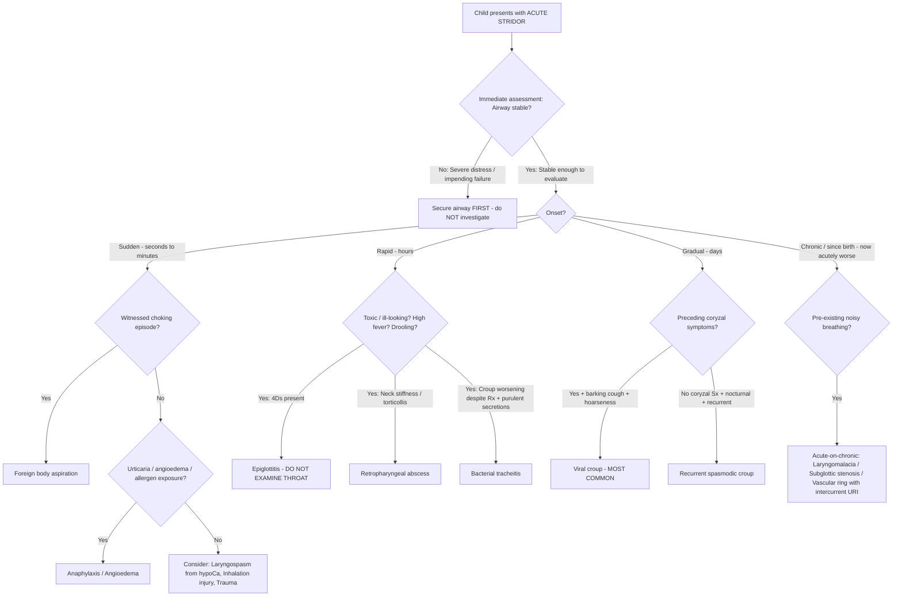

## Differential Diagnosis of Acute Stridor in Children

### The Clinical Thinking Process

When a child presents with acute stridor, your brain needs to run through a systematic framework — not a random list. The differential diagnosis is driven by **three key axes**:

1. **Anatomical level** of obstruction (supraglottic → glottic → subglottic → tracheal)
2. **Acuity and tempo** of onset (seconds → minutes → hours → days)
3. **Associated features** (fever, toxicity, cough character, ability to swallow, history of choking)

The reason you structure it this way is that stridor is simply a physical sign of **turbulent airflow through a narrowed extrathoracic airway** [1][2]. The differential is really asking: *what is causing the narrowing, where, and how fast?*

---

### Systematic Differential Diagnosis

#### A. Infectious Causes (Most Common Category Overall)

| Diagnosis | Anatomical Level | Key Distinguishing Features | Why It Causes Stridor |
|---|---|---|---|
| ***Viral croup (laryngotracheobronchitis)*** — **MOST COMMON** [1][2][3] | Subglottic | ***Stridor, "barking" or "croupy" cough, hoarseness, ± fever*** [3]; gradual onset over days; ***preceded by coryzal symptoms*** [2]; typically 6m–6y, peak 2y; worse at night | Viral inflammation → mucosal oedema of the subglottis (narrowest paediatric airway point) → Poiseuille's law dictates massive ↑resistance |
| ***Recurrent spasmodic croup*** [3] | Subglottic | ***Stridor, barking cough, hoarseness*** but ***NO preceding coryzal symptoms/fever*** [2]; sudden nocturnal onset; rapid resolution; tends to recur; ?allergic/atopic mechanism | Subglottic oedema without viral trigger — likely neurogenic/allergic mast cell activation → oedema of same vulnerable subglottic region |
| ***Bacterial tracheitis*** [3] | Subglottic/Tracheal | Often follows initial croup-like illness that **worsens** instead of improving; develops ***high fever, toxic appearance, copious purulent secretions***; S. aureus most common organism | Bacterial superinfection of tracheal mucosa → purulent exudate + pseudomembrane formation within the tracheal lumen → mechanical obstruction |
| ***Acute epiglottitis*** [2][4] | Supraglottic | ***4Ds: Dysphonia (hot-potato voice), Distress, Drooling, Dysphagia*** [2]; ***acute onset over hours; toxic/ill-looking; high fever ( > 38.5°C); sniffing/tripod position; absent or slight cough; unable to drink*** [2]; typically 2–4y; H. influenzae, S. aureus, S. pneumoniae, S. pyogenes [2] | Massive supraglottic inflammation → swollen epiglottis acts as ball-valve over laryngeal inlet → progressive obstruction |
| **Retropharyngeal abscess** | Retropharyngeal space (posterior to pharynx, anterior to prevertebral fascia) | High fever, toxic; neck stiffness/extension/torticollis; drooling; muffled voice; dysphagia; age typically < 6y (retropharyngeal LNs of Rouvière involute by ~6y); may follow pharyngitis or dental infection | Abscess in retropharyngeal space → posterior pharyngeal wall bulges anteriorly → compresses airway from behind |
| **Peritonsillar abscess (quinsy)** | Supraglottic/Oropharyngeal | Older children/adolescents; severe unilateral sore throat; trismus (difficulty opening mouth); "hot-potato" voice; uvular deviation; drooling | Suppuration between tonsillar capsule and pharyngeal constrictor muscle → mass displaces tonsil medially and soft palate inferiorly → pharyngeal/supraglottic narrowing |
| ***Diphtheria*** [1] | Laryngeal/Pharyngeal | ***Airway pseudomembrane formation, fever, sore throat, extensive cervical lymphadenopathy ("bull's neck appearance")*** [4]; rarely peripheral neuritis and myocarditis; consider in **unvaccinated children or immigrants from endemic areas** | Corynebacterium diphtheriae toxin → mucosal necrosis → thick grey pseudomembrane adheres to pharynx/larynx → mechanical obstruction + oedema |
| **Infectious mononucleosis (EBV)** | Oropharyngeal/Supraglottic | Massive tonsillar/adenoid hypertrophy; exudative pharyngitis; cervical lymphadenopathy; hepatosplenomegaly; atypical lymphocytes; adolescents predominantly | Markedly enlarged tonsils can meet in the midline ("kissing tonsils") → oropharyngeal obstruction |
| **Ludwig's angina (submandibular space infection)** | Floor of mouth/Supraglottic | Rapidly progressive cellulitis of floor of mouth; "woody" induration; tongue elevation; drooling; trismus; follows dental infection or oral trauma | Bilateral submandibular space infection → massive oedema of floor of mouth → tongue pushed posterosuperiorly → supraglottic obstruction |

<Callout title="The Croup Syndrome Triad" type="idea">
***When the question is "Is this a croup syndrome?" — the lecture slides identify three diagnoses to consider: Viral croup, Recurrent spasmodic croup, and Bacterial tracheitis*** [3]. All three share stridor and barking cough but differ in fever, toxicity, and preceding viral prodrome. Think of them as a spectrum: viral croup (commonest, mild-moderate) → spasmodic croup (no viral features, recurrent, allergic) → bacterial tracheitis (the dangerous one that mimics worsening croup).
</Callout>

#### B. Non-Infectious / Non-Infective Causes

| Diagnosis | Anatomical Level | Key Distinguishing Features | Why It Causes Stridor |
|---|---|---|---|
| ***Foreign body aspiration*** [1] | Variable (larynx → bronchus) | **Sudden onset** in a previously well child; often 1–3y; witnessed choking/gagging episode; no fever initially; unilateral wheeze if bronchial; biphasic stridor if at glottis/subglottis | Mechanical obstruction of airway lumen by foreign object — turbulent flow around the partial obstruction |
| ***Anaphylaxis / laryngeal oedema*** [1] | Supraglottic/Glottic | Rapid onset (minutes); history of allergen exposure (food, drug, insect sting); urticaria, angioedema, wheeze, hypotension; ± prior allergic history | IgE-mediated mast cell degranulation → massive histamine release → ↑vascular permeability → laryngeal mucosal oedema → airway narrowing |
| **Angioedema (hereditary or ACEi-related)** | Supraglottic/Oropharyngeal | Recurrent episodes of non-pruritic, non-urticarial swelling of face/lips/tongue/larynx; family history (HAE — autosomal dominant C1-esterase inhibitor deficiency); NO urticaria; does NOT respond to adrenaline/antihistamines | Bradykinin-mediated (not histamine) → ↑vascular permeability → submucosal oedema of upper airway |
| ***Inhalation injury (hot fumes/caustic substances)*** [1] | Supraglottic/Glottic/Subglottic | History of fire exposure, chemical ingestion, or steam inhalation; singed nasal hairs; facial burns; carbonaceous sputum; progressive hoarseness → stridor | Thermal or chemical burn to airway mucosa → intense oedema and blistering → progressive airway narrowing (may worsen over 24–72h) |
| ***Throat/laryngeal trauma*** [1] | Glottic/Subglottic | History of blunt neck trauma (handlebar injury, clothesline injury), or post-intubation/post-procedural; subcutaneous emphysema; hoarseness; pain | Direct mechanical disruption of laryngeal/tracheal cartilage or mucosal laceration → oedema, haematoma, or structural collapse |
| **Post-extubation stridor** | Subglottic | Onset within hours of extubation in PICU; prior prolonged intubation is a risk factor; history of neonatal intubation → acquired subglottic stenosis | Intubation-related mucosal trauma → oedema and/or granulation tissue at subglottic level (where ETT exerts maximal pressure against cricoid ring) |

#### C. Congenital/Structural Causes (Usually Present as Chronic Stridor but Can Acutely Worsen)

These typically present as **chronic stridor** but are included because they may **acutely decompensate** with intercurrent viral illness or other triggers [1]:

| Diagnosis | Anatomical Level | Key Distinguishing Features | Why It Causes Stridor |
|---|---|---|---|
| ***Laryngomalacia*** [1] | Supraglottic | **Most common cause of CHRONIC stridor in infants**; onset in first 2 weeks of life; inspiratory stridor worse with feeding, crying, supine position; usually self-limiting by 12–18 months | Immature, floppy supraglottic structures (omega-shaped epiglottis, redundant aryepiglottic folds) prolapse into airway on inspiration |
| ***Subglottic stenosis (congenital or acquired)*** [1] | Subglottic | Congenital: presents in first weeks; Acquired: history of neonatal intubation; recurrent croup episodes disproportionate to viral illness severity; biphasic stridor | Fixed narrowing of the subglottis → turbulent flow in both respiratory phases |
| ***External vascular compression (e.g. double aortic arch, vascular ring)*** [1] | Tracheal | Biphasic stridor from birth; worsened by feeding; dysphagia lusoria (difficulty swallowing); "noisy breathing" since birth; often detected incidentally | Anomalous vessel encircles/compresses the trachea and/or oesophagus → fixed extraluminal compression |
| **Subglottic haemangioma** | Subglottic | Onset 4–6 weeks; progressive biphasic stridor; may have cutaneous haemangiomas ("beard distribution" = high risk); worsens during growth phase (first year) | Vascular proliferation in subglottic space → progressive airway narrowing |
| **Laryngeal web/atresia** | Glottic | Abnormal cry/weak cry from birth; may present with stridor in the neonatal period; anterior glottic web is most common | Congenital failure of recanalisation of the larynx during embryogenesis → membrane across glottic aperture |
| **Laryngeal papillomatosis** | Glottic/Supraglottic | Progressive hoarseness then stridor; typically 2–4 years; caused by HPV 6 and 11 (vertical transmission); recurrent; may need repeated surgical excision | Multiple papillomas grow on vocal cords/supraglottis → progressive mass effect |

#### D. Other / Miscellaneous Causes

| Diagnosis | Mechanism | Key Features |
|---|---|---|
| ***Hypocalcaemia → laryngospasm*** [1][5] | Low ionised Ca²⁺ → increased neuromuscular excitability → involuntary spasm of laryngeal muscles (especially adductors) → vocal cords forcefully adducted → airway obstruction | Neonates: early (first 48h) or late (day 5–10) neonatal hypocalcaemia. Older children: post-thyroidectomy (***CATS GO NUMB: Convulsion, Arrhythmia, Tetany, laryngoSpasm*** [5]); DiGeorge syndrome; vitamin D deficiency (rickets). Chvostek's and Trousseau's signs positive |
| ***Vocal cord dysfunction/paralysis*** [1][6] | Unilateral: weak/breathy voice, aspiration risk, usually adequate airway. ***Bilateral: dyspnoea + stridor*** [5][6] because both cords fixed in paramedian/adducted position → cannot abduct during inspiration | Causes in children: birth trauma, Arnold-Chiari malformation, post-cardiac surgery (RLN injury), idiopathic. ***Left vocal cord more commonly affected due to longer course of left RLN*** [6] |
| ***Severe lymph node swelling*** [1] | Massive cervical or mediastinal lymphadenopathy → external compression of trachea/larynx | Infectious (EBV, TB, bacterial lymphadenitis), lymphoma, leukaemia (especially T-ALL with mediastinal mass) |
| **Mediastinal mass** | External compression of trachea, especially when supine | Lymphoma, teratoma, neuroblastoma; important to ask about positional symptoms (worse supine) |
| **Psychogenic/Paradoxical vocal fold motion** | Involuntary adduction of vocal cords during inspiration — no organic obstruction; diagnosis of exclusion | Adolescents; often misdiagnosed as "refractory asthma"; stridor with exercise or stress; normal between episodes; diagnosed by laryngoscopy during episode |

---

### Diagnostic Approach Framework — Mermaid Diagram

---

### Key Discriminating Questions at the Bedside

***The lecture slides provide a structured approach to acute cough that applies directly to stridor*** [3]:

| ***Question to Ask*** | ***Features to Look For*** | ***Likely Common Diagnosis*** |
|---|---|---|
| ***Is this a croup syndrome?*** | ***Stridor, "barking" or "croupy cough", hoarseness, ± fever*** | ***Viral croup, Recurrent spasmodic croup, Bacterial tracheitis*** |
| Is this an allergic/atopic emergency? | Acute onset, urticaria, angioedema, wheeze, known allergen exposure | Anaphylaxis |
| Was there a choking episode? | Sudden onset in well child, witnessed event, unilateral signs | Foreign body aspiration |
| Is the child toxic / unable to swallow? | 4Ds (Dysphonia, Distress, Drooling, Dysphagia), tripod position, high fever | Epiglottitis, retropharyngeal abscess |
| Is there a history of intubation / surgery? | Post-procedural onset, recurrent croup disproportionate to illness | Acquired subglottic stenosis, post-extubation oedema |
| Has stridor been present since birth and now worsened? | Chronic noisy breathing now acutely worse with URI | Laryngomalacia, vascular ring, congenital subglottic stenosis |

---

### Distinguishing Features — The Classic Comparisons

#### ***Croup vs Epiglottitis*** [2]

This table is **the highest yield comparison for exams**:

| Feature | ***Croup*** | ***Epiglottitis*** |
|---|---|---|
| ***Aetiology*** | ***Viral (± preceding coryza)*** | ***Bacterial*** |
| ***Onset*** | ***Gradual (over days)*** | ***Acute (over hours)*** |
| ***Appearance*** | ***Mild to moderate*** | ***Toxic, very ill*** |
| ***Fever*** | ***Absent to high*** | ***High*** |
| ***Cough*** | ***Severe, barking*** | ***Absent or slight*** |
| ***Stridor*** | ***Harsh, rasping*** | ***Soft, whispering*** |
| ***Voice/cry*** | ***Hoarse*** | ***Muffled (hot-potato)*** |
| ***Able to drink*** | ***Able*** | ***Unable*** |
| ***Drooling saliva*** | ***N/A*** | ***Yes*** |
| **Position** | Any | ***Sniffing/tripod position*** |
| **Imaging** | AP neck XR: steeple sign | Lateral neck XR: ***thumb sign*** |

<Callout title="Why the Cough Differs" type="idea">
In croup, the **subglottis and vocal cords** are inflamed → the cough reflex is vigorously triggered and the altered subglottic airway produces the classic "bark." In epiglottitis, inflammation is **supraglottic** — the vocal cords are relatively spared, so cough is minimal. Instead, the swollen epiglottis prevents swallowing → drooling and dysphagia.
</Callout>

#### Croup vs Bacterial Tracheitis

| Feature | Viral Croup | Bacterial Tracheitis |
|---|---|---|
| Initial presentation | Barking cough, hoarseness, stridor | Often starts as croup |
| Course | Improves over 3–5 days | **Worsens** after initial "croup" phase |
| Fever | Low-grade or absent | **High fever, toxic** |
| Secretions | Minimal | **Copious, purulent, thick** |
| Response to nebulised adrenaline | Good (transient) | **Poor or absent** |
| Response to dexamethasone | Good | **Poor** |
| Organism | Parainfluenza, RSV | S. aureus (most common), others |

#### Foreign Body vs Croup

| Feature | Foreign Body | Croup |
|---|---|---|
| Onset | **Sudden** (seconds) | Gradual (days) |
| Preceding illness | **None** — well child | Coryzal prodrome |
| Choking episode | **Usually witnessed** | Absent |
| Fever | **None** (initially) | Variable |
| Lateralising signs | **Unilateral decreased AE / wheeze** (if bronchial) | Bilateral |
| Age | 1–3 years (oral exploration) | 6 months–6 years |
| Cough | **Paroxysmal at onset then variable** | Barking |

---

### Age-Based Differential Diagnosis

This is clinically very useful because certain diagnoses cluster by age:

| Age Group | Most Likely Causes | Less Common but Important |
|---|---|---|
| **Neonate (0–28 days)** | Laryngomalacia (chronic, most common), congenital subglottic stenosis, vocal cord paralysis (birth trauma, Arnold-Chiari), laryngeal web | Subglottic haemangioma (onset 4–6 weeks), vascular ring |
| **Infant (1–6 months)** | Laryngomalacia with viral URI exacerbation, subglottic haemangioma, acquired subglottic stenosis (post-intubation) | Croup (uncommon before 6 months due to maternal antibodies) |
| **Toddler (6 months–3 years)** | ***Viral croup (MOST COMMON)***, foreign body aspiration, spasmodic croup | Bacterial tracheitis, retropharyngeal abscess, anaphylaxis |
| **Pre-schooler (3–6 years)** | Viral croup, epiglottitis (rare post-Hib vaccine), foreign body, retropharyngeal abscess | Peritonsillar abscess, diphtheria (unvaccinated), laryngeal papillomatosis |
| **School-age / Adolescent ( > 6 years)** | Peritonsillar abscess, anaphylaxis, trauma, inhalation injury | Psychogenic/paradoxical vocal fold motion, Ludwig's angina, mediastinal mass (lymphoma) |

---

### "Red Flag" Features That Change the Differential

| Red Flag | Implies | Why |
|---|---|---|
| ***Toxic appearance + high fever + drooling + inability to swallow*** | **Epiglottitis / retropharyngeal abscess** | Bacterial supraglottic infection with systemic toxicity |
| **Sudden onset in previously well child + no fever** | **Foreign body aspiration** | No infective process; mechanical obstruction |
| **Croup not responding to steroids + adrenaline** | **Bacterial tracheitis / alternative diagnosis** | True croup responds to steroids; failure suggests either wrong diagnosis or bacterial complication |
| **Recurrent croup ( > 2 episodes) or croup at atypical age ( < 6m or > 6y)** | **Underlying anatomical abnormality** (subglottic stenosis, haemangioma, vascular ring) | These children have a "pre-narrowed" airway that decompensates with any superimposed oedema; refer ENT for airway evaluation [2] |
| **Stridor since birth** | **Congenital cause** (laryngomalacia, web, stenosis, vascular ring) | Acquired stridor begins after a period of normal breathing |
| **Associated cutaneous haemangiomas in "beard" distribution** | **Subglottic haemangioma** | 50% of subglottic haemangiomas have cutaneous haemangiomas; "beard" distribution (chin, lower lip, anterior neck) has highest association |
| ***Biphasic stridor*** | **Fixed obstruction** (foreign body at glottis, subglottic stenosis, vascular ring, severe croup) | Obstruction is severe enough to cause turbulent flow in both inspiration and expiration |

<Callout title="When Croup Doesn't Behave Like Croup" type="error">
If a child presents with "recurrent croup" (more than 2 episodes), croup at an unusual age ( < 6 months or > 6 years), or croup that fails to respond to standard treatment (dexamethasone ± nebulised adrenaline), ***consult ENT for recurrent or slow-to-resolve croup: may be associated with underlying subglottic stenosis*** [2]. Do not simply discharge these children with "another episode of croup."
</Callout>

---

### Putting It All Together — The Bedside Decision Tree

The practical approach when a child arrives in the ED with acute stridor:

1. **First 30 seconds**: Is the airway threatened? → If yes, secure airway before any investigation [2]
2. **Observe from the doorway** (do NOT agitate the child — especially if epiglottitis is suspected):
   - Toxic vs non-toxic?
   - Position (tripod vs comfortable)?
   - Drooling?
   - Colour?
   - Conscious level?
3. **History** (from parents, keeping the child calm):
   - Onset tempo (seconds / hours / days)?
   - Preceding coryzal illness?
   - Choking episode?
   - Allergen exposure?
   - Vaccination history (Hib, DTaP)?
   - Previous episodes / previous intubation?
   - Associated symptoms (fever, cough type, ability to drink)?
4. **Categorise** using the framework above → arrive at a working diagnosis
5. **Treat the most likely diagnosis** while keeping alternatives in mind

> ***For upper airway obstructions, immediate intubation is of utmost priority. No manipulation (e.g. throat exam, XR neck, IV placement) should be done before that as these may precipitate complete obstruction*** [2].

---

<Callout title="High Yield Summary — Differential Diagnosis of Acute Stridor">

1. ***Viral croup is the most common cause*** of acute stridor in children (6m–6y; barking cough, hoarseness, gradual onset with coryzal prodrome) [1][2][3].

2. ***The croup syndrome includes: Viral croup, Recurrent spasmodic croup, and Bacterial tracheitis*** [3] — same location (subglottis), different aetiologies.

3. ***Epiglottitis (4Ds)*** is rare post-Hib vaccine but remains a paediatric emergency — distinguish from croup by: acute onset (hours), toxic, drooling, dysphagia, muffled voice, NO barking cough [2].

4. **Foreign body aspiration**: sudden onset in a well child, no fever, often witnessed choking — diagnosis of exclusion requires high suspicion.

5. **Recurrent croup / atypical age croup / treatment failure** → suspect underlying structural abnormality → refer ENT [2].

6. **Age helps narrow the differential**: Neonates → congenital; Toddlers → croup/foreign body; Adolescents → peritonsillar abscess/anaphylaxis/psychogenic.

7. **Biphasic stridor = fixed obstruction** (subglottic stenosis, foreign body at glottis, vascular ring, or very severe croup).

8. ***Hypocalcaemia can cause laryngospasm*** — always check calcium in unexplained stridor, especially neonates and post-surgical patients [1][5].

</Callout>

---

<ActiveRecallQuiz
  title="Active Recall - Differential Diagnosis of Acute Stridor"
  items={[
    {
      question: "A 3-year-old with 2-day runny nose now has barking cough, hoarse voice, and inspiratory stridor worse at night. What are the three diagnoses in the 'croup syndrome' to consider, and which is most likely here?",
      markscheme: "The croup syndrome includes: (1) Viral croup, (2) Recurrent spasmodic croup, (3) Bacterial tracheitis. Most likely here is viral croup given the preceding coryzal prodrome, barking cough, hoarseness, and nocturnal worsening. Spasmodic croup lacks viral prodrome. Bacterial tracheitis would show high fever, toxicity, and copious purulent secretions."
    },
    {
      question: "A 3-year-old presents with acute onset over 4 hours of high fever, drooling, refusal to drink, muffled voice, and is sitting in a tripod position. What is the diagnosis, and what must you NOT do before securing the airway?",
      markscheme: "Acute epiglottitis. The 4Ds are present: Dysphonia (muffled voice), Distress, Drooling, Dysphagia (cannot drink). You must NOT perform any manipulation (throat examination, neck X-ray, IV placement) before securing the airway, as agitation may precipitate complete airway obstruction."
    },
    {
      question: "A 15-month-old who was playing with peanuts suddenly develops choking, coughing, and inspiratory stridor. There is no fever. What is the most likely diagnosis, and why does foreign body aspiration present differently depending on the level of impaction?",
      markscheme: "Foreign body aspiration. If lodged at the larynx or subglottis (extrathoracic), it causes inspiratory stridor due to negative inspiratory pressure worsening extrathoracic obstruction. If lodged in a bronchus (intrathoracic, more commonly the right main bronchus), it causes unilateral wheeze or air trapping with expiratory difficulty, because positive expiratory pressure compresses intrathoracic airways around the foreign body."
    },
    {
      question: "A child has had three episodes of croup in the past year, and the most recent episode occurred at age 4 months. What should you be concerned about, and what is the next step?",
      markscheme: "Recurrent croup (more than 2 episodes) and croup at an atypical age (under 6 months) should raise suspicion for an underlying structural airway abnormality such as congenital subglottic stenosis, subglottic haemangioma, or vascular ring. The next step is referral to ENT for airway evaluation, typically with flexible laryngoscopy and/or bronchoscopy."
    },
    {
      question: "Name three non-infectious causes of acute stridor in children, and for each, explain the mechanism of airway narrowing.",
      markscheme: "(1) Foreign body aspiration: mechanical intraluminal obstruction by the foreign object. (2) Anaphylaxis: IgE-mediated mast cell degranulation causes massive histamine release leading to laryngeal mucosal oedema and increased vascular permeability. (3) Hypocalcaemia-induced laryngospasm: low ionised calcium causes neuromuscular hyperexcitability, leading to involuntary spasm of laryngeal adductor muscles and functional airway closure."
    }
  ]}
/>

---

## References

[1] Senior notes: Adrian Lui Pediatrics.pdf (p155)
[2] Senior notes: Adrian Lui Pediatrics.pdf (p161–162)
[3] Lecture slides: GC 141. A child with cough acute and chronic cough in children.pdf (p15)
[4] Senior notes: Ryan Ho Respiratory.pdf (p48)
[5] Senior notes: Ryan Ho Endocrine.pdf (p22)
[6] Senior notes: felixlai.md (section on vocal cord palsy)
