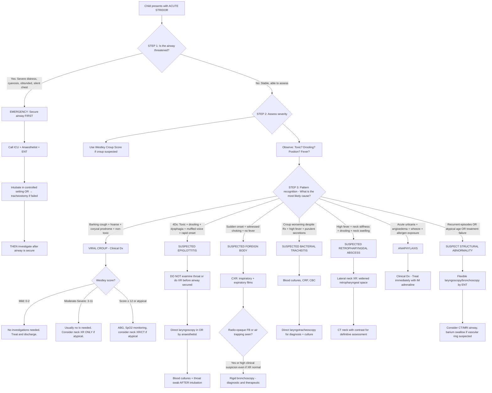

## Diagnostic Criteria, Diagnostic Algorithm, and Investigations for Acute Stridor in Children

### Overarching Principle: Acute Stridor Is a Clinical Diagnosis

Before diving into investigations, you must understand a fundamental concept: **the diagnosis of the most common causes of acute stridor in children (particularly croup and epiglottitis) is CLINICAL**. Investigations are supplementary and should never delay treatment or airway management.

> ***Most children with cough due to a simple URI do not need any investigations*** [3]. This principle extends to croup — the most common cause of acute stridor. Investigations are reserved for atypical presentations, diagnostic uncertainty, or to exclude dangerous alternative diagnoses.

<Callout title="Golden Rule" type="error">
***For upper airway obstructions, immediate intubation is of utmost priority. No manipulation (e.g. throat exam, XR neck, IV placement) should be done before that as these may precipitate complete obstruction*** [2]. This means: in a child with suspected epiglottitis or severe stridor with impending respiratory failure, **secure the airway FIRST** — investigations come later.
</Callout>

---

### Diagnostic Criteria

There are no formal "diagnostic criteria" for acute stridor in the same way as, say, the Jones criteria for rheumatic fever. Instead, diagnosis relies on **pattern recognition of clinical features**. However, there are validated **severity scoring systems** and **clinical diagnostic frameworks** that guide decision-making.

#### A. Viral Croup — Clinical Diagnosis

***Dx: clinical diagnosis usually*** [2]

The diagnosis of croup is made clinically based on the triad:

1. ***Barking/croupy cough*** ("seal-bark") [2][3]
2. ***Hoarseness*** [2][3]
3. ***Inspiratory stridor*** [2][3]

Plus supporting context:
- Age 6 months – 6 years (peak ~2 years)
- ***± Preceding coryzal symptoms: fever, nasal congestion, discharge*** [2]
- Nocturnal worsening
- ***± Respiratory distress*** [2]

> ***Imaging: NOT indicated if clinically suggestive*** [2]. This is because the diagnosis is clinical, and sending a distressed child for imaging wastes time, may worsen agitation (→ worsening obstruction), and adds no value when the presentation is classic.

#### B. Westley Croup Severity Score

This is the most widely used validated scoring system for croup severity [2]. It guides management decisions:

| Parameter | Score 0 | Score 1 | Score 2 | Score 3 | Score 4 | Score 5 |
|---|---|---|---|---|---|---|
| ***Level of consciousness*** | ***Normal (incl. sleep)*** — 0 | — | — | — | — | ***Disoriented*** — 5 |
| ***Cyanosis*** | ***None*** — 0 | — | — | — | ***With agitation*** — 4 | ***At rest*** — 5 |
| ***Stridor*** | ***None*** — 0 | ***With agitation*** — 1 | ***At rest*** — 2 | — | — | — |
| ***Air entry*** | ***Normal*** — 0 | ***Decreased*** — 1 | ***Markedly decreased*** — 2 | — | — | — |
| ***Retraction*** | ***None*** — 0 | ***Mild*** — 1 | ***Moderate*** — 2 | ***Severe*** — 3 | — | — |

**Total score range: 0–17**

| ***Score*** | ***Severity*** | ***Management Implication*** |
|---|---|---|
| ***≤ 2*** | **Mild** | ***Home treatment with symptomatic care ± PO dexamethasone*** |
| ***3–7*** | **Moderate** | ***Outpatient treatment with PO dexamethasone + nebulised adrenaline*** |
| ***8–11*** | **Severe** | ***Hospitalisation required with same treatment as above*** |
| ***≥ 12*** | **Impending respiratory failure** | ***ICU admission with IM/IV dexamethasone ± repeated nebulised adrenaline*** |

<Callout title="Why These Specific Parameters?">
Each parameter in the Westley score reflects a specific aspect of respiratory compromise: **Stridor** = degree of airway narrowing; **Retractions** = work of breathing (how hard the respiratory muscles are fighting); **Air entry** = effectiveness of ventilation; **Cyanosis** = oxygenation failure; **Consciousness** = CNS effect of hypoxia/hypercarbia. The score essentially captures the entire pathophysiological cascade from narrowing → increased work → failing gas exchange → neurological compromise.
</Callout>

#### C. Acute Epiglottitis — Clinical Diagnosis

***Epiglottitis is diagnosed clinically by the 4Ds: Dysphonia, Distress, Drooling, Dysphagia*** [2], in the context of:
- ***Acute onset over hours*** [2]
- ***Toxic, very ill appearance*** [2]
- ***High fever ( > 38.5°C)*** [2]
- ***Sniffing/tripod position*** [2]

There are no validated scoring systems for epiglottitis because it is a **paediatric emergency** that requires immediate action, not scoring.

> ***Imaging: NOT indicated if clinically suggestive*** [2]. The diagnosis is clinical. If you are confident in the diagnosis, go straight to **securing the airway** in a controlled setting (OR or PICU with anaesthetist and ENT surgeon present).

#### D. Foreign Body Aspiration — Clinical + Radiological Diagnosis

Diagnosis is based on:
1. **Clinical history**: sudden-onset choking/coughing in a previously well child (often 1–3 years)
2. **Radiological findings** (if stable): CXR may show radio-opaque FB, unilateral hyperinflation, or atelectasis
3. **Definitive diagnosis**: ***Bronchoscopy*** — both diagnostic AND therapeutic

#### E. Bacterial Tracheitis — Clinical Diagnosis (Diagnosis of Exclusion from Croup)

Key diagnostic features:
1. Child initially presenting with croup-like illness
2. **Failure to respond** to standard croup treatment (dexamethasone + nebulised adrenaline)
3. **Clinical deterioration** with high fever, toxicity, and copious purulent secretions
4. Definitive confirmation: **direct laryngotracheoscopy** showing purulent exudate and pseudomembranes ± tracheal cultures

---

### Diagnostic Algorithm

---

### Investigation Modalities — Detailed Guide

The principle guiding investigations in acute stridor is: **investigations should not delay airway management and should be directed by the clinical suspicion**.

#### A. Bedside Assessments (Mandatory in ALL Cases)

| Investigation | What It Tells You | Interpretation |
|---|---|---|
| **Pulse oximetry (SpO₂)** | Continuous non-invasive measure of oxygenation | Normal: > 95%. SpO₂ < 92% = severe obstruction requiring urgent intervention. Remember: SpO₂ is a LATE indicator of hypoxia in children — a child can have significant obstruction with normal SpO₂ initially because of compensatory ↑work of breathing |
| **Heart rate and respiratory rate** | Tachycardia and tachypnoea = compensatory mechanisms; bradycardia = pre-arrest | Normal HR varies by age (neonate 120–160, infant 100–150, toddler 80–130, child 70–110). ***Tachypnoea thresholds: > 60 for < 2 months, > 50 for 2–12 months, > 40 for > 1 year*** [3] |
| **Temperature** | Distinguishes infectious vs non-infectious aetiology; high fever ( > 38.5°C) suggests bacterial cause | Low-grade or absent → croup, spasmodic croup, FB. High fever → epiglottitis, bacterial tracheitis, retropharyngeal abscess |
| **Westley croup score** | Standardised severity assessment for croup [2] | Guides management (mild → home; moderate → outpatient steroid ± nebulised adrenaline; severe → admission; ≥12 → ICU) |
| **Observation from doorway** | Assess toxicity, position, consciousness, drooling WITHOUT agitating the child | A toxic, drooling child in tripod position = epiglottitis until proven otherwise. **Do not approach, examine the throat, or insert IV lines until airway plan is in place** [2] |

<Callout title="Why 'Observe from the Doorway'?" type="idea">
In paediatrics, agitating a child with critical upper airway obstruction can precipitate complete obstruction. Crying increases oxygen demand, increases turbulent airflow through the narrowed segment, and can cause dynamic collapse of already compromised structures. The initial assessment should be done **with the child on the parent's lap, in a calm environment, from a distance**. This is unique to paediatrics — adults can tolerate examination without this risk.
</Callout>

#### B. Blood Investigations

| Investigation | When to Order | Expected Findings | Interpretation |
|---|---|---|---|
| **CBC with differential** | Moderate-to-severe presentations; suspected bacterial aetiology; diagnostic uncertainty | **Viral croup**: lymphocyte-predominant, normal or mildly elevated WCC. **Bacterial tracheitis/epiglottitis**: neutrophilia, ↑WCC (leukocytosis often 15–25 × 10⁹/L), left shift (↑band forms) | Helps distinguish viral vs bacterial — but is never diagnostic alone; always correlate with clinical picture |
| **CRP / Procalcitonin** | Suspected bacterial infection | Elevated in bacterial tracheitis, epiglottitis, retropharyngeal abscess. Usually normal or mildly elevated in viral croup | Procalcitonin > 0.5 ng/mL suggests bacterial infection. CRP > 40 mg/L in a toxic child with stridor supports bacterial aetiology |
| **Blood cultures** | Suspected epiglottitis, bacterial tracheitis, retropharyngeal abscess — **obtain AFTER airway is secured** [2] | May grow H. influenzae, S. aureus, S. pneumoniae, S. pyogenes | Positive in ~50% of epiglottitis cases; helps guide directed antibiotic therapy. **Never delay airway management to take blood cultures** |
| **Blood gas (capillary or arterial)** | Severe respiratory distress; impending respiratory failure; ICU-level cases | Hypoxaemia (↓PaO₂), hypercarbia (↑PaCO₂), respiratory acidosis | Rising PaCO₂ is a late and ominous sign = respiratory muscle fatigue, indicating need for intubation. In children, capillary blood gas (CBG) from warmed heel is adequate for pH and PCO₂ |
| **Serum calcium (ionised)** | Unexplained stridor, especially in neonates; post-surgical (thyroidectomy); DiGeorge syndrome suspected | Low ionised Ca²⁺ ( < 1.0 mmol/L in neonates, < 1.1 mmol/L in children) | ***Hypocalcaemia → laryngospasm*** [1][7] — neuromuscular hyperexcitability causes vocal cord adductor spasm. Check calcium in any unexplained stridor, especially if accompanied by tetany, seizures, or Chvostek/Trousseau signs |
| **Throat swab / NPA (nasopharyngeal aspirate)** | Diagnostic uncertainty; epidemiological surveillance; persistent/atypical cases | NPA can identify parainfluenza, RSV, influenza, adenovirus, SARS-CoV-2 by PCR | Confirms viral aetiology of croup but rarely changes acute management. More useful for infection control (cohorting) and epidemiology |

#### C. Imaging

##### 1. Neck Radiographs (AP and Lateral)

> ***Imaging: NOT indicated if clinically suggestive*** [2] — this applies to BOTH croup and epiglottitis. Imaging is only useful when the diagnosis is **uncertain** or when you need to **exclude alternative diagnoses**.

| View | Condition | Key Finding | Explanation |
|---|---|---|---|
| **AP (anteroposterior) soft-tissue neck** | ***Croup*** | ***"Steeple sign" (hourglass sign)*** [2] | Subglottic narrowing creates a tapered, church-steeple appearance of the tracheal air column on AP view. Normal subglottic trachea is "shouldered" (squared off) by the cricoid cartilage; oedema erodes these shoulders into a point. **Sensitivity ~50%** — a normal AP neck XR does NOT exclude croup |
| **Lateral soft-tissue neck** | ***Epiglottitis*** | ***"Thumb sign"*** [2] | The swollen epiglottis appears thickened and rounded on lateral view, resembling a thumb (normally it looks like a thin "little finger"). Also look for: thickened aryepiglottic folds, obliteration of the valleculae, distended hypopharynx |
| **Lateral soft-tissue neck** | **Retropharyngeal abscess** | **Widened retropharyngeal space** | Normal retropharyngeal space width: < 7 mm at C2 (or < 1 vertebral body width); < 14 mm at C6 (child) or < 22 mm at C6 (adult). Widening suggests retropharyngeal abscess or cellulitis. **Caveat**: flexion of the neck in a crying child can falsely widen this space — the film must be taken in **extension during inspiration** |
| **AP neck** | **Subglottic stenosis** | Fixed narrowing of the subglottic airway | Persistent steeple sign that does not change with treatment |

<Callout title="The Steeple Sign — Sensitivity Limitations" type="error">
The steeple sign on AP neck XR has a **sensitivity of only ~50%** for croup. This means half of children with croup will have a normal-looking AP neck XR. This is why ***imaging is NOT indicated if clinically suggestive*** [2]. A normal XR does NOT rule out croup, and an abnormal XR does not change management in a classic presentation. Only use XR when you are genuinely uncertain about the diagnosis.
</Callout>

##### 2. Chest X-Ray (CXR)

| Indication | What to Look For | Interpretation |
|---|---|---|
| **Foreign body aspiration** | Radio-opaque foreign body (coins, metallic objects); unilateral hyperinflation (air trapping); mediastinal shift away from affected side on expiratory film; atelectasis/consolidation (if delayed presentation) | **Inspiratory and expiratory films**: on inspiration both lungs inflate; on expiration, the side with the ball-valve FB stays inflated (air trapping) while the normal side deflates → mediastinal shift towards the normal side. In young children who cannot cooperate with expiratory films, **bilateral decubitus CXRs** can be used (the dependent lung should deflate; failure to deflate = air trapping) |
| **Bacterial tracheitis** | Subglottic narrowing (similar to croup) ± intratracheal irregular soft-tissue densities (pseudomembranes/purulent material) | "Ragged" tracheal air column — the tracheal lumen has irregular edges due to adherent purulent exudate |
| ***Lower respiratory involvement*** | ***A CXR should be considered in the presence of lower respiratory tract signs*** [3], e.g. crepitations, wheeze/rhonchi, tachypnoea out of proportion to upper airway obstruction | Consolidation (pneumonia), hyperinflation with peribronchial thickening (bronchiolitis), pleural effusion (empyema) |
| **Mediastinal mass** | Anterior or middle mediastinal mass compressing trachea | Lymphoma (T-ALL), neuroblastoma, teratoma — important to identify before anaesthesia because supine positioning can cause complete tracheal collapse |

##### 3. CT Neck / Airway with Contrast

| Indication | What to Look For | Clinical Significance |
|---|---|---|
| **Retropharyngeal / parapharyngeal abscess** | Rim-enhancing fluid collection in retropharyngeal space; gas within the collection (highly specific for abscess vs cellulitis); extent of collection; relationship to major vessels | CT with IV contrast is the **gold standard** for deep neck space infections. It distinguishes abscess (needs drainage) from cellulitis (may respond to antibiotics alone). Scalloping of the posterior wall and rim enhancement are key signs of an abscess cavity |
| **Suspected vascular ring / external compression** | CT angiography (CTA): anomalous vascular anatomy (double aortic arch, right aortic arch with aberrant left subclavian, pulmonary artery sling) | Defines the vascular anatomy before surgical correction. MRA (magnetic resonance angiography) is an alternative that avoids ionising radiation |
| **Subglottic haemangioma / mass lesion** | Soft-tissue mass in the subglottic region with characteristic enhancement pattern | Haemangiomas show intense, homogeneous enhancement due to high vascularity |
| **Atypical / recurrent croup, treatment failure** | Structural abnormality (stenosis, mass, extrinsic compression) | Reserve for children who are stable but have an atypical course warranting further anatomical delineation |

##### 4. MRI Neck / Airway

| Use | Advantage Over CT | Limitation |
|---|---|---|
| Vascular ring / vascular anomaly assessment | No ionising radiation; excellent soft-tissue contrast; MRA delineates vascular anatomy without contrast | Longer acquisition time → may require sedation/GA in young children (which itself is risky in a child with airway compromise) |
| Subglottic haemangioma characterisation | Excellent tissue differentiation (flow voids in haemangioma) | Same limitation as above |

> In the **acute setting**, CT is preferred over MRI because of its speed. MRI is reserved for **elective/outpatient evaluation** of chronic or recurrent stridor.

#### D. Endoscopic / Procedural Investigations

| Investigation | Indication | What It Shows | Key Points |
|---|---|---|---|
| ***Direct laryngoscopy (by anaesthetist in OR)*** | ***Suspected epiglottitis*** [2]; suspected foreign body at laryngeal level; unexplained/life-threatening stridor | ***Epiglottitis: cherry-red, swollen epiglottis*** [2]; Foreign body: visualisation and removal; Vocal cord paralysis: immobile cord(s) | In epiglottitis, direct laryngoscopy is performed in the OR as part of the intubation procedure — **NOT as a bedside investigation**. The anaesthetist intubates while visualising the swollen epiglottis. ***Laryngoscopy: direct visualisation of cherry-red epiglottis*** [2] |
| **Flexible nasolaryngoscopy (FNL)** | Recurrent croup; atypical stridor; suspected structural abnormality; chronic stridor evaluation; post-extubation stridor | Dynamic assessment of supraglottic structures (laryngomalacia), vocal cord mobility, subglottic pathology | Can be done as an **awake** bedside procedure in cooperative older children; in infants, often done awake to assess dynamic movement. Topical local anaesthetic (lignocaine spray) to the nose and pharynx enables passage of the flexible scope |
| ***Rigid bronchoscopy*** | ***Foreign body aspiration*** — **diagnostic AND therapeutic** | Visualisation and extraction of foreign body; assessment of airway damage | The gold standard for foreign body removal. Performed under GA by a paediatric ENT surgeon or paediatric pulmonologist. Rigid scope preferred over flexible for FB extraction because it allows passage of grasping instruments and maintenance of ventilation. ***Consult ENT for recurrent or slow-to-resolve croup: may be associated with underlying subglottic stenosis*** [2] |
| **Direct laryngotracheoscopy** | Bacterial tracheitis (for confirmation and culture) | Purulent exudate, pseudomembranes, oedematous tracheal mucosa | Performed under GA; allows suctioning of purulent material (therapeutic) and obtaining cultures for directed antibiotic therapy |

#### E. Other Specialised Investigations (Elective/Outpatient)

| Investigation | Indication | Interpretation |
|---|---|---|
| ***Flow-volume loop*** | Suspected fixed upper airway obstruction; recurrent stridor; ***if unsure if there is upper airway obstruction*** [7] | ***UAO results in a blunted flow-volume loop*** [7] — Variable extrathoracic obstruction: flattening of the inspiratory limb. Variable intrathoracic obstruction: flattening of the expiratory limb. Fixed obstruction: flattening of BOTH limbs (box-shaped loop). Requires cooperation → feasible from ~age 6 years |
| **Barium / contrast swallow** | Suspected vascular ring (extrinsic oesophageal compression); tracheo-oesophageal fistula | Posterior indentation of oesophagus on lateral view (vascular ring); contrast passage into trachea (TEF) |
| **Microlaryngoscopy and bronchoscopy (MLB)** | Full airway evaluation under GA for recurrent/atypical stridor | Comprehensive assessment of airway from nose to distal bronchi; allows biopsy if needed (e.g. haemangioma, papillomatosis) |
| **pH probe / impedance monitoring** | Suspected GORD-related laryngeal oedema contributing to stridor | Acid reflux events correlating with stridor episodes; particularly relevant in infants with laryngomalacia worsened by GORD |
| ***Sweat test / immunoglobulin pattern / nasal NO / cilia study*** | ***According to history and PE; developmentally appropriate*** [3] — when chronic cough or chronic/recurrent airway disease suggests an underlying systemic condition | Sweat chloride > 60 mmol/L = cystic fibrosis; low nasal NO + abnormal cilia = primary ciliary dyskinesia; low immunoglobulins = immunodeficiency |

---

### Summary: Which Investigation for Which Diagnosis?

| Suspected Diagnosis | First-Line Investigation | Definitive Investigation | Avoid |
|---|---|---|---|
| **Viral croup** | ***Clinical diagnosis; no Ix needed if typical*** [2] | Clinical + response to treatment | XR in a typical presentation (wastes time, agitates child) |
| **Epiglottitis** | ***Clinical diagnosis; 4Ds*** [2] | ***Direct laryngoscopy in OR (cherry-red epiglottis) + blood cultures AFTER intubation*** [2] | ***Throat exam, neck XR, IV placement BEFORE airway secured*** [2] |
| **Foreign body** | CXR (inspiratory + expiratory / decubitus films) | ***Rigid bronchoscopy*** | Delaying bronchoscopy if high clinical suspicion and normal XR |
| **Bacterial tracheitis** | CBC, CRP, blood cultures; neck XR may show irregular tracheal lumen | Direct laryngotracheoscopy + tracheal cultures | Assuming it is "just croup" when the child is getting worse |
| **Retropharyngeal abscess** | Lateral neck XR (widened retropharyngeal space) | CT neck with contrast | Attempting aspiration without imaging guidance |
| **Anaphylaxis** | Clinical diagnosis | Serum tryptase (within 1–4h), specific IgE later | Any delay in giving IM adrenaline for investigations |
| **Structural anomaly** | Flexible nasolaryngoscopy | MLB under GA; CT/MRI airway; contrast swallow if vascular ring | Assuming "recurrent croup" without investigating the underlying anatomy |
| **Hypocalcaemia** | Serum ionised calcium, ECG | Corrected calcium, PTH, Mg²⁺, vitamin D | Forgetting to check calcium in unexplained stridor (especially neonates) |

---

### Interpretation of Key Radiological Findings

#### The "Steeple Sign" (AP Neck XR — Croup)

- **Normal**: The subglottic trachea has "shoulders" — the air column widens slightly at the level of the cricoid cartilage before tapering into the trachea, creating a squared-off appearance.
- **Steeple sign**: Subglottic oedema erodes these shoulders → the air column tapers symmetrically to a point, like a church steeple.
- **Sensitivity**: ~50% (many false negatives)
- **Specificity**: moderate (subglottic stenosis and bacterial tracheitis can also produce narrowing)

#### The "Thumb Sign" (Lateral Neck XR — Epiglottitis)

- **Normal**: The epiglottis appears as a thin, curved structure (like a "little finger") projecting from the base of tongue.
- ***Thumb sign***: The swollen epiglottis appears **thickened and rounded**, resembling a thumb.
- Also look for: thickened aryepiglottic folds, distended hypopharynx (ballooning sign), obliteration of valleculae.
- ***Imaging: NOT indicated if clinically suggestive*** [2] — only obtain if the diagnosis is uncertain AND the child is stable enough.

#### Foreign Body — CXR Interpretation

| Finding | Mechanism | Significance |
|---|---|---|
| **Radio-opaque FB** | Direct visualisation (coins, metallic objects, button batteries) | Immediately identifies the FB and its location; button batteries are a surgical emergency (risk of caustic burn) |
| **Unilateral hyperinflation** | Ball-valve effect: air enters past the FB on inspiration but cannot exit on expiration → air trapping | Classic sign; best seen on expiratory films |
| **Mediastinal shift** | Shift away from the affected (hyperinflated) side on expiratory films | Confirms air trapping |
| **Atelectasis / consolidation** | Complete obstruction → absorption atelectasis; chronic FB → secondary infection | May be the presenting finding in late/missed FB aspiration |
| **Normal CXR** | FB is not radio-opaque AND no air trapping evident | **Does NOT exclude FB aspiration** — if clinical suspicion is high, proceed to bronchoscopy regardless |

<Callout title="Normal CXR Does Not Exclude Foreign Body" type="error">
Up to 25–40% of children with confirmed foreign body aspiration have a **normal CXR**. This is because many aspirated objects (peanuts, food fragments, plastic pieces) are radiolucent, and air trapping may not be apparent on a single inspiratory film. If the clinical story is convincing (sudden choking in a toddler), **proceed to bronchoscopy even with a normal CXR**.
</Callout>

#### Lateral Neck XR — Retropharyngeal Abscess

- **Measure the retropharyngeal space** at C2 level: normal is < 7 mm (or less than one vertebral body width in children).
- Widening suggests retropharyngeal cellulitis or abscess.
- **Pitfall**: A lateral neck XR taken during **expiration or with neck flexion** in a crying child can falsely widen the retropharyngeal space. The film must be taken during **inspiration with neck in extension**.
- If suspicious → CT neck with contrast for definitive assessment.

---

### Flow-Volume Loop Patterns in Upper Airway Obstruction

This is a concept borrowed from pulmonology that is relevant to **chronic/recurrent stridor evaluation** [7]:

| Type of Obstruction | Inspiratory Limb | Expiratory Limb | Example |
|---|---|---|---|
| **Variable extrathoracic** | **Flattened** (plateau) | Normal | Laryngomalacia, vocal cord paralysis (unilateral) |
| **Variable intrathoracic** | Normal | **Flattened** (plateau) | Tracheomalacia, intrathoracic tracheal tumour |
| **Fixed obstruction** | **Flattened** | **Flattened** | Subglottic stenosis, vascular ring, tracheal tumour |

*Why?*
- In **variable extrathoracic** obstruction: during inspiration, negative intraluminal pressure collapses the floppy/obstructed extrathoracic airway → limited inspiratory flow. During expiration, positive intraluminal pressure splints the extrathoracic airway open → normal expiratory flow.
- In **fixed** obstruction: the narrowing does not change with respiratory phase → both limbs are equally affected.

---

<Callout title="High Yield Summary — Diagnosis and Investigations">

1. **Croup and epiglottitis are CLINICAL diagnoses** — ***imaging is NOT indicated if clinically suggestive*** [2].

2. ***Westley croup severity score*** [2] guides management: ≤ 2 = mild (home), 3–7 = moderate (outpatient steroids ± adrenaline), 8–11 = severe (admission), ≥ 12 = ICU.

3. ***No manipulation (throat exam, XR, IV) before securing the airway in epiglottitis*** [2] — the child can obstruct completely if agitated.

4. **Neck XR findings**: Steeple sign (croup, AP view, ~50% sensitivity), Thumb sign (epiglottitis, lateral view), Widened retropharyngeal space (retropharyngeal abscess, lateral view).

5. **Foreign body**: CXR with inspiratory + expiratory films (or decubitus in infants); normal CXR does NOT exclude FB → proceed to rigid bronchoscopy if clinical suspicion is high.

6. ***A CXR should be considered in the presence of lower respiratory tract signs*** [3] — to exclude pneumonia, bronchiolitis, or other concomitant lower airway disease.

7. **Blood tests** (CBC, CRP, blood cultures) are reserved for **suspected bacterial causes** and should be taken **after the airway is secured**.

8. **Flexible nasolaryngoscopy** and **MLB under GA** are indicated for **recurrent/atypical stridor** to evaluate structural airway abnormalities [2].

9. ***Flow-volume loop: UAO results in a blunted flow-volume loop*** [7] — variable extrathoracic = flat inspiratory limb; fixed = both limbs flattened.

10. **Check ionised calcium** in any unexplained stridor, especially in neonates (early/late neonatal hypocalcaemia) and post-surgical patients (parathyroid damage).

</Callout>

---

<ActiveRecallQuiz
  title="Active Recall - Diagnosis and Investigations for Acute Stridor"
  items={[
    {
      question: "What is the Westley croup severity score range for a child who requires ICU admission, and what are the five parameters assessed?",
      markscheme: "Westley score of 12 or more requires ICU admission. The five parameters are: (1) Level of consciousness (0 or 5), (2) Cyanosis (0, 4, or 5), (3) Stridor (0, 1, or 2), (4) Air entry (0, 1, or 2), (5) Retractions (0, 1, 2, or 3). Maximum total score is 17."
    },
    {
      question: "A child with suspected epiglottitis is in the ED. The junior doctor wants to examine the throat and take a lateral neck X-ray. Why is this dangerous, and what should be done instead?",
      markscheme: "Examining the throat or performing imaging can agitate the child, which may precipitate complete airway obstruction in epiglottitis. Instead, keep the child calm with the parent, call ICU paediatrician, anaesthetist, and ENT surgeon immediately, and secure the airway by intubation in a controlled setting (operating theatre) first. All investigations (blood cultures, imaging) should be done AFTER the airway is secured."
    },
    {
      question: "A 2-year-old had a sudden choking episode while eating peanuts 4 hours ago. CXR is normal. Does this exclude foreign body aspiration? What is the next step?",
      markscheme: "No, a normal CXR does NOT exclude foreign body aspiration. Up to 25-40% of confirmed FB cases have normal CXR because many foreign bodies (e.g. peanuts, food particles) are radiolucent, and air trapping may not be apparent on a single inspiratory film. If clinical suspicion is high (witnessed choking episode), proceed to rigid bronchoscopy, which is both diagnostic and therapeutic."
    },
    {
      question: "Describe the flow-volume loop pattern you would expect in a child with fixed subglottic stenosis and explain why.",
      markscheme: "Fixed subglottic stenosis produces flattening of BOTH the inspiratory and expiratory limbs of the flow-volume loop, creating a box-shaped pattern. This is because the stenosis does not change in calibre with respiratory phase - unlike variable obstruction where the narrowing worsens in one phase. The fixed narrowing limits maximum airflow equally in both inspiration and expiration."
    },
    {
      question: "What is the steeple sign, on which radiograph view is it seen, what is its approximate sensitivity for croup, and why is imaging generally NOT recommended for typical croup?",
      markscheme: "The steeple sign is symmetrical tapering of the subglottic tracheal air column to a point (like a church steeple), seen on AP neck X-ray. Sensitivity is approximately 50%. Imaging is not recommended for typical croup because: (1) croup is a clinical diagnosis, (2) the X-ray may be falsely normal in half of cases, (3) sending a distressed child for imaging wastes time and may worsen agitation and obstruction, and (4) a positive finding does not change management."
    },
    {
      question: "List three laboratory investigations you would order for a child with suspected bacterial tracheitis who has been intubated, and explain the rationale for each.",
      markscheme: "(1) CBC with differential: expect neutrophilia and leukocytosis supporting bacterial infection. (2) CRP or procalcitonin: elevated values support bacterial aetiology and can be used to monitor treatment response. (3) Blood cultures: may identify the causative organism (commonly S. aureus) and guide targeted antibiotic therapy. Additionally, tracheal aspirate cultures obtained during laryngotracheoscopy provide the best microbiological yield."
    }
  ]}
/>

---

## References

[1] Senior notes: Adrian Lui Pediatrics.pdf (p155)
[2] Senior notes: Adrian Lui Pediatrics.pdf (p161–162)
[3] Lecture slides: GC 141. A child with cough acute and chronic cough in children.pdf (p14–15, p26)
[7] Senior notes: Ryan Ho Endocrine.pdf (p19, p22)
