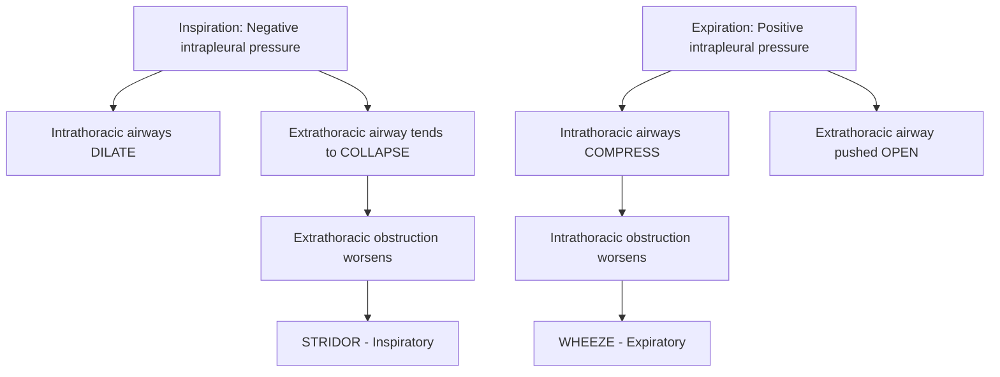
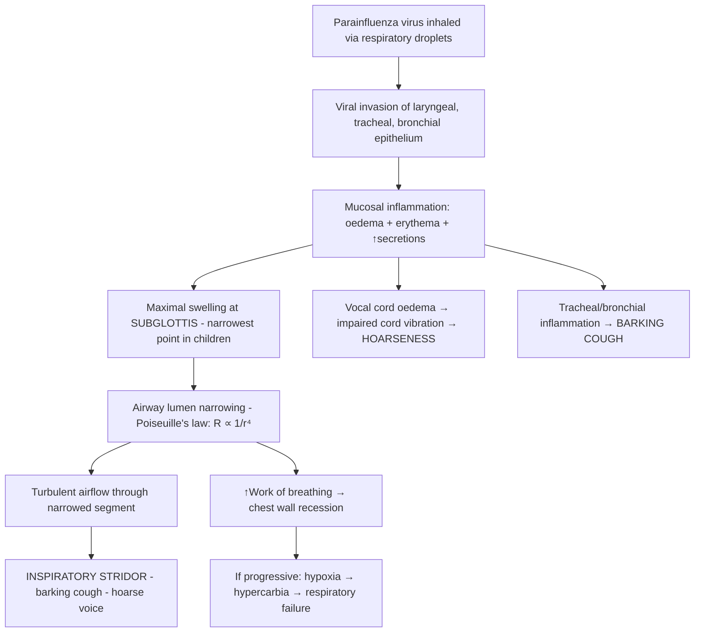

# Acute Stridor in Children

## Definition

**Stridor** is a high-pitched, harsh, monophonic sound produced by turbulent airflow through a narrowed segment of the upper airway (extrathoracic airway — from the nose/pharynx down to and including the trachea). It is a **symptom/sign**, not a diagnosis itself. "Acute stridor" refers to stridor of sudden onset (hours to days), as opposed to chronic/congenital stridor (weeks to months, e.g. laryngomalacia).

Breaking down the word: **"stridor"** derives from Latin *stridere* = "to make a harsh, creaking sound." This perfectly describes what you hear at the bedside.

> The key concept: stridor = turbulent flow through a **partially obstructed upper (extrathoracic) airway**. Complete obstruction → silence (no airflow at all), which is a pre-terminal sign.

---

## Epidemiology

- **Acute stridor is one of the most common paediatric emergencies**, particularly in the 6 months to 6 years age group [1][2].
- ***Viral croup (acute laryngotracheobronchitis) is the most common cause of acute stridor in children*** [1][2], accounting for ~95% of acute stridor presentations.
  - Peak incidence: **6 months – 3 years** (peak ~2 years)
  - Seasonal: late autumn and early winter (parainfluenza virus peaks)
  - Male:Female ≈ 1.4:1
  - Annual incidence ~3% of children < 6 years
- Epiglottitis has become **rare** since the introduction of **Hib (Haemophilus influenzae type b) vaccination** (included in the Hong Kong Childhood Immunisation Programme since 1997/1998). Before vaccination, epiglottitis was a feared cause of acute stridor in 2–4 year olds [2].
- **Foreign body aspiration**: second most common cause to consider in acute-onset stridor, especially in **toddlers (1–3 years)** — the age of oral exploration [1].
- **Anaphylaxis-related laryngeal oedema**: increasing incidence in Hong Kong, with common triggers being food (shellfish, peanuts, cow's milk, eggs) and drugs.
- **Bacterial tracheitis**: rare but serious, post-viral complication; incidence ~0.1/100,000 children/year.

---

## Risk Factors

| Risk Factor | Mechanism / Relevance |
|---|---|
| **Age 6 months – 3 years** | Narrowest subglottic airway (already the narrowest point); small absolute diameter means even 1 mm of mucosal oedema causes proportionally large ↑ resistance |
| **Male sex** | Slightly higher incidence of croup (unclear mechanism, possibly smaller subglottic diameter relative to body size) |
| **Lack of Hib vaccination** | Risk of epiglottitis; rare in HK now but still possible in unvaccinated/under-vaccinated children or those from regions without Hib programmes |
| **History of previous croup** | Recurrent/spasmodic croup more likely in children with atopy or recurrent viral infections |
| **Atopy / allergic diathesis** | Higher risk of recurrent spasmodic croup and anaphylaxis |
| **Prematurity / previous intubation** | Subglottic stenosis (acquired) → predisposition to stridor with any superimposed mucosal swelling |
| **Young age + oral exploration** | Foreign body aspiration risk highest at 1–3 years |
| **Immunodeficiency** | Higher risk of bacterial superinfection (bacterial tracheitis, epiglottitis) |
| **Congenital airway anomalies** | Laryngomalacia, subglottic stenosis, vascular rings — these children are "one viral infection away" from significant stridor |

---

## Anatomy and Function

Understanding stridor requires understanding the **paediatric upper airway anatomy** — and crucially, how it differs from adults.

### Key Anatomical Structures (from superior to inferior)

1. **Nose / Nasopharynx**: Neonates are obligate nasal breathers until ~4–6 months. Nasal obstruction (e.g. choanal atresia, severe rhinitis) can cause stridor-like sounds in neonates.
2. **Oropharynx**: Includes the tongue base and tonsillar tissue. Enlarged tonsils/adenoids can contribute to obstruction.
3. **Supraglottis**: Epiglottis, aryepiglottic folds, false vocal cords. This is where **epiglottitis** and **laryngomalacia** occur.
4. **Glottis**: True vocal cords. Vocal cord paralysis or dysfunction produces stridor here.
5. **Subglottis**: The area just below the vocal cords, bounded by the cricoid cartilage — the **narrowest point of the paediatric airway** (unlike adults, where the narrowest point is the glottis/vocal cords). This is where **croup** causes maximal oedema.
6. **Trachea**: Bacterial tracheitis, external compression (vascular rings, mediastinal masses).

### Paediatric vs Adult Airway Differences

| Feature | Paediatric | Adult | Clinical Significance |
|---|---|---|---|
| **Narrowest point** | ***Subglottis (cricoid ring)*** | Glottis (vocal cords) | Croup oedema at the subglottis has maximum impact in children |
| **Airway shape** | ***Funnel-shaped*** (wider at top, narrow at subglottis) | Cylindrical | Uncuffed ETTs used in young children because cricoid provides a natural "seal" |
| **Absolute diameter** | ~4 mm in neonates, ~5–6 mm at age 1–2 | ~15–20 mm | Poiseuille's law: 1 mm oedema → dramatic ↑ resistance |
| **Epiglottis** | ***Omega (Ω)-shaped, floppy, angled posteriorly*** | Flat, more rigid | Contributes to laryngomalacia; epiglottis harder to lift during laryngoscopy |
| **Cartilage** | Softer, more compliant | Rigid | More prone to dynamic collapse (laryngomalacia, tracheomalacia) |
| **Larynx position** | Higher (C3–C4) | Lower (C5–C6) | Different intubation technique; explains why infants "sniff" to optimise airway |
| **Head size** | Proportionally large occiput | Smaller occiput | Supine position → neck flexion → potential airway compromise |
| **Tongue** | Proportionally large | Proportionally smaller | Tongue falls back more easily → obstruction |
| **Submucosal tissue** | ***Loose, highly vascular submucosa in subglottis*** | Less vascular | Prone to rapid oedema accumulation — explains why croup worsens so quickly |

### The Critical Concept: Poiseuille's Law

> **Resistance to airflow ∝ 1/r⁴** (where r = radius of the airway)

This is the single most important physics concept to understand paediatric stridor.

- In a **neonate** with a 4 mm internal diameter subglottis, **1 mm of circumferential mucosal oedema** reduces the radius from 2 mm to 1 mm → the cross-sectional area drops by **75%** and **resistance increases 16-fold**.
- In an **adult** with a 15 mm diameter, the same 1 mm oedema causes a trivial change.
- This is why croup is a disease of young children — the same virus causing a "sore throat" in an adult causes life-threatening obstruction in a toddler.

<Callout title="Poiseuille's Law – The Core of Paediatric Stridor">
1 mm of mucosal swelling in a 4 mm infant airway increases resistance 16-fold. This single fact explains why viral croup is a paediatric emergency but is virtually non-existent in adults.
</Callout>

### Functional Anatomy: Extrathoracic vs Intrathoracic Dynamics

This concept is essential for understanding **why stridor is inspiratory** [1][2]:

***During inspiration:***
- ***Negative intrapleural pressure is generated by diaphragmatic descent***
- ***This negative pressure is transmitted to the intrathoracic airways → they dilate***
- ***However, the extrathoracic airway (above the thoracic inlet) is exposed to atmospheric pressure → the negative intraluminal pressure during inspiration tends to collapse the extrathoracic airway***
- ***Therefore, extrathoracic obstruction → worse during inspiration → STRIDOR*** [1][2]

***During expiration:***
- ***Positive intrapleural pressure compresses the intrathoracic airways***
- ***Extrathoracic airway is pushed open by the positive intraluminal pressure***
- ***Therefore, intrathoracic obstruction → worse during expiration → WHEEZE*** [1][2]

**Biphasic stridor** = heard in both inspiration and expiration = **fixed obstruction** (e.g. subglottic stenosis, foreign body wedged at the glottis/subglottis, severe croup) — the obstruction is so severe that turbulent flow occurs in both phases.

---

## Aetiology

### Overview of Causes

***Causes of stridor*** [1][2]:

| Category | Causes | Notes |
|---|---|---|
| **Infectious (most common)** | ***Viral laryngotracheobronchitis (croup) — MOST COMMON*** | Parainfluenza 1 & 3 (75%), RSV, influenza, adenovirus, human metapneumovirus |
| | ***Bacterial tracheitis*** | Often S. aureus; post-viral superinfection |
| | ***Epiglottitis*** | H. influenzae type b (now rare due to Hib vaccine), S. aureus, S. pneumoniae, S. pyogenes [2] |
| | Retropharyngeal/peritonsillar abscess | Polymicrobial; commonly Group A Strep + anaerobes |
| | ***Diphtheria*** | Corynebacterium diphtheriae; rare in HK (vaccination) but consider in unvaccinated/immigrants |
| **Foreign body** | ***Foreign body aspiration*** | Peanuts, small toys, coins; sudden onset in well child |
| **Congenital** | ***Laryngomalacia*** | Most common cause of CHRONIC stridor in infants (typically not "acute" but can worsen with URI) |
| | ***Subglottic stenosis*** | Congenital or acquired (post-intubation) |
| | ***External compression (e.g. double aortic arch, vascular ring)*** | Causes fixed stridor, biphasic |
| | Laryngeal web, cyst, haemangioma | Rare |
| **Allergic / Inflammatory** | ***Laryngeal oedema (anaphylaxis)*** | IgE-mediated; rapid onset with urticaria, angioedema, wheeze, hypotension |
| | ***Inhalation of hot fumes / caustic substances*** | Thermal/chemical burn to upper airway |
| | Angioedema (hereditary or acquired) | C1-esterase inhibitor deficiency |
| **Traumatic** | ***Throat trauma*** | Blunt or penetrating; post-intubation laryngeal oedema |
| | Post-procedural (post-extubation stridor) | Common in PICU |
| **Other** | ***Severe lymph node swelling*** | Cervical lymphadenitis, lymphoma |
| | ***Hypocalcaemia (laryngospasm)*** | Low ionised Ca²⁺ → neuromuscular irritability → vocal cord spasm [2][3] |
| | ***Vocal cord dysfunction/paralysis*** | Unilateral → hoarseness; bilateral → stridor + dyspnoea [3] |
| | Recurrent (spasmodic) croup | Atopy-related, without viral prodrome |
| | Psychogenic stridor | Adolescents; paradoxical vocal fold motion |

### Focus on the Major Causes Relevant to Hong Kong

#### 1. Viral Croup (Acute Laryngotracheobronchitis) — The Most Common Cause

- **Microbiology**: ***Parainfluenza virus types 1 and 3*** (account for ~75%), followed by RSV, influenza A/B, adenovirus, human metapneumovirus, rhinovirus, enterovirus, SARS-CoV-2 [1][2]
- **Seasonality**: Late autumn to early winter in Hong Kong (October–December) coinciding with parainfluenza peaks
- **Age**: ***6 months – 6 years*** (peak ~2 years); rare before 6 months (maternal antibodies) and after 6 years (airway has grown)
- **Pathophysiology**:
  1. Virus enters via respiratory droplets → infects mucosa of the **larynx, trachea, and bronchi** (hence "laryngo-tracheo-bronchitis")
  2. Inflammatory response → **mucosal oedema, erythema, and increased secretions**, maximal at the **subglottis** (the narrowest point)
  3. Subglottic oedema → airway narrowing → turbulent airflow → **inspiratory stridor**
  4. Oedema of the vocal cords → **hoarse voice / barking cough** (the "seal-bark" cough is pathognomonic)
  5. In severe cases, narrowing is so critical → biphasic stridor, ↑work of breathing, hypoxia

#### 2. Acute Epiglottitis (Supraglottitis)

- ***Epidemiology: typically occur in 2–4 years*** [2]
- ***Microbiology: H. influenzae, S. aureus, S. pneumoniae, S. pyogenes*** [2]
- **Pathophysiology**:
  1. Bacterial infection → intense inflammation and oedema of the **epiglottis and aryepiglottic folds** (supraglottic structures)
  2. The epiglottis swells massively ("cherry-red") → acts like a ball-valve over the laryngeal inlet
  3. Rapid progression over hours → risk of **complete airway obstruction**
  4. Unlike croup (subglottic), epiglottitis is **supraglottic** → the cough is absent/mild (vocal cords not primarily involved), but swallowing is severely affected (epiglottis is a critical structure for swallowing → ***drooling, dysphagia***)

#### 3. Foreign Body Aspiration

- **Epidemiology**: Peak at 1–3 years; peanuts and small round foods are the most common culprits in Hong Kong
- **Pathophysiology**:
  - If lodged in the **larynx/subglottis** → acute stridor (extrathoracic obstruction)
  - If lodged in a **bronchus** (more common) → unilateral wheeze, air trapping, or lobar collapse
  - ***Right main bronchus*** is more commonly affected (wider, more vertical)
  - If complete obstruction → choking, cyanosis, respiratory arrest
- **Key feature**: Sudden onset in a previously well child, often **witnessed choking episode**

#### 4. Bacterial Tracheitis

- **Microbiology**: Most commonly ***S. aureus***, also *Moraxella catarrhalis*, *H. influenzae*, *S. pneumoniae*
- **Pathophysiology**: Usually a **secondary bacterial infection** superimposed on preceding viral croup → purulent exudate and pseudomembranes within the trachea → worsening airway obstruction
- **Clinical clue**: A child with "croup that doesn't respond to treatment" and develops **high fever and toxicity** after initial improvement

#### 5. Retropharyngeal Abscess

- **Age**: Typically < 6 years (because retropharyngeal lymph nodes — nodes of Rouvière — involute by ~6 years)
- **Microbiology**: Group A Streptococcus, S. aureus, anaerobes (polymicrobial)
- **Pathophysiology**: Suppurative infection of retropharyngeal space → mass effect on posterior pharyngeal wall → airway compromise + neck stiffness + dysphagia

#### 6. Anaphylaxis

- **Pathophysiology**: IgE-mediated mast cell/basophil degranulation → massive histamine/leukotriene release → **laryngeal oedema** (stridor), **bronchospasm** (wheeze), vasodilation (hypotension), urticaria/angioedema [4]
- Common triggers in HK children: shellfish, peanuts, cow's milk, eggs, drugs (β-lactams)

#### 7. Spasmodic (Recurrent) Croup

- ***"Recurrent spasmodic croup"*** [1]
- **Pathophysiology**: Sudden nocturnal onset of "croupy" stridor **without viral prodrome or fever** — thought to be **allergic/atopic** mechanism causing subglottic oedema
- Rapid resolution (within hours); tends to recur

---

## Relevant Classification

### A. By Timing of Stridor Phase

| Phase | Location of Obstruction | Explanation |
|---|---|---|
| **Inspiratory stridor** | Extrathoracic (supraglottic, glottic, subglottic) | Negative inspiratory pressure collapses already narrowed extrathoracic airway |
| **Expiratory stridor** | Intrathoracic (lower trachea, bronchi) | Positive expiratory pressure compresses already narrowed intrathoracic airway |
| **Biphasic stridor** | Fixed/severe obstruction at glottis/subglottis | Obstruction is so critical that turbulent flow occurs in both phases |

### B. By Anatomical Level

| Level | Examples |
|---|---|
| **Supraglottic** | Epiglottitis, retropharyngeal abscess, peritonsillar abscess, lingual thyroid, vallecular cyst |
| **Glottic** | Vocal cord paralysis, laryngeal web, laryngeal papillomatosis |
| **Subglottic** | Croup (most common), subglottic stenosis, haemangioma, bacterial tracheitis |
| **Tracheal** | Foreign body, vascular ring, tracheomalacia, external compression (lymph node, tumour) |

### C. By Acuity

| Acuity | Examples |
|---|---|
| **Acute (hours–days)** | Croup, epiglottitis, foreign body, anaphylaxis, bacterial tracheitis, retropharyngeal abscess |
| **Chronic/Recurrent (weeks–months)** | Laryngomalacia, subglottic stenosis, vascular ring, haemangioma, papillomatosis, vocal cord paralysis |
| **Acute-on-chronic** | Child with laryngomalacia who gets a viral URI → worsening stridor |

### D. By Severity

***Severity assessment*** [1][2]:

| Parameter | Mild | Moderate | Severe | Imminent Respiratory Failure |
|---|---|---|---|---|
| ***Stridor*** | ***None or only on crying/agitation*** | ***At rest (intermittent)*** | ***At rest (continuous) or biphasic*** | ***May become quiet (ominous — no airflow)*** |
| ***Chest wall recession*** | ***None or only on crying*** | ***At rest (mild/moderate)*** | ***At rest (severe — subcostal, intercostal, sternal)*** | ***Paradoxical chest movement*** |
| **Air entry** | Normal | Mildly decreased | Significantly decreased | Barely audible |
| **Colour** | Normal | Normal | May be pale | Cyanotic |
| **Consciousness** | Normal, playful | Restless when disturbed | Agitated, distressed | Lethargic / obtunded |
| **SpO₂** | > 95% | > 92% | < 92% | < 90% |
| **Feeding** | Normal | Reduced | Unable | N/A |

<Callout title="Beware the 'Quiet' Child" type="error">
A child with severe stridor who suddenly becomes quiet and drowsy is NOT improving — they may be developing respiratory muscle fatigue and impending complete obstruction. The disappearance of stridor with worsening clinical state (↓consciousness, cyanosis, poor effort) = **pre-terminal sign**. Act immediately.
</Callout>

---

## Pathophysiology — Integrated Understanding

Let's trace the pathophysiology step-by-step for the most common scenario (viral croup), then generalise:

### Viral Croup — Pathophysiological Cascade

### General Principles of Stridor Pathophysiology

1. **Any process that narrows the extrathoracic airway** → turbulent inspiratory airflow → stridor
2. The degree of narrowing determines severity:
   - Mild narrowing → stridor only with increased flow (crying, agitation)
   - Moderate → stridor at rest
   - Severe → biphasic stridor (obstruction critical enough that turbulence occurs in both directions)
   - Near-complete → silent chest (insufficient flow to generate sound)
3. **Compensatory mechanisms**:
   - ↑Respiratory rate → attempt to maintain minute ventilation
   - ↑Inspiratory effort → **more negative intrathoracic pressure** → **more chest wall recession** (subcostal, intercostal, suprasternal, sternal retraction) — this is the child's respiratory muscles working harder
   - ↑Sympathetic drive → tachycardia, agitation
4. **Decompensation**:
   - Respiratory muscle fatigue → ↓effort → diminishing stridor (bad sign!)
   - Hypoxaemia → bradycardia (in children, bradycardia is a **pre-arrest** rhythm)
   - Hypercarbia → altered consciousness → further airway collapse

---

## Clinical Features

### A. Symptoms (What the Parent/Child Reports)

| Symptom | Pathophysiological Basis | Specific Conditions |
|---|---|---|
| ***Barking / croupy cough*** | Subglottic oedema alters the vibration characteristics of air passing through the narrowed subglottis → produces the characteristic "seal-bark" sound | ***Viral croup, recurrent spasmodic croup*** [1][2] |
| ***Hoarseness / change in voice*** | Inflammation and oedema of the **vocal cords (glottis)** → altered vocal cord vibration → hoarse cry/voice | ***Croup (hoarse)*** [2]; ***Epiglottitis ("hot-potato" / muffled voice)*** [2] — muffling is supraglottic, not glottic |
| **Noisy breathing (stridor)** | Turbulent airflow through narrowed upper airway segment | All causes |
| ***Preceding coryzal symptoms (runny nose, sneezing, mild cough)*** | Viral prodrome before laryngeal involvement | ***Croup (gradual onset over days)*** [2] |
| ***Difficulty swallowing (dysphagia) and drooling*** | Supraglottic swelling (epiglottis and aryepiglottic folds) makes swallowing painful/impossible → saliva pools and drools | ***Epiglottitis*** [2], retropharyngeal abscess |
| ***Sore throat*** | Pharyngeal/supraglottic inflammation | Epiglottitis, retropharyngeal abscess, peritonsillar abscess |
| **Sudden choking/gagging episode** | Foreign body impacts in the airway → triggers cough reflex and acute obstruction | Foreign body aspiration |
| **Difficulty breathing / breathlessness** | Narrowed airway → ↑work of breathing → subjective dyspnoea; in young children, parents report "struggling to breathe" | All causes (severity-dependent) |
| ***High fever (> 38.5°C)*** | Bacterial infection with systemic inflammatory response | ***Epiglottitis***, bacterial tracheitis, retropharyngeal abscess |
| **Fever (absent to moderate)** | Viral infection → cytokine-mediated fever response | Croup (variable — often low-grade or absent) |
| ***Rapid onset over hours*** | Rapid bacterial proliferation and intense inflammatory response | ***Epiglottitis (onset over hours)*** [2] |
| ***Gradual onset over days*** | Viral replication takes longer; insidious mucosal swelling | ***Croup (onset over days)*** [2] |
| **Nocturnal worsening** | Physiological factors: (1) ↑cortisol dip at night → less anti-inflammatory effect, (2) supine position → pooling of secretions, (3) cool night air — all worsen subglottic oedema | Croup, spasmodic croup |
| ***Refusal to eat/drink*** | Pain on swallowing (supraglottic pathology) or respiratory distress so severe that feeding is impossible | ***Epiglottitis (unable to drink)*** [2] |
| **Urticaria, swelling of lips/face** | IgE-mediated mast cell degranulation → histamine → vascular permeability → angioedema | Anaphylaxis |

### B. Signs (What You Observe on Examination)

| Sign | Pathophysiological Basis | Specific Conditions |
|---|---|---|
| ***Inspiratory stridor*** | Turbulent airflow through narrowed **extrathoracic** airway worsened by negative inspiratory pressure collapsing the already compromised segment | All causes of extrathoracic obstruction |
| **Biphasic stridor** | Fixed / very severe obstruction → turbulent flow in both inspiration and expiration | Severe croup, subglottic stenosis, fixed foreign body at glottis/subglottis |
| ***Chest wall recession (subcostal, intercostal, suprasternal, sternal)*** | Increased negative intrathoracic pressure generated to overcome high airway resistance → visible indrawing of compliant chest wall | All causes; severity correlates with degree of obstruction; ***graded: none → on crying → at rest*** [1][2] |
| **Tracheal tug** | Severe negative intrathoracic pressure during inspiration pulls the trachea downward | Severe upper airway obstruction |
| ***Ill-looking / toxic appearance*** | Systemic bacterial infection → cytokines → SIRS | ***Epiglottitis ("ill-looking appearance")*** [2], bacterial tracheitis |
| ***Sniffing / tripod position*** | ***Sitting with trunk leaning forward, neck hyperextended with chin up, mouth open, bracing on arms — maximises diameter of obstructed supraglottic airway by displacing the tongue and epiglottis anteriorly*** [2] | ***Epiglottitis*** [2]; severe upper airway obstruction |
| ***Drooling saliva*** | Inability or refusal to swallow due to severe pain/swelling of supraglottic structures | ***Epiglottitis*** [2], retropharyngeal abscess |
| ***"Hot-potato" / muffled voice*** | Supraglottic oedema (swollen epiglottis and aryepiglottic folds) changes resonance of the oropharynx, producing a muffled quality — like speaking with a hot potato in the mouth | ***Epiglottitis*** [2] |
| **Barking cough** (heard on examination) | Subglottic narrowing alters cough acoustics → harsh, "seal-bark" quality | Croup |
| ***Absent or slight cough*** | Epiglottitis is **supraglottic** — the subglottis/vocal cords are relatively spared, so the cough reflex is not prominently triggered | ***Epiglottitis*** [2] |
| **Tachypnoea** | Compensatory ↑respiratory rate to maintain minute ventilation despite obstructed airflow | All causes (severity-dependent) |
| **Tachycardia** | Sympathetic activation due to hypoxia, distress, and ↑work of breathing | All causes |
| **Cyanosis** | SpO₂ < 85% (peripheral) or severe hypoxaemia → deoxyhaemoglobin > 5g/dL → visible blue discolouration of lips, tongue, peripheries | Severe/late obstruction — **pre-terminal** |
| **Decreased air entry on auscultation** | Severely narrowed airway → reduced tidal volume → less airflow reaching lower airways | All causes |
| ***Restlessness → agitation → lethargy*** | Hypoxia → cerebral agitation; progressive hypercarbia → CNS depression → lethargy/obtundation | All causes (progression sign) |
| **Unilateral decreased breath sounds / focal wheeze** | Foreign body lodged in one bronchus → ball-valve effect with air trapping or complete occlusion | Foreign body aspiration (bronchial) |
| **Neck swelling / lymphadenopathy** | Suppurative cervical lymphadenitis or retropharyngeal abscess → visible/palpable mass → external compression of airway | Retropharyngeal abscess, severe lymphadenitis |
| **"Neck stiffness" / torticollis** | Retropharyngeal inflammation causes reflex spasm of paraspinal/prevertebral muscles; child holds neck extended or tilted | Retropharyngeal abscess |
| **Pulsus paradoxus** (↓SBP > 10 mmHg during inspiration) | Exaggerated negative intrathoracic pressure during inspiration against obstruction → ↓LV output → ↓BP during inspiration | Severe upper airway obstruction |
| **Paradoxical (see-saw) breathing** | Extreme negative intrathoracic pressure → chest wall retracts while abdomen protrudes during inspiration (diaphragm descends but chest wall is pulled in) | Imminent respiratory failure |

<Callout title="The 4 Ds of Epiglottitis" type="idea">
***Look for the 4Ds of epiglottitis: Dysphonia, Distress, Drooling, Dysphagia*** [2]. This mnemonic helps distinguish epiglottitis from croup at the bedside. A fifth "D" sometimes added is "Death" — emphasising the urgency.
</Callout>

### C. Key Distinguishing Features — Croup vs Epiglottitis

This is a **classic exam comparison** [2]:

| Feature | ***Croup*** | ***Epiglottitis*** |
|---|---|---|
| ***Aetiology*** | ***Viral (± preceding coryza)*** | ***Bacterial*** |
| ***Onset*** | ***Gradual (over days)*** | ***Acute (over hours)*** |
| ***Appearance*** | ***Mild to moderate*** | ***Toxic, very ill*** |
| ***Fever*** | ***Absent to high*** | ***High*** |
| ***Cough*** | ***Severe, barking*** | ***Absent or slight*** |
| ***Stridor*** | ***Harsh, rasping*** | ***Soft, whispering*** |
| ***Voice/cry*** | ***Hoarse*** | ***Muffled (hot-potato)*** |
| ***Able to drink*** | ***Able*** | ***Unable*** |
| ***Drooling saliva*** | ***N/A*** | ***Yes*** |
| **Position** | Any (often supine) | ***Sniffing/tripod position*** |
| **Imaging** | "Steeple sign" on AP neck XR | ***"Thumb sign" on lateral neck XR*** |
| **Age** | 6 months – 6 years | ***2–4 years (pre-Hib vaccine era)*** |

<Callout title="Exam Pearl: Croup vs Epiglottitis" type="error">
Do NOT confuse the two! Croup = gradual, barking cough, hoarse, viral, can drink. Epiglottitis = acute, toxic, drooling, can't drink, muffled voice, bacterial. ***For epiglottitis: no manipulation (throat exam, neck XR, IV placement) should be done before securing the airway, as these may precipitate complete obstruction*** [2].
</Callout>

---

## Important Contextual Points for Hong Kong

1. **Hib vaccination** (introduced 1997/98 in HK) has dramatically reduced epiglottitis. However, non-typeable *H. influenzae* and other organisms (S. aureus, S. pneumoniae, S. pyogenes) can still cause it [2].
2. **Diphtheria** is rare in HK due to DTP/DTaP vaccination but must be considered in:
   - Unvaccinated children
   - Children from endemic areas (Southeast Asia, South Asia, sub-Saharan Africa)
   - Clue: "bull-neck" appearance, grey pseudomembrane in the pharynx
3. **Foreign body aspiration** with peanuts/small foods remains common — Hong Kong dietary culture includes many small, round foods (fish balls, grapes, nuts) that pose aspiration risk in toddlers.
4. **Anaphylaxis**: HK data shows increasing prevalence of food allergy in children; shellfish is a particularly common trigger in the local population.

---

## Summary Table: Common Causes of Acute Stridor by Key Features

| Cause | Age Peak | Onset | Fever | Cough | Voice | Drool | Toxic | Position |
|---|---|---|---|---|---|---|---|---|
| **Croup** | 6m–6y | Days | Low/absent | Barking | Hoarse | No | No | Any |
| **Epiglottitis** | 2–4y | Hours | High | Minimal | Muffled | Yes | Yes | Tripod |
| **Bacterial tracheitis** | 6m–8y | Days then acute | High | Productive | Variable | No | Yes | Any |
| **Retropharyngeal abscess** | < 6y | Days | High | Variable | Muffled | Yes | Yes | Extended neck |
| **Foreign body** | 1–3y | Seconds | None | Choking then variable | Variable | No | No | Any |
| **Anaphylaxis** | Any | Minutes | None | Variable | Swollen | Yes/No | Variable | Any |
| **Spasmodic croup** | 1–3y | Minutes (night) | None | Barking | Hoarse | No | No | Any |

---

<Callout title="High Yield Summary">

1. **Stridor = turbulent airflow through a narrowed extrathoracic airway** — it is inspiratory because negative inspiratory pressure collapses the already compromised extrathoracic segment.

2. **Poiseuille's law (R ∝ 1/r⁴)** is the reason stridor is a paediatric disease — 1 mm oedema in a 4 mm infant subglottis increases resistance 16-fold.

3. **Viral croup is the #1 cause** of acute stridor in children (parainfluenza 1 & 3; ages 6m–6y; barking cough, hoarse voice, gradual onset).

4. **Epiglottitis** is a **paediatric emergency** — 4Ds: ***Dysphonia, Distress, Drooling, Dysphagia***; toxic-appearing child in tripod position; **do NOT examine throat before securing airway**.

5. **Severity assessment** is based on: degree of stridor (none → crying → rest → biphasic → silent), chest wall recession, air entry, consciousness, and SpO₂.

6. **Disappearing stridor with worsening clinical state = impending respiratory arrest** — the child is too tired to generate turbulent flow.

7. **Croup vs Epiglottitis**: Croup = viral, gradual, barking cough, hoarse, can drink. Epiglottitis = bacterial, rapid, no cough, muffled voice, drooling, can't drink, toxic.

8. **Foreign body**: sudden onset in a well child, often witnessed choking episode; right main bronchus is more commonly affected.

9. In HK, **Hib vaccination has made epiglottitis rare** but not eliminated — always consider in unvaccinated children or atypical presentations.

10. **Narrowest point** of the paediatric airway = **subglottis (cricoid ring)** — this is why croup targets the subglottis in children.

</Callout>

---

<ActiveRecallQuiz
  title="Active Recall - Acute Stridor in Children"
  items={[
    {
      question: "Why is stridor predominantly inspiratory in extrathoracic airway obstruction? Explain using airway dynamics.",
      markscheme: "During inspiration, negative intrapleural pressure is generated. This dilates intrathoracic airways but tends to collapse the extrathoracic airway (which is exposed to atmospheric pressure). If the extrathoracic airway is already narrowed, this collapsing force worsens the obstruction, producing turbulent inspiratory airflow = stridor. During expiration, positive pressure splints the extrathoracic airway open."
    },
    {
      question: "A 2-year-old presents with 2-day history of runny nose, barking cough, hoarse voice, and inspiratory stridor at rest. What is the most likely diagnosis, the causative organism, and the key anatomical site of pathology?",
      markscheme: "Viral croup (acute laryngotracheobronchitis). Most likely organism: Parainfluenza virus type 1 or 3. Key site: subglottic region - the narrowest point of the paediatric airway, where mucosal oedema has maximal effect per Poiseuille's law."
    },
    {
      question: "List the 4Ds of epiglottitis and explain why each occurs based on the anatomy of the disease.",
      markscheme: "Dysphonia (muffled/hot-potato voice - supraglottic swelling alters oropharyngeal resonance), Distress (rapidly progressive airway obstruction), Drooling (pain/inability to swallow due to swollen epiglottis and aryepiglottic folds), Dysphagia (same mechanism as drooling - supraglottic structures critical for swallowing are inflamed)."
    },
    {
      question: "Using Poiseuille's law, calculate the fold-increase in airway resistance when 1 mm circumferential oedema occurs in a 4 mm neonatal subglottis vs a 15 mm adult airway.",
      markscheme: "R is proportional to 1/r to the fourth power. Neonate: radius 2mm to 1mm, so resistance increases by (2/1) to the fourth = 16-fold. Adult: radius 7.5mm to 6.5mm, so resistance increases by (7.5/6.5) to the fourth = approximately 1.8-fold. Hence, the same 1 mm oedema is trivial in adults but catastrophic in neonates."
    },
    {
      question: "A child with croup who initially had loud stridor now becomes quiet, drowsy, and has reduced chest wall recession. Is this improvement or deterioration? Explain.",
      markscheme: "This is DETERIORATION, not improvement. Disappearing stridor with decreasing consciousness and reduced chest wall recession indicates respiratory muscle fatigue and impending complete airway obstruction. The child can no longer generate sufficient airflow to produce audible stridor. This is a pre-terminal sign requiring immediate intervention."
    },
    {
      question: "Why is epiglottitis now rare in Hong Kong, and what organisms can still cause it?",
      markscheme: "Hib (Haemophilus influenzae type b) vaccination was introduced in HK in 1997-1998, dramatically reducing the incidence of epiglottitis (previously the most common cause). However, non-typeable H. influenzae, S. aureus, S. pneumoniae, and S. pyogenes can still cause epiglottitis in vaccinated children."
    }
  ]}
/>

---

## References

[1] Lecture slides: GC 141. A child with cough acute and chronic cough in children.pdf (p15)
[2] Senior notes: Adrian Lui Pediatrics.pdf (p155, p162)
[3] Senior notes: Ryan Ho Endocrine.pdf (p5, p22)
[4] Senior notes: Ryan Ho Rheumatology.pdf (p145)
