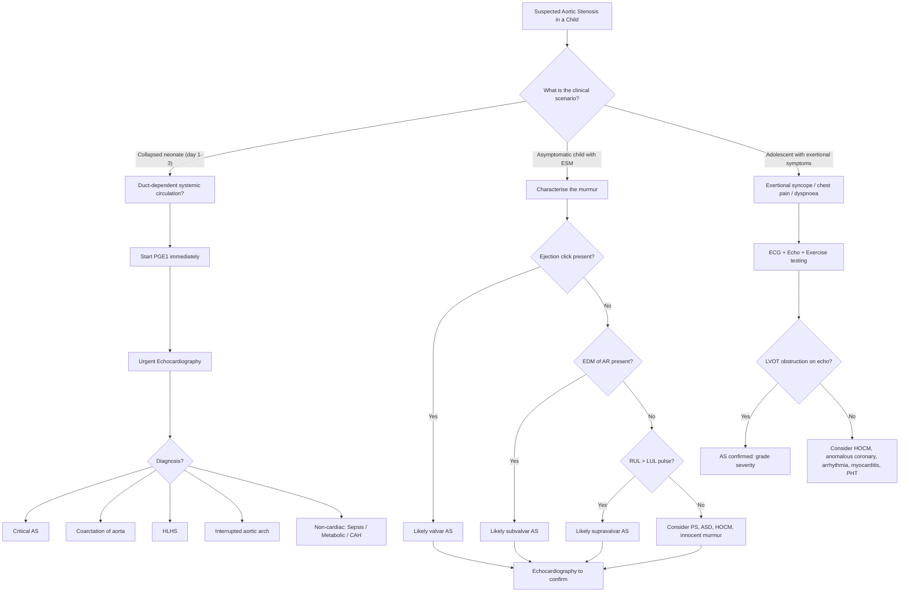

## Differential Diagnosis of Aortic Stenosis in Children

The approach to the differential diagnosis of paediatric aortic stenosis depends entirely on the **clinical presentation**. A neonate in shock presents a completely different diagnostic challenge from an asymptomatic school-age child found to have a murmur. Let's think through this systematically by presentation.

---

### Organising Framework: Three Clinical Scenarios

In practice, you will encounter a child with suspected AS in one of three ways:

1. **Collapsed neonate (day 1–3 of life)** — the differential is "duct-dependent systemic circulation" (LVOT obstruction group)
2. **Asymptomatic child with an ejection systolic murmur** — the differential is "causes of ESM in a child"
3. **Older child/adolescent with exertional symptoms** (angina, syncope, exercise intolerance) — the differential is "causes of exertional cardiac symptoms in youth"

We will address each systematically.

---

### Scenario 1: The Collapsed Neonate — Differential of Duct-Dependent Systemic Circulation

This is the most critical scenario. A neonate who was well at birth deteriorates around **day 2–3** (when the ductus arteriosus closes). The presentation is shock: pallor, tachycardia, weak pulses, poor perfusion, metabolic acidosis, oliguria.

***Left ventricular outflow obstruction*** encompasses three main lesions that present this way [1]:

1. ***Coarctation or interruption of the aorta***
2. ***Critical aortic stenosis***
3. ***Aortic atresia (hypoplastic left heart syndrome)***

All three share the fundamental pathophysiology: the LV cannot deliver adequate systemic output → the RV supports the systemic circulation via the PDA → when the PDA closes, systemic perfusion collapses catastrophically.

| Condition | Key Distinguishing Features | Why This Feature Occurs |
|---|---|---|
| ***Critical aortic stenosis*** [1][2] | ***Thickened and fused aortic cusps*** on echo [1]; unicuspid valve with pinhole opening; LV may still be of reasonable size; ***RV impulse*** (RV supporting systemic circulation via PDA); absent/soft murmur | The valve is present but severely stenotic — blood can trickle through but not enough to sustain systemic output. The LV is present and may be hypertrophied but dysfunctional. |
| ***Coarctation of aorta (CoA)*** [2][3] | ***Weak lower limb pulses*** (the only reliable sign before ductal closure [3]); radiofemoral delay (in non-duct-dependent presentation); ***ESM at LUSB radiating to left interscapular region*** [3]; association with ***Turner syndrome*** and ***bicuspid aortic valve*** [3] | Discrete narrowing at the aortic isthmus (site of ductal insertion) blocks flow to the descending aorta. Upper body perfusion may be preserved initially, but lower body depends on PDA flow. |
| ***Hypoplastic left heart syndrome (HLHS)*** | Entire left heart is hypoplastic (LV, MV, AV, ascending aorta); single S2 (no A2); cyanosis may be present; echo is diagnostic showing diminutive LV cavity | The LV is too small to function — all systemic output comes from the RV via PDA. This is the most severe end of the spectrum. |
| ***Interrupted aortic arch (IAA)*** | Complete discontinuity of aortic arch (usually between left carotid and left subclavian); ***associated with DiGeorge syndrome (22q11.2 deletion)*** [2]; absent femoral pulses from birth | Unlike CoA where there is a narrowing, here there is a complete gap in the arch. The descending aorta is entirely duct-dependent from birth. |

<Callout title="Critical Distinction" type="error">
All four conditions present **identically** as a collapsed neonate with shock. You **cannot distinguish them clinically** at the bedside with certainty — **echocardiography is mandatory** to make the specific diagnosis. However, the **initial management is the same for all**: ***PGE1 infusion*** to reopen the ductus arteriosus while awaiting definitive assessment. Never delay PGE1 to wait for echo in a suspected duct-dependent lesion.
</Callout>

**Non-cardiac differentials** of the collapsed neonate that must also be considered:

| Condition | How to Distinguish from Duct-Dependent CHD |
|---|---|
| **Neonatal sepsis** | Fever or hypothermia; risk factors (prolonged ROM, maternal GBS, prematurity); positive blood culture; elevated CRP/procalcitonin; normal echo |
| **Metabolic crisis** (e.g., inborn errors of metabolism — organic acidaemias, urea cycle defects) | Abnormal metabolic screen (ammonia, lactate, organic acids, amino acids); may have hyperammonaemia, severe acidosis out of proportion to haemodynamic status; normal echo |
| **Congenital adrenal hyperplasia (CAH)** — salt-wasting crisis | Ambiguous genitalia (in females); hyperkalaemia with hyponatraemia; elevated 17-OHP; normal echo |
| **Non-accidental injury / child abuse** | Bruising, retinal haemorrhages; inconsistent history; skeletal survey may show fractures |

> **Exam Pearl**: The mnemonic for neonatal collapse is **"The 5 Hs"**: **H**eart (duct-dependent CHD), **H**ypoglycaemia, **H**ypovolaemia (bleeding/dehydration), **H**ereditary metabolic disease, and **H**ormonal (CAH). Always get an **echo, blood gas, glucose, electrolytes, and blood culture** in any collapsed neonate.

---

### Scenario 2: The Asymptomatic Child with an Ejection Systolic Murmur

This is the most common presentation of paediatric AS — the child is well but a murmur is heard on routine examination. The differential here is essentially: **"What causes an ESM in a child?"**

#### Innocent (Functional) Murmurs vs. Pathological Murmurs

Most murmurs in children are **innocent**. These must be distinguished from the ESM of AS.

| Feature | Innocent Murmur | AS Murmur |
|---|---|---|
| Intensity | Usually ≤ grade 2/6 | Often ≥ grade 3/6, may have thrill |
| Quality | Soft, vibratory, musical ("Still's murmur") | Harsh, "saw-cutting-wood" quality [4] |
| Radiation | Does not radiate to neck | ***Radiates to bilateral neck*** [2] |
| Ejection click | Absent | ***Present in valvar AS*** [2] |
| S2 | Normal | ***Delayed/absent A2 in severe AS*** [2] |
| Pulse character | Normal | ***Slow-rising, anacrotic in severe AS*** [2] |
| Changes with position | Varies with position (louder supine, softer sitting) | Relatively fixed |
| Associated signs | None (no thrill, no heave, no cyanosis) | May have LV heave, suprasternal thrill |

#### Pathological Causes of ESM in Children

| Condition | Location of Murmur | Key Distinguishing Features | Pathophysiological Basis |
|---|---|---|---|
| ***Valvar AS*** [2] | ***LMSB to RUSB, radiating to bilateral neck*** | ***Ejection click; delayed/absent A2; slow-rising pulse*** | Turbulent flow across stenotic AV |
| ***Subvalvar AS*** [2] | Similar to valvar but slightly lower | ***No ejection click; no change in A2; commonly a/w EDM of AR*** | Turbulent flow across subaortic membrane/ridge; jet damages AV |
| ***Supravalvar AS*** [2] | RUSB, may radiate to neck | ***No ejection click; no change in A2; RUL pulse > LUL pulse; Elfin facies (Williams syndrome)*** | Turbulent flow across supravalvar narrowing; Coanda effect |
| **Pulmonary stenosis (PS)** | ***LUSB*** (left upper sternal border) | Ejection click (if valvar PS); wide split S2 with soft P2; RV heave; associated with ***Noonan syndrome*** [2] | Turbulent flow across stenotic PV — mirror image of AS but on the right side |
| **Atrial septal defect (ASD)** | LUSB | Wide **fixed** split S2 (pathognomonic); soft ESM from relative PS (increased flow across PV); no thrill | L→R shunt at atrial level → increased RV volume → increased flow across normal PV → relative/flow PS |
| **Ventricular septal defect (VSD)** | LLSB | **Pansystolic** (not ejection systolic) — but small muscular VSDs can have a short ESM; thrill at LLSB | Direct shunt from high-pressure LV to lower-pressure RV through the defect |
| **Hypertrophic obstructive cardiomyopathy (HOCM)** [2] | LLSB to apex | ***Dynamic obstruction — murmur increases on standing/Valsalva*** (decreased preload worsens obstruction); jerky pulse [4]; may have SAM of MV on echo | ***ASH in HOCM*** [2] causes dynamic subaortic obstruction — unlike fixed AS, it varies with loading conditions |
| **Aortic sclerosis** (primarily adult) | RUSB | Normal pulse volume and character; intact S2; no LVH [4] | Valve thickening without significant obstruction — turbulence without gradient |
| **Flow murmur** (high-output states) | Any area | Anaemia, fever, thyrotoxicosis, pregnancy; no structural heart disease on echo | Increased cardiac output → increased flow velocity → turbulence across normal valves |

#### Distinguishing the Three Levels of AS from Each Other

This is a common exam question. The table below summarises the key discriminators (reproduced from the Aetiology section for completeness in the DDx context):

| Feature | ***Valvar AS*** | ***Subvalvar AS*** | ***Supravalvar AS*** |
|---|---|---|---|
| ***Ejection click*** | ***Present*** | ***Absent*** | ***Absent*** |
| ***A2*** | ***Delayed/absent (severe)*** | ***Normal*** | ***Normal*** |
| ***AR (EDM)*** | Late | ***Common and early*** | Uncommon |
| ***RUL > LUL pulse*** | No | No | ***Yes*** |
| ***Syndrome*** | ***Turner*** | HOCM (familial) | ***Williams (Elfin facies)*** |
| Post-stenotic dilatation on CXR | Yes | Less common | Less common |

---

### Scenario 3: Older Child/Adolescent with Exertional Symptoms

An adolescent presenting with ***exertional dyspnoea, chest pain, syncope, or sudden cardiac death*** [2] raises a different differential — essentially "causes of exertional cardiac compromise in young people":

| Condition | Key Features | How to Distinguish from AS |
|---|---|---|
| **AS (valvar/subvalvar/supravalvar)** | Known murmur; ejection click; slow-rising pulse; ECG shows LVH | Echo confirms level and severity of obstruction |
| **HOCM** | Family history of sudden death; ***jerky pulse*** (rapid upstroke then obstruction); ***murmur increases with Valsalva/standing*** [4]; thick septum on echo with SAM | Dynamic obstruction (louder with ↓preload) vs. fixed obstruction in AS (no change) |
| **Anomalous coronary artery origin** (e.g., ALCAPA, anomalous LCA from right sinus) | Exertional chest pain/syncope/SCD in otherwise normal heart; no murmur; normal pulse | Echo/CT angiography shows abnormal coronary origin; no valvular abnormality |
| **Arrhythmogenic conditions** (Long QT, Brugada, WPW, catecholaminergic polymorphic VT) | Syncope/SCD during exercise or emotional stress; may have palpitations; often family Hx of sudden death | ECG shows prolonged QT/delta wave/Brugada pattern; echo is normal |
| **Myocarditis / Dilated cardiomyopathy** | Recent viral illness; heart failure symptoms; may have gallop rhythm; globally dilated, poorly contracting LV on echo | No LVOT obstruction; global dysfunction rather than hypertrophy |
| **Pulmonary hypertension** | Exertional dyspnoea, syncope; loud P2; RV heave; cyanosis may develop | Echo shows elevated RV pressures; no LVOT pathology |
| **Severe pulmonary stenosis** | Exertional dyspnoea; RV heave; ESM at ***LUSB*** (not RUSB); ejection click; wide split S2 with soft P2 | Right-sided rather than left-sided obstruction; echo confirms PS |
| **Eisenmenger syndrome** | History of known L→R shunt (VSD, PDA); progressive cyanosis; clubbing; loud P2 | Bidirectional or R→L shunt on echo; irreversible pulmonary vascular disease |

---

### Diagnostic Approach Algorithm

---

### Special Differential: Heyde Syndrome (Brief Mention)

While primarily relevant in adults with degenerative calcific AS, **Heyde syndrome** (the association of AS with gastrointestinal angiodysplasia and acquired von Willebrand disease type 2A) is worth knowing for completeness [5]. The high shear stress across the stenotic valve destroys large von Willebrand factor multimers → acquired bleeding diathesis → GI bleeding from angiodysplasia. This resolves after aortic valve replacement. This is essentially not seen in paediatrics (children don't get calcific AS), but it may appear in exam questions about complications of AS in general.

---

### Syndrome-Associated Differentials (Summary Table for Exams)

***This table synthesises the syndromic associations with cardiac defects commonly tested*** [2]:

| Syndrome | Genetic Basis | ***Cardiac Defects*** | Key Dysmorphic Features |
|---|---|---|---|
| ***Turner syndrome (45,X)*** | Monosomy X | ***Bicuspid AV, valvar AS, CoA, HLHS*** [2] | Short stature, webbed neck, shield chest, wide-spaced nipples, cubitus valgus |
| ***Williams syndrome*** | 7q11.23 deletion (elastin gene) | ***Supravalvar AS***, peripheral PA stenosis, renal artery stenosis [2] | ***Elfin facies***, intellectual disability, hypercalcaemia, overfriendly personality |
| ***Noonan syndrome*** | RAS-MAPK pathway (PTPN11 most common) | ***Valvar PS (dysplastic valve)***, ASD, HCM [2] | Turner-like features, ptosis, downslanting palpebral fissures, cryptorchidism |
| ***DiGeorge syndrome (22q11.2 del)*** | 22q11.2 microdeletion | ***Interrupted aortic arch, truncus arteriosus, TOF*** [2] | CATCH-22: Cardiac, Abnormal facies, Thymic aplasia, Cleft palate, Hypocalcaemia |
| ***Down syndrome (Trisomy 21)*** | Trisomy 21 | ***AVSD, VSD, ASD, PDA, TOF*** [2] | Hypotonia, upslanting palpebral fissures, single palmar crease, flat nasal bridge |
| ***Marfan syndrome*** | FBN1 mutation (fibrillin-1) | AR (aortic root dilatation), MR, MVP | Tall stature, arachnodactyly, high-arched palate, lens subluxation |

<Callout title="Exam Tip" type="idea">
When you see a murmur + dysmorphic features in an exam question, **match the syndrome to the expected cardiac lesion**. Turner → left-sided lesions (AS, CoA). Williams → supravalvar AS. Noonan → right-sided lesions (PS). DiGeorge → conotruncal defects. Down → endocardial cushion defects (AVSD).
</Callout>

---

<Callout title="High Yield Summary">

**Differential Diagnosis of AS in Children — Key Points**

1. **Collapsed neonate**: DDx is ***coarctation, critical AS, HLHS, interrupted aortic arch*** — all duct-dependent LVOT obstruction. Also consider non-cardiac causes (sepsis, metabolic crisis, CAH). Management is the same initially: **PGE1**.
2. **Asymptomatic ESM**: Distinguish from innocent murmur (soft, vibratory, no radiation, no click, normal S2, normal pulse) and from PS, ASD, VSD, HOCM.
3. **Ejection click** = valvar AS; **No click + EDM of AR** = subvalvar AS; **No click + RUL > LUL pulse + Elfin facies** = supravalvar AS.
4. **Exertional symptoms in adolescence**: DDx includes HOCM (dynamic obstruction — murmur changes with Valsalva), anomalous coronary, arrhythmogenic conditions, myocarditis, pulmonary hypertension.
5. **HOCM vs fixed AS**: HOCM has jerky pulse and murmur that increases with decreased preload (Valsalva/standing); AS has slow-rising pulse and murmur that does NOT change with Valsalva.
6. **Syndromic associations are high-yield**: Turner = valvar AS/CoA; Williams = supravalvar AS; Noonan = PS; DiGeorge = IAA/truncus.

</Callout>

---

<ActiveRecallQuiz
  title="Active Recall - Differential Diagnosis of Aortic Stenosis in Children"
  items={[
    {
      question: "Name the three main causes of duct-dependent systemic circulation (LVOT obstruction) that present as neonatal collapse, as listed in the lecture slides.",
      markscheme: "1. Coarctation or interruption of the aorta; 2. Critical aortic stenosis; 3. Aortic atresia / hypoplastic left heart syndrome.",
    },
    {
      question: "A 3-year-old has an ESM at the RUSB radiating to the neck. There is no ejection click and no change in A2, but you hear an early diastolic murmur. What is the most likely level of obstruction and why is AR present?",
      markscheme: "Subvalvar AS. AR is present because the turbulent jet from the subvalvar obstruction strikes and damages the underside of the aortic valve leaflets, causing progressive aortic regurgitation.",
    },
    {
      question: "How do you clinically distinguish HOCM from fixed valvar AS at the bedside?",
      markscheme: "HOCM has a jerky pulse (rapid upstroke), murmur increases with Valsalva or standing (decreased preload worsens dynamic obstruction). Fixed valvar AS has a slow-rising anacrotic pulse, murmur does not change significantly with Valsalva. HOCM has normal S2; severe valvar AS has delayed/absent A2.",
    },
    {
      question: "A neonate is found collapsed on day 2 of life. What is the immediate management before establishing the specific cardiac diagnosis, and why?",
      markscheme: "Start PGE1 (prostaglandin E1) infusion immediately to reopen/maintain the ductus arteriosus. This is because all duct-dependent systemic circulation lesions (critical AS, CoA, HLHS, IAA) depend on ductal patency for systemic perfusion. Do not delay PGE1 for echocardiography.",
    },
    {
      question: "Name four non-cardiac causes of neonatal collapse that must be differentiated from duct-dependent CHD.",
      markscheme: "Any four of: neonatal sepsis, inborn errors of metabolism (organic acidaemia, urea cycle defects), congenital adrenal hyperplasia (salt-wasting crisis), hypoglycaemia, non-accidental injury. Echo is normal in all of these.",
    },
    {
      question: "A child with elfin facies and intellectual disability has an ESM at the RUSB. The right arm BP is 20 mmHg higher than the left arm. What is the diagnosis, the underlying genetic defect, and the mechanism for the BP discrepancy?",
      markscheme: "Supravalvar AS associated with Williams syndrome. Genetic defect: 7q11.23 microdeletion involving the elastin gene. BP discrepancy due to Coanda effect: high-velocity jet through the supravalvar narrowing preferentially streams into the innominate/brachiocephalic artery supplying the right arm.",
    },
  ]}
/>

## References

[1] Lecture slides: GC 147. Heart failure and cyanosis in children acyanotic and cyanotic congenital heart disease - Part 1.pdf (p16, p21, p22)
[2] Senior notes: Adrian Lui Pediatrics.pdf (p184, p190, p208–209)
[3] Senior notes: Ryan Ho Cardiology.pdf (p190)
[4] Senior notes: Ryan Ho Cardiology.pdf (p158)
[5] Senior notes: Ryan Ho GI.pdf (p107)
