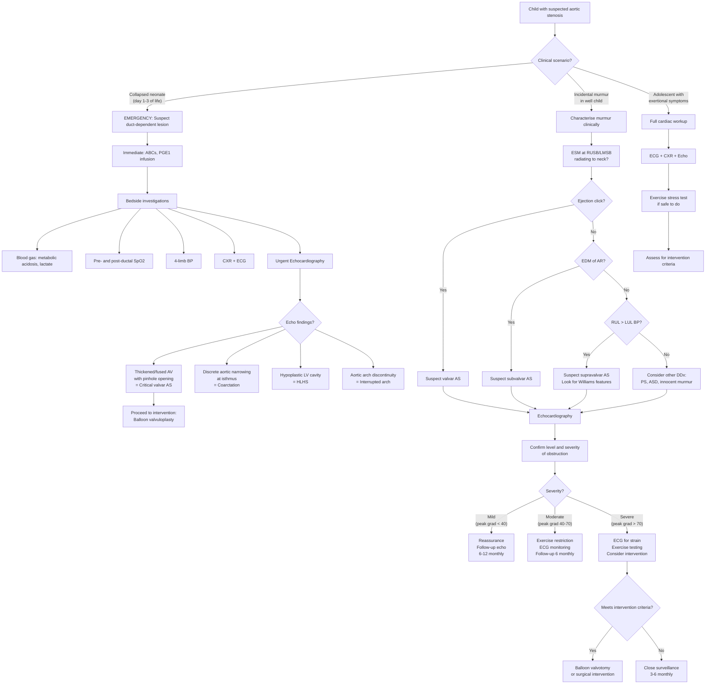

## Diagnostic Criteria, Diagnostic Algorithm, and Investigations for Aortic Stenosis in Children

---

### Diagnostic Criteria

Unlike many medical conditions (e.g., rheumatic fever with its Jones criteria, or Kawasaki disease with its strict checklist), paediatric aortic stenosis does **not** have a single set of validated "diagnostic criteria" in the traditional sense. Instead, the diagnosis is established through a combination of:

1. **Clinical suspicion** — based on auscultatory findings and pulse character
2. **Echocardiographic confirmation** — which is the definitive diagnostic modality
3. **Severity grading** — based on Doppler-derived pressure gradients and valve area

The diagnosis is fundamentally an **anatomical and haemodynamic** one: you demonstrate the obstruction and quantify how severe it is.

#### Echocardiographic Severity Grading in Children

Severity in paediatric AS is graded primarily by **Doppler-derived peak instantaneous gradient** and **mean gradient** across the aortic valve. The thresholds differ slightly from adult criteria because children have higher cardiac outputs relative to body size and different valve areas indexed to BSA.

| Parameter | Mild | Moderate | Severe | Critical (Neonates) |
|---|---|---|---|---|
| Peak instantaneous gradient (mmHg) | < 40 | 40–70 | > 70 | Variable (may be low!) |
| Mean gradient (mmHg) | < 25 | 25–40 | > 40 | Variable |
| Aortic valve area indexed (cm²/m² BSA) | > 0.7 | 0.5–0.7 | < 0.5 | Severely reduced |
| Peak jet velocity (m/s) | < 3.0 | 3.0–4.0 | > 4.0 | Variable |
| LV systolic function | Preserved | Preserved | Preserved or reduced | Often reduced |

<Callout title="The 'Low-Gradient Trap' in Neonatal Critical AS" type="error">
In ***critical AS*** in neonates, the gradient across the aortic valve may be **paradoxically low** despite severe anatomical obstruction. **Why?** Because the failing LV cannot generate enough force to produce a high-velocity jet across the stenosis. A low gradient + poor LV function = **severe disease, not mild disease**. Always correlate the gradient with LV function. This is the same concept as "low-flow, low-gradient AS" described in adults [4], but in neonates it occurs because the immature myocardium fails rapidly under extreme pressure overload.
</Callout>

#### Criteria for Intervention (When AS Becomes "Haemodynamically Significant")

These are not diagnostic criteria per se, but they define when AS is severe enough to warrant intervention — essentially the functional "diagnostic threshold" for action [2]:

***Indications for surgical/catheter intervention*** [2]:
- ***Symptomatic*** at any gradient, OR
- ***Asymptomatic but haemodynamically significant*** as indicated by:
  - ***Resting systolic pressure gradient > 60 mmHg*** [2]
  - ***LV systolic dysfunction*** [2]
  - ***ST/T changes suggestive of LV strain or ischaemia at rest*** [2]
  - ***Abnormal BP response (no ↑sBP on exercise) or new ST/T changes on exercise*** [2]

> **High Yield**: A resting peak gradient of > 60 mmHg is the key threshold for intervention in asymptomatic paediatric AS. Below this, the child is monitored. Above this, even without symptoms, intervention is indicated because of the risk of sudden cardiac death.

---

### Diagnostic Algorithm

The diagnostic approach differs by clinical scenario. Let me walk through the complete algorithm:

---

### Investigation Modalities

Let's go through each investigation systematically, explaining **what it shows**, **why** it shows that, and **how to interpret** the findings in the context of paediatric AS.

---

#### 1. Chest X-Ray (CXR)

The CXR is often the **first imaging** obtained but is the **least specific** investigation. Think of it as a screening tool that provides supportive but not diagnostic information.

***CXR findings in AS*** [2]:

| Finding | Present In | Pathophysiological Explanation |
|---|---|---|
| ***Post-stenotic dilatation of the aortic root*** | ***Usually in valvar AS; less commonly in subvalvar/supravalvar*** [2] | The high-velocity jet exiting through the stenotic valve impacts the wall of the ascending aorta, causing localised turbulent flow → the aortic wall remodels and dilates at the point of jet impact. This is a haemodynamic phenomenon, not a structural defect of the aortic wall (in contrast to supravalvar AS where the narrowing prevents this jet effect). |
| ***Normal cardiac size and normal pulmonary vascular markings*** | Compensated AS (majority of children) [2] | Because the LV compensates with concentric hypertrophy (thickening without dilation), the overall cardiac silhouette remains normal. Pulmonary markings are normal because LV function is preserved → no back-pressure into the lungs. |
| ***Cardiomegaly and ↑ pulmonary vascular markings*** | ***Neonatal critical AS + heart failure*** [2] | In critical AS, the LV fails → elevated LVEDP → elevated LA pressure → pulmonary venous congestion → prominent pulmonary vascular markings. The heart enlarges because of RV dilation (RV is doing double duty via PDA) and LV dilation (failing ventricle). |

**Paediatric CXR interpretation tips**:
- In neonates, the thymic silhouette can make the mediastinum look wide — don't confuse this with cardiomegaly
- Cardiothoracic ratio (CTR) > 0.6 in neonates and > 0.55 in children suggests cardiomegaly (different from the adult threshold of > 0.5)
- Look specifically at the **upper mediastinal contour** on the right for post-stenotic dilatation of the ascending aorta — this appears as a prominent right upper mediastinal bulge

<Callout title="CXR Can Be Normal in Severe AS">
A **normal CXR does NOT exclude significant AS** in children. Most children with even moderate-to-severe AS have a normal CXR because of effective concentric LVH compensation. The CXR becomes abnormal only when decompensation occurs. Echocardiography is always required for definitive assessment.
</Callout>

---

#### 2. Electrocardiogram (ECG)

The ECG provides indirect evidence of the haemodynamic burden on the ventricles. It cannot diagnose AS directly, but the pattern of findings helps assess severity and guides urgency.

***ECG findings in AS*** [2][4]:

| Finding | Present In | Pathophysiological Explanation |
|---|---|---|
| ***Left axis deviation (LAD)*** | ***Moderate/severe AS*** [2] | LVH causes the electrical axis to shift leftward because the hypertrophied LV generates a dominant leftward/posterior electrical vector. Normal paediatric axis varies with age (rightward in neonates, gradually shifting left). LAD is defined as < 0° in children > 1 year. |
| ***LVH voltage criteria*** | ***Moderate/severe AS*** [2] | Increased LV muscle mass generates larger electrical potentials → tall R waves in left-sided leads (V5, V6, I, aVL) and deep S waves in right-sided leads (V1, V2). Paediatric LVH criteria vary by age — use age-appropriate voltage criteria (e.g., Davignon charts). |
| ***LV strain pattern*** | Severe AS [4] | ***Downsloping ST depression + T-wave inversion in lateral leads*** (V5, V6, I, aVL) [4]. This pattern indicates subendocardial ischaemia from the myocardial O₂ supply-demand mismatch. In paediatrics, this is an ominous finding and constitutes an ***indication for intervention even in asymptomatic patients*** [2]. |
| ***ST/T changes suggestive of LV strain or ischaemia at rest*** | Severe AS — intervention criteria [2] | Same mechanism as above. ***This is one of the criteria for intervention in asymptomatic AS*** [2]. The rationale is that resting ECG evidence of ischaemia implies the myocardium is chronically under-perfused → high risk of ventricular arrhythmia and sudden death. |
| ***RVH*** | ***Critical AS in neonates*** [2] | **Why RVH and not LVH in the most severe form?** Because in critical neonatal AS, the ***RV is supporting the systemic circulation via PDA*** — the RV is doing double duty and therefore hypertrophies. The LV may be too dysfunctional to generate large voltages. This is a diagnostic clue that differentiates critical AS from moderate-severe AS in older children. |

**Paediatric ECG interpretation essentials** (age-appropriate norms):

| Age | Normal Axis | Normal R in V1 | Normal S in V1 | LVH Clue |
|---|---|---|---|---|
| Neonate | +60° to +180° (right dominant) | Up to 26 mm | Small | Unusually tall R in V6 for age |
| 1 month – 1 year | +10° to +125° | Decreasing | Increasing | R in V6 > 98th percentile |
| 1–8 years | +10° to +110° | Small | Deep | Deep S in V1, tall R in V6 |
| 8–16 years | 0° to +100° | Small | Deep | Adult LVH criteria begin to apply |

<Callout title="Key ECG Caveat in Neonates" type="error">
**RVH on ECG in a neonate does NOT automatically mean right-sided heart disease.** In ***critical AS***, the RV is hypertrophied because it is supporting the systemic circulation via the PDA. Always consider left-sided obstructive lesions (critical AS, CoA, HLHS) in a collapsed neonate with RVH on ECG.
</Callout>

---

#### 3. Echocardiography — The Definitive Diagnostic Investigation

Echocardiography is the **gold standard** for diagnosing and characterising paediatric AS. It is non-invasive, does not use radiation, can be performed at the bedside (critical for sick neonates), and provides both anatomical and haemodynamic information.

***Echo in AS*** [2]:
- ***Demonstrates the level of obstruction*** [2]
- ***Estimates the systolic pressure gradient across the aortic valve*** [2]

Let's break down what echo provides:

##### A. Two-Dimensional (2D) Echocardiography — Anatomical Assessment

| What to Look For | Interpretation | Clinical Significance |
|---|---|---|
| **Valve morphology** | Count the number of cusps and commissures. Unicuspid = single cusp with eccentric pinhole; Bicuspid = two cusps with raphé (usually fusion of R and L coronary cusps); Tricuspid = normal three cusps | ***Unicuspid AV with pinhole opening in neonates with critical AS; bicuspid AV in infants/children*** [2]. Determines the anatomical substrate and guides procedural planning. |
| ***Thickened and fused aortic cusps*** [1] | Cusps appear echobright, thickened, and restricted in motion; "doming" during systole (the cusps bow outward but cannot fully open) | This is the hallmark appearance described in the lecture slides [1]. Doming differentiates a stenotic valve from a sclerotic valve (sclerotic = thickened but moves normally). |
| **Level of obstruction** | Valvar: obstruction at valve level. Subvalvar: membrane or ridge below the valve visible in parasternal long-axis and 5-chamber views. Supravalvar: narrowing above the sinotubular junction. | ***Demonstrates the level of obstruction*** [2]. Critical for surgical planning — subvalvar requires resection, supravalvar requires patch, valvar requires valvotomy. |
| **LV wall thickness and cavity size** | Concentric LVH: thickened walls with preserved/small cavity. Dilated LV: enlarged cavity with thin walls (decompensation). | LVH confirms chronic pressure overload. Dilatation indicates decompensation — a late and ominous finding in children. |
| **LV systolic function** | Fractional shortening (FS) or ejection fraction (EF) on M-mode or Simpson's method | ***LV systolic dysfunction*** is an ***indication for intervention*** [2]. Normal EF in children is 55–70%. FS normal is 28–44%. |
| **Associated lesions** | Look for: bicuspid AV (if valvar), subaortic membrane (if subvalvar), coarctation, VSD, PDA patency | Frequently coexist; especially bicuspid AV + CoA (both associated with ***Turner syndrome*** [2]) |

##### B. Doppler Echocardiography — Haemodynamic Assessment

Doppler is the key to **quantifying severity**. It works on the principle that blood accelerating through a stenosis increases in velocity, and this velocity can be measured by ultrasound using the Doppler effect.

| Doppler Modality | What It Measures | How It's Used in AS |
|---|---|---|
| **Continuous-wave (CW) Doppler** | Peak and mean velocity across the stenosis | Placed in the apical 5-chamber view aligned with the LVOT → aortic valve jet. The **peak velocity** is used in the modified Bernoulli equation to calculate the **peak instantaneous gradient**: ΔP = 4V² (where V = peak velocity in m/s). For example, if peak velocity = 4 m/s, then ΔP = 4 × 16 = **64 mmHg**. The **mean gradient** is calculated from the velocity-time integral (VTI) of the spectral Doppler envelope. |
| **Pulsed-wave (PW) Doppler** | Velocity at a specific point | Used to measure LVOT velocity (pre-stenotic velocity) separately from the valve jet velocity. This is important for the **continuity equation** to calculate valve area. |
| **Colour-flow Doppler** | Direction and turbulence of flow | Shows turbulent, aliased (mosaic) flow at the level of stenosis. Also demonstrates any associated **aortic regurgitation** (important in subvalvar AS where ***turbulent jet → AV damage → progressive AR*** [2]). |

##### The Modified Bernoulli Equation — First Principles

The **Bernoulli equation** in fluid dynamics states that as a fluid accelerates through a constriction, kinetic energy increases at the expense of pressure energy. In simplified form for echocardiography:

**ΔP = 4V²**

Where:
- ΔP = peak instantaneous pressure gradient across the stenosis (in mmHg)
- V = peak velocity of the jet (in m/s)
- The "4" comes from simplifying the full Bernoulli equation (½ρ × V²) where ρ (density of blood) ≈ 1060 kg/m³, and converting units

This equation is accurate when the pre-stenotic velocity is low ( < 1.5 m/s). If the LVOT velocity is elevated (e.g., in combined AS with subaortic obstruction), you must use the **extended Bernoulli equation**: ΔP = 4(V₂² − V₁²).

##### The Continuity Equation — Calculating Valve Area

When gradients may be unreliable (e.g., low-output states), valve area provides a gradient-independent measure of severity:

**AVA = (ALVOT × VTILVOT) / VTI_AV**

Where:
- ALVOT = cross-sectional area of the LVOT (calculated from diameter: π × (d/2)²)
- VTILVOT = velocity-time integral at the LVOT (PW Doppler)
- VTI_AV = velocity-time integral at the aortic valve (CW Doppler)

This equation is based on conservation of mass (flow in = flow out). It is particularly useful in the ***low-gradient*** scenario where a low gradient may either represent mild AS with poor LV function (pseudo-severe) or genuine severe AS with LV failure.

##### C. Echocardiographic Assessment of Associated Features

| Feature | What Echo Shows | Significance |
|---|---|---|
| PDA patency | Colour Doppler showing flow through ductus arteriosus | In critical neonatal AS, PDA patency is life-saving; guides PGE1 management |
| Aortic regurgitation | Diastolic colour jet in LVOT | ***Commonly associated with subvalvar AS*** [2]; also occurs post-balloon valvotomy |
| Mitral valve function | MR jet; anterior MV leaflet SAM | Associated MR can occur; SAM suggests HOCM (subvalvar dynamic obstruction) |
| Aortic root dimensions | Z-score for age/BSA | Post-stenotic dilatation in valvar AS; critical for planning Ross procedure |
| Coarctation | Narrowing at aortic isthmus | Must actively look for this — frequently coexists with bicuspid AV |

---

#### 4. Exercise Stress Testing

This is an important adjunct in **older children and adolescents** with moderate-to-severe AS who are asymptomatic. It is used to unmask haemodynamic compromise that is not apparent at rest.

**Principle**: During exercise, cardiac output must increase to meet metabolic demand. In AS, the fixed obstruction limits this increase. Exercise testing can reveal:

| Finding | Significance | Pathophysiological Basis |
|---|---|---|
| ***Abnormal BP response (no ↑ sBP on exercise)*** [2] | ***Indication for intervention*** [2] | Normally, systolic BP rises with exercise. In severe AS, the fixed obstruction prevents adequate CO increase → BP fails to rise or actually drops. A flat or falling BP response indicates the AS is haemodynamically significant. |
| ***New ST/T changes on exercise*** [2] | ***Indication for intervention*** [2] | Exercise-induced subendocardial ischaemia (↑ demand + fixed supply) causes ST depression or T-wave changes that were not present at rest. This demonstrates that the myocardium is at risk during exertion. |
| Symptoms during exercise | Supports need for intervention | Reproduction of the patient's presenting symptoms (dyspnoea, chest pain, near-syncope) confirms the AS as the cause |
| Arrhythmias | Concerning for SCD risk | Exercise may provoke ventricular ectopy or VT in the context of severe LVH |

<Callout title="Exercise Testing Safety" type="error">
***Exercise testing is CONTRAINDICATED in symptomatic severe AS*** because of the risk of syncope, ventricular arrhythmia, and sudden death during testing. It should only be performed in **asymptomatic** patients with moderate-to-severe AS, under close supervision with resuscitation equipment immediately available, and only in centres experienced in paediatric exercise testing.
</Callout>

**Paediatric protocols**: The Bruce treadmill protocol or cycle ergometry are commonly used. In younger children ( < 6–7 years), exercise testing may not be feasible due to cooperation issues. For these patients, pharmacological stress (dobutamine) may be considered but is rarely used in paediatric AS.

---

#### 5. Cardiac Catheterisation

Once the gold standard, cardiac catheterisation has been ***largely supplanted by echocardiography*** [4] for diagnostic purposes in paediatric AS. However, it retains important roles:

| Role | Details |
|---|---|
| **Therapeutic (primary role in paediatrics)** | ***Transcatheter balloon aortic valvotomy (BAV)*** [2] — the catheter is inserted via the femoral artery (retrograde approach) or via the umbilical artery/femoral vein with trans-septal puncture (antegrade approach in neonates). A balloon is inflated across the stenotic valve to split fused commissures. |
| **Direct haemodynamic measurement** | Peak-to-peak gradient measured by simultaneously recording LV pressure and aortic pressure via the catheter. This is the most accurate gradient measurement but is invasive. |
| **Angiography** | Visualises anatomy when echo is inconclusive; delineates coronary artery anatomy (important pre-Ross procedure) |
| **When echo is discordant** | If clinical assessment and echo findings are contradictory (e.g., symptoms suggest severe AS but gradients are borderline), catheterisation can resolve the discrepancy |

**Paediatric considerations for catheterisation**:
- General anaesthesia is usually required in young children (unlike sedation in adults)
- Femoral artery access carries a higher risk of vascular complications in small children (arterial spasm, thrombosis)
- Radiation exposure is a concern — ALARA (as low as reasonably achievable) principle applies
- Always measure pull-back gradient across the LVOT, valve, and supravalvar region to localise the level of obstruction precisely

---

#### 6. Other Investigations

##### A. Blood Tests (Supportive, Not Diagnostic)

| Test | Relevance |
|---|---|
| **Arterial blood gas** (ABG) | In critical neonatal AS: metabolic acidosis (raised lactate) reflects tissue hypoperfusion from cardiogenic shock. Severity of acidosis guides urgency of intervention. |
| **Lactate** | Marker of tissue hypoperfusion; rising lactate = worsening shock |
| **Renal function (Cr, urea)** | Renal impairment in critical AS reflects inadequate renal perfusion (pre-renal AKI); oliguria is a key clinical feature |
| **Liver function (LFT)** | Hepatic congestion from RV failure may cause transaminitis |
| **BNP / NT-proBNP** | Elevated in heart failure; useful biomarker for monitoring LV decompensation. In paediatrics, age-specific reference ranges must be used (neonatal levels are physiologically higher). Not diagnostic for AS itself but helps quantify the haemodynamic burden. |
| **Karyotype / genetic testing** | If Turner syndrome suspected (short female, webbed neck, shield chest) → karyotype showing 45,X. If Williams syndrome suspected (elfin facies, hypercalcaemia, supravalvar AS) → FISH or microarray for 7q11.23 deletion. If DiGeorge suspected → 22q11.2 deletion testing. |
| **Calcium** | Hypercalcaemia in infancy raises suspicion for Williams syndrome |
| **Blood culture** | If endocarditis suspected (fever + new/changing murmur + known CHD) |

##### B. Pre- and Post-Ductal Oxygen Saturation

In the neonatal setting, simultaneous measurement of pre-ductal (right hand) and post-ductal (either foot) SpO₂ is part of the standard assessment of suspected CHD:
- In critical AS: both pre- and post-ductal SpO₂ may be low if there is significant LV failure with pulmonary congestion
- A **differential** (lower post-ductal) may also be seen if desaturated blood from the RV is flowing through the PDA to the descending aorta
- This is part of the universal newborn pulse oximetry screening programme now implemented in many HK hospitals

##### C. CT Angiography and Cardiac MRI

| Modality | Role in Paediatric AS |
|---|---|
| **CT angiography** | Rarely first-line for AS diagnosis. Useful when echo windows are poor or when detailed anatomical information is needed pre-operatively (e.g., coronary anatomy before Ross procedure, associated arch anomalies). Involves radiation and iodinated contrast — use judiciously in children. |
| **Cardiac MRI** | Excellent for quantifying LV mass, volumes, and function; detecting myocardial fibrosis (late gadolinium enhancement — indicates irreversible damage); assessing aortic anatomy in complex cases. Limitations: requires sedation/GA in young children; long scan times; limited availability. Increasingly used for longitudinal follow-up of LV remodelling in moderate-severe AS. |

##### D. Fetal Echocardiography (Prenatal Diagnosis)

Critical AS can be detected prenatally on fetal echocardiography performed at 18–22 weeks gestation:
- Findings: thickened/doming aortic valve, LV dysfunction, ± endocardial fibroelastosis, reversed flow in aortic arch
- Enables planned delivery at a tertiary centre with immediate postnatal PGE1 and catheter lab access
- **Fetal aortic valvuloplasty** is performed in a few centres worldwide (experimental) for evolving HLHS secondary to critical AS — the goal is to promote LV growth in utero and achieve a biventricular repair

---

### Investigation Summary Table

| Investigation | Key Findings in AS | Primary Role |
|---|---|---|
| ***CXR*** | ***Post-stenotic dilatation; normal heart size (compensated); cardiomegaly + ↑ pulmonary vascular markings (decompensated/critical)*** [2] | Screening; assess for heart failure |
| ***ECG*** | ***LAD + LVH (mod/severe); LV strain pattern (severe); RVH (critical neonatal)*** [2] | Assess LV burden; guide intervention decisions |
| ***Echocardiography*** | ***Level of obstruction; systolic pressure gradient; valve morphology; LV function; associated lesions*** [2] | **Definitive diagnostic modality** |
| Exercise testing | Abnormal BP response; exercise-induced ST changes; symptom reproduction | Risk stratification in asymptomatic moderate-severe AS |
| Cardiac catheterisation | Direct gradient measurement; therapeutic BAV | Therapeutic (BAV); resolves discordant echo findings |
| ABG/Lactate | Metabolic acidosis in critical AS | Assess severity of shock in neonates |
| BNP/NT-proBNP | Elevated in HF | Monitor for decompensation |
| Genetic testing | Karyotype (Turner), FISH/microarray (Williams, DiGeorge) | Identify syndromic associations |
| Cardiac MRI | LV mass, fibrosis (LGE), detailed anatomy | Selected cases; longitudinal follow-up |

---

### Putting It All Together: The Clinical Diagnostic Pathway

**Step 1: Clinical Suspicion**
- Murmur detection on examination, or neonatal collapse, or exertional symptoms in adolescence
- Pulse character (slow-rising vs. normal) and presence/absence of ejection click help localise the lesion

**Step 2: Initial Investigations**
- ECG + CXR in all suspected cases
- ECG: look for ***LVH, LAD, strain pattern, or RVH (neonatal)*** [2]
- CXR: look for ***post-stenotic dilatation, normal heart size, or cardiomegaly*** [2]

**Step 3: Echocardiography (Definitive)**
- ***Demonstrates level of obstruction*** [2]
- ***Estimates systolic pressure gradient*** [2]
- Assesses LV function, valve morphology, associated lesions

**Step 4: Risk Stratification**
- For moderate-severe AS: exercise testing to check for ***abnormal BP response or new ST/T changes*** [2]
- BNP for monitoring

**Step 5: Decision on Intervention**
- Based on the criteria outlined above (symptoms, gradient > 60 mmHg, LV dysfunction, ECG strain at rest, abnormal exercise test) [2]

---

<Callout title="High Yield Summary">

**Diagnostic Approach to Paediatric AS — Key Exam Points**

1. **Echocardiography is the gold standard** — it demonstrates the level of obstruction, estimates the pressure gradient, and assesses LV function [2]
2. **CXR**: ***Post-stenotic dilatation*** (valvar AS); ***normal heart size*** (compensated); ***cardiomegaly + ↑ pulmonary markings*** (critical/decompensated) [2]
3. **ECG**: ***LAD + LVH*** (moderate/severe); ***LV strain pattern*** (severe — indication for intervention); ***RVH*** (critical neonatal AS — because RV supports systemic circulation) [2]
4. **Modified Bernoulli equation**: ΔP = 4V² — converts Doppler velocity to pressure gradient
5. **Low gradient does NOT mean mild disease** in the context of poor LV function — always correlate gradient with LV systolic function
6. **Intervention criteria in asymptomatic children**: gradient > 60 mmHg, LV dysfunction, resting ECG strain, abnormal BP response on exercise [2]
7. **Exercise testing**: used in asymptomatic moderate-severe AS to unmask haemodynamic compromise; **contraindicated in symptomatic severe AS**
8. **Cardiac catheterisation**: primarily therapeutic (balloon valvotomy) in paediatrics; echo has largely replaced its diagnostic role [4]
9. **Genetic testing**: karyotype for Turner (valvar AS), FISH for Williams (supravalvar AS), 22q11.2 for DiGeorge (interrupted arch — DDx)

</Callout>

---

<ActiveRecallQuiz
  title="Active Recall - Diagnosis and Investigations in Paediatric AS"
  items={[
    {
      question: "What are the three key CXR findings in paediatric aortic stenosis, and which clinical scenarios do they correspond to?",
      markscheme: "1. Post-stenotic dilatation of aortic root (compensated valvar AS). 2. Normal cardiac size and pulmonary vascular markings (majority of compensated AS). 3. Cardiomegaly with increased pulmonary vascular markings (critical neonatal AS with heart failure).",
    },
    {
      question: "Why does the ECG in critical neonatal AS show RVH rather than LVH?",
      markscheme: "In critical neonatal AS, the RV supports the systemic circulation via the PDA. The RV is therefore doing double duty and hypertrophies. The LV may be too dysfunctional to generate large electrical voltages.",
    },
    {
      question: "A child with moderate AS has a resting peak gradient of 55 mmHg on echo and is asymptomatic with normal ECG at rest. What additional investigation would you perform to decide on intervention, and what specific findings would prompt you to intervene?",
      markscheme: "Exercise stress test. Findings prompting intervention: abnormal BP response (failure of systolic BP to rise or a drop in BP), new ST/T changes on exercise, or symptom reproduction during testing.",
    },
    {
      question: "Using the modified Bernoulli equation, calculate the peak instantaneous gradient if the peak aortic jet velocity is 5 m/s. Classify the severity.",
      markscheme: "Peak gradient = 4 x V-squared = 4 x 25 = 100 mmHg. This is severe AS (peak gradient > 70 mmHg in paediatric criteria).",
    },
    {
      question: "State four indications for intervention in asymptomatic paediatric AS.",
      markscheme: "1. Resting peak systolic gradient > 60 mmHg. 2. LV systolic dysfunction. 3. ST/T changes suggestive of LV strain or ischaemia at rest on ECG. 4. Abnormal BP response or new ST/T changes on exercise testing.",
    },
    {
      question: "Explain why the Doppler gradient may be misleadingly low in critical neonatal AS despite severe anatomical obstruction.",
      markscheme: "The failing LV cannot generate enough force to create a high-velocity jet across the stenosis. Since gradient = 4V-squared, low velocity results in a low calculated gradient. This is analogous to low-flow low-gradient AS in adults. Must correlate gradient with LV function.",
    },
  ]}
/>

## References

[1] Lecture slides: GC 147. Heart failure and cyanosis in children acyanotic and cyanotic congenital heart disease - Part 1.pdf (p16, p21, p22, p38)
[2] Senior notes: Adrian Lui Pediatrics.pdf (p208–209)
[3] Senior notes: Ryan Ho Cardiology.pdf (p190)
[4] Senior notes: Ryan Ho Cardiology.pdf (p158–159)
