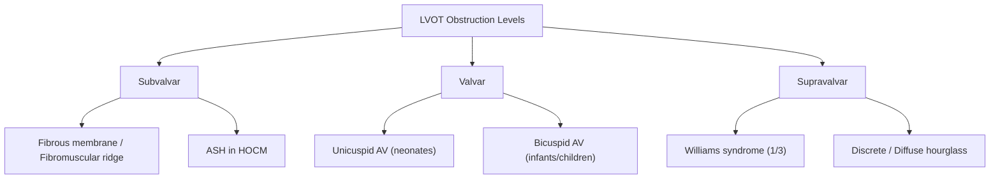
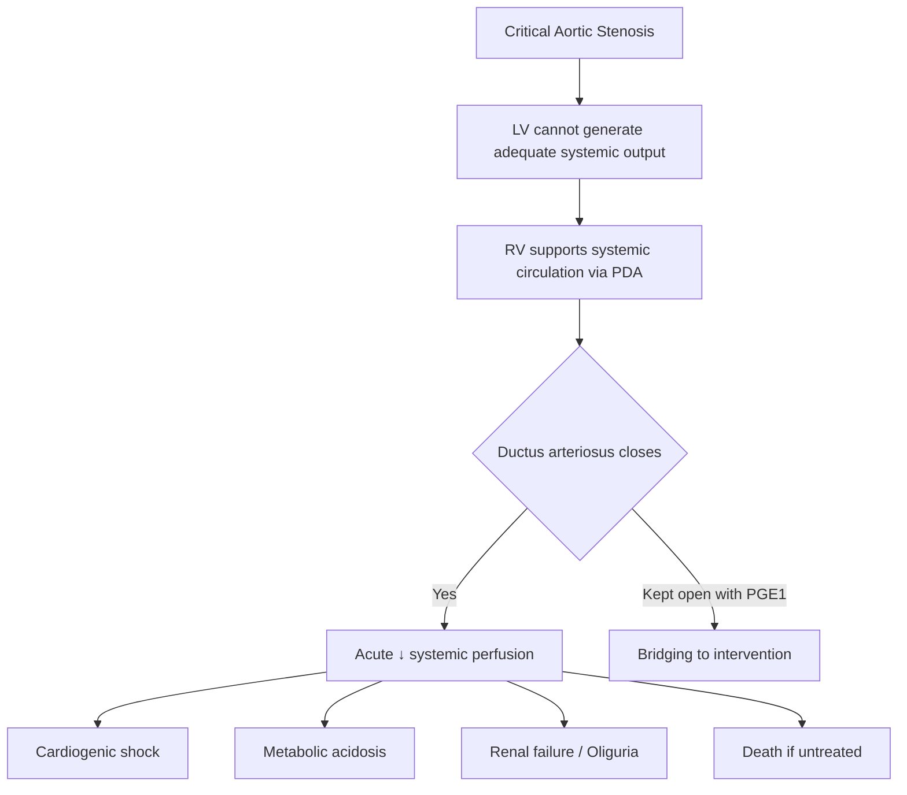

# Aortic Stenosis in Children

## Definition

Aortic stenosis (AS) — "aortic" = of the aorta (the great vessel leaving the left ventricle), "stenosis" (Greek *stenōsis*) = narrowing — refers to obstruction of the left ventricular outflow tract (LVOT) at, below, or above the level of the aortic valve. In the paediatric setting, this is overwhelmingly a congenital lesion (unlike adults where degenerative/calcific disease predominates) and ranges from haemodynamically trivial to life-threatening "critical AS" presenting with neonatal cardiogenic shock.

***Critical aortic stenosis*** is specifically highlighted as one of the three classic causes of ***left ventricular outflow obstruction*** alongside ***coarctation/interruption of the aorta*** and ***aortic atresia (hypoplastic left heart syndrome)*** [1]. All three share the common pathophysiological endpoint of duct-dependent systemic circulation in severe forms.

<Callout title="Core Concept">
In paediatrics, "aortic stenosis" almost always means congenital obstruction at one of three anatomical levels: valvar, subvalvar, or supravalvar. The valve morphology (unicuspid vs. bicuspid) determines neonatal vs. later presentation. Critical AS in neonates is a **duct-dependent** emergency — if the ductus arteriosus closes, the baby dies.
</Callout>

---

## Epidemiology

| Parameter | Detail |
|---|---|
| Incidence | ***3.8 per 10,000 live births*** [2] |
| Proportion of CHD | ~3–6% of all congenital heart disease |
| Sex predominance | ***> 75% male*** (M:F ≈ 3–4:1) [2] |
| Level of obstruction | ***Valvar in 71–86%*** of cases; subvalvar ~10–15%; supravalvar ~5% [2] |
| Associated syndromes | ***Turner syndrome*** (45,X) — associated with ***valvar AS*** and bicuspid aortic valve [2]; ***Williams syndrome*** — associated with ***supravalvar AS*** (occurs in ~1/3 of Williams syndrome patients) [2] |
| Bicuspid aortic valve | Present in 1–2% of the general population; the most common congenital cardiac malformation; most remain asymptomatic in childhood but may develop AS or AR later in life |

### Hong Kong Context

- Congenital heart disease has an overall incidence of ~8–10 per 1,000 live births in Hong Kong. AS comprises a small but important fraction.
- Rheumatic heart disease, while historically significant in Hong Kong and still seen in immigrant populations, is a far less common cause of AS in children compared with congenital valvar disease.
- Antenatal screening by fetal echocardiography at Queen Mary Hospital and other tertiary centres can detect critical AS prenatally, enabling planned delivery and immediate neonatal management.
- Turner syndrome is screened for via NIPT/karyotyping; girls with Turner syndrome routinely undergo echocardiography to detect associated bicuspid aortic valve and coarctation.

---

## Risk Factors

| Category | Specific Factors |
|---|---|
| Genetic/syndromic | ***Turner syndrome*** (valvar AS, bicuspid AV); ***Williams syndrome*** (supravalvar AS — caused by elastin gene deletion at 7q11.23); familial clustering of bicuspid aortic valve (autosomal dominant with reduced penetrance in some families) |
| Developmental | Abnormal valvulogenesis during weeks 5–8 of gestation; neural crest cell migration defects (supravalvar AS) |
| Maternal | Poorly controlled maternal diabetes (general CHD risk), teratogen exposure (less specific for AS) |
| Acquired causes (rare in paediatrics) | Rheumatic fever (still relevant in developing countries and migrant populations in HK); infective endocarditis causing secondary valve damage |

---

## Anatomy and Function

### Normal Aortic Valve Anatomy

The normal aortic valve is a **trileaflet** (three-cusped) semilunar valve situated between the left ventricle and the ascending aorta. The three cusps are named after the coronary arteries that arise from the sinuses of Valsalva immediately above them:

1. **Right coronary cusp** — above which the right coronary artery originates
2. **Left coronary cusp** — above which the left coronary artery originates
3. **Non-coronary cusp** — no coronary artery origin; abuts the interatrial septum

The valve opens during systole to allow unobstructed flow from LV → aorta, and closes during diastole to prevent regurgitation back into the LV. Normal aortic valve area in an adult is 3–4 cm²; in children it is indexed to body surface area.

### Normal LVOT Anatomy

The LVOT is the funnel-shaped pathway through which blood exits the LV. It is bounded by:
- **Anteriorly**: interventricular septum
- **Posteriorly**: anterior mitral valve leaflet
- **Superiorly**: aortic valve annulus

Obstruction can occur at any of these three levels:

### Coronary Perfusion — Why It Matters in AS

Coronary arteries fill predominantly during **diastole** because during systole the contracting myocardium compresses intramural coronary vessels. In AS:
- LV end-diastolic pressure (LVEDP) rises → reduces the coronary perfusion pressure gradient (Aortic diastolic pressure − LVEDP)
- LV hypertrophy increases myocardial oxygen demand
- This supply-demand mismatch explains **angina and subendocardial ischaemia** even with normal coronary arteries

---

## Aetiology (Focus on Paediatric/Hong Kong Population)

### A. Congenital (Overwhelmingly the Most Common in Paediatrics)

#### 1. ***Valvar Aortic Stenosis*** (71–86% of paediatric AS) [2]

This is the most common form. The pathology depends on age at presentation:

- **Neonates with critical AS**: ***Unicuspid aortic valve with pinhole opening*** [2]
  - The valve is a dome-shaped structure with a single eccentric orifice
  - Severely restricts flow → duct-dependent systemic circulation
  - ***Thickened and fused aortic cusps*** are the hallmark pathological finding [1]

- **Infants and children**: ***Bicuspid aortic valve*** [2]
  - Two cusps instead of three; most commonly fusion of the right and left coronary cusps (raphé present)
  - May have a relatively adequate orifice in infancy but stenosis worsens over time
  - Bicuspid AV is the single most common congenital cardiac malformation (1–2% of population)

- **Associations**: ***Turner syndrome (45,X)*** is specifically associated with valvar AS and bicuspid AV [2]. All girls with Turner syndrome should have echocardiographic screening.

#### 2. ***Subvalvar Aortic Stenosis*** (~10–15%) [2]

- Caused by a ***fibrous membrane, fibromuscular ridge*** or ***asymmetric septal hypertrophy (ASH) in HOCM*** [2]
- Discrete subaortic membrane is the most common subvalvar lesion in children
- The turbulent jet produced by the subaortic obstruction damages the aortic valve cusps over time → ***progressive aortic regurgitation (AR)*** [2]
- This is why subvalvar AS often presents with an ***early diastolic murmur (EDM) of AR*** — a distinguishing feature from valvar AS [2]

#### 3. ***Supravalvar Aortic Stenosis*** (least common, ~5%) [2]

- Narrowing of the ascending aorta above the sinotubular junction
- ***Usually associated with Williams syndrome*** (occurs in approximately ***1/3*** of patients) [2]
  - Williams syndrome: microdeletion of 7q11.23 encompassing the **elastin (ELN) gene**
  - Loss of elastin → abnormal arterial wall with progressive luminal narrowing
  - Also causes peripheral pulmonary stenosis, renal artery stenosis
- Morphological subtypes: discrete "hourglass" narrowing vs. diffuse hypoplasia of ascending aorta

### B. Acquired (Rare in Paediatric Age Group)

| Cause | Notes |
|---|---|
| Rheumatic heart disease | Post-streptococcal immune-mediated; causes commissural fusion → stenosis. Rare in isolated form; >95% associated with mitral valve involvement. Still encountered in HK among immigrant populations. |
| Post-endocarditis | Valve destruction and scarring; rare in children without pre-existing CHD |

---

## Pathophysiology

The pathophysiology of AS in children follows a logical cascade driven by **pressure overload** of the left ventricle. Let's trace this from first principles:

### Stage 1: Obstruction → Pressure Gradient

Any fixed obstruction to LV outflow creates a **systolic pressure gradient** between the LV cavity and the ascending aorta. The LV must generate higher systolic pressures to push blood across the stenotic orifice.

### Stage 2: Compensatory Concentric LVH

***LV pressure overload → LVH*** [2]

By the **Law of Laplace** (Wall stress = Pressure × Radius / 2 × Wall thickness), the LV compensates for increased pressure by increasing wall thickness (concentric hypertrophy). This normalises wall stress and ***usually preserves systolic function in children*** [2]. This is why many children with even moderate-to-severe AS are asymptomatic — the compensatory mechanism works well in young, compliant hearts.

### Stage 3: Myocardial Oxygen Supply-Demand Mismatch

Two things go wrong simultaneously:

1. ***↓ Coronary perfusion*** due to:
   - Severe AS reducing aortic diastolic pressure (less driving pressure for coronary flow)
   - ***↑ LV end-diastolic pressure (LVEDP)*** from the stiffened, hypertrophied LV [2]
   - Coronary perfusion pressure = Aortic diastolic pressure − LVEDP → both factors reduce this gradient

2. ***↑ Myocardial O₂ consumption*** due to:
   - ***↑ LV systolic BP → ↑ afterload*** [2]
   - Increased muscle mass from LVH
   - Increased wall stress

### Stage 4: Myocardial Fibrosis → LV Failure

***Eventually, the supply-demand mismatch results in myocardial fibrosis → LV failure*** [2]

The hypertrophied ventricle that once compensated beautifully now decompensates:
- Diastolic dysfunction (stiff ventricle cannot fill properly) → pulmonary congestion
- Systolic dysfunction (fibrosed myocardium cannot contract properly) → ↓ cardiac output
- This is a **late and ominous** development in children

### Stage 5: Critical AS in Neonates — Duct-Dependent Systemic Circulation

***Neonatal heart failure with shock if critical AS → duct-dependent systemic circulation*** [1][2]

In the most severe form (critical AS):
- The LV cannot generate adequate systemic output through the pinhole aortic valve
- The right ventricle maintains systemic perfusion by pumping blood through the **patent ductus arteriosus (PDA)** into the descending aorta
- When the ductus closes (typically day 1–3 of life) → catastrophic fall in systemic output → **cardiogenic shock, metabolic acidosis, multi-organ failure, death**

### Progressive Nature of All Forms of AS

***Stenosis at all levels are progressive in nature*** [2]:

| Level | Mechanism of Progression |
|---|---|
| ***Valvar AS*** | ***Aortic valve often undergoes degeneration / calcification*** over decades [2] |
| ***Subvalvar AS*** | ***Turbulent jet → AV damage → progressive AR*** [2] — the jet injury to the valve leaflets is cumulative |
| ***Supravalvar AS*** | ***Progressive stenosis in Williams syndrome*** [2] — ongoing elastin deficiency leads to progressive arterial narrowing |

<Callout title="Why is AS progressive even in children?">
Even though calcific degeneration is an adult phenomenon, the **turbulent flow** across a stenotic orifice causes ongoing mechanical stress to valve leaflets (valvar AS) or to the aortic valve from below (subvalvar AS). In Williams syndrome, the genetic absence of elastin means the arteries never stop narrowing. This is why all children with AS need **lifelong surveillance**.
</Callout>

---

## Classification

### A. By Anatomical Level

| Type | Anatomical Site | Key Features |
|---|---|---|
| ***Valvar AS*** | At the aortic valve | Most common (71–86%); unicuspid (neonates) or bicuspid (children); ***ejection click present*** [2] |
| ***Subvalvar AS*** | Below the aortic valve in LVOT | Fibrous membrane, fibromuscular ridge, or ASH (HOCM); ***no ejection click, no change in A2***; ***commonly associated with EDM of AR*** [2] |
| ***Supravalvar AS*** | Above the aortic valve (ascending aorta) | Usually Williams syndrome; ***no ejection click, no change in A2***; ***RUL pulse > LUL pulse*** (Coanda effect) [2] |

### B. By Severity (Paediatric Echocardiographic Grading)

| Parameter | Mild | Moderate | Severe |
|---|---|---|---|
| Peak gradient (mmHg) | < 40 | 40–70 | > 70 |
| Mean gradient (mmHg) | < 25 | 25–40 | > 40 |
| Valve area indexed (cm²/m²) | > 0.7 | 0.5–0.7 | < 0.5 |

*Note: In neonates, "critical AS" is defined functionally as AS severe enough to cause duct-dependent systemic circulation, regardless of gradient (gradient may be low due to poor LV function).*

### C. By Clinical Presentation

| Category | Presentation |
|---|---|
| ***Critical AS*** | Neonatal HF with shock (≤2 weeks of life); duct-dependent [2] |
| Severe AS (compensated) | Asymptomatic or exertional symptoms in older children/adolescents |
| Mild-moderate AS | Incidental murmur; asymptomatic |

<Callout title="Exam Pearl" type="error">
A common exam mistake: students assume that a low gradient on echo means mild disease. In **critical AS with LV dysfunction**, the gradient may be paradoxically LOW because the failing LV cannot generate enough force to create a high gradient. Always correlate with LV function and clinical status.
</Callout>

---

## Clinical Features

### Overview by Age Group

***Usually asymptomatic in children/infants (even in moderate/severe AS)*** [2] — this is because compensatory LVH is highly effective in the young heart with excellent myocardial compliance.

| Age Group | Typical Presentation |
|---|---|
| ***Neonate (critical AS)*** | ***HF with shock (≤2 weeks)*** [2]; duct-dependent systemic circulation; presents when ductus closes |
| Infant/young child | Usually asymptomatic; detected by murmur on well-baby check |
| ***Older child/adolescent*** | ***↓ Exercise tolerance with SOB, chest pain, syncope, sudden cardiac death (SCD) on exertion*** [2] |

### Symptoms

#### 1. Neonatal Presentation (Critical AS)

- ***Neonatal HF (≤2 weeks) with shock*** [2]
  - **Why?** The unicuspid valve with pinhole opening cannot support systemic output. When the ductus closes, the neonate loses its only remaining pathway for systemic perfusion.
  - **Features of shock**: poor feeding, lethargy, tachypnoea, pallor, mottled skin, cold peripheries, oliguria/anuria
  - **Metabolic acidosis**: lactic acidosis from tissue hypoperfusion
  - This presentation is indistinguishable from other causes of duct-dependent systemic circulation (coarctation, HLHS, interrupted aortic arch)

#### 2. Childhood Presentation (Compensated AS)

- **Asymptomatic**: The majority. The murmur is found incidentally during routine examination.
- ***Decreased exercise tolerance (↓ ET) with dyspnoea on exertion*** [2]
  - **Why?** The fixed stenosis limits the ability to increase cardiac output during exercise. The LV cannot augment stroke volume adequately because the orifice is fixed → cardiac output fails to rise → exercise intolerance and breathlessness.

#### 3. Adolescent Presentation (Decompensating AS)

- ***Exertional chest pain (angina)*** [2]
  - **Why?** Supply-demand mismatch of myocardial oxygen as described in pathophysiology: ↑ demand (LVH, ↑ wall stress) + ↓ supply (↑ LVEDP compressing coronary perfusion gradient). Notably, coronary arteries are structurally normal — this is angina from haemodynamic compromise, not atherosclerosis.

- ***Exertional syncope*** [2][3]
  - **Why?** During exercise, peripheral vasodilation occurs (to supply exercising muscles) but the fixed obstruction prevents the necessary increase in cardiac output. The result is a sudden drop in blood pressure → cerebral hypoperfusion → syncope. In adults, this mechanism is described as "inability to ↑CO + ↓SVR due to peripheral vasodilation → sudden ↓BP" [3].

- ***Sudden cardiac death (SCD) on exertion*** [2]
  - **Why?** Severe LVH predisposes to ventricular arrhythmias (VT/VF), especially during exercise when catecholamine levels surge. Subendocardial ischaemia from the supply-demand mismatch can trigger fatal arrhythmias. This is rare but devastating, and is the reason children with moderate-to-severe AS are restricted from competitive sports.

> **High Yield**: The classic triad of **angina, syncope, and heart failure** represents progressive decompensation in AS. In paediatrics, these symptoms typically emerge during **adolescence** because that is when increased physical demands unmask the fixed obstruction.

### Signs

The physical signs differ critically depending on the level and severity of obstruction:

#### A. ***Mild Valvar AS*** [2]

| Sign | Pathophysiological Basis |
|---|---|
| ***Ejection click*** | A high-pitched sound occurring in early systole, caused by sudden halting of the doming bicuspid/unicuspid valve cusps as they reach their maximum opening excursion. **This sign is pathognomonic of valvar AS** — it localises the obstruction to the valve level. It is best heard at the apex and LLSB. It is present in valvar AS but ***absent in subvalvar and supravalvar AS*** because the obstruction is not at the valve itself. |
| ***Ejection systolic murmur (ESM) at LVOT (LMSB to RUSB) radiating to bilateral neck*** [2] | Turbulent flow across the narrowed valve orifice generates this crescendo-decrescendo murmur. It is harsh and best heard in the aortic area (2nd right intercostal space). Radiation to the carotids occurs because turbulent flow propagates into the great vessels. |

#### B. ***Severe Valvar AS*** [2]

| Sign | Pathophysiological Basis |
|---|---|
| ***Weak, slow-rising anacrotic pulse*** (pulsus parvus et tardus) [2][3] | "Parvus" = small, "tardus" = late. The small volume reflects reduced stroke volume getting through the stenosis. The slow-rising character is because blood can only trickle through the narrow orifice, so the arterial pulse takes longer to reach peak systolic pressure. This is the arterial pulse hallmark of significant AS. |
| ***LV impulse*** (sustained, heaving apex) [2] | Concentric LVH from pressure overload creates a forceful, sustained apical impulse. It is not displaced (the LV is hypertrophied but not dilated — unlike in volume overload). |
| ***Suprasternal pulsation/thrill*** [2] | Vigorous turbulent flow in the ascending aorta and aortic arch can be felt as a thrill in the suprasternal notch. |
| ***Delayed or absent A2*** [2] | A2 is the aortic component of the second heart sound, produced by aortic valve closure. When the valve is severely stenotic and immobile/calcified, it cannot close with a sharp snap → A2 is soft, delayed, or absent. A delayed A2 can cause paradoxical splitting of S2 (A2 occurs after P2). |
| ***Ejection click*** [2] | Same mechanism as mild AS, but may be quieter if valve is very thickened/immobile |
| ***ESM at LVOT radiating to bilateral neck*** [2] | Louder and longer than in mild AS; peaks later in systole (later peaking = more severe stenosis — because it takes longer to push blood through the tighter orifice) |
| S4 gallop [3] | The left atrium contracting forcefully against a stiff, hypertrophied LV produces an audible fourth heart sound. Indicates diastolic dysfunction. (More prominent in older children/adolescents.) |

#### C. ***Critical AS (Neonatal)*** [2]

| Sign | Pathophysiological Basis |
|---|---|
| ***↓ BP, weak peripheral pulses, cold peripheries*** [2] | Signs of cardiogenic shock. The LV cannot generate adequate systemic output. |
| ***RV impulse*** (parasternal heave) [2] | **Why RV impulse and not LV?** Because in critical AS, ***the RV is supporting the systemic circulation via PDA*** [2]. The RV is doing double duty — perfusing the lungs AND the systemic circulation via the ductus — so it is working harder and hypertrophies. |
| ***Absent or soft, nonspecific murmur*** [2] | **Why is the murmur quiet in the most severe form?** Because ***there is minimal flow via the aortic valve*** [2]. Murmurs are generated by turbulent flow; if almost no blood is crossing the valve, there is no turbulence to generate a murmur. This is a trap for the unwary — the sickest babies may have the quietest hearts! |
| Hepatomegaly | Reflects systemic venous congestion from poor cardiac output and RV strain |
| Tachypnoea, respiratory distress | Pulmonary oedema from elevated left atrial pressures back-propagating to pulmonary veins |

<Callout title="Clinical Pearl" type="error">
The **absence of a murmur** in a shocked neonate does NOT exclude critical congenital heart disease. In critical AS (and other duct-dependent lesions), the murmur may be inaudible precisely because flow across the obstruction is minimal. Always think of CHD in any collapsed neonate, especially around day 2–3 of life when the ductus closes.
</Callout>

#### D. ***Subvalvar AS*** [2]

| Sign | Pathophysiological Basis |
|---|---|
| ESM at LVOT (as above) | Same turbulence mechanism, but source is below the valve |
| ***No ejection click*** [2] | The aortic valve leaflets themselves are structurally normal and move normally — there is no "doming" or halting motion to produce a click. The obstruction is upstream of the valve. |
| ***No change in A2*** [2] | The aortic valve closes normally (it is not stenosed itself), so A2 is preserved. |
| ***Commonly associated with EDM of AR*** [2] | The turbulent subvalvar jet strikes the underside of the aortic valve leaflets, causing chronic mechanical injury → progressive valve damage → aortic regurgitation. This AR produces an early diastolic murmur (decrescendo, best at left sternal border in aortic area). This feature is a key distinguishing point from valvar AS. |

#### E. ***Supravalvar AS*** [2]

| Sign | Pathophysiological Basis |
|---|---|
| ESM at LVOT (as above) | |
| ***No ejection click + No change in A2*** [2] | Same reasoning as subvalvar — the aortic valve itself is normal |
| ***Right upper limb (RUL) pulse > Left upper limb (LUL) pulse*** [2] | This is the **Coanda effect**: when blood exits through the supravalvar narrowing, the high-velocity jet preferentially streams into the innominate (brachiocephalic) artery which gives rise to the right subclavian → right arm. The left subclavian arises more distally and receives less of this preferential flow. Therefore, right arm blood pressure is higher than left. This finding is **unique to supravalvar AS**. |
| ***Signs of Williams syndrome (Elfin facies)*** [2] | Broad forehead, periorbital fullness, stellate iris, short upturned nose, long philtrum, wide mouth with full lips, small chin. Also: friendly "cocktail party" personality, intellectual disability, hypercalcaemia (in infancy), renal anomalies. |

### Summary Table: Distinguishing Signs by Level of AS

| Feature | Valvar AS | Subvalvar AS | Supravalvar AS |
|---|---|---|---|
| ***Ejection click*** | ***Present*** ✓ | ***Absent*** ✗ | ***Absent*** ✗ |
| ***A2*** | ***Delayed/Absent (if severe)*** | ***Normal*** | ***Normal*** |
| ***EDM of AR*** | Late complication | ***Common and early*** | Uncommon |
| ***RUL > LUL pulse*** | No | No | ***Yes (Coanda effect)*** |
| ***Syndrome association*** | ***Turner*** | None specific (HOCM is genetic) | ***Williams (Elfin facies)*** |

> **High Yield Exam Point**: The **ejection click** is the single most useful sign to localise the obstruction to the valve level. Its absence should make you think of subvalvar or supravalvar obstruction.

---

## Associated Conditions Worth Knowing

### Turner Syndrome (45,X) and AS
- ~30% of girls with Turner syndrome have cardiovascular anomalies
- ***Bicuspid aortic valve*** is the most common (~15–30%)
- ***Coarctation of aorta*** is the second most common
- ***Valvar AS*** develops secondary to the bicuspid valve
- Other features: short stature, webbed neck, shield chest, lymphoedema, streak gonads, horseshoe kidney

### Williams Syndrome (7q11.23 microdeletion) and Supravalvar AS
- Elastin gene (ELN) haploinsufficiency → generalised arteriopathy
- ***Supravalvar aortic stenosis in ~1/3*** [2]
- Also: supravalvar pulmonary stenosis, peripheral pulmonary artery stenosis, renal artery stenosis (→ hypertension)
- Characteristic facies, hypercalcaemia, intellectual disability, overfriendly personality

### HOCM (Hypertrophic Obstructive Cardiomyopathy) and Subvalvar AS
- ***Asymmetric septal hypertrophy (ASH)*** causes dynamic subvalvar obstruction [2]
- Autosomal dominant; sarcomere protein gene mutations (e.g., MYH7, MYBPC3)
- Dynamic obstruction worsens with ↓ preload, ↓ afterload, ↑ contractility (opposite to fixed AS)
- Important cause of sudden cardiac death in young athletes

---

## Normal Cardiovascular Values for Age (Reference)

Understanding AS requires knowing what is normal:

| Parameter | Neonate | Infant | Child (6y) | Adolescent |
|---|---|---|---|---|
| Heart rate (bpm) | 120–160 | 100–150 | 70–120 | 60–100 |
| Systolic BP (mmHg) | 60–90 | 80–100 | 90–110 | 100–120 |
| Normal aortic valve gradient | < 10 mmHg | < 10 mmHg | < 10 mmHg | < 10 mmHg |
| LV wall thickness (mm) | 3–5 | 4–6 | 6–8 | 7–10 |

---

## Growth and Development Considerations

- **Infants with significant AS** may have failure to thrive due to increased metabolic demands from heart failure and poor feeding
- **Exercise restriction** is required in moderate-to-severe AS — no competitive sports, which significantly impacts quality of life in school-age children and adolescents
- **Longitudinal growth of the aortic annulus** means that valve interventions (balloon valvotomy, Ross procedure) need to account for somatic growth — prosthetic valves do NOT grow with the child

---

## Family-Centred Care Points

- Parents need clear explanation that even asymptomatic children need lifelong cardiac follow-up because ***stenosis at all levels is progressive*** [2]
- Genetic counselling indicated for:
  - Bicuspid AV (familial recurrence risk ~9% in first-degree relatives)
  - Williams syndrome (7q11.23 deletion — usually de novo but counselling still appropriate)
  - Turner syndrome
  - HOCM
- Endocarditis prophylaxis education (though current guidelines restrict prophylaxis to high-risk situations only)
- Exercise counselling: avoid competitive/strenuous sports in moderate-severe AS; allow normal play in mild AS

---

<Callout title="High Yield Summary">

**Aortic Stenosis in Children — Key Points for Exams**

1. **Overwhelmingly congenital** in children; valvar type is most common (71–86%)
2. **Three anatomical levels**: valvar, subvalvar, supravalvar — each with characteristic distinguishing signs
3. **Ejection click = valvar AS** (absent in subvalvar and supravalvar)
4. **A2 changes only in valvar AS** (delayed/absent); normal A2 in sub- and supravalvar
5. **Subvalvar AS → progressive AR** due to jet damage to valve leaflets
6. **Supravalvar AS → RUL > LUL pulse** (Coanda effect); think Williams syndrome
7. **Valvar AS → Turner syndrome** association; **Supravalvar AS → Williams syndrome**
8. **Critical AS in neonates**: duct-dependent systemic circulation → cardiogenic shock when ductus closes → ***emergency management with PGE1 infusion + balloon dilation or surgical repair*** [1]
9. **Pathophysiology**: pressure overload → concentric LVH → myocardial O₂ supply-demand mismatch → fibrosis → LV failure
10. **Children are usually asymptomatic** even with moderate/severe AS due to effective compensatory LVH
11. **Exertional symptoms** (angina, syncope, SOB, SCD) emerge in adolescence
12. **Quiet murmur ≠ mild disease** in neonates: critical AS has minimal/absent murmur because minimal flow crosses the valve

</Callout>

---

<ActiveRecallQuiz
  title="Active Recall - Aortic Stenosis in Children"
  items={[
    {
      question: "Name the three anatomical levels at which aortic stenosis can occur and one key distinguishing clinical sign for each level.",
      markscheme: "Valvar (ejection click present), subvalvar (no ejection click, commonly associated EDM of AR), supravalvar (no ejection click, RUL pulse greater than LUL pulse / Coanda effect).",
    },
    {
      question: "Explain why a neonate with critical aortic stenosis may have a soft or absent murmur rather than a loud ejection systolic murmur.",
      markscheme: "Minimal flow crosses the severely stenotic aortic valve (pinhole opening), so there is insufficient turbulence to generate an audible murmur. Flow is maintained via PDA instead.",
    },
    {
      question: "Why does the right ventricle produce a parasternal heave in critical neonatal AS, rather than the left ventricle?",
      markscheme: "In critical AS, the RV supports the systemic circulation via the patent ductus arteriosus, so the RV is doing double duty (pulmonary plus systemic) and hypertrophies.",
    },
    {
      question: "What syndrome is associated with supravalvar AS and what is the underlying genetic mechanism?",
      markscheme: "Williams syndrome, caused by microdeletion of 7q11.23 encompassing the elastin (ELN) gene, leading to arteriopathy and progressive narrowing of the ascending aorta.",
    },
    {
      question: "Explain the pathophysiology of exertional syncope in a child with severe aortic stenosis.",
      markscheme: "Fixed obstruction prevents adequate increase in cardiac output during exercise. Peripheral vasodilation from exercising muscles reduces SVR. Combination of fixed CO and decreased SVR causes sudden drop in BP leading to cerebral hypoperfusion and syncope.",
    },
    {
      question: "Why does subvalvar AS commonly lead to progressive aortic regurgitation over time?",
      markscheme: "The turbulent jet from the subvalvar obstruction strikes the underside of the aortic valve leaflets, causing chronic mechanical injury and progressive valve damage, leading to AR.",
    },
  ]}
/>

---

## References

[1] Lecture slides: GC 147. Heart failure and cyanosis in children acyanotic and cyanotic congenital heart disease - Part 1.pdf (p16, p21, p22, p38)
[2] Senior notes: Adrian Lui Pediatrics.pdf (p208–210)
[3] Senior notes: Ryan Ho Cardiology.pdf (p158–160)
