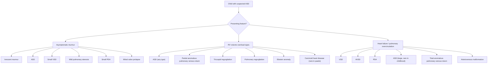

## Differential Diagnosis of Atrial Septal Defect

### General Approach

When a paediatric patient presents with features suggestive of an ASD — an asymptomatic murmur, wide fixed splitting of S2, right ventricular volume overload signs, or incidental echocardiographic findings — the clinician must think systematically about what else could produce these findings. The differential diagnosis is driven by **which clinical feature brought the child to attention**.

There are essentially **three clinical scenarios** that lead to the consideration of ASD:

1. **An asymptomatic child with a murmur** (most common paediatric presentation)
2. **A child with signs of RV volume overload** (parasternal heave, wide split S2)
3. **A child with heart failure / increased pulmonary blood flow** (rare for ASD in childhood — ***ASD is an uncommon cause of heart failure in infancy and childhood*** [3])

Let's build the differential diagnosis around each of these presenting scenarios.

---

### Differential Diagnosis Framework

---

### 1. Differential Diagnosis of an Asymptomatic Murmur in a Child

This is the most common way ASD comes to clinical attention. The key question is: **Is this murmur innocent or pathological?**

| Condition | Key Distinguishing Features | Why It Mimics ASD |
|---|---|---|
| **Innocent / functional murmur** (e.g., Still's murmur) | Grade 1–2/6, vibratory/musical quality, varies with position, **no associated findings** (normal S2 splitting, no heave), child is completely well | Both are asymptomatic systolic murmurs in a well child. Still's murmur is the **most common cause** of an asymptomatic systolic murmur in children aged 2–7 years. Unlike ASD, there is **no wide fixed splitting of S2** and **no parasternal heave** |
| **Small VSD** | Pansystolic murmur (PSM) at **LLSB**, may have thrill, no HF signs if small | Can present as asymptomatic murmur like ASD, but murmur character is different — PSM (holosystolic) rather than ESM, located at LLSB rather than LUSB. No wide fixed split S2. ECG may show LVH rather than RVH [1][5] |
| **Mild pulmonary stenosis (PS)** | ESM at LUSB (same location as ASD flow murmur), ejection click, **S2 may be widely split but NOT fixed** (varies with respiration) | The ESM at LUSB can be confused with ASD. The key difference is: in PS, the splitting of S2 is **wide but varies with respiration** (widens further on inspiration). In ASD, it is **wide and fixed**. Also in PS, an ejection click is often present |
| **Small PDA** | Continuous (machinery) murmur at **left infraclavicular area / LUSB**, bounding pulses if significant | The continuous murmur may be heard only in systole in neonates (before PVR drops), mimicking an ESM. Once PVR drops, the murmur becomes continuous — which ASD murmur never is [1] |
| **Mitral valve prolapse (MVP)** | Mid-systolic click ± late systolic murmur at apex | Both can be incidental findings in an asymptomatic child. MVP is distinguished by the click and apical location |
| **Pulmonary flow murmur of childhood** | Soft ESM at LUSB in thin children, disappears with age | Benign flow murmur across the pulmonary valve in thin or high-output children. No associated S2 abnormality or RV overload signs. Common in febrile, anaemic, or anxious children |

<Callout title="Distinguishing Innocent Murmur from ASD Murmur" type="idea">
The **single most useful bedside discriminator** is the character of S2:
- **Innocent murmur**: Normal S2 splitting (physiological splitting that varies with respiration)
- **ASD**: ***Wide, fixed splitting of S2*** — this does not occur in any innocent murmur

If you hear wide fixed split S2 + ESM at LUSB in an asymptomatic child → think ASD until proven otherwise. If S2 is normal → the murmur is very likely innocent.
</Callout>

---

### 2. Differential Diagnosis of RV Volume Overload

If the child has clinical evidence of RV volume overload (parasternal heave, wide split S2, incomplete RBBB on ECG, RV dilatation on echo), the differential goes beyond simple murmur evaluation.

| Condition | Mechanism of RV Overload | Key Distinguishing Features |
|---|---|---|
| **ASD (secundum, primum, or sinus venosus)** | L-to-R shunt at atrial level → chronic ↑RV preload | ***Wide, fixed splitting of S2***, ESM at LUSB, MDM at LLSB. ECG: R axis deviation + incomplete RBBB (secundum) or L axis deviation + 1° HB (primum) [1][2] |
| **Partial anomalous pulmonary venous return (PAPVR)** | One or more pulmonary veins drain into RA/SVC/IVC instead of LA → extra volume delivered to RA/RV | **Clinically indistinguishable from ASD** (same physiology — extra blood entering RA → RV volume overload → wide split S2 + ESM at LUSB). Often coexists with sinus venosus ASD. Diagnosed by echo/CT/MRI showing anomalous venous drainage [1][2] |
| **Total anomalous pulmonary venous return (TAPVR)** | ALL pulmonary veins drain anomalously → obligatory R-to-L shunt through ASD/PFO for survival | Much sicker presentation: cyanosis + heart failure in neonatal period. An ASD/PFO is actually required for survival in TAPVR (it is the only route for oxygenated blood to reach the systemic circulation). Not confused with isolated ASD clinically |
| **Ebstein anomaly** | Apical displacement of tricuspid valve → "atrialised" portion of RV + severe TR → RA/RV dilatation | Wide split S2 (but NOT fixed), prominent TR murmur, often associated with ASD/PFO. ECG: tall P waves (RA enlargement), RBBB, WPW pattern (accessory pathway). CXR: "wall-to-wall" cardiomegaly |
| **Significant tricuspid regurgitation (other causes)** | Any cause of TR → volume overload of RA and RV | PSM at LLSB that increases with inspiration (Carvallo sign). Hepatic pulsations if severe. Distinguish from ASD by echo |
| **Pulmonary regurgitation** | PR → volume overload of RV | Early diastolic murmur at LUSB. Post-operative (e.g., after TOF repair) is the most common cause in paediatrics |
| **Cardiomyopathy with RV involvement** | Primary myocardial disease → RV dilatation | Dilated cardiomyopathy or arrhythmogenic RV cardiomyopathy (ARVC). Distinguished by impaired systolic function and absence of structural defect on echo |

<Callout title="PAPVR vs ASD — The Great Mimic" type="error">
**Partial anomalous pulmonary venous return (PAPVR)** is clinically almost identical to ASD. Both produce RV volume overload from extra blood entering the right atrium. In fact, sinus venosus ASD is ***associated with partial anomalous drainage of right pulmonary veins into RA*** [1][2], and the two conditions often coexist. If echo shows RV dilatation but no obvious ASD, always look for anomalous pulmonary venous drainage. TEE, CT angiography, or cardiac MRI may be needed.
</Callout>

---

### 3. Differential Diagnosis of Heart Failure with Pulmonary Overcirculation in a Child

***ASD is an uncommon cause of heart failure in infancy and childhood*** [3]. If a child presents with heart failure and increased pulmonary blood flow, the far more likely diagnoses are:

| Condition | Typical Age at HF | Mechanism | Key Distinguishing Features |
|---|---|---|---|
| **VSD (moderate–large)** | **1–2 months** (as PVR drops) | L-to-R shunt at ventricular level → ***LV volume overload*** → pulmonary overcirculation → HF | PSM at LLSB ± thrill, displaced thrusting apex (LV overload, NOT RV overload). HF at 1–2 months as PVR falls [1][5] |
| **Complete AVSD** | **1–2 months** (or earlier with severe MR) | Combined ASD + VSD + AV valve regurgitation → both RV and LV volume overload + early pHT | ***40–50% Down syndrome-related*** [6]. L axis deviation on ECG (endocardial cushion defect pattern). Often presents with HF earlier than isolated VSD due to added AV valve regurgitation |
| **PDA (moderate–large)** | **2–3 months** in term infants; earlier in preterm | L-to-R shunt from aorta to PA → ↑pulmonary blood flow → ***LV volume overload*** | Continuous "machinery" murmur at left infraclavicular area, bounding pulses, wide pulse pressure. ECG: LVH, LAE [1] |
| **Large ASD** | ***Uncommon in infancy/childhood*** [3] | L-to-R shunt at atrial level → RV volume overload | Wide fixed split S2, ESM at LUSB, MDM at LLSB. ***Volume overloading of the right atrium and right ventricle*** [3]. Usually does not cause HF unless very large or associated with other anomalies |
| **TAPVR (obstructed)** | **Neonatal period** (first days of life) | All pulmonary veins drain anomalously; if obstructed → severe pulmonary venous congestion + pulmonary oedema | Severe cyanosis + respiratory distress from birth. CXR: "white-out" lungs (pulmonary oedema), normal-sized heart. Surgical emergency |
| **Arteriovenous malformation (e.g., hepatic AVM, vein of Galen malformation)** | **Neonatal period** | High-flow AV shunt → ↑venous return to heart → high-output cardiac failure | Cranial bruit (Vein of Galen), hepatomegaly (hepatic AVM), bounding pulses. No structural heart defect on echo |
| **Aortopulmonary window** | **Infancy** | Direct communication between ascending aorta and main PA → massive L-to-R shunt | Similar to large PDA but more severe. Continuous murmur. Diagnosed on echo/CT |

<Callout title="The Volume Overload Rule — Which Chamber?">
***Left-to-right shunts (VSD, AVSD, PDA) cause increased pulmonary blood flow → increased pulmonary venous return → volume overloading of left atrium and left ventricle (except atrial septal defect)*** [4]. This is the key distinction:

- **ASD** → ***volume overloading of the right atrium and right ventricle*** [3] (parasternal heave, NO displaced apex)
- **VSD, PDA** → volume overloading of LA and LV (displaced, thrusting apex)
- **AVSD** → both (combined atrial and ventricular level shunting + AV valve regurgitation)

On examination, check whether the overloaded chamber is the **RV (parasternal heave)** or the **LV (displaced apex)**. This immediately narrows your differential.
</Callout>

---

### 4. Differential Diagnosis by Specific Clinical Sign

#### Wide Fixed Split S2

This is the **hallmark sign** of ASD, but there are a few other considerations:

| Condition | S2 Splitting Pattern | Why |
|---|---|---|
| **ASD** | ***Wide, fixed*** | ↑↑RV preload → delayed P2 + ASD equalises respiratory variation [1][2] |
| **PAPVR** | Wide, fixed | Same physiology as ASD — extra volume to RV |
| **RBBB** | Wide, but **varies** with respiration | Delayed RV depolarisation → delayed P2, but respiratory variation preserved because there is no atrial-level pressure equalisation |
| **Pulmonary stenosis** | Wide, but **varies** with respiration | Prolonged RV ejection → delayed P2, but no fixed component |
| **Normal physiological splitting** | **Varies** with respiration (wider on inspiration) | Normal mechanism — ↑venous return on inspiration delays P2 |

> **Key exam point**: If the S2 splitting is wide but **varies** with respiration → NOT ASD. Only ASD (and PAPVR) produce truly **fixed** splitting.

#### ESM at LUSB

| Condition | Mechanism | How to Differentiate from ASD |
|---|---|---|
| **ASD** | Relative pulmonary stenosis from ↑flow through normal PV | Wide fixed split S2, MDM at LLSB, RV heave |
| **Pulmonary stenosis** | True obstruction at pulmonary valve | Ejection click, thrill, S2 may be soft (if severe PS — valve doesn't open well), wide but variable split |
| **Innocent pulmonary flow murmur** | ↑flow through normal PV (thin child, fever, anaemia) | Normal S2, no RV overload, disappears when underlying cause resolves |
| **ASD + pulmonary stenosis (e.g., Noonan syndrome)** | Combined pathology | Noonan syndrome features (Turner-like, short stature, dysplastic PV cusps). ECG may show RVH beyond what expected for ASD alone |

---

### 5. Differential Diagnosis by ECG Pattern

The ECG can be very helpful in distinguishing ASD subtypes from their mimics:

| ECG Pattern | Condition | Explanation |
|---|---|---|
| **R axis deviation + incomplete RBBB** | **Secundum ASD** | RV volume overload → RV dilatation → delayed RV conduction (incomplete RBBB). R axis deviation from RV dominance [1][2] |
| **L axis deviation + 1st degree HB** | **Primum ASD / AVSD** | Endocardial cushion defect → abnormal AV node position (posteroinferior displacement) → ***L axis deviation + 1° HB*** [1][2]. This is virtually pathognomonic for an endocardial cushion defect |
| **R axis deviation + RVH (tall R in V1)** | **Pulmonary stenosis** | RV pressure overload (not volume overload) → RVH with tall R waves and strain pattern |
| **LVH + LAE** | **VSD / PDA** | LV volume overload → LVH. LA dilatation → LAE [1][5] |
| **Tall P waves + RBBB ± WPW** | **Ebstein anomaly** | RA enlargement (tall P waves), RBBB, and frequently WPW pattern (accessory pathway) |

---

### 6. Syndromic Associations — Narrowing the Differential by Phenotype

When ASD is suspected, the child's physical examination may reveal syndromic features that help predict the **type** of ASD and associated anomalies [7]:

| Syndrome | Cardiac Association | Dysmorphic Clues |
|---|---|---|
| **Down syndrome (Trisomy 21)** | ***AVSD*** (most common), VSD, secundum ASD, PDA, TOF | Hypotonia, upslanting palpebral fissures, flat nasal bridge, single palmar crease, wide 1st toe web space [7] |
| **Noonan syndrome** | ***Valvular PS with dysplastic cusps***, peripheral PA stenosis, ***ASD***, HCM | Turner-like features, short stature, ptosis, downslanting palpebral fissures, low-set ears, webbed neck, shield chest [7] |
| **Holt-Oram syndrome** | ***Secundum ASD*** | Upper limb anomalies (absent/hypoplastic thumbs, radial abnormalities), TBX5 mutation [1] |
| **Turner syndrome (45,X)** | Left-sided lesions (coarctation, bicuspid AV, HLHS) — NOT typically ASD | Short stature, webbed neck, wide-spaced nipples [7] |
| **DiGeorge syndrome (22q11.2 deletion)** | Conotruncal anomalies (IAA, truncus, TOF), ***ASD/VSD*** | Abnormal facies, thymic hypoplasia, cleft palate, hypocalcaemia (CATCH-22) [7] |

---

### Summary Table: Key Differentiators of Common ASD Mimics in Paediatrics

| Feature | ASD | VSD | PDA | AVSD | Pulmonary Stenosis | Innocent Murmur |
|---|---|---|---|---|---|---|
| **Murmur type** | ESM (LUSB) + MDM (LLSB) | PSM (LLSB) | Continuous (L infraclavicular) | PSM (LLSB) + ESM (LUSB) | ESM (LUSB) + click | Vibratory ESM, variable |
| **S2** | ***Wide, fixed split*** | Normal / loud P2 | Normal / loud P2 | Wide fixed split + loud P2 | Wide variable split | Normal |
| **Overloaded chamber** | ***RA + RV*** | LA + LV | LA + LV | RA + RV + LA + LV | RV (pressure) | None |
| **Heave** | Parasternal (RV) | Apical (LV) | Apical (LV) | Both | Parasternal (RV) | None |
| **ECG** | RAD + iRBBB (secundum); LAD + 1° HB (primum) | LVH + LAE | LVH + LAE | LAD + combined | RAD + RVH | Normal |
| **HF in infancy** | ***Uncommon*** [3] | Common | Common | Common | Rare (unless critical) | No |

---

<Callout title="High Yield Summary">

1. **Most common DDx scenario**: Asymptomatic child with murmur → distinguish ASD from innocent murmur by the **wide fixed splitting of S2** (pathognomonic for ASD; never occurs in innocent murmurs)
2. **PAPVR is the great mimic** — clinically indistinguishable from ASD, often coexists with sinus venosus ASD. Always look for anomalous pulmonary venous drainage if RV overload without clear ASD
3. **ASD causes RV overload; VSD/PDA cause LV overload** — check whether the parasternal heave (RV) or displaced apex (LV) is present to narrow DDx
4. ***ASD is an uncommon cause of heart failure in infancy and childhood*** — if a child presents with HF and pulmonary overcirculation, think VSD, AVSD, or PDA first
5. **ECG discriminators**: Secundum ASD = RAD + incomplete RBBB; Primum ASD = LAD + 1° HB; VSD/PDA = LVH + LAE; Ebstein = tall P + RBBB ± WPW
6. **Syndromic clues**: Down syndrome → AVSD; Holt-Oram → secundum ASD; Noonan → PS + ASD; DiGeorge → conotruncal + ASD/VSD
7. **ESM at LUSB DDx**: ASD flow murmur vs pulmonary stenosis vs innocent flow murmur — differentiated by S2 character, presence of ejection click, and RV overload signs

</Callout>

---

<ActiveRecallQuiz
  title="Active Recall - ASD Differential Diagnosis"
  items={[
    {
      question: "A 5-year-old asymptomatic girl has an ESM at the LUSB. How do you differentiate ASD from an innocent murmur and from pulmonary stenosis at the bedside?",
      markscheme: "ASD: wide FIXED split S2 + parasternal heave + MDM at LLSB. Innocent murmur: normal S2 splitting (varies with respiration), no heave, no diastolic murmur. Pulmonary stenosis: wide but VARIABLE split S2 (not fixed), ejection click present, may have thrill."
    },
    {
      question: "Which condition is clinically indistinguishable from ASD, often coexists with sinus venosus ASD, and should always be sought when RV dilatation is found without an obvious septal defect?",
      markscheme: "Partial anomalous pulmonary venous return (PAPVR). Same physiology as ASD (extra volume to RA/RV), produces wide fixed split S2 and RV overload. Sinus venosus ASD is specifically associated with PAPVR of the right pulmonary veins. Diagnosed by TEE, CT angiography, or cardiac MRI."
    },
    {
      question: "A 2-month-old with Down syndrome presents with heart failure, a pansystolic murmur at LLSB, and left axis deviation on ECG. What is the most likely diagnosis, and why is isolated ASD less likely?",
      markscheme: "Complete AVSD (most likely). Down syndrome is associated with AVSD in 40-50% of cases. Left axis deviation on ECG is characteristic of endocardial cushion defects. Heart failure at 2 months is common with AVSD/VSD but ASD is an uncommon cause of HF in infancy."
    },
    {
      question: "How does the ECG help differentiate between secundum ASD, primum ASD, and VSD?",
      markscheme: "Secundum ASD: right axis deviation + incomplete RBBB (RV volume overload). Primum ASD: LEFT axis deviation + first-degree heart block (ectopic pacemaker from endocardial cushion defect). VSD: LVH + LAE (LV volume overload). These ECG patterns are nearly diagnostic."
    },
    {
      question: "Why does ASD cause RV volume overload while VSD and PDA cause LV volume overload?",
      markscheme: "In ASD, the L-to-R shunt occurs at the atrial level (LA to RA), so extra blood enters the RA and RV, overloading the right side. In VSD/PDA, blood recirculates through the pulmonary circulation and returns via pulmonary veins to the LA and LV, overloading the left side. In ASD, blood is diverted from LA before it reaches the LV."
    }
  ]}
/>

---

## References

[1] Senior notes: Adrian Lui Pediatrics.pdf (p203–205)
[2] Senior notes: Ryan Ho Cardiology.pdf (p192)
[3] Lecture slides: GC 147. Heart failure and cyanosis in children acyanotic and cyanotic congenital heart disease - Part 1.pdf (p33)
[4] Lecture slides: GC 147. Heart failure and cyanosis in children acyanotic and cyanotic congenital heart disease - Part 1.pdf (p30)
[5] Senior notes: Adrian Lui Pediatrics.pdf (p201)
[6] Senior notes: Adrian Lui Pediatrics.pdf (p205)
[7] Senior notes: Adrian Lui Pediatrics.pdf (p184)
