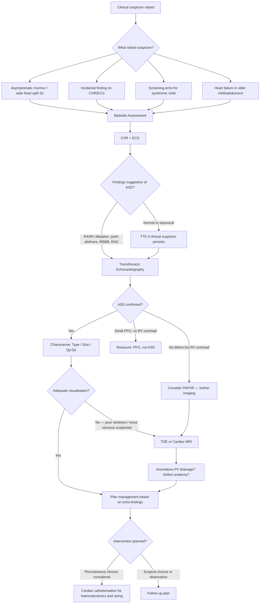

## Diagnosis of Atrial Septal Defect

### Overview of the Diagnostic Approach

ASD in paediatrics is overwhelmingly diagnosed by **echocardiography** — this is the gold standard and is both diagnostic and sufficient for management planning in most cases [1][2]. However, the clinical pathway that leads to echocardiography typically begins with clinical suspicion raised by **auscultation** (wide fixed split S2, ESM at LUSB), supported by **CXR** and **ECG** findings. Let me walk you through this systematically from the bedside to the catheterisation laboratory.

<Callout title="Diagnostic Principle">
There are no formal "diagnostic criteria" for ASD in the way there are for, say, Kawasaki disease or rheumatic fever. ASD is a **structural diagnosis** — it is confirmed when imaging demonstrates a defect in the atrial septum with evidence of inter-atrial shunting. The diagnostic process is therefore about **detecting the defect, characterising its type and size, quantifying the haemodynamic burden, and screening for associated anomalies**.
</Callout>

---

### Diagnostic Algorithm

---

### Step-by-Step Diagnostic Approach

#### Step 1: Clinical Suspicion

Most paediatric ASDs are detected via one of these routes:

| Route | Explanation |
|---|---|
| **Asymptomatic murmur** | Most common route in childhood. ESM at LUSB ± MDM at LLSB detected on routine examination. The hallmark ***wide, fixed splitting of S2*** raises strong suspicion [1][2] |
| **Screening echocardiography in a syndromic child** | Children with Down syndrome, Noonan syndrome, Holt-Oram syndrome, or DiGeorge syndrome should have cardiac screening. ASD may be detected incidentally [1] |
| **Incidental CXR/ECG finding** | Cardiomegaly, pulmonary plethora, or incomplete RBBB discovered on imaging performed for another indication |
| **Heart failure symptoms in an older child/adolescent** | Rare route — ***ASD is an uncommon cause of heart failure in infancy and childhood*** [3]. When it occurs, usually in the setting of very large ASD, associated anomalies, or co-morbidities |
| **Paradoxical embolism** | Extremely rare in paediatrics. A stroke or systemic embolism prompts investigation and reveals an ASD/PFO [1][2] |

---

#### Step 2: CXR (Chest X-Ray)

> ***Investigations can be normal in small ASD*** [1][2] — this is important. A normal CXR does NOT exclude a small ASD.

**What to look for and why:**

| CXR Finding | Pathophysiological Basis | Interpretation |
|---|---|---|
| ***Cardiomegaly*** | RV and RA dilatation from chronic volume overload | ***Cardiothoracic ratio (CTR) ≥ 0.5 in children, ≥ 0.6 in infants*** [8]. Note: thymus in infants may simulate cardiomegaly — a common diagnostic pitfall |
| ***RA/RV dilatation*** | ***Volume overloading of the right atrium and right ventricle*** [3] from L-to-R shunt | RA enlargement → right heart border becomes more convex and bulges into right lung field. RV enlargement → increased CTR + cardiac apex tilts upwards |
| ***Enlarged pulmonary artery (main PA)*** | Increased flow through the pulmonary artery from the L-to-R shunt | Prominent main PA shadow on left heart border (the "2nd mogul" — the bulge between the aortic knuckle and the left atrial appendage) [1][2] |
| ***Pulmonary plethora*** | ***Increased pulmonary blood flow*** [4] from recirculation of shunted blood through the pulmonary vasculature | Pulmonary arteries appear engorged and prominent, extending well into the peripheral lung fields. Vessels visible in the outer third of the lung |
| **Normal LA/LV size** | ASD does NOT cause LA/LV volume overload (unlike VSD/PDA) | This is a key discriminator: if you see **LV dilatation** on CXR, think VSD or PDA, not ASD |

<Callout title="CXR Pitfall in Infants" type="error">
In infants and young children, the **thymus** overlies the mediastinum and can make the cardiac silhouette appear enlarged. The "sail sign" of the thymus should not be mistaken for cardiomegaly. Use the **CTR** carefully and correlate with clinical findings. In doubtful cases, a lateral CXR or echo will resolve the issue [8].
</Callout>

**CXR comparison by ASD size:**

| Feature | Small ASD | Moderate–Large ASD |
|---|---|---|
| Heart size | ***Normal*** | Cardiomegaly (RA/RV dilatation) |
| Pulmonary vasculature | ***Normal*** | Pulmonary plethora |
| Main PA | Normal | Enlarged/prominent |
| Aortic knuckle | Normal | May be small (relatively less systemic flow) |

---

#### Step 3: ECG (Electrocardiogram)

The ECG in ASD reflects the **haemodynamic consequences** (RV volume overload) and can also help distinguish ASD subtypes. Understanding normal paediatric ECG values is essential — remember that neonates and infants have physiological right axis deviation and RV dominance that normalise with age.

**Key ECG findings and their explanations:**

| ECG Finding | Pathophysiological Basis | ASD Subtype |
|---|---|---|
| ***Right axis deviation (RAD)*** | RV dilatation and hypertrophy from chronic volume overload shifts the mean QRS axis to the right (> +90° in children beyond infancy) | ***Secundum ASD*** [1][2] |
| ***Incomplete RBBB (rsR' pattern in V1)*** | ***RV dilatation*** causes delayed conduction through the stretched right bundle branch. The rsR' ("RSR prime") pattern appears because the RV depolarises slightly later than normal. QRS is 80–120 ms (complete RBBB has QRS > 120 ms) [1][2][9] | ***Secundum ASD*** — this is one of the most characteristic ECG findings |
| ***RA enlargement (P pulmonale)*** | Chronic volume overload of RA → RA dilatation → larger P wave amplitude | Any ASD with significant shunt. P wave > 2.5 mm in lead II [10] |
| ***RV dilatation / RVH pattern*** | Tall R waves in V1, deep S in V5/V6 from increased RV mass | Moderate–large ASD |
| ***Left axis deviation (LAD)*** | ***Ectopic pacemaker or abnormal AV node position*** — in endocardial cushion defects, the AV node is displaced posteroinferiorly, and the left anterior fascicle is deficient. The conduction system detours inferiorly then superiorly → superior QRS axis (LAD) [1][2] | ***Primum ASD / AVSD*** — virtually pathognomonic |
| ***1st degree heart block (prolonged PR)*** | Delayed AV conduction due to abnormal AV node anatomy in endocardial cushion defects [1][2] | ***Primum ASD / AVSD*** |
| **Normal ECG** | No significant haemodynamic burden | ***Small ASD*** [1][2] |

<Callout title="The ECG Fingerprint — High Yield">

**Secundum ASD** = ***RAD + incomplete RBBB (rsR' in V1)*** [1][2]

**Primum ASD** = ***LAD + 1st degree heart block*** [1][2]

This distinction is almost diagnostic and is a favourite exam question. If you see LAD + 1° HB on an ECG in a child → think endocardial cushion defect (primum ASD or AVSD) before anything else.

Why the difference? Secundum ASD is a "pure" volume overload of the RV → RAD + iRBBB. Primum ASD involves the endocardial cushion, which contributes to the AV node and conduction system → the conduction apparatus is anatomically abnormal → LAD + prolonged PR.
</Callout>

**Paediatric ECG age-appropriate considerations:**
- In neonates, physiological RVH and right axis deviation are normal → cannot reliably diagnose ASD-related RVH in the first few weeks
- The normal QRS axis shifts leftward with age. RAD beyond 6 months of age is more significant
- The rsR' pattern in V1 can be a **normal variant** in children (partial RBBB) — it becomes more significant when the R' amplitude is prominent and/or associated with RAD and other signs of RV overload [9]

---

#### Step 4: Echocardiography (The Gold Standard)

***Echo is diagnostic and allows evaluation of size*** [1][2]. In the vast majority of paediatric patients, **transthoracic echocardiography (TTE)** is sufficient. ***Transoesophageal echocardiography (TOE/TEE) is preferred for better visualisation*** [1][2], particularly in older/larger children, when planning percutaneous closure, or when TTE windows are suboptimal.

**What echocardiography provides:**

| Echo Assessment | What It Shows | Why It Matters |
|---|---|---|
| **2D imaging** | Direct visualisation of the defect — location, size, number of defects, and rims (surrounding tissue) | **Defect location** determines the ASD type (secundum — central at fossa ovalis; primum — lower septum near AV valves; sinus venosus — near SVC/IVC entry). **Rim adequacy** is critical for deciding if percutaneous device closure is feasible (need ≥ 5 mm of tissue rim around the defect for device anchoring, except the aortic rim) |
| **Colour-flow Doppler** | Demonstrates the direction and extent of inter-atrial shunting (L-to-R in most cases; bidirectional or R-to-L if elevated PVR) | Confirms the defect is haemodynamically significant. A PFO may show minimal colour flow only with Valsalva manoeuvre, whereas a true ASD shows persistent shunting |
| **Chamber dimensions** | RA and RV dilatation (volume overload), LA and LV size (should be normal in isolated ASD) | **RV dilatation** is the hallmark of a haemodynamically significant ASD. If only RV is dilated with normal LV → confirms ASD rather than VSD/PDA |
| **Interventricular septal motion** | Paradoxical septal motion (septum bows towards LV in diastole) | In significant RV volume overload, the interventricular septum flattens or bows into the LV during diastole ("D-shaped LV" on short-axis view). This is because the overloaded RV pushes the septum leftward |
| **Qp:Qs estimation** | Ratio of pulmonary to systemic blood flow, calculated from Doppler flow measurements across the pulmonary and aortic valves | **Quantifies shunt magnitude**: < 1.5:1 = small; 1.5–2:1 = moderate; > 2:1 = large, ***indication for closure*** [1][2] |
| **RV systolic pressure estimation** | Derived from TR jet velocity (if TR present) using modified Bernoulli equation: RVSP = 4 × (TR velocity)² + estimated RAP | Screens for **pulmonary hypertension**. Elevated RVSP suggests ↑PVR and may influence timing/indication for closure |
| **AV valve assessment** | Mitral valve morphology (cleft?), mitral regurgitation, tricuspid regurgitation | ***Primum ASD is associated with cleft mitral valve and MR*** [1][2]. If echo shows a cleft MV → primum ASD / AVSD spectrum |
| **Pulmonary venous drainage** | Identifies where all 4 pulmonary veins drain | Essential to rule out ***partial anomalous pulmonary venous return (PAPVR)***, which is ***associated with sinus venosus defect*** [1][2]. If pulmonary veins drain anomalously → sinus venosus type |
| **Associated anomalies** | Other cardiac defects (VSD, PDA, PS, etc.) | ASD may be part of a more complex lesion. Must systematically exclude associated defects |

**Echo subtypes — how to identify each ASD type:**

| ASD Type | Echo Appearance | Key Additional Findings |
|---|---|---|
| **Secundum** | Defect in the **central part** of the atrial septum at the fossa ovalis. Dropout of tissue on 2D with L-to-R flow on colour Doppler | Assess rims for percutaneous closure feasibility. Look for multiple fenestrations |
| **Primum** | Defect in the **lower/inferior** part of the atrial septum, adjacent to the AV valves | ***Cleft anterior mitral valve leaflet*** visible on short-axis view. Assess for MR severity. May see "goose-neck" deformity of LVOT on angiography |
| **Sinus venosus (superior)** | Defect at the **junction of SVC and RA**, high in the septum. SVC overrides the septum | ***Anomalous drainage of right upper pulmonary vein into SVC or RA*** [1][2]. Often missed on standard TTE — may need TOE or cardiac MRI |
| **Sinus venosus (inferior)** | Defect at the **junction of IVC and RA**, low in the septum | Rare. IVC overrides the septum. May have anomalous drainage of right lower PV |
| **Coronary sinus** | Unroofed coronary sinus with communication to LA | Look for persistent left SVC draining into coronary sinus. Very rare |

<Callout title="TTE vs TOE in Paediatric ASD" type="idea">
In children, **TTE is usually adequate** because of excellent acoustic windows through the thin chest wall. ***TOE is preferred for better visualisation*** [1][2] in the following scenarios:
- **Pre-procedure planning** for percutaneous device closure (need precise rim measurements)
- **Intraoperative guidance** during device deployment
- **Sinus venosus defect suspected** but not well visualised on TTE (high SVC junction is a difficult window on TTE)
- **Older/larger children and adolescents** with poor TTE windows

In young children, TOE requires **general anaesthesia or deep sedation** — consider this in the risk-benefit analysis.
</Callout>

---

#### Step 5: Additional Imaging (When Needed)

| Modality | When Used | What It Provides |
|---|---|---|
| **Cardiac MRI** | Sinus venosus defect suspected but poorly visualised on TTE/TOE; quantification of Qp:Qs when echo is suboptimal; assessment of PAPVR; RV volume/function quantification | Gold standard for RV volumetry (quantifies RV dilatation more accurately than echo). Excellent for mapping pulmonary venous drainage — critical for sinus venosus defects. Provides accurate Qp:Qs without catheterisation |
| **CT angiography** | When cardiac MRI not available or contraindicated; emergency assessment of associated anomalies; surgical planning in complex cases | Good for anatomical delineation of pulmonary venous drainage and associated vascular anomalies. Drawback: radiation exposure (important in paediatrics — ALARA principle) |
| **Cardiac catheterisation** | Pre-intervention haemodynamic assessment; when percutaneous closure is planned (therapeutic + diagnostic); assessing PVR if pulmonary hypertension suspected; equivocal non-invasive data | Provides **direct measurement** of chamber pressures, oxygen saturations (allows precise Qp:Qs calculation by Fick method), and PVR. Balloon sizing of the defect during planned percutaneous closure. Also used to assess **reversibility of pulmonary hypertension** with vasodilator testing if Eisenmenger syndrome is a concern |
| **Bubble contrast echocardiography** | Differentiating PFO from ASD; detecting small defects or right-to-left shunting | Agitated saline injected into peripheral vein → microbubbles appear in RA. If bubbles cross to LA within 3 cardiac cycles → inter-atrial communication present. If bubbles only cross with Valsalva → suggests PFO rather than ASD. Useful in older children/adolescents being evaluated for paradoxical embolism |

---

#### Step 6: Cardiac Catheterisation (Haemodynamic Assessment)

While echo is diagnostic, **cardiac catheterisation** is performed when:
1. ***Percutaneous closure is planned*** — catheterisation is both diagnostic and therapeutic
2. **Pulmonary hypertension is suspected** — need to directly measure PA pressure and PVR, and test reversibility with pulmonary vasodilators (e.g., inhaled nitric oxide, IV adenosine)
3. **Non-invasive data is equivocal** — discrepancy between clinical picture and echo findings

**Key catheterisation findings in ASD:**

| Measurement | Expected Finding | Interpretation |
|---|---|---|
| **"Step-up" in O₂ saturation at RA level** | RA O₂ sat significantly higher than SVC O₂ sat (≥ 7% step-up at atrial level is significant) | Confirms L-to-R shunt at atrial level. Oxygenated blood from LA mixes with deoxygenated blood in RA, raising RA saturation |
| **Qp:Qs by Fick principle** | Calculated from O₂ saturations: Qp:Qs = (SaO₂ - MvO₂) / (PvO₂ - PaO₂) | ***Qp:Qs > 2:1 = significant shunt → indication for closure*** [1][2]. Qp:Qs = 1.5–2:1 = moderate. Qp:Qs < 1.5:1 = small |
| **RA pressure** | May be mildly elevated or equalised with LA | In large ASD, RA and LA pressures equalise (the defect is non-restrictive) |
| **PA pressure** | Mildly elevated if large shunt; significantly elevated if developing pHT | PA systolic > 50% of systemic systolic pressure suggests significant pHT |
| **PVR** | Normal or mildly elevated | If PVR is significantly elevated (> 8 Wood units·m²) and not reversible with vasodilator testing → closure may be contraindicated (risk of RV failure post-closure) |
| **Balloon sizing** | Stretch diameter of the defect measured during balloon occlusion | Used to select appropriately sized closure device for percutaneous closure. Only for secundum ASD |

<Callout title="The Oxygen Saturation Step-Up — First Principles" type="idea">
Why does RA oxygen saturation rise in ASD? Normally:
- **SVC blood** (deoxygenated from upper body) has O₂ sat ~65–70%
- **IVC blood** (deoxygenated from lower body, slightly higher due to renal vein mixing) has O₂ sat ~70–75%
- **RA mixed venous** blood has O₂ sat ~70–75%

In ASD, oxygenated LA blood (O₂ sat ~98–99%) shunts across into the RA → RA sat rises to ~85–90%. This "step-up" at the atrial level (compared to SVC) is diagnostic of a left-to-right shunt at the atrial level. A step-up of ≥ 7% at the atrial level is considered significant.
</Callout>

---

### Laboratory Investigations

ASD is a structural diagnosis, so **blood tests are not diagnostic**. However, they are part of the overall assessment:

| Test | Purpose |
|---|---|
| **FBC** | Baseline; polycythaemia in late-stage Eisenmenger (compensatory erythrocytosis due to chronic hypoxia) |
| **BNP / NT-proBNP** | Elevated in significant volume overload or heart failure; useful for monitoring response to treatment and determining timing of intervention |
| **Pulse oximetry** | Should be normal in isolated L-to-R shunt ASD. If SpO₂ < 95% → consider shunt reversal (Eisenmenger), associated cyanotic CHD, or lung disease |
| **Blood gas** | Usually not needed unless HF or cyanosis present |
| **Genetic testing** | If syndromic ASD suspected: karyotype (Down syndrome), TBX5 (Holt-Oram), GATA4, NKX2-5, MYH6 mutations; microarray for 22q11.2 deletion (DiGeorge) [1] |

---

### Summary: Investigation Findings by ASD Size

| Investigation | Small ASD | Moderate ASD | Large ASD |
|---|---|---|---|
| **CXR** | ***Normal*** [1][2] | Mild cardiomegaly, mild pulmonary plethora | Cardiomegaly (RA/RV), prominent PA, pulmonary plethora |
| **ECG** | ***Normal*** [1][2] | RAD, rsR' in V1 | RAD, iRBBB, RA enlargement, ± RVH |
| **Echo** | Small defect, no RV dilatation, Qp:Qs < 1.5:1 | Moderate defect, RV dilatation, Qp:Qs 1.5–2:1 | Large defect, significant RV dilatation, paradoxical septal motion, Qp:Qs > 2:1 |
| **Catheterisation** | Usually not indicated | May be performed if closure planned | Indicated if pHT suspected or percutaneous closure planned |

---

### Criteria for Haemodynamic Significance (Guides Intervention Decision)

| Parameter | Threshold | Significance |
|---|---|---|
| **Qp:Qs** | ***> 2:1*** [1][2] | ***Indication for closure*** — this is the most commonly cited criterion |
| **RV dilatation on echo** | Qualitative or quantitative RV enlargement | Even if Qp:Qs is borderline, RV dilatation suggests significant chronic volume overload |
| **Defect size** | < 8 mm in children < 1 year | ***> 80% spontaneous closure if < 8 mm*** [1][2] — can observe |
| **Symptoms** | HF symptoms, exercise intolerance, recurrent RTIs | Symptoms in the presence of ASD suggest haemodynamic significance |
| **PA pressure** | PA systolic > 50% of systemic | Suggests developing pulmonary hypertension — may accelerate timing of closure |
| **PVR** | Significantly elevated, irreversible | ***Contraindication to closure*** if severe pHT with shunt reversal [1] |

---

### Age-Specific Diagnostic Considerations

| Age Group | Key Points |
|---|---|
| **Neonate** | ASD is rarely symptomatic. A small PFO/ASD may be seen on routine echo — this is physiological in the first few days/weeks. Do not over-diagnose. Follow-up if defect > 5–6 mm |
| **Infant (< 1 year)** | ***> 80% spontaneous closure if < 8 mm*** [1][2]. Serial echo follow-up rather than immediate intervention for small-moderate defects. Thymus on CXR may mimic cardiomegaly [8] |
| **Child (1–10 years)** | Most are detected by asymptomatic murmur. TTE provides excellent views. If asymptomatic and small defect → continue observation. If Qp:Qs > 2:1 or RV dilatation → plan closure, usually after age 2 years to allow chance of spontaneous closure [1] |
| **Adolescent** | May begin to develop exercise intolerance, palpitations. ECG may show atrial arrhythmias. Consider intervention if not already done. TTE windows may be less optimal → consider TOE or cardiac MRI |

---

<Callout title="High Yield Summary">

1. **Echo is the gold standard** — ***diagnostic and allows evaluation of size*** [1][2]. TTE is usually sufficient in paediatrics; ***TOE preferred for better visualisation*** in older children and for pre-procedure planning [1][2]
2. ***Investigations can be normal in small ASD*** [1][2] — normal CXR and ECG do NOT exclude a small ASD
3. **CXR findings** (when present): cardiomegaly (RA/RV), enlarged main PA, pulmonary plethora. No LV enlargement (unlike VSD/PDA)
4. **ECG fingerprints**: Secundum ASD = ***RAD + incomplete RBBB (rsR' in V1)*** [1][2]; Primum ASD = ***LAD + 1st degree heart block*** [1][2]
5. **Echo must assess**: defect type/size/rims, RV dilatation, Qp:Qs, AV valve morphology (cleft MV?), pulmonary venous drainage (PAPVR?), estimated PA pressure
6. **Cardiac catheterisation**: O₂ saturation step-up at RA level confirms L-to-R shunt; ***Qp:Qs > 2:1 = indication for closure*** [1][2]; PVR assessment if pHT suspected
7. **Cardiac MRI**: Best for sinus venosus ASD, PAPVR delineation, and accurate RV volumetry
8. **Spontaneous closure**: ***> 80% if < 8 mm*** [1][2] — can observe; usually defer intervention to age > 2 years if asymptomatic

</Callout>

---

<ActiveRecallQuiz
  title="Active Recall - ASD Diagnosis"
  items={[
    {
      question: "What are the expected ECG findings in secundum ASD vs primum ASD, and explain the pathophysiological basis for each pattern?",
      markscheme: "Secundum ASD: Right axis deviation + incomplete RBBB (rsR' in V1). Basis: RV volume overload causes RV dilatation, which stretches and delays conduction through the right bundle branch. Primum ASD: Left axis deviation + 1st degree heart block. Basis: Endocardial cushion defect displaces the AV node posteroinferiorly and the left anterior fascicle is deficient, causing a superior (leftward) axis and prolonged AV conduction."
    },
    {
      question: "A child with suspected ASD has a normal CXR and normal ECG. Does this exclude the diagnosis?",
      markscheme: "No. Investigations can be normal in small ASD. A small ASD with Qp:Qs less than 1.5:1 may not produce enough RV volume overload to cause detectable CXR or ECG changes. Echocardiography is needed to confirm or exclude the diagnosis."
    },
    {
      question: "On cardiac catheterisation, how do you confirm a left-to-right shunt at the atrial level using oxygen saturations?",
      markscheme: "Demonstrate an oxygen saturation 'step-up' at the RA level: RA O2 sat is significantly higher than SVC O2 sat (step-up of 7% or more is significant). This occurs because oxygenated blood from the LA crosses the ASD into the RA, raising the mixed RA saturation. Qp:Qs can then be calculated using the Fick principle."
    },
    {
      question: "What echocardiographic features suggest a primum ASD rather than a secundum ASD?",
      markscheme: "Primum ASD: defect in the lower/inferior part of the atrial septum adjacent to the AV valves; cleft in the anterior mitral valve leaflet visible on short-axis view; mitral regurgitation; may show 'goose-neck' LVOT deformity. Secundum ASD: defect in the central septum at the fossa ovalis with intact AV valves."
    },
    {
      question: "Why is cardiac MRI particularly valuable for sinus venosus ASD, and what finding should you specifically look for?",
      markscheme: "Sinus venosus ASD is located high at the SVC-RA junction and is often poorly visualised on TTE. Cardiac MRI provides excellent delineation of the defect anatomy and, critically, can map pulmonary venous drainage to detect partial anomalous pulmonary venous return (PAPVR) of the right pulmonary veins into the SVC or RA, which is specifically associated with sinus venosus defects."
    },
    {
      question: "What Qp:Qs ratio indicates a significant shunt requiring closure, and what percentage of small ASDs close spontaneously?",
      markscheme: "Qp:Qs greater than 2:1 indicates significant shunting and is the threshold for closure. More than 80% of small ASDs (less than 8mm) close spontaneously, which is why observation is preferred initially, with intervention usually deferred until after age 2 years."
    }
  ]}
/>

---

## References

[1] Senior notes: Adrian Lui Pediatrics.pdf (p203–205)
[2] Senior notes: Ryan Ho Cardiology.pdf (p192)
[3] Lecture slides: GC 147. Heart failure and cyanosis in children acyanotic and cyanotic congenital heart disease - Part 1.pdf (p33)
[4] Lecture slides: GC 147. Heart failure and cyanosis in children acyanotic and cyanotic congenital heart disease - Part 1.pdf (p30)
[8] Senior notes: Adrian Lui Pediatrics.pdf (p198)
[9] Senior notes: Ryan Ho Fundamentals.pdf (p461)
[10] Senior notes: Ryan Ho Fundamentals.pdf (p454)
