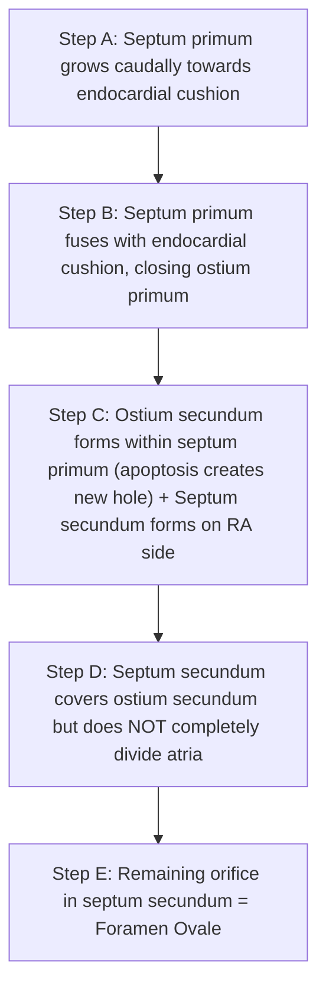
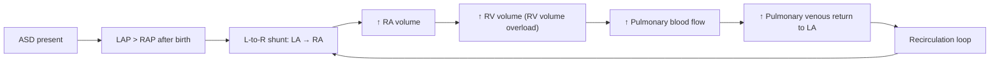

# Atrial Septal Defect (ASD) in Paediatrics

## Definition

An atrial septal defect (ASD) is a **structural deficiency (hole) in the atrial septum** that allows communication between the left and right atria. The name tells you exactly what it is: "atrial" = relating to the atrium, "septal" = relating to the septum (dividing wall), "defect" = a structural abnormality.

Crucially, a **patent foramen ovale (PFO) is NOT considered an ASD** because no septal tissue is actually missing — it is merely a failure of fusion of two overlapping flaps that were designed to stay open in fetal life [1][2]. An ASD, by contrast, represents genuinely absent or deficient septal tissue.

> **ASD produces a chronic left-to-right shunt** because after birth, left atrial pressure (LAP) exceeds right atrial pressure (RAP), driving oxygenated blood from the LA back into the RA. This results in ***volume overloading of the right atrium and right ventricle*** [3], unlike most other left-to-right shunt lesions (VSD, PDA) which cause LV volume overload [4].

<Callout title="Key Conceptual Point">
***Left-to-right shunts (VSD, AVSD, PDA) cause increased pulmonary blood flow → increased pulmonary venous return → volume overloading of left atrium and left ventricle (except atrial septal defect)*** [4]. ASD is the exception because the shunt occurs at the atrial level — blood recirculates through the RA and RV rather than returning to the LA and LV. This is why ASD causes **right-sided** volume overload while VSD and PDA cause **left-sided** volume overload.
</Callout>

---

## Epidemiology

- **~6% of all congenital heart disease (CHD)** — the **5th most common CHD** overall [1][2]
- Incidence: **1–2 per 1,000 live births** [1][2]
- **Female predominance (F > M)**, roughly 2:1 for secundum ASD [1][2]
- Secundum ASD is the **most common CHD presenting in adulthood** because it is so well-tolerated in childhood
- In Hong Kong, CHD affects approximately 8–10 per 1,000 live births (consistent with global figures); ASD is among the most commonly diagnosed acyanotic CHD in local paediatric cardiology clinics
- ***ASD is an uncommon cause of heart failure in infancy and childhood*** [3] — this is a key exam point: if a child presents with heart failure, ASD is low on the list unless the defect is very large or associated with other anomalies

### Age at Presentation
- **Infancy/childhood**: Mostly **asymptomatic**; detected incidentally on murmur or echocardiography [1][2]
- **Adolescence/young adulthood (20–40 years)**: Symptomatic presentation with exercise intolerance, atrial arrhythmias, or heart failure [1][2]
- **Primum ASD** tends to **present earlier** than secundum ASD because it is often associated with AV valve regurgitation [1][2]

---

## Risk Factors

| Category | Details |
|---|---|
| **Genetic / Syndromic** | ***Holt-Oram syndrome*** (heart-hand syndrome: secundum ASD + upper limb anomalies, TBX5 mutation); ***GATA4, MYH6, NKX2-5 mutations*** [1] |
| **Chromosomal** | Trisomy 21 (Down syndrome) — more commonly associated with AVSD, but also seen with primum ASD |
| **Familial CHD** | Family history of CHD increases risk |
| **Maternal factors** | Maternal rubella, alcohol, anti-epileptic drugs (phenytoin, valproate), poorly controlled maternal diabetes |
| **Prematurity** | Higher incidence of PFO/ASD |

<Callout title="Syndromic Associations — High Yield" type="idea">
- **Secundum ASD** → Holt-Oram syndrome (TBX5), GATA4, MYH6, NKX2-5
- **Primum ASD** → Down syndrome (Trisomy 21), often part of AVSD spectrum
- **Sinus venosus ASD** → Partial anomalous pulmonary venous return (PAPVR)

These associations are commonly tested. If you see "upper limb anomaly + ASD" → think Holt-Oram. If you see "Down syndrome + ASD" → think primum ASD / AVSD.
</Callout>

---

## Anatomy and Embryology of the Atrial Septum

Understanding the embryology is **essential** for understanding the different types of ASD. Let me walk you through this step by step.

### Normal Atrial Septum Formation

The atrial septum is formed by **two septa growing from different directions** with carefully timed perforations:

**Step-by-step** [1][2]:

1. **(A) Septum primum** grows **caudally** (downwards) from the roof of the common atrium towards the **endocardial cushion** (the central connective tissue mass)
2. **(B) Septum primum fuses** with the endocardial cushion → this **closes the ostium primum** (the gap between the lower edge of septum primum and the cushion)
3. **(C)** Before this gap fully closes, **programmed cell death (apoptosis)** creates holes in the upper portion of septum primum → these coalesce to form the **ostium secundum**. Simultaneously, the **septum secundum** begins to grow on the **right atrial side** of septum primum
4. **(D) Septum secundum** is a thicker, muscular septum that grows downward to **cover the ostium secundum** — but it **deliberately does not fully close**, leaving an opening
5. **(E)** This remaining opening in septum secundum = **foramen ovale**

### Fetal Circulation Through the Atrial Septum

- In the fetus: **RAP > LAP** (because PVR is very high → minimal blood goes through the lungs → minimal pulmonary venous return to LA) [1][2]
- Blood flows **RA → LA** through the foramen ovale, with septum primum acting as a one-way flap valve
- This is essential for fetal circulation — oxygenated blood from the placenta (via umbilical vein → IVC → RA) is directed to the LA and then to the systemic circulation

### Closure at Birth

- **At birth**: First breath → lung expansion → ↓PVR → ↑pulmonary blood flow → ↑pulmonary venous return to LA → **↑LAP** [1][2]
- **LAP now exceeds RAP** → septum primum is **pressed against the foramen ovale** like a valve slamming shut [1][2]
- Over weeks to months: **gradual fusion** of septum primum to septum secundum → permanent closure
- Functional closure: within hours to days
- Anatomical closure: by 3–12 months in most; **~25–30% of population** retain a probe-patent PFO (clinically insignificant unless pathological right-to-left shunt)

---

## Aetiology and Classification

### Types of ASD

| Type | Frequency | Mechanism | Associations |
|---|---|---|---|
| **Secundum ASD** | ***~70%*** (most common) | Failure to close **foramen secundum** (deficient or fenestrated septum primum, or excessive resorption) | Holt-Oram syndrome, GATA4, MYH6, NKX2-5; may occur with ↑RAP in setting of PFO (~30%) [1][2] |
| **Primum ASD** | ***~15–20%*** | Failure to close **foramen primum** (septum primum fails to fuse with endocardial cushion) | ***Cleft mitral valve (and MR)***, AVSD; Down syndrome [1][2] |
| **Sinus venosus defect** | ***~5–10%*** | ***Malposition of SVC/IVC straddling the septum*** | ***Partial anomalous pulmonary venous drainage of right pulmonary veins into RA*** [1][2] |
| **Coronary sinus ASD** (unroofed coronary sinus) | Very rare (< 1%) | Deficiency in the wall between the coronary sinus and the LA | Persistent left SVC |

<Callout title="Exam Favourite: Primum vs Secundum ASD" type="error">
Students commonly confuse these. Remember:
- **Primum** ASD = **lower** part of the septum (near the AV valves / endocardial cushion) → associated with **cleft MV, MR, and AVSD**. On ECG: **left axis deviation + 1st degree heart block**
- **Secundum** ASD = **middle/central** part of the septum (at the fossa ovalis) → the "classic" ASD. On ECG: **right axis deviation + incomplete RBBB**
- **Sinus venosus** = **upper** (superior type) or **lower** (inferior type) part of the septum near SVC/IVC entry → always check for anomalous pulmonary venous drainage
</Callout>

### Detailed Pathophysiology of Each Type

#### Secundum ASD (70%)
- Deficiency in **septum primum** at the region of the fossa ovalis
- Ranges from a small fenestration to near-complete absence of the septum primum
- **Why does it present late?** Because the defect is well-compensated: the RV is a very compliant chamber that can accommodate increased volume for decades without significant pressure elevation
- ***May be due to ↑RAP in the setting of PFO (30%)*** [1][2] — meaning in some patients, what appears to be an ASD is actually a stretched-open PFO from chronically elevated RA pressure (e.g., from RV dysfunction, pulmonary hypertension)

#### Primum ASD (15–20%)
- Part of the **endocardial cushion defect spectrum** (same embryological group as AVSD)
- The endocardial cushion contributes to:
  - Lower atrial septum
  - Upper ventricular septum
  - Septal leaflets of mitral and tricuspid valves
- When the endocardial cushion is deficient → **primum ASD** (lower atrial septum gap) + often a **cleft in the anterior leaflet of the mitral valve** → MR [1][2]
- ***Presents early*** compared to secundum because the MR adds additional hemodynamic burden [1][2]

#### Sinus Venosus Defect (5–10%)
- **Not a true "septal" defect** — it is a deficiency in the wall between the SVC (or IVC) and the pulmonary veins as they enter the LA
- The SVC (or IVC) effectively "straddles" the atrial septum
- ***Associated with partial anomalous drainage of right pulmonary veins into RA*** [1][2] — because the right upper pulmonary vein often inserts near this defect and gets "captured" into the RA side
- Cannot be closed by percutaneous device (requires surgical repair)

---

## Pathophysiology

### The Left-to-Right Shunt

**Key haemodynamic features** [1][2][3]:

1. **Chronic L-to-R shunt throughout the entire cardiac cycle** (both systole and diastole) — because the shunt is driven by the pressure difference between LA and RA, which is relatively constant
2. **RV volume overload** — the RV receives its own normal systemic venous return PLUS the shunted blood from the LA
3. ***Volume overloading of the right atrium and right ventricle*** [3]
4. **Increased pulmonary blood flow** → pulmonary plethora on CXR
5. The **LV is NOT volume-overloaded** (unlike VSD/PDA) because blood is diverted away from the LV before it enters the LV

### Why ASD is So Well-Tolerated in Children

- The **RV is highly compliant** — it can accept a large volume load without a significant rise in pressure for many years
- The shunt volume depends on:
  - **Size of the defect**
  - **Relative compliance of RV vs LV** (RV is more compliant → blood preferentially goes to RA/RV)
  - **PVR vs SVR** (after birth, PVR < SVR → favours L-to-R flow)
- There is no significant pressure transmission across the defect (unlike a large VSD where LV pressure is transmitted to RV)
- ***ASD is an uncommon cause of heart failure in infancy and childhood*** [3] — because the RV handles the extra volume without distress

### When Does It Become a Problem?

| Timeframe | What happens | Why |
|---|---|---|
| **Childhood** | Mostly asymptomatic | Compliant RV accommodates extra volume |
| **20–40 years** | HF symptoms, atrial arrhythmias | **Chronic RV volume overload** → eventual RV dysfunction; chronic RA stretching → atrial fibrillation/flutter |
| **Late adulthood** | Rare: Eisenmenger syndrome (~10%) | Chronic ↑pulmonary blood flow → irreversible pulmonary vascular remodelling → ↑PVR → reversal of shunt (R-to-L) → cyanosis [1][2] |

<Callout title="Why Does Eisenmenger Syndrome Develop Late in ASD?">
In VSD or PDA, the RV/pulmonary arteries are exposed to high **pressure** from birth → pulmonary vascular remodelling occurs early (months to years). In ASD, the pulmonary circulation is exposed to high **volume** but not high pressure (because the RV/PA pressure remains relatively normal initially). Volume overload takes **decades** to produce irreversible pulmonary vascular changes. This is why Eisenmenger in ASD is rare (~10%) and occurs in the elderly, whereas in VSD it can occur by school age [1][2].
</Callout>

### Quantifying the Shunt: Qp:Qs Ratio

- **Qp:Qs** = ratio of pulmonary blood flow to systemic blood flow
- Normal = 1:1
- **Small ASD**: Qp:Qs < 1.5:1 → haemodynamically insignificant
- **Moderate ASD**: Qp:Qs = 1.5–2:1
- **Large ASD**: Qp:Qs > 2:1 → significant shunting, indication for closure [2]

---

## Clinical Features

### Overview: ***ASD is an uncommon cause of heart failure in infancy and childhood*** [3]

The **majority of children with ASD are asymptomatic** and are detected incidentally through an asymptomatic murmur or during screening echocardiography [1][2]. Symptomatic presentation in childhood is rare unless the defect is very large or associated with other anomalies.

### Symptoms

| Symptom | Pathophysiological Basis | Age Group |
|---|---|---|
| **Asymptomatic** (majority) | RV is compliant; tolerates chronic volume overload in childhood | Children, adolescents [1][2] |
| **Recurrent lower respiratory tract infections** | ↑Pulmonary blood flow → pulmonary congestion → impaired airway clearance → susceptibility to infection | Infants/young children with large ASD |
| **Exercise intolerance / fatigue / SOBOE** | ↑RV volume overload → ↓effective systemic cardiac output (blood recirculates through lungs instead of going to body); late RV dysfunction | Adolescents, young adults [1][2] |
| **Palpitations** | Chronic RA/RV stretching → atrial arrhythmias (atrial fibrillation, atrial flutter) | Adults (20–40 years) [1][2] |
| **Paradoxical embolism → stroke** (rare) | Venous thrombus crosses ASD from RA to LA → systemic arterial embolisation to brain | Any age (rare in children) [1][2] |
| **Heart failure symptoms** | Eventual RV failure from chronic volume overload | Adults; ***rare in infancy/childhood*** [3] |
| **Failure to thrive** | Only in very large ASD with significant L-to-R shunt in infancy → ↑metabolic demand, ↓systemic output | Infants (uncommon) |

### Signs

| Sign | Pathophysiological Basis |
|---|---|
| **Right ventricular heave (parasternal heave)** | **RV volume overload** → RV dilatation and hypertrophy → palpable RV impulse at left sternal border [1][2] |
| ***Wide, fixed splitting of S2*** **(characteristic)** | **S2 splitting**: Normally S2 has A2 (aortic valve closure) followed by P2 (pulmonary valve closure). During inspiration, ↑venous return to RV → ↑RV ejection time → P2 delayed → wider splitting. In ASD: ***↑↑RV preload → obligatory large flow volume through RV*** → P2 is **always delayed**. Additionally, the ASD equalises atrial pressures → respiratory variation in venous return is shared between both atria → **no respiratory variation** in split. Result = **wide AND fixed** splitting [2] |
| **Ejection systolic murmur (ESM) at LUSB (pulmonary area)** | ***Due to ↑ pulmonary valve (PV) flow*** — the murmur is NOT from blood crossing the ASD itself (which is low-velocity/low-turbulence), but from the **relative pulmonary stenosis** created by increased volume flowing through a normal-sized pulmonary valve [2] |
| **Mid-diastolic murmur (MDM) at LLSB (tricuspid area)** | ***Due to ↑ tricuspid valve (TV) flow*** — increased volume flowing from RA to RV through a normal-sized tricuspid valve creates a low-pitched rumbling diastolic murmur (flow murmur) [1][2] |
| **Precordial bulge** | Long-standing RV enlargement in growing child deforms the anterior chest wall | 
| **Displaced apex beat (rare in ASD)** | Usually NOT displaced unless there is associated LV pathology (e.g., MR in primum ASD) |

<Callout title="The Murmur in ASD — A Common Misunderstanding" type="error">
The murmur in ASD is **NOT caused by blood flowing through the hole**. Blood crossing the ASD is low-velocity (low pressure gradient between atria) and does not generate turbulence. The murmurs you hear are:
1. **ESM at LUSB** = relative pulmonary stenosis from increased flow through the pulmonary valve
2. **MDM at LLSB** = relative tricuspid stenosis from increased flow through the tricuspid valve

This is why a tiny ASD may have **no murmur at all** — there isn't enough extra flow to create audible turbulence.
</Callout>

### Additional Signs Specific to Primum ASD
- **Pansystolic murmur at apex** — due to **mitral regurgitation** from the cleft mitral valve
- Earlier presentation with heart failure symptoms due to added MR burden

### Additional Signs if Pulmonary Hypertension Develops
- **Loud P2** — increased pressure in the pulmonary artery → more forceful closure of the pulmonary valve
- **Right-sided S3/S4**
- **Hepatomegaly, peripheral oedema** — right heart failure from RV pressure overload
- **Cyanosis** — if shunt reverses (Eisenmenger syndrome: R-to-L shunt → deoxygenated blood enters systemic circulation)

### Why Does ASD Cause Wide Fixed Splitting of S2? (Detailed Explanation)

This is probably the most commonly tested clinical sign in ASD, so let's break it down from first principles:

**Normal S2 splitting:**
- A2 occurs when the aortic valve closes (end of LV systole)
- P2 occurs when the pulmonary valve closes (end of RV systole)
- Normally P2 comes slightly after A2 because the pulmonary vascular impedance is lower → RV ejection takes slightly longer
- During **inspiration**: ↑intrathoracic negative pressure → ↑venous return to RA/RV → ↑RV stroke volume → ↑RV ejection time → P2 is further delayed → **wider split**
- During **expiration**: ↓venous return to RV → ↓RV ejection time → A2 and P2 come closer together → **narrower split**

**In ASD:**
1. **Wide**: The RV is chronically volume-overloaded from the L-to-R shunt → always has a large stroke volume to eject → P2 is always delayed
2. **Fixed**: The ASD acts as a "pressure equaliser" between the two atria. When you inspire and more blood comes back to the RA, some of that extra blood simply flows through the ASD to the LA rather than increasing RV volume. Conversely, in expiration, more blood comes from the LA through the ASD to the RA. The net effect is that **respiratory changes in venous return are distributed equally between both ventricles** → no variation in the degree of splitting

---

## Summary of Key Differences: ASD vs VSD vs PDA

| Feature | ASD | VSD | PDA |
|---|---|---|---|
| **Chamber overloaded** | ***RA + RV (volume)*** | LA + LV (volume) | LA + LV (volume) |
| **Shunt timing** | Throughout cardiac cycle | Mainly systole | Continuous (systole + diastole) |
| **Characteristic murmur** | ESM at LUSB + MDM at LLSB | PSM at LLSB | Continuous "machinery" murmur at L infraclavicular |
| **S2 finding** | Wide fixed split | Normal or loud P2 | Normal or loud P2 |
| **HF in infancy** | ***Uncommon*** | Common (moderate-large VSD) | Common (large PDA) |
| **Eisenmenger timing** | Late (elderly, ~10%) | Early (school age if uncorrected) | Intermediate |

---

## Comparison with AVSD (for Completeness)

Since primum ASD is part of the AVSD spectrum, here is a brief comparison:

| Feature | Partial AVSD | Complete AVSD |
|---|---|---|
| **ASD component** | Primum ASD | Primum ASD |
| **VSD component** | Ventricular septum intact | Inlet VSD present |
| **AV valve** | Cleft MV, two separate AV valve orifices | Single common AV valve with cleft TV + MV |
| **Haemodynamics** | RV volume overload + MR | RV + LV volume overload + MR + TR + pulmonary hypertension |
| **Presentation** | Murmur in childhood, relatively asymptomatic | ***Infantile heart failure at 1–2 months*** |
| **Association** | | ***40–50% Down syndrome-related*** |
| **Surgical timing** | Elective repair | Usually by 3 months |

---

<Callout title="High Yield Summary">

1. **ASD = deficiency in atrial septum** allowing L-to-R shunt. PFO ≠ ASD (no tissue missing in PFO)
2. **Types**: Secundum (70%, most common, presents late) > Primum (15-20%, a/w cleft MV/MR, presents early) > Sinus venosus (5-10%, a/w PAPVR) > Coronary sinus (rare)
3. **Pathophysiology**: L-to-R shunt → ***RV volume overload*** (NOT LV overload unlike VSD/PDA) → ***uncommon cause of HF in infancy/childhood***
4. **Characteristic sign**: ***Wide, fixed splitting of S2*** (due to ↑↑RV preload → obligatory flow volume → delayed PV closure + ASD equalises respiratory variation)
5. **Murmurs**: ESM at LUSB (↑ PV flow) + MDM at LLSB (↑ TV flow) — NOT from blood crossing the ASD
6. **Natural history**: Asymptomatic in childhood → symptomatic at 20-40y (HF, atrial arrhythmias) → rarely Eisenmenger in elderly (~10%)
7. **Associations**: Secundum → Holt-Oram, GATA4, NKX2-5; Primum → Down syndrome, AVSD; Sinus venosus → PAPVR
8. **ECG clue**: Secundum = R axis deviation + incomplete RBBB; Primum = ***L axis deviation + 1st degree heart block***
9. **Left-to-right shunts (VSD, AVSD, PDA) → increased pulmonary blood flow → increased pulmonary venous return → volume overloading of LA and LV (except ASD)***

</Callout>

---

<ActiveRecallQuiz
  title="Active Recall - Atrial Septal Defect"
  items={[
    {
      question: "Why does ASD cause RV volume overload rather than LV volume overload (as seen in VSD and PDA)?",
      markscheme: "In ASD, the shunt occurs at the atrial level (LA to RA), so extra blood enters the RA and RV, overloading the right side. In VSD/PDA, blood recirculates through the pulmonary veins back to the LA and LV, causing left-sided overload. ASD diverts blood away from the LV before it reaches the LV."
    },
    {
      question: "Explain the mechanism of wide, fixed splitting of S2 in ASD.",
      markscheme: "Wide: Chronic RV volume overload from L-to-R shunt increases RV ejection time, delaying P2. Fixed: ASD equalises pressures between atria, so respiratory variation in venous return is shared equally between both ventricles, eliminating the normal respiratory variation in the degree of S2 splitting."
    },
    {
      question: "What murmurs are heard in ASD, and what causes them? Why is there no murmur from blood crossing the ASD itself?",
      markscheme: "ESM at LUSB (relative pulmonary stenosis from increased flow through normal-sized pulmonary valve) and MDM at LLSB (relative tricuspid stenosis from increased flow through normal-sized tricuspid valve). No murmur from the ASD itself because the pressure gradient between LA and RA is very small, producing low-velocity laminar flow that does not generate turbulence."
    },
    {
      question: "A child with Down syndrome has a primum ASD. What additional cardiac findings would you expect, and what ECG pattern differentiates primum from secundum ASD?",
      markscheme: "Primum ASD is associated with cleft mitral valve causing MR (pansystolic murmur at apex) and may be part of AVSD spectrum. ECG: Primum ASD shows left axis deviation and first-degree heart block, whereas secundum ASD shows right axis deviation and incomplete RBBB."
    },
    {
      question: "Why is ASD an uncommon cause of heart failure in infancy and childhood?",
      markscheme: "The RV is highly compliant and can accommodate a chronic volume load for decades without significant pressure elevation. The shunt is a volume load (not pressure load), so pulmonary hypertension develops very slowly. Symptoms typically do not manifest until 20-40 years of age when RV dysfunction and atrial arrhythmias develop."
    },
    {
      question: "Name the three main types of ASD, their relative frequencies, and one key association for each.",
      markscheme: "Secundum ASD (70%) - Holt-Oram syndrome (or GATA4/NKX2-5 mutations). Primum ASD (15-20%) - cleft mitral valve, MR, AVSD, Down syndrome. Sinus venosus defect (5-10%) - partial anomalous pulmonary venous return of right pulmonary veins into RA."
    }
  ]}
/>

---

## References

[1] Senior notes: Adrian Lui Pediatrics.pdf (p203-205)
[2] Senior notes: Ryan Ho Cardiology.pdf (p192)
[3] Lecture slides: GC 147. Heart failure and cyanosis in children acyanotic and cyanotic congenital heart disease - Part 1.pdf (p32-33)
[4] Lecture slides: GC 147. Heart failure and cyanosis in children acyanotic and cyanotic congenital heart disease - Part 1.pdf (p30)
