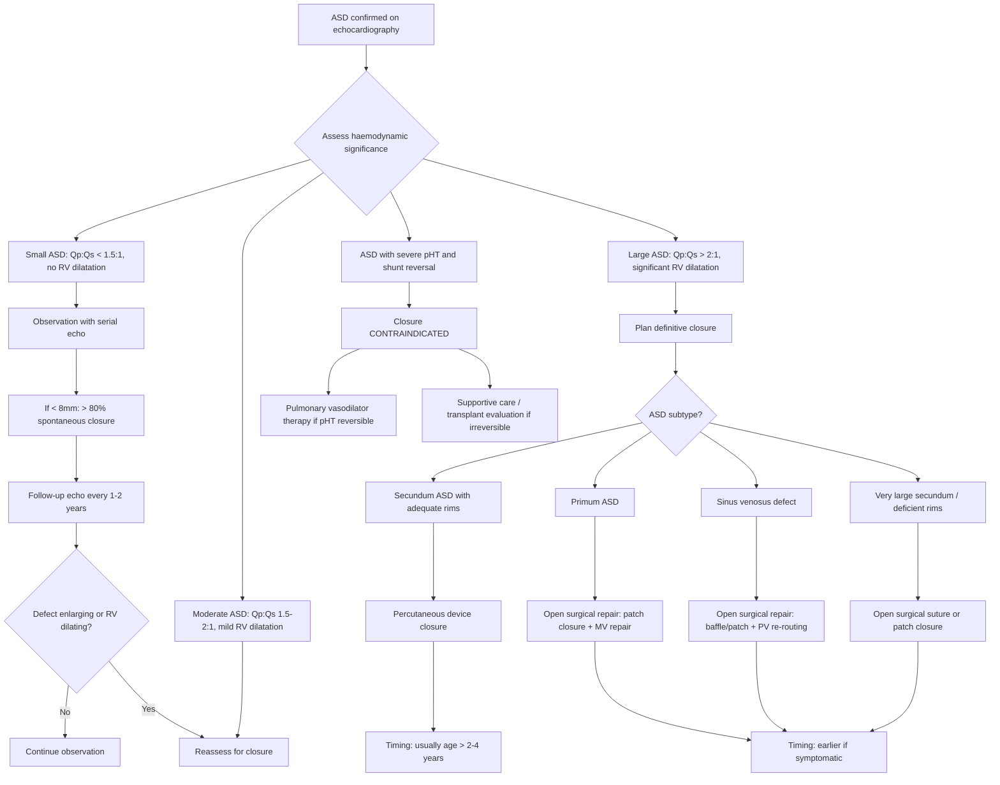

## Management of Atrial Septal Defect

### Management Philosophy

The management of ASD in paediatrics is remarkably different from most other left-to-right shunt lesions (VSD, PDA, AVSD). Why? Because ***ASD is an uncommon cause of heart failure in infancy and childhood*** [3] — the RV tolerates chronic volume overload for decades. This means there is **no urgency** in most cases, and the management strategy centres on:

1. **Observation** for small defects (high spontaneous closure rate)
2. **Elective closure** for haemodynamically significant defects (usually deferred to allow for spontaneous closure)
3. **Medical management of heart failure** only as a bridge or temporising measure — **definitive treatment is closure of the defect**

<Callout title="Fundamental Principle">
Unlike VSD where medical HF management buys time for spontaneous closure (60-80% close by age 5), ASD management is simpler: most small ASDs close spontaneously, and those that don't can be closed electively at low risk. The key question is always: **Is this ASD haemodynamically significant (Qp:Qs > 2:1)?** If yes → close it. If no → observe it [1][2].
</Callout>

---

### Management Algorithm

---

### 1. Observation (Conservative Management)

***Can just observe for small ASD (> 80% spontaneous closure if < 8 mm)*** [1][2]

#### Who Qualifies for Observation?

| Criterion | Details |
|---|---|
| **Defect size** | ***< 8 mm*** in children under 1 year [1][2] |
| **Haemodynamic significance** | Qp:Qs < 1.5:1, no evidence of RV dilatation |
| **Symptoms** | Asymptomatic |
| **ASD type** | Secundum ASD (spontaneous closure applies almost exclusively to this type) |

#### Why Can We Observe?

From first principles:
- The atrial septum continues to grow in early childhood
- Small secundum defects may be covered by growth of surrounding septal tissue or by adherence of the valve of the fossa ovalis
- ***> 80% of secundum ASDs < 8 mm close spontaneously*** [1][2]
- Even if they don't close, a small ASD with Qp:Qs < 1.5:1 causes minimal haemodynamic burden and may never require intervention

#### Follow-Up Protocol

- **Serial echocardiography**: every 12–24 months in infancy/early childhood
- Assess: defect size, RV dimensions, estimated Qp:Qs, development of any associated findings
- Reassess for closure if the defect enlarges, RV begins to dilate, or symptoms develop
- ***Timing: usually defer till > 2 years if asymptomatic (wait for spontaneous closure)*** [1]

<Callout title="Important Caveat" type="error">
Spontaneous closure applies primarily to **secundum ASDs**. **Primum ASD** and **sinus venosus defects** do NOT close spontaneously — they involve fundamentally different tissue planes. If a primum or sinus venosus defect is identified, plan for surgical repair rather than waiting.
</Callout>

---

### 2. Indications for Closure

***Surgical closure only if Qp:Qs > 2:1 or other evidence of significant shunting*** [1][2]

| Indication | Rationale |
|---|---|
| ***Qp:Qs > 2:1*** | This is the primary haemodynamic threshold. A ratio > 2:1 means more than twice as much blood is going through the lungs as through the systemic circulation — this represents a significant recirculatory burden on the RV [1][2] |
| **RV dilatation on echo** | Even if Qp:Qs is borderline (1.5–2:1), echocardiographic evidence of RV volume overload (RV dilatation, paradoxical septal motion) suggests the shunt is haemodynamically significant |
| **Symptoms attributable to ASD** | Exercise intolerance, recurrent lower RTIs, heart failure symptoms, growth faltering |
| **Paradoxical embolism** | History of cryptogenic stroke or TIA with documented ASD — closure prevents recurrence |
| **Before pregnancy** (adolescents) | Women with significant ASD should have closure before pregnancy to avoid complications from increased blood volume and cardiac output of pregnancy |
| **Atrial arrhythmias** | Atrial fibrillation/flutter from chronic RA stretching — earlier closure may prevent progression, though established arrhythmias may persist post-closure |

---

### 3. Contraindications to Closure

***Contraindicated if severe pulmonary hypertension and shunt reversal*** [1]

| Contraindication | Rationale (from first principles) |
|---|---|
| ***Severe pHT with shunt reversal (Eisenmenger syndrome)*** | In Eisenmenger physiology, the R-to-L shunt across the ASD is acting as a **pressure relief valve** for the overloaded RV. Closing the ASD would: (1) remove this decompression route → acute RV failure; (2) eliminate the only source of systemic oxygenation in R-to-L shunt → catastrophic hypoxia. Closure is therefore ***absolutely contraindicated*** [1] |
| **PVR significantly elevated and irreversible** | If PVR is > 8 Wood units·m² (indexed) and does not respond to vasodilator testing (inhaled NO, IV adenosine), closure carries prohibitive risk of post-operative RV failure and death. Caution zone: PVR 5–8 WU·m² — requires careful multidisciplinary assessment |
| **Very small, haemodynamically insignificant ASD** | Not a "contraindication" per se, but closure is not indicated — risk of procedure outweighs benefit when there is no haemodynamic burden |

<Callout title="The Eisenmenger Paradox">
In Eisenmenger syndrome, the ASD that was once pathological (causing L-to-R shunting and RV overload) has become **protective** (allowing R-to-L shunting to decompress the RV and maintain some cardiac output, albeit at the expense of cyanosis). This is why closing the defect in Eisenmenger is lethal — you remove the RV's escape valve. Management in this situation shifts to **pulmonary vasodilator therapy** (endothelin antagonists, PDE5 inhibitors, prostacyclin analogues) and eventual consideration of **heart-lung transplantation** [11].
</Callout>

---

### 4. Closure Modalities

***Choice: percutaneous for majority; open suture/patch closure for primum, sinus venosus, or very large secundum ASD*** [1]

#### A. Percutaneous Transcatheter Device Closure

This is the **preferred method** for eligible secundum ASDs and represents one of the great advances in paediatric interventional cardiology.

| Aspect | Details |
|---|---|
| **Principle** | A closure device (e.g., Amplatzer Septal Occluder, or newer devices) is delivered via a catheter through the femoral vein → RA → across the ASD → deployed to straddle the defect with two discs (one on each side of the septum), sandwiching the septal tissue |
| **Indications** | ***Secundum ASD*** with adequate tissue rims (≥ 5 mm of rim around the defect in most directions, except the aortic rim which can be deficient) for device anchoring; defect size suitable for available devices (typically ≤ 38 mm stretched diameter) [1] |
| **Advantages** | No sternotomy or cardiopulmonary bypass; shorter hospital stay (often discharged next day); faster recovery; no chest scar; lower complication rate vs surgery |
| **Limitations** | NOT suitable for primum ASD (too close to AV valves — device would interfere with mitral/tricuspid valves), sinus venosus defect (no inferior rim to anchor), very large secundum ASD (insufficient rim tissue), or coronary sinus ASD |
| **Age/weight requirements** | Generally performed when child is ≥ 15–20 kg (some centres accept smaller children). In practice, ***usually deferred till > 2 years*** [1] to allow for spontaneous closure and adequate child growth for safe catheter access |
| **Complications** | Device embolisation (rare, ~1%), erosion (very rare, < 0.1%), residual shunt (small, often closes spontaneously), arrhythmias (transient), vascular access site complications, air embolism, stroke |
| **Post-procedure care** | Aspirin 3–5 mg/kg/day for 6 months (to prevent thrombus formation on the device before endothelialisation); endocarditis prophylaxis for 6 months post-procedure; follow-up echo at 1, 6, and 12 months |

<Callout title="Why Not All ASDs Can Be Closed Percutaneously" type="idea">
The closure device needs **tissue rims** to anchor against — think of it like a double-sided button that grabs the septum from both sides. If the rims are deficient (especially the posteroinferior, superior, or IVC rims), the device has nothing to grip and may embolise or sit in the wrong position. The **aortic rim** (anterosuperior) is commonly deficient and is the one rim where deficiency is generally still acceptable for device closure, because the device can be abutted against the aortic root. However, if **multiple rims** are deficient, or the defect is simply too large → surgical closure is needed [1].
</Callout>

#### B. Open Surgical Closure

| Aspect | Details |
|---|---|
| **Principle** | Median sternotomy → cardiopulmonary bypass (CPB) → direct visualisation and closure of the ASD by **primary suture** (if small defect with adequate tissue) or **patch closure** (pericardial patch or synthetic patch such as Dacron/Gore-Tex) |
| **Indications** | ***Primum ASD***: requires patch closure + repair of cleft mitral valve [1][6]; ***Sinus venosus defect***: requires patch/baffle to redirect anomalous pulmonary veins to the LA [1]; ***Very large secundum ASD*** with deficient rims not amenable to device closure [1]; Failed percutaneous closure; ASD associated with other defects requiring surgical correction |
| **Advantages** | Can address any ASD type; can repair associated anomalies (cleft MV, PAPVR) simultaneously; definitive |
| **Disadvantages** | Requires sternotomy and CPB; longer hospital stay (typically 5–7 days); sternotomy scar; risks of CPB (systemic inflammatory response, neurological injury, renal injury); potential for post-pericardiotomy syndrome |
| **Mortality** | Very low: < 1% in experienced centres [1] |
| **Timing** | ***Usually deferred till > 2 years if asymptomatic*** [1], but can be performed earlier if symptomatic or if associated anomalies require early intervention |

#### Surgical Approach by ASD Type

| ASD Type | Surgical Technique | Additional Procedures |
|---|---|---|
| **Secundum** | Primary suture closure (if small with good rims) or patch closure (pericardial or synthetic patch) | None usually required |
| **Primum** | ***Patch closure of ASD + repair of cleft mitral valve*** (suturing the cleft in the anterior MV leaflet) [1][6] | Assess for residual MR intraoperatively with TOE |
| **Sinus venosus (superior)** | ***Baffle/patch to redirect anomalous pulmonary veins into LA*** + closure of the defect. Often uses a "Warden procedure" (SVC is transected above the anomalous vein insertion, upper SVC is anastomosed to the RA appendage, and a patch redirects PV flow into LA) [1] | Must ensure SVC flow is not obstructed post-repair |
| **Coronary sinus** | Patch closure of the unroofed coronary sinus + redirection of persistent left SVC if present | Rare procedure |

---

### 5. Medical Management of Heart Failure

ASD rarely causes HF in childhood, but when it does (very large ASD, associated anomalies, or infant with co-morbidities), medical management follows the ***general principles of paediatric heart failure management*** [3][12]:

***Management of Paediatric Heart Failure*** [3]:
1. ***Identification of the cause and precipitating factors***
2. ***Tackling of precipitating factors***
3. ***General supportive management***
4. ***Medical therapy of heart failure (diuretics, digoxin, ACEI, carvedilol)***
5. ***Treatment of underlying cause, if possible, by surgical or catheter intervention***
6. ***Mechanical circulatory support and heart transplantation***

#### Medical Therapy — Applied to ASD

| Agent | Mechanism | Role in ASD-Related HF | Paediatric Dosing Considerations |
|---|---|---|---|
| **Diuretics (furosemide / frusemide)** | ↓preload by promoting renal sodium and water excretion → ↓pulmonary congestion and ↓RV preload | First-line for symptomatic fluid overload. Reduces pulmonary congestion and hepatic congestion. Does NOT address the underlying shunt | IV: 1 mg/kg/dose; PO: 1–2 mg/kg/dose, 1–3 times daily. Monitor electrolytes (hypokalaemia, hyponatraemia) |
| **Spironolactone** | Aldosterone antagonist → potassium-sparing diuretic + anti-fibrotic effects | Often added to furosemide for synergistic diuresis and to counteract hypokalaemia. Also has beneficial neurohormonal effects | 1–3 mg/kg/day in 1–2 divided doses |
| **ACE inhibitors (captopril, enalapril)** | ↓afterload by blocking angiotensin II → ↓SVR → potentially ↑L-to-R shunting in some cases, but overall benefit from neurohormonal modulation and ↓ventricular remodelling | Used in HF with LV dysfunction or significant MR (e.g., primum ASD with cleft MV and MR). Must be used with **caution** in isolated ASD because ↓SVR can increase the L-to-R shunt | Captopril: 0.5–2 mg/kg/day in 3 divided doses. Enalapril: 0.1–0.5 mg/kg/day in 1–2 doses. Monitor renal function and potassium |
| **Carvedilol (beta-blocker)** | ↓heart rate + ↓neurohormonal activation (blocks beta and alpha receptors) → improves ventricular efficiency | Used in chronic HF with ventricular dysfunction. Not first-line for ASD but may be added in severe cases | Start low: 0.05 mg/kg/dose BD, titrate up to 0.35 mg/kg/dose BD. Introduced only when patient is euvolaemic |
| **Digoxin** | Positive inotrope (inhibits Na⁺/K⁺-ATPase → ↑intracellular Ca²⁺ → ↑contractility) + vagotonic effect (slows AV conduction) | ***Seldom used due to narrow therapeutic index*** [8]. May be considered in refractory HF or to control rate in atrial arrhythmias | 5–10 mcg/kg/day in divided doses. Monitor levels (therapeutic range 0.8–2.0 ng/mL in paediatrics). Toxicity: arrhythmias, GI symptoms, visual changes |

<Callout title="Medical Therapy is a Bridge, Not a Destination" type="error">
In ASD, medical management of HF is **only a temporising measure**. The definitive treatment is ***closure of the defect by surgical or catheter intervention*** [3]. Unlike VSD where 60-80% close spontaneously and medical management may be all that is needed, a haemodynamically significant ASD that is causing HF will not improve without closure. Do not delay definitive intervention while "optimising" medically.
</Callout>

#### General Supportive Measures in ASD-Related HF

| Measure | Rationale |
|---|---|
| **Nutritional support: high-calorie feeds** | HF increases metabolic demand; infants in HF burn more calories for breathing and maintaining circulation → risk of failure to thrive. Use calorie-dense formulas (e.g., 1 kcal/mL) or fortified breast milk. Nasogastric feeding if oral intake insufficient [8] |
| **Fluid restriction** | ↓preload, ↓pulmonary and systemic congestion. Typically restrict to 100–120 mL/kg/day in infants with HF |
| **Bed rest / activity modification** | ↓metabolic demand in acute HF |
| ***Oxygen — use with caution in large L-to-R shunts*** | ***↑PaO₂ → pulmonary vasodilation → ↓PVR → ↑L-to-R shunting → worsens HF*** [8]. Only use O₂ if there is significant hypoxaemia. Do NOT routinely supplement O₂ in acyanotic CHD with L-to-R shunt |
| **Treat precipitating factors** | Infections (especially RTIs), anaemia, arrhythmias, electrolyte disturbances — all can tip a compensated ASD into decompensation |

<Callout title="The Oxygen Trap in L-to-R Shunts" type="error">
This is a favourite exam pitfall: ***Caution with O₂ in large L-to-R shunts*** [8]. Supplemental oxygen causes pulmonary vasodilation → ↓PVR → ↑L-to-R shunting → ↑pulmonary blood flow → worsens pulmonary overcirculation and HF. Only give O₂ if the child is genuinely hypoxaemic, not prophylactically.
</Callout>

---

### 6. Antibiotic Prophylaxis for Infective Endocarditis

***Antibiotic prophylaxis is NOT indicated for isolated secundum ASD*** [1]

| Scenario | IE Prophylaxis Needed? | Rationale |
|---|---|---|
| **Isolated secundum ASD (unoperated)** | ***No*** [1] | Low-velocity flow across the ASD does not create endothelial damage → negligible IE risk. ASD is one of the few CHDs where prophylaxis is explicitly NOT recommended |
| **ASD with device closure (first 6 months)** | **Yes** | The device is a foreign body that has not yet endothelialised → risk of device-related endocarditis. Prophylaxis for 6 months post-implantation |
| **ASD with residual shunt post-closure** | **Yes** | A residual shunt adjacent to prosthetic material creates turbulent flow → endothelial injury → IE risk |
| **Primum ASD with cleft MV / MR** | **Yes** | MR creates a high-velocity jet that damages the atrial endocardium → vegetation nidus |
| **Any ASD with prior IE** | **Yes** | Previous IE is an independent indication for lifelong prophylaxis regardless of anatomy |

**Prophylaxis regimen** (when indicated, before dental procedures with gingival manipulation):
- **Amoxicillin** 50 mg/kg PO (max 2g) 30–60 minutes before procedure
- If penicillin-allergic: **Clindamycin** 20 mg/kg PO (max 600 mg) or **Azithromycin** 15 mg/kg PO (max 500 mg)

---

### 7. Long-Term Follow-Up

#### After Successful Closure

| Timeframe | Follow-Up | Purpose |
|---|---|---|
| **1 month** | Clinical assessment + echo | Confirm device position (if percutaneous), check for residual shunt, pericardial effusion |
| **6 months** | Clinical + echo | Assess endothelialisation of device, residual shunt, RV size (should be normalising). If clear → stop aspirin (for device closure) and stop IE prophylaxis |
| **12 months** | Clinical + echo + ECG | Confirm RV normalisation, resolution of iRBBB/RAD on ECG. Most children can be discharged from follow-up if completely normal |
| **Ongoing (lifelong if late closure)** | Periodic assessment | Late closure (in adulthood) may not lead to complete RV normalisation. Monitor for atrial arrhythmias (may persist even after successful closure if RA was chronically stretched). Annual or biannual assessment |

#### Unclosed ASD on Observation

- Serial echo every 1–2 years
- Monitor for: defect enlargement, development of RV dilatation, symptoms, exercise intolerance
- Transition planning to adult congenital heart disease (ACHD) services in adolescence

---

### 8. Special Situations

#### ASD in Neonates

- ASD/PFO is physiological in the first days of life — do not intervene on a small ASD in a neonate
- **Exception**: in certain cyanotic CHD (TGA, HLHS, PAIVS), the ASD is actually **essential** for survival as it allows inter-atrial mixing. If the ASD is restrictive → ***transcatheter balloon atrial septostomy (Rashkind procedure)*** to enlarge the communication [13]
- In ASD-dependent lesions: ***emergency IV PGE₁*** to maintain ductal patency alongside septostomy [13]

#### ASD in Down Syndrome

- Most commonly **primum ASD / AVSD** — screen all children with Down syndrome with echocardiography within the first 6 weeks of life
- Earlier development of pulmonary hypertension due to associated upper airway obstruction (chronic hypoxia, obstructive sleep apnoea) → earlier surgical repair recommended (typically by 3–6 months for complete AVSD) [6]

#### ASD in Pregnancy (Adolescent Consideration)

- Significant unclosed ASD → increased risk of paradoxical embolism, atrial arrhythmias, and HF during pregnancy due to physiological increase in blood volume and cardiac output
- Ideally close ASD before planned pregnancy
- If diagnosed during pregnancy → medical management; percutaneous closure can be performed in second trimester if necessary (with minimised fluoroscopy)

---

### Management Summary Table

| ASD Category | Management Strategy | Timing |
|---|---|---|
| **Small, asymptomatic secundum (< 8 mm)** | ***Observation — > 80% spontaneous closure*** [1][2] | Serial echo follow-up |
| **Moderate secundum with RV dilatation** | Elective closure | ***Usually > 2 years*** [1] |
| **Large secundum, Qp:Qs > 2:1** | ***Percutaneous device closure (first choice)*** [1] | > 2 years, weight > 15-20 kg |
| **Large secundum with deficient rims** | ***Open surgical patch closure*** [1] | > 2 years if asymptomatic |
| **Primum ASD** | ***Open surgical repair: patch + cleft MV repair*** [1][6] | Earlier if symptomatic (MR) |
| **Sinus venosus defect** | ***Open surgical repair: baffle + PV re-routing*** [1] | > 2 years if asymptomatic |
| **ASD with HF in infancy** | Medical HF therapy → early surgical/catheter closure | As soon as feasible |
| **ASD with severe pHT / Eisenmenger** | ***Closure CONTRAINDICATED*** [1] → Pulmonary vasodilators ± transplant evaluation | Supportive/palliative |

---

<Callout title="High Yield Summary">

1. ***Can observe small ASD — > 80% spontaneous closure if < 8 mm*** [1][2]. Applies to secundum ASD only
2. ***Closure indicated if Qp:Qs > 2:1 or other evidence of significant shunting*** [1][2]
3. ***Choice: percutaneous device closure for majority of secundum ASDs; open surgical repair for primum, sinus venosus, or very large secundum with deficient rims*** [1]
4. ***Timing: usually defer till > 2 years if asymptomatic*** to allow spontaneous closure [1]
5. ***Closure contraindicated if severe pHT with shunt reversal (Eisenmenger)*** — the ASD is now a protective pressure relief valve [1]
6. ***Antibiotic prophylaxis NOT indicated for isolated secundum ASD*** [1]
7. ***Paediatric HF management***: identification of cause → tackle precipitating factors → general supportive measures → ***medical therapy (diuretics, digoxin, ACEI, carvedilol)*** → ***surgical/catheter intervention*** → mechanical support/transplant [3]
8. ***Caution with O₂ in large L-to-R shunts*** — ↓PVR → ↑shunting → worsens HF [8]
9. **Primum ASD** requires surgical repair with cleft MV repair — does NOT close spontaneously
10. **Sinus venosus defect** requires surgical repair with PV re-routing — NOT amenable to device closure

</Callout>

---

<ActiveRecallQuiz
  title="Active Recall - ASD Management"
  items={[
    {
      question: "What is the primary haemodynamic criterion for ASD closure, and what is the preferred closure method for a secundum ASD with adequate rims?",
      markscheme: "Qp:Qs greater than 2:1 is the primary criterion. Percutaneous transcatheter device closure is preferred for secundum ASD with adequate rims (at least 5mm rim in most directions). This avoids sternotomy and CPB, has shorter recovery, and lower complication rates."
    },
    {
      question: "A 6-month-old has a 5mm secundum ASD with no RV dilatation. What is the management plan and why?",
      markscheme: "Observation with serial echo follow-up. More than 80% of secundum ASDs less than 8mm close spontaneously. No RV dilatation means haemodynamically insignificant. Defer intervention to at least age 2 years to allow for spontaneous closure. Repeat echo every 1-2 years."
    },
    {
      question: "Why is ASD closure contraindicated in Eisenmenger syndrome? What would happen if you closed the defect?",
      markscheme: "In Eisenmenger, the ASD acts as a pressure relief valve for the overloaded RV, allowing R-to-L shunting. Closing the ASD would: 1) remove this decompression route causing acute RV failure due to inability to eject against high PVR; 2) eliminate the only route for systemic blood flow via R-to-L shunt, causing catastrophic hypoxia."
    },
    {
      question: "Why can percutaneous device closure NOT be used for primum ASD or sinus venosus defects?",
      markscheme: "Primum ASD: located adjacent to AV valves; a device would interfere with MV/TV function and cannot be safely anchored. Also requires simultaneous repair of cleft mitral valve. Sinus venosus defect: located at SVC or IVC junction; no inferior septal rim for device anchoring. Also requires re-routing of anomalous pulmonary veins, which can only be done surgically."
    },
    {
      question: "Explain why supplemental oxygen should be used with caution in a child with a large ASD and heart failure.",
      markscheme: "Supplemental O2 causes pulmonary vasodilation, which reduces PVR. In a large L-to-R shunt, reducing PVR increases the L-to-R shunting across the ASD, which increases pulmonary blood flow, worsens pulmonary overcirculation, and exacerbates heart failure. Only use O2 if the child has genuine hypoxaemia."
    },
    {
      question: "Is antibiotic prophylaxis for IE indicated in isolated secundum ASD? What about after device closure?",
      markscheme: "Isolated secundum ASD: prophylaxis NOT indicated (low-velocity flow, negligible IE risk). After device closure: prophylaxis IS indicated for 6 months post-procedure until the device is endothelialised. After 6 months with no residual shunt, prophylaxis can be stopped."
    }
  ]}
/>

---

## References

[1] Senior notes: Adrian Lui Pediatrics.pdf (p203–205)
[2] Senior notes: Ryan Ho Cardiology.pdf (p192)
[3] Lecture slides: GC 147. Heart failure and cyanosis in children acyanotic and cyanotic congenital heart disease - Part 1.pdf (p33, p36)
[4] Lecture slides: GC 147. Heart failure and cyanosis in children acyanotic and cyanotic congenital heart disease - Part 1.pdf (p30)
[6] Senior notes: Adrian Lui Pediatrics.pdf (p205)
[8] Senior notes: Adrian Lui Pediatrics.pdf (p200)
[9] Senior notes: Ryan Ho Fundamentals.pdf (p461)
[11] Senior notes: Ryan Ho Respiratory.pdf (p139)
[12] Lecture slides: GC 147. Heart failure and cyanosis in children acyanotic and cyanotic congenital heart disease - Part 1.pdf (p36)
[13] Senior notes: Adrian Lui Pediatrics.pdf (p228)
