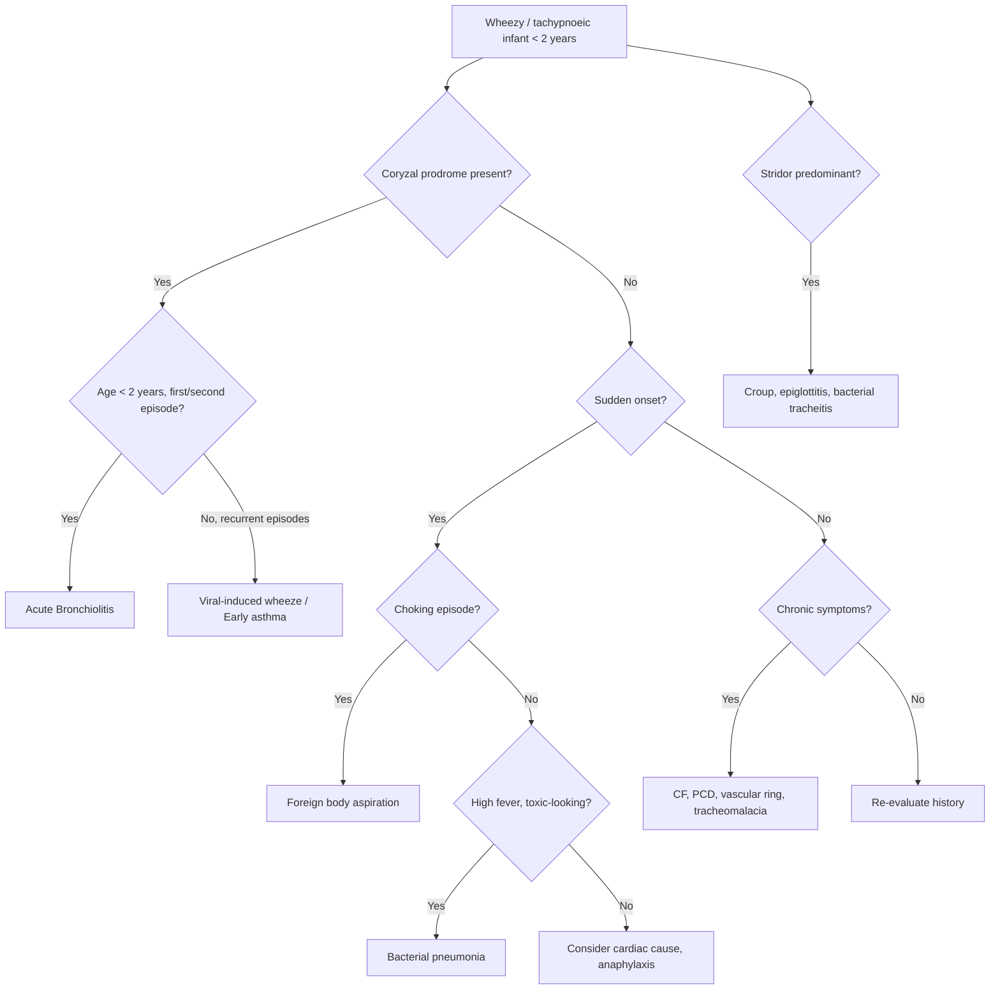

## Differential Diagnosis of Bronchiolitis

When you're standing in front of a wheezy, tachypnoeic infant in the emergency department, your first job is to confirm that this really is bronchiolitis — and not something else masquerading as it. The differential diagnosis is essentially: "What else causes wheeze, respiratory distress, crackles, or cough in a young child?"

Let me walk you through the systematic approach, grouped by mechanism.

---

### Clinical Approach to the Wheezy/Tachypnoeic Infant

***The lecture slides provide a structured approach to acute cough in children*** [1]:

| Question to Ask | Features | Likely Common Diagnosis |
|---|---|---|
| ***Is this an acute URI?*** | ***Coryzal symptoms, fever, sore throat*** | ***URI*** |
| ***Is this a croup syndrome?*** | ***Stridor, "barking" or "croupy" cough, hoarseness, ± fever*** | ***Viral croup, recurrent spasmodic croup, bacterial tracheitis*** |
| ***Is this a lower respiratory tract illness?*** | ***Tachypnoea (> 60 for < 2 months, > 50 for 2–12 months, > 40 for > 1 year), respiratory distress with increased work of breathing, chest signs (crepitations or wheeze/rhonchi), fever*** | ***Acute bronchiolitis, pneumonia (viral, bacterial), asthma*** |
| ***Is this an allergic/atopic illness?*** | ***Seasonal and diurnal variation, association with rhinitis, posture, "clearing of throat", triggers (dust, pollutant, pollen etc.)*** | ***Post-nasal drip from allergic rhinitis, reactive airway/asthma*** |
| ***Is this an acute exacerbation of a chronic respiratory disorder?*** | ***Failure to thrive, finger clubbing, chest deformity, features of atopy*** | ***To be continued (chronic cough differential)*** |

This framework tells you: once you've identified that the child has a **lower respiratory tract illness** (tachypnoea, respiratory distress, wheeze/crackles), your main differentials are ***acute bronchiolitis, pneumonia, and asthma*** [1].

---

### Differential Diagnosis — Systematic Breakdown

---

### Detailed Differential Diagnoses

#### 1. Viral-Induced Wheeze / Recurrent Wheezing / Early Childhood Asthma

| Feature | Bronchiolitis | Viral-Induced Wheeze / Asthma |
|---|---|---|
| **Age** | Typically < 12–24 months, **first or second episode** | Older infants/toddlers; **recurrent episodes** (≥ 3) |
| **Coryzal prodrome** | Almost always present | May or may not be present |
| **Wheeze character** | Diffuse, bilateral, with crackles | Predominantly wheeze; crackles less prominent |
| **Response to bronchodilators** | Minimal/no response (obstruction is from oedema + mucus, not bronchospasm) | **Significant improvement** with salbutamol (bronchospasm is the dominant mechanism) |
| **Atopic history** | Not typically associated | ***Associated with personal or family history of atopy: eczema, allergic rhinitis*** [3] |
| **Diurnal variation** | No | ***Classically worse at night or early morning*** [3] |
| **Triggers** | Viral illness (specifically RSV season) | ***Exercise, cold air, allergens, pollutants, viral URTI*** [3] |

**Why the confusion?** Both are triggered by viral infections and present with wheeze. The key distinction is:
- Bronchiolitis = **first or second episode** of viral wheeze in an infant < 2 years
- Viral-induced wheeze/asthma = **recurrent** episodes, especially if there is a personal or family history of atopy, response to bronchodilators, or the child is > 2 years

***D/dx of generalized wheeze includes bronchiectasis, bronchiolitis obliterans, and viral bronchiolitis (in children)*** [3][4]

<Callout title="The Wheeze Threshold" type="idea">
In practice, the boundary between "bronchiolitis" and "viral-induced wheeze" is blurry. Many clinicians use the "rule of 3": if a child has had **3 or more episodes** of wheeze, you should start thinking about a diagnosis of recurrent viral-induced wheeze or asthma rather than labelling each episode as bronchiolitis.
</Callout>

---

#### 2. Pneumonia (Viral or Bacterial)

***Pneumonia is inflammation of lung parenchyma, commonly due to infective agents*** — characterised by ***fever, chills, dyspnoea, cough with sputum, pleurisy; consolidation on CXR; alveoli filled with pus and fluid*** [2].

| Feature | Bronchiolitis | Pneumonia |
|---|---|---|
| **Predominant pathology** | Small airway obstruction (bronchioles) | Alveolar consolidation (parenchyma) |
| **Age** | < 2 years | Any age |
| **Fever** | Low-grade (< 39°C, ~70%) | Often **high-grade** (> 39°C), especially bacterial |
| **Cough** | Wet or dry | Productive/wet; may be rust-coloured (pneumococcal) |
| **Auscultation** | Bilateral wheeze + crackles | **Focal** crackles/bronchial breathing/reduced air entry over consolidated area |
| **CXR** | Hyperinflation, peribronchial thickening, ± patchy atelectasis | ***Consolidation with air bronchograms (lobar) or patchy infiltrates (bronchopneumonia)*** [2] |
| **Systemic toxicity** | Usually mild | Bacterial pneumonia: child looks **toxic** — high fever, rigors, tachycardia |
| **WBC** | Normal or mildly elevated (lymphocyte predominant) | **Raised WBC with neutrophilia** in bacterial causes |

**Why can they overlap?** Viral bronchiolitis and viral pneumonia are on a spectrum — both are caused by similar viruses (RSV, rhinovirus, HMPV), and the distinction often depends on whether the predominant pathology is in the airways (bronchiolitis) vs. alveoli (pneumonia). In reality, many infants have elements of both. ***Bacterial pneumonia is suggested by high fever, focal signs, and lobar consolidation on CXR*** [2][5].

**Important**: ***Antibiotics are only indicated in bronchiolitis if you suspect secondary bacterial infection (e.g., pneumonia, otitis media, sinusitis)*** [2].

---

#### 3. Croup (Viral Laryngotracheobronchitis)

***Croup typically occurs in 6 months to 6 years (peak at 2 years), most common in autumn*** [6].

| Feature | Bronchiolitis | Croup |
|---|---|---|
| **Sound** | Expiratory wheeze + crackles | ***Inspiratory stridor + barking cough (sea lion-like)*** [6] |
| **Site of obstruction** | Lower airway (bronchioles) | Upper airway (subglottic larynx/trachea) |
| **Voice** | Normal | ***Hoarseness*** [6] |
| **Age** | < 2 years | ***6 months – 6 years*** [6] |
| **Season** | Winter | ***Autumn*** [6] |
| **Microbiology** | RSV predominant | ***Parainfluenza virus predominant*** [6] |

**Why the distinction matters**: The treatment is completely different. Croup responds to **dexamethasone and nebulised adrenaline** [6], while bronchiolitis is managed with **supportive care** [2]. Stridor = upper airway; wheeze = lower airway. If a child has both stridor AND wheeze, consider that the infection may span the entire airway (laryngotracheobronchitis extending into bronchiolitis), or consider alternative diagnoses.

---

#### 4. Foreign Body Aspiration

| Feature | Bronchiolitis | Foreign Body Aspiration |
|---|---|---|
| **Onset** | Gradual (coryzal prodrome → LRTI over days) | **Sudden**, often with a witnessed **choking episode** |
| **Age** | < 2 years | Typically 6 months – 3 years (when children explore with their mouths) |
| **History** | Contact with sick person, seasonal | **History of playing with small objects, eating nuts/seeds** |
| **Examination** | Bilateral wheeze and crackles | **Unilateral** wheeze or reduced air entry (localised to the affected side) |
| **CXR** | Bilateral hyperinflation | **Unilateral hyperinflation** (air trapping on affected side), mediastinal shift away from affected side on expiratory film |
| **Fever** | Usually present | Usually absent initially (may develop later if secondary infection) |

**Why this is a dangerous miss**: A foreign body lodged in a bronchus can cause a ball-valve effect on **one side**, mimicking unilateral bronchiolitis. Always ask about a choking episode. If the wheeze is **localised** (monophonic, unilateral), think foreign body before bronchiolitis.

***D/dx of localised wheeze includes tumour and foreign body*** [3][4].

<Callout title="Red Flag: Unilateral Wheeze" type="error">
Bronchiolitis causes **bilateral**, symmetrical wheeze. If you hear **unilateral wheeze or asymmetric air entry** in any child, foreign body aspiration must be excluded — even if there is no clear history of choking (parents may not have witnessed it). Urgent rigid bronchoscopy is the definitive investigation.
</Callout>

---

#### 5. Congenital Heart Disease (Especially Left-to-Right Shunts)

This is a frequently tested differential because **congestive cardiac failure (CCF) in infants can closely mimic bronchiolitis**.

| Feature | Bronchiolitis | CHD with Heart Failure |
|---|---|---|
| **Wheeze mechanism** | Airway oedema, mucus plugging, debris | Pulmonary oedema from elevated left atrial pressure causes peribronchial fluid cuffing → airway narrowing ("cardiac wheeze") |
| **Feeding** | Acutely reduced (nasal obstruction, tachypnoea) | **Chronically poor feeding** — sweating during feeds, prolonged feeding time, failure to thrive |
| **Growth** | Usually normal prior to illness | **Failure to thrive** — weight faltering is a key red flag |
| **Murmur** | Absent | **Cardiac murmur** present (e.g., pansystolic at LLSB for VSD, continuous murmur for PDA [7]) |
| **Hepatomegaly** | **Pseudo-hepatomegaly** from hyperinflated lungs pushing diaphragm down | **True hepatomegaly** from venous congestion (tender, firm liver edge) |
| **CXR** | Hyperinflation, flat diaphragms, peribronchial thickening | **Cardiomegaly** + pulmonary plethora (increased vascular markings) |
| **Recurrence** | Seasonal | **Persistent/progressive** symptoms regardless of season |
| **Response** | Improves with supportive care over 1–2 weeks | Does NOT improve with bronchiolitis management; needs anti-failure treatment |

**Why this matters in Hong Kong**: Congenital heart disease affects ~8 per 1000 live births. An infant presenting with "recurrent bronchiolitis" or "bronchiolitis that isn't getting better" may actually have an undiagnosed VSD, AVSD, or PDA with heart failure. ***Large PDA causes HF symptoms at 1–2 months, with hyperdynamic circulation, collapsing pulse, and continuous murmur at left infraclavicular area*** [7].

<Callout title="'Recurrent Bronchiolitis' = Think Cardiac" type="error">
If a parent tells you their infant has been admitted "three times for bronchiolitis" or the bronchiolitis "never seems to fully resolve," always re-examine for cardiac murmurs, hepatomegaly, and failure to thrive. Order an echocardiogram. This could be an undiagnosed left-to-right shunt.
</Callout>

---

#### 6. Pertussis (Whooping Cough)

***Pertussis is caused by Bordetella pertussis, presenting with coryzal symptoms followed by protracted whooping cough (short expiratory bursts followed by inspiratory gasp)*** [5][8].

| Feature | Bronchiolitis | Pertussis |
|---|---|---|
| **Cough character** | Wet/productive, continuous | **Paroxysmal** — bursts of rapid coughs followed by an **inspiratory "whoop"** |
| **Post-tussive vomiting** | Uncommon | **Common** (the violence of the coughing paroxysms triggers vomiting) |
| **Duration** | Resolves in ~2 weeks | ***Prolonged course: catarrhal phase (1 week) → paroxysmal phase (3 months!) → convalescent phase*** [8] |
| **Wheeze** | Prominent | Usually absent |
| **Apnoea** | In young infants | Also in young infants (pertussis can cause apnoea in neonates) |
| **Vaccination history** | Not relevant | **Incomplete or absent pertussis vaccination** is a major risk factor |
| **WBC** | Normal/mildly raised | **Marked lymphocytosis** (WBC can be > 50 × 10⁹/L in severe cases) |

**Why young infants are at risk**: Maternal pertussis antibodies wane quickly, and the primary DTaP vaccination series is not complete until 6 months. Neonates and young infants may present with **apnoea rather than the classic whoop** — making the overlap with bronchiolitis very real.

---

#### 7. Other Important Differentials

| Condition | Key Distinguishing Features | Why It's in the Differential |
|---|---|---|
| **Bacterial tracheitis** | Toxic-appearing child, high fever, stridor + productive cough, fails to respond to croup treatment; caused by *S. aureus* | Can present with both upper and lower airway signs |
| **Anaphylaxis** | Acute onset, exposure to allergen, urticaria, angioedema, wheeze, hypotension | Acute wheeze in a young child |
| **Gastro-oesophageal reflux disease (GORD)** | Chronic/recurrent wheeze, worse after feeds, wet burps, poor weight gain | Aspiration of refluxate causes recurrent lower airway inflammation |
| **Tracheomalacia / Bronchomalacia** | Chronic wheeze since birth, "noisy breathing," worsens with crying/feeding/URTI | Floppy airway that collapses dynamically; may worsen during a viral illness, mimicking bronchiolitis |
| **Vascular ring / Pulmonary sling** | Chronic stridor + wheeze from birth, dysphagia (difficulty with solids), barium swallow shows indentation | Aberrant vessels compressing the trachea and/or oesophagus externally |
| **Cystic fibrosis (CF)** | Recurrent respiratory infections, failure to thrive, steatorrhoea, meconium ileus history, salty sweat | Chronic airway disease presenting as "recurrent bronchiolitis" |
| **Primary ciliary dyskinesia (PCD)** | Neonatal respiratory distress, chronic wet cough, recurrent otitis media, situs inversus (50%) | Impaired mucociliary clearance → recurrent LRTI |
| ***Bronchiolitis obliterans*** [2][3] | ***History of severe adenovirus infection or post-transplant; persistent fixed airway obstruction not responding to bronchodilators; HRCT shows mosaic attenuation*** | Can present as chronic wheeze in a child with a history of severe previous bronchiolitis |
| **Mediastinal mass** | Progressive symptoms, superior vena cava syndrome, lymphadenopathy | Compresses airways externally → wheeze (typically monophonic) |

---

### Approach to Differentiating — Key Discriminating Features

When you're in the ED with a wheezy infant, ask yourself these critical questions:

| Question | What It Helps You Distinguish |
|---|---|
| **First episode or recurrent?** | First → bronchiolitis; Recurrent → asthma, CF, CHD, immunodeficiency, anatomical |
| **Coryzal prodrome?** | Present → bronchiolitis, croup; Absent → foreign body, anaphylaxis, cardiac |
| **Onset sudden or gradual?** | Sudden → foreign body, anaphylaxis; Gradual → bronchiolitis, pneumonia |
| **Bilateral or unilateral signs?** | Bilateral → bronchiolitis, asthma; Unilateral → foreign body, lobar pneumonia |
| **Wheeze or stridor or both?** | Wheeze → lower airway (bronchiolitis, asthma); Stridor → upper airway (croup) |
| **Feeding and growth normal?** | Poor growth → CHD, CF, GORD; Acutely reduced → bronchiolitis |
| **Cardiac murmur?** | Present → CHD |
| **Responds to bronchodilator?** | Yes → asthma/reactive airways; No → bronchiolitis, structural |
| **Vaccination status?** | Incomplete → pertussis |
| **Age-appropriate?** | < 2 years typical for bronchiolitis; older = asthma more likely |

---

### Hong Kong Context

In Hong Kong, the most commonly encountered differentials in clinical practice and exams are:

1. **Bronchiolitis vs. Pneumonia** — the most common overlap, especially viral pneumonia
2. **Bronchiolitis vs. Early childhood asthma/viral-induced wheeze** — particularly in children > 12 months with recurrent episodes
3. **Bronchiolitis vs. Undiagnosed CHD** — a high-yield exam topic; think of the infant with "recurrent bronchiolitis" who has an undiagnosed VSD or PDA
4. **Foreign body aspiration** — always consider in the right age group with acute onset and unilateral findings

---

<Callout title="High Yield Summary">

**Differential Diagnosis of Bronchiolitis — Must-Know Points:**

1. The **key differentials** for a wheezy infant < 2 years are: **bronchiolitis, pneumonia, asthma/viral-induced wheeze, foreign body aspiration, congenital heart disease, pertussis, and croup**
2. **Bronchiolitis** = first/second episode of viral wheeze in infant < 2 years with coryzal prodrome → bilateral wheeze + crackles → minimal response to bronchodilators
3. **Asthma/viral-induced wheeze**: recurrent (≥ 3) episodes, family history of atopy, response to SABA, diurnal variation
4. **Pneumonia**: higher fever, focal crackles/bronchial breathing, consolidation on CXR, more systemic toxicity
5. **Foreign body**: sudden onset, choking history, **unilateral** wheeze — this is a dangerous miss
6. **CHD with heart failure**: failure to thrive, cardiac murmur, persistent/progressive symptoms, hepatomegaly, cardiomegaly on CXR — always consider in "recurrent bronchiolitis"
7. **Pertussis**: paroxysmal cough with whoop, post-tussive vomiting, prolonged course, lymphocytosis
8. **Croup**: stridor (NOT wheeze), barking cough, hoarseness → upper airway obstruction
9. **Unilateral wheeze = foreign body until proven otherwise**
10. **"Recurrent bronchiolitis" = consider CHD, CF, immunodeficiency, or anatomical abnormality**

</Callout>

---

<ActiveRecallQuiz
  title="Active Recall - Differential Diagnosis of Bronchiolitis"
  items={[
    {
      question: "A 9-month-old presents with acute wheeze and respiratory distress. There is no coryzal prodrome, and the mother reports the child was playing with small beads just before the onset. Examination reveals unilateral reduced air entry on the right. What is the most likely diagnosis and the key investigation?",
      markscheme: "Foreign body aspiration. Key investigation: CXR (inspiratory and expiratory films showing unilateral hyperinflation and mediastinal shift) followed by rigid bronchoscopy for definitive diagnosis and removal."
    },
    {
      question: "List 4 features that distinguish congenital heart disease with heart failure from bronchiolitis in an infant presenting with wheeze and tachypnoea.",
      markscheme: "1) Failure to thrive / poor weight gain (chronic poor feeding, sweating during feeds). 2) Cardiac murmur on auscultation. 3) True hepatomegaly from venous congestion. 4) Cardiomegaly with pulmonary plethora on CXR (vs hyperinflation in bronchiolitis). Also accept: persistent/progressive symptoms regardless of season, no coryzal prodrome, does not improve with bronchiolitis management."
    },
    {
      question: "A 14-month-old presents with their fourth episode of wheeze this year, triggered by a viral URTI. The child has a strong family history of eczema and responds well to inhaled salbutamol. What diagnosis should you consider instead of bronchiolitis, and why?",
      markscheme: "Viral-induced wheeze or early childhood asthma. Reasons: recurrent episodes (4th episode, more than 3), older age (14 months), strong atopic family history (eczema), and significant response to bronchodilator (salbutamol). Bronchiolitis is typically first or second episode and does not respond well to bronchodilators."
    },
    {
      question: "What is the key auscultatory difference between croup and bronchiolitis, and what does each sound indicate about the site of airway obstruction?",
      markscheme: "Croup: inspiratory stridor with barking cough and hoarseness, indicating upper airway obstruction (subglottic region). Bronchiolitis: expiratory wheeze with crackles, indicating lower airway obstruction (bronchioles). Stridor = extrathoracic/upper airway; wheeze = intrathoracic/lower airway."
    },
    {
      question: "An infant is admitted repeatedly for 'bronchiolitis' with chronic wet cough, steatorrhoea, and poor weight gain. What underlying diagnosis should you investigate, and what is the screening test?",
      markscheme: "Cystic fibrosis (CF). Screening test: sweat chloride test (pilocarpine iontophoresis). Sweat chloride greater than 60 mmol/L is diagnostic. Also accept newborn screening (immunoreactive trypsinogen) and CFTR genetic testing."
    }
  ]}
/>

## References

[1] Lecture slides: GC 141. A child with cough acute and chronic cough in children.pdf (p15)
[2] Senior notes: Adrian Lui Pediatrics.pdf (p163, Acute Bronchiolitis and Pneumonia sections)
[3] Senior notes: Ryan Ho Respiratory.pdf (p97–98, Asthma Clinical Features and D/dx of wheeze)
[4] Senior notes: Ryan Ho Respiratory.pdf (p110–111, D/dx of COPD including bronchiolitis obliterans)
[5] Senior notes: Ryan Ho Respiratory.pdf (p63, Pneumonia differential diagnoses)
[6] Senior notes: Adrian Lui Pediatrics.pdf (p161, Viral Laryngotracheobronchitis / Croup)
[7] Senior notes: Ryan Ho Cardiology.pdf (p189, Patent Ductus Arteriosus)
[8] Senior notes: Adrian Lui Pediatrics.pdf (p154, Pertussis)
